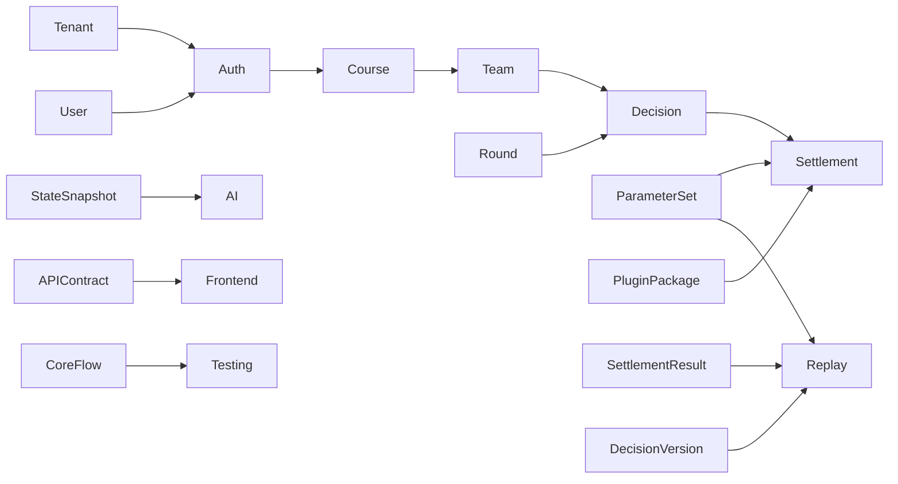

# 文档信息

| 项目 | 内容 |
|---|---|
| 文档名称 | DEVELOPMENT_PLAN.md |
| 项目名称 | SimWar |
| 文档版本 | v1.1 |
| 文档状态 | Draft |
| 最后更新 | 2026-05-16 |
| 适用范围 | MVP / v1.0 / Codex 开发执行 |
| 维护人 | 请根据实际项目修改 |
| 相关文档 | README.md / docs/product/requirements.md / docs/architecture/system-architecture.md / docs/contracts/api-contract.md |

# 开发计划目标

本开发计划用于指导 Codex 和开发团队按阶段完成 SimWar 项目开发，确保各个子系统模块按需求和架构文件落地，避免偏离系统设计。计划明确如何衔接需求、系统架构、API 设计、数据库设计、前端原型、测试策略、DevOps 配置等文档，形成端到端的开发闭环。通过分阶段的小步推进和细致的任务拆解，降低复杂项目的开发风险，确保每个阶段都有可验证的产物和测试验收标准，并通过持续集成流水线和多层次测试保证质量。计划要求 Codex 在生成代码时严格遵守架构约束和接口契约，通过统一的规范提示和 PR 检查清单保证开发质量，每个阶段的完成都以测试通过和审阅通过为条件。最终形成端到端可部署的高质量 MVP 产品。

# 文件与目录规范

Phase 0 的首要目标是统一仓库命名和目录结构。完成本阶段后，根目录只保留项目入口文件、配置文件和一级工程目录；长篇方案、研究材料、接口说明和运维文档全部归入 `docs/`。

## 根目录标准

```text
AGENTS.md                 Codex/Agent 开发规则
README.md                 项目入口说明
DEVELOPMENT_PLAN.md       本开发计划
.gitignore                Git 忽略规则
.env.example              环境变量模板
apps/                     前端应用
services/                 后端服务
packages/                 跨端共享包或 SDK
plugins/                  行业插件
contracts/                机器可读契约
tests/                    跨服务测试
docs/                     文档资料
scripts/                  开发、迁移、验证脚本
.github/                  CI 工作流
```

## 代码目录标准

```text
apps/
  teacher/                教师端应用
  student/                学员端应用
  admin/                  管理端应用
services/
  api/                    主业务 API 服务
  simulation-core/        仿真、结算、评分与真值计算
  agent-gateway/          AI/Agent 调度、权限过滤、输出校验
packages/
  shared-contracts/       前后端共享类型、schema 和常量
plugins/
  wellness/               康养行业插件示例
contracts/
  openapi/                OpenAPI 契约
  schemas/                JSON Schema 契约
tests/
  unit/                   跨包单元测试入口或共享 fixtures
  integration/            集成测试
  contract/               API/Schema 合同测试
  e2e/                    端到端测试
  replay/                 Replay / Shadow Replay 测试
docs/
  product/                需求、用户故事、功能细化
  architecture/           架构、ADR、事件驱动、数据库设计
  contracts/              API、模型、权限契约说明
  frontend/               原型、组件库、状态流
  quality/                测试覆盖、Replay 测试计划
  devops/                 环境、CI/CD、监控、运行手册
  research/               竞品、行业、商业模式研究
```

## 文档命名规则

- 目标文件名使用小写 kebab-case，例如 `api-contract.md`、`system-architecture.md`。
- 根目录入口文件可使用大写惯例：`README.md`、`AGENTS.md`。
- 不再新增带空格、中文标点、重复后缀或项目名前缀的文件名，例如 `SimWar *.md`、`*.md.md`。
- 迁移旧文档时必须维护 `docs/INDEX.md`，记录旧文件名到新路径的映射。
- 每次改动文档引用时，同时更新本开发计划、`README.md` 和相关索引。

## 现有文档迁移目标

| 当前文件 | 目标路径 | 用途 | 优先级 |
|---|---|---|---|
| `SimWar README.md` | `README.md` | 项目概览、开发入口 | 高 |
| `SimWar AGENTS.md` | `AGENTS.md` | Codex/Agent 开发规则 | 高 |
| `SimWar DEVELOPMENT_PLAN.md` | `DEVELOPMENT_PLAN.md` | 开发计划 | 高 |
| `SimWar Requirements.md` | `docs/product/requirements.md` | 产品需求 | 高 |
| `SimWar USER_STORIES.md` | `docs/product/user-stories.md` | 用户故事 | 高 |
| `SimWar FEATURE_REFINEMENT.md` | `docs/product/feature-refinement.md` | 功能细化 | 高 |
| `SimWar SystemArchitecture.md` | `docs/architecture/system-architecture.md` | 系统架构 | 高 |
| `SimWar DATABASE_DESIGN.md` | `docs/architecture/database-design.md` | 数据库设计 | 高 |
| `SimWar EVENT_DRIVEN_ARCHITECTURE.md` | `docs/architecture/event-driven-architecture.md` | 事件驱动架构 | 中 |
| `SimWar ADR.md` | `docs/architecture/adr.md` | 架构决策记录 | 中 |
| `SimWar API Contract.md` | `docs/contracts/api-contract.md` | REST API 契约 | 高 |
| `Sim War  API.md` | `docs/contracts/api-legacy-notes.md` | 旧 API 草案或补充说明 | 中 |
| `SimWar MODEL_ENGINEERING_CONTRACT.md` | `docs/contracts/model-engineering-contract.md` | AI 模型契约 | 中 |
| `STUDENT_ROLE_BASED_ACCESS_AND_DECISION_REFACTOR.md` | `docs/contracts/student-rbac-decision-refactor.md` | 学员权限与决策重构 | 中 |
| `SimWar TEACHER_STUDEN.md` | `docs/frontend/teacher-student-architecture.md` | 教师端/学员端前端架构 | 中 |
| `SimWar FIGMA_PROTOTYPE_SPEC.md.md` | `docs/frontend/figma-prototype-spec.md` | Figma 原型规范 | 中 |
| `SimWar I_COMPONENT_LIBRARY.md` | `docs/frontend/component-library.md` | UI 组件库 | 中 |
| `SimWar FRONTEND_STATE_FLOW.md` | `docs/frontend/frontend-state-flow.md` | 前端状态流 | 中 |
| `SimWar TEST_COV.md` | `docs/quality/test-coverage.md` | 测试覆盖策略 | 中 |
| `SimWar REPLAY_SHADOW_REPLAY_TEST_PLAN.md` | `docs/quality/replay-shadow-replay-test-plan.md` | Replay 测试计划 | 中 |
| `SimWar ENV_SETUP.md.md` | `docs/devops/env-setup.md` | 环境搭建 | 高 |
| `SimWar CI_CD_PIPELINE.md` | `docs/devops/ci-cd-pipeline.md` | CI/CD 设计 | 中 |
| `SimWar MONITORING_ALERTING.md` | `docs/devops/monitoring-alerting.md` | 监控告警 | 中 |
| `SimWar 运行与构建环境.md` | `docs/devops/runtime-build-environment.md` | 运行与构建环境补充 | 中 |
| `SimWar PARAMETER_SET_MANAGEMENT.md` | `docs/architecture/parameter-set-management.md` | 参数集管理 | 中 |
| `SimWar INDUSTRY_PLUGIN_MODEL_REPORT.md` | `docs/architecture/industry-plugin-model-report.md` | 行业插件模型 | 中 |
| `SimWar BPMN_WORKFLOWS.md` | `docs/architecture/bpmn-workflows.md` | 核心业务流程 | 低 |
| `SimWar EXECUTIVE_MODEL_STUDY.md` | `docs/research/executive-model-study.md` | AI 小模型研究 | 低 |
| `SimWar BENCHMARK_REPORT.md` | `docs/research/benchmark-report.md` | 基准研究 | 低 |
| `SimWar CESIM_BENCHMARK.md` | `docs/research/cesim-benchmark.md` | Cesim 竞品研究 | 低 |
| `MARKETPLACE_SIMULATIONS_BENCHMARK.md` | `docs/research/marketplace-simulations-benchmark.md` | Marketplace 竞品研究 | 低 |
| `Marketplace Simulations 深度竞品研究与 SimWar 升级方案.md` | `docs/research/marketplace-simulations-upgrade-plan.md` | 竞品升级方案 | 低 |
| `SimWar NON_FUNCTIONAL_REQUIREMENTS.md` | `docs/product/non-functional-requirements.md` | 非功能需求 | 中 |
| `SimWar 收费与权益授权功能开发文档.md` | `docs/product/billing-entitlement-plan.md` | 收费与权益 | 低 |
| `数据隐私、案例沉淀与社区终身学习规则.md` | `docs/product/data-privacy-case-community-rules.md` | 数据隐私与社区规则 | 中 |

# 核心文档使用策略

| 目标文档 | 主要用途 | 哪些开发阶段必须参考 | Codex 使用方式 | 优先级 |
|---|---|---|---|---|
| `README.md` | 项目概览、技术选型、开发环境说明 | Phase 0 | 首次了解项目定位、目录结构和技术栈 | 高 |
| `AGENTS.md` | Codex 开发规则、真值保护、目录约束 | 全阶段 | 每次任务执行前作为仓库级约束 | 高 |
| `docs/product/requirements.md` | 产品需求、目标用户、核心场景、技术目标 | Phase 0-3 | 设计模块和 API 时查阅业务需求 | 高 |
| `docs/architecture/system-architecture.md` | 系统架构、分层逻辑、多租户隔离、事件驱动、灰度发布 | Phase 0-4 | 实现模块时对照架构和分层约束 | 高 |
| `docs/contracts/api-contract.md` | REST API 定义、请求/响应格式和授权细节 | Phase 2-7 | 实现 API 时查阅契约并同步更新 | 高 |
| `docs/architecture/database-design.md` | 数据库表结构、字段说明、索引和外键 | Phase 1-4 | 创建模型和迁移时遵循表结构 | 高 |
| `docs/product/feature-refinement.md` | 功能细化和业务场景流程 | Phase 1-5 | 分任务时补充业务细节 | 高 |
| `docs/devops/env-setup.md` | 开发和部署环境规范、工具链选型 | Phase 0 | 初始化工具链前确认技术栈 | 高 |
| `docs/devops/ci-cd-pipeline.md` | CI/CD 流水线设计与步骤 | Phase 0, Phase 8 | 配置 PR 检查和发布流水线 | 中 |
| `docs/quality/test-coverage.md` | 测试策略与覆盖要求 | Phase 0, Phase 8 | 编写测试时参考覆盖要求 | 中 |
| `docs/contracts/model-engineering-contract.md` | AI 小模型调用协议、输入输出定义 | Phase 6 | 实现 AI 相关接口和输出格式 | 中 |
| `docs/quality/replay-shadow-replay-test-plan.md` | Replay 与 Shadow Replay 设计与测试要求 | Phase 7 | 实现 Replay 服务和差异计算 | 中 |

以上文档分别在项目不同阶段为开发提供指引。Codex 每次执行任务前，应优先阅读相关文档以获取背景和规范，确保代码实现符合设计要求。Phase 0 完成前，如目标路径尚未迁移完成，可以临时读取对应的旧文件名，但本计划和新增引用必须以目标路径为准。

# 项目总体开发路线图

我们将项目开发分为若干阶段，逐步推进各模块的实现和集成。每个阶段都有明确的目标和产出，以降低风险并确保每一步均可测试验收。

- **Phase 0：文件规范、仓库初始化与工程基线**  
  先统一文件命名、目录结构和技术栈决策，再建立最小工程骨架、基础质量门禁和可验证的启动路径。Phase 0 不追求完整业务能力，目标是让后续 Codex 批次有稳定的文件位置、命令入口和验收标准。

- **Phase 1：基础平台与多租户权限**  
  实现平台租户（Tenant）和用户（User）管理功能，包括身份认证、授权和基于角色的权限控制（RBAC）。设计多租户隔离机制和审计日志功能，确保用户只能访问所属租户的数据并记录所有关键操作。

- **Phase 2：课程、队伍、回合、决策闭环**  
  实现业务流程核心：教师创建课程（Course）、学生组成队伍（Team）并在每个回合（Round）提交经营决策（Decision）。开发回合状态机，支持教师锁定回合触发系统结算。此阶段目标是打通课程管理、团队组建、决策提交和回合控制的完整逻辑。

- **Phase 3：核心仿真引擎与结算**  
  开发仿真引擎模块，包括决策验证（Decision Validator）、特征映射（Feature Mapper）和子引擎（市场需求、运营、财务、计分等）。实现幂等的回合结算流程，将团队决策计算为`StateSnapshot`和`SettlementResult`。此阶段重点构建可复用的仿真核心服务。

- **Phase 4：ScenarioPackage / PluginPackage / ParameterSet**  
  实现场景包（ScenarioPackage）、行业插件包（PluginPackage）和参数集（ParameterSet）的管理功能。支持参数集的版本化、审批和冻结流程，支持插件的注册与调用（例如“康养插件 v1”）。提供 Settlement Hooks 机制，允许插件在结算过程中定制业务逻辑。确保上线前通过 Shadow Replay 机制验证影响。

- **Phase 5：教师端与学员端 MVP**  
  开发教师端和学员端的基础界面与交互功能。教师端包括课程列表、创建课程、队伍管理、回合控制和结算结果查看等；学员端包括我的课程、团队驾驶舱、决策填写和三段式反馈展示。集成后端 API，实现前后端联调，形成闭环的交互流程。

- **Phase 6：AI 小模型 MVP**  
  引入 AI 模型辅助功能，提供 AI 策略建议卡（Strategy Advisor）、AI 风险挑战（Risk Red Team）、AI 复盘教练（Debrief Coach）和学习推荐等功能。开发 AI Orchestrator 服务和相关数据表（CoachOutput、ModelCallLog）。确保 AI 输出仅作为建议，不写入正式决策真值，并严格记录调用日志。

- **Phase 7：Replay / Shadow Replay**  
  构建 Replay 服务，支持基于历史数据对回合进行重算，并生成差异报告（ReplayReport、ReplayDiff）。实现 Shadow Replay 管道，在参数或插件更新前后自动触发回放，并设置差异阈值检测。设计治理审批流程以确认系统改动。确保回放不修改正式结果，只用于验证和治理。

- **Phase 8：测试、CI/CD、监控与发布**  
  编写全面的测试用例（单元、集成、API 合同、E2E、多租户隔离、Replay 测试、AI 边界测试等），完善 CI/CD 流水线和自动化部署步骤。配置监控与告警（API 响应、数据库性能、Replay 结果、AI 调用等指标）。完成冒烟测试和发布文档，确保系统可稳定上线。

# 阶段任务总览表

| 阶段 | 目标 | 核心模块 | 关键产物 | 依赖文档 | 验收方式 |
|---|---|---|---|---|---|
| Phase 0 | 统一文件/目录规范并初始化工程基线 | 文档迁移、目录结构、技术栈决策、最小工具链、基础 CI | 标准目录树、文档索引、技术栈记录、可运行空项目、基础质量门禁 | README.md, AGENTS.md, docs/devops/env-setup.md, docs/devops/ci-cd-pipeline.md | 文件命名统一，目录结构清晰，最小启动/Lint/单测命令可执行 |
| Phase 1 | 多租户、用户认证与权限 | Tenant、User、Auth、RBAC、AuditLog | 租户管理、用户登录、角色权限模块 | docs/product/requirements.md, docs/architecture/system-architecture.md, docs/contracts/api-contract.md | 平台管理员可创建租户和用户，认证登陆正常，权限控制测试通过 |
| Phase 2 | 课程管理、组队与决策 | Course、Team、Round、Decision | Course API、Team API、回合状态机、决策提交功能 | docs/product/feature-refinement.md, docs/architecture/bpmn-workflows.md, docs/contracts/api-contract.md | 教师可创建课程/队伍、学员加入队伍、决策提交、回合锁定后结算触发 |
| Phase 3 | 仿真引擎与结算 | Simulation Engine、DecisionValidator、FeatureMapper、运营/市场/财务/计分引擎、StateSnapshot、SettlementResult | 仿真引擎模块骨架、结算接口、状态快照与结果表 | docs/architecture/system-architecture.md, docs/contracts/model-engineering-contract.md, docs/architecture/industry-plugin-model-report.md | 完成一次仿真计算，生成正确的SettlementResult，幂等性通过测试 |
| Phase 4 | 场景/插件/参数管理 | ScenarioPackage、PluginPackage、ParameterSet | 场景、插件和参数集模型与 API，参数审批流程 | docs/architecture/parameter-set-management.md, docs/architecture/industry-plugin-model-report.md | 场景与插件可创建，参数集审批冻结后无法修改，插件能在结算时生效 |
| Phase 5 | 教师端和学员端 UI | 前端教师界面、前端学员界面、AuthGuard、PermissionGuard | 教师端课程列表、队伍管理、回合控制；学员端课程界面、决策表单、反馈页 | docs/frontend/teacher-student-architecture.md, docs/frontend/figma-prototype-spec.md, docs/frontend/frontend-state-flow.md | 教师端和学员端的关键功能通过UI可用，交互流畅，验收测试通过 |
| Phase 6 | AI 小模型功能 | AI Orchestrator、StrategyAdvisor、RiskRedTeam、DebriefCoach、CoachOutput、ModelCallLog | AI 建议卡、AI风控功能、AI输出日志模块 | docs/research/executive-model-study.md, docs/contracts/model-engineering-contract.md | AI 建议生成正常，不修改正式结果，AI 调用记录入库，AI 边界测试通过 |
| Phase 7 | Replay / Shadow Replay | ReplayService、ReplayRun、ReplayReport、ReplayDiff | Replay 重算服务、差异报告、审核门户 | docs/quality/replay-shadow-replay-test-plan.md, docs/architecture/parameter-set-management.md | Replay 结果与原结果不冲突，超阈值触发人工审核，Shadow Replay 工作正常 |
| Phase 8 | 测试与部署 | 单元测试、集成测试、E2E 测试、CI/CD 管道、监控 | 完整测试用例集、CI/CD 配置、监控告警、部署文档 | docs/quality/test-coverage.md, docs/devops/ci-cd-pipeline.md, docs/devops/monitoring-alerting.md | 所有测试通过，CI/CD 检查点合格，系统部署在预发布环境并验证功能 |

# 详细开发任务拆解

以下按照 Phase 0 至 Phase 8 的顺序拆解任务，每个任务注明阶段、优先级、类型、参考文档等信息，以指导 Codex 分步执行。

### TASK-P0-001：标准化文件命名与文档目录

- **所属阶段：** Phase 0
- **优先级：** P0
- **任务类型：** 文档 / 仓库治理
- **相关文档：** 本文件“文件与目录规范”、`SimWar README.md`, `SimWar AGENTS.md`
- **前置依赖：** 无
- **实现目标：** 将根目录中带项目名前缀、空格、中文标点或重复后缀的文档迁移到标准路径，建立 `docs/INDEX.md` 作为旧文件到新文件的映射索引。
- **需要修改的文件或目录：** `README.md`, `AGENTS.md`, `DEVELOPMENT_PLAN.md`, `docs/INDEX.md`, `docs/**`
- **Codex 执行建议：** 先按迁移表批量规划，再逐个移动文件；移动后用全文搜索修正文档内引用。
- **实现步骤：**
  1. 创建 `docs/product/`, `docs/architecture/`, `docs/contracts/`, `docs/frontend/`, `docs/quality/`, `docs/devops/`, `docs/research/`。
  2. 将 `SimWar README.md` 迁移为 `README.md`，将 `SimWar AGENTS.md` 迁移为 `AGENTS.md`，将当前计划迁移为 `DEVELOPMENT_PLAN.md`。
  3. 按“现有文档迁移目标”表将其余文档移动到 `docs/` 子目录，并改为小写 kebab-case。
  4. 创建 `docs/INDEX.md`，记录每个旧文件名、目标路径、用途和迁移日期。
  5. 使用 `rg "SimWar |\\.md\\.md|API_Contract|TEST_COVERAGE|ENV_SETUP"` 检查残留旧引用。
- **验收标准：** 根目录只保留入口文件、配置文件和一级工程目录；旧文件名引用已更新或在 `docs/INDEX.md` 中明确说明。
- **测试命令：** `rg --files`; `rg "SimWar |\\.md\\.md|API_Contract|TEST_COVERAGE|ENV_SETUP"`
- **风险与注意事项：** 迁移文档时不要丢失内容；若外部链接暂时依赖旧文件名，可在 `docs/INDEX.md` 中记录兼容说明。

### TASK-P0-002：确认 MVP 技术栈与工程边界

- **所属阶段：** Phase 0
- **优先级：** P0
- **任务类型：** 架构 / DevOps
- **相关文档：** `README.md`, `docs/devops/env-setup.md`, `docs/architecture/system-architecture.md`
- **前置依赖：** TASK-P0-001
- **实现目标：** 在安装任何依赖前明确 MVP 技术栈、包管理器、运行方式和首个可运行闭环范围。
- **需要修改的文件或目录：** `docs/devops/tech-stack.md`, `README.md`, `DEVELOPMENT_PLAN.md`
- **Codex 执行建议：** 不要同时保留 Flask/Django、pip/Poetry、Jest/Vitest 等多套互斥方案；每类只选择一个默认方案，并说明替代方案。
- **实现步骤：**
  1. 确认后端语言、框架、包管理器和数据库迁移工具。
  2. 确认前端框架、构建工具、测试工具和 UI 组件策略。
  3. 确认数据库、缓存、消息队列在 MVP 中的最小使用范围。
  4. 写入 `docs/devops/tech-stack.md`，并在 `README.md` 中给出简短入口。
  5. 将本计划中所有命令占位符更新为已确认工具。
- **验收标准：** 新开发者可以从 `README.md` 找到唯一默认技术栈；Phase 0 后续任务不再依赖互斥工具。
- **测试命令：** 文档审查；`rg "Flask/Django|pipenv|Jest \\+ React Testing Library|或"` 检查是否仍存在未决策表达。
- **风险与注意事项：** 技术栈未确定前不要创建真实依赖锁文件，否则后续切换成本会升高。

**执行结果（2026-05-16）：** Phase 0 默认技术栈已写入 `docs/devops/tech-stack.md`。当前落地为 npm workspaces + TypeScript + Vite React + Node 原生 HTTP + Vitest；Python 3.11 保留为仿真内核目标栈，但因当前本机 Python 不可用，`services/simulation-core` 先作为边界占位。

### TASK-P0-003：初始化 Git 与标准目录骨架

- **所属阶段：** Phase 0
- **优先级：** P0
- **任务类型：** DevOps / 仓库初始化
- **相关文档：** `AGENTS.md`, `README.md`
- **前置依赖：** TASK-P0-001
- **实现目标：** 建立标准目录树和 Git 可追踪状态，为后续代码生成提供稳定落点。
- **需要修改的文件或目录：** `.gitignore`, `apps/`, `services/`, `packages/`, `plugins/`, `contracts/`, `tests/`, `docs/`, `scripts/`
- **Codex 执行建议：** 如果当前目录尚不是 Git 仓库，先执行 `git init`；如果已是 Git 仓库，只新增目录与基础文件，不改历史。
- **实现步骤：**
  1. 初始化或确认 Git 仓库。
  2. 创建标准一级目录：`apps/`, `services/`, `packages/`, `plugins/`, `contracts/`, `tests/`, `docs/`, `scripts/`。
  3. 为暂时为空的目录添加 `.gitkeep`，避免目录丢失。
  4. 创建 `.gitignore`，覆盖 Node、Python、IDE、日志、构建产物和本地环境文件。
  5. 提交初始结构：`git add . && git commit -m "chore: initialize repository structure"`。
- **验收标准：** `rg --files` 能看到标准目录入口；`git status --short` 无未预期文件。
- **测试命令：** `rg --files`; `git status --short`
- **风险与注意事项：** 不要在本任务中初始化具体业务代码，保持骨架干净。

### TASK-P0-004：初始化最小后端与前端工程骨架

- **所属阶段：** Phase 0
- **优先级：** P0
- **任务类型：** DevOps / 工程初始化
- **相关文档：** `docs/devops/tech-stack.md`, `docs/devops/env-setup.md`
- **前置依赖：** TASK-P0-002, TASK-P0-003
- **实现目标：** 按已确认技术栈创建可启动的空后端服务和空前端应用，不实现业务功能。
- **需要修改的文件或目录：** `services/api/`, `apps/teacher/` 或 MVP 首个前端应用目录、根级任务入口配置
- **Codex 执行建议：** 只安装运行所必需的最小依赖；不要提前引入 AI、Replay、复杂 UI 组件或生产部署依赖。
- **实现步骤：**
  1. 在 `services/api/` 初始化后端项目，提供健康检查入口，如 `/health`。
  2. 在 `apps/teacher/` 或约定的 MVP 前端目录初始化前端项目，提供空页面或基础 Shell。
  3. 在根目录建立统一命令入口，如 `make dev`、`make lint`、`make test`，或等价的 package/task 脚本。
  4. 更新 `README.md` 的本地启动说明。
- **验收标准：** 后端健康检查可启动，前端应用可启动，根目录有统一命令入口。
- **测试命令：** 以实际技术栈为准，例如 `make dev`, `make test`；若尚无 Makefile，则使用 `README.md` 中声明的等价命令。
- **风险与注意事项：** 不要让前端目录和后端目录各自形成孤立命令；根目录必须有开发者可发现的统一入口。

### TASK-P0-005：配置代码规范、格式化与类型检查

- **所属阶段：** Phase 0
- **优先级：** P0
- **任务类型：** DevOps / 质量门禁
- **相关文档：** `docs/devops/tech-stack.md`, `docs/devops/ci-cd-pipeline.md`
- **前置依赖：** TASK-P0-004
- **实现目标：** 为已确认技术栈配置最小 Lint、Format 和 Typecheck，形成后续 PR 的基础质量门禁。
- **需要修改的文件或目录：** 技术栈对应配置文件、根级任务入口、`README.md`
- **Codex 执行建议：** 只启用低争议规则；避免一开始配置过重导致业务开发被工具噪音阻塞。
- **实现步骤：**
  1. 配置后端格式化、Lint 和类型检查工具。
  2. 配置前端格式化、Lint 和类型检查工具。
  3. 在根目录暴露统一命令：`make lint` 或等价命令。
  4. 更新 `README.md` 说明如何本地运行检查。
- **验收标准：** 空工程或示例代码可通过 Lint、Format Check 和 Typecheck。
- **测试命令：** `make lint` 或 `README.md` 中声明的等价命令。
- **风险与注意事项：** 工具配置必须跟随 TASK-P0-002 的技术栈，不能再出现多套互斥工具并存。

### TASK-P0-006：配置最小测试框架与健康检查测试

- **所属阶段：** Phase 0
- **优先级：** P0
- **任务类型：** 测试 / DevOps
- **相关文档：** `docs/quality/test-coverage.md`, `docs/devops/ci-cd-pipeline.md`
- **前置依赖：** TASK-P0-004
- **实现目标：** 建立后端、前端和跨服务测试的最小可运行框架，并添加健康检查或示例测试。
- **需要修改的文件或目录：** `tests/unit/`, `tests/integration/`, 对应应用或服务的测试目录
- **Codex 执行建议：** 示例测试只验证工程可运行和健康检查，不编造尚未实现的业务规则。
- **实现步骤：**
  1. 为后端添加健康检查测试。
  2. 为前端添加最小渲染测试或构建测试。
  3. 在根目录暴露统一命令：`make test` 或等价命令。
  4. 在 `docs/quality/test-coverage.md` 中标记 Phase 0 覆盖范围。
- **验收标准：** 最小测试命令可在本地稳定通过。
- **测试命令：** `make test` 或 `README.md` 中声明的等价命令。
- **风险与注意事项：** Phase 0 不追求覆盖率指标，只要求测试框架可靠。

### TASK-P0-007：环境变量模板与本地运行入口

- **所属阶段：** Phase 0
- **优先级：** P1
- **任务类型：** DevOps
- **相关文档：** `docs/devops/env-setup.md`
- **前置依赖：** TASK-P0-002, TASK-P0-004
- **实现目标：** 提供 `.env.example` 和本地运行说明，确保开发环境可复制、不可提交真实密钥。
- **需要修改的文件或目录：** `.env.example`, `.gitignore`, `README.md`, `docs/devops/env-setup.md`
- **Codex 执行建议：** 只列出 Phase 0 实际需要的变量；后续模块引入新变量时再追加。
- **实现步骤：**
  1. 创建 `.env.example`，列出数据库、缓存、认证密钥、服务端口等占位变量。
  2. 确认 `.gitignore` 忽略 `.env`、本地密钥、日志和构建产物。
  3. 在 `README.md` 写明复制 `.env.example` 的步骤。
- **验收标准：** 新开发者可以按 `README.md` 创建本地环境变量；仓库不包含真实密钥。
- **测试命令：** `rg "SECRET|PASSWORD|TOKEN|API_KEY" -g "!*.example" -g "!docs/**"`
- **风险与注意事项：** 示例值必须明显是占位值，不能使用真实环境信息。

### TASK-P0-008：基础 CI PR 门禁

- **所属阶段：** Phase 0
- **优先级：** P1
- **任务类型：** DevOps / CI
- **相关文档：** `docs/devops/ci-cd-pipeline.md`
- **前置依赖：** TASK-P0-005, TASK-P0-006
- **实现目标：** 配置最小 PR 检查，运行安装、Lint、类型检查和最小测试，不做部署。
- **需要修改的文件或目录：** `.github/workflows/ci.yml` 或等效 CI 配置
- **Codex 执行建议：** CI 命令必须与 `README.md` 和根级任务入口一致。
- **实现步骤：**
  1. 创建 CI 工作流，触发条件为 `pull_request` 和主分支 `push`。
  2. 安装已确认技术栈依赖。
  3. 运行 `make lint`、`make test` 或等价命令。
  4. 禁止在 Phase 0 CI 中执行自动部署、数据库破坏性操作或生产环境操作。
- **验收标准：** PR 打开后自动执行基础检查，失败时阻止合并。
- **测试命令：** 本地先执行 CI 同款命令；远端通过 PR 验证。
- **风险与注意事项：** CI 不应依赖本地私有路径或未提交的环境变量。

### TASK-P0-009：本地依赖容器化

- **所属阶段：** Phase 0
- **优先级：** P1
- **任务类型：** DevOps
- **相关文档：** `docs/devops/env-setup.md`, `docs/devops/ci-cd-pipeline.md`
- **前置依赖：** TASK-P0-004, TASK-P0-007
- **实现目标：** 只为本地开发所需的外部依赖配置容器，例如数据库和缓存；应用服务镜像可后置到 Phase 8。
- **需要修改的文件或目录：** `docker-compose.yml`, `.env.example`, `docs/devops/env-setup.md`
- **Codex 执行建议：** 初期 `docker-compose.yml` 优先包含数据库、缓存等依赖服务，不强行把前后端应用都容器化。
- **实现步骤：**
  1. 根据技术栈确认数据库和缓存是否进入 MVP。
  2. 创建最小 `docker-compose.yml`，只开放必要端口。
  3. 在 `README.md` 或 `docs/devops/env-setup.md` 写明启动和停止命令。
  4. 验证容器启动后应用能读取连接配置。
- **验收标准：** `docker compose up -d` 能启动本地依赖，`docker compose down` 能干净停止。
- **测试命令：** `docker compose config`; `docker compose up -d`; `docker compose ps`
- **风险与注意事项：** 注意端口冲突；不要把真实密钥写进 Compose 文件。

### TASK-P0-010：开发任务规范与本地 Git Hook

- **所属阶段：** Phase 0
- **优先级：** P2
- **任务类型：** 文档 / DevOps
- **相关文档：** `AGENTS.md`, `docs/devops/ci-cd-pipeline.md`
- **前置依赖：** TASK-P0-005
- **实现目标：** 固化 Codex 任务执行规范、PR 检查清单和可选本地提交钩子。
- **需要修改的文件或目录：** `docs/devops/codex-task-guidelines.md`, `.husky/` 或等效钩子配置
- **Codex 执行建议：** 本地 Hook 只作为开发辅助，真正阻断合并的规则必须在 CI 中实现。
- **实现步骤：**
  1. 编写 `docs/devops/codex-task-guidelines.md`，说明小步修改、测试、文档同步和风险说明格式。
  2. 如技术栈适合，配置轻量 pre-commit Hook 运行格式化或 Lint。
  3. 在 `README.md` 中说明 Hook 安装方式。
- **验收标准：** 开发规范文档可被新开发者和 Codex 直接使用；Hook 不影响未安装者运行 CI。
- **测试命令：** `make lint` 或 Hook 中实际调用的等价命令。
- **风险与注意事项：** Hook 不应运行耗时过长的全量测试，避免降低提交效率。

### TASK-P1-001：设计 Tenant 表结构

- **所属阶段：** Phase 1  
- **优先级：** P0  
- **任务类型：** 数据库  
- **相关文档：** docs/architecture/database-design.md, docs/architecture/system-architecture.md, docs/product/requirements.md  
- **前置依赖：** Phase 0 完成  
- **实现目标：** 创建 `Tenant` 模型和数据库表，用于隔离多租户数据。字段至少包含 `id` (主键)、`name`、`domain`（或标识）以及审计字段（`created_at`, `updated_at`）。  
- **需要修改的文件或目录：** 后端模型文件（如 `models/tenant.py`）和相应的数据库迁移脚本。  
- **Codex 执行建议：** 阅读 docs/architecture/database-design.md 中关于租户的说明，确保在模型中加上必要索引和约束（如 `name` 唯一或 `domain` 唯一）。使用 ORM（如 SQLAlchemy 或 Django ORM）创建模型，并使用迁移工具生成表。  
- **可用插件 / 工具建议：** ORM 的数据库迁移工具（如 Django migrations, Alembic）。  
- **实现步骤：**  
  1. 在后端项目中定义 `Tenant` 模型：添加 `name`, `domain`, `created_at`, `updated_at` 字段，配置主键和索引。  
  2. 使用 ORM 的迁移功能（如 `python manage.py makemigrations` 或 Alembic）生成对应的迁移文件。  
  3. 执行迁移以在数据库中创建 `Tenant` 表。  
  4. 提交模型和迁移：`git add . && git commit -m "Create Tenant model and migration"`.  
- **验收标准：** 数据库中存在 `tenant` 表，字段和约束与设计一致，能成功插入和查询租户记录。  
- **测试命令：** 使用数据库客户端（psql）检查表结构；编写单元测试创建Tenant 实例，验证字段。  
- **风险与注意事项：** 多租户方案需在设计时明确（如单库多租户还是多库）。这里按照单库方案实现 Tenant 列隔离。注意 `name` 或 `domain` 的唯一性，以防重复租户。

### TASK-P1-002：设计 User 表及多租户关联

- **所属阶段：** Phase 1  
- **优先级：** P0  
- **任务类型：** 数据库  
- **相关文档：** docs/architecture/database-design.md, docs/architecture/system-architecture.md  
- **前置依赖：** Tenant 表建立  
- **实现目标：** 创建 `User` 模型和表，字段包含 `id`、`username`、`email`、`password_hash`、外键 `tenant_id` 等，支持多租户关联。  
- **需要修改的文件或目录：** 后端模型文件（如 `models/user.py`）和迁移文件。  
- **Codex 执行建议：** 在 User 模型中增加 `tenant_id` 外键关联 `Tenant` 表，以实现多租户数据隔离。确保邮件或用户名在租户内唯一。  
- **可用插件 / 工具建议：** ORM 迁移工具。  
- **实现步骤：**  
  1. 定义 `User` 模型：字段包括 `username`, `email`, `password_hash`, `tenant_id`（关联到 `Tenant.id`）、`created_at`, `updated_at`。  
  2. 为 `email` 和 `username` 设置组合唯一索引（tenant_id + email 唯一）。  
  3. 生成并运行迁移，确保 `user` 表创建成功并包含外键。  
  4. 提交更改：`git add . && git commit -m "Create User model with tenant FK"`.  
- **验收标准：** `user` 表存在，外键约束正确（测试插入用户时必须指定已存在的 tenant_id）。  
- **测试命令：** ORM 中尝试创建新用户并查询，验证 tenant_id 关联及唯一性约束生效。  
- **风险与注意事项：** 需确保所有后续与用户相关的查询都自动带上 `tenant_id` 条件，否则可能跨租户污染数据。

### TASK-P1-003：实现 RBAC 基础表结构

- **所属阶段：** Phase 1  
- **优先级：** P0  
- **任务类型：** 数据库  
- **相关文档：** docs/product/requirements.md, docs/architecture/system-architecture.md  
- **前置依赖：** User 表  
- **实现目标：** 设计角色(Role)与权限(Permission)表，以及关联表(UserRole、RolePermission)实现 RBAC。角色表包含`id`、`name`；权限表包含`id`、`action`、`resource`。  
- **需要修改的文件或目录：** 后端模型文件（`models/role.py`, `models/permission.py`）和迁移文件。  
- **Codex 执行建议：** 参考 docs/product/requirements.md 中“角色与用户画像”表，设置基础角色（管理员、教师、学员等）。实现多对多关系：用户-角色、角色-权限。  
- **可用插件 / 工具建议：** ORM 迁移工具。  
- **实现步骤：**  
  1. 定义 `Role` 模型：字段 `id`, `name`, `tenant_id`（可选，支持租户级角色）以及 `created_at`, `updated_at`。  
  2. 定义 `Permission` 模型：字段 `id`, `action`, `resource`（如 "course:create"）。  
  3. 定义中间表 `UserRole` (user_id, role_id) 和 `RolePermission` (role_id, permission_id) 实现多对多。  
  4. 生成并执行迁移创建表。  
  5. 提交更改：`git add . && git commit -m "Create RBAC tables (Role, Permission, UserRole, RolePermission)"`.  
- **验收标准：** 数据库中存在角色和权限相关表，关系正确。可以手动插入角色和权限，并通过关联表链接。  
- **测试命令：** 写测试：为某个用户分配角色，并验证具有相应权限。确保查询逻辑可获取用户权限集。  
- **风险与注意事项：** 需要计划角色与权限粒度，避免过多冗余表。初版可使用有限数量的角色后续再细化。

### TASK-P1-004：实现身份认证 API

- **所属阶段：** Phase 1  
- **优先级：** P0  
- **任务类型：** 后端  
- **相关文档：** docs/contracts/api-contract.md, docs/product/requirements.md  
- **前置依赖：** User 表, RBAC 表  
- **实现目标：** 实现登录（Login）和注销（Logout）API，包括用户凭证验证（如用户名/邮箱 + 密码）并返回身份令牌（如 JWT）。  
- **需要修改的文件或目录：** 后端控制器/视图（如 `auth_controller.py`），以及相关路由和配置文件。  
- **Codex 执行建议：** 阅读 docs/contracts/api-contract.md 中的 Auth 相关接口定义。使用安全库（bcrypt, JWT）检查密码并生成 token。  
- **可用插件 / 工具建议：** JWT 库、加密库。  
- **实现步骤：**  
  1. 在后端定义 `/login` POST 接口，接收用户名/邮箱和密码。  
  2. 查询数据库校验用户凭证：使用 bcrypt 等比较密码哈希。  
  3. 如果认证成功，生成 JWT（包含 user_id 和 tenant_id、角色等信息）并返回。  
  4. 可选 `/logout` 接口（如使用黑名单方式或前端删除 token）。  
  5. 更新 API 文档（OpenAPI）以加入登录接口。  
  6. 提交更改：`git add . && git commit -m "Implement login API"`.  
- **验收标准：** 提交有效凭证时返回有效的身份令牌，无效凭证返回错误。通过测试可获取 token 并用于后续授权。  
- **测试命令：** 使用 Postman 或自动化测试发送登录请求，验证返回 token 的合法性。  
- **风险与注意事项：** 确保密码安全存储（使用足够强度的哈希算法），JWT 秘钥保密。避免在返回内容中泄露敏感信息。实现登出时考虑无状态 token 的处理策略。

### TASK-P1-005：实现权限校验中间件

- **所属阶段：** Phase 1  
- **优先级：** P0  
- **任务类型：** 后端  
- **相关文档：** docs/contracts/api-contract.md, docs/architecture/system-architecture.md  
- **前置依赖：** 登录认证实现  
- **实现目标：** 添加后端请求中间件或装饰器，实现权限校验。包括验证请求中的 JWT，提取用户身份和角色信息，并根据接口配置检查用户是否有权限访问。  
- **需要修改的文件或目录：** 后端中间件文件（如 `auth_middleware.py` 或框架自带机制）。相关API处理函数也要加入权限装饰器。  
- **Codex 执行建议：** 在每个需要保护的路由前添加授权检查。根据用户角色查询其权限列表并判断是否拥有访问资源的权限。  
- **可用插件 / 工具建议：** 验证库（JWT 中间件），自定义权限检查函数。  
- **实现步骤：**  
  1. 实现一个 JWT 验证中间件：解码请求头中的 token，验证签名，解析出 user_id、tenant_id、角色等。  
  2. 实现权限检查装饰器（或注解）：根据请求的接口定义（可通过配置映射）检查用户角色是否包含对应权限。  
  3. 在需要的控制器上应用装饰器，如课程相关接口需 `role:teacher` 或更高权限。  
  4. 针对无权限或未登录的请求返回 401/403 错误。  
  5. 提交更改：`git add . && git commit -m "Add auth middleware and permission checks"`.  
- **验收标准：** 带有有效 token 的请求能通过验证，无 token 或权限不足的请求被拦截并返回相应错误码。  
- **测试命令：** 自动化测试：对开放接口与受限接口分别发送请求，验证权限拦截效果。  
- **风险与注意事项：** 注意中间件执行顺序，确保所有受保护的路由都经过校验。避免硬编码权限检查逻辑，应集中管理权限映射以便维护。

### TASK-P1-006：实现多租户隔离逻辑

- **所属阶段：** Phase 1  
- **优先级：** P0  
- **任务类型：** 后端  
- **相关文档：** docs/architecture/system-architecture.md, docs/product/requirements.md  
- **前置依赖：** Tenant、User 表；权限中间件  
- **实现目标：** 确保所有业务数据查询和操作都限定在当前租户范围内，防止跨租户访问。通常在每个查询层添加 `WHERE tenant_id = 当前租户ID`。  
- **需要修改的文件或目录：** 后端服务层或 ORM 层，数据库访问代码。  
- **Codex 执行建议：** 在数据库操作函数中自动加上租户过滤，比如通过ORM的Query过滤器或在模型的默认查询中添加条件。登录后将 `tenant_id` 存入上下文，使用该值进行过滤。  
- **可用插件 / 工具建议：** ORM 查询构造器或多租户库（如 Django 的 django-tenant-schemas，如果可用）  
- **实现步骤：**  
  1. 在用户登录后将用户所属的 `tenant_id` 存储在请求上下文（如 `g.tenant_id`）。  
  2. 修改所有增删改查操作：在创建新记录时自动填充 `tenant_id`；在查询数据时附加过滤条件为当前租户。  
  3. 对通用查询接口（如列表查询）确保只能返回所属租户的数据。  
  4. 提交更改并加强代码审查，重点校验多租户过滤是否无遗漏。  
- **验收标准：** 同一 API 在不同租户账号登录时只能看到各自租户的数据，尝试使用 A 租户的 token 访问 B 租户数据应失败。  
- **测试命令：** 编写测试：创建两个租户和用户，分别在每个租户下创建资源，验证隔离性。  
- **风险与注意事项：** 多租户逻辑容易遗漏字段过滤点，应尽量在 ORM 层统一处理，减少人为错误。审计日志要记录 `tenant_id` 以便追踪归属。字段级隔离（如用户只能编辑本租户课程）要明确规则。

### TASK-P1-007：初始化权限角色初始数据

- **所属阶段：** Phase 1  
- **优先级：** P1  
- **任务类型：** 后端  
- **相关文档：** docs/product/requirements.md  
- **前置依赖：** RBAC 表结构  
- **实现目标：** 为系统预先创建基本角色和权限，例如“平台管理员”、“教师”、“学员”、“企业管理员”等角色，以及对应的权限集。可通过数据库种子或迁移脚本执行。  
- **需要修改的文件或目录：** 数据库迁移或种子脚本目录（如 `migrations/seed.py`）。  
- **Codex 执行建议：** 查看 docs/product/requirements.md 中角色描述和目标，根据业务需求为每个角色分配必要权限，如教师可管理课程、查看学生决策等。  
- **可用插件 / 工具建议：** ORM 的数据迁移或种子工具。  
- **实现步骤：**  
  1. 编写脚本或迁移文件，在 `Role` 表中插入角色记录（管理员、教师、学员、企业管理员等）。  
  2. 在 `Permission` 表中插入预定义权限项（例如 `course:create`, `decision:submit` 等）。  
  3. 建立 `RolePermission` 关联，将权限分配给角色。  
  4. 提交更改：`git add . && git commit -m "Seed initial roles and permissions"`.  
- **验收标准：** 数据库中的 `role` 表包含预定义角色，`role_permission` 表中角色与权限关联正确。  
- **测试命令：** 查询角色和权限表验证数据正确；为测试用户分配角色并验证其权限是否匹配预期。  
- **风险与注意事项：** 权限模型设计完成后再细化角色权限分配较好，避免提前定制过多可能变动的权限。确保脚本可多次安全执行（幂等性），或采用 idempotent 数据迁移框架。

### TASK-P1-008：实现审计日志表与记录

- **所属阶段：** Phase 1  
- **优先级：** P1  
- **任务类型：** 后端 / 数据库  
- **相关文档：** docs/architecture/system-architecture.md, docs/product/requirements.md  
- **前置依赖：** 用户认证与权限系统  
- **实现目标：** 创建 `AuditLog` 表，记录所有重要的写操作（创建、修改、删除）的日志，包括操作实体、操作类型、操作者、时间戳。每个写操作接口执行后写入日志。  
- **需要修改的文件或目录：** 后端模型 (`models/audit_log.py`) 与表迁移，业务逻辑层插入日志语句，或使用数据库触发器。  
- **Codex 执行建议：** 定义 `AuditLog` 模型字段，如 `id`, `tenant_id`, `user_id`, `entity`, `entity_id`, `action`, `timestamp`, `old_value`, `new_value` 等。修改控制器逻辑，在完成数据库写操作后调用写日志函数。  
- **可用插件 / 工具建议：** 也可以考虑使用现成审计库或事件系统。  
- **实现步骤：**  
  1. 定义 `AuditLog` 表字段并生成迁移。  
  2. 在后端服务中封装一个记录审计日志的函数（接受实体、操作类型、用户等）。  
  3. 在所有写操作的地方调用审计记录，例如课程创建、用户修改等关键接口。  
  4. 提交更改：`git add . && git commit -m "Add AuditLog table and recording"`.  
- **验收标准：** 对用户、课程、决策等关键写操作执行后，在 `audit_log` 表中出现对应记录。  
- **测试命令：** 手动或自动化测试：执行一次资源创建/更新接口，然后查询 `audit_log` 验证正确记录。  
- **风险与注意事项：** 审计日志写入可能影响性能，应尽量异步或批量记录。确保日志表不易被普通操作覆盖；如果预算充足，可在数据库层面使用触发器进行记录。

### TASK-P1-009：添加字段级权限检查

- **所属阶段：** Phase 1  
- **优先级：** P2  
- **任务类型：** 后端  
- **相关文档：** docs/product/requirements.md  
- **前置依赖：** 权限体系基本就绪  
- **实现目标：** 实现对敏感字段的访问控制（例如只有平台管理员可修改租户级字段、企业管理员不能修改平台全局配置等）。根据角色粒度对某些字段进行限制。  
- **需要修改的文件或目录：** API 控制层或模型序列化逻辑中，针对特定字段添加检查。  
- **Codex 执行建议：** 根据业务需求，找出需要细粒度控制的字段（例如 `tenant` 表中的配置字段、`User` 的角色字段等）。在更新接口中加入校验逻辑。  
- **可用插件 / 工具建议：** 自定义函数或基于 ORM 的事件监听。  
- **实现步骤：**  
  1. 在修改用户、租户等接口前检查当前用户角色，如非管理员禁止修改特定字段。  
  2. 如果业务规则复杂，可在模型的 `save()` 钩子中进行字段检查。  
  3. 编写对应的异常处理，返回 403 Forbidden。  
  4. 提交更改：`git add . && git commit -m "Add field-level permission checks"`.  
- **验收标准：** 角色不同的用户尝试修改受限字段时被正确拒绝，其他字段修改正常。  
- **测试命令：** 自动化测试模拟不同角色的用户访问修改接口，验证授权逻辑。  
- **风险与注意事项：** 字段级权限容易遗漏边界情况，应逐个字段评审，避免出现未经检查的漏洞。开始以最严格的逻辑实现，然后根据实际需求放宽。

### TASK-P1-010：租户管理员模块（可选）

- **所属阶段：** Phase 1  
- **优先级：** P1  
- **任务类型：** 后端 / 前端  
- **相关文档：** docs/frontend/teacher-student-architecture.md  
- **前置依赖：** Tenant、User 功能就绪  
- **实现目标：** 实现平台管理员在后台管理系统中新建租户（Tenant）的功能，包括 API 接口和简单的前端（如管理控制台界面）。  
- **需要修改的文件或目录：** 后端新增 Tenant 管理接口，前端可添加管理页面（基于后端提供的接口）。  
- **Codex 执行建议：** 平台管理员权限很高，应在权限校验中允许其操作。参考 docs/architecture/system-architecture.md 中“平台管理员”角色描述。  
- **可用插件 / 工具建议：** 前端路由和页面模板工具。  
- **实现步骤：**  
  1. 后端：在 API 中添加创建租户接口 `POST /admin/tenants`，只有平台管理员可调用。  
  2. 前端：在管理后台页面添加“创建租户”表单，调用上述 API。  
  3. 测试：平台管理员账号登录后能看到创建租户按钮并成功创建。  
  4. 提交更改：`git add . && git commit -m "Add tenant creation API and admin UI"`.  
- **验收标准：** 平台管理员可以通过前端或 API 创建新的租户，且此操作记录在审计日志中。其他角色无法进行该操作。  
- **测试命令：** 手动或自动化测试平台管理员用户调用租户创建接口，验证租户表中有新记录。  
- **风险与注意事项：** 确保只有**超级管理员**有此权限，否则普通教师等不应看到或调用该接口。前端路由须做权限守卫。

### TASK-P1-011：多租户隔离的自动化测试

- **所属阶段：** Phase 1  
- **优先级：** P1  
- **任务类型：** 测试  
- **相关文档：** docs/quality/test-coverage.md  
- **前置依赖：** 多租户逻辑已实现  
- **实现目标：** 编写自动化测试用例，验证数据隔离。创建多个租户和用户，在每个租户下进行数据操作，确保跨租户访问被正确隔离。  
- **需要修改的文件或目录：** 测试目录下新增测试文件（如 `tests/test_multi_tenancy.py`）。  
- **Codex 执行建议：** 使用测试框架（pytest）编写脚本：模拟租户 A、租户 B，各自创建用户和资源，然后尝试 A 用户访问 B 的资源并验证失败。  
- **可用插件 / 工具建议：** 测试运行工具（pytest）。  
- **实现步骤：**  
  1. 在 `services/api/tests/` 目录下创建多租户测试文件。  
  2. 在测试中使用事务隔离或回滚机制，分别创建 Tenant A、Tenant B，创建用户 UA（租户 A）和 UB（租户 B）。  
  3. UA 创建资源（如 Course），UB 创建资源。然后测试 UA 是否能访问 UB 的资源（应失败），反之亦然。  
  4. 运行测试，确保多租户隔离逻辑生效。  
- **验收标准：** 多租户隔离测试通过；若尝试跨租户获取或修改数据，接口返回 Forbidden 或空结果。  
- **测试命令：** `pytest services/api/tests/test_multi_tenancy.py`。  
- **风险与注意事项：** 如果应用程序逻辑不完善，可能会导致租户数据泄露。该测试对于验证之前逻辑的正确性非常重要，需在后续开发中持续运行。

### TASK-P1-012：更新 API 文档与 Contract

- **所属阶段：** Phase 1  
- **优先级：** P2  
- **任务类型：** 文档  
- **相关文档：** docs/contracts/api-contract.md  
- **前置依赖：** Auth/API 已实现  
- **实现目标：** 将新增的认证和权限接口（如 `/login`、租户创建、用户管理等）更新到 API 合同文档（OpenAPI/Swagger）。确保前后端、测试都以最新 API 文档为依据。  
- **需要修改的文件或目录：** `docs/contracts/api-contract.md` 或与之关联的 OpenAPI 配置文件（如 `api.yaml`）。  
- **Codex 执行建议：** 确认文档中新接口的路径、请求/响应格式、需要的权限清晰。  
- **可用插件 / 工具建议：** 文本编辑，或 OpenAPI 编辑器。  
- **实现步骤：**  
  1. 在 docs/contracts/api-contract.md 中新增认证相关部分，或更新 OpenAPI spec 文件。  
  2. 包括：登录请求示例、返回值示例；租户创建接口字段说明。  
  3. 提交更改：`git add . && git commit -m "Update API contract with auth and tenant endpoints"`.  
- **验收标准：** API 文档中包含所有新增接口的描述，前端开发者能根据文档调用接口。文档语法正确。  
- **测试命令：** 如果使用自动化 API 测试工具，可运行 `npm run api:test`（或等效）确保接口符合文档。  
- **风险与注意事项：** 确保文档与实际实现同步，避免误导开发。文档更新后需通知相关人员。

**执行结果（2026-05-17）：** Phase 1 长链条已按当前 TypeScript 技术栈落地为本地可运行版本：`services/api` 新增 PBKDF2 密码哈希、HMAC 签名 session token、Tenant/User/RBAC/Permission/Session/AuditLog 领域模型、JSON 快照持久化、权限中间件、跨租户边界检查和真值字段写入保护；`apps/admin` 新增最小管理后台；教师端和学员端改为真实登录 token 流；OpenAPI 与 JSON Schema 已补充 P1 契约；`tests/integration/p1-auth-rbac.test.ts` 覆盖租户创建、用户创建、RBAC 越权拦截、session 吊销、审计过滤和真值字段拒绝。生产数据库迁移、企业 SSO、SCIM、MFA 和正式审计导出仍后置。

### TASK-P2-001：定义 Course 模型与迁移

- **所属阶段：** Phase 2  
- **优先级：** P0  
- **任务类型：** 数据库  
- **相关文档：** docs/architecture/database-design.md, docs/product/feature-refinement.md  
- **前置依赖：** Tenant, User 表、Auth 系统  
- **实现目标：** 创建 `Course` 模型和表，用于存储课程（比赛）信息，包括课程名称、描述、所属租户、所属教师 (creator)、当前状态等字段。  
- **需要修改的文件或目录：** 后端模型文件（`models/course.py`）和对应的迁移文件。  
- **Codex 执行建议：** 阅读 docs/product/feature-refinement.md 中关于课程的属性描述。一般字段包括：`id`, `name`, `description`, `tenant_id`, `teacher_id`, `status`, `created_at`, `updated_at`。添加必要的外键关联（Tenant, User）。  
- **可用插件 / 工具建议：** ORM 迁移工具。  
- **实现步骤：**  
  1. 定义 `Course` 模型：字段 `name` (课程名)、`description`、`tenant_id` (FK)、`teacher_id` (FK 指向 User 表)、`rounds`(回合数或默认回合状态)、`status`(例如 "CREATED","OPEN","FINISHED")、时间戳等。  
  2. 生成并运行迁移，创建 `course` 表。  
  3. 提交更改：`git add . && git commit -m "Create Course model and migration"`.  
- **验收标准：** 数据库中创建了 `course` 表，字段正确且与 ORM 模型一致。可插入测试课程数据。  
- **测试命令：** 在交互模式或测试脚本中创建 `Course` 实例，查询并校验字段。  
- **风险与注意事项：** 确保课程表有租户隔离字段 `tenant_id`，只有对应教师和租户下的用户可管理该课程。`status` 字段可参照状态机需求后续完善。

### TASK-P2-002：实现 Course API (CRUD)

- **所属阶段：** Phase 2  
- **优先级：** P0  
- **任务类型：** 后端  
- **相关文档：** docs/contracts/api-contract.md, docs/architecture/bpmn-workflows.md, docs/product/feature-refinement.md  
- **前置依赖：** Course 模型, Auth 权限  
- **实现目标：** 实现课程的创建、列表、详情、更新、删除接口，确保只能在拥有相应权限的情况下调用（如教师可创建和管理自己课程）。  
- **需要修改的文件或目录：** 后端控制器/视图（如 `course_controller.py`），路由注册（如 `routes.py`）。  
- **Codex 执行建议：** 参考 docs/contracts/api-contract.md 中 Course 相关接口定义。创建课程时自动关联当前用户为 `teacher_id`，并设置 `tenant_id`。列表接口仅返回当前租户下、当前用户相关的课程。  
- **可用插件 / 工具建议：** 已有的 Auth 中间件。  
- **实现步骤：**  
  1. 实现 `POST /courses`：获取请求体中的课程信息，使用当前登录用户 ID 填充 `teacher_id`，保存课程。  
  2. 实现 `GET /courses`：返回当前租户的课程列表，教师仅返回自己创建的课程或有权限查看的课程。  
  3. 实现 `GET /courses/{id}`、`PUT /courses/{id}`、`DELETE /courses/{id}`：分别获取、更新、删除指定课程，校验课程归属和权限。  
  4. 添加对应的序列化/反序列化逻辑。  
  5. 提交更改：`git add . && git commit -m "Implement Course CRUD API"`.  
- **验收标准：** 教师用户能够创建课程并在列表中查看；只能查看自己创建的课程。更新和删除受权限检查保护。  
- **测试命令：** 使用 Postman 或自动化测试：教师创建课程后查询列表，验证新课程出现；尝试用其他角色或租户访问失败。  
- **风险与注意事项：** 确保 Course API 中始终带有租户过滤和教师权限校验，否则会导致数据泄露或越权。考虑课程删除是否级联删除关联数据（或软删除）。

### TASK-P2-003：定义 Team 和 TeamMember 模型

- **所属阶段：** Phase 2  
- **优先级：** P0  
- **任务类型：** 数据库  
- **相关文档：** docs/architecture/database-design.md, docs/product/feature-refinement.md  
- **前置依赖：** Course 表  
- **实现目标：** 创建 `Team` 模型（属于某课程）和 `TeamMember` 模型（连接用户和团队）。`Team` 字段包括 `id`, `name`, `course_id`, `tenant_id`等；`TeamMember` 包含 `id`, `team_id`, `user_id`。  
- **需要修改的文件或目录：** 后端模型文件（如 `models/team.py`, `models/team_member.py`）和迁移脚本。  
- **Codex 执行建议：** 在 `Team` 模型中添加外键 `course_id`，在创建团队时使用当前课程上下文；`TeamMember` 模型为多对多关系桥表。  
- **可用插件 / 工具建议：** ORM 迁移工具。  
- **实现步骤：**  
  1. 定义 `Team` 模型：包含 `name`, `course_id` (FK), `tenant_id`, 时间戳等字段。  
  2. 定义 `TeamMember` 模型：`team_id` (FK), `user_id` (FK), 以及可选的 `joined_at` 时间戳。  
  3. 生成并执行迁移，创建相应表。  
  4. 提交更改：`git add . && git commit -m "Create Team and TeamMember models"`.  
- **验收标准：** 表成功创建，通过 ORM 能够关联课程和团队、团队和用户。  
- **测试命令：** 使用数据库查询创建一个团队并添加成员，验证关联正确。  
- **风险与注意事项：** 确定一人只能加入一个团队（业务规则），如果有此要求，可在 `TeamMember` 或业务逻辑中验证。同学员可以退出团队时逻辑也需考虑。

### TASK-P2-004：实现 Team API

- **所属阶段：** Phase 2  
- **优先级：** P0  
- **任务类型：** 后端  
- **相关文档：** docs/contracts/api-contract.md, docs/product/feature-refinement.md  
- **前置依赖：** Team、TeamMember 模型  
- **实现目标：** 实现团队相关接口，包括创建团队（教师操作）、添加成员（学员自行加入或教师邀请）、删除团队等功能。  
- **需要修改的文件或目录：** 后端控制器/路由（如 `team_controller.py`）。  
- **Codex 执行建议：** 在教师端允许创建团队并查看团队列表，在学员端允许加入可见团队。参考 API 合同中团队相关定义。  
- **可用插件 / 工具建议：** Auth 权限校验，前端调用接口时权限过滤。  
- **实现步骤：**  
  1. `POST /teams`：教师为指定课程创建团队，记录 `name`, `course_id`, `tenant_id`。  
  2. `GET /courses/{course_id}/teams`：获取指定课程所有团队列表，教师和学员可见。  
  3. `POST /teams/{team_id}/members`：将学员加入团队，学生自己调用或教师代为添加。写入 `TeamMember`。  
  4. `DELETE /teams/{team_id}`：删除团队（教师权限）。  
  5. 提交更改：`git add . && git commit -m "Implement Team API"`.  
- **验收标准：** 教师可为课程创建团队，查看团队；学员可加入团队并在查询中看到自己加入的团队；权限控制生效。  
- **测试命令：** 自动化测试：创建团队、加入成员的 API 测试。确保跨课程或跨租户无效请求失败。  
- **风险与注意事项：** 团队人数限制和成员管理（添加/移除）规则后续可完善。当前确保基本功能正常。

### TASK-P2-005：定义 Round 模型与状态机

- **所属阶段：** Phase 2  
- **优先级：** P0  
- **任务类型：** 数据库  
- **相关文档：** docs/architecture/database-design.md, docs/architecture/bpmn-workflows.md  
- **前置依赖：** Course 表  
- **实现目标：** 创建 `Round` 模型，表示课程中的每一轮决策。字段包括 `id`, `course_id`, `round_number`, `status` (如 "OPEN", "LOCKED", "SETTLED")，以及时间戳。  
- **需要修改的文件或目录：** 后端模型文件（`models/round.py`）与迁移脚本。  
- **Codex 执行建议：** 参考 docs/architecture/bpmn-workflows.md 中的回合状态流程。定义 `status` 枚举或字符串字段。确保状态转换逻辑清晰。  
- **可用插件 / 工具建议：** ORM 迁移工具。  
- **实现步骤：**  
  1. 定义 `Round` 模型：字段 `course_id` (FK)、`round_number`, `status`, 时间戳。  
  2. 生成并运行迁移创建 `round` 表。  
  3. 提交更改：`git add . && git commit -m "Create Round model and migration"`.  
- **验收标准：** 数据库有 `round` 表，能够插入初始回合数据。`status` 字段可更新验证流程。  
- **测试命令：** 在 DB 中手动插入一个 Round 记录，测试状态更新。  
- **风险与注意事项：** 需保证同一课程不能存在多个相同编号的回合，也可能需要保证仅一个回合处于 OPEN 状态（可在业务逻辑中限制）。

### TASK-P2-006：实现 Round 管理 API

- **所属阶段：** Phase 2  
- **优先级：** P1  
- **任务类型：** 后端  
- **相关文档：** docs/contracts/api-contract.md, docs/architecture/bpmn-workflows.md  
- **前置依赖：** Round 模型, 权限系统  
- **实现目标：** 实现回合相关接口，包括开启新回合、锁定当前回合（触发结算）等功能。  
- **需要修改的文件或目录：** 后端控制器/路由（`round_controller.py`）。  
- **Codex 执行建议：** 按照 BPMN 工作流程，教师在课程页面依次开启/锁定回合。接口如 `POST /courses/{course_id}/rounds` (新建) 和 `POST /rounds/{id}/lock` (锁定)。  
- **可用插件 / 工具建议：** Auth 中间件确保教师权限。  
- **实现步骤：**  
  1. `POST /courses/{course_id}/rounds`：为课程开启下一轮，状态设为 OPEN，`round_number` 为课程已有轮次+1。  
  2. `POST /rounds/{round_id}/lock`：将指定回合状态从 OPEN 置为 LOCKED，并调用结算逻辑（或由前端触发）。  
  3. `GET /courses/{course_id}/rounds`：列出该课程所有回合及状态。  
  4. 提交更改：`git add . && git commit -m "Implement Round management API"`.  
- **验收标准：** 教师可以依次开启和锁定回合，锁定后回合状态正确。  
- **测试命令：** API 测试：创建回合并锁定，验证状态字段及不能重复锁定。  
- **风险与注意事项：** 锁定操作要幂等，重复锁定不应导致错误或重复触发结算。可在后端增加检查仅可锁定 OPEN 状态的回合。

### TASK-P2-007：定义 Decision 与 DecisionVersion 模型

- **所属阶段：** Phase 2  
- **优先级：** P0  
- **任务类型：** 数据库  
- **相关文档：** docs/architecture/database-design.md, docs/product/feature-refinement.md  
- **前置依赖：** Team、Round 表  
- **实现目标：** 创建 `Decision` 模型和 `DecisionVersion` 模型，实现团队决策版本记录。`Decision` 存储团队在某回合的决策概览，`DecisionVersion` 存储每次提交的数据快照。  
- **需要修改的文件或目录：** 后端模型文件（如 `models/decision.py`, `models/decision_version.py`）与迁移脚本。  
- **Codex 执行建议：** 参考 FeatureRefinement.md 中决策流程，`Decision` 包含 `team_id`, `round_id`, `submitted_at`；`DecisionVersion` 包含 `decision_id`, `version_number`, `data_json`（存储决策内容）。设置决策为追加写模式，历史记录不可删改。  
- **可用插件 / 工具建议：** ORM 迁移工具。  
- **实现步骤：**  
  1. 定义 `Decision` 模型：`team_id` (FK), `round_id` (FK), `latest_version_id` (FK), `status` (optional), `tenant_id`。  
  2. 定义 `DecisionVersion` 模型：`decision_id` (FK), `version_number` (自增), `data_json` (存储提交的决策内容), `submitted_at`。  
  3. 创建迁移并执行。  
  4. 提交更改：`git add . && git commit -m "Create Decision and DecisionVersion models"`.  
- **验收标准：** 两张表创建成功，能够插入多版本数据。通过 ORM 验证可查询每个团队每轮的所有决策版本。  
- **测试命令：** 写测试：为同一团队、同一回合提交两次决策，验证 `DecisionVersion` 表中出现两条记录，并更新 `Decision.latest_version_id`。  
- **风险与注意事项：** 决策内容可能很复杂（多字段、多值），建议存储为 JSON 或结构化字段。确保不同版本可追溯，不应覆盖历史。

### TASK-P2-008：实现 决策提交 API

- **所属阶段：** Phase 2  
- **优先级：** P0  
- **任务类型：** 后端  
- **相关文档：** docs/contracts/api-contract.md, docs/product/feature-refinement.md  
- **前置依赖：** Decision 模型  
- **实现目标：** 实现团队决策提交接口，允许学员提交或更新当前回合的团队决策。每次提交创建新的 DecisionVersion，并更新 Decision 状态。  
- **需要修改的文件或目录：** 后端控制器/路由（`decision_controller.py`）。  
- **Codex 执行建议：** 参考 API 合同中决策提交格式。判断是否已有 `Decision`，若无则创建；然后在 `DecisionVersion` 中插入新版本。示例接口：`POST /rounds/{round_id}/teams/{team_id}/decision`。  
- **可用插件 / 工具建议：** 数据验证工具（JSON schema）。  
- **实现步骤：**  
  1. 检查当前回合是否可以提交（状态为 OPEN）。  
  2. 查找或创建 `Decision` 记录。  
  3. 在 `DecisionVersion` 中插入新版本记录，字段包括版本号（自动累加）、提交数据和时间戳。  
  4. 将 `Decision.latest_version_id` 更新为新插入版本的 ID。  
  5. 返回提交成功响应。  
  6. 提交更改：`git add . && git commit -m "Implement decision submission API"`.  
- **验收标准：** 团队成员提交决策时接口返回成功，数据库中生成新的 `DecisionVersion` 记录。后续提交时版本号自增。  
- **测试命令：** 编写集成测试：调用该接口并验证返回结果及数据库变化。确保错误情况下（如回合已锁定）拒绝提交。  
- **风险与注意事项：** 决策数据校验至关重要，避免非法数据。若多个成员同时提交，需要保证版本自增和数据一致性，可使用事务。

### TASK-P2-009：教师端锁轮操作 API

- **所属阶段：** Phase 2  
- **优先级：** P1  
- **任务类型：** 后端  
- **相关文档：** docs/contracts/api-contract.md, docs/architecture/bpmn-workflows.md  
- **前置依赖：** Round 和 Decision 实现  
- **实现目标：** 实现教师锁定当前回合的接口，触发系统开始结算流程。通常为 `POST /rounds/{round_id}/lock`。将该回合状态标记为 LOCKED，并可能触发后台任务进行仿真结算。  
- **需要修改的文件或目录：** 后端控制器（如 `round_controller.py`）新增锁定函数。  
- **Codex 执行建议：** 查看 BPMN 流程，确保只有当前课程的教师才可调用。设置状态转换为 LOCKED，并在返回结果中提示后台已开始结算。  
- **可用插件 / 工具建议：** 后台任务调度工具（后续 Phase3 使用）。  
- **实现步骤：**  
  1. 在回合尚未结算前（状态为 OPEN）执行锁定操作。  
  2. 更新 `Round.status = 'LOCKED'` 并保存。  
  3. 调用结算服务或发送事件（例如推送消息给结算队列）。  
  4. 返回操作结果。  
  5. 提交更改：`git add . && git commit -m "Implement round lock API"`.  
- **验收标准：** 教师调用锁定接口后，回合在数据库中状态变为 LOCKED。学生无法再提交该回合决策。  
- **测试命令：** 自动化测试：调用锁定接口两次，确认第一次成功、第二次因为非 OPEN 状态失败。验证数据库状态变化。  
- **风险与注意事项：** 锁定操作应幂等且有并发保护，防止重复触发多次结算。可以在数据库层加锁定或使用事务。

### TASK-P2-010：更新决策数据结构与验证

- **所属阶段：** Phase 2  
- **优先级：** P1  
- **任务类型：** 后端  
- **相关文档：** docs/product/feature-refinement.md  
- **前置依赖：** 决策提交接口实现  
- **实现目标：** 定义决策数据的结构和验证规则，包括必填字段、数据类型和业务合法性（如数值范围）。例如，团队必须提交生产量、定价等关键参数。  
- **需要修改的文件或目录：** 后端控制器/数据验证逻辑。  
- **Codex 执行建议：** 根据 docs/product/feature-refinement.md 中描述的决策内容字段创建请求模型，并在控制器中加入验证逻辑。可使用 JSON Schema 或框架自带验证功能。  
- **可用插件 / 工具建议：** 数据验证库（如 Joi, Cerberus）。  
- **实现步骤：**  
  1. 确定决策的字段列表和类型，如 `production_volume` (正数)、`pricing` (百分比或数值) 等。  
  2. 在提交接口中加入输入校验：检查字段是否缺失或格式不对，若无效则返回 400。  
  3. 如果需要复杂计算结果，也可在此阶段初步校验。  
  4. 提交更改：`git add . && git commit -m "Add validation for decision data"`.  
- **验收标准：** 向决策提交接口发送缺字段或格式错误的请求应返回错误。发送合法请求正常写入。  
- **测试命令：** 单元测试提交接口的输入校验逻辑，对各种无效输入测试错误返回。  
- **风险与注意事项：** 数据结构可能在产品迭代中变动，尽量保持灵活可扩展。避免过早固化业务逻辑，应与业务人员确认后再完善。

### TASK-P2-011：实现回合状态机并测试

- **所属阶段：** Phase 2  
- **优先级：** P1  
- **任务类型：** 后端  
- **相关文档：** docs/architecture/bpmn-workflows.md  
- **前置依赖：** Round 模型和锁定 API  
- **实现目标：** 在应用层实现回合状态机，确保状态转换符合设计。例如：OPEN -> LOCKED -> SETTLED。禁止非法转换（如不能从 OPEN 跳到 SETTLED）。  
- **需要修改的文件或目录：** Round 服务逻辑，可能在模型方法或控制器。  
- **Codex 执行建议：** 根据 BPMN 流程定义回合的可行操作和转换条件。在控制器或服务层中检查当前状态才进行转换。  
- **可用插件 / 工具建议：** 状态机库（可选），或者逻辑判断实现。  
- **实现步骤：**  
  1. 在 Round 模型或业务层加入方法 `can_lock()`、`can_settle()` 等，根据当前状态判断是否合法。  
  2. 在锁定接口和结算接口调用前使用这些方法。  
  3. 更新状态转换后保存，并记录变更日志（可选）。  
  4. 提交更改：`git add . && git commit -m "Enforce round state transitions"`.  
- **验收标准：** 只有符合状态流程的操作才被允许。例如，只有 OPEN 状态可以锁定，只有 LOCKED 状态可以结算。非法操作接口返回错误。  
- **测试命令：** 单元测试 Round 状态流：尝试各种非法转换并验证被拒绝（HTTP 400），正常流程正确转换。  
- **风险与注意事项：** 状态机逻辑错误会导致业务流程中断。可以用简单的状态机测试确保覆盖所有组合。

### TASK-P2-012：前端集成 Course/Team/Decision API

- **所属阶段：** Phase 2  
- **优先级：** P2  
- **任务类型：** 前端  
- **相关文档：** docs/frontend/frontend-state-flow.md, UI组件库  
- **前置依赖：** Course/Team/Decision API 已实现  
- **实现目标：** 在前端项目中初始化 API 调用模块，测试与后端接口的连通性。前端功能尚未完成，只需确保网络层调用能正常返回数据。  
- **需要修改的文件或目录：** 前端服务调用文件，如 `apps/teacher/src/api/courseApi.js`, `apps/teacher/src/api/teamApi.js`, `apps/teacher/src/api/decisionApi.js`，或共享 SDK 目录 `packages/shared-contracts/`。  
- **Codex 执行建议：** 在 `apps/teacher/` 或首个已确认前端应用中使用 Axios 或 Fetch 编写示例调用，例如获取课程列表、创建团队的请求。可以在开发者控制台打印返回结果。  
- **可用插件 / 工具建议：** 前端代码编辑，网络调试工具（浏览器DevTools）。  
- **实现步骤：**  
  1. 创建 API 客户端模块（如 `src/api/*.js`）封装后端接口地址。  
  2. 在前端代码（可新建测试页面）中调用课程列表和团队列表接口，检查看数据正常返回。  
  3. 提交更改：`git add . && git commit -m "Add frontend API client for course and team"`.  
- **验收标准：** 打开前端应用，调用接口不报 404/500 错误，并在控制台看到正确返回的数据结构。  
- **测试命令：** 在浏览器控制台调用相关方法或使用开发页面的调试按钮。  
- **风险与注意事项：** 此阶段不做 UI 实现，仅测试网络层。确保跨域配置（CORS）已正确设置，否则前端无法访问后端。

### TASK-P3-001：构建仿真引擎项目结构

- **所属阶段：** Phase 3  
- **优先级：** P0  
- **任务类型：** 后端 / DevOps  
- **相关文档：** docs/architecture/system-architecture.md, docs/contracts/model-engineering-contract.md  
- **前置依赖：** Phase 2 完成（决策数据到位）  
- **实现目标：** 在后端或单独服务中初始化仿真引擎代码库（可能为 Python 项目），建立模块目录结构，安装数值计算库。  
- **需要修改的文件或目录：** 在 `services/simulation-core/` 中创建仿真引擎目录结构，并按技术栈初始化依赖配置。  
- **Codex 执行建议：** 确定仿真引擎的语言（docs/devops/env-setup.md 指出 Python 用于仿真核心）。创建 Python 包结构，如 `simulation/market.py`, `simulation/operations.py` 等模板文件。  
- **可用插件 / 工具建议：** Python 编辑器，虚拟环境管理（pipenv）。  
- **实现步骤：**  
  1. 在项目中创建仿真引擎目录（如 `services/simulation-core/src/simulation/`），并添加模块入口文件。  
  2. 在 `requirements.txt` 中加入 `numpy`、`scipy` 等。  
  3. 创建空模块文件，如 `decision_validator.py`, `feature_mapper.py`, `market_engine.py`, `operations_engine.py`, `finance_engine.py`, `scoring_engine.py`。  
  4. 提交更改：`git add . && git commit -m "Initialize simulation engine structure"`.  
- **验收标准：** 模块目录结构完整，运行 `pip install -r requirements.txt` 无报错，导入测试成功（即 `import simulation_engine`）。  
- **测试命令：** 运行 `pytest` 可测试导入不报错。  
- **风险与注意事项：** 确保使用的是独立虚拟环境，避免依赖冲突。项目结构尽量模块化，方便后续逐步实现每个引擎。

### TASK-P3-002：实现 Decision Validator

- **所属阶段：** Phase 3  
- **优先级：** P0  
- **任务类型：** 后端 / 业务逻辑  
- **相关文档：** docs/contracts/model-engineering-contract.md, docs/product/feature-refinement.md  
- **前置依赖：** 决策模型表和 API  
- **实现目标：** 在仿真引擎中实现决策验证模块，确保团队提交的决策数据在业务上有效。例如，决策中数值范围正常（非负、不超过库存等业务规则）。  
- **需要修改的文件或目录：** `simulation_engine/decision_validator.py` 中实现逻辑，并在引擎入口调用。  
- **Codex 执行建议：** 根据行业规则定义基本验证，如所有数值≥0，总和不超过限制等。验证失败时应抛出异常或返回错误给调用者。  
- **可用插件 / 工具建议：** 无，标准 Python 编写即可。  
- **实现步骤：**  
  1. 在 `decision_validator.py` 中编写函数 `validate(decision_data)`，输入为 `DecisionVersion` 的 JSON 数据。  
  2. 实现对关键字段的检查。例如：`production >= 0`, `marketing_spend` 在合理范围等。  
  3. 在结算流程开始前调用该校验；校验失败则记录并停止结算。  
  4. 提交更改：`git add . && git commit -m "Implement Decision Validator"`.  
- **验收标准：** 提交带非法值的决策时，模拟结算前验证触发报错，不执行后续计算。  
- **测试命令：** 单元测试：给 `validate` 函数传入合法/非法样本，检查返回或异常。  
- **风险与注意事项：** 目前只做基本静态校验，复杂约束留到后续迭代。校验逻辑尽量配置化，未来可根据场景调整。

### TASK-P3-003：实现特征映射（Feature Mapper）

- **所属阶段：** Phase 3  
- **优先级：** P0  
- **任务类型：** 后端 / 业务逻辑  
- **相关文档：** docs/product/feature-refinement.md, docs/architecture/industry-plugin-model-report.md  
- **前置依赖：** 决策数据和场景参数  
- **实现目标：** 将团队提交的决策内容映射为仿真计算所需的输入特征。例如，根据生产量、投资等计算初始市场份额、成本等。  
- **需要修改的文件或目录：** `simulation_engine/feature_mapper.py` 中实现映射逻辑。  
- **Codex 执行建议：** 根据核心引擎输入结构（可能在 docs/architecture/system-architecture.md 或 ModelEngineeringContract 中描述），从决策 JSON 提取必要字段，进行任何单位换算或合并计算。  
- **可用插件 / 工具建议：** 无，标准 Python。  
- **实现步骤：**  
  1. 定义函数 `map_features(decision_json)`，生成一个特征字典或对象，用于后续各子引擎。  
  2. 包括复制决策值和计算衍生值（如单位成本 = total_cost / production）。  
  3. 提交更改：`git add . && git commit -m "Implement Feature Mapper"`.  
- **验收标准：** 给定一个决策输入，`map_features` 返回正确的特征值。例如手动计算的结果应当匹配函数输出。  
- **测试命令：** 单元测试：构造示例决策 JSON，验证映射输出含正确的计算。  
- **风险与注意事项：** 特征映射逻辑要与场景配置紧密结合，可能需要读取场景参数（可从 ScenarioPackage 获取）。暂时硬编码，后期可优化为动态配置。

### TASK-P3-004：开发市场需求引擎模块

- **所属阶段：** Phase 3  
- **优先级：** P1  
- **任务类型：** 后端 / 仿真引擎  
- **相关文档：** docs/architecture/industry-plugin-model-report.md  
- **前置依赖：** Feature Mapper 输出  
- **实现目标：** 实现“市场需求”子引擎，计算市场对产品的需求量。根据内生（价格、营销）和外部场景因素（宏观需求等）输出需求值。  
- **需要修改的文件或目录：** `simulation_engine/market_engine.py` 中编写逻辑。  
- **Codex 执行建议：** 可以暂时使用简化公式，例如：`demand = base_demand * (1 + marketing_effect) * (1 - price_sensitivity * price) + random_noise`。后续可由行业插件或配置优化。  
- **可用插件 / 工具建议：** 仅 Python。  
- **实现步骤：**  
  1. 在 `market_engine.py` 中定义函数 `compute_demand(features)`，输入为特征映射输出。  
  2. 实现计算逻辑（可以参考文档提供的需求模型或简单线性模型）。  
  3. 返回需求量（数字）。  
  4. 提交更改：`git add . && git commit -m "Implement Market Demand Engine"`.  
- **验收标准：** 基于一组输入特征调用该函数，能得到预期范围内的需求值。可通过调整不同特征验证函数输出变化。  
- **测试命令：** 单元测试：给定简单场景参数和决策值，检查需求计算逻辑返回符合业务预期（例如价格上涨导致需求下降）。  
- **风险与注意事项：** 现实中需求模型较复杂，当前只做占位实现。结果后续可由行业插件接管或从实际数据调整系数。

### TASK-P3-005：开发运营引擎模块

- **所属阶段：** Phase 3  
- **优先级：** P1  
- **任务类型：** 后端 / 仿真引擎  
- **相关文档：** docs/architecture/industry-plugin-model-report.md  
- **前置依赖：** Feature Mapper 输出  
- **实现目标：** 实现“运营”子引擎，计算生产过程相关的指标，如库存、产量和供应链耗费等。  
- **需要修改的文件或目录：** `simulation_engine/operations_engine.py`。  
- **Codex 执行建议：** 基础实现可直接接受 `planned_production` 和原材料存量等输入，输出实际生产量、库存变化等。  
- **可用插件 / 工具建议：** 无。  
- **实现步骤：**  
  1. 在 `operations_engine.py` 中定义函数 `compute_operations(features)`。  
  2. 使用输入特征（如投资额、设备利用率等）计算产量。如果需求大于产能，可决定生产哪个量。  
  3. 返回运营相关结果，如 `produced_units`, `inventory`。  
  4. 提交更改：`git add . && git commit -m "Implement Operations Engine"`.  
- **验收标准：** 根据给定的运营输入，计算出合理的产出和库存值。  
- **测试命令：** 单元测试：模拟产能约束场景，检查运营结果是否合理。  
- **风险与注意事项：** 初始版本不用细致模拟整个供应链，后续可迭代完善。

### TASK-P3-006：开发财务引擎模块

- **所属阶段：** Phase 3  
- **优先级：** P1  
- **任务类型：** 后端 / 仿真引擎  
- **相关文档：** docs/architecture/industry-plugin-model-report.md  
- **前置依赖：** 市场需求和运营输出  
- **实现目标：** 实现“财务”子引擎，根据产量、价格和成本计算收入、成本和利润等财务指标。  
- **需要修改的文件或目录：** `simulation_engine/finance_engine.py`。  
- **Codex 执行建议：** 计算收入 = `price * actual_sales`，成本可包括固定成本和可变成本（如单位生产成本 * 产量）。  
- **可用插件 / 工具建议：** 无。  
- **实现步骤：**  
  1. 在 `finance_engine.py` 中定义 `compute_finance(features, demand_result, operations_result)`。  
  2. 取需求结果的实际销售（<= 产量），计算总收入；计算总成本（原材料+运营开销）。  
  3. 计算利润等财务指标并返回字典。  
  4. 提交更改：`git add . && git commit -m "Implement Finance Engine"`.  
- **验收标准：** 根据示例输入，输出的 `profit = revenue - cost` 等计算结果正确。  
- **测试命令：** 单元测试：输入固定值确保公式正确（比如收入和成本相同时代码正确给出利润零）。  
- **风险与注意事项：** 确保处理好边界情况，例如产量为 0 时不会产生收入，成本也应该相应减少。

### TASK-P3-007：开发计分引擎模块

- **所属阶段：** Phase 3  
- **优先级：** P1  
- **任务类型：** 后端 / 仿真引擎  
- **相关文档：** docs/product/feature-refinement.md  
- **前置依赖：** 财务输出，业务打分规则  
- **实现目标：** 实现“计分”子引擎，根据各团队的经营成果计算最终得分（业务目标如利润、市场份额等的加权和）。  
- **需要修改的文件或目录：** `simulation_engine/scoring_engine.py`。  
- **Codex 执行建议：** 根据计分体系给出打分公式，例如利润和市场占有率分别赋予权重。  
- **可用插件 / 工具建议：** 无。  
- **实现步骤：**  
  1. 在 `scoring_engine.py` 中定义 `compute_score(finance_result, demand_result)`。  
  2. 以成本效率、盈利能力等指标，计算队伍得分。可参考 docs/product/feature-refinement.md 对于评估指标的说明。  
  3. 返回分数，可能包括多项指标的分解。  
  4. 提交更改：`git add . && git commit -m "Implement Scoring Engine"`.  
- **验收标准：** 输入给定情景，输出数值可用作排名，确保逻辑符合预期（如利润越高得分越高）。  
- **测试命令：** 单元测试：验证不同输入下得分排序合理。  
- **风险与注意事项：** 计分体系常为业务敏感，需与业务团队确认。当前可实现简单示例，后续插件或配置调整权重。

### TASK-P3-008：实现 StateSnapshot 和 SettlementResult 模型

- **所属阶段：** Phase 3  
- **优先级：** P0  
- **任务类型：** 数据库  
- **相关文档：** docs/architecture/database-design.md, docs/architecture/system-architecture.md  
- **前置依赖：** Round 模型  
- **实现目标：** 创建用于记录回合结算结果的表：`StateSnapshot`（决策前的关键状态）和 `SettlementResult`（决策后输出结果）。确保其内容不可修改（追加写）。  
- **需要修改的文件或目录：** 后端模型（`models/state_snapshot.py`、`models/settlement_result.py`）和迁移文件。  
- **Codex 执行建议：** `StateSnapshot` 可存储团队在回合开始时的状态信息，`SettlementResult` 存储所有团队的决策输出、得分等。设置外键关系（如 Round）。启用追加写（不允许 UPDATE）。  
- **可用插件 / 工具建议：** ORM 迁移工具。  
- **实现步骤：**  
  1. 定义 `StateSnapshot` 模型：`id`, `round_id` (FK), `team_id`, `state_json`（可选详细状态），时间戳。  
  2. 定义 `SettlementResult` 模型：`id`, `round_id`, `team_id`, `score`, `profit`, `market_share`, 等指标字段。  
  3. 生成并运行迁移。  
  4. 提交更改：`git add . && git commit -m "Create StateSnapshot and SettlementResult models"`.  
- **验收标准：** 表创建成功。测试结算时，会在 `StateSnapshot` 和 `SettlementResult` 插入记录，之后不可被修改（可在模型或数据库层面禁止 UPDATE）。  
- **测试命令：** 自动化测试：运行一次回合结算后，确认数据库中对应表插入了记录。尝试手动更新回报错误或不被更新（可通过权限控制）。  
- **风险与注意事项：** 结算结果一旦写入不应被覆盖。可考虑在数据库层面添加约束或在应用层明确不提供更新功能。审计日志也应记录结算输出写入事件。

### TASK-P3-009：实现结算流程和幂等性

- **所属阶段：** Phase 3  
- **优先级：** P0  
- **任务类型：** 后端 / 业务逻辑  
- **相关文档：** docs/product/feature-refinement.md, EVENT_DRIVEN_ARCHITECTURE.md  
- **前置依赖：** 所有引擎模块、Round 锁定逻辑  
- **实现目标：** 将前述子引擎组合为一个完整的结算流程。在调用后端结算接口时，按顺序执行决策验证、特征映射、各引擎计算，并将结果写入数据库。确保结算过程幂等：同一回合只能生成一次结果。  
- **需要修改的文件或目录：** 新增结算服务函数（如 `settlement_service.py`），或在 Round 控制器锁定后调用。  
- **Codex 执行建议：** 触发点可以放在“锁定回合”接口中或后台任务队列。在处理时检查是否已有 `SettlementResult` 存在（通过 Round ID），以防重复计算。  
- **可用插件 / 工具建议：** 如果有消息队列可异步执行。  
- **实现步骤：**  
  1. 在 `Round` 模型或服务层添加方法 `settle_round(round_id)`。  
  2. 该方法加载所有相关决策，遍历各团队：先验证决策、映射特征，然后依次调用市场、运营、财务、计分引擎计算结果。  
  3. 在事务中写入 `StateSnapshot` 和 `SettlementResult`。确保操作原子性。  
  4. 若已经存在 `SettlementResult`（例如多次锁定请求），直接返回已有结果。  
  5. 提交更改：`git add . && git commit -m "Implement settlement process with idempotency"`.  
- **验收标准：** 第一次结算执行成功并写入结果表，再次调用相同回合结算接口不产生新记录。结算结果合理（通过手工计算验证一个简单案例）。  
- **测试命令：** 单元测试：对同一回合调用结算两次，验证表中只有一条结果记录。验证计算结果中的关键值。  
- **风险与注意事项：** 结算逻辑复杂，需大量测试。考虑在高并发情况下保证只执行一次计算，可使用数据库锁或状态标志。

### TASK-P3-010：集成引擎模块并测试

- **所属阶段：** Phase 3  
- **优先级：** P1  
- **任务类型：** 后端 / 测试  
- **相关文档：** docs/product/feature-refinement.md  
- **前置依赖：** 子引擎开发完成  
- **实现目标：** 将市场、运营、财务、计分等引擎模块在结算流程中串联起来，完成端到端仿真计算。执行一次测试结算过程，确保数据在各阶段正确传递。  
- **需要修改的文件或目录：** 结算过程调用顺序的脚本，增加调用链。  
- **Codex 执行建议：** 在完成 `settle_round` 函数后撰写集成测试脚本：生成输入决策，调用该函数并检查输出。  
- **可用插件 / 工具建议：** 单元测试或集成测试框架。  
- **实现步骤：**  
  1. 在 `settle_round` 中确保按照：验证 -> 映射 -> 市场 -> 运营 -> 财务 -> 计分 的顺序调用。  
  2. 调用每个引擎时传递必要参数，并接收返回结果逐步累积到 `SettlementResult` 中。  
  3. 创建一个测试团队和回合，提交固定决策，然后运行结算流程。  
  4. 查看日志或返回值，确保逻辑执行完毕且没有错误。  
  5. 提交更改：`git add . && git commit -m "Integrate engines and test settlement end-to-end"`.  
- **验收标准：** 一次完整的结算执行后，各子步骤都有输出，`SettlementResult` 的字段有合理值（例如各引擎贡献的部分都已计算）。  
- **测试命令：** 编写集成测试：在测试数据库环境中执行一次结算，对比输出与预期场景手算值。  
- **风险与注意事项：** 集成时容易出现边界异常（例如 division by zero 等），必须仔细捕捉和日志记录。确保每个阶段输入输出一致性。

### TASK-P3-011：更新 API，使结算结果可查询

- **所属阶段：** Phase 3  
- **优先级：** P1  
- **任务类型：** 后端  
- **相关文档：** docs/contracts/api-contract.md  
- **前置依赖：** SettlementResult 模型  
- **实现目标：** 新增 API 接口，让教师或管理员可以查询某回合的结算结果数据（如 `/rounds/{round_id}/results`）。包括 StateSnapshot 和 SettlementResult 的数据。  
- **需要修改的文件或目录：** 后端控制器/路由（如 `result_controller.py`）。  
- **Codex 执行建议：** 考虑数据权限，只有该课程的教师和该租户管理员可查看。参考 API 合同设计返回结构。  
- **可用插件 / 工具建议：** ORM 查询。  
- **实现步骤：**  
  1. 实现 `GET /rounds/{round_id}/result`：查询并返回对应 Round 的 SettlementResult 和 StateSnapshot。  
  2. 格式化输出为JSON，可包含团队成绩、财务指标等。  
  3. 更新 API 文档说明结果接口格式。  
  4. 提交更改：`git add . && git commit -m "Add API for retrieving settlement results"`.  
- **验收标准：** 调用该接口能获取到回合结算的数据，包含各团队的得分、利润等；用户权限受限。  
- **测试命令：** 自动化测试：结算完成后请求该接口，验证返回结构和数值正确；尝试非授权用户访问被拒绝。  
- **风险与注意事项：** 返回数据可能量大（多团队、多字段），避免一次性返回过多内容，可考虑分页或可选字段。

### TASK-P3-012：添加结算结果审计并测试

- **所属阶段：** Phase 3  
- **优先级：** P1  
- **任务类型：** 测试 / 文档  
- **相关文档：** docs/product/requirements.md  
- **前置依赖：** Settlement 流程完成, AuditLog  
- **实现目标：** 为结算过程增加审计日志记录，确保每次 Round 结算动作被记录。并编写测试验证审计记录存在。  
- **需要修改的文件或目录：** 在结算触发处（如锁定回合接口或结算服务）调用审计记录函数。  
- **Codex 执行建议：** 每当 SettlementResult 写入时，调用审计记录，写入类似“Round {id} settled by {user}”的日志。  
- **可用插件 / 工具建议：** 审计日志函数。  
- **实现步骤：**  
  1. 在结算完成函数末尾调用审计模块，生成记录（实体可标记为 Round 或 SettlementResult）。  
  2. 编写测试：执行锁定回合触发结算后，查询 `AuditLog` 确认有相应记录。  
  3. 提交更改：`git add . && git commit -m "Log audit entry on settlement"`.  
- **验收标准：** 每次 Round 被标记完成时，AuditLog 表中有对应条目。  
- **测试命令：** `pytest` 执行审计测试用例：在运行结算后检查日志。  
- **风险与注意事项：** 结算通常自动触发，需明确操作主体（通常为教师或系统账户）。审计条目应尽量详细（包含 round_id 和执行人）。

### TASK-P4-001：创建 ScenarioPackage 表及 API

- **所属阶段：** Phase 4  
- **优先级：** P0  
- **任务类型：** 后端 / 数据库  
- **相关文档：** docs/architecture/system-architecture.md, docs/product/feature-refinement.md  
- **前置依赖：** 无  
- **实现目标：** 创建 `ScenarioPackage` 模型和表，用于定义仿真场景模板（如行业场景配置信息）。字段包括 `id`, `name`, `description`, `config_json`（场景参数）, `tenant_id`, 以及状态等。提供创建、查询等 API。  
- **需要修改的文件或目录：** 后端模型（`models/scenario_package.py`）、迁移文件，控制器（`scenario_controller.py`）、路由。  
- **Codex 执行建议：** 场景包通常由场景设计师创建，可视为可选流程的一部分。参考文档中行业场景需求实现基本版本。  
- **可用插件 / 工具建议：** ORM 迁移工具。  
- **实现步骤：**  
  1. 定义 `ScenarioPackage` 模型：包含 `name`、`description`、`config`（大字段，JSON）、`tenant_id` 等。  
  2. 生成迁移并执行，创建表。  
  3. 实现简单的 API：`POST /scenarios`、`GET /scenarios`、`GET /scenarios/{id}`。仅管理员或有权限者可调用。  
  4. 提交更改：`git add . && git commit -m "Create ScenarioPackage model and API"`.  
- **验收标准：** 可以通过 API 创建和查询场景包，表结构正确并存储 JSON 配置。  
- **测试命令：** API 测试：创建一个场景包并获取，验证 `config_json` 字段正确存储与返回。  
- **风险与注意事项：** 场景包往往细节多，初期只存储基础配置即可。JSON 配置结构需与仿真引擎解析一致，可能需要后续迭代。

### TASK-P4-002：创建 PluginPackage 表及 API

- **所属阶段：** Phase 4  
- **优先级：** P0  
- **任务类型：** 后端 / 数据库  
- **相关文档：** docs/architecture/industry-plugin-model-report.md, docs/architecture/system-architecture.md  
- **前置依赖：** 无  
- **实现目标：** 创建 `PluginPackage` 模型和表，用于管理行业插件（Algorithm）。字段包括 `id`, `name`, `version`, `tenant_id`, `manifest`（插件定义，例如 JSON 或 YAML 格式），`code`（可选，用于存放插件脚本）等。提供接口管理插件包。  
- **需要修改的文件或目录：** 后端模型（`models/plugin_package.py`）、迁移、控制器（`plugin_controller.py`）、路由。  
- **Codex 执行建议：** 插件包允许场景设计师或管理员上传新插件及配置。Manifest 字段存放插件描述，后续可扩展为上传文件。  
- **可用插件 / 工具建议：** ORM 迁移工具。  
- **实现步骤：**  
  1. 定义 `PluginPackage` 模型：`name`, `version`, `manifest_json`, `code`（文本或文件路径）, `tenant_id` 等。  
  2. 生成迁移并执行，创建表。  
  3. 实现基本 API：`POST /plugins` 创建，`GET /plugins` 列表，`GET /plugins/{id}` 查看。  
  4. 提交更改：`git add . && git commit -m "Create PluginPackage model and API"`.  
- **验收标准：** 插件包能够被创建和查询，存储的 manifest 数据准确。  
- **测试命令：** API 测试：上传一个插件包（填写 JSON manifest），然后检索并验证。  
- **风险与注意事项：** 插件包发布后可能被复用到多个场景，版本控制需谨慎。暂不实现复杂的版本冲突管理，可在 DB 中同时允许多个版本存在，并以后再决定是否强制唯一组合。

### TASK-P4-003：创建 ParameterSet 表及版本控制

- **所属阶段：** Phase 4  
- **优先级：** P0  
- **任务类型：** 数据库  
- **相关文档：** docs/architecture/parameter-set-management.md  
- **前置依赖：** ScenarioPackage, PluginPackage  
- **实现目标：** 创建 `ParameterSet` 模型和表，用于管理参数集（各类数值参数的组合）。字段包含 `id`, `name`, `version`, `values_json`, `status`（如 Draft、Approved、Frozen）、`tenant_id` 等。实现版本化并关联审核流程。  
- **需要修改的文件或目录：** 后端模型（`models/parameter_set.py`）、迁移、控制器（`parameter_set_controller.py`）。  
- **Codex 执行建议：** 参考 docs/architecture/parameter-set-management.md 中参数集冻结规则。设置状态字段以表示是否冻结。可初始化版本号为 1。  
- **可用插件 / 工具建议：** ORM 迁移工具。  
- **实现步骤：**  
  1. 定义 `ParameterSet` 模型：`name`, `version`, `values_json`, `status`（枚举）, `tenant_id`。  
  2. 生成并运行迁移。  
  3. 实现 API：创建 (`POST /parametersets`)、更新（仅 Draft 可编辑）、查询。  
  4. 提交更改：`git add . && git commit -m "Create ParameterSet model and API"`.  
- **验收标准：** 可创建参数集并按版本存储值；状态字段反映审核流程（初始为 Draft）。  
- **测试命令：** API 测试：创建参数集并查询，确认 JSON 值无误；尝试编辑已发布参数集应失败。  
- **风险与注意事项：** 发布/冻结后参数不能随意修改，需在业务逻辑上强制约束。先设计状态字段和逻辑，后续审批功能再接入。

### TASK-P4-004：参数集审批与冻结流程

- **所属阶段：** Phase 4  
- **优先级：** P1  
- **任务类型：** 后端  
- **相关文档：** docs/architecture/parameter-set-management.md  
- **前置依赖：** ParameterSet 模型  
- **实现目标：** 实现参数集的审批接口，例如将 `status` 从 Draft 变为 Approved，再变为 Frozen。一旦冻结，参数值不可再更改。  
- **需要修改的文件或目录：** 后端控制器（`parameter_set_controller.py`）添加审批操作，例如 `POST /parametersets/{id}/approve`。  
- **Codex 执行建议：** 仔细阅读 docs/architecture/parameter-set-management.md 中审批要求：冻结后锁定。可以利用权限，只有模型治理角色可审批。  
- **可用插件 / 工具建议：** 无。  
- **实现步骤：**  
  1. 实现 `POST /parametersets/{id}/approve`：检查当前用户角色，然后将参数集状态从 Draft 设为 Approved。  
  2. 实现 `POST /parametersets/{id}/freeze`：仅能在 Approved 的状态下执行，将状态设为 Frozen。冻结后禁止后续修改（后端逻辑检查状态）。  
  3. 更新 ParameterSet 控制器文档。  
  4. 提交更改：`git add . && git commit -m "Implement parameter set approval and freeze flow"`.  
- **验收标准：** 已审批并冻结的参数集不能通过普通更新接口修改，尝试修改返回错误。  
- **测试命令：** 自动化测试：创建参数集 -> 审批 -> 冻结 -> 再次尝试修改，验证锁定。  
- **风险与注意事项：** 确保状态转换逻辑严格，避免遗漏。如并发场景下审批两次的处理。记录审批人信息有助于审计。

### TASK-P4-005：实现 Settlement Hooks 调用插件

- **所属阶段：** Phase 4  
- **优先级：** P1  
- **任务类型：** 后端 / 集成  
- **相关文档：** docs/architecture/industry-plugin-model-report.md, docs/product/feature-refinement.md  
- **前置依赖：** PluginPackage, Settlement 流程  
- **实现目标：** 在仿真结算流程中预定义的钩子位置调用插件逻辑。例如，在市场计算完成后、结算结束前等时机触发插件模块，根据插件 manifest 执行附加的业务逻辑，影响最终结果。  
- **需要修改的文件或目录：** `settlement_service.py` 中，在关键步骤插入插件调用代码，如 `plugin_registry.execute_hook("postMarket", context)`。  
- **Codex 执行建议：** 读取 PluginPackage 的 manifest 配置，识别可用的钩子点。动态加载插件代码（可先假定插件代码已部署）并运行。  
- **可用插件 / 工具建议：** Python 的模块导入或执行环境，支持隔离执行。  
- **实现步骤：**  
  1. 在结算过程的指定阶段（例如所有团队完成结算后），迭代每个已绑定的 PluginPackage。  
  2. 对于每个插件，调用其代码或函数（如 `plugin_module.post_settlement(context)`）。  
  3. 根据插件返回值调整 `SettlementResult` 或日志。例如，修改计算结果或记录插件提示。  
  4. 提交更改：`git add . && git commit -m "Integrate settlement hooks for plugins"`.  
- **验收标准：** 模拟插件示例（可用简单插件脚本），运行结算后其逻辑生效并反映到结果。  
- **测试命令：** 编写测试插件，在运行结算流程时修改一个值，然后验证 SettlementResult 包含该修改。  
- **风险与注意事项：** 插件执行可能带来安全风险，应在受控环境运行，并严格限制可用功能。初期可以简单执行，不用实现安全沙箱。

### TASK-P4-006：开发行业插件 v1（“康养”示例）

- **所属阶段：** Phase 4  
- **优先级：** P2  
- **任务类型：** 后端 / 插件  
- **相关文档：** docs/architecture/industry-plugin-model-report.md  
- **前置依赖：** Settlement Hooks 集成  
- **实现目标：** 实现一个行业插件示例，例如“康养插件 v1”，作为行业扩展功能。在结算流程中调用该插件，修改或补充特定行业逻辑（如养老行业的特殊参数）。  
- **需要修改的文件或目录：** 新增插件文件（如 `plugins/healthcare_plugin.py`），以及更新 PluginPackage 表示例数据包含此插件。  
- **Codex 执行建议：** 参考行业插件报告，定义插件的功能点。可简单实现例如对健康产业特定投入返回额外收益。  
- **可用插件 / 工具建议：** Python 动态加载。  
- **实现步骤：**  
  1. 在 `plugins/` 目录下创建 `healthcare_plugin.py`，定义钩子函数（如 `post_settlement(context)`），在输出上做简单修改。  
  2. 在数据库中创建对应的 `PluginPackage` 条目，包括插件名称和版本。  
  3. 在结算流程中确认该插件被发现并执行（结合上一步钩子逻辑）。  
  4. 提交更改：`git add . && git commit -m "Add example healthcare plugin implementation"`.  
- **验收标准：** 通过结算触发后，插件日志证明其被调用，并对结果产生预期影响（如增加某行业分数）。  
- **测试命令：** 专门写插件执行测试：运行结算流程，查看插件输出和 SettlementResult 的差异。  
- **风险与注意事项：** 示例插件功能可以简单化，重点在于演示架构可加载插件。避免在 MVP 中放入完整行业逻辑，以免分散精力。

### TASK-P4-007：前端支持参数集与插件配置

- **所属阶段：** Phase 4  
- **优先级：** P2  
- **任务类型：** 前端  
- **相关文档：** docs/frontend/figma-prototype-spec.md, UI 组件库  
- **前置依赖：** 参数集与插件 API  
- **实现目标：** 在前端管理后台（或教师/管理员端）创建界面，供用户查看和管理参数集与插件包。包括表单输入、列表展示等基本功能。  
- **需要修改的文件或目录：** 前端页面组件及服务调用（如 `ParameterSetList.vue/tsx`, `PluginList.vue`）。  
- **Codex 执行建议：** 参考 Figma 中可能的管理页面布局。使用 UI 组件库提供的表格、表单组件。调用后端新建的参数集和插件 API。  
- **可用插件 / 工具建议：** Axios 或前端 HTTP 客户端。  
- **实现步骤：**  
  1. 在前端添加路由和页面组件：例如参数集管理（展示列表、创建按钮）、插件管理。  
  2. 在组件中调用对应 API 获取列表并渲染，使用表单组件提交新建或更新请求。  
  3. 进行基本的客户端验证和错误提示。  
  4. 提交更改：`git add . && git commit -m "Add frontend pages for parameter set and plugin management"`.  
- **验收标准：** 页面能够正常显示所有参数集/插件列表，点击“创建”弹出表单并提交成功，新对象出现在列表中。  
- **测试命令：** 手动在浏览器中操作界面验证功能。  
- **风险与注意事项：** 为时任务较少，应避免复杂交互；先实现基本功能，后续迭代完善 UI 和使用体验。注意权限，确保只有具备权限的用户看到该入口。

### TASK-P4-008：撰写参数冻结和审批测试用例

- **所属阶段：** Phase 4  
- **优先级：** P1  
- **任务类型：** 测试  
- **相关文档：** docs/architecture/parameter-set-management.md, docs/quality/test-coverage.md  
- **前置依赖：** 参数审批功能实现  
- **实现目标：** 编写自动化测试用例，验证参数集从创建到冻结的整个流程，包括审批逻辑及冻结后不可编辑性。  
- **需要修改的文件或目录：** 测试目录中的相关测试文件。  
- **Codex 执行建议：** 使用 pytest 逐步模拟：创建参数集->调用审批接口->调用冻结接口->验证状态变更->尝试更新并应失败。  
- **可用插件 / 工具建议：** 终端测试工具（pytest）。  
- **实现步骤：**  
  1. 在 `services/api/tests/` 新增 `test_parameter_set.py`。  
  2. 编写测试：先创建一个参数集，校验状态是 Draft。调用审批接口后状态为 Approved；调用冻结接口后状态为 Frozen。  
  3. 再次尝试修改同一参数集（调用更新接口）并断言操作失败（例如返回 400）。  
  4. 运行测试确保通过。  
- **验收标准：** 测试覆盖了参数集审批的主要场景，全通过。  
- **测试命令：** `pytest services/api/tests/test_parameter_set.py`.  
- **风险与注意事项：** 参数集审批流程如有改动需及时更新测试。冻结后的变更请求应返回明确错误信息。

### TASK-P4-009：更新 API 文档（场景、插件、参数）

- **所属阶段：** Phase 4  
- **优先级：** P2  
- **任务类型：** 文档  
- **相关文档：** docs/contracts/api-contract.md  
- **前置依赖：** Scenario, Plugin, ParameterSet API 实现  
- **实现目标：** 将新增的 ScenarioPackage、PluginPackage、ParameterSet 等 API 更新到接口合同文档，确保文档与实际代码同步。  
- **需要修改的文件或目录：** `docs/contracts/api-contract.md` 或 OpenAPI 规范文件。  
- **Codex 执行建议：** 列出每个新模块下的 API 路径、参数和响应示例。如：  
  - `/scenarios`, `/scenarios/{id}`  
  - `/plugins`, `/plugins/{id}`  
  - `/parametersets`, `/parametersets/{id}/approve`, `/parametersets/{id}/freeze`  
- **可用插件 / 工具建议：** 文本编辑。  
- **实现步骤：**  
  1. 在 API 文档中添加新章节：场景包、插件包、参数集的接口定义。  
  2. 列明字段、请求示例和响应示例。  
  3. 提交更改：`git add . && git commit -m "Update API contract for scenarios, plugins, parameters"`.  
- **验收标准：** 文档中包含与代码实现一致的接口信息，可为前端开发者提供准确参考。  
- **测试命令：** 如果有合同测试工具，可执行以验证 API 和文档一致性。  
- **风险与注意事项：** 随着代码变动应及时更新文档，保持一致性非常重要。

### TASK-P5-001：配置前端项目基础

- **所属阶段：** Phase 5  
- **优先级：** P0  
- **任务类型：** 前端  
- **相关文档：** docs/frontend/teacher-student-architecture.md  
- **前置依赖：** Phase 0 环境搭建完成  
- **实现目标：** 初始化前端框架项目（如使用 React + TypeScript），配置路由和基础布局。  
- **需要修改的文件或目录：** 在 `apps/teacher/` 与 `apps/student/` 创建或完善前端项目，生成 `src/` 目录和入口文件。  
- **Codex 执行建议：** 使用 Phase 0 确认的前端脚手架初始化应用。按照教师/学员双端分层设计目录结构。  
- **可用插件 / 工具建议：** 前端脚手架工具，IDE。  
- **实现步骤：**  
  1. 在 `apps/teacher/` 与 `apps/student/` 目录执行已确认的前端初始化命令或手动补齐项目结构。  
  2. 配置基础路由结构，例如 `/login`, `/teacher`, `/student` 等主要路由。  
  3. 创建全局组件 `Layout`, `Navbar`。  
  4. 确保项目可启动：`npm start` 能打开默认页面。  
  5. 提交更改：`git add . && git commit -m "Initialize frontend project with basic routing"`.  
- **验收标准：** 前端开发服务器可启动并访问，显示欢迎页面；路由配置无错误。  
- **测试命令：** `npm start`，访问 http://localhost:3000 检查页面渲染。  
- **风险与注意事项：** 确保前后端在本地通信的跨域配置（可暂时放宽 CORS）。项目目录结构应清晰，以便后续分工。

### TASK-P5-002：实现登录页面与 Auth Guard

- **所属阶段：** Phase 5  
- **优先级：** P0  
- **任务类型：** 前端  
- **相关文档：** docs/frontend/teacher-student-architecture.md  
- **前置依赖：** Auth API, 前端基础  
- **实现目标：** 创建登录页面，用户输入凭证并调用后端登录接口，保存 JWT 到 localStorage 或上下文。实现路由守卫（Auth Guard），未登录用户访问受保护页面时重定向到登录页。  
- **需要修改的文件或目录：** 前端页面组件（如 `LoginPage.jsx`），路由配置与高阶组件（或钩子）做守卫。  
- **Codex 执行建议：** 参考前端架构文档中的登录流程，使用 Axios 调用后端 `/login` 接口。将返回的 token 存储于前端状态管理或 localStorage。创建 `PrivateRoute` 组件保护其它路由。  
- **可用插件 / 工具建议：** React Router, 状态管理（Context/Redux）。  
- **实现步骤：**  
  1. 创建 `LoginPage` 组件：包含用户名和密码表单，提交时调用 Auth API。  
  2. 在登录成功后将 `token` 和用户基本信息保存，并跳转至主页。  
  3. 实现路由守卫：仅当检测到有效登录状态时允许访问受保护路由，否则跳回登录页。  
  4. 提交更改：`git add . && git commit -m "Add login page and Auth Guard"`.  
- **验收标准：** 未登录时访问受保护页面自动重定向到登录页面；成功登录后可访问其他页面。JWT 正确存储并能用于后续 API 调用。  
- **测试命令：** 手动测试：清空本地存储，尝试访问教师页面，确认重定向；输入合法凭证后成功登录。  
- **风险与注意事项：** 注意处理登录错误提示，防止前端无限循环重定向。保护敏感页面路径。

### TASK-P5-003：实现教师端课程列表页

- **所属阶段：** Phase 5  
- **优先级：** P0  
- **任务类型：** 前端  
- **相关文档：** docs/frontend/figma-prototype-spec.md, UI组件库  
- **前置依赖：** Course API, 前端路由与登录完成  
- **实现目标：** 在教师端 UI 中展示课程列表，教师可查看自己创建的课程并创建新课程。使用后端课程 API 获取数据并渲染。  
- **需要修改的文件或目录：** 前端组件（`TeacherDashboard.jsx`、`CourseList.jsx`），样式文件。  
- **Codex 执行建议：** 按 Figma 设计图创建表格或卡片列表，使用组件库中列表或表格组件。  
- **可用插件 / 工具建议：** UI 组件库（如 Ant Design、Material UI 等）  
- **实现步骤：**  
  1. 在 `TeacherDashboard` 页面组件中调用 `GET /courses` 接口加载课程数据。  
  2. 显示课程名称、状态等基本信息。  
  3. 添加“创建课程”按钮，点击后导航到课程创建页（后续实现）。  
  4. 提交更改：`git add . && git commit -m "Implement teacher course list page"`.  
- **验收标准：** 列表页面能够正确显示教师所属租户下的所有课程，内容格式与设计一致。  
- **测试命令：** 手动登录教师账户，访问课程列表页，验证数据完整性；或者写 E2E 测试验证页面渲染。  
- **风险与注意事项：** 确保路由正确，教师只能看到自己管理的课程。列表数据加载异常时提供反馈。

### TASK-P5-004：实现创建课程表单

- **所属阶段：** Phase 5  
- **优先级：** P1  
- **任务类型：** 前端  
- **相关文档：** docs/frontend/figma-prototype-spec.md  
- **前置依赖：** Course API, 教师课程页  
- **实现目标：** 在教师端提供创建课程的表单页面，输入课程名称等信息并调用后端接口创建新课程。创建成功后跳回课程列表并显示新课程。  
- **需要修改的文件或目录：** 前端组件（`CreateCoursePage.jsx`）及相关路由。  
- **Codex 执行建议：** 使用表单组件集成，考虑基本验证（名称不能为空）。调用 `POST /courses` 接口提交。  
- **可用插件 / 工具建议：** Formik/Yup 或组件库表单。  
- **实现步骤：**  
  1. 添加路由 `/courses/new`，对应 `CreateCoursePage` 组件。  
  2. 实现表单组件：包括课程名、描述输入框等。  
  3. 提交时调用 `POST /courses`，并在成功后跳转回课程列表（或刷新列表）。  
  4. 提交更改：`git add . && git commit -m "Implement create course form"`.  
- **验收标准：** 填写表单并提交后，在列表中能够看到新创建的课程。无错误时表单清空或跳转。  
- **测试命令：** 手动测试：创建新课程并验证列表中出现；也可以写 UI 测试模拟填写和提交。  
- **风险与注意事项：** 处理好错误场景（如网络失败）。表单应禁用重复提交。

### TASK-P5-005：实现队伍管理页（教师端）

- **所属阶段：** Phase 5  
- **优先级：** P1  
- **任务类型：** 前端  
- **相关文档：** docs/frontend/figma-prototype-spec.md, UI组件库  
- **前置依赖：** Team API, Course 页面  
- **实现目标：** 提供教师查看和管理课程中队伍的界面，包括创建新队伍、查看队伍成员、解散队伍等操作。  
- **需要修改的文件或目录：** 前端组件（`TeamManagement.jsx`），调用 Team API。  
- **Codex 执行建议：** 如在教师端课程详情页，列出当前课程的所有队伍。使用表格或卡片展示队伍信息。添加“新建队伍”功能。  
- **可用插件 / 工具建议：** 组件库表格、Modal 对话框等。  
- **实现步骤：**  
  1. 在课程详情页面加入“队伍管理”标签或子组件。  
  2. 调用 `GET /courses/{course_id}/teams` 获取队伍列表并显示。  
  3. 提供创建团队按钮，弹出输入团队名称表单，调用 `POST /teams`。  
  4. 对每个团队提供查看成员、删除等操作链接或按钮。  
  5. 提交更改：`git add . && git commit -m "Implement teacher team management page"`.  
- **验收标准：** 教师能看到所有队伍，创建新队伍后刷新列表；可以点击查看每个队伍成员详情。  
- **测试命令：** 手动测试：创建和删除队伍操作；编写前端测试可模拟按钮点击和 API 调用。  
- **风险与注意事项：** 若队伍过多，考虑分页或搜索功能。暂先简单列表方式。

### TASK-P5-006：实现回合控制界面（教师端）

- **所属阶段：** Phase 5  
- **优先级：** P1  
- **任务类型：** 前端  
- **相关文档：** docs/frontend/figma-prototype-spec.md  
- **前置依赖：** Round API  
- **实现目标：** 在教师界面上添加回合控制面板，用于启动新回合和锁定当前回合。显示当前回合状态并提供相应按钮。  
- **需要修改的文件或目录：** 前端组件（例如 `RoundControl.jsx`），路由或标签页。  
- **Codex 执行建议：** 根据当前课程状态决定显示“开始下一回合”或“锁定当前回合”。调用对应接口，并根据返回结果更新 UI。  
- **可用插件 / 工具建议：** UI 组件库按钮、提示框等。  
- **实现步骤：**  
  1. 在教师课程详情或管理页面添加回合控制区域。  
  2. 显示当前回合状态（可根据 Round API 获取最新状态）。  
  3. 如状态为无回合或已结算，则显示“开始回合”按钮；如状态为 OPEN，则显示“锁定回合”。  
  4. 点击后调用相应 API (`POST /courses/{id}/rounds` 或 `POST /rounds/{round_id}/lock`) 并刷新状态显示。  
  5. 提交更改：`git add . && git commit -m "Implement teacher round control UI"`.  
- **验收标准：** 点击按钮能触发接口，UI 上回合状态正确更新（如出现新的回合号码或变成 LOCKED）。  
- **测试命令：** 前端测试：模拟按钮点击后状态变化。手动测试：教师依次开始和锁定回合流程。  
- **风险与注意事项：** 按钮应考虑并发点击的情况（界面可在操作后禁用按钮，直至请求完成）。需要同步后端返回的新状态。

### TASK-P5-007：学员端课程列表与加入课程

- **所属阶段：** Phase 5  
- **优先级：** P0  
- **任务类型：** 前端  
- **相关文档：** docs/frontend/figma-prototype-spec.md  
- **前置依赖：** Course API, Team API  
- **实现目标：** 在学员端界面列出学员可加入的课程，学员可创建或加入队伍参与课程。  
- **需要修改的文件或目录：** 前端组件（`StudentCourseList.jsx`、`JoinCoursePage.jsx`）。  
- **Codex 执行建议：** 提供学员自己的课程列表（已加入的）和可选新课程列表。允许学员选择课程后再进行队伍操作（例如加入队伍）。  
- **可用插件 / 工具建议：** UI 库列表组件，表单等。  
- **实现步骤：**  
  1. 创建学员课程页面：调用 `GET /courses?enrolled=true` 或类似接口获取当前学员课程；调用 `GET /courses?enrolled=false` 获取可加入的课程列表。  
  2. 点击课程进入该课程的团队加入页面。  
  3. 在课程加入页面显示该课程的所有团队及“加入”按钮（调用 `POST /teams/{id}/members`）。如果没有团队，学员可自己创建（视业务规则）。  
  4. 提交更改：`git add . && git commit -m "Implement student course list and join"`.  
- **验收标准：** 学员能在列表中看到可加入的课程，点击加入后进入团队选择界面。加入队伍后在自己的课程列表出现该课程。  
- **测试命令：** 手动测试：学员加入课程并加入队伍的流程；编写前端测试模拟该操作。  
- **风险与注意事项：** 确保不能加入已锁定或过期的课程。界面上要显示队伍容量等信息以指导学员决定加入哪个团队。

### TASK-P5-008：学员端团队驾驶舱 (Team Cockpit)

- **所属阶段：** Phase 5  
- **优先级：** P1  
- **任务类型：** 前端  
- **相关文档：** docs/frontend/figma-prototype-spec.md  
- **前置依赖：** Team API, Decision API, Round 状态  
- **实现目标：** 为学员创建团队仪表盘页面，显示团队成员列表、当前回合状态、是否已提交决策按钮等。  
- **需要修改的文件或目录：** 前端组件（`TeamDashboard.jsx`）。  
- **Codex 执行建议：** 通过 `GET /teams/{id}` 获取成员及相关信息。通过 Round 状态决定是否显示“提交决策”按钮或提示等待。  
- **可用插件 / 工具建议：** UI 列表组件。  
- **实现步骤：**  
  1. 在路由中添加 `/teams/{team_id}` 对应 `TeamDashboard`。  
  2. 在组件中调用 `GET /teams/{id}` 和 `GET /rounds/{id}` 以获取团队和回合状态。  
  3. 显示队员列表（使用头像或名称），显示当前状态（如等待回合开始/决策中/结果可见）。  
  4. 如果回合处于可提交状态，显示“提交决策”按钮，点击跳转到决策表单页。  
  5. 提交更改：`git add . && git commit -m "Implement student team dashboard"`.  
- **验收标准：** 学员能看到自己的队伍成员和当前回合状态，符合业务逻辑显示交互按钮。  
- **测试命令：** 手动：加入队伍后访问团队页，验证显示信息正确；可以写 UI 测试模拟。  
- **风险与注意事项：** 如团队尚未满员，可考虑提示；如果回合结束显示等待结果或直接跳转结果页。留意回合状态与 UI 交互的同步。

### TASK-P5-009：决策提交页面 (学员端)

- **所属阶段：** Phase 5  
- **优先级：** P1  
- **任务类型：** 前端  
- **相关文档：** docs/frontend/figma-prototype-spec.md, UI组件库  
- **前置依赖：** Decision API, Round 状态, 前端表单框架  
- **实现目标：** 提供团队决策表单界面，学员根据三段式决策流程填写参数并提交。提交后调用决策接口，并跳转或提示成功。  
- **需要修改的文件或目录：** 前端组件（`DecisionForm.jsx`）。  
- **Codex 执行建议：** 根据课程或队伍上下文渲染不同的输入字段。使用前端表单组件（如输入框、滑块、选项卡等）。  
- **可用插件 / 工具建议：** 表单验证库（Yup）。  
- **实现步骤：**  
  1. 添加路由 `/teams/{team_id}/submit-decision` 指向 `DecisionForm`。  
  2. 在组件中呈现表单项（基于核心决策数据结构），并进行前端验证。  
  3. 点击“提交”按钮时，收集表单数据并调用 `POST /rounds/{round_id}/teams/{team_id}/decision` 接口。  
  4. 提交成功后显示提示并返回团队仪表盘。  
  5. 提交更改：`git add . && git commit -m "Implement decision submission form (student)"`.  
- **验收标准：** 表单提交后后端保存决策数据，可在数据库中看到记录；UI 显示成功反馈。  
- **测试命令：** 手动填写并提交表单后检验数据库变化；可写 E2E 测试填写表单并验证流程。  
- **风险与注意事项：** 确保表单只在回合开放时可见。处理中途网络错误或校验失败反馈给用户。

### TASK-P5-010：结果反馈页面 (教师端/学员端)

- **所属阶段：** Phase 5  
- **优先级：** P1  
- **任务类型：** 前端  
- **相关文档：** docs/frontend/figma-prototype-spec.md, docs/frontend/frontend-state-flow.md  
- **前置依赖：** SettlementResult API, Round 状态  
- **实现目标：** 实现三段式反馈页面，展示市场表现、财务结果和团队复盘信息。教师端可查看所有团队的结果，学员端只能查看自己队伍。  
- **需要修改的文件或目录：** 前端组件（`ResultPage.jsx`）。  
- **Codex 执行建议：** 按照设计图创建图表或表格显示数据。例如使用图表组件展示市场份额和利润分布，使用数据表格展示详细数值。  
- **可用插件 / 工具建议：** 图表库（Recharts, ECharts）和表格组件。  
- **实现步骤：**  
  1. 创建路由 `/rounds/{round_id}/results`。  
  2. 在组件中调用 `GET /rounds/{round_id}/result`，获取 `SettlementResult` 和可能的 `StateSnapshot`。  
  3. 根据返回数据渲染多个部分：市场反馈视图（可图表）、运营结果、财务绩效表格，以及文本复盘（如果有）。  
  4. 提交更改：`git add . && git commit -m "Implement result feedback page"`.  
- **验收标准：** 在回合结算完成后，教师/学员可在页面看到完整的成绩反馈。界面按照设计要求展示数据。  
- **测试命令：** 手动检查已完结回合页面显示结果；编写 E2E 测试验证页面加载和数据正确性。  
- **风险与注意事项：** 数据量可能较大，应考虑分页或只显示关键指标。加载时展示进度或加载动画。

### TASK-P5-011：实现全局错误/加载状态处理

- **所属阶段：** Phase 5  
- **优先级：** P0  
- **任务类型：** 前端  
- **相关文档：** UI组件库  
- **前置依赖：** 全部前端页面存在网络调用  
- **实现目标：** 提供全局或组件级的加载动画和错误提示。确保在任何 API 请求时，如果请求未完成显示加载指示；若请求失败显示友好错误消息。  
- **需要修改的文件或目录：** 前端公共组件（如 `LoadingSpinner`, `ErrorBanner`）和各页面调用 API 时使用这些组件。  
- **Codex 执行建议：** 对 Axios 等请求添加拦截器，或在每个组件中管理 `isLoading` 和 `error` 状态。  
- **可用插件 / 工具建议：** UI 组件库加载指示组件。  
- **实现步骤：**  
  1. 创建通用 `Loading` 组件（转圈动画）和 `Error` 组件（显示错误文本）。  
  2. 在各页面组件调用 API 时，组件级 state 中维护 `loading` 和 `error` 标志。根据状态渲染 `Loading` 或 `Error`。  
  3. 统一异常捕获：在 API 请求失败时将错误消息显示到 `Error` 组件。  
  4. 提交更改：`git add . && git commit -m "Add global loading and error handling"`.  
- **验收标准：** 在任何慢网络或失败的情况下，页面上显示加载或错误提示，用户体验友好。  
- **测试命令：** 手动测试：断网或强制接口失败时检查是否显示相应组件。  
- **风险与注意事项：** 避免多次加载状态和错误叠加。可制定全局网络错误处理策略。

### TASK-P5-012：前端状态管理设置 (Redux/Vuex)

- **所属阶段：** Phase 5  
- **优先级：** P0  
- **任务类型：** 前端  
- **相关文档：** docs/frontend/frontend-state-flow.md  
- **前置依赖：** 前端组件已开发  
- **实现目标：** 建立前端状态管理（如 Redux 或 Context API），存储用户认证信息、课程列表、团队信息等跨页面数据，避免重复请求和状态不一致。  
- **需要修改的文件或目录：** 新增状态管理文件（如 `store/` 目录），或在组件间共享 Context。  
- **Codex 执行建议：** 根据 docs/frontend/frontend-state-flow.md 中定义的状态流，设计 state 结构；编写 actions/reducers 存储课程、队伍、用户数据。  
- **可用插件 / 工具建议：** Redux 工具或 Vuex。  
- **实现步骤：**  
  1. 初始化状态管理库，定义初始 state、actions 和 reducers。  
  2. 在用户登录时将用户信息存入全局状态。  
  3. 在获取课程和团队列表时存入 store，以便多个组件共享。  
  4. 对 store 数据进行监听，页面间路由时保留状态。  
  5. 提交更改：`git add . && git commit -m "Setup frontend state management"`.  
- **验收标准：** 跨页面切换数据保持一致，例如创建课程后列表自动刷新或共享，登录状态全局可用。  
- **测试命令：** 手动测试：登录后跳转到不同页面，验证用户状态持续；在列表页添加元素后状态更新。  
- **风险与注意事项：** 避免过度使用全局状态，避免不必要的复杂性。对重要数据（如 Token）可存储于 state。

### TASK-P5-013：UI 组件库整合

- **所属阶段：** Phase 5  
- **优先级：** P1  
- **任务类型：** 前端  
- **相关文档：** UI组件库  
- **前置依赖：** UI 组件文档  
- **实现目标：** 在前端引入和使用现有 UI 组件库中的基础组件（如按钮、表格、输入框等），保证界面风格一致。  
- **需要修改的文件或目录：** 每个页面或组件中替换原生 HTML 为组件库提供的组件。  
- **Codex 执行建议：** 查看 UI 组件库文档中可用组件列表，优化表单、列表、弹窗等组件的使用。  
- **可用插件 / 工具建议：** 组件库依赖。  
- **实现步骤：**  
  1. 安装并配置组件库（例如 `npm install antd`）。  
  2. 按需引入组件（使用 Babel 插件或完整加载）。  
  3. 更新已实现页面，使用组件库的表格、按钮等，替换原生控件。  
  4. 统一应用主题、样式。  
  5. 提交更改：`git add . && git commit -m "Integrate UI component library"`.  
- **验收标准：** 所有页面使用组件库组件，页面样式一致，符合设计规范。  
- **测试命令：** 视觉检查：页面样式无误。部分交互测试确认组件行为正确。  
- **风险与注意事项：** 组件库默认样式可能与原设计不完全一致，可能需要定制化。对性能要求较高的页面需避免加载过多大型组件。

### TASK-P6-001：创建 AI Orchestrator 服务结构

- **所属阶段：** Phase 6  
- **优先级：** P0  
- **任务类型：** 后端 / AI  
- **相关文档：** docs/research/executive-model-study.md, docs/contracts/model-engineering-contract.md  
- **前置依赖：** Settlement 结果输出  
- **实现目标：** 新增 AI Orchestrator 服务，用于调用各类 AI 小模型接口。包括初始化项目结构（Python Flask 或 FastAPI 服务），以及基本请求路由。  
- **需要修改的文件或目录：** 新增 `ai_orchestrator/` 服务目录，包含 `main.py` 等入口文件。  
- **Codex 执行建议：** 参考系统架构，使用适合的框架搭建轻量服务。配置必要的依赖（如 OpenAI SDK 或本地模型库）。  
- **可用插件 / 工具建议：** 环境与运行时管理。  
- **实现步骤：**  
  1. 在项目中创建独立模块 `ai_orchestrator`。  
  2. 安装依赖：`pip install flask`（或 FastAPI）、相关 AI SDK。  
  3. 编写基础接口示例，如 `/api/ai/strategy_advice`，返回固定示例数据。  
  4. 运行服务确认可启动。  
  5. 提交更改：`git add . && git commit -m "Initialize AI Orchestrator service"`.  
- **验收标准：** AI 服务启动运行无误，可通过 HTTP 请求返回示例值。  
- **测试命令：** `curl http://localhost:5000/api/ai/strategy_advice` 返回预设内容。  
- **风险与注意事项：** AI 服务资源消耗较高，需考虑限流。初始阶段使用固定或随机回复，避免调用真实模型。

### TASK-P6-002：定义 CoachOutput 与 ModelCallLog 表

- **所属阶段：** Phase 6  
- **优先级：** P0  
- **任务类型：** 数据库  
- **相关文档：** docs/research/executive-model-study.md  
- **前置依赖：** AI Orchestrator  
- **实现目标：** 创建 `CoachOutput` 表存储 AI 模型生成的建议结果，包含 `id`, `round_id`, `team_id`, `model_name`, `output_json`, `created_at` 等。创建 `ModelCallLog` 表记录调用日志，包含 `id`, `round_id`, `team_id`, `model_name`, `prompt`, `response`, `timestamp`。  
- **需要修改的文件或目录：** 后端模型（`models/coach_output.py`, `models/model_call_log.py`）和迁移。  
- **Codex 执行建议：** 同时考虑多模型共存，通过 `model_name` 区分。`prompt` 和 `response` 字段要注意长度或敏感数据处理。  
- **可用插件 / 工具建议：** ORM 迁移工具。  
- **实现步骤：**  
  1. 定义 `CoachOutput` 模型，字段包括 `round_id`, `team_id` (可选), `model_name`, `data_json` 等。  
  2. 定义 `ModelCallLog` 模型，记录每次 AI 调用细节。  
  3. 生成并执行迁移。  
  4. 提交更改：`git add . && git commit -m "Create CoachOutput and ModelCallLog models"`.  
- **验收标准：** 以上两表创建成功，并通过 ORM 测试插入。字段类型需足够存储大文本。  
- **测试命令：** 在数据库测试环境手动插入样例记录。  
- **风险与注意事项：** 存储模型输出和对话可能产生大量文本，需规划合适的数据类型。考虑敏感性，日志如不能保存明文时进行脱敏。

### TASK-P6-003：实现 Strategy Advisor 模型接口

- **所属阶段：** Phase 6  
- **优先级：** P1  
- **任务类型：** 后端 / AI  
- **相关文档：** docs/research/executive-model-study.md  
- **前置依赖：** AI Orchestrator, CoachOutput 模型  
- **实现目标：** 实现调用 AI 策略顾问模型的接口。该接口处理请求中的回合和队伍信息，调用指定的策略模型（可暂时使用模拟返回），并将结果存入 `CoachOutput` 和 `ModelCallLog`。  
- **需要修改的文件或目录：** AI Orchestrator 服务的路由处理文件（如 `strategy_advisor.py`）。  
- **Codex 执行建议：** 可以先用固定模糊规则或简单逻辑模拟AI建议（如基于某指标提供建议文本）。记录调用日志，包括提示与返回值。  
- **可用插件 / 工具建议：** Python HTTP 客户端或本地模型函数。  
- **实现步骤：**  
  1. 在 AI 服务中添加路由 `POST /strategy-advisor`，接受 `round_id`、`team_id` 等参数。  
  2. 内部调用策略模型：当前实现使用静态函数返回建议文本。  
  3. 创建 `ModelCallLog` 记录（输入prompt及输出）。  
  4. 将结果存入 `CoachOutput` 表。  
  5. 返回建议内容给前端。  
  6. 提交更改：`git add . && git commit -m "Implement Strategy Advisor API"`.  
- **验收标准：** 调用接口返回预期文本，数据库插入对应记录。模型调用日志保存正确。  
- **测试命令：** API 测试：使用 POST 请求验证接口响应；数据库查询新日志。  
- **风险与注意事项：** 真实模型待接入前要标注输出，如带 "AI建议：" 前缀。调用失败时要处理异常并返回错误。

### TASK-P6-004：实现 Risk Red Team 模型接口

- **所属阶段：** Phase 6  
- **优先级：** P1  
- **任务类型：** 后端 / AI  
- **相关文档：** docs/research/executive-model-study.md  
- **前置依赖：** AI Orchestrator  
- **实现目标：** 实现 AI 风险挑战模型接口。模拟该模型输出（如识别可能存在的风险或弱点）。同样记录 `CoachOutput` 和 `ModelCallLog`。  
- **需要修改的文件或目录：** AI Orchestrator 的路由文件（如 `risk_red_team.py`）。  
- **Codex 执行建议：** 可以生成一些随机或固定风险提示，格式化返回。例如根据财务数据警告“资金链紧张风险”。  
- **可用插件 / 工具建议：** 无。  
- **实现步骤：**  
  1. 添加路由 `POST /risk-red-team`，获取上下文参数。  
  2. 返回示例风险分析文本或结构化内容。  
  3. 记录日志及输出到数据库。  
  4. 提交更改：`git add . && git commit -m "Implement Risk Red Team API"`.  
- **验收标准：** 接口调用得到风险报告，数据持久化。  
- **测试命令：** POST 请求接口并验证返回及数据库日志记录。  
- **风险与注意事项：** 与策略模型类似，在真实 AI 接入前要明确输出为建议性质，不要执行任何修改操作。

### TASK-P6-005：实现 Debrief Coach 模型接口

- **所属阶段：** Phase 6  
- **优先级：** P1  
- **任务类型：** 后端 / AI  
- **相关文档：** docs/research/executive-model-study.md  
- **前置依赖：** AI Orchestrator  
- **实现目标：** 实现 AI 教练复盘（Debrief Coach）模型接口，生成回合后分析报告或建议。记录到相应表。  
- **需要修改的文件或目录：** AI Orchestrator 的 `debrief_coach.py`。  
- **Codex 执行建议：** 返回示例文本，如总结本回合团队的表现要点，未来改进建议等。  
- **可用插件 / 工具建议：** 无。  
- **实现步骤：**  
  1. 添加路由 `POST /debrief-coach`。  
  2. 模拟 AI 输出，根据前一回合数据返回段落文本。  
  3. 保存 `CoachOutput` 和 `ModelCallLog`。  
  4. 提交更改：`git add . && git commit -m "Implement Debrief Coach API"`.  
- **验收标准：** 接口返回复盘文本并存储日志。  
- **测试命令：** 调用接口查看响应，数据库验证存储。  
- **风险与注意事项：** 与其他 AI 类似，明确为建议性质。注意文本长度和格式。

### TASK-P6-006：实现学习推荐模型接口

- **所属阶段：** Phase 6  
- **优先级：** P2  
- **任务类型：** 后端 / AI  
- **相关文档：** docs/research/executive-model-study.md  
- **前置依赖：** AI Orchestrator  
- **实现目标：** 实现简单的学习推荐接口，根据团队表现或特点推荐学习内容或训练课程。  
- **需要修改的文件或目录：** AI Orchestrator 的 `learning_recommender.py`。  
- **Codex 执行建议：** 可以返回一些预定义的推荐，如根据低利润情况推荐“成本管理”课程链接。  
- **可用插件 / 工具建议：** 无。  
- **实现步骤：**  
  1. 添加路由 `POST /learning-recommender`。  
  2. 返回一个推荐列表或链接，例如数组形式。  
  3. 记录调用日志。  
  4. 提交更改：`git add . && git commit -m "Implement Learning Recommender API"`.  
- **验收标准：** 请求返回结构化推荐结果，日志记录。  
- **测试命令：** 调用接口并核对输出字段与存储情况。  
- **风险与注意事项：** 首批推荐内容为示例，正式可与教学资源库对接。确保推荐内容适当避免错导。

### TASK-P6-007：AI 调用日志与审计

- **所属阶段：** Phase 6  
- **优先级：** P1  
- **任务类型：** 后端  
- **相关文档：** docs/research/executive-model-study.md, docs/devops/monitoring-alerting.md  
- **前置依赖：** ModelCallLog 表  
- **实现目标：** 确保每次 AI 模型调用都会写入 `ModelCallLog` 表，并在审计日志中记录一条可关联的条目，以便跟踪。  
- **需要修改的文件或目录：** AI 接口服务代码，每个接口处理完后写入 `ModelCallLog`，并调用审计函数记录。  
- **Codex 执行建议：** 在 AI Orchestrator 的统一调用流程中插入日志写入，例如在响应返回前写 log。审计条目内容可以如“AI model X executed for Round Y Team Z”。  
- **可用插件 / 工具建议：** 审计日志方法。  
- **实现步骤：**  
  1. 在每个 AI 接口结束时调用审计模块，指明调用的模型和回合/团队。  
  2. 确认 `ModelCallLog` 中已有对应的记录。  
  3. 提交更改：`git add . && git commit -m "Log AI calls in ModelCallLog and AuditLog"`.  
- **验收标准：** 每次 AI 接口调用后，对应的 `ModelCallLog` 新增一条记录，`AuditLog` 也有关于 AI 调用的条目。  
- **测试命令：** 调用任一 AI API 后检查数据库表，验证日志记录完整。  
- **风险与注意事项：** AI 调用频繁时日志量很大，需考虑日志级别和存储空间。可以记录摘要而非全部内容。

### TASK-P6-008：AI 不写入正式结果机制

- **所属阶段：** Phase 6  
- **优先级：** P0  
- **任务类型：** 后端  
- **相关文档：** docs/product/requirements.md  
- **前置依赖：** CoachOutput 与 SettlementResult 表  
- **实现目标：** 明确界定 AI 输出的存放位置，不得将其写入正式的 `SettlementResult` 表。所有 AI 生成的建议仅写入 `CoachOutput` 表，不能影响后端的正式业务数据。  
- **需要修改的文件或目录：** 审查所有 AI 接口逻辑，确保不更新 `SettlementResult` 等核心表。  
- **Codex 执行建议：** 强调 Codex 在编写 AI 模块代码时**绝对不能**修改其他表的业务数据。必要时在模型层加权限，或在 ORM 只允许写入指定表。  
- **可用插件 / 工具建议：** ORM 访问控制（仅用于记录AI表）。  
- **实现步骤：**  
  1. 审查 AI 服务所有输出点，仅允许写入 `CoachOutput` 表。  
  2. 如有后端函数共享（不可避免调用业务服务时），确保不执行任何写操作。  
  3. 测试：调用 AI 接口后确认 `SettlementResult` 中的数据未变化。  
- **验收标准：** 调用所有 AI 相关接口后，`SettlementResult` 表的记录保持不变。只有 `CoachOutput` 表新增对应记录。  
- **测试命令：** 自动化测试：在执行 AI 调用前后对比 SettlementResult 表，确保无差异。  
- **风险与注意事项：** 严格开发规范：AI 模块只能调用仿真计算相关输入，无权限改写业务结果。需防止例如“后台计算完成后AI再修改数据库”的行为。

### TASK-P6-009：前端显示 AI 建议 (教师端)

- **所属阶段：** Phase 6  
- **优先级：** P1  
- **任务类型：** 前端  
- **相关文档：** docs/frontend/figma-prototype-spec.md, UI组件库  
- **前置依赖：** CoachOutput API  
- **实现目标：** 在教师端界面显示 AI 生成的策略建议卡。该组件应在结算结果页面或专用 AI 建议页面中渲染 `CoachOutput` 内容。  
- **需要修改的文件或目录：** 前端组件（如 `AISuggestions.jsx`），结果页面中加入该组件。  
- **Codex 执行建议：** 根据 UI 原型样式，可能使用卡片或列表呈现多条建议。调用后端提供的 CoachOutput 接口。  
- **可用插件 / 工具建议：** 前端网络请求库。  
- **实现步骤：**  
  1. 为教师端添加“AI 建议”按钮或区块，在结算完成后可点击查看。  
  2. `AISuggestions` 组件中调用 `GET /ai/coach-outputs?round_id={roundId}` 获取建议列表。  
  3. 展示标题和内容，标明对应模型。  
  4. 提交更改：`git add . && git commit -m "Display AI strategy suggestions on teacher UI"`.  
- **验收标准：** 教师在结算结果页能看到由 AI 提供的建议内容。内容与数据库 `CoachOutput` 字段一致显示。  
- **测试命令：** 手动测试：在数据库插入示例建议后，刷新页面验证是否显示；可写前端测试模拟。  
- **风险与注意事项：** 确保只有教师角色能查看AI建议（基于权限控制）。UI需设计为可折叠/清晰排版以免信息过载。

### TASK-P6-010：AI 越权调用保护测试

- **所属阶段：** Phase 6  
- **优先级：** P1  
- **任务类型：** 测试  
- **相关文档：** docs/research/executive-model-study.md  
- **前置依赖：** AI 接口实现  
- **实现目标：** 编写安全测试，确保 AI 接口只能返回允许范围内的信息，并且不会泄露未授权数据（如其他团队或回合的真值数据）。  
- **需要修改的文件或目录：** 添加测试脚本（如 `tests/test_ai_security.py`）。  
- **Codex 执行建议：** 模拟未经授权的 API 请求：如学员尝试获取其他团队的 AI 建议，或 AI 接口引用敏感字段，验证都被限制。  
- **可用插件 / 工具建议：** 测试框架。  
- **实现步骤：**  
  1. 为 AI 接口编写测试：首先使用授权用户请求建议，确认正常。  
  2. 以非授权用户身份调用同一接口，预期失败或返回空。  
  3. 检查 AI 接口返回中不包含任何非本团队/非本回合的敏感字段。  
- **验收标准：** 违反权限的 AI 调用得到 403 Forbidden；返回数据仅与请求方关联。  
- **测试命令：** `pytest tests/test_ai_security.py`.  
- **风险与注意事项：** AI 模型代码不可引用任何后端机密，前端也应对此类接口作严格权限校验。

### TASK-P7-001：定义 ReplayRun、ReplayReport、ReplayDiff 表

- **所属阶段：** Phase 7  
- **优先级：** P0  
- **任务类型：** 数据库  
- **相关文档：** docs/quality/replay-shadow-replay-test-plan.md, docs/architecture/database-design.md  
- **前置依赖：** SettlementResult 表  
- **实现目标：** 创建重算相关表：`ReplayRun`（记录一次回放任务实例）、`ReplayReport`（回放结果概要）、`ReplayDiff`（比较差异）。字段包括 `id`, `run_id`, `round_id`, `team_id`, `original_value`, `replay_value`, `difference`, 等等。  
- **需要修改的文件或目录：** 后端模型（`models/replay_run.py`, `models/replay_report.py`, `models/replay_diff.py`）与迁移。  
- **Codex 执行建议：** 根据重放测试文档，`ReplayRun` 关联 `Round` 和触发时间，`ReplayDiff` 存储重要指标差异百分比或绝对差异。  
- **可用插件 / 工具建议：** ORM 迁移工具。  
- **实现步骤：**  
  1. 定义 `ReplayRun` 模型：`id`, `round_id`, `trigger_type` (参数/插件/手动), `status`, `started_at`, `completed_at`。  
  2. 定义 `ReplayDiff` 模型：`replay_run_id` (FK), `team_id`, `metric_name`, `original_value`, `replay_value`, `difference_percent`。  
  3. `ReplayReport` 可用于汇总，如总体差异指标。  
  4. 生成并执行迁移。  
  5. 提交更改：`git add . && git commit -m "Create ReplayRun, ReplayReport, ReplayDiff models"`.  
- **验收标准：** 表创建成功，可存储回放任务和差异数据。字段能记录必要信息。  
- **测试命令：** 在数据库中创建假数据记录，验证字段设置正确。  
- **风险与注意事项：** Replay 产生数据量可能大，差异模型设计要考虑性能。可以在 DB 中只存储关键数据。

### TASK-P7-002：实现 ReplayService 后端逻辑

- **所属阶段：** Phase 7  
- **优先级：** P0  
- **任务类型：** 后端  
- **相关文档：** docs/quality/replay-shadow-replay-test-plan.md  
- **前置依赖：** SettlementResult, ReplayRun 模型  
- **实现目标：** 实现重算服务，使用历史绑定参数对指定回合重新运行结算，并将结果与原始结算比较生成差异。该服务不修改原数据，仅写入新表格。  
- **需要修改的文件或目录：** 新增 `replay_service.py` 或 `replay_controller.py`，用于处理重放请求。  
- **Codex 执行建议：** 基于 `settle_round` 引擎函数，但需传入历史参数版本和插件版本，保存结果到 `ReplayDiff`。可复用结算逻辑并比较结果。  
- **可用插件 / 工具建议：** ORM 访问及仿真引擎调用。  
- **实现步骤：**  
  1. 实现 API `POST /replay-round/{round_id}` 触发重放，创建 `ReplayRun` 记录状态为 RUNNING。  
  2. 加载原始 `Round` 的参数集和插件集（历史绑定版本）。  
  3. 调用仿真结算流程得到新的 `SettlementResult`（但写入临时内存或直接产生结果对象）。  
  4. 对比新旧结果，计算各指标差异，将结果插入 `ReplayDiff` 表。  
  5. 更新 `ReplayRun` 状态为 COMPLETED 或 ERROR。  
  6. 提交更改：`git add . && git commit -m "Implement Replay service and run logic"`.  
- **验收标准：** 调用回放 API 后，`ReplayRun` 状态更新为完成，`ReplayDiff` 表存有各团队差异数据。原`SettlementResult`未受影响。  
- **测试命令：** 编写测试：对一个已完成回合调用回放，检查`ReplayDiff`中差异值是否合理，`SettlementResult`表无新增条目。  
- **风险与注意事项：** 计算差异可能浮点小数比较，多场景验证阈值。重放耗时较长，应考虑异步执行或提示用户等待。

### TASK-P7-003：集成 Shadow Replay 管道

- **所属阶段：** Phase 7  
- **优先级：** P1  
- **任务类型：** 后端  
- **相关文档：** docs/quality/replay-shadow-replay-test-plan.md  
- **前置依赖：** 重放服务实现  
- **实现目标：** 设计 Shadow Replay 流程：每当新的参数集或插件生效时，自动触发与之关联的历史回合的 Replay 任务。可使用事件监听或定时任务实现。  
- **需要修改的文件或目录：** 在参数审批、插件发布逻辑中加入触发调用 ReplayService 的代码，或编写独立监控脚本。  
- **Codex 执行建议：** 简单实现为：每次 ParameterSet 或 PluginPackage 状态变为 Approved 时，查找相关回合，调用重放接口。可标记 `is_shadow`。  
- **可用插件 / 工具建议：** 任务调度（Celery、Cron）可选。  
- **实现步骤：**  
  1. 在参数集冻结成功后（PATCH /parametersets/{id}/freeze 接口），触发关联回合的重放任务（调用 ReplayService API）。  
  2. 同理，插件包发布后触发。  
  3. 记录 Shadow ReplayRun（可在 `trigger_type` 字段标记为 Shadow）。  
  4. 提交更改：`git add . && git commit -m "Setup Shadow Replay trigger on parameter/plugin update"`.  
- **验收标准：** 当参数冻结或插件发布后，相关回合自动发起 ReplayRun，并正确填写 `ReplayRun.trigger_type`。  
- **测试命令：** 自动化测试：发布参数集后检查 `ReplayRun` 表是否生成新任务记录。  
- **风险与注意事项：** 避免重复触发（比如多次审批的幂等性）。初版可通过后台同步调用，长远可考虑异步队列。

### TASK-P7-004：差异阈值检测与告警

- **所属阶段：** Phase 7  
- **优先级：** P1  
- **任务类型：** 后端 / 运维  
- **相关文档：** docs/quality/replay-shadow-replay-test-plan.md, docs/devops/monitoring-alerting.md  
- **前置依赖：** ReplayReport/ReplayDiff 数据  
- **实现目标：** 对比回放结果与原结果，计算差异率并与预设阈值比较。如超过阈值，标记需要人工审核，并可能发送告警通知。  
- **需要修改的文件或目录：** 在 `replay_service.py` 中集成阈值检测逻辑，或独立 Service 进行分析。  
- **Codex 执行建议：** 阈值可硬编码或配置，例如当关键指标差异超过 5% 时触发。可将异常记录在 `ReplayRun` 状态或专门日志中。  
- **可用插件 / 工具建议：** 邮件或报警工具（后续设置）。  
- **实现步骤：**  
  1. 在生成 `ReplayDiff` 后，遍历比对结果，标记超过阈值的差异。  
  2. 如果发现阈值突破，更新 `ReplayRun.status` 为 NEED_REVIEW。  
  3. （可选）发送告警邮件或消息给运维/治理人员。  
  4. 提交更改：`git add . && git commit -m "Add diff threshold check and alerting"`.  
- **验收标准：** 当回放差异超过阈值时，`ReplayRun` 状态改变为“需要审查”。监控系统能检测到并提示。  
- **测试命令：** 模拟回放差异超过阈值场景，检查状态变化和日志记录。  
- **风险与注意事项：** 阈值设计要谨慎，过低会导致频繁告警过载，过高可能漏检。阈值应可配置。

### TASK-P7-005：Replay API 接口

- **所属阶段：** Phase 7  
- **优先级：** P1  
- **任务类型：** 后端  
- **相关文档：** docs/contracts/api-contract.md, docs/quality/replay-shadow-replay-test-plan.md  
- **前置依赖：** ReplayRun 模型, ReplayService  
- **实现目标：** 提供 Replay 相关的 REST API，包括启动 Replay (`POST /rounds/{round_id}/replay`)、查询 ReplayRun 状态和结果 (`GET /replays/{run_id}`)、下载差异报告等。  
- **需要修改的文件或目录：** 后端控制器（`replay_controller.py`）。  
- **Codex 执行建议：** 参照 API Contract 添加必要接口，返回可读结果和报告下载链接。确保接口需授权（如仅管理员或系统调用）。  
- **可用插件 / 工具建议：** ORM 查询和 JSON 导出。  
- **实现步骤：**  
  1. `POST /rounds/{round_id}/replay`：创建新的 `ReplayRun` 并触发重放。返回 `run_id`。  
  2. `GET /replays/{run_id}`：获取指定运行的状态和差异摘要（参见 ReplayReport）。  
  3. `GET /replays/{run_id}/download`：提供完整差异报告的下载（CSV/Excel）。  
  4. 提交更改：`git add . && git commit -m "Add Replay service API endpoints"`.  
- **验收标准：** 能通过 API 请求开启回放并获取差异结果。下载接口可正确导出数据。  
- **测试命令：** API 测试：发起回放并轮询状态；调用下载接口验证文件内容。  
- **风险与注意事项：** 考虑权限控制，普通用户不应直接触发回放。下载报告可占用带宽，应添加合理的大小限制或分段请求。

### TASK-P7-006：前端展示 Replay 报告和 Diff（运维/治理端）

- **所属阶段：** Phase 7  
- **优先级：** P2  
- **任务类型：** 前端  
- **相关文档：** docs/frontend/figma-prototype-spec.md  
- **前置依赖：** Replay API, 结果接口  
- **实现目标：** 在运维或治理控制台中提供界面，列出 ReplayRun 列表及其状态，并展示每次回放的结果差异详情。  
- **需要修改的文件或目录：** 前端组件（`ReplayDashboard.jsx`、`ReplayReport.jsx`）。  
- **Codex 执行建议：** 设计一个表格列出所有 `ReplayRun`（状态、触发时间、差异汇总），可点击进入查看 `ReplayDiff` 列表。  
- **可用插件 / 工具建议：** 图表或表格组件。  
- **实现步骤：**  
  1. 添加路由 `/admin/replays` 显示所有 replay 任务。  
  2. 调用 `GET /replays` 获取数据列表，渲染表格。  
  3. 添加操作按钮查看报告详情 (`GET /replays/{run_id}`) 以及下载链接。  
  4. 提交更改：`git add . && git commit -m "Add frontend UI for replay reports"`.  
- **验收标准：** 运维用户能够查看和下载回放报告。UI 清晰显示每个回放的结果。  
- **测试命令：** 手动检查：触发一个回放后访问前端页面，验证列表刷新显示新任务，详情查看。  
- **风险与注意事项：** 确保只有授权用户可访问此页面。报告界面可能数据较多，考虑分页和过滤。

### TASK-P7-007：防止 Replay 覆盖正式数据

- **所属阶段：** Phase 7  
- **优先级：** P0  
- **任务类型：** 后端  
- **相关文档：** docs/quality/replay-shadow-replay-test-plan.md  
- **前置依赖：** ReplayService 实现  
- **实现目标：** 确保回放过程只写入 `ReplayDiff` 等表，不对 `SettlementResult` 或其他正式存储造成任何影响。  
- **需要修改的文件或目录：** 代码审查与测试，确保没有对 `SettlementResult` 表的写操作在重放流程中发生。  
- **Codex 执行建议：** 在 ReplayService 中明确使用新实例或标志，以避免混淆主业务写入。可在 ORM 层临时切换数据集。  
- **可用插件 / 工具建议：** 事务或只读会话配置。  
- **实现步骤：**  
  1. 仔细审查 Replay 代码路径，注释中标明“REPLAY”上下文，确保调用引擎时不会运行写回 SettlementResult 的逻辑（可设置参数指示模拟模式）。  
  2. 编写测试确保 `SettlementResult` 数据不变。  
  3. 提交更改：`git add . && git commit -m "Ensure replay does not modify official data"`.  
- **验收标准：** 回放执行后，任何时刻 `SettlementResult` 中旧记录保持不变。只在回放表中可见新记录。  
- **测试命令：** 执行回放并查询 `SettlementResult` 表前后记录数，验证一致。  
- **风险与注意事项：** 这项与 TASK-P3-009 重复，确保两处都校验。可考虑使用数据库事务的只读模式执行回放逻辑。

### TASK-P7-008：生成 Shadow Replay 审批流程

- **所属阶段：** Phase 7  
- **优先级：** P2  
- **任务类型：** 后端 / 文档  
- **相关文档：** docs/quality/replay-shadow-replay-test-plan.md  
- **前置依赖：** Replay 差异检测完成  
- **实现目标：** 定义业务流程：如果 Shadow Replay 差异超过阈值，需要提交人工审批。自动更新 `ParameterSet` 或 `PluginPackage` 状态为“待审核”，并通知相应负责人。  
- **需要修改的文件或目录：** 在达到阈值时触发事件（如调用更改状态接口、记录工作流任务）。  
- **Codex 执行建议：** 先在数据库标记需要审批（如 `ReplayRun.status=NEED_REVIEW`），并建议后续通过外部流程（邮件、系统通知）触发审批。  
- **可用插件 / 工具建议：** 可与工作流引擎集成（暂不实现，只设计）。  
- **实现步骤：**  
  1. 在 TASK-P7-004 中已设立阈值触发，将 `ParameterSet` 或 `PluginPackage` 关联字段标记为 `pending_review`。  
  2. 更新 API 以查询“需要审核”的项目。  
  3. 提交更改：`git add . && git commit -m "Implement shadow replay governance workflow"`.  
- **验收标准：** 出现超阈值后，系统可以识别并标记需要审核的条目，在后台或 UI 显示待审批状态。  
- **测试命令：** 触发阈值超限并检查相关参数/插件条目的状态是否改变。  
- **风险与注意事项：** 实际审批（人工确认）留给业务流程，这里只设计标记。确保不会自动覆盖更新。

### TASK-P7-009：CI/CD 集成 Shadow Replay Gate

- **所属阶段：** Phase 7  
- **优先级：** P2  
- **任务类型：** DevOps / 文档  
- **相关文档：** docs/devops/ci-cd-pipeline.md, docs/quality/replay-shadow-replay-test-plan.md  
- **前置依赖：** Shadow Replay 审批流程  
- **实现目标：** 在 CI/CD 流程中添加门禁环节：当出现新增参数或插件时，自动触发 Shadow Replay 测试并根据结果决定是否允许合并/发布。  
- **需要修改的文件或目录：** CI 配置文件，需要说明进行 Replay 检查的步骤。  
- **Codex 执行建议：** 在 PR 流程或发布流水线中插入步骤：执行 replay（调用任务或等待自动触发完成），检查差异阈值，若超限则失败流水线。  
- **可用插件 / 工具建议：** CI 脚本。  
- **实现步骤：**  
  1. 在 CI 中为参数集/插件变更 PR 增加检查步骤：执行对应回合的 Shadow Replay（脚本调用 API）并收集结果。  
  2. 检查差异阈值文件或 API 返回值，超限则标记 CI 失败。  
  3. 更新文档描述这一门禁机制。  
  4. 提交更改：`git add . && git commit -m "Add Shadow Replay gate to CI pipeline"`.  
- **验收标准：** 当有参数/插件更新的 PR 时，CI 执行后如果发现关键指标超过限制，流水线阻塞并提示。  
- **测试命令：** 在 CI 测试环境模拟超限场景，验证流水线失败，提示差异详情。  
- **风险与注意事项：** 自动回放可能比较耗时，可只针对关键回合/指标执行。需要合理设置超时时间。

### TASK-P7-010：Replay 和 Shadow Replay 测试用例

- **所属阶段：** Phase 7  
- **优先级：** P1  
- **任务类型：** 测试  
- **相关文档：** docs/quality/replay-shadow-replay-test-plan.md, docs/quality/test-coverage.md  
- **前置依赖：** Replay 功能完成  
- **实现目标：** 编写自动化测试用例，覆盖 Replay 和 Shadow Replay 的关键流程：包括回放计算结果准确性、差异检测逻辑、阈值控制、审批标记等。  
- **需要修改的文件或目录：** 测试脚本目录（如 `tests/test_replay.py`）。  
- **Codex 执行建议：** 结合 ReplayRun 和 ParameterSet 示例数据：创建不同情景的回放任务并验证输出符合预期。  
- **可用插件 / 工具建议：** pytest。  
- **实现步骤：**  
  1. 测试正常回放：给定一个回合 ID 调用 Replay API，等待完成后检查产生的 `ReplayDiff` 数据格式和数值正确。  
  2. 测试阈值触发：人为设置阈值很低，调用回放，检查 `ReplayRun.status` 是否变为 NEED_REVIEW。  
  3. 测试审批状态：在需要审批后检查相关参数集/插件是否标记为待审。  
  4. 提交更改：`git add . && git commit -m "Add tests for Replay and Shadow Replay flows"`.  
- **验收标准：** 所有测试通过。关键业务场景如差异超限均得到正确处理。  
- **测试命令：** `pytest tests/test_replay.py`.  
- **风险与注意事项：** Replay 测试可能耗时，可适当选择简化场景或模拟调用计分引擎，避免过度依赖完整仿真数据。

### TASK-P8-001：完善单元测试覆盖核心模块

- **所属阶段：** Phase 8  
- **优先级：** P0  
- **任务类型：** 测试  
- **相关文档：** docs/quality/test-coverage.md  
- **前置依赖：** 各模块功能完成  
- **实现目标：** 为后端和前端核心功能编写单元测试，覆盖业务逻辑、工具函数和组件。确保大部分基础功能都有对应测试。  
- **需要修改的文件或目录：** `services/api/tests/`、`services/simulation-core/tests/` 与 `apps/*/src/__tests__/` 中新增测试文件。  
- **Codex 执行建议：** 参照 docs/quality/test-coverage.md 中列出的必要测试项，编写针对每个模块的测试。例：Auth、RBAC、Course、Decision 等后端单元测试；前端使用 Jest 对组件进行快照和功能测试。  
- **可用插件 / 工具建议：** pytest, jest。  
- **实现步骤：**  
  1. 定义后端单元测试：例如，在 `tests/test_course.py` 中测试创建课程、异常情况。  
  2. 定义前端单元测试：测试 React 组件渲染和交互，使用 Jest + React Testing Library。  
  3. 确保命令 `pytest` 和 `npm test` 均能通过所有新加测试。  
  4. 提交更改：`git add . && git commit -m "Add unit tests for core modules"`.  
- **验收标准：** 单元测试覆盖率达到预期（如后端服务 >80%，前端应用 >80%），并且所有单元测试通过。  
- **测试命令：** `pytest --maxfail=1 --disable-warnings -q`, `npm test -- --coverage`.  
- **风险与注意事项：** 不要跳过测试未覆盖的高风险区域。Codex 输出代码时确保逻辑可测。

### TASK-P8-002：编写集成测试（API Contract Test）

- **所属阶段：** Phase 8  
- **优先级：** P0  
- **任务类型：** 测试  
- **相关文档：** docs/contracts/api-contract.md, docs/quality/test-coverage.md  
- **前置依赖：** API 实现  
- **实现目标：** 编写集成测试验证 API 与合同的一致性，包括请求参数、响应格式及状态码，防止接口变更导致前后端断裂。  
- **需要修改的文件或目录：** 测试目录，使用工具（如 Postman/Newman 或 pytest + requests）编写测试脚本。  
- **Codex 执行建议：** 遍历所有公开 API：使用合同文档中的示例请求和断言响应字段。结合测试框架或 Postman 运行。  
- **可用插件 / 工具建议：** Postman/Newman, or OpenAPI 测试工具。  
- **实现步骤：**  
  1. 使用 Postman 导入 docs/contracts/api-contract.md，定义各请求和断言期望。  
  2. 或编写 pytest 脚本：发送 HTTP 请求到本地服务，验证返回数据字段和类型。  
  3. 确保覆盖新增模块接口（场景、插件、参数、AI、Replay 等）。  
  4. 提交更改：`git add . && git commit -m "Add integration tests for API contract"`.  
- **验收标准：** 运行集成测试全部通过，确认 API 与文档保持一致。  
- **测试命令：** `npm run test:integration`（或 `pytest tests/integration/`）。  
- **风险与注意事项：** 若合同变更，及时更新测试案例。使用容器或独立实例运行测试，避免影响开发环境。

### TASK-P8-003：E2E 测试学生和教师流程

- **所属阶段：** Phase 8  
- **优先级：** P0  
- **任务类型：** 测试  
- **相关文档：** docs/frontend/figma-prototype-spec.md, docs/quality/test-coverage.md  
- **前置依赖：** 前端页面实现、后端 API  
- **实现目标：** 编写端到端测试，覆盖教师和学员端的典型流程，如：教师创建课程、学员加入并提交决策、教师锁轮并查看结果。确保系统各层集成无误。  
- **需要修改的文件或目录：** 新增 E2E 测试脚本（如使用 Cypress 或 Playwright）。  
- **Codex 执行建议：** 使用 Cypress/Playwright 脚本：自动化登陆、导航流程、填表单、提交请求，并验证最终页面显示正确结果。  
- **可用插件 / 工具建议：** Cypress, Playwright 或 Puppeteer。  
- **实现步骤：**  
  1. 安装并配置 E2E 测试框架。  
  2. 编写测试：  
     - 流程示例：教师登录->创建课程->学生登录->加入课程->提交决策->教师锁定回合->查看结算结果。  
     - 对每一步检查 UI 元素和后端数据。  
  3. 提交更改：`git add . && git commit -m "Add E2E tests for teacher/student flows"`.  
- **验收标准：** E2E 脚本自动运行完成所有操作且无错误，各步结果与预期一致。  
- **测试命令：** `npm run test:e2e` 或 `npx cypress run`.  
- **风险与注意事项：** E2E 测试容易受环境和时间限制影响，建议在专用 CI 阶段运行。避免过长的测试链路导致不稳定。

### TASK-P8-004：多租户隔离测试

- **所属阶段：** Phase 8  
- **优先级：** P1  
- **任务类型：** 测试  
- **相关文档：** docs/quality/test-coverage.md  
- **前置依赖：** 多租户逻辑  
- **实现目标：** 进一步验证多租户安全性，确保在任何 API 或 UI 操作中，租户数据严格隔离。  
- **需要修改的文件或目录：** 测试脚本中新增场景，或增加到现有多租户测试文件。  
- **Codex 执行建议：** 扩展 TASK-P1-011 的测试：覆盖更多 API 路径和 UI 功能。  
- **可用插件 / 工具建议：** 与前端测试集成，确保任何前端调用也受隔离。  
- **实现步骤：**  
  1. 编写测试场景：同时登录两个租户账号，分别尝试跨租户访问课程、团队、决策等资源。  
  2. 编写 E2E 测试：在前端界面中确认一个租户的用户无法看到另一个租户的数据。  
  3. 提交更改：`git add . && git commit -m "Add multi-tenant isolation tests"`.  
- **验收标准：** 跨租户访问均被拒绝，前端仅显示本租户信息。所有多租户测试通过。  
- **测试命令：** 运行相关 pytest 和 E2E 脚本。  
- **风险与注意事项：** 测试覆盖要全面，注意身份切换后是否遗漏授权检查。

### TASK-P8-005：AI 输出边界测试

- **所属阶段：** Phase 8  
- **优先级：** P1  
- **任务类型：** 测试  
- **相关文档：** docs/research/executive-model-study.md  
- **前置依赖：** AI 模块  
- **实现目标：** 验证 AI 模块遵守输出限制：仅生成建议文本，不应修改业务数据或覆盖已知真值。  
- **需要修改的文件或目录：** 测试文件（如 `tests/test_ai_output_constraints.py`）。  
- **Codex 执行建议：** 调用 AI 接口并检查数据库，确保没有不应出现的更改。也测试 AI 接口返回格式。  
- **可用插件 / 工具建议：** 测试工具。  
- **实现步骤：**  
  1. 执行 AI 接口（Strategy, Risk, Debrief 等），然后检查后端 `SettlementResult` 表无变化。  
  2. 验证 `CoachOutput` 中有记录，且只含 AI 输出。  
  3. 提交更改：`git add . && git commit -m "Add AI output boundary tests"`.  
- **验收标准：** AI 调用后数据库中业务数据未变更，测试通过。  
- **测试命令：** `pytest tests/test_ai_output_constraints.py`.  
- **风险与注意事项：** 确保测试的 AI 接口有清晰的判定依据（如不变的标记字段）。

### TASK-P8-006：Replay 测试

- **所属阶段：** Phase 8  
- **优先级：** P1  
- **任务类型：** 测试  
- **相关文档：** docs/quality/replay-shadow-replay-test-plan.md  
- **前置依赖：** Replay 模块  
- **实现目标：** 完善 Replay 模块的测试用例，确保在不同场景下回放结果正确记录，包括成功回放和错误回放。  
- **需要修改的文件或目录：** 测试脚本中新增案例（继承 TASK-P7-010）。  
- **Codex 执行建议：** 创建多种历史场景（不同参数设置），调用回放验证差异是否被正确识别。  
- **可用插件 / 工具建议：** pytest。  
- **实现步骤：**  
  1. 增加测试场景：使用不同参数集版本进行回放，检查生成的 `ReplayDiff` 与预期逻辑一致。  
  2. 测试错误情况：回放不存在的回合、参数错误等情况应报错或返回空。  
  3. 提交更改：`git add . && git commit -m "Add comprehensive tests for Replay functionality"`.  
- **验收标准：** 所有新增 Replay 测试通过，对应逻辑正确。  
- **测试命令：** `pytest tests/test_replay.py`.  
- **风险与注意事项：** Replay 逻辑复杂，需要覆盖边界情况，确保测试稳定不偶发性失败。

### TASK-P8-007：性能和安全快速测试

- **所属阶段：** Phase 8  
- **优先级：** P2  
- **任务类型：** 测试 / DevOps  
- **相关文档：** docs/quality/test-coverage.md  
- **前置依赖：** 应用可部署  
- **实现目标：** 进行基本性能和安全性检查：例如使用简单的压测工具（ab 或 k6）对关键接口（登录、决策提交）进行并发测试；运行安全静态扫描工具检测常见漏洞。  
- **需要修改的文件或目录：** DevOps 脚本或将安全扫描集成进 CI。  
- **Codex 执行建议：** 在 CI/CD 或单独测试环境执行安装 `bandit`（Python 安全扫描）、`npm audit` (前端依赖安全), 并执行压力测试脚本。  
- **可用插件 / 工具建议：** 安全扫描工具。  
- **实现步骤：**  
  1. 在 CI 任务中添加 `npm audit`，`bandit` 检查。  
  2. 使用压测工具对登录、提交 API 进行并发测试（可脚本化）。  
  3. 提交更改：`git add . && git commit -m "Add perf and security smoke tests"`.  
- **验收标准：** 没有发现中、高危安全漏洞；关键接口在模拟较高并发时响应合理（如 100 并发）。  
- **测试命令：** `bandit -r services/`, `npm audit`, `ab -n 100 -c 10 http://localhost:80/api/login`.  
- **风险与注意事项：** 压测和漏洞扫描属于非功能测试，要注意不与核心业务冲突。风险点需及时记录和修复。

### TASK-P8-008：CI/CD 完整流程配置

- **所属阶段：** Phase 8  
- **优先级：** P0  
- **任务类型：** DevOps  
- **相关文档：** docs/devops/ci-cd-pipeline.md  
- **前置依赖：** 所有自动化测试完成  
- **实现目标：** 配置并完善 CI/CD 流水线，使其包含构建、镜像打包、自动化测试（单元、集成、E2E）、安全扫描、部署等环节。确保代码推送后自动完成这些步骤。  
- **需要修改的文件或目录：** CI 配置脚本（如 `.github/workflows/full-pipeline.yml` 或 Jenkinsfile）。  
- **Codex 执行建议：** 遵循 docs/devops/ci-cd-pipeline.md 中各阶段的执行顺序：PR Check (Lint, Test), Build, Docker Build, 集成测试, E2E, Replay Gate, Shadow Gate, 部署测试, 部署到 Staging, 手动审批, 部署到生产, 冒烟测试, 回滚机制。  
- **可用插件 / 工具建议：** CI 平台工具。  
- **实现步骤：**  
  1. 在 CI 平台配置完整流水线。分阶段：`lint -> unit test -> build -> integration test -> e2e -> deploy staging -> smoke test -> manual approval -> deploy production -> smoke test`。  
  2. 集成前面所有测试步骤。包括 Shadow Replay 门禁在预发布流程。  
  3. 确保流水线运行环境与生产接近（使用 Docker 容器）。  
  4. 提交更改：`git add . && git commit -m "Configure complete CI/CD pipeline"`.  
- **验收标准：** 在主分支（或 release 分支）合并时，CI 完成所有阶段，自动部署到测试环境，并需要手动确认后方可发布到生产。  
- **测试命令：** 触发 CI，观察每个阶段通过。  
- **风险与注意事项：** 自动化流程要可靠。初次部署需特别小心，确保有回滚计划。

### TASK-P8-009：部署脚本和 Docker 镜像

- **所属阶段：** Phase 8  
- **优先级：** P1  
- **任务类型：** DevOps  
- **相关文档：** docs/devops/env-setup.md, docs/devops/ci-cd-pipeline.md  
- **前置依赖：** Docker Compose 基线，CI配置  
- **实现目标：** 编写生产环境部署脚本或 Dockerfile，将后端服务和前端应用打包为容器镜像，并在部署环境中能够运行。  
- **需要修改的文件或目录：** Dockerfile、部署脚本（如 `deploy.sh`），Docker Compose 生产配置（可选）。  
- **Codex 执行建议：** 参考 docs/devops/env-setup.md 中部署部分，编写高性能配置。例如使用 Nginx 作为前端静态服务器。  
- **可用插件 / 工具建议：** Docker, Kubernetes（如有）  
- **实现步骤：**  
  1. 完善 `services/api/Dockerfile`：基于后端技术栈的生产镜像，安装依赖，拷贝代码并启动服务。  
  2. 完善 `apps/teacher/Dockerfile` 和 `apps/student/Dockerfile`：构建生产前端，基于 nginx 或等价静态服务镜像提供页面。  
  3. 如果使用 Docker Compose 生产版，创建 `docker-compose.prod.yml`。  
  4. 更新 CI 脚本：添加构建和推送镜像步骤。  
  5. 提交更改：`git add . && git commit -m "Add production Dockerfiles and deploy scripts"`.  
- **验收标准：** 通过 `docker build` 正常构建镜像，并能在服务器启动容器，前后端服务能提供服务。  
- **测试命令：** 本地执行生产命令：`docker build -t simwar-api ./services/api`，`docker run` 运行，检查是否可访问 API。前端应用同理。  
- **风险与注意事项：** 生产镜像应基于精简版本减小体积。注意环境变量的注入和配置文件。不要在镜像中保留敏感信息。

### TASK-P8-010：监控告警配置

- **所属阶段：** Phase 8  
- **优先级：** P1  
- **任务类型：** 运维  
- **相关文档：** docs/devops/monitoring-alerting.md  
- **前置依赖：** 应用部署可运行  
- **实现目标：** 配置系统监控和告警，如 Prometheus + Grafana 或其他监控方案。采集指标：API 响应时间、错误率，数据库连接数，消息队列长度（若有），结算时长，Replay 报告数量和差异警告，AI 调用错误率等。设置关键告警：AI 越权、AuditLog 写入失败、结算失败等。  
- **需要修改的文件或目录：** 监控配置文件（如 `prometheus.yml`, Grafana dashboards）。可能涉及在代码中埋点、接入 Metrics 库。  
- **Codex 执行建议：** 参考 docs/devops/monitoring-alerting.md，至少保证核心 API error rate、延迟和服务健康可视。  
- **可用插件 / 工具建议：** Prometheus + Grafana，日志聚合 (ELK/EFK)。  
- **实现步骤：**  
  1. 集成监控：在各服务中添加必要的指标收集代码（如使用 `prometheus_client`）。  
  2. 配置 Prometheus 抓取目标，将数据库、Redis 等指标也纳入监控。  
  3. 配置 Grafana 仪表盘：关键指标可视化。  
  4. 配置告警规则：如 API 95% 响应时间超阈值，或 5xx 错误率过高触发邮件。  
  5. 编写简要 Runbook：遇到告警时的调查和响应流程。  
- **验收标准：** 核心指标可在监控面板查看；模拟部分故障（如停止后端服务）时产生告警。  
- **测试命令：** 故意使某服务压力升高或错误，检查监控是否捕捉并告警。  
- **风险与注意事项：** 初期搭建要注意性能开销；告警阈值避免过于敏感。持续迭代优化监控内容。

### TASK-P8-011：编写运行文档与部署指南

- **所属阶段：** Phase 8  
- **优先级：** P2  
- **任务类型：** 文档  
- **相关文档：** README.md, docs/devops/env-setup.md, docs/devops/ci-cd-pipeline.md  
- **前置依赖：** 系统功能完善  
- **实现目标：** 补充和完善项目文档，包括用户指南和部署指南。说明如何在新环境部署运行系统，包括依赖环境配置、迁移数据库、启动服务步骤。  
- **需要修改的文件或目录：** 更新 `README.md`、增加 `DEPLOY.md` 或更新 `docs/devops/env-setup.md` 等。  
- **Codex 执行建议：** 整理前面开发时生成的环境变量和脚本路径，确保信息齐全。例如：`npm run build`、`docker-compose up -d` 等命令。  
- **可用插件 / 工具建议：** 文本编辑。  
- **实现步骤：**  
  1. 在 `README.md` 增加快速开始指南，包括依赖环境安装、数据库准备步骤。  
  2. 创建 `docs/DEPLOY.md` 详细说明生产部署流程。  
  3. 确认环境变量配置、Migration 命令、CI/CD 使用说明都有记录。  
  4. 提交更改：`git add . && git commit -m "Add run and deployment documentation"`.  
- **验收标准：** 按照文档步骤，在全新机器上可以成功搭建开发和生产环境。文档清晰无遗漏。  
- **测试命令：** 使用文档步骤在本地或测试机复现部署，确保无误。  
- **风险与注意事项：** 文档需保持最新状态。注意不要公开敏感信息，配置示例使用占位符。

### TASK-P8-012：发布冒烟测试和发布清单

- **所属阶段：** Phase 8  
- **优先级：** P2  
- **任务类型：** 测试 / 文档  
- **相关文档：** docs/devops/ci-cd-pipeline.md  
- **前置依赖：** 系统完成开发与测试  
- **实现目标：** 编写发布前的冒烟测试脚本，验证核心功能在部署环境是否正常工作。并制定发布检查清单（包含运行数据库迁移、更新环境变量、监控就绪等）。  
- **需要修改的文件或目录：** 新增脚本（如 `smoke_test.sh`）和文档（ReleaseChecklist.md）。  
- **Codex 执行建议：** 冒烟测试检查关键 API 返回状态码和预期数据。发布清单可以基于常见步骤和公司流程编写。  
- **可用插件 / 工具建议：** CI 执行脚本。  
- **实现步骤：**  
  1. 编写冒烟测试脚本：如简单调用登录、获取课程、提交决策接口，确认均返回 200。  
  2. 编写 `ReleaseChecklist.md`：列出发布前后需要执行的操作。  
  3. 提交更改：`git add . && git commit -m "Add smoke test scripts and release checklist"`.  
- **验收标准：** 冒烟测试通过，发布清单经过评审并确认覆盖必要步骤。  
- **测试命令：** `bash smoke_test.sh`.  
- **风险与注意事项：** 确保脚本高效快速，如需可在 CI 中自动触发。清单需简明实用，无漏项。

### MVP 最小可运行闭环

- [ ] 可以创建租户  
- [ ] 可以登录  
- [ ] 可以创建课程  
- [ ] 可以创建队伍  
- [ ] 可以提交决策  
- [ ] 可以锁定回合  
- [ ] 可以完成一轮结算  
- [ ] 可以发布结果  
- [ ] 可以查看反馈  
- [ ] 可以生成 AI 建议  
- [ ] 可以写入审计日志  
- [ ] 可以 Replay  

以上勾选项为 MVP 的关键功能点。所有选项均为系统正常运行的必要条件。

# 模块开发顺序与依赖关系



以上依赖图说明了模块间的主要依赖关系：`Auth` 依赖 `Tenant/User`；`Course` 依赖 `Auth`；`Team` 依赖 `Course`；`Decision` 依赖 `Team` 和 `Round`；`Settlement` 依赖 `Decision`、`ParameterSet`、`PluginPackage`；`AI` 依赖状态快照；`Replay` 依赖历史结果与参数；前端依赖 API Contract；测试依赖核心业务流程。

# Codex 执行批次计划

| Codex 批次 | 目标 | 输入文档 | 推荐工具 | 预期修改范围 | 必跑测试 | 输出结果 |
|---|---|---|---|---|---|---|
| Batch 00 | 文件命名与文档目录规范 | 本计划“文件与目录规范”, 当前根目录文档 | Shell, rg, apply_patch, Git | 文档迁移、`docs/INDEX.md`、旧引用修正 | `rg --files`, 旧引用搜索 | 标准文档树 |
| Batch 01 | 技术栈决策与工程骨架 | `README.md`, `AGENTS.md`, `docs/devops/env-setup.md` | Shell, apply_patch, Git, Build Web Apps, React best practices | 技术栈记录、标准目录、空服务/空应用 | 最小启动、Lint、单测 | 基础项目框架 |
| Batch 02 | CI 与本地环境基线 | `docs/devops/ci-cd-pipeline.md`, `docs/devops/env-setup.md` | Shell, GitHub, Docker Compose, Automations | `.env.example`, 基础 CI、本地依赖容器 | CI 同款本地命令 | 可复现开发环境 |
| Batch 03 | 数据库模型和迁移 | `docs/architecture/database-design.md` | Shell, Supabase/Postgres best practices, Codex Security | 定义 Tenant/User/RBAC 表及迁移 | 数据库迁移验证 | 基础表结构 |
| Batch 04 | Auth / RBAC | `docs/product/requirements.md`, `docs/contracts/api-contract.md` | Shell, apply_patch, Codex Security, Supabase/Postgres best practices | 登录接口、权限中间件、审计日志 | Auth 测试, 权限测试 | 登录和多租户权限系统 |
| Batch 05 | Course API | `docs/product/feature-refinement.md`, `docs/contracts/api-contract.md` | Shell, apply_patch, API Contract, Playwright | Course 模型、课程接口 | 课程功能测试 | 课程管理服务 |
| Batch 06 | Team & Decision API | `docs/product/feature-refinement.md`, `docs/contracts/api-contract.md` | Shell, apply_patch, API Contract, Playwright, Codex Security | Team/Decision 模型与接口 | 团队与决策测试 | 组队与决策功能 |
| Batch 07 | 仿真引擎骨架 | `docs/architecture/system-architecture.md`, `docs/contracts/model-engineering-contract.md` | Shell, Python 工具链, Spreadsheets, 测试工具 | 引擎服务框架、结算流程初版 | 引擎单元测试 | 仿真计算模块骨架 |
| Batch 08 | 教师端基础页面 | `docs/frontend/teacher-student-architecture.md`, `docs/frontend/figma-prototype-spec.md` | Build Web Apps, Browser, React best practices, Figma, Playwright | 登录、课程列表、创建课程界面 | 前端 UI 测试 | 教师前端 MVP |
| Batch 09 | 学员端基础页面 | `docs/frontend/teacher-student-architecture.md`, `docs/frontend/figma-prototype-spec.md` | Build Web Apps, Browser, React best practices, Figma, Playwright | 学员登录、课程加入、团队页面 | 前端 UI 测试 | 学员前端 MVP |
| Batch 10 | AI Orchestrator 骨架 | `docs/research/executive-model-study.md`, `docs/contracts/model-engineering-contract.md` | OpenAI docs, Hugging Face, Codex Security, Shell | AI 服务框架、CoachOutput/Log 模型 | AI 单元测试 | AI 模块骨架 |
| Batch 11 | Replay 服务骨架 | `docs/quality/replay-shadow-replay-test-plan.md` | Shell, 测试工具, Spreadsheets, Codex Security | ReplayRun/Diff 模型、服务接口 | Replay 测试 | Replay 计算模块骨架 |
| Batch 12 | E2E MVP 流程 | `docs/quality/test-coverage.md`, `docs/frontend/figma-prototype-spec.md` | Browser, Playwright, Build Web Apps, GitHub | 完整教师-学员流程 E2E 脚本 | E2E 测试运行 | 验证流程准确 |

每个批次聚焦一个小模块或功能块，确保一次提交修改范围可控。Codex 在每批次执行前需要读取相关文档，执行核心测试后提交修改。

# Codex 插件 / 工具使用计划

本节是后续所有开发计划的工具提醒基线。Codex 在输出任何阶段计划、任务拆解或 PR 说明时，必须先根据模块引用本节的推荐工具，并在计划中写明“推荐工具 / 实际使用工具 / 未使用原因”。

## 工具总览

| 插件 / 工具 | 最适合的 SimWar 模块 | 主要用途 | 注意事项 |
|---|---|---|---|
| Shell / 终端 | 全项目 | 安装依赖、启动服务、跑测试、构建、Git、迁移、脚本执行 | 运行破坏性命令前必须确认目标环境 |
| apply_patch | 全项目 | 精准修改代码、文档、配置文件 | 优先小步修改，避免无关格式化 |
| rg / 文件检索 | 全项目 | 搜索代码、文档、旧引用、契约字段 | 搜索结果需结合上下文判断 |
| Git / GitHub | PR、CI、Issue、协作流 | 提交、查看 diff、创建 PR、看 CI、处理 review comment | 提交信息使用 Conventional Commits |
| Browser / in-app browser | 教师端、学员端、管理端、E2E 预检 | 打开 localhost、检查页面、验证交互、排查控制台问题 | 本地服务需先启动并确认端口 |
| Build Web Apps | `apps/teacher`, `apps/student`, `apps/admin` | 构建 React/Vite/Next 前端页面、布局、交互 | 必须遵守项目 UI 与响应式约束 |
| React best practices | 前端应用 | React 组件结构、性能、状态管理、避免重渲染 | 编写 React 组件时默认启用 |
| Figma | 前端设计系统、原型、组件映射 | 读取设计稿、生成图表、同步设计系统和 Code Connect | 设计到代码需明确目标页面和组件边界 |
| Playwright | E2E 测试、前端回归 | 自动点击教师/学员完整流程、截图、控制台错误检查 | 元素定位需稳定，不依赖偶然文本 |
| Codex Security | Auth、RBAC、多租户、AI 边界、Replay 边界 | 安全审查、权限绕过检查、敏感数据泄露检查 | 发现高风险问题应优先修复 |
| Supabase / Postgres best practices | 数据库设计、迁移、查询、索引 | Tenant/User/RBAC/Course/Decision/Settlement 表设计与性能优化 | 真值表、审计表、冻结表需特别审查 |
| OpenAI docs | AI Orchestrator、Agent Gateway、小模型接口 | 查询 OpenAI API、结构化输出、工具调用、模型选择 | 必须使用官方最新文档 |
| Hugging Face | 小模型评估、训练、数据集、Demo | 模型查找、数据集、评估、训练实验 | 许可证与数据来源必须审查 |
| Amplitude | 产品埋点、教学行为分析、转化漏斗 | 分析教师建课、学员加入、提交决策、复盘查看等路径 | 只分析脱敏行为数据，不写入业务真值 |
| Attio / Carta CRM | 企业客户、院校合作、试点项目管理 | 管理客户、试点学校、企业关系和跟进记录 | CRM 数据不得混入仿真训练数据 |
| Brand24 | 市场反馈、品牌舆情、竞品讨论 | 跟踪 SimWar 相关讨论、课程反馈和竞品声量 | 舆情结论只能作为产品输入，不作为教学评价依据 |
| Particl Market Research | 行业插件、商业场景、竞品/电商案例 | 辅助康养、零售等行业插件的市场参数和案例研究 | 外部市场数据需记录来源和版本 |
| Readwise | 研究资料、论文、行业报告沉淀 | 保存和检索长期研究资料、模型论文、竞品阅读摘录 | 引用到需求或算法时需保留出处 |
| Spreadsheets | 参数集、评分模型、竞赛结果、回放 diff | 分析参数表、导入导出 Excel、评分数据校验 | 公式和导入字段需版本化 |
| Documents | 需求、方案、交付件、评审材料 | 生成/整理 `.docx` 需求文档、方案、交付说明 | 正式交付需保留版本记录 |
| Presentations | 路演、教学介绍、阶段汇报 | 生成 PPT、项目汇报、产品说明 | 面向外部时注意品牌与授权边界 |
| HyperFrames | 产品演示视频、教学视频 | 制作功能演示视频、教学介绍视频 | 演示数据不得包含敏感信息 |
| Canva | 品牌/宣传物料 | 设计海报、课程宣传图、社媒素材 | 不暗示未授权品牌背书 |
| Google Drive / Docs / Sheets / Slides | 团队协作文档 | 读写协作文档、表格、幻灯片 | 需要明确目标文件和权限 |
| Google Calendar | 项目排期 | 安排评审、Sprint、会议提醒 | 时间使用用户本地时区 |
| Gmail | 项目邮件 | 整理需求邮件、生成回复草稿 | 不发送前需用户确认 |
| Automations | 长期项目治理 | 定期检查 CI、生成周报、提醒风险复盘 | 适合监控和提醒，不替代测试 |

## 模块推荐工具

| SimWar 模块 / 阶段 | 推荐工具组合 | 必须提醒的质量动作 |
|---|---|---|
| Phase 0 工程基线 | Shell, apply_patch, Git, GitHub, Docker Compose, Automations | `lint`, `typecheck`, `unit test`, `build`, CI 同款命令 |
| Phase 1 Auth/RBAC/多租户 | Shell, apply_patch, Codex Security, Supabase/Postgres best practices | 权限测试、多租户隔离测试、审计日志检查 |
| Phase 2 Course/Team/Round/Decision | Shell, apply_patch, API Contract, Playwright, Browser | API 契约更新、状态机测试、教师/学员联调 |
| Phase 3 仿真引擎 | Shell, Python 工具链, Spreadsheets, 测试工具 | Golden test、幂等测试、真值字段写入边界检查 |
| Phase 4 场景/插件/参数集 | Shell, Supabase/Postgres best practices, Spreadsheets, Codex Security | 参数冻结测试、插件边界测试、Shadow Replay 预检 |
| Phase 5 教师端/学员端 UI | Build Web Apps, Browser, React best practices, Playwright, Figma | 响应式检查、控制台错误检查、E2E 流程检查 |
| Phase 6 AI 小模型 | OpenAI docs, Hugging Face, Codex Security, Shell | AI advisory-only 测试、模型调用日志、越权访问测试 |
| Phase 7 Replay/Shadow Replay | Shell, 测试工具, Spreadsheets, Codex Security | Replay 不覆盖正式结果、diff 阈值测试、审计记录 |
| Phase 8 测试/CI/CD/监控 | Shell, GitHub, Codex Security, Automations, Browser | 全量测试、CI 通过、冒烟测试、监控/告警检查 |
| 文档/汇报/培训材料 | Documents, Presentations, Canva, HyperFrames, Google Drive | 版本记录、授权边界、敏感信息检查 |

## 提醒规则

- 每个开发计划必须包含“推荐工具”小节，至少列出 3 类工具：实现工具、验证工具、安全/质量工具。
- 每个阶段任务开始前，Codex 需要先检查推荐工具是否可用；不可用时写明替代方案。
- 涉及前端页面时，必须提醒使用 Browser；涉及完整流程时，必须提醒使用 Playwright。
- 涉及权限、租户、AI、Replay、审计、数据导出时，必须提醒使用 Codex Security。
- 涉及数据库 schema、索引、迁移、查询性能时，必须提醒使用 Supabase/Postgres best practices。
- 涉及 OpenAI API、Agent Gateway、小模型调用时，必须提醒使用 OpenAI docs；涉及开源模型评估或训练时，提醒使用 Hugging Face。
- 涉及参数表、评分表、结果表、回放 diff 时，必须提醒使用 Spreadsheets。
- 涉及长期重复检查、周报、CI 监控、风险提醒时，必须提醒使用 Automations。
- 如果推荐工具没有实际使用，最终交付说明必须写明原因。

# 数据库开发计划

| 开发任务 | 相关表 | 依赖 | 验收标准 |
|---|---|---|---|
| 初始化租户与用户表 | Tenant, User, Role, Permission, UserRole, RolePermission, AuditLog | 无 | 表创建成功，User 与 Tenant 关联正确，RBAC 表结构完整，审计表存在 |
| 创建课程与队伍表 | Course, Team, TeamMember, Round | Tenant, User | 表创建成功，Course 关联 Tenant/Teacher，Team 关联 Course，外键关系正确 |
| 创建决策与版本表 | Decision, DecisionVersion | Team, Round | 决策记录和版本表创建成功，版本号自增逻辑正确，支持追加写入 |
| 创建仿真结果表 | StateSnapshot, SettlementResult | DecisionVersion, ParameterSet | 表创建成功，含外键关联，写入结算结果后数据不可修改 |
| 创建场景与插件表 | ScenarioPackage, PluginPackage | 无 | 场景和插件表存在，字段配置正确 |
| 创建参数集表 | ParameterSet | ScenarioPackage, PluginPackage | 表创建成功，status 字段反映生命周期，审核冻结逻辑可以实现 |
| 特殊写表与追加写表 | DecisionVersion (追加写), AuditLog (追加写), SettlementResult (只写不更新), ParameterSet (冻结后不可覆盖) | - | 相关表设置为追加写入或添加约束。尝试修改冻结数据时失败 |

- **DecisionVersion:** 追加写表，不允许更新历史版本。
- **AuditLog:** 追加写表，仅插入操作日志，不删除。
- **SettlementResult:** 发布后不可覆盖，更改需要新回合或特殊机制。
- **ParameterSet:** 一旦审批通过且冻结后，不可修改任何字段，只能新建版本。
- **AI 模型输出（CoachOutput）:** 存储建议内容，不写入正式结果表。

# API 开发计划

| API 模块 | 优先级 | 依赖模块 | 验收标准 | 测试方式 |
|---|---|---|---|---|
| Auth API | 高 | 无 | 登录返回 token，权限校验通过 | 单元测试(正确/错误凭证) |
| Course API | 高 | Auth | 教师能 CRUD 课程，仅访问自己租户数据 | 集成测试(创建/查询/更新/删除) |
| Team API | 高 | Auth, Course | 学生/教师能管理队伍和成员 | 集成测试(组队操作) |
| Round API | 高 | Course, Decision | 教师能开启/锁定回合，状态正确 | 集成测试(状态转换) |
| Decision API | 高 | Team, Round | 学员能提交决策并记录版本 | 集成测试(提交/覆盖测试) |
| Settlement API | 高 | Decision, ParameterSet, PluginPackage | 幂等结算，结果正确写入、不重复 | 集成测试(结算幂等性) |
| Scenario API | 中 | Auth | 创建/查询场景包 | 集成测试(场景增删改) |
| Plugin API | 中 | Auth | 创建/查询插件包 | 集成测试(插件管理) |
| ParameterSet API | 中 | Auth, Scenario | 管理参数集及审批 | 集成测试(审批/冻结流程) |
| AI API | 中 | Settlement, Auth | 返回建议，不写入真值 | 集成测试(验证数据存储) |
| Replay API | 中 | SettlementResult, ParameterSet, DecisionVersion | 启动回放，不修改正式数据 | 集成测试(回放结果对比) |
| Audit API | 低 | 无 | 查询日志 | 简单测试(查询是否可用) |
| Admin API | 低 | Auth | 平台租户管理 | 集成测试(租户CRUD) |

**特别说明：**  
- 所有写操作均记录审计日志。  
- 结算接口必须幂等，多次调用只影响一次记录。  
- Replay 功能不覆盖正式结果，只产生新报告。  
- AI 接口不得写真值，只写入 CoachOutput。  
- 学员端接口不应返回未授权的 `state_true` 等敏感字段。

# 前端开发计划

| 页面 / 组件 | 优先级 | 依赖 API | 状态依赖 | 验收标准 |
|---|---|---|---|---|
| 登录页 | 高 | Auth API | 用户凭证 | 能登录并保存 Token |
| 教师仪表盘 (课程列表) | 高 | Course API | 课程数据 | 显示创建的课程列表 |
| 创建课程页 | 高 | Course API | 表单数据 | 成功创建新课程 |
| 队伍管理页 (教师端) | 高 | Team API, Course API | 团队数据 | 创建/删除队伍，展示团队成员 |
| 回合控制组件 (教师端) | 高 | Round API | 回合状态 | 正确显示并锁定/开启回合 |
| 结果反馈页 (教师端/学员端) | 高 | Settlement API | 结算结果 | 显示团队成绩和反馈 |
| 学员课程列表页 | 高 | Course API | 课程数据 | 显示学员已加入课程 |
| 团队驾驶舱 (学员端) | 高 | Team API, Round API | 团队和回合状态 | 显示队员列表和提交按钮 |
| 决策提交表单 (学员端) | 高 | Decision API | 表单数据 | 成功提交决策 |
| 学习资源页 (待选) | 低 | 学习推荐 API | 推荐列表 | 显示 AI 推荐的学习内容 |
| 公共布局 (Navbar, 菜单) | 高 | Auth | 登录状态 | 导航正常，功能入口 |
| 加载/错误组件 | 高 | 无 | 全局 | 正确提示加载和错误状态 |
| 表单验证组件 | 高 | 无 | 表单字段 | 表单验证正确提示 |
| 图表组件 | 中 | Settlement API | 结果数据 | 数据以图表形式展示 |
| AI 建议卡片 (教师端) | 中 | CoachOutput API | AI 输出 | 列出 AI 建议 |

确保路由和组件结构遵循前端架构文档。开发时由高优先级页面开始，逐步覆盖所有关键需求点。

# AI 小模型开发计划

- **AI Orchestrator 服务：** 构建独立服务负责调度 AI 模型调用。
- **Model Registry / Prompt Registry：** 初版可简化为常量或配置，无专门服务。后续可扩展。
- **CoachOutput 表与 ModelCallLog 表：** 设计用于存储 AI 输出和调用历史（见任务）。
- **Strategy Advisor：** 实现给出经营策略建议，不写回业务结果，只写 CoachOutput。
- **Risk Red Team：** 提供风险点提示。
- **Debrief Coach：** 提供回合复盘总结文本。
- **Learning Recommender：** 返回学习资源建议（示例链接或文本）。
- **Tool Calling 权限网关：** 确保仅调用受信模型或工具，无未授权模型调用。
- **RAG 支持：** 如需要，可以在接口内调用外部知识库，目前可忽略或用备注表示。
- **AI 边界测试：** 强调 AI 只读可授权数据，不写状态真值；AI 调用全部记录日志。

**约束：**  
- AI 输出仅存于 `CoachOutput`；  
- AI 不得修改任何业务核心数据；  
- AI 调用均进入 `ModelCallLog` 以备审计；  
- AI 提供的任何建议都作为“建议”标记（e.g. advisory）便于前端与后端区分。  

# Replay / Shadow Replay 开发计划

- **Replay Service：** 如 TASK-P7-002，实现基于历史数据的回算功能。
- **ReplayRun/ReplayReport/ReplayDiff 模型：** 存储回放任务信息和差异结果（已在 TASK-P7-001 定义）。
- **Shadow Replay Pipeline：** 每当发布新参数集或插件版本时，自动触发对应的 Replay 流程（TASK-P7-003）。
- **ParameterSet Shadow Replay：** 当参数集更新后，对以往回合进行回放验证（covered by Shadow Replay）。
- **PluginPackage Shadow Replay：** 当插件包更新后，同上。
- **AI Shadow Replay：** 设想可以对有 AI 参与决策的结果做对比，目前可暂不实现。
- **治理审批：** 超阈值后进入人工审核流程（TASK-P7-008）。
- **差异阈值：** 在 TASK-P7-004 中定义，当差异超过阈值（如 >5%）触发警告并标记需要审核。
- **CI/CD 门禁：** 如 TASK-P7-009 所述，自动化检查不符合标准的变更。

**约束：**  
- Replay 全程不会修改正式结果；  
- Shadow Replay 同样只读数据，不影响运行结果；  
- 如差异超限，系统需阻止自动发布（需人工确认）。

# 测试计划

| 测试类型 | 覆盖模块 | 阻断发布 | 命令 |
|---|---|---|---|
| 单元测试 (Unit Test) | 所有后端业务函数、前端组件 | 是 | `pytest`, `npm test` |
| 集成测试 (Integration Test) | REST API, 数据库交互 | 是 | `pytest --integration` |
| API 合同测试 | 所有公开 API 接口 | 是 | 定制脚本或 Postman/Newman |
| 端到端测试 (E2E) | 核心业务流程（教师+学员） | 是 | `npm run test:e2e` (Cypress/Playwright) |
| 权限测试 | 权限模块、业务操作 | 是 | `pytest` 角色/租户隔离测试 |
| 多租户隔离测试 | 租户相关逻辑 | 是 | `pytest` 专门脚本 |
| Replay 测试 | ReplayService, Shadow Replay | 是 | `pytest tests/test_replay.py` |
| AI 边界测试 | AI Orchestrator, CoachOutput | 是 | `pytest tests/test_ai_output_constraints.py` |
| 安全测试 | 敏感操作、SQL注入、XSS | 否(警告) | `bandit`, `npm audit` |
| 性能冒烟测试 | 关键接口响应 | 否(警告) | `ab`, `k6` 简易脚本 |

所有阻断发布的测试项未通过时，CI 应停止合并。测试命令仅为示例，具体工具根据项目实际选型。

# CI/CD 与发布计划

- **PR 检查：** 每次 PR 自动运行 Lint、TypeCheck、单元测试。确保代码质量，无 lint 错误和类型错误，所有单元测试通过。  
- **构建：** 后端构建镜像，前端打包。  
- **Docker Build：** 构建后端和前端 Docker 镜像并推送注册中心。  
- **集成测试：** 在集成环境运行后端、前端一起执行 API 合同测试。  
- **E2E 测试：** 触发演练典型用户流程测试。  
- **Replay 测试：** 对已完成回合运行回放接口，检验基础一致性。  
- **Shadow Replay 门禁：** 对参数/插件更新触发的回放进行差异检查，超阈值则阻断。  
- **安全扫描：** 运行 `bandit`, `npm audit` 等，检查报告并阻断严重漏洞。  
- **部署测试：** 在预发布环境测试整体部署和功能。  
- **部署到 Staging：** 通过人工审核后将镜像部署到预发布。  
- **人工审批：** 对关键变更和配置更新要求二次审批。  
- **部署到 Production：** 经审批后自动推送到生产环境。  
- **发布后冒烟测试：** 部署完成后自动运行冒烟脚本验证关键功能。  
- **回滚：** 发布失败或冒烟测试不通过时自动或手动回滚到上一个稳定版本。  

流程详细信息见 docs/devops/ci-cd-pipeline.md。

# 监控与告警接入计划

- **API 指标：** 监控请求数、平均/最大延迟、5xx 错误率。重点 API（登录、决策提交、结算）的性能。  
- **数据库指标：** 监控连接数、查询时间、锁等待、磁盘使用。  
- **消息队列指标：** 如果使用队列（如 Celery），监控队列长度、处理时间。  
- **结算指标：** 回合结算时间、失败率。  
- **Replay 指标：** 回放任务执行时间、差异率报警计数。  
- **AI 调用指标：** 每日调用量、响应时间、错误率。  
- **AI 越权告警：** 如果检测到 AI 输出试图修改真值或访问越权数据，应触发紧急告警（可能监听错误日志）。  
- **AuditLog 写入失败告警：** 如果检测到审计日志写入异常，立即通知运维。  
- **SettlementResult 写入失败告警：** 结算写入失败也需告警。  
- **Dashboard：** Grafana 仪表盘汇总以上指标，关键指标设阈值显示红/绿状态。  
- **Runbook：** 针对常见问题提供操作步骤，如“当Replay差异超阈时如何处理”。

# 风险清单与缓解计划

| 风险 | 影响 | 发生阶段 | 缓解措施 | 负责人 |
|---|---|---|---|---|
| 需求范围过大 | 功能延迟，团队超负荷 | 规划期/全程 | 明确MVP范围，阶段性审查需求 | 项目经理 |
| 文档与代码不一致 | 实现偏差，测试难度增大 | 开发期 | 严格任务前阅读文档，PR更新相关文档 | 架构师 |
| Codex 修改范围过大 | 版本冲突，测试难以隔离 | 开发期 | 单任务小提交，多人复审每步修改 | 开发负责人 |
| API 与前端不一致 | 前后端联调失败，页面错误 | 开发期 | 每次 API 变更同步更新 Contract 与前端 | 前端负责人 |
| 数据库设计返工 | 大量迁移、数据迁移工作 | 开发初期 | 深度评审数据库设计，使用可回滚的Migration | DBA |
| 权限遗漏 | 数据泄露、权限旁路 | 开发测试 | 多层权限测试，代码审查重视权限 | 安全负责 |
| 多租户数据泄露 | 同租户隔离失败 | 开发测试 | 多租户隔离测试严格，审计记录多租户ID | 安全负责 |
| AI 越权 | 敏感数据泄漏 | AI 开发 | AI 调用权限检查与日志记录 | AI 负责人 |
| AI 写真值 | 原始数据被篡改 | AI 开发 | 明确输出只能写CoachOutput，不改核心表 | AI 负责人 |
| ParameterSet 被覆盖修改 | 已发布参数被非法更改 | 参数管理 | 冻结审批机制，数据库级锁约束 | 参数治理负责人 |
| Replay 使用错误参数 | 回放结果误导 | Shadow Replay 开发 | 使用明确的历史参数版本，记录版本号 | Replay 负责人 |
| Plugin 与 Kernel 耦合过深 | 难以维护，升级受限 | 插件设计 | 规范插件接口，严格隔离内核实现 | 架构师 |
| CI/CD 门禁不足 | 问题代码入库，直接影响生产 | CI/CD 配置 | 强化自动化测试覆盖，代码审查 | 运维/DevOps |
| 测试覆盖不足 | 关键缺陷漏测 | 测试阶段 | 严格按照覆盖计划补充测试案例 | 测试负责人 |
| 监控缺失 | 问题告警滞后，影响修复效率 | 发布后 | 尽早部署基础监控，定期检查指标 | 运维负责人 |

每个风险都有对应负责人负责追踪缓解。项目经理需要定期评估风险状态。

# 每阶段验收标准

| 阶段 | 验收标准 | 必须通过的测试 | 可交付物 |
|---|---|---|---|
| Phase 0 | 文件命名和目录结构统一；技术栈明确；空工程可启动；Lint/TypeCheck/初始测试通过 | 文档引用检查、Lint检查、单元测试 | 标准文档树、项目基础骨架、CI 基础门禁 |
| Phase 1 | 多租户账户系统运作正常；用户认证与授权有效 | Auth 测试、多租户隔离测试 | 用户/租户管理服务 |
| Phase 2 | 课程-队伍-决策功能闭环正常；回合状态机正确 | 功能集成测试（课程、队伍、决策） | Course/Team/Decision API |
| Phase 3 | 仿真引擎运行一次回合并得到合理结果 | 单元测试（仿真模块）、集成测试（结算流程） | SettlementResult, 引擎服务 |
| Phase 4 | 场景、插件、参数管理功能可用；审批流程可执行 | 功能测试（场景/插件/参数） | Scenario/Plugin/Parameter 管理接口 |
| Phase 5 | 教师端、学员端核心页面可交互使用 | E2E 测试（教师操作、学员操作） | 前端应用页面（教师、学生端） |
| Phase 6 | AI 建议功能可用；AI 输出符合要求 | 单元测试（AI输出）、权限测试 | AI Orchestrator 服务, CoachOutput 日志 |
| Phase 7 | Replay 服务能重算回合并生成差异报告；Shadow Replay流程触发 | Replay 测试、阈值测试 | ReplayRun/Report/Diff 数据与接口 |
| Phase 8 | 全部测试通过，CI/CD 流程可运行，系统部署到测试环境 | 全量测试（Unit/Integration/E2E） | 完整部署环境与文档 |

每阶段通过相关测试后，交付给下一阶段使用或集成。每个阶段都要有明确交付物和验证方法。

# 里程碑计划

| Sprint | 时间范围 | 目标 | 交付物 | 验收标准 |
|---|---|---|---|---|
| Sprint 0 | Week 1-2 | 项目启动，完成文件规范、技术栈决策和工程基线 | 标准文档树、仓库结构、CI/CD 基础、文档规范 | 文件引用检查通过，Lint, 单测通过，环境可启动 |
| Sprint 1 | Week 3-4 | 实现多租户和用户权限基础 | Tenant/User/RBAC/Audit 模块 | 多租户隔离和登录测试通过 |
| Sprint 2 | Week 5-6 | 完成课程、团队和决策功能 | Course/Team/Decision API | 教师可创建课程，学员可组队和提交决策 |
| Sprint 3 | Week 7-8 | 仿真引擎和结算初版 | 引擎模块骨架、SettlementResult 存储 | 成功完成一次回合结算 |
| Sprint 4 | Week 9-10 | 参数/场景/插件管理 | 参数审批流程、场景/插件 API | 参数集审批冻结生效 |
| Sprint 5 | Week 11-12 | 教师端和学员端 UI MVP | 前端页面上线（登录、课程、决策） | 教师/学员端关键流程通过E2E测试 |
| Sprint 6 | Week 13-14 | AI 小模型 MVP | AI Orchestrator 服务上线 | AI 建议生成，无真值修改 |
| Sprint 7 | Week 15-16 | Replay / Shadow Replay 功能 | Replay 服务与报告功能 | 回放结果正确，差异超限告警 |
| Sprint 8 | Week 17-18 | 集成测试与完善 | 全面测试、CI/CD 完善 | 所有测试通过，CI/CD 流水线就绪 |
| Sprint 9 | Week 19-20 | 发布准备 | 部署脚本、监控、文档 | 冒烟测试通过，监控仪表正常 |
| Sprint 10| Week 21-22 | 生产部署 | 正式部署、监控告警生效 | 生产环境稳定运行，KPI 达标 |

以迭代方式推进开发，确保每个 Sprint 结束都有可交付产物并且符合验收标准。

# Codex 每次任务的标准提示词模板

```text
请先阅读以下文档：
- [相关文档 1]
- [相关文档 2]

任务目标：
[描述任务]

推荐工具：
- 实现工具：[Shell / apply_patch / Build Web Apps / ...]
- 验证工具：[npm test / Browser / Playwright / ...]
- 安全与质量工具：[Codex Security / Postgres best practices / OpenAI docs / ...]
- 未使用推荐工具的原因：[如不适用或当前环境不可用]

约束：
- 不要修改无关文件
- 不要破坏现有测试
- 涉及 API 变更需更新 API Contract
- 涉及数据库变更需生成 migration
- 涉及权限需增加权限测试
- 涉及 AI 不得写真值
- 涉及 Replay 不得覆盖正式结果

请先输出实现计划，然后再修改代码。
完成后请输出：
1. 修改文件清单
2. 推荐工具与实际使用工具
3. 运行的测试命令
4. 测试结果
5. 风险说明
6. 后续建议
```

# Codex PR 检查清单

```markdown
- [ ] 已阅读相关文档
- [ ] 已根据模块列出推荐工具
- [ ] 已说明实际使用工具和未使用推荐工具的原因
- [ ] 修改范围符合任务目标
- [ ] 已更新 API Contract，如适用
- [ ] 已更新数据库 migration，如适用
- [ ] 已更新前端状态流，如适用
- [ ] 已新增或更新测试
- [ ] 已运行 lint
- [ ] 已运行 typecheck
- [ ] 已运行 unit tests
- [ ] 已运行 integration tests，如适用
- [ ] 已运行 E2E，如适用
- [ ] 已验证多租户隔离，如适用
- [ ] 已验证 AI 不写真值，如适用
- [ ] 已验证 Replay 不覆盖正式结果，如适用
- [ ] 没有提交真实密钥
- [ ] 没有修改无关文件
```

# 最终交付清单

| 交付物 | 说明 | 验收方式 |
|---|---|---|
| 后端服务 | RESTful API 实现，包括仿真引擎逻辑 | 单元测试与接口测试全部通过 |
| 前端应用 | 教师端与学员端 SPA 界面 | E2E 流程测试通过 |
| 数据库迁移 | 所有表结构的迁移脚本 | 成功执行迁移并生成预期表 |
| API Contract | OpenAPI 文档 | API 合同测试通过 |
| Docker Compose | 本地开发/部署环境配置 | 能成功拉起所有服务 |
| CI/CD 脚本 | 持续集成/部署流水线配置 | CI/CD 通过关键步骤 |
| 测试用例 | 单元、集成测试代码 | 测试覆盖率满足要求 |
| E2E 脚本 | 前端端到端测试代码 | 核心流程自动化测试通过 |
| Replay 测试 | 回放相关测试脚本 | replay 功能测试通过 |
| AI 边界测试 | AI 安全测试脚本 | AI 输出符合边界要求 |
| 监控 Dashboard | Grafana/监控面板配置 | 关键指标实时更新 |
| Runbook | 操作手册 | 根据 Runbook 成功故障恢复 |
| 部署文档 | 部署指南和发布说明 | 按文档在新环境完成部署 |

所有交付物应在源代码仓库中维护并与上述验收方式对应，以满足项目上线和后续维护需求。

