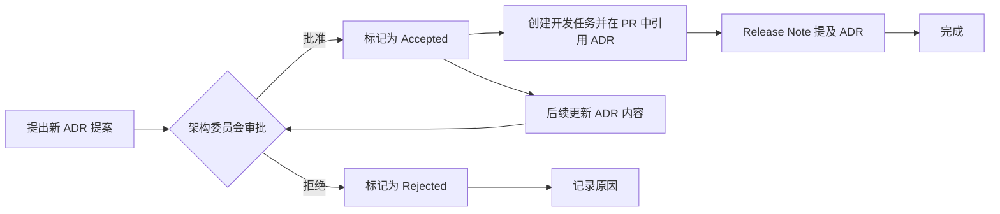

````markdown
# 一、文档信息

| 项目     | 内容                                                                                                                                            |
| -------- | ----------------------------------------------------------------------------------------------------------------------------------------------- |
| 文档名称 | docs/architecture/adr.md                                                                                                                        |
| 项目名称 | SimWar                                                                                                                                          |
| 文档版本 | v1.0                                                                                                                                            |
| 文档状态 | Draft                                                                                                                                           |
| 最后更新 | YYYY-MM-DD                                                                                                                                      |
| 适用范围 | 架构决策 / 技术治理 / 开发协作                                                                                                                  |
| 维护人   | 请根据实际项目修改                                                                                                                              |
| 相关文档 | docs/product/requirements.md / docs/architecture/system-architecture.md / docs/contracts/api-contract.md / docs/architecture/database-design.md |

# 二、ADR 使用说明

- **ADR（Architecture Decision Record）是什么**：ADR 是用于记录系统架构设计决策的文档，包含决策背景、备选方案、取舍和风险等信息，确保架构设计的透明化和可追溯性。
- **为什么项目需要 ADR**：随着项目规模和团队复杂度增加，架构决策变得更为重要。ADR 记录关键决策，避免设计失误和重复争论，方便新成员了解架构选择，并为后续开发和运维提供指导。
- **什么时候需要新增 ADR**：每当需要对系统架构、技术选型、关键设计方案做出决策时，需要创建新的 ADR。例如引入新技术、新模块设计、重大重构等场景。
- **谁负责提出 ADR**：通常由架构师、技术负责人或相关领域专家提出 ADR 提案，也可以由开发团队或其他相关人员在讨论中提出。
- **谁负责审批 ADR**：项目架构委员会或核心团队负责评审和批准 ADR。最终采纳的决策由项目负责人或架构委员会批准并实施。
- **ADR 如何更新**：如果已有决策需要修改，可在现有 ADR 基础上提出更新，修改内容并提交审批，更新后的 ADR 状态标记为 `accepted` 或 `deprecated`。
- **ADR 如何废弃**：当某个决策不再适用时，可将该 ADR 标记为 `deprecated` 或由新的 ADR 标记为 `superseded`。废弃决策意味着不再推荐使用，但保留历史记录。
- **ADR 如何与开发任务、PR、版本发布关联**：每条 ADR 应对应相关开发任务和 PR，PR 提交时应在描述中引用相关 ADR 编号；版本发布说明应提及本版本实现或受影响的 ADR，以便跟踪架构变化。

# 三、ADR 编号规范

为保证 ADR 编号唯一且易于归类，建议使用以下编号前缀规范：

| 编号前缀     | 领域         | 示例             |
| ------------ | ------------ | ---------------- |
| ADR-ARCH     | 总体架构     | ADR-ARCH-001     |
| ADR-DATA     | 数据架构     | ADR-DATA-001     |
| ADR-AI       | AI 小模型    | ADR-AI-001       |
| ADR-PLUGIN   | 行业插件     | ADR-PLUGIN-001   |
| ADR-DEVOPS   | 部署与 CI/CD | ADR-DEVOPS-001   |
| ADR-SEC      | 安全与权限   | ADR-SEC-001      |
| ADR-TEST     | 测试与质量   | ADR-TEST-001     |
| ADR-ENGINE   | 核心引擎     | ADR-ENGINE-001   |
| ADR-FRONTEND | 前端架构     | ADR-FRONTEND-001 |
| ADR-MODEL    | 经济模型     | ADR-MODEL-001    |
| ADR-REPLAY   | 回放门禁     | ADR-REPLAY-001   |

编号格式为 `ADR-领域-序号`。领域命名应与业务相关，如 `ARCH` 表示总体架构，`DATA` 表示数据设计等。每个 ADR 统一编号、更新状态时保持不变，以便版本管理和追踪。

# 四、ADR 模板

```markdown
# ADR-XXX：决策标题

| 项目     | 内容                                                     |
| -------- | -------------------------------------------------------- |
| 状态     | proposed / accepted / superseded / deprecated / rejected |
| 日期     | YYYY-MM-DD                                               |
| 决策人   | 请根据实际项目修改                                       |
| 相关模块 |                                                          |
| 相关文档 |                                                          |
| 替代 ADR | 无 / ADR-XXX                                             |

## 背景

说明为什么需要这个决策，以及决策所针对的问题背景和需求。

## 决策

说明最终选择了什么方案，包括关键点和要点。

## 备选方案

### 方案 A

说明方案 A 的核心思路。

### 方案 B

说明方案 B 的核心思路。

### 方案 C

说明方案 C 的核心思路。

## 取舍分析

| 方案   | 优点 | 缺点 | 风险 | 结论 |
| ------ | ---- | ---- | ---- | ---- |
| 方案 A | ...  | ...  | ...  | ...  |
| 方案 B | ...  | ...  | ...  | ...  |
| 方案 C | ...  | ...  | ...  | ...  |

## 影响

### 正面影响

列出采用该方案后的正面影响。

### 负面影响

列出可能的负面影响。

### 对开发的影响

说明对开发效率、开发模式或代码结构等的影响。

### 对测试的影响

说明对测试设计、测试覆盖或测试流程等的影响。

### 对运维的影响

说明对部署、监控或运维流程等的影响。

## 风险与缓解措施

| 风险     | 缓解措施               |
| -------- | ---------------------- |
| 风险描述 | 缓解办法、处理方案等。 |

## 后续行动

- [ ] 行动项 1
- [ ] 行动项 2
```
````

# 五、ADR 总览表

| ADR 编号         | 决策主题                                           | 状态     | 领域         | 影响范围  | 优先级 |
| ---------------- | -------------------------------------------------- | -------- | ------------ | --------- | ------ |
| ADR-ARCH-001     | 采用分层模块化架构                                 | proposed | 总体架构     | 平台架构  | P0     |
| ADR-ARCH-002     | 采用 Monorepo 或模块化仓库结构                     | proposed | 总体架构     | 仓库结构  | P2     |
| ADR-ARCH-003     | 采用 OpenAPI-first 接口契约                        | proposed | 总体架构     | API 对接  | P0     |
| ADR-ARCH-004     | 采用事件驱动架构处理异步任务                       | proposed | 总体架构     | 异步流程  | P1     |
| ADR-ENGINE-001   | 核心仿真引擎作为唯一正式真值来源                   | proposed | 核心引擎     | 仿真核    | P0     |
| ADR-ENGINE-002   | 正式结算结果必须可 Replay                          | proposed | 核心引擎     | 结算流程  | P2     |
| ADR-MODEL-001    | BLP / RCNL 位于 L1 市场需求真值层                  | proposed | 经济模型     | 需求建模  | P2     |
| ADR-AI-001       | AI 小模型只作为建议层                              | proposed | AI 小模型    | AI 功能层 | P0     |
| ADR-AI-002       | AI 输出必须记录审计与模型调用日志                  | proposed | AI 小模型    | AI 服务   | P2     |
| ADR-AI-003       | AI 小模型上线必须经过 Shadow Replay / Shadow Arena | proposed | AI 小模型    | 部署流程  | P1     |
| ADR-DATA-001     | 采用多租户数据隔离                                 | proposed | 数据架构     | 数据存储  | P0     |
| ADR-DATA-002     | 关键数据采用追加写与版本化                         | proposed | 数据架构     | 数据存储  | P2     |
| ADR-DATA-003     | ParameterSet 正式运行后不可覆盖修改                | proposed | 数据架构     | 参数管理  | P0     |
| ADR-PLUGIN-001   | 采用行业无关 Kernel + 行业插件架构                 | proposed | 行业插件     | 架构扩展  | P0     |
| ADR-PLUGIN-002   | Plugin 不得绕过 Kernel 写正式结果                  | proposed | 行业插件     | 插件执行  | P1     |
| ADR-REPLAY-001   | Replay / Shadow Replay 作为发布治理门禁            | proposed | 回放与验证   | 发布流程  | P0     |
| ADR-SEC-001      | 采用 RBAC + 字段级权限控制                         | proposed | 安全与权限   | 访问控制  | P0     |
| ADR-SEC-002      | 所有高风险写操作必须进入审计日志                   | proposed | 安全与权限   | 安全审计  | P2     |
| ADR-DEVOPS-001   | 采用 Docker Compose 支持本地开发                   | proposed | 部署与 CI/CD | 开发环境  | P2     |
| ADR-DEVOPS-002   | 采用 CI/CD 质量门禁                                | proposed | 部署与 CI/CD | 构建部署  | P1     |
| ADR-TEST-001     | 测试体系必须覆盖 Replay、AI 边界和多租户隔离       | proposed | 测试与质量   | 测试流程  | P0     |
| ADR-FRONTEND-001 | 教师端与学员端采用角色驱动前端架构                 | proposed | 前端架构     | 前端视图  | P2     |
| ADR-FRONTEND-002 | AI 输出、正式结果、Replay 结果必须视觉区分         | proposed | 前端架构     | 前端视图  | P1     |

# 六、详细 ADR 内容

## ADR-ARCH-001：采用分层模块化架构

| 项目     | 内容                                                                    |
| -------- | ----------------------------------------------------------------------- |
| 状态     | proposed                                                                |
| 日期     | YYYY-MM-DD                                                              |
| 决策人   | 请根据实际项目修改                                                      |
| 相关模块 | 前端、后端、仿真引擎、AI 模型、Replay 服务                              |
| 相关文档 | docs/product/requirements.md / docs/architecture/system-architecture.md |
| 替代 ADR | 无                                                                      |

## 背景

SimWar 项目既包含 SaaS 平台、核心仿真引擎、AI 小模型、行业插件，也包含教师端、学员端、Replay 等多种组件。系统功能复杂、用户角色多样，如果采用单体架构会导致代码臃肿、耦合度高；如果全部拆分成微服务，则会增加服务调用复杂性和运维成本。需要一个既能保证模块解耦、又能适度分工的架构。

## 决策

采用**分层模块化架构**：在垂直方向上分为应用层、业务服务层、仿真与 AI 层、数据层、治理层；在横向则采用模块化组织，将教师端、学员端、核心引擎、AI 组件、Replay 服务、插件扩展等作为独立模块进行开发和部署。这样既保证了职责清晰、层次分明，又能按模块独立扩展。

- 应用层：前端 Web (教师端/学员端) 和其他接入层，处理用户界面和交互。
- 业务服务层：各业务逻辑服务，如课程管理服务、队伍管理服务、多轮决策编排服务等。
- 仿真与 AI 层：核心仿真引擎（唯一真值源）、AI 协同层、插件运行时环境、Replay 服务等。
- 数据层：数据库和存储服务，包含多租户隔离机制、审计日志、事件存储等。
- 治理层：包含参数治理、模型治理、回放治理、权限管理等横切 concern。

## 备选方案

### 方案 A：单体架构

所有功能放在一个应用中，部署一个系统实例。

### 方案 B：完全微服务架构

每个功能或服务都拆分为独立微服务，通过 API 调用或消息队列交互。

### 方案 C：分层模块化架构

结合上述，按照层次分离职责，同时各大功能模块化独立开发，如本项所选方案。

## 取舍分析

| 方案       | 优点                                                   | 缺点                                                         | 风险                                   | 结论           |
| ---------- | ------------------------------------------------------ | ------------------------------------------------------------ | -------------------------------------- | -------------- |
| 单体架构   | 开发部署简单，集成测试简单                             | 随系统扩展变臃肿，维护困难；模块耦合度高                     | 单点失败风险，扩展受限                 | 不推荐         |
| 完全微服务 | 各功能高度独立，可按服务扩展；团队并行开发容易         | 服务数量多，接口多样，运维复杂；跨服务事务难管理；初期成本高 | 服务碎片化风险，运维和监控复杂度增加   | 可考虑但成本高 |
| 分层模块化 | 保持层次清晰，模块独立；可选择性扩展；团队协作明确职责 | 边界设计复杂，需要明确模块边界；跨层调试和集成测试较复杂     | 设计阶段边界划分不清晰可能导致交叉依赖 | 推荐           |

综合权衡，**分层模块化架构**在保持系统可扩展和可维护的同时，也能够控制复杂度，因此作为最终方案。

## 影响

### 正面影响

- 架构清晰：分层理念和模块化设计明确了组件职责和边界，提高可维护性。
- 可扩展性：模块独立，新增功能或服务易于插拔扩展。
- 团队协作：各层各模块分工明确，前后端或团队可以并行开发。
- 代码质量：解耦减少了模块之间的依赖复杂度，有利于单元测试和代码评审。

### 负面影响

- 前期设计成本：需要在设计阶段花费精力划定边界和接口。
- 系统集成：需要更多关注跨层调用和接口定义，集成测试增加复杂度。
- 运维配置：需要管理多个模块的部署和配置。

### 对开发的影响

- 代码组织：开发人员需要按照层级和模块结构编写代码，可能需要适应新的项目结构。
- 接口契约：各模块需定义清晰的 API 契约，前后端或服务之间需要协作约定接口。

### 对测试的影响

- 集成测试：需要编写跨模块、跨层次的集成测试以保证模块联调正确。
- 模块测试：每个模块可以单独测试，但需要定义 Mock 或沙箱环境来隔离依赖。

### 对运维的影响

- 部署架构：需要部署多个服务或应用节点，可能借助容器、Kubernetes 等编排工具。
- 可观测性：不同模块需要单独监控和日志收集，需统一的监控方案。
- 发布流程：可进行模块化发布，降低整体系统风险。

## 风险与缓解措施

| 风险                     | 缓解措施                                                                                                     |
| ------------------------ | ------------------------------------------------------------------------------------------------------------ |
| 模块边界划分不清晰       | 在架构设计阶段，与业务方和技术方充分讨论，编写文档明确各层和模块的职责与接口；架构评审时重点验证边界合理性。 |
| 过度解耦导致性能问题     | 对跨模块调用路径进行性能评估，使用缓存或异步方式降低同步调用延迟；必要时合并低耦合模块。                     |
| 部署和集成测试复杂度增加 | 制定自动化的 CI/CD 流程和多环境部署方案；编写集成测试用例覆盖主要业务流程，避免回归错误。                    |

## 后续行动

- [ ] 制定架构设计文档，明确各层和模块边界。
- [ ] 实现各层的基础框架代码（如 API 网关、服务注册、权限过滤等）。
- [ ] 编写接口契约（见 ADR-ARCH-003）以规范层间调用。
- [ ] 规划测试方案，包括单元测试和跨模块集成测试。

---

## ADR-ARCH-002：采用 Monorepo 或模块化仓库结构

| 项目     | 内容                                                                    |
| -------- | ----------------------------------------------------------------------- |
| 状态     | proposed                                                                |
| 日期     | YYYY-MM-DD                                                              |
| 决策人   | 请根据实际项目修改                                                      |
| 相关模块 | 前端、后端、AI 服务、共享类型库、API Contract                           |
| 相关文档 | docs/architecture/system-architecture.md / docs/product/requirements.md |
| 替代 ADR | 无                                                                      |

## 背景

项目由前端（教师端、学员端）、后端服务、AI 小模型服务、公共类型/工具库等多个部分组成。在代码仓库层面，需要决定采用单一仓库 (Monorepo) 还是多个仓库 (Polyrepo) 的方式组织项目，以支持开发效率和协作。

## 决策

推荐采用**Monorepo** 仓库结构，将前端、后端、AI 服务、公共类型定义和测试在同一个仓库中管理。使用目录或子模块区分不同服务和组件，同时采用工具（如 lerna、Nx、Gradle 等）管理依赖和构建。这样可以方便共享类型、接口契约和共同依赖，简化版本一致性管理。

## 备选方案

### 方案 A：Monorepo

所有代码在一个仓库中，通过文件夹区分前端、后端、AI 服务、共享库等，统一管理依赖和版本。

### 方案 B：Polyrepo

不同服务或模块分别使用独立仓库，服务之间通过版本包或协议通信，代码隔离，部署独立。

### 方案 C：Hybrid

将密切相关的部分（如前后端）放在一起，其他大型组件（例如 AI 服务、插件运行时）独立仓库。

## 取舍分析

| 方案     | 优点                                                                                       | 缺点                                                                                                 | 风险                                                   | 结论                 |
| -------- | ------------------------------------------------------------------------------------------ | ---------------------------------------------------------------------------------------------------- | ------------------------------------------------------ | -------------------- |
| Monorepo | - 方便依赖管理：共享类型和接口同步更新；<br>- 更容易跨模块重构；<br>- CI/CD 可以集中配置； | - 仓库体积大，长期维护可能复杂；<br>- 权限细分困难，所有人都能访问所有代码；<br>- 构建时间可能变长； | 仓库单点故障，发布变更更小心；权限配置不细致导致风险； | 推荐                 |
| Polyrepo | - 模块完全隔离，仓库体积小；<br>- 权限可独立配置；<br>- 服务自治；                         | - 依赖管理复杂，需要发布包管理；<br>- 接口变更需协调多个仓库；<br>- CI/CD 配置多份；                 | 接口同步失败导致编译出错；多仓库版本难以协同；         | 只适用于完全自治团队 |
| Hybrid   | - 保持核心模块整合（如前后端）；<br>- 独立部署复杂或变化少的组件；                         | - 增加管理复杂度，团队需要处理两套模式；                                                             | 无统一标准，增加学习成本；                             | 较复杂且收益有限     |

综合考虑，**Monorepo** 能有效促进前后端及AI服务的联动和接口契约一致性，并简化 CI/CD 管道，因此作为首选方案。

## 影响

### 正面影响

- 依赖一致：共享依赖和工具版本统一，有助于保持类型和接口同步。
- 开发协作：团队可以更方便地在一个仓库内跨模块查找和修改代码，减少协调成本。
- 构建流程统一：CI/CD 可以统一配置，所有模块在同一个流程中构建和测试。

### 负面影响

- 仓库体积：随着代码增加，仓库克隆和构建可能变慢。
- 权限管理：可能需要更加细致的流程控制和代码评审策略，防止无关人员修改核心模块。

### 对开发的影响

- 路径规范：需要统一工作区，保证依赖引用统一。
- 工具链：可能使用 Monorepo 专用工具管理依赖版本和构建流程。

### 对测试的影响

- 端到端测试：更方便配置统一测试环境，前后端都在同一仓库内，端到端测试更容易集成。
- 单元测试：每个模块依旧单独运行测试，但共享工具和库版本。

### 对运维的影响

- 部署脚本：CI/CD 脚本统一管理一个仓库内所有模块的构建和发布。
- 版本管理：可以通过统一的变更日志或 release note 管理所有模块版本。

## 风险与缓解措施

| 风险                           | 缓解措施                                                                                |
| ------------------------------ | --------------------------------------------------------------------------------------- |
| 仓库过大导致构建缓慢或克隆耗时 | 使用子模块或工作区（Workspace）配置，仅在需要时构建相关模块；定期清理旧历史和无效依赖。 |
| 权限不细分导致错误提交         | 制定代码评审和分支策略，如子目录审批、代码所有者规则等，防止越权修改；                  |
| 模块依赖耦合过深               | 使用工具限制模块间依赖关系，定期评审依赖树，避免无意间引入跨模块循环依赖。              |

## 后续行动

- [ ] 设置 Monorepo 工具（例如 Yarn Workspaces、Nx、Lerna 或 Gradle）并初始化项目结构。
- [ ] 将现有前端、后端、AI 服务代码合并入 Monorepo 结构，并调整构建脚本。
- [ ] 配置 CI/CD 管道支持 Monorepo 构建，根据修改路径触发相应模块的构建和测试。

---

## ADR-ARCH-003：采用 OpenAPI-first 接口契约

| 项目     | 内容                                                                      |
| -------- | ------------------------------------------------------------------------- |
| 状态     | proposed                                                                  |
| 日期     | YYYY-MM-DD                                                                |
| 决策人   | 请根据实际项目修改                                                        |
| 相关模块 | 后端服务、API 定义、前端聚合层                                            |
| 相关文档 | docs/contracts/api-contract.md / docs/architecture/system-architecture.md |
| 替代 ADR | 无                                                                        |

## 背景

SimWar 平台由前端、后端、多种微服务和 AI 服务组成，服务之间通过 API 调用交互。为了避免前后端接口对接成本过高和频繁变动引起的冲突，需要统一接口定义流程。

## 决策

采用**OpenAPI-first** 方法，即首先编写 OpenAPI（Swagger）规范文件定义接口契约，然后根据契约自动生成 Mock 服务、服务端接口代码和客户端 SDK。确保前后端开发的并行效率，并通过契约驱动方式来验证接口一致性。

## 备选方案

### 方案 A：OpenAPI-first 接口契约

先定义接口文档和参数格式，生成代码和客户端，确保一致性。

### 方案 B：Code-first 接口定义

先编写后端代码，再通过注解等方式生成接口文档。

### 方案 C：手动对接

前后端讨论后直接硬编码接口，无自动文档或代码生成。

## 取舍分析

| 方案          | 优点                                                                                             | 缺点                                               | 风险                                                             | 结论       |
| ------------- | ------------------------------------------------------------------------------------------------ | -------------------------------------------------- | ---------------------------------------------------------------- | ---------- |
| OpenAPI-first | - 接口文档明确，前后端可以并行开发；<br>- 支持自动生成 Mock、SDK；<br>- 支持版本管理和回归测试。 | - 需要花时间维护文档；<br>- 学习和工具成本稍高。   | 文档与实现不同步风险（可由生成工具缓解）；需要团队熟悉 OpenAPI。 | 推荐       |
| Code-first    | - 后端直接定义，开发速度快；<br>- 注解即可生成文档。                                             | - 前端可能等待后端完成；<br>- 文档经常滞后于实现。 | 接口变更频繁难追踪，前后端集成成本增加。                         | 可作为补充 |
| 手动对接      | - 最简单，对工具无依赖；                                                                         | - 无文档支持，容易出错；<br>- 前后端同步难。       | 难以维护，多人开发时错误风险高。                                 | 不推荐     |

综合比较，**OpenAPI-first** 能极大降低前后端对接成本，并支持自动化测试和 SDK 生成，推荐采用。

## 影响

### 正面影响

- 明确契约：接口规范文档清晰，前后端共识一致，减少对接摩擦。
- 自动化：可生成 Mock 服务器、接口 SDK，加速前端开发和测试。
- 测试支持：契约可用于接口自动测试（Contract Test），提升可靠性。
- 协同开发：开发者可基于文档并行实现前后端和第三方集成。

### 负面影响

- 文档维护：需要额外编写和维护 OpenAPI 文档，工作量增加。
- 版本管理：接口变更需考虑版本兼容（URL 版本或 Header 版本），增加管理复杂度。

### 对开发的影响

- 规范流程：开发流程前期增加编写接口文档步骤，后端开发需根据文档生成代码骨架。
- 工具链：使用 Swagger Editor、OpenAPI Generator 等工具，可能需要团队学习和熟悉。

### 对测试的影响

- 提高自动化：可以编写基于契约的测试用例，对接口进行契约测试。
- Mock 测试：可以先生成 Mock 服务进行前端联调测试，提高开发效率。

### 对运维的影响

- 版本管理：在 API 路由中引入版本号管理，在部署时需保证旧版本的兼容性。
- 文档发布：公开 API 文档作为服务的一部分，确保外部调用方（如第三方、插件等）使用最新文档。

## 风险与缓解措施

| 风险                 | 缓解措施                                                                    |
| -------------------- | --------------------------------------------------------------------------- |
| 文档与实现不一致     | 使用自动化工具生成服务器和客户端代码，减少手动变更；CI 校验契约是否被破坏。 |
| 接口版本管理混乱     | 在 API 路径或头部明确版本；重大变更需新建版本，保持旧版接口兼容。           |
| 团队不熟悉规范化流程 | 组织培训并编写示例规范，让团队逐步熟悉 OpenAPI-first 开发流程。             |

## 后续行动

- [ ] 定义核心服务的 OpenAPI 规范文档，包括认证、业务接口等。
- [ ] 搭建 Mock 环境，前端可根据文档独立开发和测试。
- [ ] 集成 OpenAPI Generator，根据规范生成后端接口骨架和前端 SDK。
- [ ] 在 CI/CD 流程中增加接口契约测试，确保接口变更受控。

---

## ADR-ARCH-004：采用事件驱动架构处理异步任务

| 项目     | 内容                                                                       |
| -------- | -------------------------------------------------------------------------- |
| 状态     | proposed                                                                   |
| 日期     | YYYY-MM-DD                                                                 |
| 决策人   | 请根据实际项目修改                                                         |
| 相关模块 | 回合结算服务、AI 服务、通知服务、学习记录服务                              |
| 相关文档 | EventDrivenArchitecture.md / docs/architecture/bpmn-workflows.md（可参考） |
| 替代 ADR | 无                                                                         |

## 背景

SimWar 平台中存在多个需要异步处理的业务场景，如回合结算、AI 结果生成、Replay 处理、学习记录保存、通知推送等。这些场景可能耗时较长，或需要后续处理，使用同步调用会影响用户体验，需要采用事件驱动架构来解耦和异步处理。

## 决策

采用**事件驱动架构**，将需要异步执行的逻辑转化为事件和消息，在消息队列或事件总线中传递，由消费者服务异步处理。这种方式可以提升系统并发能力和弹性。具体来说：

- **回合结算**：当用户提交决策结束当前回合时，生成“回合结束”事件，由结算服务异步计算结果；前端可轮询或订阅事件获取结算结果。
- **AI 输出**：请求 AI 建议时，将任务发送到 AI 服务队列，AI 计算完成后产生事件，结果异步返回给用户界面或录入日志。
- **Replay/Shadow Replay**：提交前产生“Replay 请求”事件，后台执行计算并记录报告，不阻塞用户操作。
- **通知与学习记录**：将用户行动事件发送到消息系统，由独立的通知服务和学习记录服务处理和持久化，解耦业务服务。

同步 API 与异步事件边界：对外提供同步 API 时，尽量返回处理请求成功的即时响应（例如 202 Accepted），实际处理在后台继续。必要时客户端可轮询事件或接收回调。

## 备选方案

### 方案 A：事件驱动架构（推荐）

上述的异步场景全部通过消息队列或事件总线实现解耦异步处理。

### 方案 B：同步处理

所有操作均在请求线程中同步执行，不使用异步队列。

### 方案 C：混合策略

只有关键耗时操作使用异步，其它场景同步处理。

## 取舍分析

| 方案         | 优点                                                                                       | 缺点                                                                         | 风险                                                                    | 结论   |
| ------------ | ------------------------------------------------------------------------------------------ | ---------------------------------------------------------------------------- | ----------------------------------------------------------------------- | ------ |
| 事件驱动架构 | - 系统松耦合，可扩展性强；<br>- 增强并发处理能力；<br>- 适合复杂异步场景和需高可用的处理； | - 设计和实现复杂度高，需要消息队列和幂等性处理；<br>- 调试和错误排查更困难； | 事件丢失或重复，需要设计重试/幂等机制；消息顺序问题可能导致一致性风险。 | 推荐   |
| 同步处理     | - 设计简单，无需维护消息系统；<br>- 容易理解和调试；                                       | - 同步阻塞用户等待响应时间长；<br>- 可扩展性弱，无法充分利用异步资源。       | 长时间操作可能超时或导致请求失败；影响用户体验和系统吞吐量。            | 不推荐 |
| 混合策略     | - 关键路径快速返回，部分重要任务异步；<br>- 避免过度使用消息队列。                         | - 复杂性类似于事件驱动；<br>- 需要判断哪些场景异步可能导致遗漏；             | 可能仍需处理部分异步的幂等和重试问题；管理更复杂。                      | 可选   |

考虑到 SimWar 中异步场景较多且对响应时间要求较高，**事件驱动架构**能够有效解耦和提升系统弹性，综合评估后推荐使用。

## 影响

### 正面影响

- 系统解耦：业务逻辑与异步处理解耦，不同服务可独立扩展和维护。
- 并发提升：异步消息队列可处理大量并行任务，提高整体吞吐。
- 响应及时：前端提交请求后快速返回，用户体验更佳，结果稍后通过事件获取。

### 负面影响

- 增加架构复杂度：需要引入消息队列、事件中间件和相关监控组件。
- 调试难度增加：异步流程不易跟踪，需要完善日志和链路追踪工具。

### 对开发的影响

- 编码模式：开发人员需使用发布/订阅模式设计接口并处理事件回调。
- 幂等性考虑：消费者需确保幂等处理，避免消息重复或失败后多次处理。
- 错误处理：需实现重试机制和死信队列，对失败消息进行补偿处理。

### 对测试的影响

- 集成测试：需要测试消息队列配置，模拟异步消息场景，验证事件流程。
- 自动化测试：可能需要工具模拟消息队列环境，保证异步组件的测试覆盖。
- 模拟环境：本地测试可能需启动消息队列或使用内存模拟器。

### 对运维的影响

- 基础设施：需要部署和维护消息队列服务（如 Kafka、RabbitMQ、RocketMQ 等）及监控。
- 监控告警：对消息积压、消费失败等情况设置监控告警，确保及时处理故障。
- 灾难恢复：设计消息持久化和备份机制，避免中间件单点故障影响系统可用性。

## 风险与缓解措施

| 风险               | 缓解措施                                                                                  |
| ------------------ | ----------------------------------------------------------------------------------------- |
| 消息丢失或重复发送 | 配置持久化队列，使用幂等消费逻辑；开启死信队列处理失败消息；                              |
| 事件顺序混乱       | 在设计上尽量使消息独立，不依赖全局顺序；如需要顺序，可采用有序队列或事务协调策略。        |
| 系统调试复杂       | 使用分布式追踪（Tracing）和日志聚合工具，跟踪事件流；为核心事件添加足够日志和上下文标识。 |

## 后续行动

- [ ] 选择并部署消息中间件（如 Kafka、RabbitMQ 等），搭建测试环境。
- [ ] 定义重要异步事件模型（如 RoundEndEvent、AIResultEvent、ReplayRequestEvent 等）。
- [ ] 实现幂等消费者逻辑和重试/死信机制，确保消息处理可靠。
- [ ] 更新开发规范，对新的异步 API 进行文档和测试支持。

---

## ADR-ENGINE-001：核心仿真引擎作为唯一正式真值来源

| 项目     | 内容                                                                    |
| -------- | ----------------------------------------------------------------------- |
| 状态     | proposed                                                                |
| 日期     | YYYY-MM-DD                                                              |
| 决策人   | 请根据实际项目修改                                                      |
| 相关模块 | 核心仿真引擎、Result 生成服务、Audit 日志                               |
| 相关文档 | docs/product/requirements.md / docs/architecture/system-architecture.md |
| 替代 ADR | 无                                                                      |

## 背景

SimWar 平台涉及大量商业指标，如市场份额、销量、成本、利润、评分、排名等。这些指标的唯一正式来源应当是经过完整仿真计算的结果，不能被其他非正式渠道（如 AI 小模型、插件或手动）篡改。需要明确核心仿真引擎作为真值核的地位，确保系统一致性。

## 决策

**核心仿真引擎（Kernel）** 被定义为所有正式商业结果的**唯一真值来源**。具体要求如下：

- 核心引擎生成所有正式结算结果，包括市场份额、销量、成本、利润、经营现金流、企业利润、得分、排名等；绝不允许由其他组件直接修改这些正式结果。
- AI 小模型只能提供决策建议、解释、证据卡、风险提示、学习推荐等辅助信息，**不得**直接参与正式结果计算或修改。
- 行业插件在仿真过程中只产生对核心计算的建议（如参数调整、情景变化等），最终由核心引擎验证和写入正式数据；插件**不得**绕过核心引擎直接写入正式结果或数据库。
- 所有正式结果的写操作都必须走核心引擎并被记录审计，避免后续作弊或错漏。
- ParameterSet、场景包等运行时参数在运行后被冻结，任何对正式运行中数据的修改都必须走严格审批流程。

## 备选方案

### 方案 A：核心引擎真值方案（推荐）

如上所述，核心仿真引擎独立计算所有结果，其它组件为辅助层。

### 方案 B：分布式真值

允许多个计算服务共同生成结果，采用共识或分布式算法。

### 方案 C：AI 替代

让 AI 模型参与或主导部分结果生成。

## 取舍分析

| 方案         | 优点                                                                     | 缺点                                                                     | 风险                                                                   | 结论     |
| ------------ | ------------------------------------------------------------------------ | ------------------------------------------------------------------------ | ---------------------------------------------------------------------- | -------- |
| 核心引擎真值 | - 所有结果来源单一，易于审计和回放验证；<br>- 避免不同组件计算结果冲突； | - 核心引擎计算复杂度高，需要保证性能；<br>- 其他模块能力被限制在建议层。 | 如果核心引擎出现错误，所有结果受到影响；需确保核心引擎可靠性和正确性。 | 推荐     |
| 分布式真值   | - 分担计算负担，提高弹性；                                               | - 难以保证结果一致；<br>- 需要复杂的同步或共识机制。                     | 数据不一致风险高，调试复杂；                                           | 不推荐   |
| AI 替代      | - 利用 AI 自动化决策或计算部分指标；                                     | - AI 难以保证精确可信；<br>- 难以验证且难以审计。                        | 正式指标被 AI 干扰，信任度下降；                                       | 绝不允许 |

因此确定**核心仿真引擎**为正式真值来源，以保证计算结果的准确性、一致性和可审计性。

## 影响

### 正面影响

- 结果可信：所有正式数据都来自核心引擎，易于追踪和验证。
- 清晰边界：AI 和插件明确只作为辅助层，职责分明。
- 审计可行：可对核心引擎的计算和输出进行完整审计，符合合规和治理需求。

### 负面影响

- 性能压力：核心引擎需处理全部正式计算，对性能要求高，需要优化。
- 限制扩展：其他组件不能直接影响结果计算，需要变更必须通过核心引擎改进。

### 对开发的影响

- 开发人员需重点关注核心引擎的正确性和性能，确保计算模型正确。
- AI、插件团队需严格遵守接口协议，不能修改正式结果，只能输出建议。

### 对测试的影响

- 需要为核心引擎编写详尽的测试，包括边界情况和性能测试，保证结果准确。
- 对 AI 边界进行测试，确保 AI 不触碰正式计算数据。

### 对运维的影响

- 监控与告警：对核心引擎的运行状态、计算错误和性能指标要重点监控。
- 灰度发布：新的核心引擎版本需通过 Shadow Replay 等门禁验证后才能发布。

## 风险与缓解措施

| 风险                       | 缓解措施                                                                     |
| -------------------------- | ---------------------------------------------------------------------------- |
| 核心引擎故障或性能瓶颈     | 实施严格测试和压力测试；使用分布式资源或优化算法；准备回滚方案和备用机。     |
| AI/插件尝试篡改结果        | 在核心引擎入口检查所有外部输入，禁止非授权的写操作；审计日志捕获未授权写入。 |
| 正式结果来源单点故障风险高 | 灰度部署新版本，备份历史结果；在多机部署和高可用架构下部署核心引擎。         |

## 后续行动

- [ ] 定义并实现核心引擎的接口和计算流程，确保其输出为唯一真值。
- [ ] 为核心引擎计算结果生成完整审计日志（与 ADR-AI-002 联动）。
- [ ] 在系统中添加检测，禁止非核心引擎路径写入正式结果。
- [ ] 设计核心引擎的高可用部署方案，保证服务稳定性。

---

## ADR-ENGINE-002：正式结算结果必须可 Replay

| 项目     | 内容                                           |
| -------- | ---------------------------------------------- |
| 状态     | proposed                                       |
| 日期     | YYYY-MM-DD                                     |
| 决策人   | 请根据实际项目修改                             |
| 相关模块 | 核心引擎、Replay 服务、Result 存储             |
| 相关文档 | docs/quality/replay-shadow-replay-test-plan.md |
| 替代 ADR | 无                                             |

## 背景

为了保证结果的可验证性和复现性，需要能够对历史结算结果进行**Replay**（重算）。即任何一个正式发布的商业结果，都应可通过当时相同的环境和数据进行复算，验证其正确性。这要求历史运行所使用的所有关键输入数据被记录并可回用。

## 决策

- 正式结算结果必须**可复算**：保存用于计算结果的所有历史绑定对象，包括 ParameterSet、插件包版本、引擎版本、模型版本、Prompt 版本等，确保可以在相同条件下复算。
- Replay 过程不得覆盖正式结果：Replay 是只读或追加写入操作，不修改历史正式结果数据，只生成额外的 ReplayReport 记录。
- 当需要进行 Replay 时，使用与当时相同的版本和参数，严格重演计算逻辑，生成 Replay 报告。
- 如果 Replay 失败，应记录失败原因和日志，但不影响正式结果。
- 对 Replay 结果可进行人工或自动验证，当有偏差需要调查时可触发告警或复审流程。

## 备选方案

### 方案 A：强制可 Replay（推荐）

如上所述，所有正式结果可被复算并产出独立报告。

### 方案 B：只对疑难情况 Replay

只有在人工怀疑结果错误时才执行 Replay，不强制保存所有环境。

### 方案 C：不支持 Replay

不保留复算能力，只保留最终结果和基本日志。

## 取舍分析

| 方案            | 优点                                                                         | 缺点                                                                           | 风险                                         | 结论   |
| --------------- | ---------------------------------------------------------------------------- | ------------------------------------------------------------------------------ | -------------------------------------------- | ------ |
| 强制可 Replay   | - 可完全验证结果可信度；<br>- 遇到争议可以复盘；<br>- 有助于模型和系统调试。 | - 存储需求增加，需要长期保留大量历史数据；<br>- 实现成本高，需要完整记录环境。 | 数据存档和回放逻辑复杂，需要保障环境一致性； | 推荐   |
| 只对疑难 Replay | - 存储成本略低；                                                             | - 若关键问题未及时发现，可能无法复盘；<br>- 人工判断门槛高。                   | 可能导致复算机会错失，风险未尽暴露。         | 一般   |
| 不支持 Replay   | - 实现简单；                                                                 | - 无法验证历史数据；<br>- 不利于故障排查和可信性保障。                         | 无法满足可审计和可验证要求；                 | 不可取 |

从架构治理和可信性角度考虑，**强制可 Replay** 是必要的保障措施，虽然带来开发和存储成本，但能够提高系统可信度。

## 影响

### 正面影响

- 提升可信度：随时可以检验和复现历史结果，增强用户和监管信心。
- 调试分析：便于找到错误原因，可用于模型和参数优化。
- 治理合规：满足审计和合规要求，证明计算过程可追溯。

### 负面影响

- 存储开销：需要保存完整历史输入和环境配置，存储压力增大。
- 实现成本：需要开发完善的 Replay 服务和报告系统，工作量增加。

### 对开发的影响

- 环境记录：开发者需要设计数据绑定和版本化机制，确保环境数据可追溯。
- Replay 服务：需要实现 Replay 服务模块，能根据历史记录重新调用引擎。

### 对测试的影响

- Replay 测试：除了正常测试外，还需测试 Replay 逻辑在同一条件下复现结果的能力。
- 历史数据验证：编写测试用例模拟历史环境，检验 Replay 功能是否能正确加载历史版本。

### 对运维的影响

- 数据备份：制定历史数据备份策略，确保环境和结果数据长期可用。
- 资源调度：Replay 可能与生产计算争用资源，需要做合理的调度安排或预留环境。

## 风险与缓解措施

| 风险                       | 缓解措施                                                                             |
| -------------------------- | ------------------------------------------------------------------------------------ |
| 环境记录不完整导致无法重演 | 明确需要保存的环境对象清单（ParameterSet, 引擎/模型/Prompt 版本等），严格版本化；    |
| Replay 失败或结果不一致    | 记录失败日志并报警，维护人工复核流程；持续改进引擎确定性，保证在相同输入下结果一致。 |
| 存储和性能压力             | 只存储必要数据摘要或使用增量快照技术；定期清理不再需要的历史数据或归档。             |

## 后续行动

- [ ] 实现环境版本绑定机制：ParameterSet、引擎、模型、Prompt 等运行时一经启动即记录版本，不允许修改。
- [ ] 开发 Replay 服务：能够根据历史记录启动新实例计算，并生成 Replay 报告。
- [ ] 确定 Replay 报告格式：报告应包括环境信息、结果差异说明、耗时等。
- [ ] 在开发流程中加入 Replay 测试：每次核心引擎或模型更新后进行 Shadow Replay 验证。

---

## ADR-MODEL-001：BLP / RCNL 位于 L1 市场需求真值层

| 项目     | 内容                                                                  |
| -------- | --------------------------------------------------------------------- |
| 状态     | proposed                                                              |
| 日期     | YYYY-MM-DD                                                            |
| 决策人   | 请根据实际项目修改                                                    |
| 相关模块 | 计量模型服务（BLP/RCNL）、核心引擎                                    |
| 相关文档 | docs/product/requirements.md / docs/research/executive-model-study.md |
| 替代 ADR | 无                                                                    |

## 背景

项目需求中提出使用结构化经济模型（BLP/RCNL）承担 L1 市场需求与供给真值层。需要明确 BLP/RCNL 模块的职责和边界，以及其与其他系统组件（如运营系统、财务系统、插件、AI 等）的关系。

## 决策

- **BLP/RCNL 模块职责**：负责差异化产品/服务选择、市场份额预测、价格弹性、替代关系建模、供给成本/Markup、反事实分析、微观矩、校准等功能，用以生成 L1 需求与供给的真值数据。
- **不承担内容**：不负责运营策略（如营销投入计算）、财务指标（如财务核算、现金流预测）、平台评分或排名计算等。
- **边界与其他组件**：
  - 与核心引擎：BLP/RCNL 作为需求层输入核心引擎，核心引擎基于其结果进行多轮仿真；核心引擎不重做 L1 计算，仅使用其输出。
  - 与运营、财务、评分：BLP/RCNL 不代替运营或财务系统的真实数据，不直接参与评分逻辑；其结果仅作为仿真参考输入。
  - 与行业插件：插件可对产品或市场特征进行扩展（如行业特定偏好、市场附加规则），但底层需求模型仍由 BLP/RCNL 提供基础需求曲线，插件提供特征映射。
  - 与 AI 小模型：AI 不干预 L1 结果生成；AI 只能基于 BLP/RCNL 提供的结果给出建议或解释。

## 备选方案

### 方案 A：将 BLP/RCNL 放在 L1 层（推荐）

如上所述，BLP/RCNL 输出作为基础真值。

### 方案 B：将 BLP/RCNL 放在其他层

如在 L2 或作为插件模式运行，较不符合需求描述。

## 取舍分析

| 方案        | 优点                                                                                   | 缺点                                             | 风险                                 | 结论   |
| ----------- | -------------------------------------------------------------------------------------- | ------------------------------------------------ | ------------------------------------ | ------ |
| BLP/RCNL L1 | - 使用结构化模型保证市场需求输入的经济合理性；<br>- 可解释性强，符合 L1 需求真值定义。 | - 模型构建复杂，需要专业知识；<br>- 校准成本高。 | 模型参数不准确可能导致结果偏离真实； | 推荐   |
| L2 或插件   | - 开发成本可能低（简化模型）                                                           | - 不能满足 L1 真值需求定义；<br>- 可解释性差。   | 失去经济模型提供的准确预测能力；     | 不推荐 |

## 影响

### 正面影响

- 经济合理：使用成熟经济模型，提高了市场需求模拟的科学性和可信度。
- 可解释性：BLP/RCNL 模型结果可提供价格弹性和特征解释，便于用户理解。

### 负面影响

- 开发成本：需要投入更多时间构建和校准模型，以及数据准备。
- 维护复杂：BLP/RCNL 模型需要持续调整和验证，需要计量经济学专业知识。

### 对开发的影响

- 需要引入计量模型团队或专家来开发和验证 BLP/RCNL。
- 开发人员需实现模型运行环境，集成到系统架构中。

### 对测试的影响

- 需要专门的模型测试，验证模型输出符合预期（如市场份额、价格弹性合理性）。
- 与核心引擎联合测试，保证 BLP 输出正确传递和使用。

### 对运维的影响

- 需要部署和维护 BLP/RCNL 运行服务，可能需要专用计算资源。
- 监控模型指标输入和输出，防止因数据异常导致模型偏移。

## 风险与缓解措施

| 风险                                 | 缓解措施                                                                     |
| ------------------------------------ | ---------------------------------------------------------------------------- |
| 模型参数和市场数据不准确导致结果偏差 | 定期使用真实市场数据对模型进行离线校准和评估；引入 MAPE 等指标评估预测误差； |
| 业务调整无法及时反映到模型           | 设计可维护的模型架构，参数化处理可调整内容；建立版本迭代机制。               |

## 后续行动

- [ ] 定义 BLP/RCNL 模型规格和数据需求文档。
- [ ] 实现基本版本的 BLP/RCNL 服务，并与核心引擎对接。
- [ ] 设计模型校准流程，将真实数据反馈到模型验证和优化中。

---

## ADR-AI-001：AI 小模型只作为建议层

| 项目     | 内容                                                                  |
| -------- | --------------------------------------------------------------------- |
| 状态     | proposed                                                              |
| 日期     | YYYY-MM-DD                                                            |
| 决策人   | 请根据实际项目修改                                                    |
| 相关模块 | AI Orchestrator, 前端展示, 审计日志                                   |
| 相关文档 | docs/research/executive-model-study.md / docs/product/requirements.md |
| 替代 ADR | 无                                                                    |

## 背景

SimWar 平台引入 AI 小模型以提供辅助决策能力，如策略建议、风险提示、复盘等。但是根据项目非目标和安全边界要求，AI 不能写入正式运行数据或改变正式决策结果。需要明确 AI 的输出只能为建议性质，确保 AI 结果不会代替核心计算输出。

## 决策

- **AI 输出内容限制**：AI 只输出策略建议、风险提示、证据卡、复盘草稿、学习推荐等**建议性内容**；任何 AI 产生的决策结果或数据均**不得**直接应用于正式仿真或结算。
- **禁止 AI 写入**：
  - AI 模型**不能自动提交**学员决策，也不能自动调用模拟引擎做决策；
  - AI 绝不能写入 SettlementResult、关键指标（利润、排名等）或修改 ParameterSet；
  - AI 返回的任何建议必须以 `advisory`、`draft`、`explanation` 等标签标识，前端明确区分非正式状态。
- **隔离机制**：AI 服务运行在只读环境，对正式数据库和核心状态不可写；AI 产出的建议仅供参考。

## 备选方案

### 方案 A：AI 建议层（推荐）

如上明确，将 AI 输出限定为建议性内容，不能影响正式数据。

### 方案 B：AI 辅助并写入

允许 AI 在验证后参与结算或结果微调（违背需求中的安全边界）。

### 方案 C：禁止 AI

完全不使用 AI 功能，仅保留传统手动流程。

## 取舍分析

| 方案        | 优点                                                                   | 缺点                                           | 风险                                       | 结论   |
| ----------- | ---------------------------------------------------------------------- | ---------------------------------------------- | ------------------------------------------ | ------ |
| AI 建议层   | - 保留 AI 助手功能，提升用户体验；<br>- 安全边界明确，不改变核心数据。 | - AI 功能限制较多，需要清晰标记使用；          | 需求易满足，主要依赖正确的接口设计。       | 推荐   |
| AI 辅助写入 | - AI 可能提高决策效率；                                                | - 违背设计初衷和安全要求；<br>- 结果不可审计； | 正式结果可能被 AI 擅自更改，存在安全风险。 | 不允许 |
| 禁止 AI     | - 系统实现更简单，风险低；                                             | - 失去 AI 辅助优势，不利于用户体验创新。       | 缺乏智能辅助，竞争力降低。                 | 可选   |

## 影响

### 正面影响

- 系统安全：严格隔离 AI 和正式数据，防止模型决策失误影响游戏公平性。
- 透明可信：用户可信任平台核心结果，AI 仅作为参考，不涉正式权重。

### 负面影响

- 功能限制：AI 无法直接执行或修改决策，用户体验需通过界面识别区分。
- 实现成本：前端需实现 advisory 标识及接受用户确认的流程。

### 对开发的影响

- 接口约定：开发人员需设计 AI API，只返回非写入结果，确保接口中没有写入操作。
- 前端呈现：前端需要特别处理 AI 输出，加标签或提示以示区别。

### 对测试的影响

- AI 边界测试：需要测试 AI 输出在边界内是否符合规范，不允许产生任何写操作。
- 审计验证：需要检查 AI 产生的调用日志，确保 AI 没有权限更改任何核心数据。

### 对运维的影响

- 模型管理：可以频繁更新 AI 模型，因为它不影响核心业务运行，仅需关注建议质量和安全。
- 日志审计：增强 AI 调用日志和建议输出记录，用于后续分析和问责。

## 风险与缓解措施

| 风险                      | 缓解措施                                                               |
| ------------------------- | ---------------------------------------------------------------------- |
| AI 产生误导性建议         | 在 UI 上明确标记为“建议”层面；通过 AI 调用日志跟踪并人工干预可能问题； |
| AI 接口设计缺陷导致写操作 | 在接口层面禁止任何写权限；审核 AI 服务部署配置，只给予只读数据库权限； |
| 用户误用 AI 建议          | 前端进行交互设计，提示用户 AI 输出仅供参考；培训用户正确理解 AI 角色。 |

## 后续行动

- [ ] 定义 AI 服务接口规范，确保返回值中包含标识字段（如 advisory/draft）。
- [ ] 更新前端组件，显示 AI 输出时加入“建议”标志和提示文字。
- [ ] 编写测试用例验证 AI 服务只能返回非写入数据，以及前端正确区分显示。

---

## ADR-AI-002：AI 输出必须记录审计与模型调用日志

| 项目     | 内容                                   |
| -------- | -------------------------------------- |
| 状态     | proposed                               |
| 日期     | YYYY-MM-DD                             |
| 决策人   | 请根据实际项目修改                     |
| 相关模块 | AI 服务、日志系统、审计服务            |
| 相关文档 | docs/research/executive-model-study.md |
| 替代 ADR | 无                                     |

## 背景

AI 小模型在后台生成建议、风险提示等，这些输出可能对教学过程产生影响（例如指导学员决策）。为便于追责和质量评估，需要对每次 AI 模型调用及其输出进行完整记录。

## 决策

- **记录 ModelCallLog**：每次 AI 服务调用都写入日志记录，包括调用时间、调用类型、输入提示、输出结果、调用时使用的模型版本/Prompt 等信息。
- **日志内容**：记录应至少包括字段：调用ID、用户或场景ID、模型名称和版本、Prompt版本、输入内容（去敏）、输出内容（去敏）、AI执行耗时、是否超时或异常。
- **支持问责和评估**：记录可用于回放复现、诊断错误、评估模型性能（如正确率、用户反馈），也可进行法律合规审核。
- **敏感数据处理**：对日志中的个人或业务敏感信息进行脱敏（如模糊用户名、只保留关键词），并控制访问权限，确保隐私与安全。
- **审计系统集成**：将 AI 调用日志纳入统一审计体系，与其他审计日志保持一致，方便查询和分析。

## 备选方案

### 方案 A：完整日志记录（推荐）

如上所述，对所有 AI 调用进行详细日志。

### 方案 B：抽样记录

仅随机或按比例记录部分调用日志，减少存储。

### 方案 C：不记录或匿名记录

不记录输入输出，仅记录调用发生情况。

## 取舍分析

| 方案         | 优点                                             | 缺点                                           | 风险                                 | 结论   |
| ------------ | ------------------------------------------------ | ---------------------------------------------- | ------------------------------------ | ------ |
| 完整日志记录 | - 可完全追溯 AI 行为；<br>- 支持细粒度质量分析。 | - 存储和隐私成本高；<br>- 日志量大，需要管理。 | 日志管理复杂、可能泄露敏感信息风险； | 推荐   |
| 抽样记录     | - 存储成本降低；                                 | - 可能漏记录重要问题；                         | 无法保证关键场景被记录；             | 次优   |
| 不记录/匿名  | - 简化系统；                                     | - 完全无法追踪问题；                           | AI 误操作无法追责或修复；            | 不可行 |

为了保证可追踪性和责任归属，**完整记录** AI 调用日志是必要的。

## 影响

### 正面影响

- 提高可审计性：能够查询 AI 输出内容和调用过程，便于问题定位和责任认定。
- 质量治理：可统计模型表现，分析错误案例，指导模型优化和 Prompt 调整。
- 安全合规：符合安全审计要求，避免 AI 未经授权泄露信息。

### 负面影响

- 日志开销：存储和处理大量日志数据需要资源，需要制定存储和清理策略。
- 隐私风险：如果日志保存敏感信息，需要严格管控和脱敏策略，否则存在数据泄露风险。

### 对开发的影响

- 接口设计：AI 服务需集成日志记录模块，并在每次调用结束后写入日志服务或数据库。
- 脱敏处理：开发人员需设计脱敏算法或规则，对敏感字段进行处理。

### 对测试的影响

- 需要测试日志完整性：验证每次调用是否有对应日志，以及内容格式正确。
- 测试隐私保护：确保敏感信息正确脱敏，并防止日志泄露。

### 对运维的影响

- 日志存储：需要配置日志存储系统（如 Elasticsearch、OSS 等）并监控容量。
- 日志查询：提供查询接口或工具，辅助运营团队调查问题。

## 风险与缓解措施

| 风险               | 缓解措施                                                                  |
| ------------------ | ------------------------------------------------------------------------- |
| 日志泄露敏感信息   | 对所有敏感字段（如用户ID、企业数据等）进行脱敏；限定访问权限；            |
| 存储与查询成本过高 | 设定日志保留策略（按时间/条数清理）；仅保留必要信息；使用压缩存储或归档。 |

## 后续行动

- [ ] 设计 ModelCallLog 表结构，确定需要记录的字段和存储位置。
- [ ] 在 AI 调用流程中接入日志记录组件，确保每次调用都写入日志。
- [ ] 实现日志脱敏功能并限制查询权限，保证数据安全。

---

## ADR-AI-003：AI 小模型上线必须经过 Shadow Replay / Shadow Arena

| 项目     | 内容                                           |
| -------- | ---------------------------------------------- |
| 状态     | proposed                                       |
| 日期     | YYYY-MM-DD                                     |
| 决策人   | 请根据实际项目修改                             |
| 相关模块 | AI 模型管理、Replay 服务、Shadow Arena 平台    |
| 相关文档 | docs/quality/replay-shadow-replay-test-plan.md |
| 替代 ADR | 无                                             |

## 背景

AI 小模型、Prompt、RAG 策略、工具调用等的更新可能影响平台稳定性或输出质量。需要在正式上线前对新模型/策略进行评估，确保不影响教学过程和平台可信度。

## 决策

- **上线门禁要求**：任何 AI 小模型版本、Prompt 模板、RAG 搜索策略、外部工具调用策略的更新均需经过 Shadow Replay 或 Shadow Arena 测试验证，才能发布到生产环境。
- **评估指标**：在 Shadow 环境模拟真实场景，自动化评估指标包括准确性（与旧模型建议一致性或提升）、错误率（是否输出不当内容）、性能指标（响应时间）等；并由业务团队评估生成内容质量。
- **审批流程**：基于测试结果和人工审查结果，只有达到指标要求的模型/策略才可批准上线；不通过者需重新调优并再次测试。
- **失败回滚**：如果在生产环境发现问题，要快速回滚到之前的模型版本，并评估 Shadow 测试遗漏的内容。

## 备选方案

### 方案 A：强制 Shadow 测试（推荐）

对所有 AI 相关更新进行 Shadow Replay 或 Shadow Arena 门禁。

### 方案 B：抽样测试

只对部分模型或更新进行测试，或直接上线后再监控。

### 方案 C：无门禁

不设立门槛，直接上线并依赖事后监控和人工反馈。

## 取舍分析

| 方案     | 优点                                                         | 缺点                                 | 风险                                  | 结论   |
| -------- | ------------------------------------------------------------ | ------------------------------------ | ------------------------------------- | ------ |
| 强制测试 | - 提高上线安全性；<br>- 提前发现问题并修复；<br>- 构建信任。 | - 上线流程变慢，需要额外资源和时间。 | Shadow 环境可能无法完全覆盖真实场景； | 推荐   |
| 抽样测试 | - 减少资源开销；                                             | - 可能漏测异常；                     | 风险残留，影响上线效率。              | 可考虑 |
| 无门禁   | - 开发速度快；                                               | - 风险高，问题难以及时纠正；         | 生产环境出现问题带来大损失；          | 不建议 |

AI 属于系统信任关键部分，建议**严格测试**后再上线。

## 影响

### 正面影响

- 提高质量：Shadow 环境先行演练，发现并修正潜在问题，保证生产环境稳定。
- 信任度高：教学场景中 AI 输出可信度较高，降低AI失误带来的负面影响。

### 负面影响

- 上线周期：每次发布模型或 Prompt 要进行 Shadow 测试，耗费时间和计算资源。
- 资源占用：需要维护 Shadow 环境和测试平台，增加基础设施成本。

### 对开发的影响

- CI/CD：在模型更新流程中加入 Shadow 测试步骤，保证每次PR触发Shadow回归。
- 文档：更新部署流程文档，说明需要经过Shadow验证和相关检查清单。

### 对测试的影响

- 新增测试流程：构建 Shadow Arena 测试环境，设计专门的 AI 模型测试用例。
- 指标监控：需要定义评价指标并实施自动评估（如回答合法性、策略合理性），再结合人工审查。

### 对运维的影响

- 环境管理：需要部署 Shadow 环境与正式环境隔离，管理额外服务。
- 版本控制：模型、Prompt、策略都需要版本管理，保证回滚时能够完整还原。

## 风险与缓解措施

| 风险                 | 缓解措施                                                       |
| -------------------- | -------------------------------------------------------------- |
| Shadow 测试覆盖不足  | 设计多样化测试场景，结合历史数据进行测试；进行人工评审。       |
| 上线延误影响发布进度 | 优化 Shadow 测试流程，使用自动化工具加速；平衡测试覆盖和速度。 |
| 生产问题响应迟钝     | 实施快速回滚机制；持续监控生产环境，发现问题及时报警和处理。   |

## 后续行动

- [ ] 搭建 Shadow Arena 平台，集成 Replay 服务，支持 AI 模型离线评估。
- [ ] 定义模型上线指标和评审准则，并形成流程文档。
- [ ] 在 CI/CD 流程中加入 Shadow 测试阶段，确保每次模型更新经过验证。
- [ ] 制定模型回滚方案，确保发现问题后能够迅速恢复稳定版本。

---

## ADR-DATA-001：采用多租户数据隔离

| 项目     | 内容                                                                    |
| -------- | ----------------------------------------------------------------------- |
| 状态     | proposed                                                                |
| 日期     | YYYY-MM-DD                                                              |
| 决策人   | 请根据实际项目修改                                                      |
| 相关模块 | 数据库、身份认证、权限控制                                              |
| 相关文档 | docs/product/requirements.md / docs/architecture/system-architecture.md |
| 替代 ADR | 无                                                                      |

## 背景

SimWar 平台面向多个客户（租户）提供服务，多租户隔离是基础安全要求。需要在数据层面和应用层面严格隔离不同租户的数据，避免数据泄露和越权访问。

## 决策

- **数据层隔离**：设计核心表结构时在所有业务表中加入 `tenant_id` 字段，作为数据隔离键；所有数据操作默认以租户为单位查询/写入。
- **访问控制**：在后端服务中，当用户操作时，将用户所属租户 ID 传递给数据库查询层，确保只能操作本租户数据。不同租户之间的跨越访问被数据库和业务逻辑禁止。
- **管理员操作审计**：超级管理员或系统管理员操作跨租户时必须在操作日志中记录当前操作者身份和目标租户，以备审计。
- **未来扩展**：架构上预留基于租户分库/分表的可能性，当某租户数据量大到一定程度时，可以单独迁移到独立库表，减轻压力。
- **多租户配置**：系统需要维护租户元数据表，包括租户配置、隔离级别和资源限额等。

## 备选方案

### 方案 A：逻辑多租户（推荐）

如上所述，在同一数据库实例中通过 `tenant_id` 实现多租户隔离。

### 方案 B：物理多租户

为每个租户提供独立数据库或实例。

### 方案 C：混合

一般小租户共享实例，大客户独立实例。

## 取舍分析

| 方案       | 优点                                                                   | 缺点                                                     | 风险                               | 结论           |
| ---------- | ---------------------------------------------------------------------- | -------------------------------------------------------- | ---------------------------------- | -------------- |
| 逻辑多租户 | - 效率高，节省资源；<br>- 开发实现简单，只需在查询中加租户过滤。       | - 每次查询都需加条件；<br>- 数据量大可能影响性能。       | 代码漏写租户过滤可能导致数据越权； | 推荐           |
| 物理多租户 | - 最强隔离：租户完全独立，安全性最高；<br>- 可以不同技术栈和升级策略。 | - 资源使用率低；<br>- 管理运维成本高，需要维护多套环境。 | 配置复杂，自动化运维成本高；       | 中小租户不必要 |
| 混合       | - 灵活针对大客户，高效；                                               | - 需要判断划分标准，运维复杂性在于同时管理两种方式。     | 操作复杂，需额外逻辑判断；         | 适合大规模扩展 |

综合考量开发成本与资源效率，选择**逻辑多租户隔离**：在同一个数据库实例中使用租户标识符隔离，实现方式简单可维护。

## 影响

### 正面影响

- 成本节约：所有租户共享硬件资源，节约运维成本。
- 易于部署：只需部署一套服务，所有租户使用同一代码版本和数据库。

### 负面影响

- 性能影响：租户数据增长可能导致单库规模增大，后续需考虑分库策略。
- 编码约束：开发人员必须谨慎地在查询和更新中添加租户条件，避免数据混淆。

### 对开发的影响

- 查询改造：所有数据库操作需明确指定 `tenant_id`，新增租户过滤条件或视图。
- 开发框架：可封装通用的多租户查询机制，例如基于 ORM 的全局过滤器。

### 对测试的影响

- 数据清理：测试环境需创建多租户场景，验证数据隔离性；清理测试数据时注意区分租户。
- 安全测试：编写跨租户访问测试用例，确保权限不越界。

### 对运维的影响

- 元数据管理：需维护租户注册信息和配额策略数据库。
- 扩展性：设计分库方案时需要考虑平滑迁移和跨库查询的复杂性。

## 风险与缓解措施

| 风险                     | 缓解措施                                                                                     |
| ------------------------ | -------------------------------------------------------------------------------------------- |
| 缺漏租户过滤导致数据泄露 | 使用框架或中间件强制加租户条件；数据库设置默认安全策略（如 PostgreSQL Row Level Security）。 |
| 管理员跨租户操作缺乏审计 | 所有管理操作都记录详细日志，包括操作者身份和影响租户；定期审计日志。                         |
| 单库性能瓶颈             | 实施监控指标，当数据量或访问量到达阈值时，启动分库分表或者缓存方案。                         |

## 后续行动

- [ ] 在所有业务表定义 `tenant_id` 字段，并创建相应索引。
- [ ] 实现统一的多租户过滤层或中间件，自动在查询中注入 `tenant_id` 条件。
- [ ] 编写安全审核测试，验证不同租户间的数据隔离性。
- [ ] 制定租户数据归档和迁移机制，为未来分库做准备。

---

## ADR-DATA-002：关键数据采用追加写与版本化

| 项目     | 内容                                 |
| -------- | ------------------------------------ |
| 状态     | proposed                             |
| 日期     | YYYY-MM-DD                           |
| 决策人   | 请根据实际项目修改                   |
| 相关模块 | 数据库设计、审计日志模块             |
| 相关文档 | docs/architecture/database-design.md |
| 替代 ADR | 无                                   |

## 背景

SimWar 平台涉及关键数据（如决策版本、审计日志、模型调用日志、事件记录、Replay 报告、ParameterSet、插件包、模型版本、Prompt 版本等）需要保留历史以便追溯。为避免历史数据被覆盖，需要采用追加写入和版本化策略。

## 决策

- **所有关键对象追加写入**：对于决策结果、审计日志、模型调用日志、事件存储、Replay 报告等，一律采用追加写模式，每次操作都插入新记录，不覆盖旧记录。
- **版本化管理**：对于 ParameterSet、PluginPackage、ModelVersion、PromptVersion 等配置类或资源类，新增版本时生成新记录并标记版本号，不修改已有发布版本。
- **DecisionVersion**：决策过程中的每次提交和更新都记录为新版本，生成 DecisionVersion 以区分不同历史状态。
- **参数冻结**：ParameterSet 经过审批发布后被冻结不允许修改。任何调整都必须创建新版本并重新审批。
- **审计日志**：所有写操作（包括核心和管理员操作）记录 AuditLog，历史数据不可覆盖，只能追加。

## 备选方案

### 方案 A：追加与版本化（推荐）

上述追加和版本机制。

### 方案 B：覆盖策略

直接在原记录上更新替换，不保留历史版本（不符合需求）。

### 方案 C：有限版本保留

仅保留最近 N 个版本，其它归档或删除。

## 取舍分析

| 方案         | 优点                                                       | 缺点                                                       | 风险                         | 结论   |
| ------------ | ---------------------------------------------------------- | ---------------------------------------------------------- | ---------------------------- | ------ |
| 追加与版本化 | - 完整保留历史，可追溯数据变更；<br>- 避免误删或误改事故。 | - 存储量增大；<br>- 查询时需考虑最新版本标识。             | 数据膨胀，查询复杂度增加；   | 推荐   |
| 覆盖策略     | - 存储需求小，查询直接简洁；                               | - 数据丢失风险高；<br>- 无法追溯历史变更。                 | 误操作无法恢复，合规风险高； | 不可行 |
| 有限保留     | - 部分兼顾存储和历史；                                     | - 定义复杂，需要决定保留策略；<br>- 难以满足长期审计要求。 | 可能删除关键历史数据；       | 不推荐 |

为了审计和可回溯性，一致采用追加写和版本化管理。

## 影响

### 正面影响

- 数据可追溯：每次变更都生成历史记录，便于审计和问题溯源。
- 安全可靠：防止重要数据被覆盖或丢失，提高系统健壮性。

### 负面影响

- 存储开销：历史数据可能很大，需要归档和清理机制。
- 查询复杂度：需要在查询时过滤到最新版本，或对多版本进行汇总。

### 对开发的影响

- 查询调整：数据库查询需要加条件选择最新版本（如 `WHERE version = latest`）。
- 逻辑适配：业务逻辑需要识别新增 vs 更新操作，并生成新版本。

### 对测试的影响

- 测试版本控制：测试用例需检查版本号正确生成，且新增逻辑不影响旧数据。
- 数据清理：测试环境需要定期清理历史数据或模拟版本化存储。

### 对运维的影响

- 存储管理：监控表增长情况，设计归档方案（如每年归档或通过冷热存储分离）。
- 索引优化：必要时为版本字段创建索引，保证查询性能。

## 风险与缓解措施

| 风险                   | 缓解措施                                                              |
| ---------------------- | --------------------------------------------------------------------- |
| 表数据膨胀导致性能下降 | 采用归档或分表策略：历史数据移动到归档库或日期分区表；                |
| 版本号管理错误         | 自动生成统一版本号，避免手动错误；编写逻辑检测连续性缺失。            |
| 查询复杂度增加         | 在 ORM 或查询中封装获取最新版本的逻辑；必要时创建物化视图或存储过程。 |

## 后续行动

- [ ] 在数据库设计中为版本化表添加版本号字段和索引。
- [ ] 修改服务逻辑，确保所有关键写操作均为插入新记录，并更新新版本标识。
- [ ] 编写迁移脚本，将现有数据转为版本化模式（如为当前数据填充版本号）。
- [ ] 定义数据归档和定期清理策略，防止无限制增长。

---

## ADR-DATA-003：ParameterSet 正式运行后不可覆盖修改

| 项目     | 内容                                          |
| -------- | --------------------------------------------- |
| 状态     | proposed                                      |
| 日期     | YYYY-MM-DD                                    |
| 决策人   | 请根据实际项目修改                            |
| 相关模块 | 参数集管理服务、审批流程、Replay 服务         |
| 相关文档 | docs/architecture/parameter-set-management.md |
| 替代 ADR | 无                                            |

## 背景

ParameterSet 是仿真平台中所有商业结果（市场份额、销量、成本、利润、评分等）的基础治理对象，一旦 Run 启动并开始使用该 ParameterSet，所有后续结果都基于此集运行。为了保证结果可复现和公正性，需要在正式运行后**冻结**参数集，不允许擅自修改。

## 决策

- **参数冻结**：在 Run 启动时将使用的 ParameterSet 版本与该 Run 绑定；之后该版本 ParameterSet 不可修改（只可追加或新建版本）。
- **新版本替换**：任何对参数的变更都必须新建一个 ParameterSet 版本，并走审批流程发布后才能生效。正式运行中的 ParameterSet 不允许修改字段或覆盖。
- **Replay 使用历史参数**：Replay 时必须使用和原结算相同的 ParameterSet 版本，确保复算环境一致。
- **权限控制**：教师端和 AI 均无权绕过审批流程修改正式参数；任何修改操作需管理界面记录审批人。

## 备选方案

### 方案 A：参数冻结（推荐）

如上所述，固化已运行参数版本，变更需新版本。

### 方案 B：允许在线编辑

允许在 Run 进行中直接修改当前参数（违背公平原则）。

### 方案 C：部分锁定

仅锁定部分关键参数，其他可改。

## 取舍分析

| 方案     | 优点                                       | 缺点                                     | 风险                           | 结论   |
| -------- | ------------------------------------------ | ---------------------------------------- | ------------------------------ | ------ |
| 参数冻结 | - 保证所有结果的可重复性；<br>- 便于审计。 | - 需要新版本繁琐；<br>- 不灵活。         | 正式参数修改可以被追踪；       | 推荐   |
| 允许编辑 | - 更新灵活，速度快。                       | - 结果不可复现；<br>- 不公平，无法追溯。 | 会破坏结果一致性；             | 不允许 |
| 部分锁定 | - 灵活度介于两者之间。                     | - 增加判断复杂度；                       | 可能遗漏关键字段导致不可复现； | 不建议 |

## 影响

### 正面影响

- 结果一致：保证 Run 过程中所有团队使用相同参数，评判结果不受后续变动影响。
- 可追溯：参数版本管理清晰，每次 Run 使用的参数可查且无法变更。

### 负面影响

- 操作复杂：如果需要变更参数，需手动创建新版本并审批。
- 时效影响：参数调整生效需要审批时间，可能影响快速迭代。

### 对开发的影响

- 参数集管理：需要实现版本化 ParameterSet，运行时绑定机制。
- Run 服务：Run 启动时记录使用的参数版本，并传入仿真引擎。

### 对测试的影响

- Run 测试：编写测试确保 Run 绑定正确参数，并且不能修改。
- 参数审批测试：验证审批逻辑和审批后发布流程有效。

### 对运维的影响

- 版本管理：维护参数版本历史，必要时归档老版本参数。
- 数据备份：参数变更需备份，并记录版本与 Run 关联。

## 风险与缓解措施

| 风险                 | 缓解措施                                                             |
| -------------------- | -------------------------------------------------------------------- |
| 参数误操作或审批延误 | 在系统中加入快速回滚机制；鼓励提前准备和审批参数变更，避免临时改动。 |
| 忘记记录参数版本号   | 强制 Run 接口填写使用的 ParameterSet ID；运行日志记录参数版本。      |

## 后续行动

- [ ] 实现 ParameterSet 版本化存储，禁止已发布版本修改。
- [ ] 在 Run 服务中增加参数版本绑定字段，记录与 Run 的关联。
- [ ] 更新用户界面，隐藏已发布 ParameterSet 的编辑功能，只支持复制修改。
- [ ] 编写测试验证 Replay 使用正确的历史参数版本。

---

## ADR-PLUGIN-001：采用行业无关 Kernel + 行业插件架构

| 项目     | 内容                                                        |
| -------- | ----------------------------------------------------------- |
| 状态     | proposed                                                    |
| 日期     | YYYY-MM-DD                                                  |
| 决策人   | 请根据实际项目修改                                          |
| 相关模块 | Kernel 核心、行业插件运行时、ScenarioPackage、PluginPackage |
| 相关文档 | docs/architecture/industry-plugin-model-report.md           |
| 替代 ADR | 无                                                          |

## 背景

SimWar 平台面向多个行业（如零售、制造、金融、健康养老等）提供业务仿真。将所有行业特性写入核心引擎会导致核心复杂度爆炸，且难以维护。需要一种可扩展机制支持不同行业特性，同时保证核心稳定。

## 决策

采用**行业无关 Kernel + 行业插件**的架构：核心引擎实现通用仿真逻辑和基础经济模型，不包含特定行业业务逻辑。针对不同场景和行业的扩展功能由插件提供。具体包括：

- **Kernel 角色**：负责核心仿真计算、结果写入和真值维护，不关心具体行业细节。只提供通用接口供插件调用和数据输出。
- **Plugin 角色**：行业插件包含行业专用的规则、事件和指标映射，如场景包（ScenarioPackage）、插件包（PluginPackage）中定义的行业特定处理逻辑，通过接口或钩子（Hook）集成到核心仿真流程。
- **关系与流程**：仿真时核心引擎读取 ScenarioPackage（包含行业配置），加载相应 PluginPackage，执行插件中定义的扩展逻辑，将结构化结果提交给核心引擎。插件与 ParameterSet 协同作用，对输入进行调整或对输出进行扩展分析。
- 核心保证稳定，插件负责可替换扩展。新行业只需开发新的插件包，无需修改核心。
- 遵循“Kernel 稳定且 Plugin 可扩展”的设计原则，让核心系统保持简洁，插件提供业务多样性。

## 备选方案

### 方案 A：Kernel+Plugin 架构（推荐）

如上，将通用逻辑放在 Kernel，行业特性放在插件层。

### 方案 B：核心引擎一站式

在核心引擎中编写各行业逻辑，通过配置选择执行路径。

### 方案 C：多个产品线

为不同行业单独开发不同核心系统，互不关联。

## 取舍分析

| 方案          | 优点                                                   | 缺点                                               | 风险                                 | 结论   |
| ------------- | ------------------------------------------------------ | -------------------------------------------------- | ------------------------------------ | ------ |
| Kernel+Plugin | - 核心稳定，插件灵活可扩展；<br>- 每个行业可独立迭代； | - 需要设计插件接口和钩子规范；                     | 插件质量不一，兼容性风险（需测试）； | 推荐   |
| 核心一站式    | - 开发统一，无需插件机制；                             | - 引擎臃肿，难维护；<br>- 每增行业核心都需改代码。 | 核心复杂度指数增长；                 | 不推荐 |
| 多系统        | - 完全隔离，不互相影响；                               | - 资源和维护成本高；<br>- 无法共享通用逻辑；       | 多系统协同复杂；                     | 不适用 |

## 影响

### 正面影响

- 可扩展性：新增行业只需新增插件包，无需改动核心代码。
- 简化核心：核心关注基础模型和流程，易于维护和测试。

### 负面影响

- 插件依赖：需要为每个行业开发并维护插件逻辑，增加开发量。
- 接口设计：核心需预留足够的钩子和数据接口，设计复杂度增加。

### 对开发的影响

- 插件开发：开发人员需要遵循 Plugin 接口规范，实现行业逻辑。
- 场景包定义：需要制定场景包（ScenarioPackage）与插件包的元数据规范。

### 对测试的影响

- 插件测试：每个插件包需要单独测试，确保对核心调用正确无副作用。
- 集成测试：需要测试核心与各行业插件组合后的协同效果。

### 对运维的影响

- 部署管理：插件版本独立于核心，可单独升级；需管理插件与核心的兼容性。
- 配置管理：需要管理场景包、插件包和参数集三者的版本一致性。

## 风险与缓解措施

| 风险                 | 缓解措施                                                                       |
| -------------------- | ------------------------------------------------------------------------------ |
| 插件质量参差不齐     | 制定插件开发标准和测试用例；设置审核流程，只有通过 Shadow 测试的插件才能发布。 |
| 兼容性问题           | 插件开发使用版本标识管理，核心升级需向后兼容；文档标注支持的核心版本。         |
| 核心与插件接口不完善 | 初期仔细设计接口与数据模型；随需求迭代完善接口；插件接口采用版本兼容方案。     |

## 后续行动

- [ ] 定义插件框架及接口规范，包括 PluginManifest、Hook 点等。
- [ ] 编写示例插件（如零售场景或制造场景）演示插件开发流程。
- [ ] 实现核心调用插件逻辑的机制，并在 Shadow 环境测试插件功能。
- [ ] 更新文档描述 Kernel 与 Plugin、ScenarioPackage/PluginPackage 的关系与使用流程。

---

## ADR-PLUGIN-002：Plugin 不得绕过 Kernel 写正式结果

| 项目     | 内容                                              |
| -------- | ------------------------------------------------- |
| 状态     | proposed                                          |
| 日期     | YYYY-MM-DD                                        |
| 决策人   | 请根据实际项目修改                                |
| 相关模块 | 行业插件运行时、核心引擎                          |
| 相关文档 | docs/architecture/industry-plugin-model-report.md |
| 替代 ADR | 无                                                |

## 背景

行业插件在仿真过程中可能对计算结果提出调整方案。但为保证数据一致性和审计规范，需要插件只是提供结构化建议，由核心引擎最终决定并写入正式结果，不能绕过核心直接修改。

## 决策

- **插件只能输出建议**：插件通过预定义 Hook 接口返回对核心引擎的结构化调整方案或额外信息，如价格调整、销量影响、额外指标等，但不直接写入 `SettlementResult` 或其他正式存储。
- **核心校验写入**：核心引擎接收插件输出后自行校验并写入正式结果；例如插件返回市场份额调整，核心将应用调整值并记录最终数据。
- **禁止直接写数据库**：插件执行环境没有写入正式结果表（如 SettlementResult、ScoreResult）的权限，只能通过核心提供的接口进行数据更新。
- **版本与 Shadow 测试**：插件变更（代码或配置）必须经过 Shadow Replay 门禁验证，确保其输出没有越权影响。

## 备选方案

### 方案 A：建议层插件（推荐）

如上，插件只能返回建议，核心执行并记录。

### 方案 B：赋权插件写入

给插件写入权限，允许其直接操作数据表。

### 方案 C：插件结果忽略

插件仅作内部参考，不将其输出用于计算。

## 取舍分析

| 方案         | 优点                                             | 缺点                                               | 风险                         | 结论   |
| ------------ | ------------------------------------------------ | -------------------------------------------------- | ---------------------------- | ------ |
| 建议层插件   | - 保证核心数据完整性；<br>- 审计统一由核心完成。 | - 插件逻辑执行后需经过核心验证，效率略低。         | 插件与核心接口需高度配合；   | 推荐   |
| 插件写入     | - 插件可灵活控制数据；                           | - 难以追溯，可能破坏事务一致性；<br>- 安全风险高。 | 数据一致性风险；开发难度大； | 不允许 |
| 插件结果忽略 | - 简单实现；插件仅生成报告性内容。               | - 插件功能受限，价值低。                           | 插件逻辑未利用到结果层面；   | 不建议 |

## 影响

### 正面影响

- 数据一致：所有正式数据均由核心引擎持有和写入，便于统一审计。
- 安全可控：插件运行时权限受限，即使插件出错也无法篡改核心数据。

### 负面影响

- 开发配合：插件开发人员需遵循接口规范，不能自行改变结果，需与核心团队协商扩展点。
- 性能影响：核心层需处理插件返回的数据，可能增加计算步骤。

### 对开发的影响

- 接口设计：核心需提供插件调用 Hook，并定义插件返回的数据结构。
- 插件开发：插件只能调用核心提供的接口或返回标准输出，不能自行操作数据库。

### 对测试的影响

- 集成测试：测试应验证插件输出是否正确传递到核心，引擎是否正确应用并存储结果。
- 安全测试：确保插件环境无写权限，并验证审计记录。

### 对运维的影响

- 运行环境：插件运行环境将部署为只读模式，写权限仅限核心。
- 版本控制：插件升级需连同核心版本管理，确保接口兼容。

## 风险与缓解措施

| 风险                     | 缓解措施                                                     |
| ------------------------ | ------------------------------------------------------------ |
| 插件逻辑错误导致数据异常 | 增加核心层校验，插件返回值经过验证；进行充分的 Shadow 测试。 |
| 开发误用导致权限越界     | 插件环境配置只读数据库权限；代码审查确保无违规 SQL 语句。    |

## 后续行动

- [ ] 定义插件向核心输出的接口（如插件 manifest、返回结构）。
- [ ] 实现核心层接收插件结果并写入的逻辑，包括必要的校验和异常处理。
- [ ] 更新安全配置，确保插件运行环境数据库为只读模式。
- [ ] 编写测试，验证插件不能直接操作数据库，并通过核心完成数据写入。

---

## ADR-REPLAY-001：Replay / Shadow Replay 作为发布治理门禁

| 项目     | 内容                                           |
| -------- | ---------------------------------------------- |
| 状态     | proposed                                       |
| 日期     | YYYY-MM-DD                                     |
| 决策人   | 请根据实际项目修改                             |
| 相关模块 | Replay 服务、Shadow Arena 测试平台             |
| 相关文档 | docs/quality/replay-shadow-replay-test-plan.md |
| 替代 ADR | 无                                             |

## 背景

为了保证线上发布（如 ParameterSet、插件包、引擎版本、模型版本、Prompt 版本、RAG 策略、工具调用策略等）的质量和可信度，需要在发布前进行全面的验证。Replay / Shadow Replay 提供了在不影响正式环境的前提下测试新发布内容的能力，是重要的上线门禁。

## 决策

- **需要 Shadow Replay 的对象**：在正式环境发布以下关键对象前，必须经过 Shadow Replay 验证：
  - `ParameterSet`（参数集的新版本）
  - `PluginPackage`（行业插件包）
  - `EngineVersion`（核心仿真引擎的新版本）
  - `ModelVersion`（BLP/RCNL 或其他经济模型新版本）
  - `PromptVersion`（AI 模型 Prompt 或策略新版本）
  - `RAG 策略`（检索增强生成策略的任何更新）
  - `Tool Calling 策略`（调用工具/数据库策略的更新）
- **Shadow Replay 价值**：通过 Shadow Replay 可以模拟实际业务流程，对新内容进行全流程测试和对比分析。例如，使用新参数集或新模型版本的 Replay 结果必须与旧版本的正式结果保持合理一致，或达到预期改进；任何差异都需确认无误后才能发布。该过程可尽早发现配置错误、模型问题或边界情况，降低生产风险。
- **治理流程**：在上线流程中集成 Shadow Replay 阶段，只有 Shadow Replay 通过后方可审批上线。对失败案例形成报告，定位问题并解决后再次验证。

## 备选方案

### 方案 A：Replay 门禁（推荐）

对上述关键发布对象统一采用 Shadow Replay 验证。

### 方案 B：随机/抽样验证

只对部分对象或定期进行 Replay。

### 方案 C：仅人工审查

不实际执行 Replay，通过人工检查或部分测试进行验证。

## 取舍分析

| 方案        | 优点                                                   | 缺点                                     | 风险                        | 结论   |
| ----------- | ------------------------------------------------------ | ---------------------------------------- | --------------------------- | ------ |
| Replay 门禁 | - 全面验证所有关键变更；<br>- 提前发现逻辑或配置错误； | - 测试资源开销大；<br>- 上线周期增加。   | Shadow 环境覆盖率可能不足； | 推荐   |
| 随机验证    | - 降低资源消耗；                                       | - 可能漏测某些重要变更；<br>- 依赖运气。 | 关键问题可能未被测试到；    | 不建议 |
| 仅人工审查  | - 简单快速；                                           | - 误判概率高；<br>- 需要人员经验。       | 难以发现潜在深层问题；      | 不推荐 |

## 影响

### 正面影响

- 提高质量：所有发布前变更都经过实战验证，显著降低生产环境错误概率。
- 增强信任：可对比新旧版本结果差异，提升团队对变更可控性的信心。

### 负面影响

- 上线周期：每次发布需增加 Shadow Replay 阶段，需要额外时间和资源。
- 资源消耗：Shadow Replay 可能占用大批计算资源，需要单独环境或隔离机制。

### 对开发的影响

- 流程改变：开发部署流程中需预留 Shadow Replay 步骤，触发方法与正式流程类似。
- 报告生成：需要自动生成 Shadow Replay 报告，供决策者和开发者分析。

### 对测试的影响

- 测试用例：需要编写用于 Shadow Replay 的测试脚本和场景，确保核心功能覆盖。
- 回归测试：每次新版本发布都可运行一套回归测试作为 Shadow Replay 验证的一部分。

### 对运维的影响

- 环境隔离：需要维护 Shadow 环境/沙箱，与正式环境隔离，保证数据和配置一致性。
- 自动化工具：编排工具（如 CI/CD）需要支持启动 Shadow Replay 流程并收集结果。

## 风险与缓解措施

| 风险                        | 缓解措施                                                       |
| --------------------------- | -------------------------------------------------------------- |
| Shadow 环境和正式环境不一致 | 统一环境配置（相同版本的引擎、库和数据）；定期同步环境状态。   |
| Shadow 测试资源不足         | 分配足够的测试资源或采用云资源；优化测试用例，只覆盖关键路径。 |
| 瓶颈在人工审核或处理延迟    | 使用自动化指标检测（如结果差异阈值）；配置告警加速反馈循环。   |

## 后续行动

- [ ] 列出所有需要门禁的发布对象，并在发布流程中明确 Shadow Replay 阶段。
- [ ] 搭建 Shadow 环境，确保其与正式环境一致并可快速复制数据。
- [ ] 开发 Shadow Replay 自动化流程，包括结果对比报告和验证指标计算。
- [ ] 建立审核规则：定义通过标准和例外策略，方便审批人员决策。

---

## ADR-SEC-001：采用 RBAC + 字段级权限控制

| 项目     | 内容                                     |
| -------- | ---------------------------------------- |
| 状态     | proposed                                 |
| 日期     | YYYY-MM-DD                               |
| 决策人   | 请根据实际项目修改                       |
| 相关模块 | 身份认证与授权模块、前端UI、后端权限校验 |
| 相关文档 | docs/architecture/system-architecture.md |
| 替代 ADR | 无                                       |

## 背景

SimWar 平台具有多角色用户（如平台管理员、教师、学员、企业管理员等），不同角色需要访问不同级别的数据。系统需求明确：例如学员端只能看到裁剪后的数据、教师端可见更完整数据。此外，部分字段（如某些财务数据或内部状态）需要更细粒度控制。需要建立权限体系来满足差异化视图需求。

## 决策

- **角色定义**：按照预定义角色（平台管理员、教师、学员、场景设计师等）配置各自访问权限。例如，平台管理员拥有跨租户和所有数据权限；教师拥有本课程所有学员数据；学员只能看到自身团队信息。
- **字段级控制**：除角色级别外，对敏感字段实施精细控制。比如 `state_true` 或内部评估字段对学员端不可见；教师端和管理员可见详细数据。AI 服务仅获取去敏数据快照，不直接访问敏感字段。
- **多层级裁剪**：前端根据用户角色动态裁剪界面字段，后端接口也需要校验字段级权限，避免接口绕过前端限制。
- **管理员审计**：所有跨租户或高权限写操作由管理员执行时必须记录在审计日志，包括操作人和租户信息。

## 备选方案

### 方案 A：RBAC + 字段级控制（推荐）

结合角色与字段，实现精细化访问控制。

### 方案 B：仅基于角色 (粗粒度)

只控制整个资源的访问，不区分字段。

### 方案 C：基于权限列表（ACL）

对每个对象和字段指定用户或组访问控制列表。

## 取舍分析

| 方案        | 优点                                           | 缺点                                           | 风险                           | 结论   |
| ----------- | ---------------------------------------------- | ---------------------------------------------- | ------------------------------ | ------ |
| RBAC + 字段 | - 灵活，满足复杂访问需求；<br>- 角色管理简单； | - 设计和实现复杂；<br>- 需要维护字段授权规则。 | 权限配置错误可能导致数据泄露； | 推荐   |
| RBAC 仅角色 | - 实现简单；                                   | - 无法满足字段级区分需求；易于猜测；           | 学员可能获取不该查看的字段；   | 不够   |
| ACL         | - 最细粒度控制；                               | - 维护复杂度高；<br>- 难以规模化管理；         | 权限表爆炸，管理困难；         | 不建议 |

## 影响

### 正面影响

- 安全合规：满足最小权限原则，确保用户仅能访问其角色允许的数据。
- 数据隔离：防止学员查看其他学员或敏感信息，提高信任度。

### 负面影响

- 实现复杂：需要在前端和后端多处控制展示/返回字段，增加开发工作量。
- 测试复杂：需要测试每种角色下的视图，保证授权逻辑正确。

### 对开发的影响

- 权限框架：引入如 Spring Security、Casbin 等权限框架，支持角色和字段控制。
- 前端设计：组件需要根据用户角色选择显示字段和功能按钮。
- 后端校验：所有接口需结合当前用户角色检查请求和返回数据字段。

### 对测试的影响

- 多用户测试：为每类角色编写测试用例，确保权限边界正确。
- 字段验证：测试每个敏感字段只有被授权角色才能获取。

### 对运维的影响

- 用户管理：需要工具或界面管理用户的角色和租户信息。
- 安全审计：监控越权访问尝试，并及时报警。

## 风险与缓解措施

| 风险                     | 缓解措施                                                             |
| ------------------------ | -------------------------------------------------------------------- |
| 权限配置错误导致数据泄露 | 设计细致的测试覆盖；初期部署后进行安全审计和渗透测试；               |
| 角色冲突或升级错误       | 清晰定义角色职责边界，避免角色权限交叉；变更角色权限需审批流程。     |
| 前后端不同步导致授权绕过 | 后端始终校验权限，不依赖前端过滤；使用统一授权中间件或网关加强保护。 |

## 后续行动

- [ ] 定义角色和字段的权限矩阵，明确各角色可见字段和操作。
- [ ] 实现 RBAC 认证授权模块，并对敏感字段实施动态过滤或路由裁剪。
- [ ] 更新前端组件库，使其支持根据角色渲染不同视图。
- [ ] 编写权限测试用例，覆盖所有角色和字段维度，防止越权访问。

---

## ADR-SEC-002：所有高风险写操作必须进入审计日志

| 项目     | 内容                                     |
| -------- | ---------------------------------------- |
| 状态     | proposed                                 |
| 日期     | YYYY-MM-DD                               |
| 决策人   | 请根据实际项目修改                       |
| 相关模块 | 审计日志模块、后端服务                   |
| 相关文档 | docs/architecture/system-architecture.md |
| 替代 ADR | 无                                       |

## 背景

系统中存在多个高风险写操作，涉及课程和参数等核心数据，如发布课程、锁定回合、触发结算、发布结果、修改参数、审批参数、发布插件、发布模型、发起 Replay、导出数据、查看敏感数据等。为满足安全和合规要求，需要对所有此类操作进行记录审计。

## 决策

- **高风险操作列表**：以下操作都必须记录审计日志：
  - 发布课程/班级；锁定回合；触发结算流程；正式结果发布；
  - 修改参数集；审批参数变更；发布插件包；发布模型版本；
  - 发起 Replay 流程；导出敏感业务数据；查看敏感报告或学生详细信息。
- **审计内容**：记录操作时间、操作人、所属租户、所操作对象及变更前后快照（如果适用）、操作结果。
- **审计级别**：审计日志一律采用只追加写模式，任何人不能删除或修改审计条目。
- **及时审查**：关键操作后系统管理员或安全团队应定期审查审计日志，及时发现异常行为。

## 备选方案

### 方案 A：完整审计（推荐）

记录所有高风险写操作的详细日志。

### 方案 B：部分审计

只审计部分关键操作或用户。

### 方案 C：无审计

不记录写操作（不符合合规需求）。

## 取舍分析

| 方案     | 优点                                           | 缺点                                     | 风险                           | 结论   |
| -------- | ---------------------------------------------- | ---------------------------------------- | ------------------------------ | ------ |
| 完整审计 | - 满足合规需求；<br>- 可追溯所有关键操作历史。 | - 存储成本高；<br>- 日志管理需额外资源。 | 日志泄露敏感信息风险；         | 推荐   |
| 部分审计 | - 减少日志量；                                 | - 可能漏审部分操作；                     | 关键异常无法发现；             | 不建议 |
| 无审计   | - 无需额外存储。                               | - 无法追溯操作；严重违反安全原则。       | 无法定位问题发生者或操作来源； | 不可行 |

## 影响

### 正面影响

- 增强安全：能够全面记录并追踪关键操作，提升系统安全性和可追溯性。
- 法规合规：满足可能的审计和合规要求（如 ISO、SOC2 等）。

### 负面影响

- 存储开销：审计日志将产生大量数据，需要存储和归档策略。
- 系统性能：写操作需同步写审计日志，略微影响性能（可采用异步写入日志）。

### 对开发的影响

- 开发审计接口：需要在关键业务操作逻辑中集成审计日志调用。
- 统一审计模型：设计统一的审计日志格式和存储表结构。

### 对测试的影响

- 审计验证：测试需要校验每个关键操作后是否产生审计记录，以及内容准确性。

### 对运维的影响

- 日志管理：需要设置审计日志轮转、压缩、归档机制。
- 安全审查：定期审查日志，对发现异常操作即时处理。

## 风险与缓解措施

| 风险             | 缓解措施                                                               |
| ---------------- | ---------------------------------------------------------------------- |
| 日志泄漏敏感信息 | 设计只记录必要信息（如操作类型和对象标识）；对敏感字段采用脱敏或摘要。 |
| 日志数据膨胀     | 制定日志保留策略（定期归档或删除旧日志）；只保留重要字段和摘要。       |

## 后续行动

- [ ] 定义高风险操作清单，并在相应代码路径中加入审计日志调用。
- [ ] 实现审计日志写入模块，采用异步写入以减少业务阻塞。
- [ ] 配置日志轮转和归档策略，确保存储空间可控。

---

## ADR-DEVOPS-001：采用 Docker Compose 支持本地开发

| 项目     | 内容                                          |
| -------- | --------------------------------------------- |
| 状态     | proposed                                      |
| 日期     | YYYY-MM-DD                                    |
| 决策人   | 请根据实际项目修改                            |
| 相关模块 | 所有后端服务、前端服务、数据库                |
| 相关文档 | docs/devops/env-setup.md / 运行与构建环境文档 |
| 替代 ADR | 无                                            |

## 背景

开发团队包括后端、前端、AI、小模型等多个组件的开发，环境复杂。为减少环境不一致导致的问题，并提升新成员上手效率，需要一个一致的本地开发环境方案。

## 决策

- **使用 Docker Compose**：采用 Docker Compose 配置本地开发环境，将所有关键服务容器化（包括数据库、中间件、核心服务、AI 服务等），一键启动开发所需环境。
- **服务包含**：Compose 配置包括但不限于：关系型数据库（MySQL/PostgreSQL）、缓存（Redis）、消息队列（Kafka/RabbitMQ）、核心引擎服务、AI 模型服务、前后端前端服务器、辅助服务（如 Mongo、MinIO 等）。
- **本地与生产差异**：开发环境使用轻量级镜像（如 SQLite 或内存存储可选），与生产环境的 Kubernetes 部署有所不同；Docker Compose 重点保证环境变量一致、网络配置隔离、本地调试便捷。
- **环境一致性**：通过版本控制的 docker-compose.yml 文件确保所有开发者使用相同的依赖版本。避免「在我机器上可以工作」的问题。
- **资源限制**：为防止开发机过载，可对容器资源进行限制配置（CPU、内存）或允许可选服务开关。

## 备选方案

### 方案 A：Docker Compose 本地开发（推荐）

如上，一次性启动所有服务容器。

### 方案 B：本地安装或 VM

开发者在本地直接安装数据库等组件或使用虚拟机环境。

### 方案 C：只使用部分容器

容器仅用于数据库和共享服务，业务服务直接在 IDE 运行。

## 取舍分析

| 方案           | 优点                                                         | 缺点                                                          | 风险                             | 结论     |
| -------------- | ------------------------------------------------------------ | ------------------------------------------------------------- | -------------------------------- | -------- |
| Docker Compose | - 环境一致性强；<br>- 轻松启动所有依赖；<br>- 易于重置环境。 | - 需配置和维护 Dockerfile/Compose；<br>- 部分服务性能有限制。 | 学习成本在于 Docker 和 Compose； | 推荐     |
| 本地安装/VM    | - 可接近真实环境；                                           | - 安装配置复杂，不一致；<br>- 影响本机环境稳定性。            | 环境差异大，不易重现问题。       | 不推荐   |
| 部分容器       | - 启动快，只容器化核心；                                     | - 仍需手动安装部分依赖；<br>- 环境不完全一致。                | 容易出现「缺依赖」问题；         | 辅助方式 |

## 影响

### 正面影响

- 环境一致：开发者使用相同环境，减少环境问题导致的 BUG。
- 快速上手：新成员只需安装 Docker 就能跑起整个系统，降低入门门槛。
- 部署相近：容器化也接近生产部署模式，有助于一键部署脚本的开发。

### 负面影响

- 配置工作：需要编写和维护多个 Dockerfile 和 Compose 配置。
- 资源占用：运行多个容器可能消耗大量本地资源，对开发机要求高。

### 对开发的影响

- 开发流程：Docker 环境下调试相比直接 IDE 可能有额外配置（端口映射、绑定卷等）。
- 依赖管理：所有依赖都通过 Compose 管理，不再依赖开发者本地安装。

### 对测试的影响

- 测试环境：可以利用同一 Compose 启动脚本快速构建集成测试环境。
- 自动化：CI 可以使用相同的 Compose 配置运行集成测试。

### 对运维的影响

- 无直接影响，主要影响本地开发环境标准化。

## 风险与缓解措施

| 风险                   | 缓解措施                                                              |
| ---------------------- | --------------------------------------------------------------------- |
| 容器版本不一致         | 使用版本锁定（如 Docker 镜像标签），在 Compose 文件明确指定版本；     |
| 本地资源不足导致性能差 | 允许启动必要容器即可，支持可选服务；给 Compose 脚本加入资源限制配置； |

## 后续行动

- [ ] 编写并维护 docker-compose.yml，包括前后端、数据库、队列、中间件等组件。
- [ ] 撰写开发环境搭建文档，指导开发者使用 Docker Compose 启动环境并调试。
- [ ] 在 CI/CD 中使用相同的 Compose 文件自动部署测试环境。

---

## ADR-DEVOPS-002：采用 CI/CD 质量门禁

| 项目     | 内容                                  |
| -------- | ------------------------------------- |
| 状态     | proposed                              |
| 日期     | YYYY-MM-DD                            |
| 决策人   | 请根据实际项目修改                    |
| 相关模块 | CI/CD 管道、代码扫描、自动化测试      |
| 相关文档 | docs/devops/ci-cd-pipeline.md（若有） |
| 替代 ADR | 无                                    |

## 背景

为保证代码质量和系统稳定性，需要在代码合并和部署过程中实施严格的质量门禁，防止错误进入生产环境。

## 决策

在 CI/CD 流程中引入以下质量检查和门禁：

- **PR 检查**：每个 Pull Request 必须触发自动化检查，包含以下步骤：
  - **Lint 检查**：代码风格检查（如 ESLint/Prettier、代码规范工具），确保代码风格一致。
  - **类型检查**：对 TypeScript 或静态类型代码进行类型检测，确保类型安全。
  - **单元测试**：运行所有单元测试，要求测试覆盖率达到预定阈值（如 80%）。
  - **集成测试**：重要功能集成测试（通过 Docker Compose 或模拟环境执行关键业务场景）。
  - **API 契约测试**：针对前后端约定的 API 接口进行契约测试，确保接口兼容。
  - **Replay 测试**：对新代码进行小规模的 Replay 验证，确保核心功能结果一致。
  - **Shadow Replay 测试**：对于新的模型或算法变更，执行 Shadow Replay 验证。
  - **AI 边界测试**：测试 AI 服务是否恰当限制功能，防止边界条件错误。
  - **安全扫描**：使用 SAST/安全扫描工具检查常见安全漏洞和依赖漏洞。
- **审批机制**：合格后由负责的架构师或技术负责人审查代码，批注必要的架构改变或安全考虑。
- **生产部署审批**：所有变更到生产环境前需要组织审批会或检查清单，确保文档和 ADR 均更新。
- **自动化报告**：CI/CD 系统需输出所有检查报告，供开发人员分析和整改。
- **质量门槛**：对于关键指标（如回归测试失败、安全扫描警告），阻止 PR 合并或部署。

## 备选方案

### 方案 A：严格 CI/CD 门禁（推荐）

实施上述所有质量检查步骤。

### 方案 B：只做基础检查

只做代码检查和单元测试，减少其他环节。

### 方案 C：仅人工评审

主要依靠人工 Code Review，无自动检查流程。

## 取舍分析

| 方案       | 优点                                 | 缺点                                   | 风险                       | 结论   |
| ---------- | ------------------------------------ | -------------------------------------- | -------------------------- | ------ |
| 严格门禁   | - 高质量保证；<br>- 自动化覆盖面广； | - 流程时间长；<br>- 配置和维护成本高。 | 依赖自动化工具稳定性；     | 推荐   |
| 基础检查   | - 快速；                             | - 缺乏深度检测；<br>- 漏洞可能存在。   | 低质量代码可能流入；       | 不建议 |
| 仅人工评审 | - 过程灵活；                         | - 主观性强，易漏检测；<br>- 不可扩展。 | 人为疏忽可能引入严重问题； | 不可行 |

## 影响

### 正面影响

- 质量保证：高覆盖测试和安全扫描减少生产问题和漏洞。
- 自动化高效：CI/CD 自动化减少人工漏检。

### 负面影响

- 流程复杂：每次提交需要通过多项检查，反馈周期较长。
- 维护成本：需要维护测试用例、扫描规则以及 CI/CD 配置。

### 对开发的影响

- 代码质量意识：开发者需要编写合格的测试并遵守规范，否则无法合并。
- 开发速度：可能需要更多时间修复测试或风格问题。

### 对测试的影响

- 测试完善：必须编写足够的单元和集成测试，以及 API 契约测试用例。
- 测试维护：测试也需要版本管理和维护，确保覆盖新功能。

### 对运维的影响

- CI/CD 系统：运维需维护 Jenkins/GitLab CI 等环境，保证可用性和扩展性。
- 监控告警：监控 CI 流程状态，及时处理失败流水线。

## 风险与缓解措施

| 风险                | 缓解措施                                                         |
| ------------------- | ---------------------------------------------------------------- |
| 测试覆盖不足漏测    | 强制定期审查测试覆盖率，并及时补充缺失用例。                     |
| CI 失败导致开发阻塞 | 并行化流水线任务，提高硬件资源；设置合理超时；失败邮件即时通知。 |

## 后续行动

- [ ] 编写和完善单元、集成和契约测试用例，逐步覆盖所有核心场景。
- [ ] 配置 CI/CD 工具链，集成 lint、测试、扫描等步骤。
- [ ] 定义生产发布审批流程和检查清单，结合 ADR 更新发布说明。
- [ ] 定期评审和更新测试工具和检查策略，保持有效性。

---

## ADR-TEST-001：测试体系必须覆盖 Replay、AI 边界和多租户隔离

| 项目     | 内容                                                         |
| -------- | ------------------------------------------------------------ |
| 状态     | proposed                                                     |
| 日期     | YYYY-MM-DD                                                   |
| 决策人   | 请根据实际项目修改                                           |
| 相关模块 | 核心引擎、AI 服务、数据库、多租户隔离                        |
| 相关文档 | 测试覆盖说明、docs/quality/replay-shadow-replay-test-plan.md |
| 替代 ADR | 无                                                           |

## 背景

SimWar 平台为复杂系统，常规的单元测试不足以保证整个系统质量。需要建立针对关键功能的专项测试，特别是对 Replay 结果的一致性测试、AI 功能边界测试和多租户隔离测试。

## 决策

- **Replay 测试**：设计测试用例，确保在同一历史绑定下重复执行仿真得到一致结果。包括正常情景 Replay 和边界错误场景的测试，验证 `ReplayReport` 功能正确。
- **AI 边界测试**：模拟各种场景（如 AI 模型异常、非法输入、超时等），验证 AI 服务返回符合预期（如 fallback 方案或错误提示）且不破坏系统。测试 AI 只能读权限、只能输出建议。
- **多租户隔离测试**：确保不同租户的数据互不干扰。测试包括：跨租户查询尝试失败、租户筛选正确应用、超级管理员跨租户操作记录审计等。
- **阻断发布**：以上测试必须通过才能进行上线发布；任何问题都需修复后重新测试。特别是 Replay 测试作为门槛，不通过不得合并。
- **补充常规测试**：同时完善单元测试和接口测试，覆盖所有主要功能模块，保证整体稳定性。

## 备选方案

### 方案 A：覆盖 Replay/AI/多租户测试（推荐）

构建专项测试体系覆盖关键领域。

### 方案 B：重点测试

只在部分关键环节做测试，或依赖生产监控补偿。

### 方案 C：仅依赖人工检查

依靠人工检查和数据审计取代自动测试。

## 取舍分析

| 方案         | 优点                                           | 缺点                                             | 风险                       | 结论   |
| ------------ | ---------------------------------------------- | ------------------------------------------------ | -------------------------- | ------ |
| 强化测试     | - 提高关键功能可靠性；<br>- 自动发现潜在缺陷。 | - 测试设计和维护成本高；<br>- 需要模拟复杂场景。 | 测试覆盖不足可能仍有遗漏； | 推荐   |
| 重点测试     | - 减少测试量；                                 | - 可能遗漏关键流程；                             | 某些缺陷暴露到生产；       | 不建议 |
| 依赖人工检查 | - 最灵活；                                     | - 容易出错，耗时高；                             | 几乎不可靠且难以复现问题。 | 不可行 |

## 影响

### 正面影响

- 系统健壮：Replay、AI 和多租户关键测试通过后，系统在真实业务中更稳定。
- 问题早期发现：可以在开发阶段捕获边界错误，降低生产故障。

### 负面影响

- 开发成本：编写复杂的 Replay 场景和 AI 边界测试工作量大。
- 持续维护：需要不断更新和完善测试用例以适应业务变化。

### 对开发的影响

- 测试驱动：开发过程需更多地依赖测试，编写可测试的代码（如注入可控性）。
- 技术栈：可能需要工具支持（如测试框架或模拟工具）来实现复杂场景。

### 对测试的影响

- 专业性要求：测试团队需对系统业务和AI模型有充分了解，以编写有效测试。
- 自动化需求：尽量自动化关键流程的测试，减少人工操作。

### 对运维的影响

- 无直接影响，但需要保证测试环境一致性。
- 可以将测试部分集成到 CI/CD 管道中，确保自动化运行。

## 风险与缓解措施

| 风险               | 缓解措施                                                                      |
| ------------------ | ----------------------------------------------------------------------------- |
| 测试用例维护成本高 | 编写清晰的测试计划文档；定期评审测试用例，剔除过时和冗余部分；                |
| 自动化测试覆盖不足 | 补充手动测试或探索性测试作为补充；引入混沌测试（Chaos Testing）发现异常情况。 |

## 后续行动

- [ ] 制定 Replay 测试计划，准备复算案例和比较标准。
- [ ] 编写 AI 服务异常和边界输入测试用例，确保输出符合预期。
- [ ] 实施多租户隔离测试，包括不同角色的并发访问场景。
- [ ] 在 CI/CD 中加入上述测试步骤，发现失败阻止发布。

---

## ADR-FRONTEND-001：教师端与学员端采用角色驱动前端架构

| 项目     | 内容                         |
| -------- | ---------------------------- |
| 状态     | proposed                     |
| 日期     | YYYY-MM-DD                   |
| 决策人   | 请根据实际项目修改           |
| 相关模块 | 前端界面组件、路由、状态管理 |
| 相关文档 | 教师端与学员端前端架构文档   |
| 替代 ADR | 无                           |

## 背景

教师和学员在信息需求和操作权限上存在明显差异：教师需要看到全局信息、管理课程和查看学员输入；学员仅能看到自己或组内信息。为了清晰区分角色界面，需要在前端架构设计上体现角色差异。

## 决策

- **角色驱动架构**：分离教师端和学员端的视图和逻辑。可以在同一前端应用中通过路由和状态管理动态控制，或分为两个子项目（Teacher App 和 Student App）共享底层组件。
- **组件设计**：构建公共组件库（如按钮、表格、图表、决策表单等）支持角色差异化显示。组件接收用户角色作为属性，决定显示字段或操作按钮。例如，决策表单对学员只显示可操作字段，对教师显示所有状态字段。
- **权限裁剪**：在应用状态管理和路由守卫中根据用户角色过滤菜单、按钮和路由，防止学员访问教师功能。
- **数据视图**：后端接口根据角色返回裁剪后数据；前端进一步过滤，确保学员只能看到自身或团队授权的业务数据。教师端则显示更完整视图，如包括全部学员组数据和评分等。

## 备选方案

### 方案 A：统一应用内角色化（推荐）

一个代码库，根据登录角色动态渲染不同视图。

### 方案 B：单独项目分离

教师端和学员端各自独立代码库，互不影响。

## 取舍分析

| 方案       | 优点                                   | 缺点                                                 | 风险                     | 结论         |
| ---------- | -------------------------------------- | ---------------------------------------------------- | ------------------------ | ------------ |
| 统一角色化 | - 代码复用率高；<br>- 维护单一代码库； | - 逻辑分支多，复杂性增加；<br>- 容易遗漏权限检查。   | 实现复杂度略高，但可控。 | 推荐         |
| 分离应用   | - 逻辑简单，各自关注自身功能；         | - 重复代码多；<br>- 更新和部署需要同步操作两个项目。 | 增加开发和维护成本；     | 可选但不必要 |

## 影响

### 正面影响

- 用户体验：用户角色清晰，界面和功能针对性强，简化使用流程。
- 代码复用：共享组件库提高复用性，减少重复开发。

### 负面影响

- 开发复杂：需要在组件和路由层管理角色逻辑，容易出现遗漏。
- 协同管理：团队需同时考虑多种用户故事。

### 对开发的影响

- 组件参数化：组件必须接受角色信息，对展示做动态控制。
- 状态管理：在用户状态中包含角色信息，作为权限判断的依据。

### 对测试的影响

- 多场景测试：需要同时测试教师和学员两种角色的交互流。
- UI 测试：验证不同角色下页面元素是否正确显示和隐藏。

### 对运维的影响

- 路由和权限配置：前端路由需与后端统一权限策略。

## 风险与缓解措施

| 风险                     | 缓解措施                                                                           |
| ------------------------ | ---------------------------------------------------------------------------------- |
| 角色逻辑错误导致数据暴露 | 前端和后端双重控制数据权限；安全测试中加入角色切换的尝试。                         |
| 权限丢失或混淆           | 严格开发审查；确保角色信息永远随会话传递；使用框架自动权限检测（如前端路由守卫）。 |

## 后续行动

- [ ] 构建统一组件库，确保支持基于角色显示不同字段或操作。
- [ ] 设置路由守卫和状态管理策略，根据角色控制页面访问权限。
- [ ] 更新前端框架文档，记录各角色可见组件和功能列表。
- [ ] 编写多角色测试用例，覆盖教师和学员角色的主要工作流。

---

## ADR-FRONTEND-002：AI 输出、正式结果、Replay 结果必须视觉区分

| 项目     | 内容                      |
| -------- | ------------------------- |
| 状态     | proposed                  |
| 日期     | YYYY-MM-DD                |
| 决策人   | 请根据实际项目修改        |
| 相关模块 | 前端展示组件、样式和标签  |
| 相关文档 | 前端架构文档、UI 组件规范 |
| 替代 ADR | 无                        |

## 背景

在前端展示决策和分析结果时，需要同时呈现多种来源的数据：AI 建议、正式仿真结果、Replay/Shadow Replay 结果等。为了避免用户混淆，必须在界面上对不同来源的数据进行明确视觉区分。

## 决策

- **视觉区分**：前端 UI 组件应对不同类别的数据使用不同样式或标签。例如：
  - AI 输出结果（advisory/draft）：使用浅色底或者标注“建议”图标；
  - 正式结算结果（official）：使用强调颜色或“正式”标签；
  - Replay/Shadow Replay 结果：使用单独颜色或标记为“回放”以示区别。
- **UI 组件标识**：在表格、图表或决策反馈中增加信息层，如图标、文字标识，或通过边框、背景色等视觉差异。
- **文案提示**：在关键数据旁边加上注明（如“_以下数据为 AI 建议_”或“（仅供参考）”）提醒用户。
- **一致性**：制定统一的视觉规范（如颜色/图标方案）并在全站统一应用，避免混淆。
- **无障碍考虑**：同时考虑颜色盲友好，提供文本或图标提示，确保信息可识别。

## 备选方案

### 方案 A：视觉区分（推荐）

按照数据来源区别化显示样式和提示。

### 方案 B：仅文字标记

不改变样式，仅在数据旁添加文字说明。

### 方案 C：不区分

对所有结果统一样式，仅在上下文说明来源。

## 取舍分析

| 方案     | 优点                                     | 缺点                                           | 风险                             | 结论   |
| -------- | ---------------------------------------- | ---------------------------------------------- | -------------------------------- | ------ |
| 视觉区分 | - 直观提示用户来源；<br>- 降低误用风险。 | - UI 设计需更多样式；                          | 色彩失效或忽略图标可能出现混淆； | 推荐   |
| 文字标记 | - 实现简单；                             | - 容易被忽视；                                 | 用户可能遗漏文字说明；           | 次优   |
| 不区分   | - 设计简单；                             | - 极易引起混淆；使用户误认为所有结果同等可靠。 | 高风险混淆正式与建议结果；       | 不可行 |

## 影响

### 正面影响

- 用户体验：清晰的视觉提示有助于正确理解数据来源和可靠度。
- 减少误操作：避免学员或教师误将建议当成正式结论采纳。

### 负面影响

- 设计和开发成本：需要增加额外样式和组件设计。
- 可访问性：需考虑不同人群对颜色/图标的识别能力。

### 对开发的影响

- 组件修改：前端需要更新组件逻辑，接收数据类型并应用对应样式。
- 样式库：在共享的 UI 库中增加区分样式或颜色配置。

### 对测试的影响

- UI 测试：需要验证不同结果在 UI 中的正确标识，防止遗漏。

### 对运维的影响

- 无明显影响，仅需保持样式库兼容和文档更新。

## 风险与缓解措施

| 风险                       | 缓解措施                                                   |
| -------------------------- | ---------------------------------------------------------- |
| 视觉提示不足导致误用数据   | 确保所有差异均有文字或图标提示；用户培训和文档中反复强调； |
| 色盲或辅助技术用户无法识别 | 使用额外文本或工具提示，避免仅依赖颜色区分；               |

## 后续行动

- [ ] 更新 UI 风格指南，定义 AI 建议、正式结果、Replay 结果的配色和图标规范。
- [ ] 修改前端组件，使其根据数据来源渲染不同样式或标签。
- [ ] 编写界面测试，确保不同类型的数据渲染符合设计要求。

# 七、ADR 与其他文档映射

| ADR 编号         | 关联文档                                          | 关联模块            | 关联测试          |
| ---------------- | ------------------------------------------------- | ------------------- | ----------------- |
| ADR-ARCH-001     | docs/architecture/system-architecture.md          | 平台主架构          | 架构审查测试      |
| ADR-ARCH-002     | docs/architecture/system-architecture.md          | 仓库结构            | CI 构建测试       |
| ADR-ARCH-003     | docs/contracts/api-contract.md                    | API 服务            | API 接口测试      |
| ADR-ARCH-004     | docs/architecture/bpmn-workflows.md               | 事件服务            | 事件驱动测试      |
| ADR-ENGINE-001   | docs/architecture/system-architecture.md          | 核心仿真引擎        | 引擎单元测试      |
| ADR-ENGINE-002   | docs/quality/replay-shadow-replay-test-plan.md    | 结算服务            | Replay 重算测试   |
| ADR-MODEL-001    | docs/research/executive-model-study.md            | 需求模型 (BLP/RCNL) | 市场模型验证测试  |
| ADR-AI-001       | docs/research/executive-model-study.md            | AI Orchestrator     | AI 边界测试       |
| ADR-AI-002       | docs/research/executive-model-study.md            | AI Orchestrator     | 模型调用日志测试  |
| ADR-AI-003       | docs/quality/replay-shadow-replay-test-plan.md    | AI 部署             | Shadow Arena 测试 |
| ADR-DATA-001     | docs/architecture/database-design.md              | 数据存储            | 多租户隔离测试    |
| ADR-DATA-002     | docs/architecture/database-design.md              | 数据存储            | 版本化写入测试    |
| ADR-DATA-003     | docs/architecture/parameter-set-management.md     | 参数集管理          | 参数冻结测试      |
| ADR-PLUGIN-001   | docs/architecture/industry-plugin-model-report.md | 插件架构            | 插件集成测试      |
| ADR-PLUGIN-002   | docs/architecture/industry-plugin-model-report.md | 插件运行时          | 插件权限测试      |
| ADR-REPLAY-001   | docs/quality/replay-shadow-replay-test-plan.md    | Replay 服务         | Replay 门禁测试   |
| ADR-SEC-001      | docs/architecture/system-architecture.md          | 访问控制            | RBAC 测试         |
| ADR-SEC-002      | docs/architecture/system-architecture.md          | 审计日志            | 审计日志功能测试  |
| ADR-DEVOPS-001   | docs/devops/env-setup.md                          | 本地开发环境        | 环境搭建测试      |
| ADR-DEVOPS-002   | docs/devops/ci-cd-pipeline.md                     | CI/CD 管道          | 流水线测试        |
| ADR-TEST-001     | 测试覆盖说明.md                                   | 测试框架            | 全面测试验证      |
| ADR-FRONTEND-001 | 教师端与学员端前端架构.md                         | 前端 UI             | UI 角色权限测试   |
| ADR-FRONTEND-002 | 前端架构规范                                      | 前端 UI             | UI 视觉区分测试   |

# 八、ADR 与开发任务映射

| ADR 编号         | 开发任务           | 优先级 | 验收标准                                                             |
| ---------------- | ------------------ | ------ | -------------------------------------------------------------------- |
| ADR-ENGINE-001   | 开发核心仿真引擎   | P0     | 仿真结果与设计规格一致，所有关键指标正确输出；                       |
| ADR-ARCH-003     | 定义 API 接口契约  | P0     | 使用 OpenAPI 文档生成代码，前后端对接测试全部通过；                  |
| ADR-DATA-002     | 实现数据库版本化   | P2     | 历史数据不被覆盖，可查询任一旧版本数据；                             |
| ADR-DATA-003     | 实现参数冻结逻辑   | P0     | ParameterSet 发布后无法直接修改，只可新建版本；Replay 使用历史参数； |
| ADR-REPLAY-001   | 开发 Replay 服务   | P0     | Replay 结果可重现正式结果，ReplayReport 正确生成；                   |
| ADR-AI-001       | 开发 AI 协同模块   | P0     | AI 服务返回建议符合预期，无法自动更改正式数据；AI 输出标注正确；     |
| ADR-PLUGIN-001   | 实现插件运行时框架 | P0     | 插件可注入业务逻辑，且不影响核心引擎数据输出；                       |
| ADR-SEC-002      | 实现审计日志服务   | P1     | 高风险操作均记录到 AuditLog，日志完整可查询；                        |
| ADR-SEC-001      | 实现权限系统       | P0     | 不同角色访问边界正确，学员无法查看裁剪外数据；教师可查看全部；       |
| ADR-DEVOPS-002   | 配置 CI/CD 管道    | P1     | CI 执行 lint、测试、契约检测等，未通过则阻塞合并；CI 报告可视化。    |
| ADR-FRONTEND-001 | 前端角色驱动组件   | P2     | 教师/学员端基于角色加载对应页面和数据，组件库支持区分行为；          |

# 九、ADR 更新流程

1. **何时新增 ADR**：当需要做出新的架构或技术决策时（例如技术选型、重要设计变更），任何团队成员都可以提出新增 ADR。
2. **谁可以提出 ADR**：通常由架构师、技术负责人或相关领域专家提出，也可由开发成员根据需求提出。
3. **谁审批 ADR**：项目架构委员会或核心技术团队负责评审和批准 ADR，确保决策符合整体架构方向。
4. **如何修改 ADR**：如果决策需要更新，原 ADR 提出者或相关责任人修改 ADR 文档，并提交审批；修改应记录在 ADR 历史中。
5. **如何废弃 ADR**：当某 ADR 不再适用时，新 ADR 可以标记其为 `deprecated` 或 `superseded`；废弃 ADR 保留历史，但明确不再推荐使用。
6. **如何标记 superseded**：若有新 ADR 替代旧决策，新 ADR 应在“替代 ADR”字段引用旧 ADR，旧 ADR 状态标为 `superseded`。
7. **如何在 PR 中引用 ADR**：开发者在相关的 pull request 描述中引用相关 ADR 编号（例如 “参见 ADR-XXX”），说明变更的决策依据。
8. **如何在 Release Note 中引用 ADR**：在版本发布说明中标明该版本实现了哪些 ADR，或受到哪些 ADR 的影响，帮助用户了解架构变化。



# 十、ADR 存储结构建议

```
docs/
└── adr/
    ├── README.md
    ├── ADR-ARCH-001-layered-modular-architecture.md
    ├── ADR-ARCH-002-monorepo-or-polyrepo.md
    ├── ADR-ARCH-003-openapi-first-contract.md
    ├── ADR-ARCH-004-event-driven-architecture.md
    ├── ADR-ENGINE-001-core-engine-truth-source.md
    ├── ADR-ENGINE-002-official-settlement-replay.md
    ├── ADR-MODEL-001-blp-rcnl-truth-layer.md
    ├── ADR-AI-001-ai-advisory-layer.md
    ├── ADR-AI-002-ai-output-logging.md
    ├── ADR-AI-003-ai-shadow-replay-gate.md
    ├── ADR-DATA-001-multi-tenant-isolation.md
    ├── ADR-DATA-002-append-write-versioning.md
    ├── ADR-DATA-003-parameter-set-immutability.md
    ├── ADR-PLUGIN-001-plugin-kernel-architecture.md
    ├── ADR-PLUGIN-002-plugin-no-bypass.md
    ├── ADR-REPLAY-001-replay-shadow-gate.md
    ├── ADR-SEC-001-rbac-field-level-control.md
    ├── ADR-SEC-002-audit-log-for-writes.md
    ├── ADR-DEVOPS-001-docker-compose-dev.md
    ├── ADR-DEVOPS-002-ci-cd-gate.md
    ├── ADR-TEST-001-testing-replay-ai-multitenant.md
    ├── ADR-FRONTEND-001-role-based-ui.md
    └── ADR-FRONTEND-002-visual-distinction.md
```

**文件命名规则说明**：建议使用 `ADR-<领域>-<编号>-<简短描述>.md` 格式命名文件。领域应与 ADR 编号前缀保持一致，简短描述使用英文或拼音小写并用连字符连接，以描述本次决策内容。`README.md` 可包含 ADR 总览和提交规范。

# 十一、风险与维护建议

| 风险                        | 影响                                         | 缓解措施                                                                        |
| --------------------------- | -------------------------------------------- | ------------------------------------------------------------------------------- |
| ADR 过期无人维护            | 决策失效，实施细节过时；团队可能忽视过时信息 | 定期审查 ADR 列表（如每季度），并为每个 ADR 指定维护人；                        |
| 决策未记录导致团队反复争论  | 重复开发或走弯路，团队效率低                 | 建立 ADR 流程文化，鼓励记录决策；关键决策会议结果及时形成 ADR。                 |
| 决策和代码实现不一致        | 系统行为与预期不符；难以排查问题             | 在 Code Review 中强制检查代码与 ADR 的一致性；CI 流程中检测关键约束。           |
| ADR 文档过长难以阅读        | 重要信息被淹没，团队可能忽略 ADR 指导        | 使用清晰标题和目录分组，适当删减冗余信息；为长期策略和短期任务分开文档。        |
| ADR 状态未更新              | 状态混乱，团队不知晓决策是否已生效           | 在每次相关版本发布时检查 ADR 状态；CI/CD 发布后自动更新状态标签；               |
| 新成员不阅读 ADR            | 难以理解设计意图，容易重复犯错或违背架构要求 | 新成员入职培训时纳入 ADR 学习；在任务派发时引用相关 ADR；在 PR 中强制关联 ADR。 |
| Codex/AI 生成代码未遵守 ADR | 生成代码偏离架构设计，出现不符合要求的实现   | 在 Codex 生成时提供 ADR 内容作为上下文；审查自动生成代码时重点对照 ADR。        |
| 架构决策没有测试验证        | 决策可能错误或不完善，潜在问题未被发现       | 为每个 ADR 设计相应的测试用例；将重要架构规则加入自动化测试（如 replay 测试）。 |

# 十二、MVP 阶段 ADR 优先级

### MVP 必须确认

- **ADR-ARCH-001**：采用分层模块化架构
- **ADR-ARCH-003**：采用 OpenAPI-first 接口契约
- **ADR-ENGINE-001**：核心仿真引擎作为唯一正式真值来源
- **ADR-AI-001**：AI 小模型只作为建议层
- **ADR-DATA-001**：多租户数据隔离
- **ADR-DATA-003**：ParameterSet 正式运行后不可覆盖修改
- **ADR-PLUGIN-001**：Kernel + Plugin 架构
- **ADR-REPLAY-001**：Replay / Shadow Replay 作为治理门禁
- **ADR-SEC-001**：RBAC + 字段级权限控制
- **ADR-TEST-001**：测试覆盖 Replay、AI 边界和多租户隔离

### P1 必须确认

- **ADR-ARCH-004**：事件驱动架构处理异步任务
- **ADR-AI-003**：AI 小模型上线必须经过 Shadow Replay
- **ADR-PLUGIN-002**：Plugin 不得绕过 Kernel 写正式结果
- **ADR-DEVOPS-002**：CI/CD 质量门禁
- **ADR-FRONTEND-002**：AI 输出、正式结果、Replay 结果视觉区分

### P2 确认

- 更复杂的多区域部署方案
- 插件市场机制
- 事件溯源与审计加强
- 高级模型治理策略
- 自动参数校准功能

```markdown

```
