# docs/architecture/bpmn-workflows.md

## 文档定位与依据

### 文档信息

| 项目     | 内容                                                                                                                                                                                                                                                                                                                                                                                                                                 |
| -------- | ------------------------------------------------------------------------------------------------------------------------------------------------------------------------------------------------------------------------------------------------------------------------------------------------------------------------------------------------------------------------------------------------------------------------------------ |
| 文档名称 | `docs/architecture/bpmn-workflows.md`                                                                                                                                                                                                                                                                                                                                                                                                |
| 项目名称 | `SimWar`                                                                                                                                                                                                                                                                                                                                                                                                                             |
| 文档版本 | `v1.0`                                                                                                                                                                                                                                                                                                                                                                                                                               |
| 文档状态 | `Draft`                                                                                                                                                                                                                                                                                                                                                                                                                              |
| 最后更新 | `2026-05-14`                                                                                                                                                                                                                                                                                                                                                                                                                         |
| 适用范围 | 业务流程 / BPMN / 系统交互 / 测试用例设计                                                                                                                                                                                                                                                                                                                                                                                            |
| 维护人   | 请根据实际项目修改                                                                                                                                                                                                                                                                                                                                                                                                                   |
| 相关文档 | `docs/product/requirements.md` / `docs/architecture/system-architecture.md` / `docs/contracts/api-contract.md` / `docs/quality/test-coverage.md` / `docs/product/feature-refinement.md` / `docs/frontend/teacher-student-architecture.md` / `docs/contracts/model-engineering-contract.md` / `docs/research/executive-model-study.md` / `docs/architecture/industry-plugin-model-report.md` / `docs/architecture/database-design.md` |

SimWar 被当前资料一致定义为面向高管培训、商学院课程与企业学习场景的 SaaS / AI 仿真平台。平台目标不是让 AI 代替学员做经营，而是把课程、队伍、多轮决策、正式结算、Replay / Shadow Replay、行业插件、AI 解释与学习诊断纳入同一条可审计、可回放、可治理的业务链；其中 L1–L3 结构化引擎是正式真值唯一写入方，L4 小模型只输出 advisory 结果，L5 负责参数、模型、回放与发布治理。（依据：REQ 30-51；SA 21-29, 169-172；MEC 14-28；AI 22-34）

### 项目简介与合理假设

项目类型为 `SaaS 平台 / AI 仿真平台 / 企业高管培训与商战模拟系统`。当前已冻结的业务主链包括教师开课、学员组队、多轮回合、结构化决策、正式结算、结果反馈、Replay / Shadow Replay、ParameterSet 审批、行业插件治理、AI 策略建议、AI 复盘和学习诊断；社区与竞赛属于 P2 扩展面，但已在架构与数据库中预留。对现有资料未完全冻结的接口与对象，例如租户初始化接口、课程加入邀请接口、结果发布时间指令、官方 Replay 创建接口、模型治理 API，本文件采用“建议命名 + 请根据实际项目修改”的方式表达，以支持后续仓库实现，而不改变主流程边界。（依据：REQ 34-44, 151-177, 319-359；FEAT 16-20, 95-108, 264-292, 402-420；SA 27-29, 628-642, 787-791；DB 177-209, 788-799）

### 资料依据与缩写

文中引用采用“缩写 + 行号”方式，例如 `REQ 151-163` 表示 `docs/product/requirements.md` 第 151–163 行。

| 缩写 | 文件                                                 | 主要用途                                           |
| ---- | ---------------------------------------------------- | -------------------------------------------------- |
| REQ  | `docs/product/requirements.md`                       | 产品目标、角色、功能需求、核心业务流程             |
| SA   | `docs/architecture/system-architecture.md`           | 系统边界、服务职责、状态机、权限矩阵、主链时序     |
| API  | `docs/contracts/api-contract.md`                     | API 路径、权限、幂等、错误码、审计要求             |
| FEAT | `docs/product/feature-refinement.md`                 | 模块责任、主链数据流、异步事件、前后台交互         |
| MEC  | `docs/contracts/model-engineering-contract.md(5).md` | 真值边界、ParameterSet 治理、结算合同、Replay 门禁 |
| AI   | `docs/research/executive-model-study.md(3).md`       | AI Orchestrator、模型治理、提示词与输出边界        |
| PLG  | `docs/architecture/industry-plugin-model-report.md`  | PluginPackage、ScenarioPackage、参数与插件治理     |
| DB   | `docs/architecture/database-design.md`               | 表结构、状态字段、不可覆盖规则、生命周期           |
| FE   | `docs/frontend/teacher-student-architecture.md`      | 教师端 / 学员端页面流程、前端状态锁定、可见性裁剪  |
| TEST | `docs/quality/test-coverage.md`                      | E2E、权限、多租户、Replay、AI 边界与验收           |
| ENV  | `docs/devops/env-setup.md(2).md`                     | 初始化种子、默认角色、环境与服务边界               |

### 流程总览

以下流程总览将课程交付、治理门禁、AI 协同、竞赛与社区扩展统一到同一 BPMN 主视图中；编号与名称按当前仓库需求冻结，模块与优先级综合 REQ、FEAT、SA、API、TEST 整理。（依据：REQ 151-373；FEAT 95-292, 402-420；SA 193-209, 430-482；TEST 64-90）

| 流程编号 | 流程名称                   | 参与角色                                                    | 涉及模块                                | 触发条件                       | 输出结果                                          | 优先级 |
| -------- | -------------------------- | ----------------------------------------------------------- | --------------------------------------- | ------------------------------ | ------------------------------------------------- | ------ |
| WF-001   | 租户初始化流程             | Platform Admin / Tenant Admin / Auth / Audit / Notification | Admin / IAM / Audit                     | 平台新增客户或新组织开通       | 租户、管理员、默认角色权限、激活通知              | P0     |
| WF-002   | 用户注册 / 登录 / SSO 流程 | User / API Gateway / Auth / Audit                           | Auth / IAM / Gateway                    | 用户访问平台或接收邀请         | token、会话上下文、权限裁剪结果                   | P0     |
| WF-003   | 教师创建课程流程           | Teacher / Course Service / Scenario / Audit                 | Course / Scenario / Registry            | 教师进入课程控制台             | `Course=draft/published`                          | P0     |
| WF-004   | 教师配置场景与行业插件流程 | Teacher / Scenario Designer / Plugin / Parameter Registry   | Scenario / Plugin / Compiler            | 课程草稿存在且教师具备配置权   | `ScenarioPackage`、绑定关系、预览结果             | P0     |
| WF-005   | 教师创建队伍与分配学员流程 | Teacher / Tenant Admin / Notification                       | Team / Enrollment / Notification        | 课程已创建                     | 队伍、角色槽位、邀请通知                          | P0     |
| WF-006   | 学员加入课程与队伍流程     | Student / Auth / Enrollment / Team                          | Auth / Enrollment / Team                | 学员收到邀请或已在名册中       | `Enrollment=enrolled`、加入队伍                   | P0     |
| WF-007   | 学员提交决策流程           | Student / Team / Decision Service / Audit                   | Team Dashboard / Decision / Validator   | 回合 `open`                    | `DecisionVersion`、校验报告、提交回执             | P0     |
| WF-008   | 教师锁定回合流程           | Teacher / Round Service / Notification / Audit              | Round / Decision / Notification         | 截止到期或教师手动锁轮         | `Round=locked`、`decision_batch_id`               | P0     |
| WF-009   | 回合结算流程               | Run Orchestrator / Simulation Engine / Replay / Audit       | Settlement / Snapshot / Ledger          | 回合锁定成功                   | `StateSnapshot`、`SettlementResult`、`ReplayHash` | P0     |
| WF-010   | 结果发布与学员反馈流程     | Teacher / Student / Result Service / AI                     | Result / Snapshot / Learning            | 结算完成                       | 教师视图、学员裁剪视图、三段式反馈                | P0     |
| WF-011   | AI 策略建议流程            | Student / Teacher / AI Orchestrator / Audit                 | AI Advisor / Snapshot / KB              | 用户主动触发 AI 建议           | `CoachOutput(strategy)`                           | P1     |
| WF-012   | AI 复盘草稿生成流程        | Teacher / AI Orchestrator / Result / Replay                 | Debrief / Replay / Result               | 结果已发布                     | `CoachOutput(debrief)`、教师可编辑草稿            | P1     |
| WF-013   | Replay 流程                | Teacher / Model Governor / Replay Service                   | Replay / Event Ledger / Snapshot        | 需要验证正式可复算性           | `ReplayReport`                                    | P1     |
| WF-014   | Shadow Replay 流程         | Model Governor / Replay / Governance                        | Shadow Replay / Approval                | 候选参数 / 插件 / 模型进入门禁 | `DiffReport`、门禁结论                            | P1     |
| WF-015   | ParameterSet 审批发布流程  | Model Governor / Parameter Registry / Replay                | Parameter Governance                    | 新参数候选生成                 | `ParameterSet=approved/deprecated`                | P0     |
| WF-016   | PluginPackage 审批发布流程 | Scenario Designer / Model Governor / Plugin Service         | Plugin Governance / Scenario            | 新插件版本上传                 | `PluginPackage=approved/deployed`                 | P0     |
| WF-017   | 模型版本发布流程           | Model Governor / AI Orchestrator / Ops                      | Model Governance / Release              | 新 `ModelVersion` 进入评测     | `ModelVersion=deployed/rolled_back`               | P1     |
| WF-018   | 学习诊断报告流程           | Student / Teacher / Enterprise Admin / LRS                  | Learning / Analytics / Report           | 结果发布或复盘完成             | `LearningReport`、推荐任务                        | P1     |
| WF-019   | 竞赛报名与排名流程         | Admin / Teacher / Student / Anti-Cheat                      | Competition / Ranking / Audit           | 竞赛发布并开放报名             | 报名审批、榜单、归档                              | P2     |
| WF-020   | 社区内容发布与审核流程     | Student / Moderator / Recommendation                        | Community / Moderation / Recommendation | 用户发帖或举报                 | 帖子状态、审核结论、推荐分发                      | P2     |

### 角色与泳道定义

以下泳道定义覆盖用户角色、治理角色与系统泳道。前台应用通过 Gateway / BFF 进入业务域，核心引擎与治理服务分离，AI 只位于 advisory 平面，不能进入正式真值写链。（依据：REQ 53-69；API 93-105；SA 193-209, 513-531；FE 281-301）

| 泳道                  | 角色 / 系统     | 职责                                                        | 可执行动作                                                         |
| --------------------- | --------------- | ----------------------------------------------------------- | ------------------------------------------------------------------ |
| Platform Admin        | 平台管理员      | 管理全局租户、治理策略、审批门禁、系统级发布                | 建租户、发放平台角色、审批参数/插件/模型、查看全局审计             |
| Tenant Admin          | 租户管理员      | 管理租户内用户、课程、场景、队伍与租户级审计摘要            | 管理课程、管理名册、锁轮、发起 Shadow Replay、查看租户级日志       |
| Teacher / Coach       | 教师 / 教练     | 创建课程、配置场景与队伍、锁轮、发布结果、发起复盘          | 建课、配场景、开轮、锁轮、查看摘要、点评、发起 AI 复盘             |
| Student / Team Member | 学员 / 团队成员 | 在有限信息下协作决策并学习反馈                              | 查看 `state_obs/state_est`、保存草稿、提交决策、查看反馈与报告     |
| Enterprise Admin      | 企业管理员      | 管理企业项目、班级与脱敏汇总                                | 查看企业课程、租户级聚合报告、导出授权范围数据                     |
| Scenario Designer     | 场景设计师      | 设计 ScenarioPackage、管理行业字段和插件依赖                | 编译场景、配置插件上下文、生成新版本场景包                         |
| Model Governor        | 模型治理人员    | 审核 ParameterSet、PluginPackage、ModelVersion、Replay 报告 | 审批参数、审批插件、触发 Shadow Replay、发布模型、回滚             |
| API Gateway           | API Gateway     | 统一鉴权、限流、租户识别、链路追踪与审计注入                | 校验 token、注入 `trace_id`、透传到业务服务                        |
| Auth Service          | 认证与权限服务  | 登录、刷新令牌、角色绑定、字段级可见性裁剪                  | 登录、刷新会话、解析 scope、加载 RBAC / ABAC                       |
| Course Service        | 课程服务        | 管理课程、班级、名册、发布与归档                            | 创建课程、更新课程、发布课程、归档课程                             |
| Decision Service      | 决策服务        | 草稿保存、提交版本化、校验与锁轮固化                        | 提交决策、生成 `DecisionVersion`、返回校验报告                     |
| Simulation Engine     | 核心仿真引擎    | 唯一正式真值写入者，负责 L1–L3 结算和快照生成               | 读取冻结上下文、执行结算、写 `StateSnapshot` 与 `SettlementResult` |
| AI Orchestrator       | AI 编排层       | 读取裁剪快照和授权知识，输出 advisory 结果                  | 生成建议、复盘草稿、风险卡、推荐列表                               |
| Replay Service        | Replay 服务     | 执行 Replay / Shadow Replay / Diff 报告                     | 复算、生成差异报告、提供门禁结论                                   |
| Audit Service         | 审计服务        | 记录高风险动作、实体时间线、导出审计包                      | 追加审计日志、查询时间线、异步导出                                 |
| Notification Service  | 通知服务        | 发送激活、邀请、提醒、结果发布与治理通知                    | 发送邮件 / 站内消息 / webhook，占位接口请根据实际项目修改          |

## 建模原则与全局状态

### 建模原则与真值边界

本文件按照“谁可以写什么、何时可以写、写完如何复算与审计”的架构主线建模。所有流程均以泳道清晰、状态驱动、真值边界硬约束、异常显式、API / 数据 / 审计可追踪为基本原则。（依据：SA 21-29, 169-172, 343-353, 513-531；MEC 14-28, 206-208, 243-248；FEAT 34-56, 79-89；TEST 22-35）

| 原则             | 具体要求                                                                                                                                    |
| ---------------- | ------------------------------------------------------------------------------------------------------------------------------------------- |
| 泳道清晰         | 每个流程显式区分平台管理员、租户管理员、教师、学员、治理角色以及 Gateway / 业务服务 / 核心引擎 / AI / Replay / Audit / Notification         |
| 状态驱动         | 课程、回合、决策、参数集、插件、模型版本、竞赛、社区内容均由状态机驱动，不允许“无状态命令式”越权写入                                        |
| 真值边界         | 只有 Core Simulation Engine 可以写 `state_true`、`SettlementResult`、`Score`、`Rank`；AI 只能写 `CoachOutput`；插件只能返回受控结构化调整项 |
| 参数冻结         | `approved ParameterSet` 不可覆盖；Run 创建后绑定 `parameter_set_id`、场景、插件版本与 `seed`；运行中不可热改                                |
| 可回放性         | 正式结果必须可 Replay；候选参数 / 插件 / 模型必须先过 Shadow Replay 或 Shadow Arena                                                         |
| 审计优先         | 所有关键写操作、审批、导出、回滚、AI 调用、Replay 门禁都必须进入 `audit_log`                                                                |
| 事件与快照双账本 | 正式 Run 同时保存 Event Ledger 与 Snapshot Ledger；分析和学习诊断读取 Analytics / LRS，不反写正式账本                                       |
| 异常显式         | 权限不足、字段缺失、状态冲突、超时、回滚、AI 失败、结算失败、Replay 差异过大、插件校验失败都要单独建模                                      |

### 课程状态机

_资料依据：SA 432-441；DB 285-295, 788-799, 842-855；REQ 165-177。_

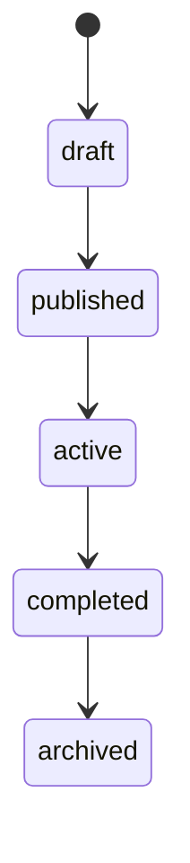

| 状态        | 含义         | 允许操作                                         | 禁止操作                                           | 进入条件         | 退出条件                |
| ----------- | ------------ | ------------------------------------------------ | -------------------------------------------------- | ---------------- | ----------------------- |
| `draft`     | 课程草稿态   | 编辑课程、绑定场景、绑定参数、配置名册、配置规则 | 创建正式 Run、对学生开放结果页                     | 课程新建成功     | 绑定依赖完整并发布      |
| `published` | 已发布可开赛 | 创建 Run、导入最终名册、查看课程详情             | 替换核心绑定、物理删除课程                         | 课程发布成功     | 创建 Run 并进入教学活动 |
| `active`    | 回合运行中   | 开轮、锁轮、查看教师工作台、发布结果             | 替换 `ScenarioPackage` / `ParameterSet` 等核心资产 | 有活动 Run       | 全部回合结束            |
| `completed` | 教学已完成   | 导出、复盘、学习诊断、归档                       | 打开新正式回合、修改历史结果                       | 所有回合封盘     | 发起归档                |
| `archived`  | 历史只读     | 审计查询、导出、历史回看                         | 新写入、再发布                                     | 管理员或教师归档 | 无，通常终态            |

### 回合状态机

_资料依据：REQ 207-219；SA 436-445；API 455-489, 531-542；DB 367-378, 788-799。_

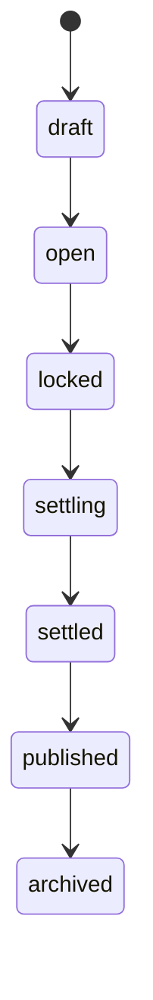

| 状态        | 含义             | 允许操作                               | 禁止操作                   | 进入条件     | 退出条件               |
| ----------- | ---------------- | -------------------------------------- | -------------------------- | ------------ | ---------------------- |
| `draft`     | 回合尚未开放     | 配置时间窗、设置 shock 计划            | 提交决策、读取本轮结果     | Run 已创建   | 教师启动回合           |
| `open`      | 决策窗口开放     | 学员保存草稿、提交决策、教师提醒       | 正式结算、发布结果         | 启动回合成功 | 教师锁轮或窗口到期     |
| `locked`    | 决策冻结待结算   | 生成 `decision_batch_id`、查看冻结摘要 | 再提交、改草稿、改截止时间 | 锁轮成功     | 创建结算任务           |
| `settling`  | 正在正式结算     | 仅系统执行结算与补偿                   | 前台写操作、发布结果       | 结算任务开始 | 结算成功或失败回退     |
| `settled`   | 结果已生成未发布 | 教师预览、检查结果                     | 学员查看正式结果           | 结算完成     | 教师发布或计划自动发布 |
| `published` | 正式结果已发布   | 前台查看反馈、教师点评、学习诊断       | 覆盖历史结果               | 结果发布成功 | 归档                   |
| `archived`  | 历史闭环结束     | 只读查询、导出                         | 新写入                     | 回合归档     | 无                     |

### 决策状态机

_资料依据：REQ 221-233；DB 389-405, 794-808；FEAT 144-153；API 498-507。_

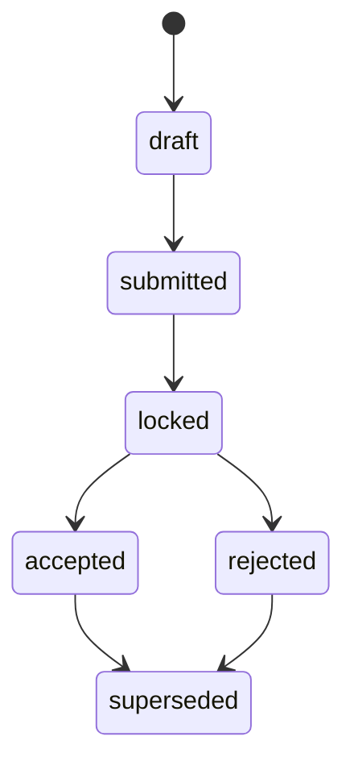

| 状态         | 含义                       | 允许操作                         | 禁止操作             | 进入条件                             | 退出条件           |
| ------------ | -------------------------- | -------------------------------- | -------------------- | ------------------------------------ | ------------------ |
| `draft`      | 团队草稿                   | 保存、协作讨论、本地校验         | 作为正式生效版本结算 | 首次建草稿                           | 提交到服务端       |
| `submitted`  | 已提交待冻结               | 查看校验反馈、再次提交生成新版本 | 直接进入结算         | API-017 成功                         | 锁轮或被新版本替代 |
| `locked`     | 锁轮时生效版本             | 被 validator / settle 引用       | 编辑原版本           | 回合锁定且该版本 `is_effective=true` | 结算接受或拒绝     |
| `accepted`   | 进入正式结算的有效决策     | 在审计与 Replay 中被引用         | 覆盖修改             | 校验通过且参与结算                   | 产生更高版本或归档 |
| `rejected`   | 因校验失败或权限失败不生效 | 查看错误、生成新版本             | 参与正式结算         | 校验不通过                           | 重新提交新版本     |
| `superseded` | 被更高版本替代             | 只读查看、版本对比               | 成为有效版本         | 新版本提交成功                       | 归档               |

### 参数集状态机

_资料依据：MEC 206-208, 228-243；SA 438；DB 485-486, 790-812；PLG 337-350。_

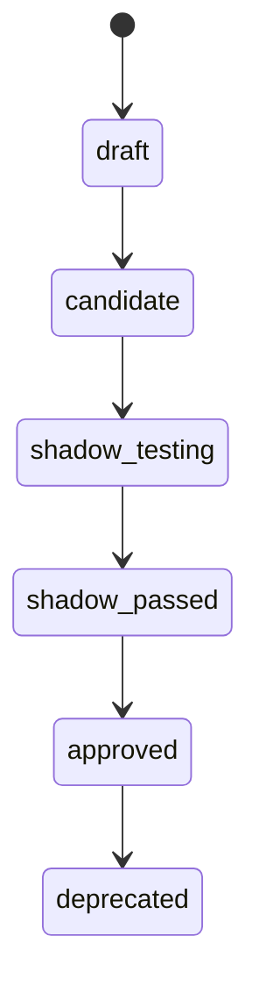

| 状态             | 含义         | 允许操作                                    | 禁止操作                 | 进入条件           | 退出条件           |
| ---------------- | ------------ | ------------------------------------------- | ------------------------ | ------------------ | ------------------ |
| `draft`          | 参数草稿     | 编辑系数、公式、诊断元数据                  | 绑定正式 Run             | 新建参数集         | 完成离线校准       |
| `candidate`      | 候选参数     | Golden Solver、离线诊断、提交 Shadow Replay | 正式绑定课程             | 草稿完成基础校验   | 发起 Shadow Replay |
| `shadow_testing` | 影子回放中   | 执行 Shadow Replay、记录差异                | 审批发布                 | 候选进入治理门禁   | 通过或失败         |
| `shadow_passed`  | 已过差异门限 | 提交审批、生成 approval request             | 直接被 Run 绑定          | Shadow Replay 通过 | 治理审批           |
| `approved`       | 正式可绑定   | 供新课程 / 新 Run 绑定、查询、审计          | 原位覆盖修改、运行中替换 | 审批通过           | 被废弃             |
| `deprecated`     | 退役只读     | 历史回放、审计                              | 新 Run 绑定、修改        | 新版本替代或下线   | 无                 |

### 插件状态机

_资料依据：PLG 231-247, 532-552；DB 468-469, 791-812；REQ 361-373。_

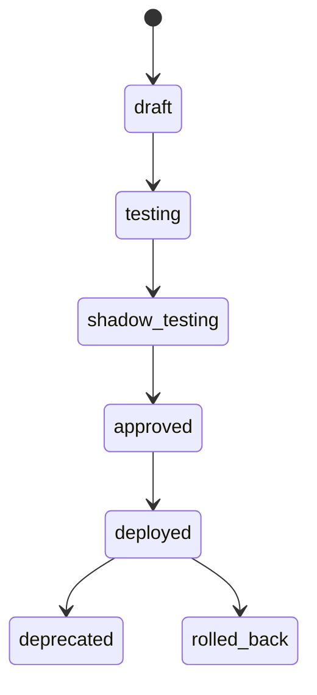

| 状态             | 含义           | 允许操作                                | 禁止操作           | 进入条件                         | 退出条件           |
| ---------------- | -------------- | --------------------------------------- | ------------------ | -------------------------------- | ------------------ |
| `draft`          | 插件草稿包     | 编辑 manifest、上传 artifact、补测试    | 被场景或 Run 引用  | 上传插件包                       | 通过基础校验       |
| `testing`        | 测试态         | 契约测试、兼容性测试、安全 hook 测试    | 发布到正式课程     | draft 校验通过                   | 发起 Shadow Replay |
| `shadow_testing` | 影子回放验证态 | 旁路重放、生成 diff 报告                | 指向正式活跃 Run   | 测试通过且有历史基线             | 审批或退回         |
| `approved`       | 治理批准态     | 被 `ScenarioPackage` 绑定、进入部署队列 | 热替换进行中 Run   | Shadow Replay + 审核通过         | 部署或撤回         |
| `deployed`       | 已部署可用态   | 供新 Run 绑定、供新场景编译             | 覆盖历史正式结果   | 审批通过且发布完成               | 退役或回滚         |
| `deprecated`     | 退役只读态     | 历史查询、旧 Run Replay                 | 新课程绑定         | 新版本替代                       | 无                 |
| `rolled_back`    | 已回滚退出     | 审计查询、历史重放                      | 恢复为活跃生产版本 | 部署后出现质量 / 性能 / 合规问题 | 无                 |

### 模型版本状态机

_资料依据：SA 439, 528；AI 709-725, 749；DB 488-500, 792；FEAT 77。_

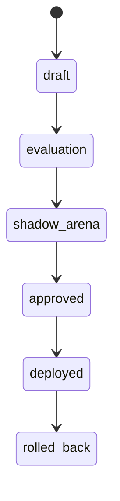

| 状态           | 含义         | 允许操作                                 | 禁止操作                 | 进入条件           | 退出条件                   |
| -------------- | ------------ | ---------------------------------------- | ------------------------ | ------------------ | -------------------------- |
| `draft`        | 模型初稿     | 录入版本、绑定 Prompt、基础联调          | 对外提供服务             | 新版本登记         | 提交离线评测               |
| `evaluation`   | 离线评测中   | Golden cases、越权测试、格式测试         | 灰度到课堂流量           | 草稿通过基础校验   | 进入 Shadow Arena 或打回   |
| `shadow_arena` | 影子对照运行 | Teacher sandbox、Shadow Replay、差异分析 | 进入正式结果链、全量发布 | 评测通过           | 审批或驳回                 |
| `approved`     | 可发布       | 准备灰度、绑定适用租户与课程             | 直接全量上线、绕过监控   | 治理审批通过       | 灰度部署                   |
| `deployed`     | 已在线服务   | 灰度 / canary / 全量、监控、回滚         | 绕过发布流程修改配置     | 灰度完成           | 触发回滚                   |
| `rolled_back`  | 已回滚退出   | 查询审计、故障复盘                       | 继续提供服务             | 监控劣化或合规触发 | 重新修复后以新版本进入流程 |

> 说明：研究文档建议为模型增加 `deprecated` 停用态；若仓库后续采纳，请在实现中扩展状态机并同步修改本文件。请根据实际项目修改。（依据：AI 709-725；DB 498-500）

### 异步事件总览

事件流是正式结算、学习诊断、Replay 与审核治理的粘合层。正式 Run 至少要把决策、锁轮、结算、AI 调用、审核和学习事件写入事件账本；事件字典可在实现阶段进一步冻结为 OpenAPI / JSON Schema / Protobuf 双轨契约。（依据：FEAT 79-89；SA 343-353, 721-726, 787；API 40-47；TEST 29, 74-76）

| 事件名称                     | 触发条件                               | 发布方             | 订阅方                                                         | 数据载荷                                                               | 是否审计 |
| ---------------------------- | -------------------------------------- | ------------------ | -------------------------------------------------------------- | ---------------------------------------------------------------------- | -------- |
| `CoursePublished`            | 课程从 `draft/review` 转为 `published` | Course Service     | Run Orchestrator / Notification / Audit                        | `tenant_id`、`course_id`、`scenario_package_id`、`parameter_set_id`    | 是       |
| `RoundOpened`                | 回合启动成功                           | Run Orchestrator   | Student BFF / Teacher BFF / Notification                       | `run_id`、`round_id`、时间窗、shock 计划摘要                           | 是       |
| `DecisionSubmitted`          | 决策提交成功                           | Decision Service   | Validator / Audit / Learning / Notification                    | `decision_id`、`decision_version_id`、`team_id`、`client_revision`     | 是       |
| `RoundLocked`                | 锁轮成功并固化 `decision_batch_id`     | Run Orchestrator   | Settlement Pipeline / Audit / Notification                     | `run_id`、`round_id`、`decision_batch_id`、`lock_reason`               | 是       |
| `SettlementStarted`          | 结算任务创建                           | Settlement Service | Audit / Monitoring                                             | `run_id`、`round_id`、`parameter_set_id`、`seed`                       | 是       |
| `SettlementCompleted`        | 正式结算完成                           | Simulation Engine  | Snapshot / Result / Replay / Learning                          | `round_id`、`replay_hash`、`snapshot_ids[]`、`result_ids[]`            | 是       |
| `SettlementFailed`           | 正式结算失败或补偿触发                 | Simulation Engine  | Audit / Ops / Replay Queue                                     | `run_id`、`round_id`、`error_code`、`retryable`                        | 是       |
| `ResultPublished`            | 回合结果进入学生可见面                 | Result Service     | Teacher BFF / Student BFF / AI / Learning / Notification       | `run_id`、`round_id`、`published_at`、可见视图引用                     | 是       |
| `AIAdviceGenerated`          | AI 策略建议或风险卡生成                | AI Orchestrator    | Frontend / Audit / Learning                                    | `coach_output_id`、`model_version_id`、`task_type`、`visibility_scope` | 是       |
| `ReplayCompleted`            | 官方 Replay 完成                       | Replay Service     | Governance / Teacher / Audit                                   | `replay_run_id`、`passed`、`replay_hash`、`report_ref`                 | 是       |
| `ShadowReplayCompleted`      | Shadow Replay 完成                     | Replay Service     | Parameter Registry / Plugin Service / Model Governance / Audit | `replay_run_id`、`candidate_ref`、`diff_summary`、`passed`             | 是       |
| `ParameterSetApproved`       | 参数集审批通过                         | Parameter Registry | Run Orchestrator / Audit / Notification                        | `parameter_set_id`、版本、审批记录                                     | 是       |
| `PluginApproved`             | 插件审批通过                           | Plugin Service     | Scenario Compiler / Audit / Notification                       | `plugin_id`、版本、`shadow_replay_id`                                  | 是       |
| `ModelVersionDeployed`       | 模型完成灰度发布                       | Model Governance   | AI Orchestrator / Ops / Audit                                  | `model_version_id`、流量比例、回滚指针                                 | 是       |
| `LearningReportGenerated`    | 学习报告生成完成                       | LRS / Analytics    | Teacher BFF / Student BFF / Recommendation                     | `learning_report_id`、`subject_type`、`subject_id`、`report_version`   | 是       |
| `ContentModerationRequested` | 帖子发出或举报触发审核                 | Community Service  | Moderation / Recommendation / Audit                            | `post_id`、`visibility`、`risk_flags`                                  | 是       |

## 课程与回合主链流程

### 租户初始化流程

_流程编号：WF-001。资料依据：REQ 309-317, 381-399；FEAT 253-262；DB 224-271, 896-899；ENV 759-769；SA 253-255, 513-531。_

该流程虽然未在现有 API 合同中完整冻结，但它是多租户 SaaS 平台的根流程。本文件采用“平台管理员创建租户、创建租户管理员、初始化角色权限与默认配置、发送激活通知”的标准实现路径；涉及租户域名、套餐、资源配额等字段建议放在 `tenant.config` 中，请根据实际项目修改。

**主流程**

| 步骤 | 泳道                 | 动作                                         | 状态 / 数据变化                                             |
| ---- | -------------------- | -------------------------------------------- | ----------------------------------------------------------- |
| 1    | Platform Admin       | 在管理后台发起“创建租户”                     | 进入租户创建向导                                            |
| 2    | API Gateway          | 校验平台管理员身份与幂等键                   | 注入 `trace_id`                                             |
| 3    | Admin / Auth Service | 校验 `tenant_code`、租户名、管理员邮箱唯一性 | 通过则进入写库                                              |
| 4    | Admin Service        | 写入 `tenant` 根记录                         | `tenant.status=active` 或 `suspended`（请根据实际项目修改） |
| 5    | Admin / Auth Service | 创建租户管理员用户                           | 写入 `user`                                                 |
| 6    | Admin / IAM          | 初始化默认角色与权限模板                     | 写入 `role`、`permission`、`user_role`                      |
| 7    | Admin Service        | 初始化租户策略配置                           | `tenant.config` 写入域名、套餐、配额、功能开关（占位）      |
| 8    | Notification Service | 发送激活通知与首次登录指引                   | 写入 `notification`                                         |
| 9    | Audit Service        | 记录创建全链路审计                           | `audit_log` 追加写                                          |
| 10   | Platform Admin       | 完成验收并交付租户管理员                     | 输出 `tenant_id`、管理员初始化状态                          |

**异常流程**

| 异常               | 触发点  | 系统处理                                      |
| ------------------ | ------- | --------------------------------------------- |
| 租户名称重复       | 第 3 步 | 返回冲突错误，禁止创建                        |
| 域名重复           | 第 7 步 | 拒绝保存 `tenant.config.domain`，需修改后重试 |
| 管理员邮箱无效     | 第 3 步 | 返回格式错误，不写用户                        |
| 默认角色初始化失败 | 第 6 步 | 回滚租户创建，记录失败审计                    |
| 通知发送失败       | 第 8 步 | 不回滚核心创建；通知进入重试队列并审计        |

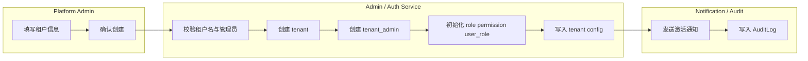

**接口、数据、审计与验收**

| 类别       | 内容                                                                                                                                                                |
| ---------- | ------------------------------------------------------------------------------------------------------------------------------------------------------------------- |
| 涉及 API   | `POST /api/v1/admin/tenants`、`POST /api/v1/admin/tenants/{tenantId}/admins`、`POST /api/v1/admin/tenants/{tenantId}/activate` 为建议接口，占位，请根据实际项目修改 |
| 涉及数据表 | `tenant`、`user`、`role`、`permission`、`user_role`、`audit_log`、`notification`                                                                                    |
| 审计点     | `TENANT_CREATED`、`TENANT_ADMIN_CREATED`、`ROLE_SEEDED`、`TENANT_CONFIG_INITIALIZED`、`ACTIVATION_NOTIFICATION_SENT`                                                |
| 验收标准   | 租户根对象、管理员、默认角色权限和配置一次性创建成功；冲突错误可定位；高风险动作可回溯到平台管理员与请求摘要；通知失败不影响主数据一致性                            |

### 用户注册与登录流程

_流程编号：WF-002。资料依据：REQ 151-163；FEAT 95-108；API 165-168, 203-269, 807-811, 832-835；SA 106-108, 652-654；TEST 68-69。_

当前 MVP 已冻结邮箱 / 密码登录、刷新令牌和当前会话查询；企业 SSO 与 SCIM 用户预配在需求中标记为 P1 / P2，本文件以占位方式建模。登录成功后必须完成租户识别、角色解析、RBAC / Scope / 字段可见性裁剪并写入登录审计；错误凭证不能泄露账户存在性，账号锁定必须返回受控错误。

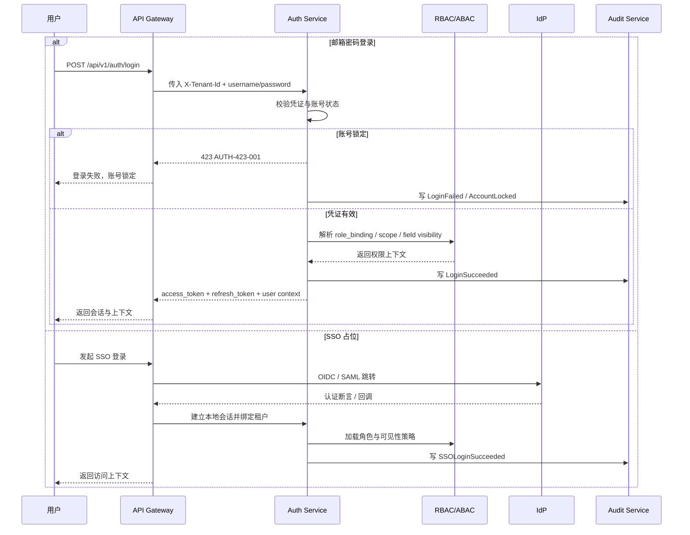

**主流程**

| 步骤 | 泳道          | 动作                                     | 状态 / 数据变化               |
| ---- | ------------- | ---------------------------------------- | ----------------------------- |
| 1    | User          | 输入账号密码或发起 SSO                   | 选择认证通道                  |
| 2    | API Gateway   | 解析 `X-Tenant-Id`、设备类型、`trace_id` | 构建认证上下文                |
| 3    | Auth Service  | 校验账号状态、密码哈希或 SSO 断言        | 识别用户是否合法              |
| 4    | Auth Service  | 加载 `user_role`、课程与队伍范围         | 组装 scope 绑定               |
| 5    | RBAC / ABAC   | 计算资源级与字段级可见性                 | 返回最小权限上下文            |
| 6    | Auth Service  | 签发 `access_token` / `refresh_token`    | 会话建立                      |
| 7    | Audit Service | 写登录审计与失败审计                     | `audit_log` 追加写            |
| 8    | User          | 调用 `/api/v1/auth/me` 获取当前会话      | 前端 `permissionStore` 初始化 |

**异常流程**

| 异常             | 触发点          | 系统处理                                  |
| ---------------- | --------------- | ----------------------------------------- |
| 参数缺失         | 第 1 步         | 返回 `AUTH-400-001`                       |
| 用户名或密码错误 | 第 3 步         | 返回统一 `AUTH-401-001`，不泄露账户存在性 |
| 账户锁定         | 第 3 步         | 返回 `AUTH-423-001`，禁止签发 token       |
| 租户不匹配       | 第 2 / 3 步     | 直接拒绝，不暴露他租户信息                |
| 角色缺失         | 第 4 步         | 返回受控错误并写审计                      |
| SSO 回调失败     | 第 3 步         | 写 `SSOLoginFailed` 审计，返回重试入口    |
| 刷新令牌失效     | `/auth/refresh` | 返回 401，要求重新登录                    |

**接口、数据、审计与验收**

| 类别       | 内容                                                                                                                                                               |
| ---------- | ------------------------------------------------------------------------------------------------------------------------------------------------------------------ |
| 涉及 API   | `POST /api/v1/auth/login`、`POST /api/v1/auth/refresh`、`GET /api/v1/auth/me`、`POST /api/v1/role-bindings`；`/api/v1/auth/sso` 为建议占位接口，请根据实际项目修改 |
| 涉及数据表 | `user`、`role`、`permission`、`user_role`、`audit_log`                                                                                                             |
| 审计点     | `LOGIN_SUCCEEDED`、`LOGIN_FAILED`、`ACCOUNT_LOCKED`、`TOKEN_REFRESHED`、`SSO_LOGIN_SUCCEEDED`                                                                      |
| 验收标准   | 认证成功后返回 token 与租户上下文；失败不泄露用户存在性；`Authorization + X-Tenant-Id` 组合校验有效；前端能基于 `/auth/me` 初始化权限与可见字段                    |

### 教师创建课程流程

_流程编号：WF-003。资料依据：REQ 165-177；FEAT 110-118, 223-232；API 170-173, 300-360；DB 285-295, 847-851；FE 250-260, 309-318；TEST 70。_

该流程的核心不是“写一条课程记录”，而是在课程发布前完整绑定场景、参数、评分、名册与轮次规则；否则后续 Run 将失去可比性与可回放性。课程在 `draft` 阶段可编辑，且只允许绑定已编译场景与已批准参数集；发布后仅允许有限字段变更。

**主流程**

| 步骤 | 泳道                         | 动作                                              | 状态 / 数据变化               |
| ---- | ---------------------------- | ------------------------------------------------- | ----------------------------- |
| 1    | Teacher                      | 进入课程控制台并创建课程草稿                      | `Course=draft`                |
| 2    | API Gateway / Course Service | 写入课程基本信息、教学目标、计划回合数            | 生成 `course_id`              |
| 3    | Teacher                      | 设置课程名称、时间、回合数、评分规则              | 更新课程草稿                  |
| 4    | Teacher / Scenario Service   | 选择场景模板并触发场景编译                        | 生成 `ScenarioPackage(draft)` |
| 5    | Teacher / Course Service     | 绑定 `ScenarioPackage` 与 `approved ParameterSet` | 课程依赖冻结到草稿层          |
| 6    | Teacher                      | 保存草稿并做开课前检查                            | 检查未通过则不允许发布        |
| 7    | Course Service               | 发布课程                                          | `Course=published`            |
| 8    | Audit Service                | 写课程创建与发布审计                              | 审计链闭环                    |

**异常流程**

| 异常                     | 触发点      | 系统处理                           |
| ------------------------ | ----------- | ---------------------------------- |
| 权限不足                 | 第 1 步     | 返回 403，禁止创建                 |
| 场景包未审批或未编译完成 | 第 4 / 5 步 | 返回场景不可用错误                 |
| 参数集未 `approved`      | 第 5 步     | 返回 `CRS-422-002` / `CRS-428-001` |
| 回合数不合法             | 第 3 步     | 阻断保存与发布                     |
| 发布失败                 | 第 7 步     | 保持 `draft`，不进入 `published`   |

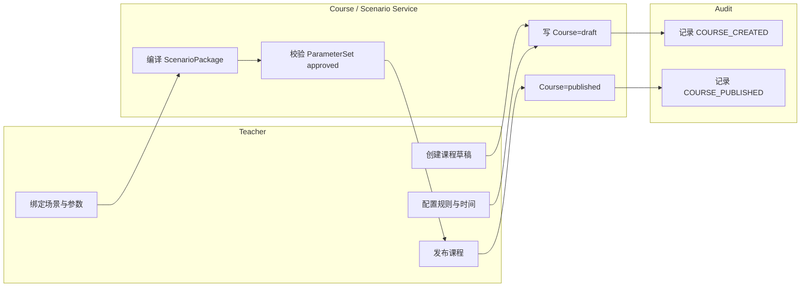

**接口、数据、审计与验收**

| 类别       | 内容                                                                                                                                    |
| ---------- | --------------------------------------------------------------------------------------------------------------------------------------- |
| 涉及 API   | `POST /api/v1/courses`、`POST /api/v1/scenarios/compile`、`PATCH /api/v1/courses/{courseId}`、`POST /api/v1/courses/{courseId}/publish` |
| 涉及数据表 | `course`、`scenario_package`、`parameter_set`、`audit_log`                                                                              |
| 审计点     | `COURSE_CREATED`、`COURSE_UPDATED`、`SCENARIO_BOUND`、`PARAMETERSET_BOUND`、`COURSE_PUBLISHED`                                          |
| 验收标准   | 草稿默认创建成功；未批准参数集或未编译场景不得发布；发布后返回 `Course=published`；课程变更和发布全过程可追溯                           |

### 教师配置场景与行业插件流程

_流程编号：WF-004。资料依据：REQ 179-191, 361-373；FEAT 114-118, 223-232；API 171, 191-194, 318-327, 711-740；PLG 233-260, 379-382, 532-552；DB 443-486；TEST 70, 77。_

该流程是“行业无关 kernel + 行业插件”微内核模式的落地流程。教师只能选择 `approved/deployed` 插件和 `approved` 参数集；任何已绑定到正式 Run 的参数、插件和场景组合都不能被原位覆盖，修改必须走新版本。

**主流程**

| 步骤 | 泳道                        | 动作                                          | 状态 / 数据变化                           |
| ---- | --------------------------- | --------------------------------------------- | ----------------------------------------- |
| 1    | Teacher                     | 选择行业插件                                  | 读取插件列表                              |
| 2    | Plugin Service              | 校验插件状态为 `approved/deployed`            | 不可用则阻断                              |
| 3    | Teacher / Scenario Designer | 选择场景包或场景模板                          | 进入场景编译                              |
| 4    | Teacher                     | 配置行业字段、初始状态、回合脚本、shock 计划  | 形成编译输入                              |
| 5    | Plugin Service              | 编译插件上下文并做兼容性校验                  | 输出 `plugin_context_id` / `context_hash` |
| 6    | Course / Scenario Service   | 绑定 `approved ParameterSet`                  | 完成场景-参数-插件组合                    |
| 7    | Teacher                     | 预览场景配置结果                              | 仅预览，不启动正式 Run                    |
| 8    | Scenario Service            | 保存为新 `ScenarioPackage` 版本或发布课程依赖 | 写版本化资产                              |
| 9    | Audit Service               | 写编译、绑定与版本审计                        | 审计完成                                  |

**异常流程**

| 异常                        | 触发点      | 系统处理                           |
| --------------------------- | ----------- | ---------------------------------- |
| 插件未审批 / 未部署         | 第 2 步     | 拒绝绑定                           |
| ParameterSet 未 `approved`  | 第 6 步     | 拒绝绑定                           |
| 插件兼容性校验失败          | 第 5 步     | 返回 `compatibility_report`        |
| 行业字段缺失                | 第 4 / 5 步 | 返回 `PLG-422-002`                 |
| 正式 Run 已绑定后仍尝试覆盖 | 第 8 步     | 强制要求生成新版本，不允许原位修改 |

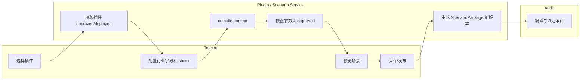

**接口、数据、审计与验收**

| 类别       | 内容                                                                                                                                                                                                                                                                              |
| ---------- | --------------------------------------------------------------------------------------------------------------------------------------------------------------------------------------------------------------------------------------------------------------------------------- |
| 涉及 API   | `GET /api/v1/plugins`、`POST /api/v1/plugins/{pluginId}/compile-context`、`POST /api/v1/scenarios/compile`、`PATCH /api/v1/courses/{courseId}`、`POST /api/v1/plugins/{pluginId}/release`；治理面建议补充 `/api/plugins/{id}/validate`、`/approve`、`/deploy`，请根据实际项目修改 |
| 涉及数据表 | `plugin_package`、`scenario_package`、`parameter_set`、`approval_record`、`audit_log`                                                                                                                                                                                             |
| 审计点     | `PLUGIN_CONTEXT_COMPILED`、`SCENARIO_COMPILED`、`PARAMETERSET_BOUND`、`SCENARIO_VERSION_CREATED`                                                                                                                                                                                  |
| 验收标准   | 插件必须处于 `approved/deployed` 才能进入教学配置；参数集必须 `approved`；正式发布后任何修改均形成新版本；预览结果不等于正式真值                                                                                                                                                  |

### 教师创建队伍与分配学员流程

_流程编号：WF-005。资料依据：REQ 193-205；FEAT 117-118, 223-226；API 175-177, 390-417；DB 308-345, 1000-1002；FE 260-303；TEST 71。_

该流程负责把课程名册转换为结算最小组织单元。队伍是决策、结算和排名的最小业务主体，角色槽位必须唯一，队长必须唯一；若允许缺岗保底，系统只能补空白而不能追求最优解，且必须在前端明示 `system_intervened` 或等价标记。

**主流程**

| 步骤 | 泳道                 | 动作                                 | 状态 / 数据变化          |
| ---- | -------------------- | ------------------------------------ | ------------------------ |
| 1    | Teacher              | 手动创建队伍或批量导入人员           | 生成 `team`              |
| 2    | Team Service         | 校验 `team_code`、初始资本、风险限额 | 合法则写队伍             |
| 3    | Teacher              | 批量导入学员、分配成员并指定角色槽位 | 写 `team_member`         |
| 4    | Teacher              | 选定队长、处理缺岗角色               | 队长唯一；允许空槽位     |
| 5    | Team Service         | 如启用自动分队，执行受控分配规则     | 仅生成组织关系，不生成绩 |
| 6    | Notification Service | 发送邀请与确认通知                   | 写 `notification`        |
| 7    | Teacher / Student    | 队伍确认                             | 课程组织层完成           |
| 8    | Audit Service        | 记录分配与变更历史                   | 审计完成                 |

**异常流程**

| 异常             | 触发点      | 系统处理                         |
| ---------------- | ----------- | -------------------------------- |
| 队伍编码冲突     | 第 2 步     | 返回 `TEAM-409-001`              |
| 学员不在课程范围 | 第 3 步     | 返回 `TEAM-422-002`              |
| 角色槽位重复     | 第 3 / 4 步 | 返回 `TEAM-409-002`              |
| 队长重复         | 第 4 步     | 阻断保存                         |
| 批量导入失败     | 第 3 步     | 输出导入报告，支持部分修复后重试 |

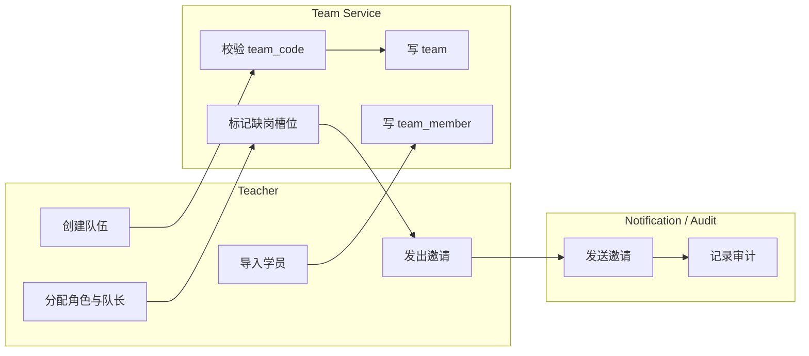

**接口、数据、审计与验收**

| 类别       | 内容                                                                                                                              |
| ---------- | --------------------------------------------------------------------------------------------------------------------------------- |
| 涉及 API   | `POST /api/v1/courses/{courseId}/teams`、`PUT /api/v1/teams/{teamId}/members`、建议补充批量导入与自动分队接口，请根据实际项目修改 |
| 涉及数据表 | `enrollment`、`team`、`team_member`、`notification`、`audit_log`                                                                  |
| 审计点     | `TEAM_CREATED`、`TEAM_MEMBER_ASSIGNED`、`CAPTAIN_SET`、`ROLE_SLOT_RESERVED`、`TEAM_INVITATION_SENT`                               |
| 验收标准   | 队长唯一、角色槽位唯一、缺岗补位透明可追溯、队伍变更历史可检查；通知失败不影响组织关系主数据                                      |

### 学员加入课程与队伍流程

_流程编号：WF-006。资料依据：REQ 151-163, 193-205, 291-303, 520；FEAT 101-108, 117, 238-247；DB 308-318, 335-345；FE 119, 264-277, 281-301；API 165-177, 246-249, 426-430。_

当前文档明确了名册、`Enrollment`、`TeamMember` 和学员课程入口，但未完全冻结“接受邀请”接口；本文件按“收到邀请 → 登录 → 激活 Enrollment → 绑定 Team → 进入驾驶舱”建模，邀请与接受接口为建议占位，请根据实际项目修改。

**主流程**

| 步骤 | 泳道                   | 动作                                  | 状态 / 数据变化               |
| ---- | ---------------------- | ------------------------------------- | ----------------------------- |
| 1    | Student                | 接收课程 / 队伍邀请通知               | 获得课程上下文                |
| 2    | Student / Auth Service | 登录平台并识别租户                    | 建立会话                      |
| 3    | Enrollment Service     | 激活 `Enrollment`                     | `status: invited -> enrolled` |
| 4    | Team Service           | 将学员绑定到队伍与角色槽位            | 读取 `team_member`            |
| 5    | Student                | 查看角色、课程规则、当前回合状态      | 初始化学员端驾驶舱            |
| 6    | Team Dashboard         | 返回 `state_obs/state_est` 与截止时间 | 进入团队工作区                |
| 7    | Audit Service          | 写入加入课程与进入队伍审计            | 完成入队留痕                  |

**异常流程**

| 异常           | 触发点      | 系统处理                           |
| -------------- | ----------- | ---------------------------------- |
| 邀请过期       | 第 1 步     | 返回“邀请失效”，要求教师重发       |
| 学员不属于租户 | 第 2 / 3 步 | 阻断 Enrollment 激活               |
| 课程未发布     | 第 3 步     | 允许查看信息，不允许进入正式驾驶舱 |
| 队伍人数已满   | 第 4 步     | 拒绝绑定，需要教师调整             |
| 回合已锁定     | 第 5 / 6 步 | 允许只读查看，不允许提交           |

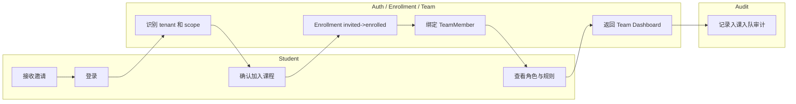

**接口、数据、审计与验收**

| 类别       | 内容                                                                                                                                                                                                               |
| ---------- | ------------------------------------------------------------------------------------------------------------------------------------------------------------------------------------------------------------------ |
| 涉及 API   | `POST /api/v1/auth/login`、`GET /api/v1/auth/me`、`GET /api/v1/teams/{teamId}/dashboard`；建议补充 `/api/v1/enrollments/{enrollmentId}/accept`、`/api/v1/course-invitations/{inviteId}/accept`，请根据实际项目修改 |
| 涉及数据表 | `enrollment`、`team_member`、`team`、`course`、`round`、`notification`、`audit_log`                                                                                                                                |
| 审计点     | `ENROLLMENT_ACCEPTED`、`TEAM_JOINED`、`STUDENT_APP_ENTERED`                                                                                                                                                        |
| 验收标准   | 登录后能解析课程与本队范围；学员仅可见本队驾驶舱与允许字段；邀请过期、课程未发布、队伍已满等异常路径有明确反馈                                                                                                     |

### 学员提交决策流程

_流程编号：WF-007。资料依据：REQ 221-233, 291-303；FEAT 144-153, 238-247, 317-320；API 181, 498-520；SA 199-200, 223-224, 463-468；DB 380-405, 794-808；TEST 73。_

该流程是学员端最核心的写流程。学员只能读取 `state_obs/state_est` 与授权调研结果，不能读取完整 `state_true`；提交后的正式对象是 `DecisionVersion`，而不是被覆盖的单条草稿记录；`agent_proposal_refs` 只进入审计和复盘，不直接参与正式结算。

**主流程**

| 步骤 | 泳道                      | 动作                                              | 状态 / 数据变化          |
| ---- | ------------------------- | ------------------------------------------------- | ------------------------ |
| 1    | Student                   | 打开团队驾驶舱                                    | 读取本队 KPI、截止时间   |
| 2    | Team Dashboard / Snapshot | 返回 `state_obs/state_est`                        | 不暴露 `state_true`      |
| 3    | Student                   | 填写结构化决策并保存草稿                          | 产生前端本地版本         |
| 4    | Team Member               | 协作确认、证据引用、角色补充                      | 更新草稿                 |
| 5    | Student / Team Captain    | 提交决策                                          | 调用 API-017             |
| 6    | Decision Service          | 调用 `DecisionValidator` 校验预算、权限、截止规则 | 产生 `validation_report` |
| 7    | Decision Service          | 生成 `Decision` 聚合与新 `DecisionVersion`        | 追加写版本历史           |
| 8    | Audit Service             | 写 `DecisionSubmitted` 审计                       | 审计完成                 |
| 9    | Student                   | 获得提交成功回执                                  | `status=submitted`       |

**异常流程**

| 异常               | 触发点      | 系统处理                           |
| ------------------ | ----------- | ---------------------------------- |
| 缺少必填字段       | 第 3 / 6 步 | 返回结构化校验错误                 |
| 预算或风险约束冲突 | 第 6 步     | 返回可读化 `validation_report`     |
| 回合已锁定         | 第 5 步     | 返回 `DEC-409-001`                 |
| Run 未冻结参数集   | 第 5 / 6 步 | 返回 `DEC-428-001`                 |
| 幂等重复提交       | 第 5 步     | 返回同一提交结果，不产生重复副作用 |

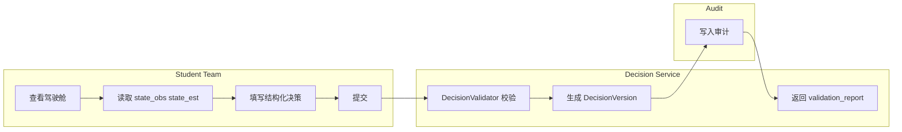

**接口、数据、审计与验收**

| 类别       | 内容                                                                                                                                                       |
| ---------- | ---------------------------------------------------------------------------------------------------------------------------------------------------------- |
| 涉及 API   | `GET /api/v1/teams/{teamId}/dashboard`、`GET /api/v1/runs/{runId}/rounds/{roundNo}/state-snapshot`、`POST /api/v1/runs/{runId}/rounds/{roundNo}/decisions` |
| 涉及数据表 | `decision`、`decision_version`、`state_snapshot`、`audit_log`                                                                                              |
| 审计点     | `DECISION_DRAFT_SAVED`（建议）、`DECISION_SUBMITTED`、`AI_PROPOSAL_REFERENCED`、`DECISION_VALIDATED`                                                       |
| 验收标准   | 学员只能提交本队决策；每次修改都形成新 `DecisionVersion`；锁轮后禁止修改；AI 建议可引用但不直接改变正式结算输入                                            |

### 教师锁定回合流程

_流程编号：WF-008。资料依据：REQ 207-219；FEAT 144-153, 223-232；API 180, 473-489；SA 437, 461-468, 588-593；DB 367-378；FE 260-289, 323-327；TEST 72, 87。_

锁轮是“流程控制”而不是“结果控制”。锁轮的输出是稳定的 `decision_batch_id` 与不可再写的回合窗口；如果启用缺岗 / 缺队自动补足，系统保底只能补空白且必须明示，不得暗中替队伍做最优解。

**主流程**

| 步骤 | 泳道                   | 动作                                         | 状态 / 数据变化          |
| ---- | ---------------------- | -------------------------------------------- | ------------------------ |
| 1    | Teacher                | 查看各队提交状态与缺岗状态                   | 读取回合监控面板         |
| 2    | Teacher / Notification | 对未提交团队发出提醒                         | 写通知 / 提醒事件        |
| 3    | Teacher                | 决定正常锁轮或强制锁轮                       | 发起锁轮命令             |
| 4    | Round Service          | 校验当前状态、统计最新有效 `DecisionVersion` | 形成 `decision_batch_id` |
| 5    | Run Orchestrator       | 回合从 `open` 变为 `locked`                  | 冻结决策窗口             |
| 6    | Audit Service          | 写 `RoundLocked` 审计                        | 审计完成                 |
| 7    | Teacher                | 进入结算等待页                               | 后续只读                 |

**异常流程**

| 异常                           | 触发点      | 系统处理                                   |
| ------------------------------ | ----------- | ------------------------------------------ |
| 权限不足                       | 第 3 步     | 返回 403                                   |
| 已锁定                         | 第 4 步     | 返回 `ROUND-423-001`                       |
| 未提交队伍存在且课程不允许保底 | 第 4 步     | 返回 `ROUND-409-002`                       |
| 并发锁定冲突                   | 第 4 / 5 步 | 仅保留一个成功锁轮请求，其他返回幂等或冲突 |
| 保底补足触发                   | 第 4 步     | 记录 `system_intervened` 并在结果页明示    |

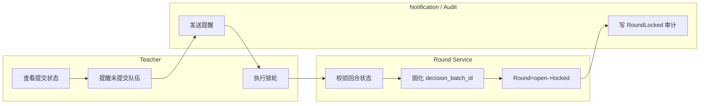

**接口、数据、审计与验收**

| 类别       | 内容                                                                                                                   |
| ---------- | ---------------------------------------------------------------------------------------------------------------------- |
| 涉及 API   | `POST /api/v1/runs/{runId}/rounds/{roundNo}/lock`、建议补充未提交队伍提醒接口，请根据实际项目修改                      |
| 涉及数据表 | `round`、`decision`、`decision_version`、`team`、`notification`、`audit_log`                                           |
| 审计点     | `ROUND_LOCK_REQUESTED`、`ROUND_LOCKED`、`ROUND_LOCK_FORCE_USED`、`SYSTEM_FALLBACK_APPLIED`                             |
| 验收标准   | 锁轮后普通学员提交必须失败；生成稳定 `decision_batch_id`；并发锁轮场景无重复副作用；系统保底使用可解释、可审计、可关闭 |

### 回合结算流程

_流程编号：WF-009。资料依据：REQ 235-261；FEAT 155-168；SA 211-242, 443-482；API 183-184, 531-543；MEC 14-28, 243-248, 451-476；PLG 379-382；DB 352-436, 553-581, 611-638；TEST 74, 87-90。_

这是全平台最核心的正式真值流程。结算必须只读接收：锁定后的决策批、冻结 ParameterSet、冻结 ScenarioPackage、冻结插件版本、固定随机种子、上轮快照与受控 ShockEvent；AI 小模型不能参与正式结算写入，插件只能通过受控 Hook 返回结构化调整项，核心仿真引擎是唯一正式写入者。结算接口必须幂等；失败后要么重试，要么回滚到 `locked` 并保留失败审计。

**主流程**

| 步骤 | 泳道                   | 动作                                                                                                            | 状态 / 数据变化                  |
| ---- | ---------------------- | --------------------------------------------------------------------------------------------------------------- | -------------------------------- |
| 1    | Run Orchestrator       | 监听 `RoundLocked` 并创建结算任务                                                                               | `Round: locked -> settling`      |
| 2    | Settlement Service     | 读取冻结 `ParameterSet`                                                                                         | 加载 `parameter_set_id`          |
| 3    | Settlement Service     | 读取 `ScenarioPackage` / `PluginPackage` / `ShockEventSet`                                                      | 加载编译上下文                   |
| 4    | Settlement Service     | 读取所有队伍 `DecisionVersion`                                                                                  | 锁定生效输入集                   |
| 5    | Decision Validator     | 二次校验结构、预算、截止与权限                                                                                  | 形成 `normalized_decision_batch` |
| 6    | Feature Mapper         | 将业务字段映射为 `x1/x2/x3/price/instruments`                                                                   | 生成 `mapping_trace`             |
| 7    | Plugin Runtime         | 在安全 Hook 中返回 `utility_shift / eligibility_mask / migration_matrix / policy_cost_shift` 等结构化局部调整项 | 不直接写真值                     |
| 8    | Market / Demand Engine | 执行 L1 市场真值计算                                                                                            | 生成市场中间真值                 |
| 9    | Operations Engine      | 执行 L2 运营、容量、库存、资质约束                                                                              | 生成可服务结果                   |
| 10   | Finance Engine         | 执行 L3 财务结算                                                                                                | 生成收入、成本、现金流           |
| 11   | Scoring Engine         | 计算分数、排名与惩罚                                                                                            | 形成 `Score` / `Rank`            |
| 12   | Simulation Engine      | 生成 `state_true`、`state_obs`、`state_est`                                                                     | 形成三态快照                     |
| 13   | Simulation Engine      | 生成 `SettlementResult` 与 `ReplayHash`                                                                         | 形成正式结果对象                 |
| 14   | Event / Snapshot Store | 追加写 Event Ledger 与 Snapshot Ledger                                                                          | 不覆盖历史                       |
| 15   | Audit Service          | 记录结算成功审计                                                                                                | `audit_log` 追加写               |
| 16   | Run Orchestrator       | 回合变为 `settled`                                                                                              | 等待发布结果                     |

**异常流程**

| 异常                | 触发点     | 系统处理                                                    |
| ------------------- | ---------- | ----------------------------------------------------------- |
| 参数缺失或未冻结    | 第 2 步    | 返回 `SET-428-001`，回合保持 `locked`                       |
| 决策校验失败        | 第 5 步    | 本次结算失败，记录失败报告与审计                            |
| 插件返回非法调整项  | 第 7 步    | 拒绝本次结算，记录 `plugin_validation_error`                |
| 求解超时 / 数值失败 | 第 8-11 步 | 返回 `SET-500-001`，进入重试或诊断队列                      |
| 快照或账本写入失败  | 第 14 步   | 回滚到 `locked` 或触发补偿写入；不得出现半成品正式结果      |
| 幂等重复结算        | 全流程     | 同一输入集返回原 `replay_hash` 与已有结果，不产生重复副作用 |
| AI 介入正式链路     | 任何阶段   | 一律拒绝；AI 仅在结算后基于可见快照生成 advisory 输出       |

```mermaid
flowchart LR
  subgraph RO[Run Orchestrator]
    A1[收到 RoundLocked]
    A2[创建 settlement job]
  end
  subgraph SS[Settlement Pipeline]
    B1[读取冻结 ParameterSet]
    B2[读取 ScenarioPackage PluginPackage ShockEvent]
    B3[读取所有 DecisionVersion]
    B4[DecisionValidator]
    B5[FeatureMapper]
    B6[Plugin Runtime 安全 Hook]
    B7[L1 Market Demand Engine]
    B8[L2 Operations Engine]
    B9[L3 Finance Engine]
    B10[Scoring Engine]
  end
  subgraph ST[Stores]
    C1[生成 StateSnapshot]
    C2[生成 SettlementResult]
    C3[追加 Event Ledger Snapshot Ledger]
  end
  subgraph AU[Audit / Replay]
    D1[写 AuditLog]
    D2[写 ReplayHash 并触发官方 Replay 验证]
  end

  A1 --> A2 --> B1 --> B2 --> B3 --> B4 --> B5 --> B6 --> B7 --> B8 --> B9 --> B10 --> C1 --> C2 --> C3 --> D1 --> D2
```

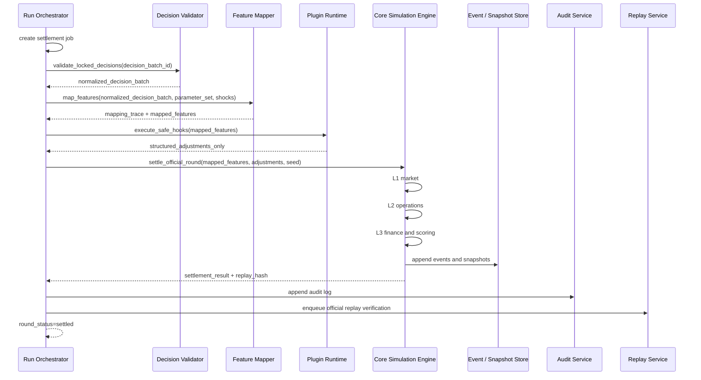

**接口、数据、审计与验收**

| 类别       | 内容                                                                                                                                                                                     |
| ---------- | ---------------------------------------------------------------------------------------------------------------------------------------------------------------------------------------- |
| 涉及 API   | `POST /internal/v1/runs/{runId}/rounds/{roundNo}/settle`、`GET /api/v1/runs/{runId}/rounds/{roundNo}/results`、`GET /api/v1/runs/{runId}/rounds/{roundNo}/state-snapshot`                |
| 涉及数据表 | `run`、`round`、`decision`、`decision_version`、`scenario_package`、`plugin_package`、`parameter_set`、`state_snapshot`、`settlement_result`、`replay_run`、`replay_report`、`audit_log` |
| 审计点     | `SETTLEMENT_STARTED`、`LOCKED_DECISIONS_VALIDATED`、`FEATURES_MAPPED`、`PLUGIN_ADJUSTMENTS_ACCEPTED`、`SETTLEMENT_COMPLETED`、`SETTLEMENT_FAILED`                                        |
| 验收标准   | 同一输入集重试返回同一 `replay_hash`；AI 与普通前端无权调用内部结算入口；Replay 与审计链可对账；历史结果只可追加新版本，不可覆盖                                                         |

### 结果发布与学员反馈流程

_流程编号：WF-010。资料依据：REQ 102-122, 291-303, 347-359；FEAT 239-247, 283-292；SA 437, 474-478, 537-552；API 184, 516-519, 545-597；FE 277-301；DB 407-436, 583-609；TEST 79, 87-89。_

结果发布不是结算的一部分，而是从 `settled` 进入 `published` 的教学动作。教师可选择立即发布或计划发布；系统必须为教师端生成更宽的授权视图，为学员端生成裁剪后的三段式反馈视图，并把学习记录与后续 AI 复盘触发链接到结果发布之后。

**主流程**

| 步骤 | 泳道             | 动作                           | 状态 / 数据变化                              |
| ---- | ---------------- | ------------------------------ | -------------------------------------------- |
| 1    | Teacher          | 查看 `settled` 状态回合结果    | 教师预览页                                   |
| 2    | Teacher          | 选择发布时间和可见范围         | 发起发布命令                                 |
| 3    | Result Service   | 生成教师端视图                 | 包含授权 `teacher_summary`                   |
| 4    | Result Service   | 生成学员端裁剪视图             | 基于 `state_obs/state_est` 与已发布结果      |
| 5    | Student          | 查看三段式反馈                 | `发生了什么 / 为什么发生 / 下一步风险和建议` |
| 6    | Learning Service | 写入学习记录与反馈查看事件     | `learning_record` 追加写                     |
| 7    | AI Orchestrator  | 接收“可生成复盘草稿”的触发信号 | 不改写真值                                   |
| 8    | Round Service    | `Round: settled -> published`  | 发布完成                                     |
| 9    | Audit Service    | 记录结果发布审计               | 审计闭环                                     |

**异常流程**

| 异常            | 触发点      | 系统处理                                 |
| --------------- | ----------- | ---------------------------------------- |
| 回合未结算      | 第 1 步     | 拒绝发布                                 |
| 教师无权限      | 第 2 步     | 返回 403                                 |
| 裁剪视图失败    | 第 3 / 4 步 | 保持 `settled`，不对外发布               |
| 学员提前访问    | 第 5 步前   | 返回“结果尚未发布”                       |
| AI 复盘草稿失败 | 第 7 步     | 不影响正式发布，仅记录 advisory 失败日志 |

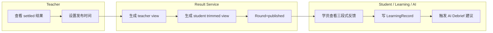

**接口、数据、审计与验收**

| 类别       | 内容                                                                                                                                                                                                                                                     |
| ---------- | -------------------------------------------------------------------------------------------------------------------------------------------------------------------------------------------------------------------------------------------------------- |
| 涉及 API   | `GET /api/v1/runs/{runId}/rounds/{roundNo}/results`、`GET /api/v1/runs/{runId}/rounds/{roundNo}/state-snapshot`、`POST /api/v1/agents/debrief-coach/generate`；建议补充 `POST /api/v1/runs/{runId}/rounds/{roundNo}/publish-results`，请根据实际项目修改 |
| 涉及数据表 | `round`、`state_snapshot`、`settlement_result`、`learning_record`、`coach_output`、`audit_log`                                                                                                                                                           |
| 审计点     | `RESULT_PUBLISH_REQUESTED`、`RESULT_PUBLISHED`、`STUDENT_FEEDBACK_VIEWED`                                                                                                                                                                                |
| 验收标准   | 只有 `settled` 才能进入发布；学生端反馈必须是裁剪视图；三段式反馈可读且可追踪到正式结果；学习记录与 AI 触发不改写真值                                                                                                                                    |

## AI、回放与治理流程

### AI 策略建议流程

_流程编号：WF-011。资料依据：REQ 263-275；FEAT 170-183；API 185, 568-579；SA 537-552；AI 26-34, 61-114, 241-253；DB 517-546；TEST 75, 89。_

AI 建议流程是 advisory-only 流程。用户触发后，API Gateway 与 AI Orchestrator 必须验证租户、角色和字段可见性，只读取授权 `state_obs/state_est`、授权知识和受控工具结果，输出建议、证据卡与风险卡；AI 不能自动提交决策，不能读未授权 `state_true`，不能覆盖正式数据。

**主流程**

| 步骤 | 泳道                  | 动作                                  | 状态 / 数据变化           |
| ---- | --------------------- | ------------------------------------- | ------------------------- |
| 1    | Student / Teacher     | 触发策略建议                          | 发起 advisory 请求        |
| 2    | API Gateway           | 鉴权并带上 `X-Tenant-Id`、`trace_id`  | 校验基础身份              |
| 3    | AI Orchestrator       | 检查角色与权限边界                    | 计算可见范围              |
| 4    | Snapshot / KB Service | 读取授权 `state_obs/state_est` 和知识 | 返回只读上下文            |
| 5    | Strategy Advisor      | 生成建议、风险与证据卡                | 形成结构化输出            |
| 6    | AI Orchestrator       | 安全审查与 schema 校验                | 强制 `advisory_only=true` |
| 7    | AI Orchestrator       | 写 `CoachOutput` 与 `ModelCallLog`    | advisory 数据落库         |
| 8    | Audit Service         | 写 AI 调用审计                        | 审计完成                  |
| 9    | Frontend              | 展示建议卡片，可复制到草稿            | 不自动提交                |

**异常流程**

| 异常                     | 触发点      | 系统处理                                                                  |
| ------------------------ | ----------- | ------------------------------------------------------------------------- |
| 越权快照请求             | 第 3 / 4 步 | 返回 `AI-403-001`                                                         |
| Input schema 不合法      | 第 6 步     | 返回 `AI-422-001`                                                         |
| 模型超时 / Provider 失败 | 第 5 步     | 返回降级提示，写 `ModelCallLog.error_code`                                |
| AI 试图写真值            | 第 6 步     | 强制阻断并告警，`truth_write_attempted=true` 只能进入审计，不进入正式数据 |
| 输出缺少证据链           | 第 6 步     | 不进入主结论区或直接拒绝返回                                              |

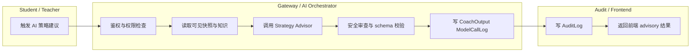

**接口、数据、审计与验收**

| 类别       | 内容                                                                                                                                           |
| ---------- | ---------------------------------------------------------------------------------------------------------------------------------------------- |
| 涉及 API   | `POST /api/v1/agents/strategy-advisor/propose`、建议聚合接口 `POST /api/ai/strategy-advice` 可作为 BFF 封装，请根据实际项目修改                |
| 涉及数据表 | `state_snapshot`、`coach_output`、`model_call_log`、`audit_log`                                                                                |
| 审计点     | `AI_STRATEGY_REQUESTED`、`AI_ADVICE_GENERATED`、`AI_TRUTH_WRITE_BLOCKED`                                                                       |
| 验收标准   | 返回结果必须带 `advisory_only=true`；AI 输出只写 `CoachOutput`；前端显式展示为 AI 建议而非正式结果；复制到草稿仍需用户通过决策提交流程最终提交 |

### AI 复盘草稿生成流程

_流程编号：WF-012。资料依据：REQ 263-275, 277-289, 347-359；FEAT 175-183, 284-292；API 186, 581-597；AI 241-253, 496-506；FE 301-325；DB 517-546, 596-609；TEST 75。_

AI 复盘必须建立在“已发布结果 + 已生成可见视图 + 可选 Replay 报告”的基础之上。它的输出是教师可编辑的草稿对象，而不是自动对学生生效的正式结论；学员端只能看到被教师发布且经过裁剪的版本。

**主流程**

| 步骤 | 泳道                            | 动作                              | 状态 / 数据变化             |
| ---- | ------------------------------- | --------------------------------- | --------------------------- |
| 1    | Teacher                         | 在结果页触发复盘草稿生成          | 发起 debrief 请求           |
| 2    | Result Service                  | 读取已发布结果与裁剪快照          | 确保只读正式对象            |
| 3    | Replay Service                  | 提供 Replay / diff 摘要（如启用） | 作为证据输入                |
| 4    | AI Orchestrator / Debrief Coach | 生成复盘草稿、证据卡、改进建议    | 输出 `CoachOutput(debrief)` |
| 5    | Teacher                         | 编辑、删改、补充教学点评          | 形成教师版草稿              |
| 6    | Teacher                         | 发布到课程复盘区                  | 学员可见裁剪版              |
| 7    | Student                         | 查看已发布复盘                    | 不可见教师私有批注          |
| 8    | Audit Service                   | 写生成与发布审计                  | 审计闭环                    |

**异常流程**

| 异常                 | 触发点      | 系统处理                     |
| -------------------- | ----------- | ---------------------------- |
| 结果尚未发布         | 第 2 步     | 拒绝生成                     |
| 请求越权数据         | 第 2 / 3 步 | 返回 `AI-403-002`            |
| Replay 报告缺失      | 第 3 步     | 允许退化为仅基于正式结果生成 |
| 模型失败             | 第 4 步     | 不中断课程，提示教师手动复盘 |
| 教师未发布即学员访问 | 第 7 步     | 返回“复盘暂未开放”           |

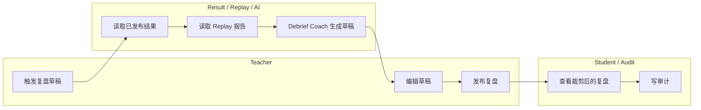

**接口、数据、审计与验收**

| 类别       | 内容                                                                                                                                                     |
| ---------- | -------------------------------------------------------------------------------------------------------------------------------------------------------- |
| 涉及 API   | `POST /api/v1/agents/debrief-coach/generate`、`GET /api/v1/replays/{replayId}`、建议补充复盘发布接口 `/api/v1/debriefs/{id}/publish`，请根据实际项目修改 |
| 涉及数据表 | `settlement_result`、`state_snapshot`、`replay_report`、`coach_output`、`model_call_log`、`audit_log`                                                    |
| 审计点     | `DEBRIEF_DRAFT_GENERATED`、`DEBRIEF_DRAFT_EDITED`、`DEBRIEF_PUBLISHED`                                                                                   |
| 验收标准   | 复盘草稿必须引用正式结果对象；学员版不暴露教师私有摘要或完整 `state_true`；教师可编辑后再发布；AI 失败不影响正式结果对象                                 |

### Replay 流程

_流程编号：WF-013。资料依据：SA 480-502；FEAT 187-198；MEC 243-248, 451-476；DB 553-581, 808-815；TEST 76, 87-90；API 646-655, 835。_

Replay 是正式结果“可复算性”的证明流程。它读取历史正式输入并重新执行结算，用于验证可重复计算和审计对账；Replay 不修改正式结果，只能追加写入 `ReplayRun` 与 `ReplayReport`。

**主流程**

| 步骤 | 泳道                     | 动作                                   | 状态 / 数据变化     |
| ---- | ------------------------ | -------------------------------------- | ------------------- |
| 1    | Teacher / Model Governor | 选择历史 Run / Round                   | 生成 replay 请求    |
| 2    | Replay Service           | 读取历史事件、快照、冻结参数、引擎版本 | 构建基线输入集      |
| 3    | Replay Service           | 重新执行结算                           | `ReplayRun=running` |
| 4    | Replay Service           | 将结果与历史 `SettlementResult` 对比   | 生成 `diff_summary` |
| 5    | Replay Service           | 生成 `ReplayReport`                    | 追加写报告          |
| 6    | Audit Service            | 记录 Replay 审计                       | 审计完成            |
| 7    | Teacher / Governor       | 查看可复算性结论                       | 不改历史正式结果    |

**异常流程**

| 异常           | 触发点  | 系统处理                                        |
| -------------- | ------- | ----------------------------------------------- |
| 历史输入不完整 | 第 2 步 | 报告不可复算原因                                |
| 引擎版本缺失   | 第 2 步 | 标记“仅近似 Replay”，默认不作为合格结果         |
| Replay 不一致  | 第 4 步 | `ReplayReport.passed=false`，进入治理或故障调查 |
| 请求并发重复   | 第 1 步 | 合并为同一 Replay 任务                          |

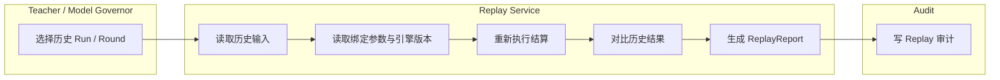

**接口、数据、审计与验收**

| 类别       | 内容                                                                                                                               |
| ---------- | ---------------------------------------------------------------------------------------------------------------------------------- |
| 涉及 API   | 建议补充 `POST /api/v1/replays` 作为官方 Replay 创建接口；现有 `GET /api/v1/replays/{replayId}` 可用于读取报告，请根据实际项目修改 |
| 涉及数据表 | `replay_run`、`replay_report`、`settlement_result`、`state_snapshot`、`audit_log`                                                  |
| 审计点     | `REPLAY_REQUESTED`、`REPLAY_COMPLETED`、`REPLAY_MISMATCH_DETECTED`                                                                 |
| 验收标准   | Replay 不修改正式结果；Replay 报告追加写；相同正式输入应得到稳定 `replay_hash` 或差异解释；报告可用于申诉与追责                    |

### Shadow Replay 流程

_流程编号：WF-014。资料依据：REQ 249-261, 361-373；FEAT 187-198；API 188, 628-655, 666-673；SA 480-502；PLG 243-247, 547-550；MEC 206-208, 228-243；DB 553-581, 626-638；TEST 76, 88-90。_

Shadow Replay 是参数、插件、模型、评分逻辑发布前的治理门禁。它使用候选版本对历史事件做旁路重放，生成差异报告和门限判断，不影响正式结果；通过后才允许进入审批或发布流程。

**主流程**

| 步骤 | 泳道                     | 动作                               | 状态 / 数据变化               |
| ---- | ------------------------ | ---------------------------------- | ----------------------------- |
| 1    | Model Governor / Teacher | 提交候选参数 / 插件 / 场景 / 模型  | 创建 `ReplayRun(mode=shadow)` |
| 2    | Replay Service           | 选择历史样本与 acceptance profile  | 门禁阈值冻结                  |
| 3    | Replay Service           | 使用候选版本运行影子回放           | 不写正式结果                  |
| 4    | Replay Service           | 与基线结果对比                     | 生成 `diff_summary`           |
| 5    | Replay Service           | 输出差异报告、公平性风险和门禁结论 | `ReplayReport` 追加写         |
| 6    | Governance               | 进入审批                           | `approval_record` 可创建      |
| 7    | Governance               | 通过则允许发布；不通过则退回修改   | 候选对象状态变化              |

**异常流程**

| 异常                   | 触发点      | 系统处理                         |
| ---------------------- | ----------- | -------------------------------- |
| 候选对象不满足回放条件 | 第 1 / 2 步 | 返回 `REP-422-001`               |
| 同一候选组合正在执行   | 第 1 步     | 返回 `REP-409-001`               |
| 差异过大               | 第 4 / 5 步 | `passed=false`，禁止进入审批通过 |
| 报告缺失               | 第 5 步     | 不允许批准投产                   |

```mermaid
flowchart LR
  subgraph G[Teacher / Model Governor]
    A1[提交候选版本]
  end
  subgraph R[Replay Service]
    B1[选择历史样本]
    B2[执行 shadow replay]
    B3[生成 diff_report]
    B4[计算 passed fairness_risk threshold]
  end
  subgraph GV[Governance]
    C1[进入审批]
    C2[通过后允许发布]
    C3[未通过退回修改]
  end

  A1 --> B1 --> B2 --> B3 --> B4 --> C1
  C1 --> C2
  C1 --> C3
```

**接口、数据、审计与验收**

| 类别       | 内容                                                                                                              |
| ---------- | ----------------------------------------------------------------------------------------------------------------- |
| 涉及 API   | `POST /api/v1/replays/shadow`、`GET /api/v1/replays/{replayId}`                                                   |
| 涉及数据表 | `replay_run`、`replay_report`、`approval_record`、`parameter_set`、`plugin_package`、`model_version`、`audit_log` |
| 审计点     | `SHADOW_REPLAY_REQUESTED`、`SHADOW_REPLAY_COMPLETED`、`SHADOW_REPLAY_REJECTED`                                    |
| 验收标准   | Shadow Replay 是门禁不是覆盖器；必须记录阈值与审批结论；历史正式结果完全只读；无 `diff_report` 不得批准候选对象   |

### ParameterSet 审批发布流程

_流程编号：WF-015。资料依据：REQ 249-261；MEC 182-208, 228-243, 470-484；API 190, 657-673；PLG 337-350；DB 475-486, 626-638, 790-812, 847；TEST 76, 88。_

ParameterSet 是真值核最关键的治理对象。它不只是系数集合，还包含模型家族、公式、积分配置、有效区间、诊断记录、Feature Mapper 版本和 Solver 版本；其修改必须走“新版本晋级，不做原位覆盖”的治理链。

**主流程**

| 步骤 | 泳道                            | 动作                               | 状态 / 数据变化               |
| ---- | ------------------------------- | ---------------------------------- | ----------------------------- |
| 1    | Model Governor / Quant Engineer | 创建参数集草稿                     | `draft`                       |
| 2    | Parameter Registry              | 执行自动校验与 Golden Solver       | 校验通过进入 `candidate`      |
| 3    | Replay Service                  | 发起 Shadow Replay                 | `candidate -> shadow_testing` |
| 4    | Governance                      | 评估差异、稳定性、公平性、可解释性 | 通过则 `shadow_passed`        |
| 5    | Model Governor                  | 提交审批动作                       | 写 `approval_record`          |
| 6    | Parameter Registry              | 审批通过并发布                     | `approved`                    |
| 7    | Run Orchestrator                | 仅允许新 Run 绑定该版本            | 不影响进行中 Run              |
| 8    | Governance                      | 后续可标记 `deprecated`            | 旧版本只读                    |

**异常流程**

| 异常                     | 触发点       | 系统处理                 |
| ------------------------ | ------------ | ------------------------ |
| 参数校验失败             | 第 2 步      | 留在 `draft`             |
| Shadow Replay 差异过大   | 第 4 步      | 不得进入 `approved`      |
| 审批拒绝                 | 第 5 / 6 步  | 状态回退到待修改         |
| 已 `approved` 后尝试覆盖 | 任意后续步骤 | 一律拒绝，必须创建新版本 |

```mermaid
flowchart LR
  subgraph Q[Quant / Model Governor]
    A1[创建参数草稿]
    A2[提交候选]
    A3[发起审批]
  end
  subgraph PR[Parameter Registry / Replay]
    B1[自动校验 Golden Solver]
    B2[Shadow Replay]
    B3[shadow_passed]
    B4[approved]
    B5[deprecated]
  end
  subgraph AU[Approval / Audit]
    C1[写 approval_record]
    C2[写 AuditLog]
  end

  A1 --> A2 --> B1 --> B2 --> B3 --> A3 --> C1 --> B4 --> C2 --> B5
```

**接口、数据、审计与验收**

| 类别       | 内容                                                                                                                                                     |
| ---------- | -------------------------------------------------------------------------------------------------------------------------------------------------------- |
| 涉及 API   | `POST /api/v1/replays/shadow`、`POST /api/v1/governance/parameter-sets/{parameterSetId}/approve`；建议补充参数草稿创建与候选提交接口，请根据实际项目修改 |
| 涉及数据表 | `parameter_set`、`replay_run`、`replay_report`、`approval_record`、`audit_log`                                                                           |
| 审计点     | `PARAMETERSET_CREATED`、`PARAMETERSET_CANDIDATE_SUBMITTED`、`PARAMETERSET_SHADOW_PASSED`、`PARAMETERSET_APPROVED`、`PARAMETERSET_DEPRECATED`             |
| 验收标准   | 审批前必须完成 Shadow Replay；已 `approved` 参数集不可覆盖修改；仅新 Run 能绑定新版本；回滚通过新版本 / 废弃事件表达，而不是重写旧对象                   |

### PluginPackage 审批发布流程

_流程编号：WF-016。资料依据：REQ 361-373；PLG 231-247, 379-382, 532-552, 633-644, 662-667；API 191-194, 698-740；DB 461-469, 791-812, 849；TEST 77。_

插件流程的目标是让行业复杂性通过受控 Hook 进入，而不是污染 Kernel。插件 Manifest 必须声明字段映射、hook 边界、验证规则和测试用例；发布前必须通过契约校验、兼容测试、Shadow Replay 和审批，部署后只供新 Run 绑定，不能热替换进行中 Run。

**主流程**

| 步骤 | 泳道                               | 动作                                    | 状态 / 数据变化            |
| ---- | ---------------------------------- | --------------------------------------- | -------------------------- |
| 1    | Scenario Designer                  | 创建 Plugin Manifest 并上传 artifact    | `draft`                    |
| 2    | Plugin Service                     | 执行 schema / hook / 依赖校验           | `testing`                  |
| 3    | Plugin Service / Scenario Designer | 编写字段映射与 Hook                     | 补全安全契约               |
| 4    | Replay Service                     | 执行 Shadow Replay                      | `shadow_testing`           |
| 5    | Model Governor                     | 审批插件                                | `approved`                 |
| 6    | Ops / Plugin Service               | 部署到可用 Registry                     | `deployed`                 |
| 7    | Scenario Service                   | 允许新 `ScenarioPackage` 绑定该插件版本 | 引用新版本                 |
| 8    | Governance                         | 如出现问题则 `rolled_back`              | 未来流量回滚，不改历史 Run |

**异常流程**

| 异常                     | 触发点      | 系统处理                 |
| ------------------------ | ----------- | ------------------------ |
| Manifest 契约校验失败    | 第 2 步     | 维持 `draft` / `testing` |
| Hook 越权                | 第 2 / 3 步 | 直接失败并记录安全警报   |
| Shadow Replay 缺失或不过 | 第 4 / 5 步 | 不允许批准               |
| 与参数 / 场景不兼容      | 第 2 / 6 步 | 阻断部署与课程绑定       |
| 尝试热替换进行中 Run     | 第 6 / 7 步 | 一律拒绝                 |

```mermaid
flowchart LR
  subgraph SD[Scenario Designer]
    A1[上传 Manifest 和 artifact]
    A2[补齐字段映射与 Hook]
  end
  subgraph PS[Plugin Service]
    B1[契约与安全校验]
    B2[进入 testing]
    B3[Shadow Replay]
    B4[approved]
    B5[deployed]
  end
  subgraph GV[Governor / Ops]
    C1[审批]
    C2[部署或回滚]
  end

  A1 --> B1 --> B2 --> A2 --> B3 --> C1 --> B4 --> C2 --> B5
```

**接口、数据、审计与验收**

| 类别       | 内容                                                                                                                                                                                                                                                               |
| ---------- | ------------------------------------------------------------------------------------------------------------------------------------------------------------------------------------------------------------------------------------------------------------------ |
| 涉及 API   | `POST /api/v1/plugins`、`POST /api/plugins/{id}/validate`、`POST /api/plugins/{id}/shadow-replay`、`POST /api/plugins/{id}/approve`、`POST /api/plugins/{id}/deploy`、`POST /api/v1/plugins/{pluginId}/release`、`POST /api/v1/plugins/{pluginId}/compile-context` |
| 涉及数据表 | `plugin_package`、`scenario_package`、`replay_run`、`replay_report`、`approval_record`、`audit_log`                                                                                                                                                                |
| 审计点     | `PLUGIN_UPLOADED`、`PLUGIN_VALIDATED`、`PLUGIN_SHADOW_TESTED`、`PLUGIN_APPROVED`、`PLUGIN_DEPLOYED`、`PLUGIN_ROLLED_BACK`                                                                                                                                          |
| 验收标准   | 插件只能返回受控结构化调整项；未通过校验 / Shadow Replay 不可发布；已部署旧版本不得被正在运行的 Run 热替换；回滚只影响未来绑定                                                                                                                                     |

### 模型版本发布流程

_流程编号：WF-017。资料依据：SA 439, 528, 769, 776-778；AI 34, 61, 707-725, 729, 749-765, 895, 906；DB 488-515, 626-638；FEAT 77, 175-183。_

模型版本属于 L4 AI 治理对象，但治理强度不能低于参数与插件。它必须经过离线评测、Prompt 版本绑定、Shadow Arena、人工审核、灰度、监控与回滚；模型升级不会改动正式真值，只会影响 advisory 层输出质量与风险。

**主流程**

| 步骤 | 泳道                         | 动作                                  | 状态 / 数据变化 |
| ---- | ---------------------------- | ------------------------------------- | --------------- |
| 1    | AI Engineer / Model Governor | 创建 `ModelVersion` 并登记能力范围    | `draft`         |
| 2    | AI Governance                | 绑定 PromptVersion 与任务类型         | 形成候选组合    |
| 3    | Eval Pipeline                | 运行离线评测、schema、越权、红队测试  | `evaluation`    |
| 4    | Shadow Arena                 | 进入影子流量、教师沙盒、Shadow Replay | `shadow_arena`  |
| 5    | Governance Board             | 人工审核与适用范围确认                | `approved`      |
| 6    | Ops / AI Orchestrator        | 灰度发布与 canary 观测                | `deployed`      |
| 7    | Monitoring                   | 监控延迟、拒答率、护栏命中、质量波动  | 保持或触发回滚  |
| 8    | Ops / Governor               | 回滚到上一版本或回滚指针              | `rolled_back`   |

**异常流程**

| 异常                        | 触发点          | 系统处理                         |
| --------------------------- | --------------- | -------------------------------- |
| 离线评测不通过              | 第 3 步         | 停留 `evaluation` 或打回 `draft` |
| Shadow Arena 差异风险过高   | 第 4 步         | 不得审批                         |
| 灰度后质量退化 / 可用性下降 | 第 7 步         | 立即回滚                         |
| 输出越权或无证据链          | 第 3 / 4 / 7 步 | 触发护栏和发布阻断               |
| Prompt 与模型版本不兼容     | 第 2 步         | 禁止进入评测                     |

```mermaid
flowchart LR
  subgraph AIE[AI Engineer / Governor]
    A1[创建 ModelVersion]
    A2[绑定 PromptVersion]
  end
  subgraph GOV[Eval / Shadow Arena / Governance]
    B1[离线评测]
    B2[shadow_arena]
    B3[人工审核]
  end
  subgraph OPS[Ops / Monitoring]
    C1[灰度发布]
    C2[监控]
    C3[回滚]
  end

  A1 --> A2 --> B1 --> B2 --> B3 --> C1 --> C2
  C2 --> C3
```

**接口、数据、审计与验收**

| 类别       | 内容                                                                                                                                                                                                                                                                                                |
| ---------- | --------------------------------------------------------------------------------------------------------------------------------------------------------------------------------------------------------------------------------------------------------------------------------------------------- |
| 涉及 API   | 建议接口：`POST /api/v1/models/versions`、`POST /api/v1/models/versions/{id}/evaluate`、`POST /api/v1/models/versions/{id}/shadow-arena`、`POST /api/v1/models/versions/{id}/approve`、`POST /api/v1/models/versions/{id}/deploy`、`POST /api/v1/models/versions/{id}/rollback`；请根据实际项目修改 |
| 涉及数据表 | `model_version`、`prompt_version`、`model_call_log`、`approval_record`、`audit_log`                                                                                                                                                                                                                 |
| 审计点     | `MODEL_VERSION_CREATED`、`MODEL_EVALUATED`、`MODEL_SHADOW_ARENA_PASSED`、`MODEL_DEPLOYED`、`MODEL_ROLLED_BACK`                                                                                                                                                                                      |
| 验收标准   | 模型升级不能绕过评测与 Shadow；灰度与回滚链完整；所有 AI 输出都可追溯到 `model_version_id + prompt_version_id`；模型升级不改写正式真值对象                                                                                                                                                          |

## 学习、竞赛与社区流程

### 学习诊断报告流程

_流程编号：WF-018。资料依据：REQ 347-359；FEAT 279-292；SA 158, 208, 269, 547; API 187, 599-608；DB 583-609；TEST 75, 79。_

学习诊断的目标不是再算一套“经营真值”，而是量化学习行为、证据质量、风险偏好、团队协作和跨轮改进率。学习事件统一进入 `LearningRecord` / LRS，再聚合为 `LearningReport`，供教师、学员和企业管理员按权限查看裁剪后的版本。

**主流程**

| 步骤 | 泳道             | 动作                                                  | 状态 / 数据变化     |
| ---- | ---------------- | ----------------------------------------------------- | ------------------- |
| 1    | Learning Service | 收集 `LearningRecord`、反思、点评、社区交互、竞赛表现 | 原子事件入库        |
| 2    | Analytics / LRS  | 汇总决策行为与证据质量                                | 生成人员 / 团队画像 |
| 3    | Analytics        | 计算风险偏好、团队协作、跨轮改进率                    | 形成诊断指标        |
| 4    | Learning Service | 生成 `LearningReport`                                 | `status=generated`  |
| 5    | Teacher          | 查看班级 / 团队报告                                   | 教学辅导视图        |
| 6    | Student          | 查看个人 / 本队裁剪版本                               | 自主学习视图        |
| 7    | Recommendation   | 生成后续任务 / 内容推荐                               | 不改写真值          |
| 8    | Audit Service    | 记录报告生成与发布审计                                | 审计可追踪          |

**异常流程**

| 异常           | 触发点      | 系统处理                                 |
| -------------- | ----------- | ---------------------------------------- |
| 学习事件缺失   | 第 1 / 2 步 | 标记数据不足，不输出强结论               |
| 某指标计算失败 | 第 3 步     | 输出部分报告并说明缺失维度               |
| 权限超范围     | 第 5 / 6 步 | 教师仅看授权班级，企业管理员仅看脱敏聚合 |
| LRS 延迟       | 第 2 步     | 使用上次快照或显示“生成中”               |

```mermaid
flowchart LR
  subgraph LR1[Learning / LRS]
    A1[收集 LearningRecord]
    A2[聚合行为和证据质量]
    A3[计算协作 风险 偏好 改进率]
    A4[生成 LearningReport]
  end
  subgraph U1[Teacher / Student / Recommendation]
    B1[教师查看]
    B2[学员查看裁剪版本]
    B3[生成推荐任务]
  end
  subgraph AU[Audit]
    C1[写报告审计]
  end

  A1 --> A2 --> A3 --> A4 --> B1 --> B2 --> B3 --> C1
```

**接口、数据、审计与验收**

| 类别       | 内容                                                                                                                                             |
| ---------- | ------------------------------------------------------------------------------------------------------------------------------------------------ |
| 涉及 API   | `POST /api/v1/recommendations/learning-feed`、建议补充 `GET /api/v1/learning/reports/{subjectId}`、`POST /api/learning/xapi`，请根据实际项目修改 |
| 涉及数据表 | `learning_record`、`learning_report`、`coach_output`、`settlement_result`、`audit_log`                                                           |
| 审计点     | `LEARNING_RECORD_INGESTED`、`LEARNING_REPORT_GENERATED`、`LEARNING_REPORT_VIEWED`                                                                |
| 验收标准   | 报告至少覆盖团队协作、风险偏好、跨轮改进率；个人敏感诊断只对本人和授权教师可见；学习报告不回写正式经营结果                                       |

### 竞赛报名与排名流程

_流程编号：WF-019。资料依据：REQ 333-345；FEAT 264-277, 368；SA 641-642；DB 640-664, 798; TEST 79；API 为竞赛创建占位。_

竞赛层是对课程赛局或公开 PK 的包装层，不是独立真值引擎。正式排名来自 `SettlementResult` 聚合，赛制、赛程、公开榜单、反作弊和归档都复用审计链与 Replay / 申诉能力。

**主流程**

| 步骤 | 泳道                | 动作                           | 状态 / 数据变化                                |
| ---- | ------------------- | ------------------------------ | ---------------------------------------------- |
| 1    | Admin / Teacher     | 创建竞赛并配置赛制             | `Competition=draft`                            |
| 2    | Competition Service | 开启报名窗口                   | `draft -> registration`                        |
| 3    | Team / Student      | 队伍报名                       | `competition_team.registration_status=pending` |
| 4    | Admin / Reviewer    | 审核报名资格                   | `approved/rejected/withdrawn`                  |
| 5    | Competition Service | 分组、编排赛程、绑定回合       | `registration -> grouping -> active`           |
| 6    | Simulation Engine   | 多轮比赛照常走正式结算         | 排名仍来自正式结果                             |
| 7    | Ranking Service     | 聚合榜单并执行反作弊检查       | 生成公开榜单                                   |
| 8    | Admin               | 发布榜单并归档赛事             | `published -> archived`                        |
| 9    | Audit Service       | 记录报名、审核、榜单与归档动作 | 审计完成                                       |

**异常流程**

| 异常               | 触发点     | 系统处理                                      |
| ------------------ | ---------- | --------------------------------------------- |
| 重复报名           | 第 3 步    | 依赖 `(competition_id, team_id)` 唯一约束拒绝 |
| 资格不符           | 第 4 步    | 标记 `rejected`                               |
| 延迟提交           | 比赛进行中 | 依赛制按缺席 / 保底 / 弃权策略处理，需审计    |
| 异常分数或作弊风险 | 第 7 步    | 进入人工复核或 Replay 审核                    |
| 公开字段越界       | 第 8 步    | 阻断公开榜单发布                              |

```mermaid
flowchart LR
  subgraph A[Admin / Teacher]
    A1[创建竞赛]
    A2[审核报名]
    A3[发布榜单]
  end
  subgraph C[Competition Service]
    B1[开放报名]
    B2[分组与赛程]
    B3[聚合排名]
    B4[归档赛事]
  end
  subgraph T[Teams / Anti-Cheat]
    C1[队伍报名]
    C2[多轮比赛]
    C3[反作弊检查]
  end

  A1 --> B1 --> C1 --> A2 --> B2 --> C2 --> B3 --> C3 --> A3 --> B4
```

**接口、数据、审计与验收**

| 类别       | 内容                                                                                                                      |
| ---------- | ------------------------------------------------------------------------------------------------------------------------- |
| 涉及 API   | `POST /api/v1/competitions`、建议补充报名、审核、分组、榜单查询与申诉接口，请根据实际项目修改                             |
| 涉及数据表 | `competition`、`competition_team`、`settlement_result`、`replay_report`、`notification`、`audit_log`                      |
| 审计点     | `COMPETITION_CREATED`、`COMPETITION_REGISTRATION_SUBMITTED`、`COMPETITION_REGISTRATION_APPROVED`、`LEADERBOARD_PUBLISHED` |
| 验收标准   | 公开榜单只展示允许公开字段；排名只可读取正式结果聚合；反作弊可复用 Replay 与审计链；赛事归档后不允许篡改公开历史记录      |

### 社区内容发布与审核流程

_流程编号：WF-020。资料依据：REQ 319-331；FEAT 264-277, 368, 418；DB 666-685, 799；SA 648-659；TEST 60, 79。_

社区模块面向赛后学习网络、项目协作与内容推荐，而不是泛娱乐平台。内容流必须遵守租户边界、课程边界、公开级别、品牌和授权约束；公开面不得外显受限内容，举报、审核、申诉和下架必须可追踪。

**主流程**

| 步骤 | 泳道               | 动作                                     | 状态 / 数据变化       |
| ---- | ------------------ | ---------------------------------------- | --------------------- |
| 1    | Student / Teacher  | 创建帖子草稿或评论                       | `CommunityPost=draft` |
| 2    | Community Service  | 做内容检测、敏感词 / 授权 / 品牌规则检查 | `draft -> moderating` |
| 3    | Moderator          | 审核并决定发布 / 屏蔽                    | `published / blocked` |
| 4    | Recommendation     | 将合规内容纳入学习图谱推荐               | 生成 feed             |
| 5    | User               | 浏览、评论、举报内容                     | 可能触发再次审核      |
| 6    | Moderation Service | 处理举报和申诉                           | 维持、下架或恢复      |
| 7    | Community Service  | 下架 / 归档内容                          | `archived`            |
| 8    | Audit Service      | 写审核与下架审计                         | 审计闭环              |

**异常流程**

| 异常                   | 触发点      | 系统处理                     |
| ---------------------- | ----------- | ---------------------------- |
| 违规内容               | 第 2 步     | 直接拦截或进入人工审核       |
| 版权 / 隐私 / 品牌风险 | 第 2 / 3 步 | 阻断公开发布                 |
| 重复刷屏               | 第 1 / 5 步 | 速率限制并记审计             |
| 申诉通过               | 第 6 步     | 恢复 `published` 或重新审核  |
| 推荐越权               | 第 4 步     | 推荐服务只接收合规且可见对象 |

```mermaid
flowchart LR
  subgraph U[Student / Teacher]
    A1[发帖草稿]
    A2[浏览 评论 举报]
  end
  subgraph CM[Community / Moderation]
    B1[内容检测]
    B2[人工审核]
    B3[发布或屏蔽]
    B4[处理申诉和下架]
  end
  subgraph RC[Recommendation / Audit]
    C1[学习图谱推荐]
    C2[写审计]
  end

  A1 --> B1 --> B2 --> B3 --> C1
  A2 --> B4 --> C2
```

**接口、数据、审计与验收**

| 类别       | 内容                                                                                                                                      |
| ---------- | ----------------------------------------------------------------------------------------------------------------------------------------- |
| 涉及 API   | `POST /api/v1/community/posts`、建议补充评论、举报、审核、申诉、下架、推荐 feed 查询接口，请根据实际项目修改                              |
| 涉及数据表 | `community_post`、`notification`、`learning_record`、`audit_log`                                                                          |
| 审计点     | `COMMUNITY_POST_CREATED`、`CONTENT_MODERATION_REQUESTED`、`COMMUNITY_POST_PUBLISHED`、`COMMUNITY_POST_BLOCKED`、`COMMUNITY_POST_APPEALED` |
| 验收标准   | 内容状态遵循 `draft -> moderating -> published / blocked -> archived`；公开字段严格受控；举报与申诉形成闭环；推荐系统不消费违规或越权数据 |

## 支撑映射

### API 与流程映射

以下映射以现有 OpenAPI 合同为主；无公开冻结接口者以建议命名标记。写接口统一要求 `X-Tenant-Id`、鉴权与审计注入；关键写接口要求幂等键，正式结算是全平台最关键幂等接口。（依据：API 33-47, 110, 165-195, 201-799；TEST 68-78）

| 流程编号 | 涉及 API                                                                 | 读操作                   | 写操作                            | 是否幂等          | 审计要求         |
| -------- | ------------------------------------------------------------------------ | ------------------------ | --------------------------------- | ----------------- | ---------------- |
| WF-001   | `POST /api/v1/admin/tenants` 等建议接口                                  | 角色模板、租户冲突检查   | 创建 tenant / admin / role seed   | 是，建议强制幂等  | 强审计           |
| WF-002   | `/api/v1/auth/login` `/refresh` `/me` `/role-bindings`                   | 会话与角色读             | 登录、刷新、角色绑定              | 登录/绑定建议幂等 | 强审计           |
| WF-003   | `/api/v1/courses` `/api/v1/scenarios/compile` `/courses/{id}` `/publish` | 课程、场景、参数查询     | 创建草稿、绑定、发布              | 是                | 强审计           |
| WF-004   | `/api/v1/plugins` `/compile-context` `/scenarios/compile`                | 插件、参数、场景查询     | 编译上下文、保存新版本            | 是                | 强审计           |
| WF-005   | `/courses/{id}/teams` `/teams/{id}/members`                              | 名册与队伍读             | 创建队伍、成员绑定                | 是                | 强审计           |
| WF-006   | `/auth/login` `/auth/me` `/teams/{id}/dashboard` 及邀请接口占位          | 课程 / 队伍 / 角色读取   | 接受邀请、激活 enrollment         | 建议幂等          | 强审计           |
| WF-007   | `/teams/{id}/dashboard` `/state-snapshot` `/decisions`                   | 可见快照读               | 决策提交与版本保存                | 是                | 强审计           |
| WF-008   | `/rounds/{roundNo}/lock`                                                 | 提交状态读               | 锁轮                              | 是                | 强审计           |
| WF-009   | `/internal/v1/.../settle` `/results` `/state-snapshot`                   | 冻结上下文与结果读取     | 正式结算                          | 是，P0 强幂等     | 强审计           |
| WF-010   | `/results` `/state-snapshot` `/debrief-coach/generate` 与发布接口占位    | 结果与快照读             | 结果发布、复盘触发                | 发布接口建议幂等  | 强审计           |
| WF-011   | `/agents/strategy-advisor/propose`                                       | 快照 / 知识 / 结果读取   | 写 `CoachOutput` / `ModelCallLog` | 请求级幂等可选    | 强审计           |
| WF-012   | `/agents/debrief-coach/generate` `/replays/{id}`                         | 结果 / Replay 报告读     | 写复盘草稿、发布复盘              | 发布接口建议幂等  | 强审计           |
| WF-013   | `POST /api/v1/replays`（建议） `/replays/{id}`                           | 历史结果、账本、快照读   | Replay 执行记录                   | 是                | 强审计           |
| WF-014   | `/api/v1/replays/shadow` `/replays/{id}`                                 | 历史样本、候选对象读     | Shadow Replay 任务                | 是                | 强审计           |
| WF-015   | `/replays/shadow` `/governance/parameter-sets/{id}/approve`              | 参数与报告读             | 参数审批与废弃                    | 是                | 强审计           |
| WF-016   | `/api/v1/plugins` `/validate` `/shadow-replay` `/approve` `/deploy`      | 插件和兼容性报告读       | 上传、审批、部署                  | 是                | 强审计           |
| WF-017   | `/api/v1/models/versions*` 建议接口                                      | 模型、Prompt、评测结果读 | 创建、评测、部署、回滚            | 是                | 强审计           |
| WF-018   | `/api/v1/learning/reports*` `/recommendations/learning-feed` `/xapi*`    | 学习记录和报告读         | 学习记录写入、报告生成            | 记录写入建议幂等  | 审计关键生成动作 |
| WF-019   | `/api/v1/competitions*`                                                  | 竞赛、报名、榜单读       | 创建竞赛、审核报名、发布榜单      | 是                | 强审计           |
| WF-020   | `/api/v1/community/posts*`                                               | 帖子、审核、推荐读       | 发帖、审核、举报、申诉、下架      | 是                | 强审计           |

### 数据表与流程映射

以下表格按照“涉及数据表 / 追加写表 / 版本化表 / 不可覆盖表”表达实现约束；其中 `DecisionVersion`、`AuditLog`、`ModelCallLog`、`ReplayReport`、`StateSnapshot`、`SettlementResult` 等属于追加写或版本化优先对象。（依据：DB 32-36, 177-209, 808-855；MEC 206-208；PLG 564-571）

| 流程编号 | 涉及数据表                                                                                                                                                         | 追加写表                                                                      | 版本化表                                | 不可覆盖表                        |
| -------- | ------------------------------------------------------------------------------------------------------------------------------------------------------------------ | ----------------------------------------------------------------------------- | --------------------------------------- | --------------------------------- |
| WF-001   | `tenant` `user` `role` `permission` `user_role` `notification` `audit_log`                                                                                         | `user_role` `audit_log` `notification`                                        | 角色模板可演进                          | `tenant_code`、审计记录           |
| WF-002   | `user` `role` `permission` `user_role` `audit_log`                                                                                                                 | `audit_log`                                                                   | 无                                      | 会话审计、账号状态历史            |
| WF-003   | `course` `scenario_package` `parameter_set` `audit_log`                                                                                                            | `audit_log`                                                                   | `scenario_package`                      | 已发布课程核心绑定                |
| WF-004   | `plugin_package` `scenario_package` `parameter_set` `approval_record` `audit_log`                                                                                  | `audit_log` `approval_record`                                                 | `plugin_package` `scenario_package`     | 已绑定正式 Run 的版本组合         |
| WF-005   | `enrollment` `team` `team_member` `notification` `audit_log`                                                                                                       | `enrollment` `team_member` `notification` `audit_log`                         | 队伍变更历史                            | 队长唯一、角色槽位唯一            |
| WF-006   | `enrollment` `team_member` `team` `notification` `audit_log`                                                                                                       | `enrollment` `audit_log`                                                      | 入课历史                                | 已归档课程 Enrollment 记录        |
| WF-007   | `decision` `decision_version` `state_snapshot` `audit_log`                                                                                                         | `decision_version` `audit_log`                                                | `decision_version`                      | 生效版本、锁轮后版本              |
| WF-008   | `round` `decision` `decision_version` `notification` `audit_log`                                                                                                   | `audit_log` `notification`                                                    | `decision_batch_id` 固化批              | 锁轮后决策窗口                    |
| WF-009   | `run` `round` `decision_version` `parameter_set` `plugin_package` `scenario_package` `state_snapshot` `settlement_result` `replay_run` `replay_report` `audit_log` | `state_snapshot` `settlement_result` `audit_log` `replay_run` `replay_report` | `settlement_result` `replay_report`     | `state_true` 历史结果、已发布结果 |
| WF-010   | `round` `state_snapshot` `settlement_result` `learning_record` `coach_output` `audit_log`                                                                          | `learning_record` `coach_output` `audit_log`                                  | `learning_report` 后续生成              | 已发布结果                        |
| WF-011   | `state_snapshot` `coach_output` `model_call_log` `audit_log`                                                                                                       | `coach_output` `model_call_log` `audit_log`                                   | `model_version` `prompt_version` 被引用 | 正式真值对象                      |
| WF-012   | `settlement_result` `replay_report` `coach_output` `model_call_log` `audit_log`                                                                                    | `coach_output` `model_call_log` `audit_log`                                   | 复盘草稿版本可扩展                      | 正式结果对象                      |
| WF-013   | `replay_run` `replay_report` `state_snapshot` `settlement_result` `audit_log`                                                                                      | `replay_run` `replay_report` `audit_log`                                      | `replay_report`                         | 历史正式结果                      |
| WF-014   | `replay_run` `replay_report` `approval_record` `parameter_set` `plugin_package` `model_version` `audit_log`                                                        | `replay_run` `replay_report` `approval_record` `audit_log`                    | `replay_report`                         | 历史正式结果                      |
| WF-015   | `parameter_set` `replay_run` `replay_report` `approval_record` `audit_log`                                                                                         | `approval_record` `audit_log`                                                 | `parameter_set` `replay_report`         | 已 `approved` 参数集              |
| WF-016   | `plugin_package` `scenario_package` `replay_run` `replay_report` `approval_record` `audit_log`                                                                     | `approval_record` `audit_log`                                                 | `plugin_package` `scenario_package`     | 已部署插件历史版本                |
| WF-017   | `model_version` `prompt_version` `model_call_log` `approval_record` `audit_log`                                                                                    | `model_call_log` `approval_record` `audit_log`                                | `model_version` `prompt_version`        | 已部署模型历史记录                |
| WF-018   | `learning_record` `learning_report` `coach_output` `audit_log`                                                                                                     | `learning_record` `audit_log`                                                 | `learning_report`                       | 个人敏感诊断历史                  |
| WF-019   | `competition` `competition_team` `settlement_result` `replay_report` `notification` `audit_log`                                                                    | `competition_team` `notification` `audit_log`                                 | 榜单快照可版本化                        | 已发布榜单                        |
| WF-020   | `community_post` `notification` `learning_record` `audit_log`                                                                                                      | `community_post` `notification` `audit_log`                                   | 内容状态流可追版本                      | 已发布 / 已归档内容原记录         |

### 测试用例映射

测试设计必须围绕“真值可复算、权限可验证、边界可证明、发布可回滚”组织，而不是仅按接口数量覆盖。下表将业务流程直接映射到测试类型、关键测试点与通过标准，支持 E2E、权限、多租户、并发、Replay、Shadow Replay、AI 边界和异常测试展开。（依据：TEST 22-35, 64-90, 197-216；SA 769-778）

| 流程编号 | 测试类型                                      | 关键测试点                                     | 示例用例                                     | 通过标准                             |
| -------- | --------------------------------------------- | ---------------------------------------------- | -------------------------------------------- | ------------------------------------ |
| WF-001   | Integration / Permission / Audit              | 租户唯一性、角色初始化、通知失败补偿           | 创建重复 `tenant_code`；角色初始化异常       | 不产生脏租户；审计完整               |
| WF-002   | Unit / Contract / Security / Multi-tenant     | 登录锁定、刷新、租户隔离、SSO 占位             | 错误密码不泄露用户存在性；篡改 `X-Tenant-Id` | 无越权、无信息泄露                   |
| WF-003   | E2E / Contract / Permission                   | 课程草稿、场景绑定、参数审批校验               | 绑定未批准参数后发布课程                     | 发布被阻断、返回可读错误             |
| WF-004   | Integration / Compatibility / Replay          | 插件兼容、场景编译、参数绑定                   | 使用未部署插件编译场景                       | 阻断场景发布                         |
| WF-005   | E2E / Permission / Concurrency                | 角色槽位唯一、队长唯一、批量导入               | 两名成员分配同一 `CEO` 槽位                  | 唯一约束生效、审计完整               |
| WF-006   | E2E / Permission / Multi-tenant               | 邀请过期、入课范围、队伍容量                   | 非本租户用户接受邀请                         | 被拒绝且无数据污染                   |
| WF-007   | E2E / Contract / Security                     | 版本化、锁轮后拒绝、AI 引用只审计              | 提交非法字段；多次提交对比版本               | 生成新 `DecisionVersion`，无覆盖写   |
| WF-008   | Concurrency / E2E / Audit                     | 并发锁轮、未提交队伍保底、通知提醒             | 同时双击锁轮                                 | 仅一个成功；`decision_batch_id` 稳定 |
| WF-009   | Integration / Replay / Performance / Security | 内部可信调用、幂等、回放一致、失败补偿         | 重放相同输入结算请求                         | 同 `replay_hash`，失败可回滚         |
| WF-010   | E2E / Permission / UI                         | `settled` 到 `published`、视图裁剪、三段式反馈 | 学员在未发布前访问结果页                     | 被拒绝；发布后可读                   |
| WF-011   | Security / AI Boundary / E2E                  | `advisory_only`、证据链、越权阻断              | 提示词要求直写利润和排名                     | 输出被阻断，不影响真值               |
| WF-012   | AI Boundary / Permission / Audit              | 只基于已发布结果生成、教师编辑再发布           | 学员请求教师私有摘要版复盘                   | 被拒绝；只见裁剪版                   |
| WF-013   | Replay / Governance                           | Replay 不改正式结果、报告追加写                | 对历史 Run 发起官方 Replay                   | 历史结果不变，报告生成               |
| WF-014   | Shadow Replay / Governance / Diff             | 差异门限、公平性风险、审批门禁                 | 候选参数导致排名变化过大                     | `passed=false`，不可审批             |
| WF-015   | Governance / Replay / Permission              | 参数审批只允许治理角色、approved 不可覆盖      | 直接修改已 approved 参数的公式               | 被拒绝，要求新版本                   |
| WF-016   | Compatibility / Security / Governance         | 插件 Hook 越权、Shadow Replay 门禁             | 插件尝试返回真值字段                         | 校验失败，不得部署                   |
| WF-017   | Eval / Shadow Arena / Rollback                | 模型灰度与快速回滚                             | 灰度后延迟飙升或护栏失败                     | 自动 / 人工回滚成功                  |
| WF-018   | Analytics / Permission / Privacy              | 报告裁剪、敏感诊断隔离、数据缺失降级           | 企业管理员读取个人敏感项                     | 仅返回脱敏聚合                       |
| WF-019   | E2E / Anti-Cheat / Audit                      | 报名审核、榜单来源、异常分数复核               | 重复报名；异常排名申诉                       | 榜单仅来自正式结果，审计完备         |
| WF-020   | Content Safety / Moderation / Recommendation  | 审核、举报、申诉、下架、推荐隔离               | 违规内容上链推荐                             | 被拦截或下架，不进入推荐             |

## 风险与范围建议

### 风险与流程优化建议

以下风险表从产品、架构、测试、治理和运维视角整理，重点覆盖教师操作复杂度、回合锁定并发、结算失败、Replay 不一致、AI 越权、插件绕过、参数未冻结、社区审核滞后和竞赛争议等问题。（依据：TEST 83-90, 199-216；SA 769-778；AI 895；PLG 615-617）

| 风险                     | 影响流程                 | 影响                         | 缓解措施                                                                 |
| ------------------------ | ------------------------ | ---------------------------- | ------------------------------------------------------------------------ |
| 流程过长导致教师操作复杂 | WF-003 / 004 / 008 / 010 | 开课与控课成本高，易误操作   | 将“课程创建、场景绑定、参数绑定、名册导入、开课检查”做成向导与 checklist |
| 学员提交决策前缺少校验   | WF-007                   | 产生无效决策、结算失败率升高 | 前端本地校验 + 服务端 Validator 双层校验，并展示可读错误                 |
| 回合锁定并发冲突         | WF-008                   | 重复锁轮、批次不一致         | 对锁轮接口强制幂等，并以 `decision_batch_id` 作为唯一冻结标识            |
| 结算任务失败             | WF-009                   | 回合卡死、结果无法发布       | 设计任务补偿、失败回退到 `locked`、保留失败审计与告警                    |
| Replay 结果不一致        | WF-013 / 014             | 无法申诉、治理失真           | 冻结输入集、固定 seed、保留 `replay_hash` 和 `mapping_trace_ref`         |
| AI 越权读取              | WF-011 / 012             | 泄露教师摘要或真值信息       | AI Orchestrator 强制只读裁剪快照；输出前护栏校验                         |
| 插件审批绕过             | WF-004 / 016             | 行业逻辑污染正式内核         | 路径上强制 validate + shadow replay + approve + deploy 四段门禁          |
| 参数修改未冻结           | WF-003 / 009 / 015       | 结果不可对账、课程不公平     | Run 创建即冻结参数 / 场景 / 插件 / seed；运行中只允许 ShockEvent         |
| 社区内容审核不及时       | WF-020                   | 违规内容外显、品牌与版权风险 | 内容检测前置、人工审核 SLA、举报快速下架机制                             |
| 竞赛排名争议             | WF-019                   | 榜单公信力受损               | 榜单基于正式 `SettlementResult` 聚合；反作弊与 Replay 申诉链必须可用     |
| 模型灰度质量回退慢       | WF-017                   | 课堂体验波动                 | 使用 canary 指标门禁与回滚指针，预置上一稳定版本                         |
| 缺岗保底被误解为系统代打 | WF-005 / 008 / 009       | 课程公平性争议               | 明示 `system_intervened`，默认保守补位，不追求最优解                     |

### MVP 流程范围建议

当前资料的共识路线是“先冻结契约与主状态机，再打通课程—决策—结算—反馈闭环，再扩展 AI、Replay、治理、社区和竞赛”。因此，MVP、P1、P2 的流程范围建议如下；若实现分期变化，应同步更新本文件、API 合同、数据库迁移和测试覆盖文档。（依据：SA 787-791；FEAT 402-420；REQ 608-620；TEST 62-90）

| 阶段     | 建议范围                                                                                                                                                                                                            | 说明                                                  |
| -------- | ------------------------------------------------------------------------------------------------------------------------------------------------------------------------------------------------------------------- | ----------------------------------------------------- |
| MVP 必做 | WF-002 用户登录；WF-003 教师创建课程；WF-005 创建队伍；WF-006 学员加入课程；WF-007 学员提交决策；WF-008 教师锁定回合；WF-009 回合结算；WF-010 结果发布；WF-011 AI 策略建议；WF-013 Replay；WF-015 ParameterSet 审批 | 打通“开课—提交—锁轮—结算—发布—解释—回放—参数治理”主链 |
| P1 增强  | WF-004 行业插件配置；WF-012 AI 复盘草稿；WF-014 Shadow Replay；WF-016 PluginPackage 审批；WF-018 学习诊断报告                                                                                                       | 强化治理门禁、行业扩展与学习闭环                      |
| P2 扩展  | WF-017 模型版本发布；WF-019 竞赛报名与排名；WF-020 社区内容发布与审核                                                                                                                                               | 扩展到平台运营、公开玩法与学习网络                    |

> 交付建议：后续代码生成应优先围绕以下仓库资产展开：Canonical Domain Model、状态机枚举、OpenAPI / JSON Schema、事件字典、权限矩阵、审计 action code、E2E 测试夹具、Replay fixtures、Shadow Replay acceptance profile。这样前端、后端、AI、测试与运维可以在同一套业务边界上推进，而不会出现“页面能点、结果不可回放、治理不可审计”的结构性偏差。（依据：FEAT 420；SA 620-726, 787；TEST 216）
