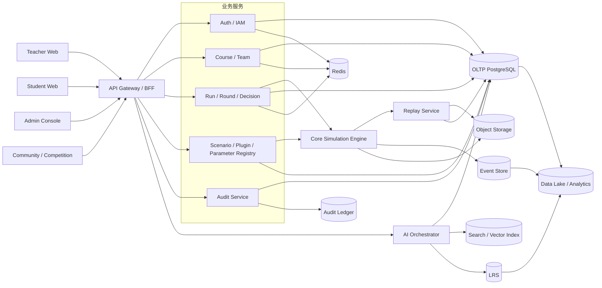

# docs/architecture/database-design.md

## 文档信息与设计基线

**文档信息**

| 项目     | 内容                                                                                                                                                                                                                                                                                                                                                 |
| -------- | ---------------------------------------------------------------------------------------------------------------------------------------------------------------------------------------------------------------------------------------------------------------------------------------------------------------------------------------------------- |
| 文档名称 | docs/architecture/database-design.md                                                                                                                                                                                                                                                                                                                 |
| 项目名称 | SimWar                                                                                                                                                                                                                                                                                                                                               |
| 文档版本 | v1.0                                                                                                                                                                                                                                                                                                                                                 |
| 文档状态 | Draft                                                                                                                                                                                                                                                                                                                                                |
| 最后更新 | 2026-05-14                                                                                                                                                                                                                                                                                                                                           |
| 适用范围 | 数据库设计 / 数据字典 / 后端开发 / 测试 / 运维                                                                                                                                                                                                                                                                                                       |
| 维护人   | 请根据实际项目修改                                                                                                                                                                                                                                                                                                                                   |
| 相关文档 | docs/product/requirements.md / docs/architecture/system-architecture.md / docs/contracts/api-contract.md / docs/product/feature-refinement.md / docs/contracts/model-engineering-contract.md / docs/research/executive-model-study.md / docs/architecture/industry-plugin-model-report.md / docs/quality/test-coverage.md / docs/devops/env-setup.md |

**项目定位**

SimWar 已被收敛为一个多租户、契约优先、可回放、可治理的 AI 仿真平台。平台围绕教师开课、学员组队、多轮决策、正式结算、AI 复盘、Replay / Shadow Replay、行业插件扩展、学习诊断、社区与竞赛等能力展开；其中最关键的边界是“Core Simulation Engine 才是正式真值来源”，而 AI 只在建议层工作，不能改写正式成绩、正式参数或正式快照。  
（依据：REQ L21-L23, L34-L51；SA L17-L21, L34-L47；MEC L14-L18；FEAT L12-L20）

**引用说明**

下文为便于阅读，统一使用简称：REQ = docs/product/requirements.md；SA = docs/architecture/system-architecture.md；API = docs/contracts/api-contract.md；FEAT = docs/product/feature-refinement.md；MEC = docs/contracts/model-engineering-contract.md(3).md；AI = docs/research/executive-model-study.md(1).md；PLG = docs/architecture/industry-plugin-model-report.md；FE = docs/frontend/teacher-student-architecture.md；TEST = docs/quality/test-coverage.md；ENV = docs/devops/env-setup.md / SimWar 运行与构建环境(3).md；AGENT = AGENTS.md。当前仓库仍处于“文档先行、实施待冻结”的阶段，因此本文将“已冻结边界”和“建议性落库方案”同时给出；凡文档未最终冻结之处，均明确标注“请根据实际项目修改”。  
（依据：AGENT L6-L10；ENV L117-L130；docs/devops/env-setup.md L724-L757）

**核心数据设计原则**

| 原则           | 数据库落地要求                                                                                                                                                 |
| -------------- | -------------------------------------------------------------------------------------------------------------------------------------------------------------- |
| 多租户隔离     | 除 `tenant` 本身和少数系统级字典表外，核心业务表默认带 `tenant_id`；查询必须走 `tenant_id + RBAC + scope`。                                                    |
| 真值边界       | `state_true`、正式 `SettlementResult`、正式 `Score`、`Rank` 只能由核心仿真引擎写入；AI 只能写 `CoachOutput`、`ModelCallLog`、`RubricAssessment` 等建议层对象。 |
| 追加写与可回放 | `DecisionVersion`、`AuditLog`、`ModelCallLog`、`ReplayReport`、事件账本、快照账本优先追加写；历史更正通过追加事件而不是覆盖。                                  |
| 版本化治理     | `ScenarioPackage`、`PluginPackage`、`ParameterSet`、`ModelVersion`、`PromptVersion`、`SettlementResult`、`ReplayReport` 必须版本化。                           |
| 强审计         | 所有写操作必须记录审计；参数发布、插件发布、模型发布、导出、回滚、Shadow Replay 等高风险动作必须强审计。                                                       |
| 沙盒隔离       | Official / Sandbox / Shadow Replay / Counterfactual 必须在对象、状态、权限、存储引用四层分离。                                                                 |

（依据：SA L34-L47, L343-L353, L482-L510, L513-L530；MEC L206-L208, L243-L268, L390-L407, L451-L476；AI L689-L700；TEST L17-L29, L74-L78）

**主键与命名规范说明**

项目文档对外契约更偏向 `<entity>_id` 风格，例如 `course_id`、`run_id`、`replay_id`；本文为便于 ORM 与迁移脚本统一，建议物理表主键统一命名为 `id`，外键统一使用 `{entity}_id`。如果团队决定让数据库列名完全沿用 API 契约，也可以把本文中的 `id` 直接替换为 `{entity}_id`，不会影响关系设计。  
（依据：SA L15-L16；API L40-L40；FE L20-L22）

## 数据架构与领域边界

**数据架构概览**

SimWar 的数据层不是单库，而是“主事务库 + 事件账本 + 快照账本 + 审计账本 + LRS + Lakehouse + 对象存储 + 缓存 + 搜索/向量索引”的组合。PostgreSQL 承担租户、课程、Run、Round、Team、审批、审计索引等 OLTP 数据；Kafka 或同类事件流承接决策、锁轮、结算、Replay、AI 工具调用与审批事件；快照与结果包进入 PostgreSQL + 对象存储；LRS 承接 xAPI 学习事件；Lakehouse / ClickHouse 承接学习诊断和运营分析；Redis 承担权限裁剪缓存、幂等键、会话与榜单；向量检索承接授权知识与复盘检索。  
（依据：SA L153-L160, L343-L353；docs/devops/env-setup.md L42-L62；ENV L11-L11, L506-L506）



**数据域划分**

| 数据域       | 说明                                               | 主要实体                                                                         |
| ------------ | -------------------------------------------------- | -------------------------------------------------------------------------------- |
| 租户与权限域 | 多租户、角色、范围绑定、字段可见性                 | Tenant / User / Role / Permission / UserRole                                     |
| 课程与教学域 | 建课、班级、名册、评分规则绑定                     | Course / Class / Enrollment                                                      |
| 队伍与决策域 | 队伍、成员、角色槽位、决策历史                     | Team / TeamMember / Decision / DecisionVersion                                   |
| 回合与仿真域 | Run 生命周期、Round 状态机、三态快照、正式结算结果 | Run / Round / StateSnapshot / SettlementResult                                   |
| 场景与插件域 | 场景包、插件包、参数集、映射规则、冲击事件         | ScenarioPackage / PluginPackage / ParameterSet / ShockEvent / FeatureMappingRule |
| AI 小模型域  | 模型版本、Prompt 版本、建议输出、调用日志          | ModelVersion / PromptVersion / CoachOutput / ModelCallLog                        |
| Replay 域    | Replay 执行、差异报告、审批门禁                    | ReplayRun / ReplayReport / ApprovalRecord                                        |
| 学习记录域   | xAPI/LRS、学习诊断、推荐输入                       | LearningRecord / LearningReport                                                  |
| 社区与竞赛域 | 发帖、报名、榜单与异步通知                         | CommunityPost / Competition / CompetitionTeam / Notification                     |
| 审计与治理域 | 审批、审计、授权血缘、导出                         | AuditLog / ApprovalRecord / LicenseRecord                                        |

（依据：SA L153-L160, L255-L270；REQ L381-L399；FEAT L264-L288；AI L689-L701）

**ER 模型**

```mermaid
erDiagram
  TENANT ||--o{ USER : owns
  TENANT ||--o{ COURSE : owns
  COURSE ||--o{ CLASS : contains
  COURSE ||--o{ ENROLLMENT : has
  COURSE ||--o{ TEAM : contains
  COURSE ||--o{ RUN : creates
  CLASS ||--o{ ENROLLMENT : groups
  USER ||--o{ USER_ROLE : binds
  ROLE ||--o{ USER_ROLE : grants
  TEAM ||--o{ TEAM_MEMBER : has
  USER ||--o{ TEAM_MEMBER : joins
  RUN ||--o{ ROUND : contains
  ROUND ||--o{ DECISION : receives
  DECISION ||--o{ DECISION_VERSION : versions
  ROUND ||--o{ STATE_SNAPSHOT : emits
  ROUND ||--o{ SETTLEMENT_RESULT : settles
  SCENARIO_PACKAGE ||--o{ RUN : frozen_for
  PLUGIN_PACKAGE ||--o{ SCENARIO_PACKAGE : extends
  PARAMETER_SET ||--o{ RUN : binds
  RUN ||--o{ REPLAY_RUN : replays
  REPLAY_RUN ||--o{ REPLAY_REPORT : outputs
  USER ||--o{ COACH_OUTPUT : requests
  USER ||--o{ AUDIT_LOG : acts
  COURSE ||--o{ LEARNING_RECORD : generates
  MODEL_VERSION ||--o{ COACH_OUTPUT : powers
  PROMPT_VERSION ||--o{ COACH_OUTPUT : formats
  MODEL_VERSION ||--o{ MODEL_CALL_LOG : logs
  COURSE ||--o{ COMPETITION : maps_to
  COMPETITION ||--o{ COMPETITION_TEAM : includes
  USER ||--o{ COMMUNITY_POST : authors
```

**核心实体总览表**

| 实体名           | 表名              | 数据域       | 说明          | 多租户 | 版本化       | 追加写         | 优先级 |
| ---------------- | ----------------- | ------------ | ------------- | ------ | ------------ | -------------- | ------ |
| Tenant           | tenant            | 租户与权限域 | 多租户主体    | 否     | 否           | 否             | P0     |
| User             | user              | 租户与权限域 | 用户主体      | 是     | 否           | 否             | P0     |
| Role             | role              | 租户与权限域 | 角色定义      | 是     | 可选         | 否             | P0     |
| Permission       | permission        | 租户与权限域 | 权限字典      | 是     | 可选         | 否             | P0     |
| UserRole         | user_role         | 租户与权限域 | 作用域绑定    | 是     | 是           | 优先追加写     | P0     |
| Course           | course            | 课程与教学域 | 课程/教学外壳 | 是     | 轻版本       | 否             | P0     |
| Class            | class             | 课程与教学域 | 班级/班次     | 是     | 否           | 否             | P1     |
| Enrollment       | enrollment        | 课程与教学域 | 报名/成员绑定 | 是     | 否           | 是             | P0     |
| Run              | run               | 回合与仿真域 | 一次赛局      | 是     | 冻结版本绑定 | 否             | P0     |
| Round            | round             | 回合与仿真域 | 回合实例      | 是     | 否           | 状态事件驱动   | P0     |
| Team             | team              | 队伍与决策域 | 队伍主体      | 是     | 否           | 否             | P0     |
| TeamMember       | team_member       | 队伍与决策域 | 队伍成员      | 是     | 否           | 是             | P0     |
| Decision         | decision          | 队伍与决策域 | 决策聚合根    | 是     | 有版本指针   | 否             | P0     |
| DecisionVersion  | decision_version  | 队伍与决策域 | 决策历史      | 是     | 是           | 是             | P0     |
| ScenarioPackage  | scenario_package  | 场景与插件域 | 场景包        | 是     | 是           | 否             | P0     |
| PluginPackage    | plugin_package    | 场景与插件域 | 插件包        | 是     | 是           | 状态追加写优先 | P0     |
| ParameterSet     | parameter_set     | 场景与插件域 | 真值参数集    | 是     | 是           | 否             | P0     |
| StateSnapshot    | state_snapshot    | 回合与仿真域 | 三态快照      | 是     | 是           | 是             | P0     |
| SettlementResult | settlement_result | 回合与仿真域 | 正式结果      | 是     | 是           | 是             | P0     |
| ReplayRun        | replay_run        | Replay 域    | Replay 执行   | 是     | 否           | 是             | P1     |
| ReplayReport     | replay_report     | Replay 域    | 差异报告      | 是     | 是           | 是             | P1     |
| CoachOutput      | coach_output      | AI 小模型域  | AI 建议输出   | 是     | 引用版本     | 是             | P0     |
| ModelCallLog     | model_call_log    | AI 小模型域  | 模型调用日志  | 是     | 否           | 是             | P1     |
| ModelVersion     | model_version     | AI 小模型域  | 模型版本      | 是     | 是           | 否             | P1     |
| PromptVersion    | prompt_version    | AI 小模型域  | Prompt 版本   | 是     | 是           | 否             | P1     |
| LearningRecord   | learning_record   | 学习记录域   | xAPI/LRS 事件 | 是     | 否           | 是             | P1     |
| LearningReport   | learning_report   | 学习记录域   | 学习报告      | 是     | 是           | 是             | P1     |
| AuditLog         | audit_log         | 审计与治理域 | 审计日志      | 是     | 否           | 是             | P0     |
| ApprovalRecord   | approval_record   | 审计与治理域 | 审批记录      | 是     | 是           | 是             | P1     |
| Competition      | competition       | 社区与竞赛域 | 竞赛主体      | 是     | 轻版本       | 否             | P2     |
| CompetitionTeam  | competition_team  | 社区与竞赛域 | 报名/对阵队伍 | 是     | 否           | 是             | P2     |
| CommunityPost    | community_post    | 社区与竞赛域 | 社区帖子      | 是     | 可追版本     | 状态追加写优先 | P2     |
| Notification     | notification      | 社区与竞赛域 | 异步通知      | 是     | 否           | 是             | P1     |

（依据：REQ L381-L399；SA L255-L270, L819-L833；FEAT L264-L288, L358-L369；AI L689-L701；FE L241-L241）

## 核心表设计

**设计说明**

除专门的中间表和日志表外，本文默认多数业务表都继承 `id`、`created_at`、`updated_at`、`deleted_at`、`created_by`、`updated_by`、`metadata`。为避免重复，下列数据字典只列“关键业务字段”；公共审计字段可在 ORM 基类或 SQL 模板中统一注入。高风险对象如 `audit_log`、`state_snapshot`、`settlement_result`、`replay_report`、`model_call_log` 不建议开启可恢复软删。  
（依据：SA L432-L445；MEC L390-L407；API L110-L110；TEST L78-L78）

**租户与权限域的关键表**  
该域的目标是把 `tenant_id + role_binding + scope + 字段级可见性` 固化到数据库层，服务 `login`、`/auth/me`、角色绑定、课程/团队范围裁剪与前端字段显隐策略。  
（依据：API L203-L272；FEAT L100-L103；SA L513-L530）

**表名：tenant**｜实体：Tenant｜写入：普通写入｜多租户：否｜主键：id  
| 字段名 | 类型 | 必填 | 说明 | 索引 / 约束 |
|---|---|---:|---|---|
| tenant_code | VARCHAR(64) | 是 | 租户编码 | UNIQUE |
| name | VARCHAR(128) | 是 | 租户名称 | |
| isolation_mode | VARCHAR(32) | 是 | logical / dedicated 等 | |
| status | VARCHAR(32) | 是 | active / suspended / archived | IDX |
| config | JSONB | 否 | 租户策略 | GIN |
关系：上游根表。查询：按租户加载策略。注意：独库模式下仍保留治理主索引表。

**表名：user**｜实体：User｜写入：普通写入｜多租户：是｜主键：id  
| 字段名 | 类型 | 必填 | 说明 | 索引 / 约束 |
|---|---|---:|---|---|
| tenant_id | UUID | 是 | 所属租户 | IDX, FK |
| username | VARCHAR(96) | 是 | 登录用户名 | UNIQUE(tenant_id, username) |
| display_name | VARCHAR(128) | 是 | 显示名 | |
| email_ciphertext | TEXT | 否 | 加密邮箱 | |
| password_hash | TEXT | 是 | 口令哈希 | |
| status | VARCHAR(32) | 是 | 账号状态 | IDX |
关系：连接 user_role / team_member / coach_output / audit_log。查询：登录、当前会话。注意：刷新令牌建议单独会话表加密管理。

**表名：role**｜实体：Role｜写入：普通写入｜多租户：是｜主键：id  
| 字段名 | 类型 | 必填 | 说明 | 索引 / 约束 |
|---|---|---:|---|---|
| tenant_id | UUID | 否 | NULL 表示平台级模板 | IDX |
| role_code | VARCHAR(64) | 是 | 如 teacher / learner | UNIQUE(tenant_id, role_code) |
| scope_type | VARCHAR(32) | 是 | tenant / course / team | IDX |
| policy | JSONB | 否 | 默认策略 | GIN |
| status | VARCHAR(32) | 是 | active / archived | IDX |
关系：供 user_role 引用。查询：鉴权、角色枚举。注意：平台模板与租户自定义角色名称不要冲突。

**表名：permission**｜实体：Permission｜写入：普通写入｜多租户：是｜主键：id  
| 字段名 | 类型 | 必填 | 说明 | 索引 / 约束 |
|---|---|---:|---|---|
| tenant_id | UUID | 否 | NULL 表示平台模板 | IDX |
| permission_code | VARCHAR(96) | 是 | 资源动作编码 | UNIQUE(tenant_id, permission_code) |
| resource | VARCHAR(64) | 是 | 资源类型 | IDX |
| action | VARCHAR(64) | 是 | 动作 | |
| effect | VARCHAR(16) | 是 | allow / deny | |
关系：可通过 role_permission 或 seed 固化。查询：字段裁剪、页面权限。注意：MVP 可先以 seed + 应用层映射实现。

**表名：user_role**｜实体：UserRoleBinding｜写入：追加写优先｜多租户：是｜主键：id  
| 字段名 | 类型 | 必填 | 说明 | 索引 / 约束 |
|---|---|---:|---|---|
| tenant_id | UUID | 是 | 租户 | IDX, FK |
| user_id | UUID | 是 | 用户 | IDX, FK |
| role_id | UUID | 是 | 角色 | IDX, FK |
| scope_type | VARCHAR(32) | 是 | tenant/course/team/class | IDX |
| scope_id | UUID | 否 | 作用域对象 | IDX |
| effective_from / effective_to | TIMESTAMPTZ | 否 | 生效窗口 | |
| status | VARCHAR(32) | 是 | active / revoked / expired | IDX |
关系：RBAC + scope 的核心绑定表。查询：`/auth/me`、授权范围计算。注意：对活跃行做部分唯一索引。  
（依据：REQ L57-L71, L381-L383；API L203-L272；docs/devops/env-setup.md L763-L766）

**课程、班级与队伍域的关键表**  
该域承接建课、班级名册、发布、组织结构、队伍角色槽位与课程工作台。文档中 `Course` 常同时承载“课程/班级”概念，因此 `class` 是增强型规范化建议；若实际项目保持单表，也可并入 `course`。  
（依据：REQ L168-L177；FEAT L114-L138；API L298-L416）

**表名：course**｜实体：Course｜写入：普通写入｜多租户：是｜主键：id  
| 字段名 | 类型 | 必填 | 说明 | 索引 / 约束 |
|---|---|---:|---|---|
| tenant_id | UUID | 是 | 租户 | IDX |
| name | VARCHAR(160) | 是 | 课程名称 | IDX |
| teacher_id | UUID | 否 | 主教师 | IDX |
| scenario_package_id | UUID | 否 | 绑定场景包 | IDX, FK |
| parameter_set_id | UUID | 否 | 绑定参数集 | IDX, FK |
| rubric_version_id | UUID | 否 | Rubric 版本 | |
| scoring_rule_version_id | UUID | 否 | 评分规则版本 | |
| planned_rounds | INT | 否 | 计划回合数 | |
| review_required | BOOLEAN | 是 | 是否启用审核 | |
| status | VARCHAR(32) | 是 | draft / published / active / completed / archived | IDX |
关系：`course` 是 `run` 的业务外壳。查询：课程列表、课程发布、工作台。注意：正式运行后禁止替换核心资产。

**表名：class**｜实体：Class｜写入：普通写入｜多租户：是｜主键：id  
| 字段名 | 类型 | 必填 | 说明 | 索引 / 约束 |
|---|---|---:|---|---|
| tenant_id | UUID | 是 | 租户 | IDX |
| course_id | UUID | 是 | 所属课程 | IDX, FK |
| class_code | VARCHAR(64) | 是 | 班级编码 | UNIQUE(course_id, class_code) |
| name | VARCHAR(160) | 是 | 班级名称 | |
| start_at / end_at | TIMESTAMPTZ | 否 | 时间窗 | IDX |
| status | VARCHAR(32) | 是 | draft / active / archived | IDX |
关系：同一课程的多班次容器。查询：名册导入、班级报表。注意：若不拆班级，可合并到 course。

**表名：enrollment**｜实体：Enrollment｜写入：追加写优先｜多租户：是｜主键：id  
| 字段名 | 类型 | 必填 | 说明 | 索引 / 约束 |
|---|---|---:|---|---|
| tenant_id | UUID | 是 | 租户 | IDX |
| course_id | UUID | 是 | 课程 | IDX, FK |
| class_id | UUID | 否 | 班级 | IDX, FK |
| user_id | UUID | 是 | 用户 | IDX, FK |
| enrollment_type | VARCHAR(32) | 是 | learner / observer / assistant | |
| status | VARCHAR(32) | 是 | invited / enrolled / dropped / completed | IDX |
| team_id | UUID | 否 | 当前队伍 | IDX, FK |
关系：课程名册与队伍绑定枢纽。查询：成员是否在课程范围、导入名册。注意：团队变更要保留历史痕迹。

**表名：team**｜实体：Team｜写入：普通写入｜多租户：是｜主键：id  
| 字段名 | 类型 | 必填 | 说明 | 索引 / 约束 |
|---|---|---:|---|---|
| tenant_id | UUID | 是 | 租户 | IDX |
| course_id | UUID | 是 | 课程 | IDX, FK |
| class_id | UUID | 否 | 班级 | IDX, FK |
| name | VARCHAR(160) | 是 | 队伍名 | |
| team_code | VARCHAR(64) | 是 | 队伍编码 | UNIQUE(tenant_id, course_id, team_code) |
| initial_capital | DECIMAL(18,2) | 否 | 初始资金 | |
| risk_limits | JSONB | 否 | 风险阈值 | GIN |
| role_map | JSONB | 否 | 角色摘要 | GIN |
| system_intervened | BOOLEAN | 是 | 是否发生系统保底介入 | IDX |
| status | VARCHAR(32) | 是 | active / archived | IDX |
关系：队伍是决策与结算的最小组织单元。查询：队伍列表、驾驶舱、排行榜。注意：系统补位只能保底，不能替代最优决策。

**表名：team_member**｜实体：TeamMember｜写入：追加写优先｜多租户：是｜主键：id  
| 字段名 | 类型 | 必填 | 说明 | 索引 / 约束 |
|---|---|---:|---|---|
| tenant_id | UUID | 是 | 租户 | IDX |
| team_id | UUID | 是 | 队伍 | IDX, FK |
| user_id | UUID | 是 | 用户 | IDX, FK |
| role_slot | VARCHAR(32) | 是 | CEO / CFO / COO / CMO 等 | IDX |
| is_captain | BOOLEAN | 是 | 是否队长 | 部分唯一 |
| is_autopilot_fallback | BOOLEAN | 是 | 是否系统补位 | IDX |
| status | VARCHAR(32) | 是 | active / removed / frozen | IDX |
关系：保证角色槽位与队长唯一性。查询：角色冲突检测、缺岗提醒。注意：推荐 `(team_id, role_slot)` 与 `is_captain=true` 做部分唯一。  
（依据：FEAT L114-L138；API L298-L416；TEST L71-L71；SA L586-L595）

**Run、Round、Decision、Snapshot、Result 域的关键表**  
该域是 SimWar 的真值主平面。最关键的规则是：Run 创建时冻结上下文；Round 使用严格状态机；`DecisionVersion` 追加写；`StateSnapshot` 与 `SettlementResult` 只能由核心引擎写。  
（依据：SA L156-L181, L275-L307, L343-L353, L432-L445；API L442-L543；MEC L451-L476；TEST L72-L76）

**表名：run**｜实体：Run｜写入：普通写入 + 冻结绑定｜多租户：是｜主键：id  
| 字段名 | 类型 | 必填 | 说明 | 索引 / 约束 |
|---|---|---:|---|---|
| tenant_id | UUID | 是 | 租户 | IDX |
| course_id | UUID | 是 | 课程 | IDX, FK |
| scenario_package_id | UUID | 是 | 冻结场景包 | IDX, FK |
| parameter_set_id | UUID | 是 | 冻结参数集 | IDX, FK |
| seed | BIGINT | 是 | 随机种子 | |
| stage | VARCHAR(32) | 否 | official / sandbox / shadow_replay / counterfactual | IDX |
| bound_plugin_versions | JSONB | 否 | 冻结插件组合 | GIN |
| start_round_no / current_round_no | INT | 否 | 回合位置 | |
| status | VARCHAR(32) | 是 | 建议：preparing / active / completed / archived | IDX |
| frozen_context_hash | VARCHAR(128) | 否 | 冻结上下文哈希 | IDX |
关系：回合、快照、结果、Replay 的上游根。查询：运行列表、冻结版本组合。注意：插件组合如需强关系可后续拆 `run_plugin_binding`。

**表名：round**｜实体：Round｜写入：状态机驱动｜多租户：是｜主键：id  
| 字段名 | 类型 | 必填 | 说明 | 索引 / 约束 |
|---|---|---:|---|---|
| tenant_id | UUID | 是 | 租户 | IDX |
| run_id | UUID | 是 | Run | UNIQUE(run_id, round_no) |
| round_no | INT | 是 | 回合号 | UNIQUE(run_id, round_no) |
| window_open_at / window_close_at | TIMESTAMPTZ | 否 | 时间窗 | IDX |
| lock_reason | VARCHAR(255) | 否 | 锁轮原因 | |
| decision_batch_id | UUID | 否 | 锁轮固化批次 | IDX |
| status | VARCHAR(32) | 是 | `draft -> open -> locked -> settling -> settled -> published -> archived` | IDX |
| published_at | TIMESTAMPTZ | 否 | 发布时间 | |
关系：决策窗口与结算门禁。查询：回合状态、锁轮回放。注意：API/UI 可把 `pending`、`in_progress`、`locked_for_settlement` 映射为数据库 canonical 状态。

**表名：decision**｜实体：Decision｜写入：聚合写入｜多租户：是｜主键：id  
| 字段名 | 类型 | 必填 | 说明 | 索引 / 约束 |
|---|---|---:|---|---|
| tenant_id | UUID | 是 | 租户 | IDX |
| run_id | UUID | 是 | Run | IDX, FK |
| round_id | UUID | 是 | Round | UNIQUE(round_id, team_id) |
| team_id | UUID | 是 | Team | UNIQUE(round_id, team_id) |
| latest_version_no | INT | 是 | 最新版本号 | |
| effective_version_id | UUID | 否 | 生效版本 | IDX |
| status | VARCHAR(32) | 是 | 建议：draft / submitted / locked / accepted / rejected / superseded | IDX |
| submitted_at / locked_at | TIMESTAMPTZ | 否 | 提交与锁轮时间 | IDX |
关系：主表只存聚合根与版本指针。查询：当前有效决策。注意：不在主表内存最终 payload。

**表名：decision_version**｜实体：DecisionVersion｜写入：追加写｜多租户：是｜主键：id  
| 字段名 | 类型 | 必填 | 说明 | 索引 / 约束 |
|---|---|---:|---|---|
| tenant_id | UUID | 是 | 租户 | IDX |
| decision_id | UUID | 是 | 决策聚合根 | UNIQUE(decision_id, version_no) |
| version_no | INT | 是 | 版本号 | UNIQUE(decision_id, version_no) |
| client_revision | INT | 否 | 前端修订号 | |
| decision_payload | JSONB | 是 | 结构化决策 | GIN |
| validation_report | JSONB | 否 | 校验结果 | GIN |
| agent_proposal_refs | JSONB | 否 | AI 建议引用 | GIN |
| submitted_by | UUID | 是 | 操作人 | IDX |
| is_effective | BOOLEAN | 是 | 是否锁轮生效版本 | IDX |
关系：Replay、申诉、审计的关键基础。查询：版本对比、锁轮时固化最新有效版本。注意：文档明确“不原地覆盖”。

**表名：state_snapshot**｜实体：StateSnapshot｜写入：追加写｜多租户：是｜主键：id  
| 字段名 | 类型 | 必填 | 说明 | 索引 / 约束 |
|---|---|---:|---|---|
| tenant_id | UUID | 是 | 租户 | IDX |
| run_id | UUID | 是 | Run | IDX, FK |
| round_id | UUID | 是 | Round | IDX, FK |
| team_id | UUID | 否 | 团队维度快照 | IDX, FK |
| snapshot_type | VARCHAR(32) | 是 | `state_true` / `state_obs` / `state_est` / `teacher_summary` | IDX |
| payload | JSONB | 否 | 小型快照 | GIN |
| object_ref | TEXT | 否 | 大对象引用 | |
| replay_hash | VARCHAR(128) | 是 | 可回放哈希 | IDX |
| visible_scope | VARCHAR(32) | 是 | teacher / team / governance / ai | IDX |
关系：一行建议只表达一种可见态。查询：学员面板、教师摘要、治理回放。注意：大型快照建议“摘要入 PG + 全量入对象存储”。

**表名：settlement_result**｜实体：SettlementResult｜写入：追加写 + 版本化｜多租户：是｜主键：id  
| 字段名 | 类型 | 必填 | 说明 | 索引 / 约束 |
|---|---|---:|---|---|
| tenant_id | UUID | 是 | 租户 | IDX |
| run_id | UUID | 是 | Run | IDX, FK |
| round_id | UUID | 是 | Round | UNIQUE(round_id, team_id, result_version) |
| team_id | UUID | 否 | 团队级结果；NULL 可表示全局摘要 | IDX |
| result_version | INT | 是 | 结果版本 | UNIQUE(round_id, team_id, result_version) |
| truth_state_ref | UUID | 是 | 真值快照引用 | IDX |
| score | DECIMAL(18,6) | 否 | 正式分数 | IDX |
| rank | INT | 否 | 正式排名 | IDX |
| revenue / profit / cash_end | DECIMAL(18,2) | 否 | 财务摘要 | |
| metrics_summary | JSONB | 否 | 市占率、处罚、KPI 摘要 | GIN |
| published_at | TIMESTAMPTZ | 否 | 发布时间 | IDX |
| immutable_digest | VARCHAR(128) | 否 | 防篡改摘要 | IDX |
关系：正式结果表，与 AI 建议、Replay 候选结果物理隔离。查询：结果页、排行榜、竞赛榜单。注意：已发布结果不可覆盖，只能新版本追加。  
（依据：API L442-L560；FEAT L144-L153；SA L275-L307, L432-L445；MEC L451-L476；TEST L72-L76）

**场景、参数、插件与 AI 治理域的关键表**  
该域承担“版本冻结、审批、Shadow Replay 门禁、模型与 Prompt 回放”。  
（依据：PLG L233-L260, L337-L356, L560-L571；MEC L178-L208；AI L689-L760；API L318-L326, L657-L745）

**表名：scenario_package**｜实体：ScenarioPackage｜写入：版本化写入｜多租户：是｜主键：id  
| 字段名 | 类型 | 必填 | 说明 | 索引 / 约束 |
|---|---|---:|---|---|
| tenant_id | UUID | 是 | 租户 | IDX |
| template_id | VARCHAR(64) | 是 | 模板标识 | UNIQUE(tenant_id, template_id, version) |
| scenario_name | VARCHAR(160) | 是 | 场景名 | |
| industry | VARCHAR(64) | 否 | 行业类型 | IDX |
| version | VARCHAR(32) | 是 | 版本 | UNIQUE |
| plugin_dependencies | JSONB | 否 | 插件依赖 | GIN |
| parameter_set_dependencies | JSONB | 否 | 参数依赖 | GIN |
| round_script | JSONB | 否 | 轮次脚本 | GIN |
| compile_report_ref | TEXT | 否 | 编译报告 | |
| status | VARCHAR(32) | 是 | 建议：draft / approved / deprecated | IDX |
关系：课程与 Run 使用的可执行场景包。查询：场景编译、发布前校验。注意：Run 绑定后场景引用冻结。

**表名：plugin_package**｜实体：PluginPackage｜写入：版本化写入 + 状态流｜多租户：是｜主键：id  
| 字段名 | 类型 | 必填 | 说明 | 索引 / 约束 |
|---|---|---:|---|---|
| tenant_id | UUID | 是 | 租户 | IDX |
| plugin_name | VARCHAR(160) | 是 | 插件名 | UNIQUE(tenant_id, plugin_name, version) |
| industry | VARCHAR(64) | 是 | 行业 | IDX |
| version | VARCHAR(32) | 是 | 版本 | UNIQUE |
| manifest_ref | TEXT | 否 | Manifest | |
| artifact_ref | TEXT | 否 | 插件产物 | |
| compatibility_level | VARCHAR(32) | 否 | 兼容等级 | IDX |
| status | VARCHAR(32) | 是 | `draft -> testing -> shadow_testing -> approved -> deployed -> deprecated -> rolled_back` | IDX |
| approved_by | UUID | 否 | 审批人 | |
关系：延展 Kernel，不得直写真值。查询：插件列表、审批、部署。注意：进行中 Run 禁热切换。

**表名：parameter_set**｜实体：ParameterSet｜写入：版本化写入｜多租户：是｜主键：id  
| 字段名 | 类型 | 必填 | 说明 | 索引 / 约束 |
|---|---|---:|---|---|
| tenant_id | UUID | 是 | 租户 | IDX |
| model_family | VARCHAR(32) | 是 | logit / blp / rcnl 等 | IDX |
| version | VARCHAR(32) | 是 | 版本 | UNIQUE(tenant_id, model_family, version) |
| formulation | JSONB | 是 | `x1/x2/x3` 公式等 | GIN |
| demand / supply / integration | JSONB | 否 | 求解与市场参数 | GIN |
| validity / governance / diagnostics | JSONB | 否 | 有效区间、审批、Shadow 指标 | GIN |
| feature_mapper_version | VARCHAR(32) | 否 | 映射器版本 | IDX |
| solver_version | VARCHAR(32) | 否 | 求解器版本 | IDX |
| shadow_replay_report_id | UUID | 否 | Shadow 凭证 | IDX |
| approved_by | UUID | 否 | 审批人 | |
| status | VARCHAR(32) | 是 | `draft -> candidate -> shadow_testing -> shadow_passed -> approved -> deprecated` | IDX |
关系：正式真值核的一等治理对象。查询：Run 创建冻结、参数审批。注意：`approved` 后禁止原位覆盖。

**表名：model_version**｜实体：ModelVersion｜写入：版本化写入｜多租户：是｜主键：id  
| 字段名 | 类型 | 必填 | 说明 | 索引 / 约束 |
|---|---|---:|---|---|
| tenant_id | UUID | 是 | 租户 | IDX |
| model_name | VARCHAR(128) | 是 | 模型名 | UNIQUE(tenant_id, model_name, version) |
| model_provider | VARCHAR(64) | 否 | 提供方 | IDX |
| version | VARCHAR(32) | 是 | 版本 | UNIQUE |
| capability_scope | JSONB | 否 | 支持任务与范围 | GIN |
| rollback_to | UUID | 否 | 回滚目标 | IDX |
| eval_report_ref / shadow_report_ref | TEXT | 否 | 评测与影子报告 | |
| status | VARCHAR(32) | 是 | `draft -> evaluation -> shadow_arena -> approved -> deployed -> deprecated -> rolled_back` | IDX |
| approved_by | UUID | 否 | 审批人 | |
关系：所有 AI 输出和模型日志都会回指它。查询：模型治理、回滚。注意：模型升级不能绕过评测与 Shadow。

**表名：prompt_version**｜实体：PromptVersion｜写入：版本化写入｜多租户：是｜主键：id  
| 字段名 | 类型 | 必填 | 说明 | 索引 / 约束 |
|---|---|---:|---|---|
| tenant_id | UUID | 是 | 租户 | IDX |
| prompt_id | VARCHAR(64) | 是 | Prompt 标识 | UNIQUE(tenant_id, prompt_id, prompt_version) |
| prompt_version | VARCHAR(32) | 是 | 版本 | UNIQUE |
| task_type | VARCHAR(64) | 是 | 任务类型 | IDX |
| model_name | VARCHAR(128) | 否 | 绑定模型 | |
| plugin_version | VARCHAR(32) | 否 | 绑定插件版本 | |
| scenario_package_id | UUID | 否 | 绑定场景包 | IDX |
| surface | VARCHAR(32) | 否 | teacher_web / student_web | IDX |
| status | VARCHAR(32) | 是 | 建议：draft / evaluation / shadow_testing / approved / deprecated | IDX |
| approved_by / audit_id | UUID | 否 | 审批与审计引用 | IDX |
关系：用于 AI 输出重放。查询：Prompt 注入回归、输出追溯。注意：完整状态流是治理增强建议。

**表名：coach_output**｜实体：CoachOutput｜写入：追加写｜多租户：是｜主键：id  
| 字段名 | 类型 | 必填 | 说明 | 索引 / 约束 |
|---|---|---:|---|---|
| tenant_id | UUID | 是 | 租户 | IDX |
| run_id / round_id / team_id / user_id | UUID | 否 | 业务上下文 | IDX |
| output_type | VARCHAR(64) | 是 | strategy / debrief / risk / recommendation / rubric_draft | IDX |
| model_version_id | UUID | 是 | 模型版本 | IDX |
| prompt_version_id | UUID | 否 | Prompt 版本 | IDX |
| advisory_only | BOOLEAN | 是 | 必须为 true | IDX |
| truth_write_attempted | BOOLEAN | 是 | 默认 false，越权必须告警 | IDX |
| recommendations | JSONB | 否 | 建议列表 | GIN |
| evidence_ref / context_ref | JSONB | 否 | 证据与上下文引用 | GIN |
| visibility_scope | VARCHAR(32) | 否 | team / teacher / governance | IDX |
关系：与正式结算物理分离。查询：学员建议、教师 AI 点评。注意：无证据链的输出不得作为主结论。

**表名：model_call_log**｜实体：ModelCallLog｜写入：追加写｜多租户：是｜主键：id  
| 字段名 | 类型 | 必填 | 说明 | 索引 / 约束 |
|---|---|---:|---|---|
| tenant_id | UUID | 是 | 租户 | IDX |
| request_id | VARCHAR(64) | 是 | 请求链路 ID | UNIQUE |
| model_version_id | UUID | 是 | 模型版本 | IDX |
| prompt_version_id | UUID | 否 | Prompt 版本 | IDX |
| task_type | VARCHAR(64) | 是 | 任务类型 | IDX |
| latency_ms | INT | 否 | 延迟 | IDX |
| token_in / token_out | INT | 否 | token 消耗 | |
| guardrail_result | JSONB | 否 | 护栏结果 | GIN |
| context_hash | VARCHAR(128) | 否 | 上下文摘要 | IDX |
| output_ref | UUID | 否 | 对应 CoachOutput | IDX |
| error_code | VARCHAR(64) | 否 | 错误码 | IDX |
关系：AI 性能、风控、追责基础。查询：按模型版本看错误率、延迟。注意：不得落未脱敏隐藏真值。  
（依据：PLG L233-L260, L337-L356, L560-L571；MEC L178-L208, L451-L476；AI L689-L760；API L318-L326, L570-L597）

**Replay、学习、审计与扩展域的关键表**  
该域承接治理门禁、学习闭环、审计完整性与后续竞赛/社区扩展。  
（依据：FEAT L185-L288；AI L689-L701；API L621-L799；SA L343-L353, L648-L657；TEST L76-L78）

**表名：replay_run**｜实体：ReplayRun｜写入：追加写｜多租户：是｜主键：id  
| 字段名 | 类型 | 必填 | 说明 | 索引 / 约束 |
|---|---|---:|---|---|
| tenant_id | UUID | 是 | 租户 | IDX |
| source_run_id | UUID | 是 | 历史 Run | IDX |
| mode | VARCHAR(32) | 是 | official / shadow | IDX |
| candidate_parameter_set_id | UUID | 否 | 候选参数集 | IDX |
| candidate_model_version_id | UUID | 否 | 候选模型 | IDX |
| candidate_plugin_versions | JSONB | 否 | 候选插件组合 | GIN |
| acceptance_profile | JSONB | 否 | 门禁阈值 | GIN |
| requested_by | UUID | 是 | 发起人 | IDX |
| status | VARCHAR(32) | 是 | queued / running / completed / failed | IDX |
| started_at / completed_at | TIMESTAMPTZ | 否 | 执行时间 | |
关系：Replay 执行容器。查询：队列、执行状态。注意：不承载大 diff 内容。

**表名：replay_report**｜实体：ReplayReport｜写入：追加写 + 版本化｜多租户：是｜主键：id  
| 字段名 | 类型 | 必填 | 说明 | 索引 / 约束 |
|---|---|---:|---|---|
| tenant_id | UUID | 是 | 租户 | IDX |
| replay_run_id | UUID | 是 | Replay 执行 | UNIQUE(replay_run_id, version_no) |
| version_no | INT | 是 | 报告版本 | UNIQUE |
| baseline_ref | JSONB | 是 | 基线版本组合 | GIN |
| candidate_ref | JSONB | 是 | 候选版本组合 | GIN |
| diff_summary | JSONB | 是 | 差异摘要 | GIN |
| passed | BOOLEAN | 是 | 是否通过门禁 | IDX |
| fairness_risk | VARCHAR(32) | 否 | 公平性风险 | IDX |
| report_ref | TEXT | 否 | 大报告对象引用 | |
| approval_state | VARCHAR(32) | 否 | pending / approved / rejected | IDX |
关系：支撑治理审批与教师解释。查询：差异摘要、审批态。注意：Shadow Replay 只产生旁路报告，不回写历史成绩。

**表名：learning_record**｜实体：LearningRecord｜写入：追加写｜多租户：是｜主键：id  
| 字段名 | 类型 | 必填 | 说明 | 索引 / 约束 |
|---|---|---:|---|---|
| tenant_id | UUID | 是 | 租户 | IDX |
| user_id / course_id / run_id / round_id / team_id | UUID | 否 | 学习上下文 | IDX |
| verb | VARCHAR(64) | 是 | xAPI 动作 | IDX |
| object_type | VARCHAR(64) | 是 | 学习对象类型 | IDX |
| object_id | UUID | 否 | 对象引用 | IDX |
| xapi_statement | JSONB | 否 | 原始 statement | GIN |
| source_event_id | UUID | 否 | 来源事件 | IDX |
| visible_scope | VARCHAR(32) | 否 | self / teacher / tenant_aggregate | IDX |
关系：学习汇聚的原子事件。查询：个人轨迹、团队协作行为。注意：只承载学习事件，不回写真值。

**表名：learning_report**｜实体：LearningReport｜写入：版本化写入｜多租户：是｜主键：id  
| 字段名 | 类型 | 必填 | 说明 | 索引 / 约束 |
|---|---|---:|---|---|
| tenant_id | UUID | 是 | 租户 | IDX |
| subject_type / subject_id | 是 | 诊断主体 | IDX |
| course_id | UUID | 否 | 课程上下文 | IDX |
| report_type | VARCHAR(64) | 是 | diagnosis / progress / org_aggregate | IDX |
| report_version | INT | 是 | 版本号 | UNIQUE(subject_type, subject_id, course_id, report_type, report_version) |
| skill_profile | JSONB | 否 | 能力画像 | GIN |
| diagnosis_summary | JSONB | 否 | 诊断摘要 | GIN |
| recommendation_refs | JSONB | 否 | 推荐任务引用 | GIN |
| generated_from | JSONB | 否 | 来源引用 | GIN |
| status | VARCHAR(32) | 是 | generated / published / archived | IDX |
关系：教师、学员、企业管理员查看的学习结果对象。注意：企业侧以脱敏聚合为主。

**表名：audit_log**｜实体：AuditLog｜写入：追加写｜多租户：是｜主键：id  
| 字段名 | 类型 | 必填 | 说明 | 索引 / 约束 |
|---|---|---:|---|---|
| tenant_id | UUID | 是 | 租户 | IDX |
| trace_id | VARCHAR(64) | 是 | 链路追踪 | IDX |
| actor_id | UUID | 否 | 操作者 | IDX |
| actor_type | VARCHAR(32) | 是 | user / service / system | IDX |
| action | VARCHAR(64) | 是 | 动作 | IDX |
| entity_type / entity_id | 是 | 操作对象 | IDX |
| scope_type / scope_id | 否 | 范围对象 | IDX |
| request_hash | VARCHAR(128) | 否 | 请求摘要 | IDX |
| before_summary / after_summary | JSONB | 否 | 变更前后摘要 | GIN |
| occurred_at | TIMESTAMPTZ | 是 | 发生时间 | IDX |
关系：全站写操作与高风险读操作审计总线。查询：对象时间线、actor 时间线、导出。注意：普通管理员不能删改。

**表名：approval_record**｜实体：ApprovalRecord｜写入：追加写 + 状态流｜多租户：是｜主键：id  
| 字段名 | 类型 | 必填 | 说明 | 索引 / 约束 |
|---|---|---:|---|---|
| tenant_id | UUID | 是 | 租户 | IDX |
| approval_type | VARCHAR(64) | 是 | parameter / plugin / model / export | IDX |
| target_entity_type / target_entity_id | 是 | 目标对象 | IDX |
| target_version | VARCHAR(32) | 否 | 目标版本 | IDX |
| status | VARCHAR(32) | 是 | pending / approved / rejected / cancelled | IDX |
| requested_by / reviewed_by | UUID | 否 | 申请与审批人 | IDX |
| shadow_replay_id | UUID | 否 | 关联 Shadow Replay | IDX |
| approval_note | TEXT | 否 | 审批说明 | |
| approved_at | TIMESTAMPTZ | 否 | 审批时间 | IDX |
关系：治理门禁主表。查询：审批看板、发布追责。注意：双人审批可再拆 `approval_step`。

**表名：competition**｜实体：Competition｜写入：普通写入 + 状态流｜多租户：是｜主键：id  
| 字段名 | 类型 | 必填 | 说明 | 索引 / 约束 |
|---|---|---:|---|---|
| tenant_id | UUID | 是 | 租户 | IDX |
| course_id | UUID | 否 | 关联课程/赛局 | IDX |
| name | VARCHAR(160) | 是 | 竞赛名 | |
| format | VARCHAR(64) | 是 | 赛制格式 | IDX |
| status | VARCHAR(32) | 是 | `draft -> registration -> grouping -> active -> published -> archived` | IDX |
| registration_open_at / registration_close_at | TIMESTAMPTZ | 否 | 报名窗口 | IDX |
| public_visibility | JSONB | 否 | 公开字段控制 | GIN |
| anti_cheat_policy_ref | TEXT | 否 | 反作弊策略 | |
关系：对课程赛局或公开 PK 的包装层。注意：正式排名读取正式结算结果，不另造分。

**表名：competition_team**｜实体：CompetitionTeam｜写入：追加写优先｜多租户：是｜主键：id  
| 字段名 | 类型 | 必填 | 说明 | 索引 / 约束 |
|---|---|---:|---|---|
| tenant_id | UUID | 是 | 租户 | IDX |
| competition_id | UUID | 是 | 竞赛 | UNIQUE(competition_id, team_id) |
| team_id | UUID | 是 | 队伍 | UNIQUE(competition_id, team_id) |
| registration_status | VARCHAR(32) | 是 | pending / approved / rejected / withdrawn | IDX |
| bracket_group | VARCHAR(64) | 否 | 分组 | IDX |
| seed_no | INT | 否 | 种子位 | |
| final_rank | INT | 否 | 榜单排名 | IDX |
| score_snapshot | DECIMAL(18,6) | 否 | 分数快照 | |
关系：竞赛报名、分组与榜单对象。注意：分数仍来源于正式结果聚合。

**表名：community_post**｜实体：CommunityPost｜写入：追加写 + 状态流｜多租户：是｜主键：id  
| 字段名 | 类型 | 必填 | 说明 | 索引 / 约束 |
|---|---|---:|---|---|
| tenant_id | UUID | 是 | 租户 | IDX |
| course_id | UUID | 否 | 课程上下文 | IDX |
| author_id | UUID | 是 | 作者 | IDX |
| title | VARCHAR(200) | 是 | 标题 | |
| body_ref | TEXT | 是 | 正文或对象存储引用 | |
| visibility | VARCHAR(32) | 是 | public / tenant_only / course_only / team_only | IDX |
| moderation_status | VARCHAR(32) | 是 | `draft -> moderating -> published / blocked -> archived` | IDX |
| published_at / archived_at | TIMESTAMPTZ | 否 | 生命周期时间 | IDX |
关系：课程后学习网络与案例沉淀。注意：公开面不得外显未授权内容与高敏字段。

**表名：notification**｜实体：Notification｜写入：追加写｜多租户：是｜主键：id  
| 字段名 | 类型 | 必填 | 说明 | 索引 / 约束 |
|---|---|---:|---|---|
| tenant_id | UUID | 是 | 租户 | IDX |
| target_user_id | UUID | 否 | 目标用户 | IDX |
| target_scope_type / target_scope_id | 否 | 用户/团队/课程范围 | IDX |
| event_type | VARCHAR(64) | 是 | `RoundLocked` / `ResultPublished` 等 | IDX |
| payload | JSONB | 否 | 通知负载 | GIN |
| read_at | TIMESTAMPTZ | 否 | 已读时间 | IDX |
| status | VARCHAR(32) | 是 | unread / read / dismissed | IDX |
关系：前端通知盒与异步状态条的可选落库承载。注意：通知不是业务真值来源。  
（依据：FEAT L185-L288；AI L689-L701；API L621-L799；SA L343-L353, L648-L657；FE L178-L192, L241-L241；TEST L76-L78）

## 约束、治理与生命周期

**核心字段命名规范**

| 规范项         | 建议                                                                        |
| -------------- | --------------------------------------------------------------------------- |
| 主键           | `id`                                                                        |
| 租户字段       | `tenant_id`                                                                 |
| 外键           | `{entity}_id`                                                               |
| 时间字段       | `created_at` / `updated_at` / `deleted_at` / `published_at` / `occurred_at` |
| 创建人与更新人 | `created_by` / `updated_by`                                                 |
| 状态字段       | `status`                                                                    |
| 版本字段       | `version` / `version_no` / `result_version` / `report_version`              |
| 审计字段       | `audit_id` / `trace_id` / `request_hash`                                    |
| JSON 扩展      | `metadata` / `payload` / `summary` / `config`                               |
| 软删除         | `deleted_at`；高风险表禁物理删除                                            |
| 枚举风格       | 小写 snake_case                                                             |

（依据：SA L15-L16；API L40-L40；FE L20-L22）

**推荐数据类型**

| 数据类型 | 推荐数据库类型 | 用途                         | 示例                          |
| -------- | -------------- | ---------------------------- | ----------------------------- |
| ID       | UUID           | 主键/外键                    | id / tenant_id                |
| 字符串   | VARCHAR / TEXT | 名称、描述、编码、对象引用   | name / team_code              |
| 枚举     | VARCHAR        | 状态与类型                   | status / snapshot_type        |
| 金额     | DECIMAL(18,2)  | 收入、利润、现金             | revenue / profit              |
| 比率     | DECIMAL(18,6)  | 分数、份额、风险率           | score / market_share          |
| JSON     | JSONB          | 扩展 payload、治理配置、规则 | governance / decision_payload |
| 时间     | TIMESTAMPTZ    | 审计、发布、执行时间         | occurred_at                   |
| 布尔     | BOOLEAN        | 开关与标记                   | advisory_only                 |

财务金额不使用 float；比率、概率、份额与评分使用高精度 decimal；大快照与大 diff 推荐“摘要入库 + 对象存储引用”；审计日志和事件日志统一追加写。  
（依据：SA L343-L353；MEC L24-L24, L465-L466；API L537-L543）

**索引设计摘要**

| 表名              | 索引字段                                                          | 类型         | 使用场景     | 优先级 |
| ----------------- | ----------------------------------------------------------------- | ------------ | ------------ | ------ |
| user              | `(tenant_id, username)`                                           | UNIQUE BTREE | 登录         | P0     |
| user_role         | `(tenant_id, user_id, status)`                                    | BTREE        | 会话上下文   | P0     |
| course            | `(tenant_id, status, teacher_id)`                                 | BTREE        | 课程工作台   | P0     |
| team              | `(tenant_id, course_id, team_code)`                               | UNIQUE BTREE | 编码冲突检查 | P0     |
| round             | `(tenant_id, run_id, round_no)`                                   | UNIQUE BTREE | 回合定位     | P0     |
| round             | `(tenant_id, status, window_close_at)`                            | BTREE        | 窗口扫描     | P1     |
| decision          | `(tenant_id, round_id, team_id)`                                  | UNIQUE BTREE | 当前决策聚合 | P0     |
| decision_version  | `(tenant_id, decision_id, version_no)`                            | UNIQUE BTREE | 版本历史     | P0     |
| parameter_set     | `(tenant_id, model_family, version)`                              | UNIQUE BTREE | 参数版本定位 | P0     |
| scenario_package  | `(tenant_id, template_id, version)`                               | UNIQUE BTREE | 场景版本定位 | P0     |
| plugin_package    | `(tenant_id, plugin_name, version)`                               | UNIQUE BTREE | 插件版本定位 | P0     |
| state_snapshot    | `(tenant_id, run_id, round_id, snapshot_type, team_id)`           | BTREE        | 快照读取     | P0     |
| settlement_result | `(tenant_id, round_id, team_id, result_version)`                  | UNIQUE BTREE | 结果定位     | P0     |
| replay_run        | `(tenant_id, source_run_id, status)`                              | BTREE        | Replay 队列  | P1     |
| replay_report     | `(tenant_id, replay_run_id, version_no)`                          | UNIQUE BTREE | 差异报告读取 | P1     |
| coach_output      | `(tenant_id, run_id, round_id, team_id, output_type, created_at)` | BTREE        | AI 输出检索  | P1     |
| model_call_log    | `(tenant_id, model_version_id, created_at DESC)`                  | BTREE        | 模型监控     | P1     |
| learning_record   | `(tenant_id, user_id, created_at DESC)`                           | BTREE        | 学习轨迹     | P1     |
| audit_log         | `(tenant_id, entity_type, entity_id, occurred_at DESC)`           | BTREE        | 审计时间线   | P0     |
| approval_record   | `(tenant_id, target_entity_type, target_entity_id, status)`       | BTREE        | 审批看板     | P1     |
| community_post    | `(tenant_id, visibility, moderation_status, published_at DESC)`   | BTREE        | Feed / 审核  | P2     |
| notification      | `(tenant_id, target_user_id, status, created_at DESC)`            | BTREE        | 通知盒       | P1     |

说明：多租户表一律以 `tenant_id` 作为组合索引前缀；仅在确有查询需求时为 JSONB 字段增建 GIN 索引；`audit_log`、`model_call_log`、`learning_record`、`state_snapshot` 与事件映射表建议优先做时间分区。  
（依据：SA L343-L353, L655-L657；API L247-L272, L516-L525, L747-L799；AI L693-L700）

**唯一约束与外键约束**

| 表名              | 约束     | 字段                                                  | 说明                 |
| ----------------- | -------- | ----------------------------------------------------- | -------------------- |
| tenant            | 唯一     | tenant_code                                           | 全局唯一             |
| user              | 唯一     | `(tenant_id, username)`                               | 租户内唯一           |
| role              | 唯一     | `(tenant_id, role_code)`                              | 平台/租户模板区分    |
| permission        | 唯一     | `(tenant_id, permission_code)`                        | 权限字典唯一         |
| user_role         | 部分唯一 | `(tenant_id, user_id, role_id, scope_type, scope_id)` | 活跃绑定唯一         |
| class             | 唯一     | `(course_id, class_code)`                             | 班级编码唯一         |
| team              | 唯一     | `(tenant_id, course_id, team_code)`                   | 队伍编码唯一         |
| team_member       | 部分唯一 | `(team_id) WHERE is_captain=true`                     | 队长唯一             |
| team_member       | 部分唯一 | `(team_id, role_slot) WHERE status='active'`          | 角色槽位唯一         |
| round             | 唯一     | `(run_id, round_no)`                                  | 回合唯一             |
| decision          | 唯一     | `(round_id, team_id)`                                 | 每队每回合一个聚合根 |
| decision_version  | 唯一     | `(decision_id, version_no)`                           | 版本唯一             |
| parameter_set     | 唯一     | `(tenant_id, model_family, version)`                  | 参数版本唯一         |
| plugin_package    | 唯一     | `(tenant_id, plugin_name, version)`                   | 插件版本唯一         |
| scenario_package  | 唯一     | `(tenant_id, template_id, version)`                   | 场景版本唯一         |
| settlement_result | 唯一     | `(round_id, team_id, result_version)`                 | 结果版本唯一         |
| replay_report     | 唯一     | `(replay_run_id, version_no)`                         | 报告版本唯一         |
| competition_team  | 唯一     | `(competition_id, team_id)`                           | 报名唯一             |

外键策略建议：结构性从属对象如 `round -> run`、`team_member -> team` 采用 `RESTRICT`；高风险表如 `parameter_set`、`state_snapshot`、`settlement_result`、`replay_report`、`audit_log` 禁物理级联删除；软删除场景采用“部分唯一索引 + `deleted_at IS NULL`”；租户内唯一与全局唯一必须明确区分。  
（依据：API L268-L272, L394-L416, L448-L448, L502-L503；SA L40-L45；TEST L71-L76）

**状态字段与枚举设计**

| 对象           | 推荐状态流                                                                                 | 说明                                   |
| -------------- | ------------------------------------------------------------------------------------------ | -------------------------------------- |
| Course         | `draft -> published -> active -> completed -> archived`                                    | 文档已冻结                             |
| Round          | `draft -> open -> locked -> settling -> settled -> published -> archived`                  | 文档已冻结                             |
| ParameterSet   | `draft -> candidate -> shadow_testing -> shadow_passed -> approved -> deprecated`          | 文档已冻结                             |
| PluginPackage  | `draft -> testing -> shadow_testing -> approved -> deployed -> deprecated -> rolled_back`  | 数据库建议，与旧契约兼容映射           |
| ModelVersion   | `draft -> evaluation -> shadow_arena -> approved -> deployed -> deprecated -> rolled_back` | 文档建议态                             |
| PromptVersion  | `draft -> evaluation -> shadow_testing -> approved -> deprecated`                          | 建议态，请根据实际项目修改             |
| Decision       | `draft -> submitted -> locked -> accepted -> rejected -> superseded`                       | 结合提交、校验与锁轮机制的数据库内聚态 |
| ReplayRun      | `queued -> running -> completed -> failed`                                                 | 执行态                                 |
| ReplayReport   | `generated -> approved / rejected`                                                         | 治理态                                 |
| ApprovalRecord | `pending -> approved -> rejected -> cancelled`                                             | 通用审批态                             |
| Competition    | `draft -> registration -> grouping -> active -> published -> archived`                     | 文档建议态                             |
| CommunityPost  | `draft -> moderating -> published / blocked -> archived`                                   | 文档建议态                             |

补充说明：测试与 API 出现过 `pending`、`in_progress`、`locked_for_settlement` 等 Round 别名；建议在数据库中统一映射到 canonical 状态，避免状态源分裂。  
（依据：SA L436-L441；FEAT L197-L198, L212-L213, L276-L276；AI L707-L745；TEST L72-L76）

**数据写入规则**

| 数据对象         | 写入方式        | 可修改                    | 可删除         | 审计要求   | 说明                     |
| ---------------- | --------------- | ------------------------- | -------------- | ---------- | ------------------------ |
| DecisionVersion  | 追加写          | 否                        | 否             | 是         | Replay 与申诉基础        |
| AuditLog         | 追加写          | 否                        | 否             | 自身防篡改 | 普通管理员不可删         |
| ModelCallLog     | 追加写          | 否                        | 仅归档         | 是         | 版本、护栏、上下文可追踪 |
| EventStore 映射  | 追加写          | 否                        | 否             | 是         | 事件账本                 |
| ParameterSet     | 版本化写入      | `approved` 后否           | 否             | 是         | 新版本晋级，不原位修改   |
| SettlementResult | 追加写 + 版本化 | `published` 后否          | 否             | 是         | 已发布结果不可覆盖       |
| ReplayReport     | 追加写 + 版本化 | 否                        | 否             | 是         | 只生成报告               |
| CoachOutput      | 追加写          | 否                        | 可归档         | 是         | 不能改写真值             |
| LearningRecord   | 追加写          | 否                        | 可归档         | 是         | 学习事件                 |
| Course           | 普通写入        | active 后核心字段受限修改 | 仅 soft delete | 是         | 课程资产受治理           |

（依据：MEC L206-L208, L243-L268, L390-L407；AI L689-L700；SA L432-L445；TEST L73-L78）

**数据权限与字段可见性**

| 数据 / 字段               | 平台管理员 | 教师           | 学员                | 企业管理员   | AI 小模型        | 模型治理人员 |
| ------------------------- | ---------- | -------------- | ------------------- | ------------ | ---------------- | ------------ |
| `state_true`              | 可见       | 仅授权摘要     | 不可见              | 不可见       | 仅裁剪摘要       | 可见         |
| `state_obs` / `state_est` | 可见       | 可见           | 可见                | 授权聚合     | 可读裁剪态       | 可见         |
| `parameter_set` 全量      | 可见       | 不可见或仅摘要 | 不可见              | 不可见       | 不可见           | 可见         |
| `decision`                | 可见       | 授权课程内     | 仅本队              | 课程级摘要   | 仅经工具裁剪     | 可见         |
| `settlement_result`       | 可见       | 班级结果/摘要  | 本队结果 + 公共榜单 | 脱敏聚合     | 仅已发布结果引用 | 可见         |
| `replay_report`           | 可见       | 受限可见       | 不可见              | 一般不可见   | 不可见           | 可见         |
| `coach_output`            | 可见       | 可见           | 本人/本队           | 受策略限制   | 可写自身请求结果 | 可见         |
| `audit_log`               | 可见       | 课程级摘要     | 不可见              | 租户级摘要   | 不可见           | 可见         |
| `model_call_log`          | 可见       | 一般不可见     | 不可见              | 聚合指标可见 | 仅自身链路       | 可见         |
| `learning_record`         | 可见       | 授权班级/团队  | 本人/本队           | 脱敏聚合     | 仅经工具网关读取 | 可见         |

（依据：SA L279-L281, L517-L530, L580-L584；REQ L102-L118；AI L104-L115, L558-L558；FE L277-L277；TEST L69-L75）

**数据生命周期**

| 数据对象         | 创建时机      | 更新时机                   | 冻结时机                      | 归档策略                        | 删除策略          |
| ---------------- | ------------- | -------------------------- | ----------------------------- | ------------------------------- | ----------------- |
| Course           | 建课          | draft/published 前         | active 后核心资产冻结         | completed 后归档                | active 后禁物理删 |
| Run              | 创建赛局      | 系统推进状态               | 创建即冻结参数/场景/插件/seed | completed 后归档                | 不物理删          |
| Round            | 开轮          | 状态推进                   | locked 后冻结提交             | published 后长期读              | 不删              |
| Decision         | 首次保存草稿  | 更新状态/指针              | locked 后                     | 随课程归档                      | 聚合不删          |
| DecisionVersion  | 每次保存/提交 | 不更新                     | 写入即冻结                    | 长期保留                        | 不删              |
| ParameterSet     | 候选生成      | approved 前可修订          | approved                      | deprecated 后只读               | 不删              |
| ScenarioPackage  | 场景编译      | draft 期修订               | Run 绑定后冻结                | 长期保留                        | 不删              |
| PluginPackage    | 上传版本      | approval 前推进状态        | deployed 后引用冻结           | deprecated / rolled_back 后只读 | 不删              |
| StateSnapshot    | 结算/发布     | 不更新                     | 写入即冻结                    | 热 + 冷存储                     | 不删              |
| SettlementResult | 结算完成      | 不原位改，必要时追加新版本 | published                     | 长期保留                        | 不删              |
| ReplayReport     | Replay 完成   | 不原位改                   | 生成即冻结                    | 长期保留                        | 不删              |
| CoachOutput      | AI 生成       | 不原位改                   | 写入即冻结                    | 1 年以上                        | 归档优先          |
| AuditLog         | 任意写动作    | 不更新                     | 写入即冻结                    | 长期或合规年限                  | 不删              |
| LearningRecord   | 学习事件发生  | 不更新                     | 写入即冻结                    | LRS + 冷归档                    | 不删              |

（依据：SA L432-L445；MEC L390-L407；AI L693-L700；docs/devops/env-setup.md L759-L786）

## 迁移、安全与运维

**数据迁移与版本管理**

仓库尚未冻结具体 ORM / migration 框架，建议先冻结统一入口，再由实现层映射到 Prisma、Drizzle、Knex、Alembic 或 Django。对主事务库推荐 SQL-first 或 migration-first；对 Python 子服务附属数据表可用 Alembic，但必须纳入同一回滚、同一审计、同一门禁。  
（依据：ENV L117-L130；docs/devops/env-setup.md L724-L757）

推荐命令与命名如下：

```bash
npm run db:migrate
npm run db:seed
```

```bash
# Python 服务如单独管理 migration
alembic upgrade head
python scripts/seed.py
```

```text
20260514_001_create_tenant_table.sql
20260514_002_create_course_tables.sql
20260514_003_create_run_round_tables.sql
20260514_004_create_parameter_set_tables.sql
20260514_005_add_plugin_package_version.sql
20260514_006_add_model_version_registry.sql
20260514_007_add_replay_report_index.sql
```

迁移治理建议采用“两阶段兼容”：先加表/加列/加索引，再由新代码写入新结构，最后删除旧结构；凡涉及结算链、Replay、参数集、插件或模型治理的 schema 变更，必须在 staging 先跑 contract / integration / replay 测试。回滚优先级遵循“镜像回滚 > 配置回滚 > 参数回滚 > 数据迁移回滚”。  
（依据：docs/devops/env-setup.md L823-L889；ENV L718-L720, L501-L506；SA L777-L779）

**Seed Data 设计**

| 数据对象         | 建议内容                                                                                              |
| ---------------- | ----------------------------------------------------------------------------------------------------- |
| 默认租户         | `tenant_demo`                                                                                         |
| 默认管理员       | `admin_demo`，密码从环境变量注入                                                                      |
| 默认角色         | `platform_admin` / `tenant_admin` / `teacher` / `learner` / `team_captain` / `model_governor` / `ops` |
| 默认权限         | 课程、队伍、回合、审计、Replay、导出、治理、AI 权限字典                                               |
| 示例课程         | 1 个课程、1 个班级、1 个可发布草稿                                                                    |
| 示例队伍         | 2–4 支，含角色槽位                                                                                    |
| 示例场景包       | 1 个通用场景 + 1 个行业场景样本                                                                       |
| 示例插件包       | 1 个 approved / deployed 行业插件                                                                     |
| 示例参数集       | 1 个 approved + 1 个 candidate                                                                        |
| 示例模型版本     | 1 个 deployed + 1 个 evaluation                                                                       |
| 示例 Prompt 版本 | 每类任务至少 1 个                                                                                     |
| 示例运行数据     | Round / DecisionVersion / StateSnapshot / SettlementResult / Replay 样本                              |

严禁在 seed、示例 `.env` 或测试夹具中放入真实密码、真实 Token、真实 API Key。  
（依据：docs/devops/env-setup.md L759-L786；AI L904-L923；PLG L628-L636）

**备份与恢复策略**

| 备份对象              | 建议频率          | 目标                                |
| --------------------- | ----------------- | ----------------------------------- |
| PostgreSQL 全量       | 每日              | 主事务库与治理表完整恢复            |
| PostgreSQL WAL / 增量 | 每 15 分钟        | 支撑 PITR                           |
| 对象存储              | 版本化 + 每日校验 | 快照包、Replay 报告、审计导出       |
| 审计导出与参数注册表  | 每日              | 合规追溯与治理恢复                  |
| 恢复演练              | 每季度至少一次    | 验证 RPO / RTO 与 ReplayHash 可复原 |

建议基线为 RPO ≤ 15 分钟、RTO ≤ 60 分钟；恢复时需同时校验参数集引用、对象存储引用、`replay_hash`、审计链可读性与索引健康。  
（依据：ENV L718-L720；docs/devops/env-setup.md L881-L889；SA L343-L353）

**数据安全与合规**

数据库层至少应保证：密码强哈希；敏感字段加密；会话或 Token 若需落库必须密文化并设置过期；多租户查询强制带 `tenant_id`；字段级可见性在服务端裁剪；与 AI 检索相关的内容、索引、训练样本、证据引用和模型版本要与 `license_record_id`、用途边界和到期策略绑定；跨租户导出必须审批留痕；未授权内容不得进入训练、检索或增强推理；用户删除请求宜采用“匿名化 / 软删 + 审计保留”，不能破坏正式结算与审计链。  
（依据：SA L46-L47, L648-L657；MEC L407-L407；AI L26-L34；TEST L56-L56, L78-L78）

**性能与分区策略**

随着事件账本、快照账本、学习账本和 AI 调用数据增长，`audit_log`、`model_call_log`、`learning_record`、`state_snapshot`、事件映射表会最先成为大表。建议：`audit_log`、`model_call_log`、`learning_record` 按月份分区；`state_snapshot` 可按 `run_id` 或月份分区；排行榜与通知类热点查询优先走 Redis、物化视图或二级聚合表；所有高频业务查询必须带 `tenant_id`；对 JSONB 的检索要克制，只保留真正需要的 GIN。  
（依据：SA L343-L353；AI L693-L700；TEST L29-L29, L92-L92）

**数据库与 API 映射**

| API 模块         | 主要表                                                         | 读操作               | 写操作                      | 审计要求 |
| ---------------- | -------------------------------------------------------------- | -------------------- | --------------------------- | -------- |
| Auth API         | user / role / user_role / permission                           | 登录、当前会话       | 登录、刷新、角色绑定        | P0       |
| Course API       | course / class / enrollment / scenario_package / parameter_set | 课程列表、课程详情   | 建课、发布、归档、名册      | P0       |
| Team API         | team / team_member / enrollment                                | 队伍与成员           | 建队、角色绑定              | P0       |
| Round API        | run / round / state_snapshot                                   | 回合状态、可见快照   | 开轮、锁轮                  | P0       |
| Decision API     | decision / decision_version                                    | 最新决策、版本历史   | 保存草稿、提交              | P0       |
| Settlement API   | state_snapshot / settlement_result                             | 结果、榜单、反馈     | 仅内部结算写入              | P0       |
| Scenario API     | scenario_package / feature_mapping_rule                        | 场景包与编译结果     | 场景编译                    | P0       |
| Plugin API       | plugin_package / approval_record                               | 插件列表、版本状态   | 上传、审批、发布            | P0       |
| ParameterSet API | parameter_set / replay_report / approval_record                | 参数集列表、门禁状态 | 审批晋级、废弃              | P0       |
| AI API           | coach_output / model_call_log / model_version / prompt_version | 建议、复盘、推荐     | advisory 输出与调用日志     | P0       |
| Replay API       | replay_run / replay_report                                     | 运行状态、差异摘要   | 发起 Replay / Shadow Replay | P0       |
| Audit API        | audit_log                                                      | 查询、时间线、导出   | 导出任务                    | P0       |
| Admin API        | tenant / user / approval_record / notification                 | 治理、审批、概览     | 管理动作、策略更新          | P0       |

（依据：API L163-L197, L203-L799；TEST L68-L78）

**数据库与测试映射**

| 表名                               | 测试类型                 | 测试重点                          | 示例用例                           |
| ---------------------------------- | ------------------------ | --------------------------------- | ---------------------------------- |
| tenant / user / user_role          | Security / Integration   | 多租户隔离、scope 校验            | 跨租户 token 不得读到他租户课程    |
| course / run / parameter_set       | Contract / Integration   | 发布前约束、冻结绑定              | 未 approved 参数集禁止创建 Run     |
| team / team_member                 | Integration / Permission | 角色槽位唯一、队长唯一            | 两个成员绑定同一 CFO 失败          |
| round                              | Contract / E2E           | 状态迁移与锁轮一致性              | 锁轮后决策提交必须冲突失败         |
| decision / decision_version        | Contract / Replay        | 追加写、版本历史、AI 引用只作审计 | 锁轮固化最新有效版本               |
| state_snapshot / settlement_result | Replay / Security        | 仅核心服务写真值、结果不可覆盖    | 相同输入重试得到同一 `replay_hash` |
| replay_run / replay_report         | Governance / Replay      | 历史成绩不被回写                  | Shadow Replay 只生成 diff report   |
| coach_output / model_call_log      | Security / Contract      | `advisory_only`、越权字段阻断     | AI 写真值请求被拒绝并告警          |
| audit_log                          | Security / Contract      | 留痕完整、可按 actor/entity 追踪  | 导出审计包可串起来一条 trace       |
| learning_record / learning_report  | Privacy / Integration    | 脱敏、授权范围、聚合边界          | 企业管理员只见脱敏聚合数据         |

（依据：TEST L69-L78, L87-L95, L207-L210；API L535-L543, L570-L579, L621-L799）

## 风险、任务与路线图

**风险与缓解措施**

| 风险                   | 影响               | 缓解措施                                        |
| ---------------------- | ------------------ | ----------------------------------------------- |
| 数据模型过度耦合       | 迭代慢、迁移难     | 按领域拆分聚合根与版本表                        |
| 行业字段污染 Kernel    | 核心求解失稳       | 行业字段只进入 Plugin / Scenario / Mapping Rule |
| 参数未冻结导致不可回放 | 正式结果失真       | Run 创建即冻结参数、插件、seed                  |
| AI 输出写入真值表      | 平台可信性崩塌     | 物理分表、权限隔离、schema guard、审计          |
| 多租户数据泄露         | 安全事故           | 所有查询走 tenant 前缀、scope 与字段裁剪        |
| 大表性能下降           | 教学与治理体验下降 | 组合索引、分区、冷热分层、对象存储卸载          |
| 审计日志缺失           | 申诉与追责失败     | 审计作为 P0 能力，所有写操作强制落库            |
| JSONB 滥用             | 查询不可控         | 核心字段结构化，只把扩展信息放 JSONB            |
| 索引不足               | 锁轮与结果查询变慢 | 先做主链索引，后按慢查询加索引                  |
| 误删生产数据           | 正式账本损坏       | 高风险表禁物理删，优先镜像/配置回滚             |
| 迁移失败               | 发布中断           | 两阶段兼容 + 备份 + staging replay              |
| 备份不可恢复           | 灾备失效           | 季度恢复演练 + ReplayHash 与审计链校验          |

（依据：SA L42-L47, L482-L482, L597-L610, L648-L657；MEC L206-L208, L390-L407；PLG L615-L615；TEST L87-L95）

**开发任务拆解**

| 任务编号 | 任务名称                                            | 所属模块   | 优先级 | 依赖                             | 验收标准                         |
| -------- | --------------------------------------------------- | ---------- | ------ | -------------------------------- | -------------------------------- |
| DB-001   | 初始化 PostgreSQL schema 与 migration 基线          | 平台基础   | P0     | PostgreSQL / migration 工具      | 可执行初始迁移                   |
| DB-002   | 实现 Tenant / User / Role / Permission / UserRole   | IAM        | P0     | Auth API                         | 登录、角色绑定、租户隔离可用     |
| DB-003   | 实现 Course / Class / Enrollment                    | 课程管理   | P0     | IAM                              | 建课、名册导入、发布前校验可用   |
| DB-004   | 实现 Team / TeamMember                              | 教学组织   | P0     | Course                           | 角色槽位唯一、队长唯一           |
| DB-005   | 实现 Run / Round                                    | 仿真编排   | P0     | Course / ParameterSet / Scenario | Run 冻结上下文                   |
| DB-006   | 实现 Decision / DecisionVersion                     | 决策管理   | P0     | Round / Team                     | 草稿、版本历史、锁轮固化可用     |
| DB-007   | 实现 ScenarioPackage / PluginPackage / ParameterSet | 治理域     | P0     | Registry / Replay                | 版本化与审批状态可用             |
| DB-008   | 实现 StateSnapshot / SettlementResult               | 核心仿真   | P0     | Core Engine                      | 三态快照与正式结果可写           |
| DB-009   | 实现 ReplayRun / ReplayReport                       | Replay     | P1     | Event / Snapshot                 | 可发起 shadow replay 并产出 diff |
| DB-010   | 实现 CoachOutput / ModelCallLog                     | AI 域      | P0     | AI Orchestrator                  | advisory 输出与调用日志可追踪    |
| DB-011   | 实现 ModelVersion / PromptVersion                   | 治理域     | P0     | Audit / Eval                     | 版本状态机与回滚指针可用         |
| DB-012   | 实现 LearningRecord / LearningReport                | 学习域     | P1     | LRS                              | 学习事件入库与报告聚合可用       |
| DB-013   | 实现 AuditLog / ApprovalRecord                      | 治理与审计 | P0     | 全部写操作                       | 所有高风险动作留痕               |
| DB-014   | 建立主链索引、部分唯一索引与分区策略                | 性能层     | P0     | 所有核心表                       | 慢查询稳定在目标范围             |
| DB-015   | 设计 Seed Data、Replay fixtures 与测试夹具          | 测试支撑   | P0     | migration                        | 可一键初始化测试/演示环境        |
| DB-016   | 建立备份/恢复与导出脚本                             | 运维       | P1     | PostgreSQL / Object Storage      | 能完成恢复演练                   |
| DB-017   | 实现数据权限测试与越权回归                          | 测试       | P0     | RBAC / Snapshot / AI             | 租户隔离、AI 不写真值通过        |
| DB-018   | 建立审计导出与对象时间线查询                        | 治理       | P1     | AuditLog                         | 可生成合规审计包                 |

（依据：SA L787-L791；AI L904-L923；PLG L628-L636）

**MVP 数据库范围建议**

| 阶段     | 范围                                                                                                                                                                                                                              |
| -------- | --------------------------------------------------------------------------------------------------------------------------------------------------------------------------------------------------------------------------------- |
| MVP 必做 | Tenant / User / Role / Permission / UserRole / Course / Run / Round / Team / TeamMember / Decision / DecisionVersion / ScenarioPackage / PluginPackage / ParameterSet / StateSnapshot / SettlementResult / CoachOutput / AuditLog |
| P1 增强  | ReplayRun / ReplayReport / ModelCallLog / ModelVersion / PromptVersion / LearningRecord / LearningReport / ApprovalRecord / Notification                                                                                          |
| P2 扩展  | Competition / CompetitionTeam / CommunityPost / EvidenceCard / RiskChallenge / RubricAssessment / IndustryMetricDefinition / ShockEvent / FeatureMappingRule                                                                      |

与系统分期保持一致：Phase 1 先打通登录、开课、组队、决策、结算、基础反馈；Phase 2 再补 Strategy Advisor / Debrief Coach、Replay / Shadow Replay、ParameterSet 审批、学习记录；Phase 4 再扩社区、竞赛和学习诊断增强。  
（依据：SA L787-L791；FEAT L358-L369；AI L904-L923；PLG L628-L636）

**附录：推荐数据库技术栈**

| 场景          | 推荐技术                               | 可替代方案                   | 说明                                      |
| ------------- | -------------------------------------- | ---------------------------- | ----------------------------------------- |
| 主业务数据库  | PostgreSQL                             | MySQL                        | SimWar 文档已明确以 PostgreSQL 为主事务库 |
| JSON 扩展字段 | PostgreSQL JSONB                       | MongoDB                      | 核心关系仍在 OLTP 库中，JSONB 仅作扩展    |
| 缓存          | Redis                                  | KeyDB                        | 会话、幂等、排行榜、热点配置              |
| 事件日志      | PostgreSQL 事件表 + Kafka              | RabbitMQ / EventStoreDB 风格 | Replay、锁轮、结算、审批事件              |
| 搜索          | OpenSearch                             | Elasticsearch                | 社区、内容与日志检索                      |
| 对象存储      | S3 Compatible                          | MinIO                        | 快照包、Replay 报告、导出包               |
| 向量检索      | pgvector                               | Milvus / Qdrant              | 授权内容检索、复盘索引、RAG               |
| 数据迁移      | Prisma / Drizzle / Alembic / SQL-first | Liquibase / Flyway           | 当前文档建议先冻结入口再映射实现          |
| 分析仓        | ClickHouse / Lakehouse                 | BigQuery / Snowflake         | 学习诊断与运营分析                        |
| LRS           | 独立 xAPI/LRS 服务                     | 自建事件聚合层               | 学习事件沉淀与诊断输入                    |

（依据：SA L343-L353, L719-L719；docs/devops/env-setup.md L42-L62；ENV L11-L11, L506-L506）

**结论性建议**

这份数据库设计的关键，不在于把所有数据都堆进一张“万能表”，而在于把 SimWar 的边界做硬：多租户隔离做硬，真值边界做硬，追加写与可回放做硬，参数/插件/模型/Prompt 的版本治理做硬，审计做硬。只要这些边界在数据库层被真正表达出来，后续无论是生成 migration、ORM、Repository、Service、测试夹具还是 CI/CD 门禁，都能沿着同一条可信的数据主线生长。  
（依据：AGENT L14-L21；SA L34-L47, L343-L353；MEC L206-L208, L390-L407；AI L26-L34, L689-L700）
