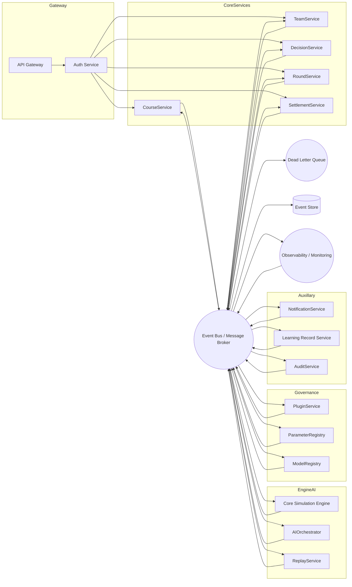
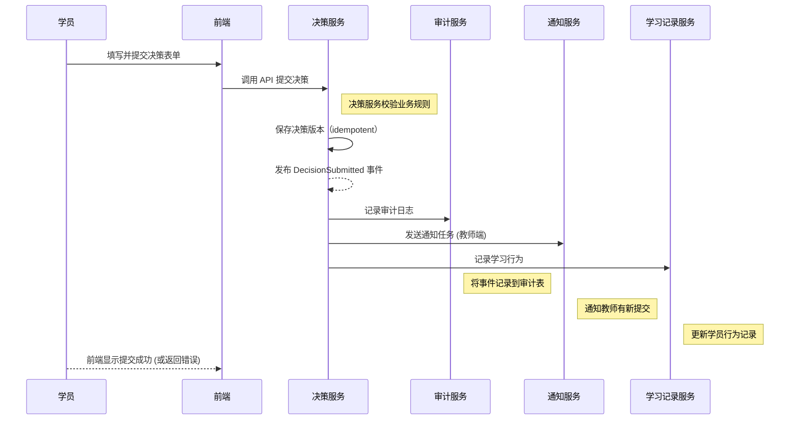
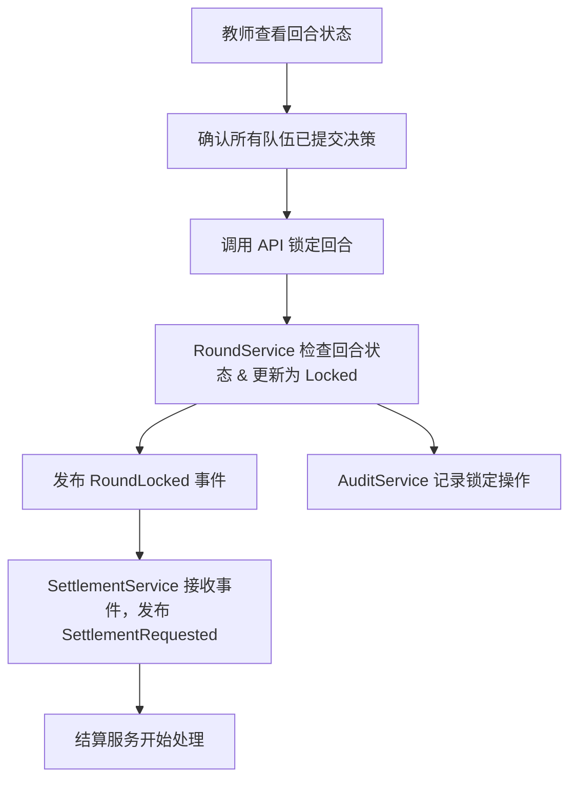
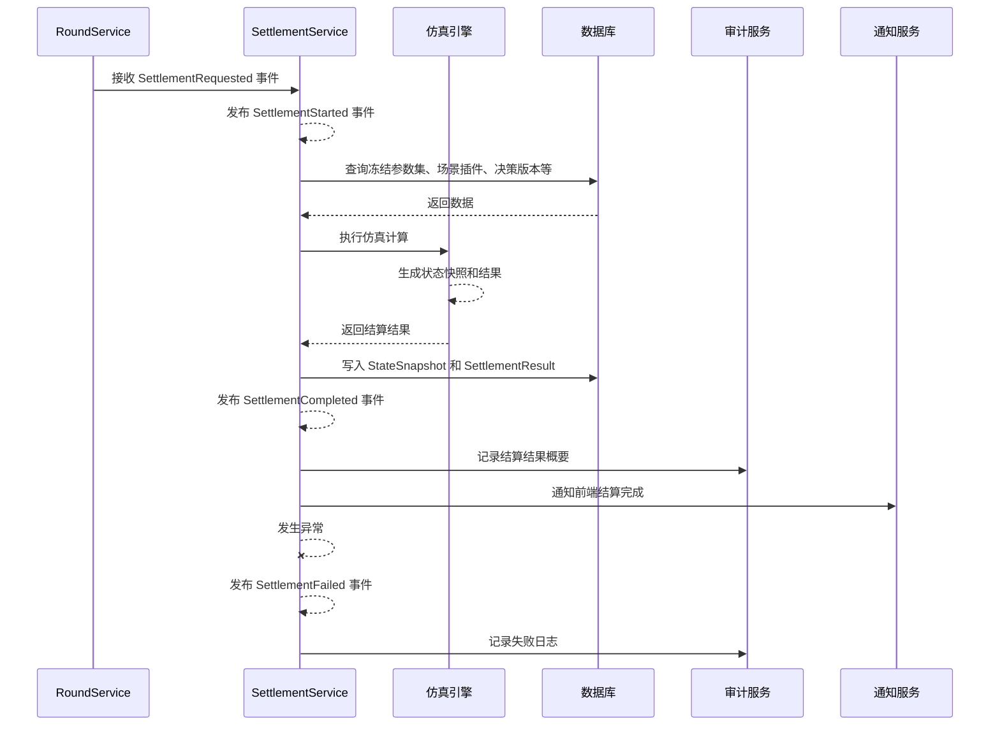

# 文档信息

| 项目 | 内容 |
|---|---|
| 文档名称 | `docs/architecture/event-driven-architecture.md` |
| 项目名称 | SimWar |
| 文档版本 | v1.0 |
| 文档状态 | Draft |
| 最后更新 | 2026-05-14 |
| 适用范围 | 事件驱动架构 / 消息队列 / 异步任务 / 审计 / 监控 |
| 维护人 | 架构团队（请根据实际项目修改） |
| 相关文档 | docs/architecture/system-architecture.md / docs/contracts/api-contract.md / docs/architecture/bpmn-workflows.md / docs/quality/test-coverage.md / docs/devops/env-setup.md |

## 执行摘要

事件驱动架构（Event-Driven Architecture）通过异步事件流来解耦系统组件，提升系统的扩展性、可靠性和可观测性。在SimWar项目中，涉及教师开课、学员组队、多轮决策、回合结算、AI策略建议/复盘、Replay/Shadow Replay、行业插件和模型治理等复杂业务场景。采用事件驱动架构，可以将耗时任务（如回合结算、AI推理、结果通知、日志记录、学习记录等）异步化，避免阻塞用户同步接口，同时支持可追溯的审计和系统解耦。

- **同步 API 适用场景**：用户登录、课程创建、课程发布、学员提交决策（初步请求）、教师锁定回合、参数审批等需要即时反馈的操作。这些操作在完成后会触发相应的领域事件或后续流程。
- **异步事件适用场景**：决策提交后的校验与记录、回合结算开始与完成、AI建议与复盘生成、Replay/Shadow Replay 运算、学习报告与通知生成、审计日志记录等耗时或广播任务。异步事件可通过消息队列分发给多个订阅者执行。
- **系统解耦与扩展性**：事件驱动使各个业务模块松耦合，发布者和订阅者之间通过消息队列通讯，不需要直接引用对方接口。新增功能（如新的通知、监控订阅）可通过监听事件轻松接入，系统具有更好的扩展能力。
- **可观测性与可靠性**：所有关键事件都被记录在事件总线和事件存储中，并且包含全链路 `correlation_id`，方便审计与回放。消息队列的重试机制、死信队列和日志监控确保消息不丢失并及时报警。幂等设计保证重复消息安全忽略，保障可靠性。
- **支持回合结算、AI、Replay 等流程**：例如，在回合结束时，教师锁定回合触发 `SettlementRequested` 事件，结算服务接收并发布 `SettlementCompleted` 事件，核心仿真引擎处理结果并写入数据库。AI 小模型的建议生成通过事件通知前端，不直接修改正式结果，确保真值边界。Replay/Shadow Replay 过程生成事件报告并供后续治理审查。审计服务订阅关键事件（如决策提交、回合锁定、参数审批等），将高风险操作记录在审计日志中。
- **风险与控制策略**：事件驱动架构也带来复杂性与风险，例如事件过多导致难以追踪、消息乱序、消费者重复处理、依赖链路故障等。应对策略包括：统一的事件命名和版本管理、严格的幂等性设计和去重机制、顺序和超时控制、重试与死信队列机制、全面的监控告警（事件延迟率、消费失败率、死信数量）以及完善的补偿流程，确保在出现故障时可以恢复或补救。

## 事件驱动架构总览

下图展示了SimWar项目的整体事件驱动架构。系统各微服务通过 API Gateway 接收请求并发起事件，所有异步事件通过统一的事件总线（如 Kafka 或 RabbitMQ）进行发布和订阅。核心组件包括认证服务、课程服务、队伍服务、决策服务、回合服务、结算服务、核心仿真引擎、AI 编排服务、Replay 服务、插件服务、参数注册表、模型注册表、通知服务、学习记录服务、审计服务等。事件总线连接这些服务，同时设置死信队列处理异常消息，并将事件持久化到事件存储（Event Store）以供审计和回放。监控与观测组件（如 Prometheus/Grafana）监控事件流和系统健康状况。



## 同步调用与异步事件边界

| 业务场景           | 同步 API                       | 异步事件                   | 设计理由 |
|------------------|-----------------------------|--------------------------|-------|
| 用户登录           | `POST /api/auth/login`        | UserLoggedIn             | 登录需实时响应，登录成功后记录审计日志。 |
| 创建课程           | `POST /api/courses`           | CourseCreated            | 创建课程同步返回结果，同时发布 CourseCreated 事件供通知和审计记录。 |
| 发布课程           | `POST /api/courses/{id}/publish` | CoursePublished         | 发布操作同步执行修改状态，并发布 CoursePublished 事件通知学员。 |
| 学员提交决策         | `POST /api/decisions`         | DecisionSubmitted        | 提交决策通过同步接口处理基础校验，保存后发布 DecisionSubmitted 事件触发后续处理。 |
| 教师锁定回合         | `POST /api/rounds/{id}/lock`    | RoundLocked, SettlementRequested | 锁定回合同步检查并设置状态，发布 RoundLocked 事件触发结算请求。 |
| 触发结算           | —                            | SettlementRequested      | 由 RoundLocked 事件触发结算请求，无直接同步接口。 |
| 结算完成           | —                            | SettlementCompleted / SettlementFailed | 结算服务内部完成时发布事件，通知结果和失败。 |
| 发布结果           | `POST /api/rounds/{id}/publish-results` | ResultPublished          | 发布结果同步设置状态，并发布 ResultPublished 事件通知学员查看。 |
| AI 生成建议         | `POST /api/ai/strategy-advice`  | AIAdviceRequested, AIAdviceGenerated | 同步请求AI建议触发 AIAdviceRequested 事件，小模型生成后发布 AIAdviceGenerated。 |
| AI 生成复盘         | —                            | DebriefDraftGenerated    | AI 服务完成复盘后发布事件，提示生成复盘草稿。 |
| Replay            | `POST /api/replay/runs`       | ReplayRequested, ReplayCompleted | 同步接口发起 Replay 请求，内部发布 ReplayRequested，完成后发布 ReplayCompleted。 |
| Shadow Replay     | `POST /api/shadow-replay/parameter-sets` | ShadowReplayRequested, ShadowReplayCompleted | 同同步触发审核 Shadow Replay 请求，内部发布 ShadowReplayRequested，完成后发布 ShadowReplayCompleted。 |
| ParameterSet 审批   | `POST /api/parameter-sets/{id}/approve` | ParameterSetApproved    | 审批参数集同步执行审批逻辑，并发布 ParameterSetApproved 事件。 |
| PluginPackage 审批  | `POST /api/plugins/{id}/approve` | PluginPackageApproved    | 审批插件包同步执行，并发布 PluginPackageApproved 事件。 |
| ModelVersion 发布  | `POST /api/models/{id}/deploy`    | ModelVersionDeployed     | 部署模型版本同步触发，并发布 ModelVersionDeployed 事件。 |
| 学习报告生成         | —                            | LearningReportGenerated  | 系统后台生成学习报告后发布事件，前端订阅显示报告可用。 |
| 通知发送           | —                            | NotificationRequested, NotificationSent | 需要发送通知时发布 NotificationRequested/NotificationSent 事件，无同步 API。 |
| 审计记录           | —                            | AuditLogCreated          | 所有高风险操作发布事件由审计服务写入审计日志，无同步接口。 |

## 事件命名规范

- 事件名称应使用过去式描述已经发生的事实，如 `DecisionSubmitted`（决策已提交）、`RoundLocked`（回合已锁定）。
- 使用领域前缀明确上下文，例如 `CoursePublished`（课程已发布）、`SettlementCompleted`（结算已完成）。
- 名称格式可使用 PascalCase 或 snake_case，但须保持一致，推荐使用 PascalCase 以便跨语言识别。
- 事件名称应当稳定、清晰、可追踪，不使用模糊动作词。例如避免 `UpdateEvent`、`DoTask` 等通用术语。
- 不同版本的事件应在名称或 `event_version` 字段中体现版本号，避免含混。必要时可对事件命名加后缀 `V2` 等。
- 示例事件名称：
  - `CourseCreated`
  - `CoursePublished`
  - `RoundOpened`
  - `RoundLocked`
  - `DecisionSubmitted`
  - `SettlementStarted`
  - `SettlementCompleted`
  - `SettlementFailed`
  - `ResultPublished`
  - `AIAdviceGenerated`
  - `ReplayCompleted`
  - `ShadowReplayCompleted`
  - `ParameterSetApproved`
  - `PluginPackageDeployed`
  - `ModelVersionDeployed`
  - `LearningReportGenerated`
  - `AuditLogCreated`

## 事件分类体系

按业务领域分类，设计事件类别、说明和示例：

| 事件类别       | 说明                 | 示例                                                         |
|--------------|--------------------|------------------------------------------------------------|
| 用户与权限事件    | 用户登录、角色或权限变更      | UserLoggedIn, RoleAssigned                                    |
| 课程事件       | 课程创建、发布、归档等       | CourseCreated, CoursePublished, CourseArchived               |
| 队伍事件       | 队伍创建、成员变更         | TeamCreated, TeamMemberJoined, TeamMemberLeft               |
| 回合事件       | 回合打开、锁定、结算触发     | RoundOpened, RoundLocked, RoundSettling                     |
| 决策事件       | 决策草稿保存、提交、校验     | DecisionDraftSaved, DecisionSubmitted, DecisionValidated, DecisionRejected |
| 结算事件       | 结算开始、完成、失败       | SettlementRequested, SettlementStarted, SettlementCompleted, SettlementFailed |
| AI 事件       | AI 建议生成、复盘、日志    | AIAdviceRequested, AIAdviceGenerated, DebriefDraftGenerated, ModelCallLogged |
| Replay 事件    | 回放、影子回放流程         | ReplayRequested, ReplayStarted, ReplayCompleted, ReplayFailed, ShadowReplayRequested, ShadowReplayCompleted |
| 治理事件       | 参数集、插件、模型审批和部署  | ParameterSetCreated, ParameterSetApproved, PluginPackageApproved, PluginPackageDeployed, ModelVersionEvaluated, ModelVersionDeployed |
| 通知事件       | 系统通知、提醒           | NotificationRequested, NotificationSent, NotificationFailed |
| 审计事件       | 记录高风险或关键操作日志    | AuditLogCreated, PermissionDenied, SensitiveActionDetected |
| 学习记录事件     | 学习行为记录、报告生成      | LearningRecordCreated, LearningReportGenerated |

## 事件通用 Schema

所有事件遵循统一结构，包含元数据和载荷示例：

```json
{
  "event_id": "<EVENT_ID>",
  "event_type": "<EVENT_TYPE>",
  "event_version": "1.0",
  "tenant_id": "<TENANT_ID>",
  "course_id": "<COURSE_ID>",
  "run_id": "<RUN_ID>",
  "round_id": "<ROUND_ID>",
  "team_id": "<TEAM_ID>",
  "user_id": "<USER_ID>",
  "source_service": "<SOURCE_SERVICE>",
  "occurred_at": "<TIMESTAMP>",
  "correlation_id": "<CORRELATION_ID>",
  "causation_id": "<CAUSATION_ID>",
  "idempotency_key": "<IDEMPOTENCY_KEY>",
  "payload": {},
  "metadata": {
    "trace_id": "<TRACE_ID>",
    "schema_version": "1.0",
    "audit_required": true
  }
}
```

字段说明：

- **event_id**：事件唯一标识（UUID）；  
- **event_type**：事件名称，如 `DecisionSubmitted`；  
- **event_version**：事件版本号，格式如 `"1.0"`；  
- **tenant_id**：租户ID，支持多租户隔离；  
- **course_id/run_id/round_id/team_id/user_id**：相关业务上下文标识，可选填写对应业务实体ID；  
- **source_service**：发布事件的服务名称；  
- **occurred_at**：事件发生时间戳（UTC）；  
- **correlation_id**：关联ID，用于链路追踪（同一业务流程各事件使用同一关联ID）；  
- **causation_id**：上游事件或请求的 ID，用于事件因果跟踪；  
- **idempotency_key**：幂等键，用于去重，相同的上下文或操作使用相同幂等键；  
- **payload**：事件具体载荷，包含事件详细数据；  
- **metadata**：元数据，例如调用链追踪ID（trace_id）、事件数据模式版本（schema_version）、是否需要审计（audit_required）等。  

所有事件应记录在事件存储（Event Store），并根据 `correlation_id` 可重放和审计。

## 事件目录（Event Catalog）

以下表格列出了主要事件、所属领域、发布者、订阅者、触发条件、载荷摘要、是否审计以及优先级等信息。

| 事件名                    | 领域       | 发布方               | 订阅方                      | 触发条件                                        | Payload 摘要                | 审计 | 优先级   |
|------------------------|----------|------------------|--------------------------|---------------------------------------------|--------------------------|----|-------|
| **课程与回合事件**         |          |                  |                          |                                             |                          |    |       |
| CourseCreated         | 课程      | CourseService    | AuditService, NotificationService | 创建新课程时                              | 课程基本信息                | 是 | 高     |
| CoursePublished       | 课程      | CourseService    | NotificationService, AuditService | 课程状态改为“已发布”                        | 课程ID、发布人、时间           | 是 | 高     |
| CourseArchived        | 课程      | CourseService    | AuditService               | 课程归档时                                 | 课程ID、归档人、时间           | 是 | 中     |
| RunCreated            | 运行      | CourseService    | RoundService, AuditService | 创建演练实例/Run时                          | Run ID、课程ID               | 是 | 中     |
| RoundOpened          | 回合      | RoundService     | AuditService, NotificationService | 新回合开始，学生可提交决策                     | 回合ID、Run ID、时间          | 是 | 中     |
| RoundLocked           | 回合      | RoundService     | SettlementService, AuditService | 教师锁定回合禁止修改提交                    | 回合ID、Run ID、锁定人、时间      | 是 | 高     |
| RoundSettling         | 回合      | SettlementService | AuditService               | 回合进入结算处理中                          | 回合ID、Run ID、ParameterSet ID | 否 | 中     |
| RoundSettled          | 回合      | SettlementService | AuditService               | 回合结算完成                               | 回合ID、Run ID、结果快照等     | 是 | 高     |
| ResultPublished       | 回合      | RoundService     | NotificationService, AuditService | 教师发布结算结果                            | Run ID、回合ID、结果可见范围       | 是 | 高     |
| **队伍与决策事件**         |          |                  |                          |                                             |                          |    |       |
| TeamCreated          | 队伍      | TeamService      | AuditService               | 队伍创建成功                              | 队伍ID、成员列表               | 是 | 中     |
| TeamMemberJoined     | 队伍      | TeamService      | AuditService               | 学员加入队伍                              | 队伍ID、用户ID               | 是 | 中     |
| TeamMemberLeft       | 队伍      | TeamService      | AuditService               | 学员离开队伍                              | 队伍ID、用户ID               | 是 | 中     |
| DecisionDraftSaved   | 决策      | DecisionService   | AuditService               | 学员保存决策草稿                           | Draft ID、Round ID、内容摘要      | 否 | 低     |
| DecisionSubmitted    | 决策      | DecisionService   | AuditService, NotificationService, LearningService | 学员正式提交决策                          | Decision ID、Round ID、提交者、决策详情 | 是 | 高     |
| DecisionValidated    | 决策      | DecisionService   | AuditService               | 决策服务校验通过                          | Decision ID、校验结果            | 否 | 中     |
| DecisionRejected     | 决策      | DecisionService   | AuditService               | 决策校验失败或被拒绝                       | Decision ID、原因               | 是 | 中     |
| DecisionLocked       | 决策      | DecisionService   | AuditService               | 决策被锁定，无法修改                       | Decision ID、时间               | 否 | 中     |
| **结算事件**            |          |                  |                          |                                             |                          |    |       |
| SettlementRequested   | 结算      | RoundService     | SettlementService         | 收到 RoundLocked 事件后触发结算请求            | Run ID、Round ID、ParameterSet ID | 否 | 高     |
| SettlementStarted     | 结算      | SettlementService | AuditService               | 结算服务开始处理回合                         | Run ID、Round ID、开始时间        | 否 | 中     |
| SettlementCompleted   | 结算      | SettlementService | AuditService, NotificationService, LearningService | 结算计算完成                            | Run ID、Round ID、结果摘要        | 是 | 高     |
| SettlementFailed      | 结算      | SettlementService | AuditService, NotificationService | 结算计算失败                              | Run ID、Round ID、错误详情        | 是 | 高     |
| StateSnapshotCreated  | 结算      | SettlementService | EventStore                | 生成回合状态快照（执行过程中）                | Run ID、Round ID、状态快照ID     | 否 | 中     |
| SettlementResultCreated | 结算    | SettlementService | EventStore                | 生成结算结果数据（执行过程中）               | Run ID、Round ID、结果ID       | 否 | 中     |
| ScoreCalculated       | 结算      | SettlementService | AuditService               | 根据结算结果计算得分                         | Team ID、分数详情                | 否 | 中     |
| RankingUpdated        | 结算      | SettlementService | NotificationService       | 更新排行榜或排名                           | Run ID、排名列表               | 否 | 低     |
| **AI 事件**            |          |                  |                          |                                             |                          |    |       |
| AIAdviceRequested     | AI       | AIOrchestrator    | AIOrchestrator            | 用户请求AI策略建议                          | Request ID、Round ID、Context  | 否 | 中     |
| AIAdviceGenerated     | AI       | AIOrchestrator    | NotificationService, AuditService, ModelRegistry | AI服务生成建议结果                        | Request ID、建议结果             | 是 | 中     |
| AIAdviceFailed        | AI       | AIOrchestrator    | NotificationService, AuditService | AI生成失败                                | Request ID、错误详情             | 是 | 中     |
| DebriefDraftRequested | AI       | AIOrchestrator    | AIOrchestrator            | 请求生成复盘草稿                           | Request ID、Round ID           | 否 | 低     |
| DebriefDraftGenerated | AI       | AIOrchestrator    | NotificationService, AuditService | AI服务生成复盘草稿                        | Request ID、复盘内容             | 是 | 中     |
| LearningRecommendationGenerated | AI | AIOrchestrator    | NotificationService, AuditService | AI生成学习推荐                        | Recommendation ID、内容       | 是 | 低     |
| ModelCallLogged       | AI       | AIOrchestrator    | EventStore                | AI调用日志记录                            | Model ID、输入输出等             | 否 | 低     |
| **Replay / Shadow Replay 事件** |          |                  |                          |                                             |                          |    |       |
| ReplayRequested       | Replay   | ReplayService     | ReplayService             | 用户发起 Replay 请求                        | Run ID、Round ID               | 否 | 中     |
| ReplayStarted         | Replay   | ReplayService     | AuditService               | Replay 开始执行                           | Run ID、Round ID、开始时间        | 否 | 中     |
| ReplayCompleted       | Replay   | ReplayService     | NotificationService, AuditService | Replay 执行完成                           | Run ID、Round ID、报告ID        | 是 | 中     |
| ReplayFailed          | Replay   | ReplayService     | NotificationService, AuditService | Replay 执行失败                           | Run ID、Round ID、错误详情        | 是 | 中     |
| ShadowReplayRequested | Replay   | ReplayService     | ReplayService             | 发起 Shadow Replay 请求                    | ParameterSet ID、Run ID, 等      | 否 | 中     |
| ShadowReplayStarted   | Replay   | ReplayService     | AuditService               | Shadow Replay 开始执行                    | ParameterSet ID、开始时间        | 否 | 中     |
| ShadowReplayCompleted | Replay   | ReplayService     | GovernanceService         | Shadow Replay 执行完成                    | ParameterSet ID、报告ID         | 是 | 中     |
| ShadowReplayFailed    | Replay   | ReplayService     | GovernanceService, AuditService | Shadow Replay 执行失败                  | ParameterSet ID、错误详情        | 是 | 中     |
| **参数 / 插件 / 模型治理事件** |          |                  |                          |                                             |                          |    |       |
| ParameterSetCreated   | 治理      | ParameterService | AuditService               | 新参数集创建                              | ParameterSet ID、创建者          | 是 | 高     |
| ParameterSetValidated | 治理      | ParameterService | AuditService               | 参数集通过自动校验                        | ParameterSet ID、验证结果        | 是 | 中     |
| ParameterSetShadowPassed | 治理   | ParameterService | AuditService               | 参数集通过 ShadowReplay 校验             | ParameterSet ID、对比结果       | 是 | 中     |
| ParameterSetApproved  | 治理      | ParameterService | RoundService, AuditService | 参数集被审批通过                          | ParameterSet ID、审批人          | 是 | 高     |
| ParameterSetDeprecated | 治理     | ParameterService | AuditService               | 参数集下线或弃用                          | ParameterSet ID、弃用理由        | 是 | 低     |
| PluginPackageCreated  | 治理      | PluginService    | AuditService               | 新插件包创建                              | Plugin ID、元信息               | 是 | 中     |
| PluginPackageValidated | 治理     | PluginService    | AuditService               | 插件包通过自动校验                        | Plugin ID、验证结果             | 是 | 中     |
| PluginPackageApproved | 治理      | PluginService    | AuditService               | 插件包审批通过                            | Plugin ID、审批人               | 是 | 高     |
| PluginPackageDeployed | 治理      | PluginService    | RoundService, AuditService | 插件包正式部署生效                        | Plugin ID、部署版本             | 是 | 高     |
| ModelVersionEvaluated | 治理      | ModelService     | AuditService               | 模型版本通过评估（如在线对抗测试）           | ModelVersion ID、测试结果       | 是 | 中     |
| ModelVersionApproved  | 治理      | ModelService     | AuditService               | 模型版本审批通过                          | ModelVersion ID、审批人         | 是 | 高     |
| ModelVersionDeployed  | 治理      | ModelService     | AIOrchestrator, AuditService | 模型版本部署生效                          | ModelVersion ID、部署信息       | 是 | 高     |
| ModelVersionRolledBack | 治理     | ModelService     | AIOrchestrator, AuditService | 模型版本回滚至旧版本                       | ModelVersion ID、回滚信息       | 是 | 高     |
| **学习与通知事件**        |          |                  |                          |                                             |                          |    |       |
| LearningRecordCreated | 学习      | LearningService   | EventStore                | 学习行为（决策提交、AI互动等）记录         | Record ID、用户ID、行为详情       | 是 | 中     |
| LearningReportGenerated | 学习   | LearningService   | NotificationService, AuditService | 学习报告生成完成                        | Run ID、报告ID                 | 是 | 中     |
| NotificationRequested | 通知      | 任意服务（发布者） | NotificationService       | 需要发送通知时发布                        | 通知类型、目标用户ID             | 否 | 高     |
| NotificationSent      | 通知      | NotificationService | EventStore                | 通知成功发送                             | 通知ID、目标、内容摘要           | 否 | 低     |
| NotificationFailed    | 通知      | NotificationService | AuditService               | 通知发送失败                             | 通知ID、错误详情               | 是 | 中     |
| **审计事件**            |          |                  |                          |                                             |                          |    |       |
| AuditLogCreated       | 审计      | AuditService     | —                        | 任何高风险操作或事件被记录时              | 事件ID、用户、操作详情、时间       | 是 | 高     |
| SensitiveActionDetected | 审计    | AuditService     | —                        | 发现敏感操作（如越权操作）              | 用户ID、操作内容、时间          | 是 | 高     |
| PermissionDenied      | 审计      | AuthService     | —                        | 用户权限校验失败时                      | 用户ID、尝试操作、时间          | 是 | 中     |

## 核心事件详细定义

以下对关键事件进行详细说明，包含事件说明、类型、发布/订阅服务、触发条件、负载结构、幂等性、顺序要求、是否审计、失败处理和测试重点。

### DecisionSubmitted

**事件说明**：学员正式提交决策时发布的领域事件。  
**事件类型**：Domain Event（领域事件）。  
**发布服务**：DecisionService。  
**订阅服务**：AuditService、NotificationService、LearningService。  
**触发条件**：学员在决策提交页面点击“提交”，DecisionService 校验通过并持久化决策版本后。  
**Payload Schema**：含 `decision_id`、`round_id`、`team_id`、`user_id`、`submitted_at`、`decision_data` 等字段。  
**幂等键**：`tenant_id + round_id + team_id + decision_version`。  
**顺序要求**：在同一个回合内，同一队伍的多次提交仅保留最新版本，重复事件忽略。  
**是否审计**：是（记录用户提交行为详情）。  
**失败处理**：若事件发布失败或投递异常，应重试并记录失败日志；订阅服务在消费时若出错，消息进入死信队列并报警。  
**测试重点**：重复提交测试（使用相同决策版本ID多次发布后仅创建一次记录），事务一致性测试（数据库写入与事件发布保持一致），错误回退（服务异常时是否回滚）。  

### RoundLocked

**事件说明**：教师锁定回合时发布事件，表示该回合停止接收决策并进入结算阶段。  
**事件类型**：Domain Event。  
**发布服务**：RoundService。  
**订阅服务**：SettlementService、AuditService、NotificationService。  
**触发条件**：教师通过接口锁定回合成功，RoundService 更新回合状态。  
**Payload Schema**：含 `round_id`、`run_id`、`locked_by`、`locked_at` 等。  
**幂等键**：`round_id + action`（如 `round_{id}_locked`）。  
**顺序要求**：必须在所有决策事件（DecisionSubmitted）之后发布；同一回合只能发布一次。重复锁定请求应返回当前锁定状态。  
**是否审计**：是（记录锁定操作和操作者）。  
**失败处理**：若发布事件失败，可记录告警并标记回合为 Locked 失败；消费者（结算服务）应保证事件到达后才开始结算。  
**测试重点**：重复锁定测试、事务一致性（状态更新与事件发布需原子）、锁定后是否阻止新提交。  

### SettlementRequested

**事件说明**：请求回合结算的事件，由 RoundLocked 触发。  
**事件类型**：Integration Event。  
**发布服务**：RoundService。  
**订阅服务**：SettlementService。  
**触发条件**：RoundLocked 事件发布后自动触发或由 RoundService 发布。  
**Payload Schema**：含 `run_id`、`round_id`、`parameter_set_id`、`triggered_by`（用户或系统）。  
**幂等键**：`round_id + parameter_set_id`。  
**顺序要求**：必须在 RoundLocked 之后；重复事件应被幂等处理，不重复启动结算。  
**是否审计**：否（审计关注 RoundLocked 与 SettlementCompleted）。  
**失败处理**：若未被消费或处理失败，应重试或人工介入；若 SettlementService 未收到事件，则需要人工补发。  
**测试重点**：幂等性测试、确保只有一次触发结算、消息可靠传递验证。  

### SettlementStarted

**事件说明**：结算服务开始处理回合的事件。  
**事件类型**：Domain Event / System Event。  
**发布服务**：SettlementService。  
**订阅服务**：AuditService。  
**触发条件**：结算服务从队列获取到 SettlementRequested 并开始执行结算逻辑。  
**Payload Schema**：含 `run_id`、`round_id`、`started_at`、`parameter_set_id`。  
**幂等键**：`round_id`（仅表示已启动一次）。  
**顺序要求**：紧接 SettlementRequested 之后。  
**是否审计**：否（监控事件，可记录在日志）。  
**失败处理**：主要用于监控流程进度；若服务挂掉，可重启后重新拉取消息继续。  
**测试重点**：服务重启或失败后恢复测试、确认事件出现时业务进入“结算中”状态。  

### SettlementCompleted

**事件说明**：回合结算完成且结果成功生成的事件，含最终结果摘要。  
**事件类型**：Domain Event。  
**发布服务**：SettlementService。  
**订阅服务**：RoundService (更新回合状态)、AuditService、NotificationService、LearningService、EventStore。  
**触发条件**：结算逻辑成功完成并将结果写入数据库后。  
**Payload Schema**：含 `run_id`、`round_id`、`results`、`scoreboard`、`completed_at` 等。  
**幂等键**：`round_id`（同一回合只发布一次完成事件）。  
**顺序要求**：必须在 SettlementStarted 之后，且仅在结算结果成功记录后发布。  
**是否审计**：是（记录结算结果摘要和核心指标）。  
**失败处理**：应确保写入结果和事件发布的事务原子性；若发布失败可重试；若消费者重复消费应避免重复写入结果（使用幂等键）。  
**测试重点**：幂等性测试（模拟重复消费，确保不重复写入），事务一致性测试。  

### SettlementFailed

**事件说明**：回合结算失败的事件，包含错误原因。  
**事件类型**：Domain Event。  
**发布服务**：SettlementService。  
**订阅服务**：RoundService、AuditService、NotificationService。  
**触发条件**：结算逻辑出现异常或超时未完成时。  
**Payload Schema**：含 `run_id`、`round_id`、`error_code`、`error_message`、`failed_at`。  
**幂等键**：`round_id`。  
**顺序要求**：可在 SettlementStarted 之后任何阶段发布，表示该回合未产生正式结果。  
**是否审计**：是（记录故障详情）。  
**失败处理**：若发生故障，回合保持为失败状态，可触发重试或人工介入；发布事件后应触发告警并进入补偿/重试流程。  
**测试重点**：故障注入测试（模拟结算服务崩溃）、重试与补偿机制测试。  

### ResultPublished

**事件说明**：教师将结算结果对学员可见后发布事件。  
**事件类型**：Domain Event。  
**发布服务**：RoundService。  
**订阅服务**：NotificationService、LearningService、AuditService。  
**触发条件**：教师通过接口确认发布结果，RoundService 更新回合状态为“结果已发布”。  
**Payload Schema**：含 `run_id`、`round_id`、`published_by`、`published_at`。  
**幂等键**：`round_id + action`（确保一次发布）。  
**顺序要求**：必须在 SettlementCompleted 后发布。  
**是否审计**：是（记录发布操作和操作者）。  
**失败处理**：确保回合状态更新和事件发布的事务一致性，发布失败时回滚发布操作。  
**测试重点**：发布流程测试（状态更新与事件发布同步）、重复发布请求的幂等测试。  

### AIAdviceGenerated

**事件说明**：AI 系统生成策略建议结果后发布的事件。  
**事件类型**：Domain Event。  
**发布服务**：AIOrchestrator。  
**订阅服务**：NotificationService、AuditService、EventStore。  
**触发条件**：AIOrchestrator 调用小模型完成策略建议生成后。  
**Payload Schema**：含 `request_id`、`round_id`、`team_id`、`suggestions`、`generated_at`。  
**幂等键**：`request_id`。  
**顺序要求**：无严格顺序要求（每次请求独立）。  
**是否审计**：是（记录AI响应内容概要）。  
**失败处理**：发布失败时重试；消费失败记录报警。  
**测试重点**：AI 权限校验测试（模拟不允许状态）、内容可用性测试、调用日志记录验证。  

### DebriefDraftGenerated

**事件说明**：AI 系统生成回合复盘草稿后发布的事件。  
**事件类型**：Domain Event。  
**发布服务**：AIOrchestrator。  
**订阅服务**：NotificationService、AuditService。  
**触发条件**：AI完成复盘文本或报告生成后。  
**Payload Schema**：含 `request_id`、`round_id`、`debrief_content`、`generated_at`。  
**幂等键**：`request_id`。  
**顺序要求**：独立事件，无顺序依赖。  
**是否审计**：是（记录复盘内容概要）。  
**失败处理**：重试机制、出错记录。  
**测试重点**：内容正确性测试、并发请求的幂等测试。  

### ReplayCompleted

**事件说明**：Replay 重演完成后发布的事件，包含复盘报告。  
**事件类型**：Domain Event。  
**发布服务**：ReplayService。  
**订阅服务**：NotificationService、AuditService、EventStore。  
**触发条件**：ReplayService 完成重新模拟计算并生成报告后。  
**Payload Schema**：含 `replay_run_id`、`run_id`、`round_id`、`report_id`、`completed_at`。  
**幂等键**：`replay_run_id`。  
**顺序要求**：独立流程，无上游顺序依赖。  
**是否审计**：是（记录Replay执行情况）。  
**失败处理**：失败后发布 ReplayFailed 事件，事件重试或人工检查。  
**测试重点**：重复提交同一 Replay 请求不生成多份报告、报告内容验证。  

### ShadowReplayCompleted

**事件说明**：Shadow Replay 完成后发布的事件，包含对比分析报告。  
**事件类型**：Domain Event。  
**发布服务**：ReplayService。  
**订阅服务**：GovernanceService、AuditService、EventStore。  
**触发条件**：执行 Shadow 模式结算后并生成比较报告。  
**Payload Schema**：含 `shadow_run_id`、`parameter_set_id`、`baseline_run_id`、`baseline_round_id`、`report_id`、`completed_at`、`difference_metrics`。  
**幂等键**：`shadow_run_id`。  
**顺序要求**：独立流程。  
**是否审计**：是（记录对比结果）。  
**失败处理**：失败后发布 ShadowReplayFailed，进入重试或人工复核流程。  
**测试重点**：报告准确性测试、差异阈值触发测试（当差异超过阈值是否触发后续审批）。  

### ParameterSetApproved

**事件说明**：参数集审批通过后发布的事件。  
**事件类型**：Domain Event。  
**发布服务**：ParameterService。  
**订阅服务**：RoundService、AuditService、NotificationService。  
**触发条件**：管理员通过审批接口批准参数集后。  
**Payload Schema**：含 `parameter_set_id`、`approved_by`、`approved_at`。  
**幂等键**：`parameter_set_id + version`。  
**顺序要求**：必须在 ParameterSetValidated 和 ShadowReplayPassed 后。  
**是否审计**：是（记录审批信息）。  
**失败处理**：审批服务发布失败可重试；应用服务根据此事件更新可用参数集。  
**测试重点**：审批流程测试（未经批准的参数集不可使用）、幂等测试。  

### PluginPackageDeployed

**事件说明**：插件包部署生效后发布的事件。  
**事件类型**：Domain Event。  
**发布服务**：PluginService。  
**订阅服务**：RoundService、AuditService、NotificationService。  
**触发条件**：管理员部署插件包后，系统加载新的业务逻辑插件。  
**Payload Schema**：含 `plugin_id`、`version`、`deployed_by`、`deployed_at`。  
**幂等键**：`plugin_id + version`。  
**顺序要求**：必须在 PluginPackageApproved 之后。  
**是否审计**：是（记录部署信息）。  
**失败处理**：部署异常后发布失败日志，通知开发维护人员。  
**测试重点**：插件切换测试（确保新版本立即生效且旧数据兼容）、幂等发布测试。  

### ModelVersionDeployed

**事件说明**：模型版本部署后发布的事件，标志新的AI模型上线。  
**事件类型**：Domain Event。  
**发布服务**：ModelService。  
**订阅服务**：AIOrchestrator、AuditService。  
**触发条件**：模型版本审批通过后被部署上线。  
**Payload Schema**：含 `model_id`、`version`、`deployed_by`、`deployed_at`。  
**幂等键**：`model_id + version`。  
**顺序要求**：必须在 ModelVersionApproved 后。  
**是否审计**：是（记录模型版本变更）。  
**失败处理**：部署失败时记录错误并回滚到旧版本，通知负责人员。  
**测试重点**：新模型回溯测试（确保可切换回旧版本）、版本兼容测试、幂等性测试。  

### LearningReportGenerated

**事件说明**：系统生成学习报告后发布的事件。  
**事件类型**：Domain Event。  
**发布服务**：LearningService。  
**订阅服务**：NotificationService、AuditService。  
**触发条件**：后台学习报告生成任务完成后。  
**Payload Schema**：含 `report_id`、`run_id`、`generated_at`、报告摘要等。  
**幂等键**：`report_id`。  
**顺序要求**：在相关学习行为事件（如决策提交）之后生成。  
**是否审计**：是（记录报告生成信息）。  
**失败处理**：失败后重试生成，失败日志记录。  
**测试重点**：报告内容正确性测试、重复生成幂等测试。  

### AuditLogCreated

**事件说明**：审计服务为记录高风险操作生成审计日志时发布的事件。  
**事件类型**：Audit Event。  
**发布服务**：AuditService。  
**订阅服务**：—（写入审计存储，不供业务处理）。  
**触发条件**：任意关键操作（如权限变更、发布结果等）发生后，审计模块写入日志时触发。  
**Payload Schema**：含 `event_type`、`user_id`、`timestamp`、`details` 等。  
**幂等键**：`event_id`（唯一）。  
**顺序要求**：按产生顺序记录。  
**是否审计**：是（本身即为审计记录）。  
**失败处理**：审计日志写入失败应阻断业务操作并报警，确保关键日志不能丢失。  
**测试重点**：审计日志完整性测试、并发操作审计测试、持久化稳定性。  

## 事件流设计：学员提交决策

下面使用 Mermaid 序列图描述学员提交决策的完整事件流过程：



**关键点说明**：

- 决策提交接口需幂等处理：如果同一学员对同一轮、多次提交相同内容，应忽略重复或返回已存在版本，避免重复生成正式记录。幂等键可使用 `tenant_id + round_id + team_id + decision_version`。
- 在回合被锁定后，应拒绝再接收新的提交请求（在 DecisionService 校验时判断当前轮次状态）。
- 一旦保存决策版本成功，系统即发布 `DecisionSubmitted` 事件。各订阅服务（如审计、通知、学习记录）接收事件后并发处理，记录日志或触发通知。
- 整个流程中出现异常需有明确错误返回：例如校验失败返回具体原因，系统异常需返回通用错误并记录。事件发布成功与否应与数据库写入保持事务一致。
- 流程中的通信通过事件总线异步完成，前端仅等待提交确认。后续的通知、记录在后台完成，提高响应速度。

## 事件流设计：教师锁定回合

教师锁定回合触发结算流程，可用以下 Mermaid 流程图描述：



**流程说明**：

1. 教师在前端检查所有队伍的提交状态。
2. 通过后端接口 `POST /rounds/{id}/lock` 请求锁定回合。  
3. `RoundService` 校验当前回合状态可锁定后，将回合状态更新为 “Locked”，并防止新的决策提交。  
4. `RoundService` 发布 `RoundLocked` 事件。  
5. 审计服务记录锁定操作（事件 AuditLogCreated）。  
6. 结算服务（SettlementService）订阅到 `RoundLocked` 事件后，发布 `SettlementRequested` 事件触发回合结算。  
7. 结算服务随后执行结算流程，发布 `SettlementStarted`、`SettlementCompleted`/`SettlementFailed` 事件。  

**注意**：回合锁定操作需幂等，重复调用返回已锁定状态而不会再次触发事件。若锁定失败（如网络抖动未更新数据库），应向用户返回错误，确保业务一致性。

## 事件流设计：回合结算

回合结算是系统核心流程，以下序列图展示了关键步骤：



**关键点说明**：

- **幂等性**：回合结算必须幂等。`SettlementRequested`、`SettlementStarted`、`SettlementCompleted` 等事件都包含 `round_id` 和 `parameter_set_id` 等标识。即使消息重复消费，也不得重复写入结算结果表。使用事务或去重表保证原子性。  
- **真值边界**：`SettlementCompleted` 事件只能由结算服务（或核心引擎）发布。AI 小模型或其他服务不得发布或篡改此事件。  
- **重试与补偿**：若结算过程失败（网络故障、引擎异常等），发布 `SettlementFailed` 事件并进入重试/补偿流程。系统可根据需要自动重试，或发出告警由人工干预。失败的回合状态可标记为 “结算失败” 待处理。  
- **事件存储与审计**：`StateSnapshotCreated` 和 `SettlementResultCreated` 等事件可写入事件存储，用于回放或后续分析。所有关键步骤（开始、完成、失败）都应在审计日志记录，方便事后追踪。  
- **顺序保证**：必须保证 `SettlementStarted` 在 `SettlementRequested` 后触发，且在 `SettlementCompleted` 之后才有通知或结果可视化，否则可能造成状态不同步。

## 事件流设计：结果发布与反馈

1. **教师操作**：教师在后台查看本轮结算结果，无误后执行发布操作（`ResultPublished`）。  
2. **事件发布**：`RoundService` 接收到发布请求后，将回合状态更新为“结果已发布”，并发布 `ResultPublished` 事件。  
3. **前端可见**：学员前端订阅该事件或轮询，结果变为可见，学员可查看成绩和反馈。  
4. **三段式反馈**：系统生成决策效果评估（第一段）、得分与排名（第二段）、AI 复盘建议（第三段）。可通过生成学习报告事件 `LearningReportGenerated` 触发后台报告生成，提供详细反馈。  
5. **学习记录与通知**：学习记录服务创建 `LearningRecordCreated` 记录（包含成绩、改进建议等），通知服务发送 `NotificationSent` 通知学员结果发布（应用内或邮件）。  
6. **延续流程**：如果设置自动请求复盘，则触发 `DebriefDraftRequested` 事件，由AI服务生成文字复盘后发布 `DebriefDraftGenerated`。

**注意**：`ResultPublished` 事件发布后，确保前端以实时方式（WebSocket/长轮询/通知中心）提示学员查看结果，提高用户体验。

## 事件流设计：AI 策略建议

1. **请求阶段**：前端或BFF通过 `POST /api/ai/strategy-advice` 同步请求获取AI建议，发送 `AIAdviceRequested` 事件。  
2. **权限验证**：`AIOrchestrator` 接收请求后验证学员/教师权限，不允许学员获取未授权的真实状态信息。  
3. **数据准备**：读取当前状态估计（`state_est`），可能不直接使用真实环境（`state_true`）以保护真值。调用小模型接口（本地或云端）。  
4. **生成建议**：AI模型产生 `CoachOutput`（建议），`AIOrchestrator` 将结果封装，并发布 `AIAdviceGenerated` 事件（`payload` 包含建议内容）。同时记录调用日志 `ModelCallLogged`。  
5. **审计与返回**：审计服务记录此事件；前端收到异步通知后，显示建议给用户。  
6. **规则约束**：AI 生成的事件只能包含建议类数据（决策指导、学习推荐等），不能修改正式结果。AI产出的所有文本需标注“仅供参考”。  

**关键点**：AI 调用全程需要记录 `request_id` 实现幂等与追踪，确保同一请求不会重复调用。任何异常（如 API 超时）触发 `AIAdviceFailed` 事件，并可重试或提示用户出错。

## 事件流设计：Replay / Shadow Replay

### Replay

1. **发起请求**：通过 `POST /api/replay/runs` 请求 replay，后端 `ReplayService` 发布 `ReplayRequested` 事件。  
2. **执行阶段**：`ReplayService` 接收并发布 `ReplayStarted`，载入历史绑定对象（Run、Round、Decision 等）。  
3. **复算计算**：调用核心仿真引擎对历史流程进行复算，生成 `ReplayReport`。  
4. **完成发布**：复算成功后发布 `ReplayCompleted`，事件 payload 包含报告ID。若失败则发布 `ReplayFailed`。  
5. **后续处理**：通知服务触发报告可用提醒；学习记录服务可能记录用户触发行为；`AuditService` 记录操作。  
6. **不影响正式结果**：Replay 在隔离环境执行，不修改主库结果，只生成辅助报告。  

### Shadow Replay

1. **发起请求**：类似 Replay，通过 `POST /api/shadow-replay/parameter-sets` 触发。发布 `ShadowReplayRequested` 事件。  
2. **执行阶段**：`ReplayService` 接收并发布 `ShadowReplayStarted`。读取 baseline 运行结果和 candidate 参数。  
3. **并行结算**：对 baseline 和 candidate 两套参数分别执行计算，不更新正式数据。  
4. **对比分析**：生成 `ShadowReplayReport`，包含差异度量。发布 `ShadowReplayCompleted` 事件，并携带关键差异指标。  
5. **触发治理**：若差异超过阈值，`ShadowReplayCompleted` 可触发 `GovernanceReviewRequested` 等后续事件，由治理团队审查。  
6. **隔离性**：Shadow Replay 运行在沙盒环境，不影响主业务流程和数据。  

**注意**：Replay 和 Shadow Replay 都应保证不会修改或覆盖正式结算结果。任何异常都应发布失败事件并保持历史状态不变。

## 事件流设计：参数 / 插件 / 模型治理

### ParameterSet 发布流程

1. **创建与校验**：发布者创建新参数集，产生 `ParameterSetCreated` 事件；系统自动校验基础逻辑，通过后发布 `ParameterSetValidated`。  
2. **Shadow 校验**：通过 Shadow Replay 测试，若候选参数组通过测试后发布 `ParameterSetShadowPassed`。  
3. **审批通过**：管理员审批后发布 `ParameterSetApproved` 事件；系统开始使用此参数集创建新的 Run 或应用到下一回合。  
4. **弃用发布**：若需要弃用旧参数集，发布 `ParameterSetDeprecated` 事件。  

### PluginPackage 发布流程

1. **创建与校验**：上传并创建插件包，发布 `PluginPackageCreated`；系统执行静态/沙箱校验，成功后发布 `PluginPackageValidated`。  
2. **审批与部署**：插件包通过审批后发布 `PluginPackageApproved` 事件；管理员触发部署发布 `PluginPackageDeployed`，系统生效新逻辑。  
3. **回滚**：如有问题，可发布 `PluginPackageRolledBack` 事件回退到旧版本。  

### ModelVersion 发布流程

1. **评估测试**：提交新模型版本，系统或人员执行对抗测试，完成后发布 `ModelVersionEvaluated`（记录评估结果）。  
2. **Shadow Arena**：通过 AI 影子竞技场（Shadow Arena）产生报告，发布 `ShadowArenaCompleted`（如果适用）。  
3. **审批与发布**：审批通过后发布 `ModelVersionApproved`；部署上线后发布 `ModelVersionDeployed`。  
4. **回滚**：遇到问题发布 `ModelVersionRolledBack`。  

以上所有治理事件均应记录详细审批日志，并通知相关系统更新配置。

## 事件存储 Event Store 设计

- **存储范围**：业务关键事件（如决策提交、回合锁定、结算完成、模型部署等）应写入事件存储；普通通知类事件可以不存储，只通过队列传递。  
- **Event Store vs AuditLog**：事件存储保留系统事件流，便于重放和数据分析；审计日志记录用户操作轨迹，不供重放。审计日志内容可来源于事件或同步操作。  
- **可重放**：事件存储中的事件应具备回放能力，用于重构系统状态或离线分析。  
- **保留策略**：根据业务合规要求保留事件。例如可保留最近 5 年的事件，或定期归档到数据仓库。  
- **分区策略**：按时间或租户分区事件存储，提高查询和清理效率。  
- **查询方式**：支持根据 `event_type`、`tenant_id`、`course_id`、`run_id`、`correlation_id` 等索引查询历史事件。  

| 事件类型                    | 是否进入 Event Store | 是否进入 AuditLog | 保留策略       | 说明                         |
|--------------------------|--------------------|---------------|------------|----------------------------|
| Domain 关键事件（决策、回合、结算） | 是                 | 是（高风险操作）   | 长期保留       | 用于审计和重放，如 DecisionSubmitted、RoundLocked、SettlementCompleted 等。 |
| AI、Replay 事件             | 是                 | 否            | 中期保留       | 建议存储 AI 建议和复盘报告；审计侧记录失败或重要信息。 |
| 通知事件                   | 否                 | 否            | 短期保留       | 只需队列传递，不持久化存储；失败记录审计。     |
| 审计事件                   | 否                 | 是            | 长期保留       | 审计日志（AuditLogCreated）独立存储，不在事件总线中。 |
| 治理事件                   | 是                 | 是            | 长期保留       | 参数集/插件/模型的变更记录，需同时入库和审计。 |

## 消息队列 / Event Bus 设计

建议采用企业级消息队列技术承载事件总线，支持高吞吐、持久化、分区、顺序性等特性。下表列举常用技术方案：

| 技术      | 适用场景                     | 优点                               | 缺点                                  | 推荐程度         |
|---------|--------------------------|----------------------------------|-------------------------------------|---------------|
| Kafka   | 高频率事件流、需要水平扩展           | 高吞吐量、持久化、分区排序保证、可回放   | 部署运维较复杂，对低延迟不如RabbitMQ       | ★★★★☆ （推荐） |
| RabbitMQ| 传统消息队列、可靠性要求高           | 支持多种模式（队列、发布/订阅）、可靠投递 | 在高吞吐场景下性能低于Kafka，多实例管理麻烦   | ★★★☆☆       |
| NATS    | 轻量级实时消息                  | 简单易用、低延迟                  | 无持久化（可选NATS JetStream扩展），缺少复杂路由功能 | ★★★☆☆       |
| Redis Streams | 轻量持久化、中小规模应用           | 简单易用、内存存储快速            | 消息持久化需要占内存、管理脚本             | ★★☆☆☆       |
| AWS SNS/SQS | 云服务（跨区域、多租户需求）      | 托管服务、易扩展、可靠            | 延迟高、不支持高级特性（Kafka类似）         | ★★★☆☆       |
| GCP Pub/Sub | 云环境（大流量、多租户）          | 托管、自动扩容、全球分布          | 依赖云平台、成本不灵活                   | ★★★☆☆       |
| Azure Service Bus | Azure 云服务               | 与 Azure 生态深度集成、企业特性      | 依赖 Azure，延迟略高                    | ★★★☆☆       |

**推荐方案**：对于 SimWar 类 SaaS 平台，Kafka 常被选作事件总线，因为支持海量事件处理、消费分组、数据持久化和回放功能。但如果团队熟悉 RabbitMQ 也可选用。若部署在云端，可考虑使用云厂商的 Pub/Sub 或 SNS/SQS 组合。请根据实际项目需求和团队经验选择。

## Topic / Queue 设计

根据事件领域划分 Topic 或队列，每个 Topic 分发相关事件并确保合适的顺序。以下表格列出建议的 Topic/队列设计：

| Topic / Queue        | 事件类型                                      | 发布方                        | 消费方                                       | 顺序要求          | 重试策略            |
|---------------------|------------------------------------------|---------------------------|--------------------------------------------|----------------|-----------------|
| `course.events`     | CourseCreated, CoursePublished, CourseArchived | CourseService             | NotificationService, AuditService           | 无特殊要求        | 失败重试（限次数）      |
| `team.events`       | TeamCreated, TeamMemberJoined, TeamMemberLeft | TeamService              | AuditService                               | 无特殊要求        | 失败重试           |
| `decision.events`   | DecisionDraftSaved, DecisionSubmitted, DecisionValidated, DecisionRejected | DecisionService          | AuditService, NotificationService, LearningService | 同一 team_id 内保持顺序 | 幂等消费            |
| `round.events`      | RoundOpened, RoundLocked, RoundSettling, RoundSettled | RoundService             | SettlementService, AuditService, NotificationService | 同一 run_id 内保证顺序 | 重试与死信队列        |
| `settlement.events` | SettlementRequested, SettlementStarted, SettlementCompleted, SettlementFailed, StateSnapshotCreated, SettlementResultCreated, ScoreCalculated, RankingUpdated | SettlementService         | RoundService, AuditService, NotificationService | 同一 round_id 保证顺序 | 重试与死信队列        |
| `ai.events`         | AIAdviceRequested, AIAdviceGenerated, AIAdviceFailed, DebriefDraftGenerated, LearningRecommendationGenerated, ModelCallLogged | AIOrchestrator           | NotificationService, AuditService, LearningService | 无严格顺序要求      | 重试失败告警          |
| `replay.events`     | ReplayRequested, ReplayStarted, ReplayCompleted, ReplayFailed, ShadowReplayRequested, ShadowReplayStarted, ShadowReplayCompleted, ShadowReplayFailed | ReplayService            | AuditService, GovernanceService, NotificationService | 同一 replay_run_id 保证顺序 | 重试与死信队列        |
| `governance.events` | ParameterSetCreated, ParameterSetValidated, ParameterSetShadowPassed, ParameterSetApproved, ParameterSetDeprecated, PluginPackageCreated, PluginPackageValidated, PluginPackageApproved, PluginPackageDeployed, ModelVersionEvaluated, ModelVersionApproved, ModelVersionDeployed, ModelVersionRolledBack | ParameterService, PluginService, ModelService | AuditService, RoundService, AIOrchestrator | 同一资源ID保持顺序    | 重试与死信队列        |
| `notification.events` | NotificationRequested, NotificationSent, NotificationFailed | 任意需要发送通知的服务        | NotificationService                        | 无顺序要求        | 定时重试、降级告警      |
| `audit.events`      | AuditLogCreated, SensitiveActionDetected, PermissionDenied | AuditService              | —                                          | 时间顺序记录      | 不重试，失败阻断操作     |
| `learning.events`   | LearningRecordCreated, LearningReportGenerated | LearningService           | NotificationService, AuditService           | 无顺序要求        | 重试与死信队列        |
| `dead-letter.events` | 所有错误消息                                | EventBus（自动路由）       | DevOps/管理员                            | —              | 人工干预            |

- 各 Topic 可根据负载和隔离需求再划分分区（如 `round.events` 可按租户或课程分区）。  
- 重试策略可在消费者端配置指数退避，并限制最大次数，超过则发送到 `dead-letter.events`，并触发告警。

## 消费者设计

下表列出了主要的事件消费者组件、订阅事件、主要职责、幂等策略和失败处理：

| Consumer                 | 订阅事件                                           | 主要职责                                       | 幂等策略                                  | 失败处理                           |
|--------------------------|--------------------------------------------------|--------------------------------------------|----------------------------------------|---------------------------------|
| **SettlementWorker**     | SettlementRequested, SettlementStarted, SettlementCompleted, SettlementFailed | 执行回合结算逻辑；生成快照和结果；发布完成/失败事件。   | 使用 `round_id + parameter_set` 作为幂等键，避免重复计算。   | 遇到错误记录日志，重试或发出告警；失败事件送 DLQ。 |
| **NotificationWorker**   | NotificationRequested, ResultPublished, AIAdviceGenerated, ReplayCompleted, **其他通知触发事件** | 发送各种通知（系统消息、邮件、App推送等）。         | 使用 `notification_id` 去重，每条通知只发送一次。      | 失败重试（带延迟）；超时/错误后记录日志并发告警。 |
| **AuditWorker**          | 审计相关事件（AuditLogCreated、PermissionDenied 等）         | 将事件记录到持久化审计存储；保证审计日志完整性。     | 每个 `event_id` 唯一，检测重复并忽略。               | 如果写入审计表失败则阻断操作并报警。    |
| **LearningRecordWorker** | DecisionSubmitted, SettlementCompleted, ResultPublished, LearningReportGenerated | 创建或更新学习记录；分析学习行为。               | 根据 `record_id` 或上下文唯一性去重。            | 失败重试，并记录异常行为；不会影响主流程。   |
| **AIOutputWorker**       | AIAdviceRequested, DebriefDraftRequested, AIAdviceGenerated, DebriefDraftGenerated | 调度 AI 模型计算；处理 AI 输出；调用日志记录。       | 根据 `request_id` 确保幂等调用同一模型请求不重复。   | 模型调用失败尝试重试，可降级为提示错误；记录故障。 |
| **ReplayWorker**         | ReplayRequested, ShadowReplayRequested              | 执行 Replay / Shadow Replay 任务；生成报告；触发后续审批。 | `replay_run_id` 或 `shadow_run_id` 唯一，避免重复执行。 | 失败记录并发告警；报告生成失败记入日志。 |
| **ShadowReplayWorker**   | 同上（集成于 ReplayWorker）                           | 同上（此处可合并为 ReplayWorker）                | 同上                                     | 同上                              |
| **GovernanceWorker**     | ParameterSetApproved, PluginPackageApproved, ModelVersionApproved | 在审批通过后执行具体部署操作（创建 Run、加载插件、切换模型）。 | 根据资源ID确保操作幂等。例如 `parameter_set_id`。    | 部署失败时回滚并告警；可能触发补偿事件。   |
| **ReportGenerationWorker** | SettlementCompleted, LearningReportGenerated, ShadowReplayCompleted | 生成学习报告、结算报告、Shadow对比报告。         | 使用报告ID保证幂等（不重复生成）。              | 失败重试生成；记录失败日志并提示人工介入。 |
| **其他消费者**           | 其他订阅事件                                        | 按需扩展，例如统计服务、监控服务等。             | 根据具体业务设计幂等。                           | 根据规则重试或丢弃。              |

每个消费者在处理消息时，都必须设计幂等策略和异常处理机制，确保重复消息不会导致不一致或副作用。

## 幂等性设计

**事件生产幂等**：对于每个操作接口，通过 `idempotency_key` 或业务逻辑（如 `round_id+action`）避免重复发出相同事件。例如，决策提交接口可使用 `decision_version` 保证重复调用仅记录一次提交。  
**事件消费幂等**：消费者需检查相同事件是否已处理过。可在数据库中建立去重表，记录已处理的 `event_id` 或幂等键。处理后不再次执行业务逻辑。例如 SettlementWorker 使用 `round_id` 键防止重复写入结果。  
**幂等键设计**：结合业务唯一性设计幂等键，如表格所示：

| 场景           | 幂等键                                       | 重复处理策略             |
|--------------|------------------------------------------|----------------------|
| 决策提交         | `tenant_id + round_id + team_id + decision_version` | 忽略重复提交或返回已提交结果 |
| 回合锁定         | `round_id + action`                         | 返回当前已锁定状态        |
| 结算任务         | `round_id + parameter_set_id + engine_version` | 不重复写正式结果          |
| Replay        | `replay_run_id`                           | 不重复生成报告           |
| ShadowReplay | `shadow_run_id`                           | 不重复生成报告           |
| AI 建议         | `request_id`                              | 返回已有建议           |
| 插件部署         | `plugin_id + version`                     | 忽略重复部署           |
| 模型部署         | `model_id + version`                      | 忽略重复部署           |

对于每个幂等场景，若检测到重复请求，应快速返回成功响应或已存在数据，避免业务重复执行。

## 顺序性与一致性设计

部分事件在业务流程上具有严格顺序性要求，其它事件可最终一致：

| 业务场景                       | 顺序要求                       | 一致性要求   | 处理策略                              |
|----------------------------|----------------------------|-----------|------------------------------------|
| DecisionSubmitted → RoundLocked | 必须先提交决策再锁定回合            | 强一致      | RoundService 在锁定时检测是否还有未提交，确保顺序。     |
| RoundLocked → SettlementStarted | 锁定回合后才能开始结算            | 强一致      | 事件总线保证 RoundLocked 事件先到 SettlementStarted。 |
| SettlementCompleted → ResultPublished | 结算完成后再发布结果            | 强一致      | 后端控制流确保逻辑先完成结算再允许发布。       |
| ParameterSetApproved → RunCreated | 通过审批后才创建新演练            | 强一致      | 审批事件发布后触发 RunService 创建演练。      |
| PluginPackageDeployed → ScenarioPackage 发布 | 插件部署完成后才能使用               | 最终一致     | 将发布和使用逻辑解耦，确保消息处理顺序。      |
| ModelVersionDeployed → 新模型调用       | 新模型部署后才允许调用               | 强一致      | 模型服务记录部署状态，前端才能发起新模型调用。   |
| 通知类事件（Notification）         | 无严格顺序要求                    | 最终一致     | 可异步发送，确保消息最终抵达用户即可。         |

对于严格顺序的场景，建议在消费者端做序列化处理（同一 `round_id` 的消息使用同一分区、同一实例消费）。对于最终一致的场景，可允许延迟和重新排序，视业务容忍度而定。对于乱序或迟到消息，应根据上下文校验（如忽略比当前状态旧的事件）。

## 重试与死信队列

- **重试次数**：一般设置有限的重试次数（如3次），超出后转入死信队列。对于可恢复错误（网络超时），允许指数退避重试；对于不可恢复错误（数据缺失），立即进入死信或报警。  
- **死信队列**：系统需配置全局死信主题 `dead-letter.events`，汇总各消费者处理失败的消息。运维人员定期检查死信队列，查明原因并手动补偿或修复数据。  
- **可重试错误**：临时网络错误、数据库锁超时等；**不可重试错误**：消息内容格式错、业务校验失败。对于不可重试错误，应记录错误日志并通过审计报警或人工流程清理。  

| 错误类型         | 是否重试 | 最大次数 | 失败后处理                    |
|--------------|-------|------|---------------------------|
| 临时网络/超时      | 是      | 3    | 重试后仍失败转 DLQ；通知监控告警         |
| 数据库死锁/锁超时   | 是      | 3    | 重试；失败后记录日志并告警              |
| 格式/验证错误      | 否      | 0    | 记录错误详情，发送给开发人员            |
| 逻辑约束冲突      | 否      | 0    | 记录错误，可能由前端或人工介入解决        |
| 第三方服务故障     | 是      | 3    | 重试；失败记录审计并告警              |
| 系统资源不足      | 是      | 3    | 重试；若持续失败，通知运维扩容          |

## 补偿机制

系统设计补偿流程，以应对部分失败的场景：

| 场景                 | 补偿动作                  | 触发条件                           |
|--------------------|-----------------------|--------------------------------|
| 通知发送失败           | 重发通知                  | NotificationFailed 事件产生             |
| AI 输出失败           | 标记失败并允许重试            | AIAdviceFailed 事件产生               |
| Replay 失败          | 标记报告失败；人工介入          | ReplayFailed 事件产生                |
| Shadow Replay 失败    | 标记报告失败；人工介入          | ShadowReplayFailed 事件产生           |
| 结算失败             | 保持回合 locked 或标记为 settling_failed，人工处理 | SettlementFailed 事件产生           |
| 审计失败             | 阻断高风险操作；人工补录日志       | 审计服务写入失败                     |
| 数据库写入失败         | 回滚事务；重试或人工修复          | 业务服务检测到保存失败                 |
| 参数审批后应用失败      | 回滚状态；通知开发团队            | 在 GovernanceWorker 中部署失败           |

补偿一般通过人工介入或自动补偿事件链路实现，确保最终系统状态一致且可以追踪恢复。

## 审计事件设计

以下操作必须生成审计事件记录在审计日志中，不可被删除或篡改：

- 登录成功/失败（UserLoggedIn、PermissionDenied）  
- 权限变更（RoleAssigned、PermissionDenied）  
- 创建/编辑/删除课程（CourseCreated、CoursePublished）  
- 锁定回合（RoundLocked）  
- 提交决策（DecisionSubmitted）  
- 触发结算（SettlementStarted、SettlementCompleted）  
- 发布结果（ResultPublished）  
- 修改参数集、审批通过（ParameterSetCreated、ParameterSetApproved）  
- 部署插件包（PluginPackageDeployed）  
- 发布/回滚模型（ModelVersionDeployed、ModelVersionRolledBack）  
- 发起 Replay / Shadow Replay（ReplayRequested、ShadowReplayRequested）  
- 查看敏感数据（如查看核心引擎配置或他人结果）  
- 导出数据（Leaderboard 导出、报告下载等）  

| 审计事件              | 触发条件                              | 审计字段                           | 保留策略      |
|---------------------|---------------------------------|------------------------------|-----------|
| UserLoggedIn        | 用户登录成功                            | user_id、timestamp、IP         | 长期保留     |
| PermissionDenied    | 用户尝试未授权操作时                       | user_id、operation、resource   | 长期保留     |
| CourseCreated       | 新课程创建                             | course_id、created_by、time    | 长期保留     |
| CoursePublished     | 课程发布                              | course_id、published_by、time   | 长期保留     |
| RoundLocked         | 教师锁定回合                           | run_id、round_id、locked_by    | 长期保留     |
| DecisionSubmitted   | 学员提交决策                           | decision_id、user_id、round_id、time | 长期保留     |
| SettlementStarted   | 结算开始                              | run_id、round_id、time         | 长期保留     |
| SettlementCompleted | 结算成功完成                           | run_id、round_id、summary      | 长期保留     |
| ResultPublished     | 发布结算结果                           | run_id、round_id、published_by | 长期保留     |
| ParameterSetCreated | 创建参数集                            | param_set_id、created_by      | 长期保留     |
| ParameterSetApproved | 参数集审批通过                          | param_set_id、approved_by     | 长期保留     |
| PluginPackageDeployed | 插件部署                             | plugin_id、deployed_by        | 长期保留     |
| ModelVersionDeployed | 模型部署                             | model_id、version、deployed_by| 长期保留     |
| ReplayRequested     | 发起 Replay                           | replay_run_id、requested_by   | 中期保留     |
| ShadowReplayRequested | 发起 Shadow Replay                    | shadow_run_id、requested_by   | 中期保留     |
| AuditLogCreated     | 审计日志记录                           | event_type、details、time     | 长期保留     |
| SensitiveActionDetected | 检测到越权或敏感操作                 | user_id、action、details      | 长期保留     |
| 数据导出            | 导出成绩或报告等                       | user_id、data_type、time      | 中期保留     |

## 事件安全与权限

- **事件发布权限**：只有授权服务或角色才能发布对应事件。例如学员只能触发 `DecisionSubmitted`，不能发布 `RoundLocked` 或 `SettlementCompleted`。只有系统或运维角色可发布 `ModelVersionDeployed`。  
- **事件消费权限**：订阅服务只能消费授权的事件。例如教师端不得直接订阅除通知之外的内部事件；各微服务只订阅与业务相关的 Topic。  
- **Payload 脱敏**：事件内容中避免携带敏感用户信息。如有必要，只在审计或特定日志中记录敏感字段，事件传递中仅引用 ID。  
- **多租户隔离**：事件携带 `tenant_id`，各消费者需在业务处理时隔离不同租户的逻辑。Topic/Queue 可按租户分区，防止跨租户消息混淆。  
- **敏感字段过滤**：例如 AI 事件中不得包含学员真实盈利等敏感数据；用户隐私需脱敏后再记录。  
- **AI 事件边界**：AI 相关事件只能写出建议和复盘内容，禁止AI发布任何会影响官方结果的事件（如 SettlementCompleted）。  
- **审计日志不可变**：一旦写入审计系统，日志不得修改或删除。审计事件使用专门的写一次存储（WORM）机制。  
- **Topic 访问控制**：在队列层面配置 ACL，仅允许特定服务的发布者写入特定 Topic。例如只有 `DecisionService` 能发布到 `decision.events`。  
- **示例**：学员无法发布或订阅 `RoundLocked`；AI 服务无法发布 `SettlementCompleted`；插件服务无法发布正式结果事件。所有事件跨租户必须检查 `tenant_id`，不允许运营越权操作。

## 事件版本管理

- **event_version/schema_version**：事件中包含 `event_version` 和 `metadata.schema_version` 字段，表示事件定义和载荷格式版本。  
- **向后兼容**：新增字段应设置为可选，新消费者忽略未知字段；删除或修改字段类型为非兼容变更需发布新事件版本。  
- **新旧兼容**：消费者应设计兼容策略，旧消费者可忽略新字段，新消费者需校验老字段。发布说明文档，保证多版本共存过渡。  
- **废弃策略**：对于不再使用的字段或事件类型，标记为 Deprecated 并告知开发者逐步迁移。正式移除前保留一段兼容期。  
- **破坏性变更**：若更改字段语义或类型，应创建新的事件名称或版本号，并停止旧版本的发布。  

| 变更类型         | 是否兼容 | 处理方式                  |
|--------------|-------|---------------------|
| 新增可选字段      | 是      | 消费者忽略未知字段           |
| 删除字段         | 否      | 发布新事件版本，旧消费者升级后停止订阅旧事件 |
| 修改字段类型      | 否      | 发布新事件版本            |
| 新增事件类型      | 是      | 旧消费者可忽略，新消费者订阅   |
| 修改事件语义      | 否      | 使用新事件名，旧事件视为废弃      |

## 事件与数据库映射

| 事件                   | 主要写入表             | 追加写   | 是否审计 | 说明                                                       |
|----------------------|--------------------|-------|------|----------------------------------------------------------|
| DecisionSubmitted    | `decision_version` | 是    | 是   | 创建新的决策版本记录；审计记录提交操作。                                |
| RoundLocked          | `round`            | 是    | 是   | 更新回合状态为 Locked；审计记录锁定操作。                               |
| SettlementCompleted  | `settlement_result`, `state_snapshot` | 是    | 是   | 写入结算结果表和状态快照表；审计记录结果摘要。                           |
| AIAdviceGenerated    | `coach_output`, `model_call_log` | 是    | 是   | 写入 AI 建议输出和调用日志；审计记录调用详情。                           |
| ReplayCompleted      | `replay_report`     | 是    | 是   | 写入 replay 报告表；审计记录重演完成。                                 |
| ShadowReplayCompleted| `shadow_replay_report` | 是    | 是   | 写入 shadow 报告表；审计记录差异报告。                               |
| ParameterSetApproved | `parameter_set`, `approval_record` | 是    | 是   | 更新参数集生效状态，记录审批记录；审计记录审批详情。                     |
| PluginPackageDeployed| `plugin_package`    | 是    | 是   | 更新插件部署版本；审计记录部署信息。                                   |
| ModelVersionDeployed | `model_version`     | 是    | 是   | 更新模型版本生效标记；审计记录部署详情。                                 |
| ResultPublished      | `round`            | 是    | 是   | 更新回合状态为已发布；审计记录发布操作。                               |
| LearningReportGenerated | `learning_report` | 是  | 是   | 写入学习报告表；审计记录报告生成信息。                               |

“追加写”列标识事件是否导致数据库新增记录（而非覆盖）。需要时也会更新相关状态字段。

## 事件与 API 映射

| API                                   | 触发事件                   | 同步响应                           | 异步后续                                  |
|--------------------------------------|--------------------------|----------------------------------|---------------------------------------|
| `POST /api/decisions`                 | DecisionSubmitted        | 提交成功/失败消息                     | 触发通知教师、记录学习行为                      |
| `POST /api/rounds/{id}/lock`           | RoundLocked, SettlementRequested | 返回锁定确认                          | 触发结算流程（SettlementStarted...）         |
| `POST /api/settlements`               | SettlementRequested      | 请求成功/失败                        | 触发 SettlementStarted/Completed           |
| `POST /api/ai/strategy-advice`        | AIAdviceRequested, AIAdviceGenerated | 返回请求已接受                        | 异步返回 AI 建议结果                         |
| `POST /api/replay/runs`               | ReplayRequested, ReplayCompleted | 返回 Replay 请求创建成功或失败           | 后续通知报告生成完成                         |
| `POST /api/shadow-replay/parameter-sets` | ShadowReplayRequested, ShadowReplayCompleted | 返回请求创建成功或失败           | 通知 Shadow Replay 报告生成完成             |
| `POST /api/parameter-sets/{id}/approve` | ParameterSetApproved    | 返回审批成功                         | 启用新参数集                                |
| `POST /api/plugins/{id}/deploy`       | PluginPackageDeployed    | 返回部署成功                         | 插件生效，通知相关服务重新加载插件            |
| `POST /api/models/{id}/deploy`        | ModelVersionDeployed     | 返回部署成功                         | AIOrchestrator 开始使用新模型，通知监控         |
| `POST /api/learning/reports`          | LearningReportGenerated  | 返回报告生成请求已接受                 | 通知前端报告已生成                          |

同步接口返回一般为操作确认或错误信息，异步后续通过事件触发补充操作（如通知、报告生成等）。接口会立即返回而异步流程在后台继续执行。

## 事件与前端交互

前端可通过多种方式感知事件结果并更新 UI：

- **轮询（Polling）**：定期查询状态接口，如查询结算进度或报告状态。实现简单但有延迟。  
- **WebSocket**：前端与后端建立持久连接，订阅特定事件更新，如结算进度、AI建议完成通知。实时性高。  
- **Server-Sent Events (SSE)**：前端打开 SSE 连接，接收服务器推送的事件流，可用于长任务进度。  
- **通知中心**：集成应用内通知模块（或邮件、短信），通过 `NotificationRequested/NotificationSent` 事件通知用户完成情况。  
- **状态刷新**：用户主动页面刷新或切换，重新拉取最新状态。配合后台事件存储可查看历史记录。  
- **长任务进度条**：对于结算、Replay 等长时间操作，可在 UI 显示进度条或加载动画，后台事件驱动更新进度值。  
- **Toast 提示**：部分事件完成后（如通知失败）通过前端弹窗提示。  
- **审计查看**：前端可提供审计日志查看页面，展示 `AuditLogCreated` 事件内容供管理员查询。  

| 场景            | 推荐方式               | 前端表现                         |
|---------------|--------------------|-------------------------------|
| 结算任务进度       | WebSocket / Polling  | 显示“正在结算...”进度条               |
| AI 建议生成       | Polling / WebSocket | 显示“AI生成中...”动画，完成后显示建议      |
| Replay 完成      | Notification       | 弹出通知或消息中心显示报告下载链接         |
| 审批结果        | Notification       | 弹出消息提示审批通过/驳回状态变化         |
| 通知发送        | SSE / Polling      | 显示推送通知状态，失败时提示             |

## 可观测性与监控指标

对事件系统进行全面监控，关键指标如下：

| 指标                | 定义                                | 告警建议                               |
|-------------------|-----------------------------------|------------------------------------|
| event_publish_rate | 每分钟发布的事件数量                    | 突降或骤增告警                         |
| event_consume_rate | 每分钟被消费的事件数量                    | 消费速率显著低于发布速率时告警              |
| event_lag         | 未处理事件数（队列堆积）                | 持续高于阈值或突然上涨告警                 |
| consumer_error_rate | 消费者错误率（失败/总消费比）           | 显著增高或持续高位告警                   |
| dead_letter_count | 死信队列消息数                         | >0 时告警（人为介入）                     |
| retry_count       | 单位时间内重试次数                      | 重试频率异常增加提示系统不稳定                |
| settlement_event_delay | 从 `SettlementRequested` 到 `SettlementCompleted` 的延时 | 超过SLA告警（如10分钟未完成）           |
| ai_event_failure_rate | AI相关事件失败率                      | 连续失败或批量失败告警                     |
| replay_event_duration | Replay 完成时长                      | 长时间未完成告警                           |
| audit_event_missing_count | 预期审计事件未上报数量           | 值为0时正常，否则说明审计链路异常            |
| system_uptime      | 服务运行可用率                         | <99.9% 时告警                             |

监控平台（Prometheus/Grafana、ELK 等）应收集这些指标和日志，配置告警策略。在出现异常时，运维团队可及时获知并处理。

## 测试策略

| 测试类型         | 测试目标                           | 示例用例                                      | 通过标准                           |
|--------------|--------------------------------|-------------------------------------------|--------------------------------|
| 事件 Schema 测试    | 验证事件格式和字段完整性                  | 构造事件 JSON，验证必填字段、类型、枚举值正确           | 事件符合 Schema 规范               |
| 发布订阅测试      | 验证事件是否正确发布并被消费者接收          | 提交决策后检查 Notification 和 Audit 服务是否收到事件   | 所有订阅者都成功消费事件            |
| 幂等性测试       | 验证重复事件或请求的幂等处理             | 模拟同一决策提交两次；发送相同 SettlementRequested 消息 | 重复请求不会导致多次处理            |
| 重试测试         | 验证临时错误时的重试机制                  | 暂停数据库或消息队列，检查系统是否自动重试           | 错误后重试动作执行，可恢复或记录    |
| 死信队列测试     | 验证不可恢复错误消息被送入死信队列         | 发布格式错误事件，看是否进入 `dead-letter.events` 队列 | 不可恢复错误消息被正确转移          |
| 顺序测试         | 验证事件处理顺序符合业务需求              | 在 SettlementRequested 事件前发送 RoundLocked 测试顺序   | 违反顺序的操作被拒绝或排队          |
| 权限测试         | 验证仅授权用户可触发特定事件              | 学员尝试通过 API 触发 RoundLocked，应被拒绝          | 非法请求被拒绝并记录日志            |
| 多租户隔离测试    | 验证不同租户数据不互通                    | 两租户同时运行相同回合，事件不相互干扰            | 事件按租户隔离，互不影响            |
| 结算事件测试      | 验证回合结算流程正确                      | 模拟完整回合决策流程，检查 SettlementCompleted 结果 | 结算结果符合预期，事件顺序正确      |
| AI 边界事件测试    | 验证AI只生成建议、不修改真值               | 模拟AI请求，确认AIAdviceGenerated 内容合法         | AI输出仅建议内容，正式结果不变      |
| Replay 事件测试   | 验证Replay流程不影响正式数据               | 在已结算回合发起 Replay，检查正式结果保持一致     | Replay 不修改正式结果，只输出报告    |
| 审计事件测试      | 验证关键操作都有对应审计日志               | 提交决策、审批参数、锁定回合后检查审计表             | 所有操作都有完整审计记录            |

每种测试可编写自动化用例。对于异步流程，测试框架需要等待消息和事件处理完成，并检查结果数据库或日志。持续集成时，建议结合容器环境（Docker Compose 或 Kubernetes）模拟真实消息队列和数据库，做端到端测试。

## 开发任务拆解

以下是事件驱动架构相关的开发任务拆解：

| 任务编号 | 任务名称             | 所属模块            | 优先级 | 依赖                   | 验收标准                                   |
|--------|------------------|-----------------|----|----------------------|----------------------------------------|
| EDA-01 | 事件 Schema 定义       | 全局               | 高   | —                    | 完整设计事件通用 Schema；编写 JSON Schema；所有事件符合规范。    |
| EDA-02 | Event Bus 集成     | 基础设施             | 高   | EDA-01              | 配置 Kafka/RabbitMQ 等消息基础设施；服务可连接并发布/消费测试消息。 |
| EDA-03 | Event Publisher SDK | 后端框架            | 高   | EDA-01, EDA-02       | 提供统一发布事件的工具类/中间件；开发者接口发布事件便捷。      |
| EDA-04 | Event Consumer SDK  | 后端框架            | 高   | EDA-02              | 提供事件订阅、消费、错误处理的工具；集成幂等性检查和自动重试。   |
| EDA-05 | Idempotency Service | 后端服务            | 中   | EDA-02              | 中央幂等服务或数据库表，记录幂等键；消费者可检查并记录。     |
| EDA-06 | Event Store         | 基础设施/后端        | 高   | EDA-02, EDA-01       | 设计事件存储表；事件发布时写入 Event Store；支持查询。         |
| EDA-07 | Dead Letter Queue  | 基础设施             | 高   | EDA-02              | 配置 DLQ 主题/队列；消费者错误消息进入 DLQ；运维可读取。      |
| EDA-08 | SettlementWorker   | SettlementService | 高   | EDA-01, EDA-02       | 实现结算逻辑消费者；处理幂等与事务；测试通过后可处理 SettlementRequested。 |
| EDA-09 | NotificationWorker | NotificationService | 中   | EDA-02              | 实现通知发送队列消费者；支持重试；可发送邮件/消息。        |
| EDA-10 | AuditWorker        | AuditService      | 高   | EDA-01, EDA-02       | 记录所有审计事件；确保失败阻断；提供审计日志查询接口。      |
| EDA-11 | LearningRecordWorker | LearningService  | 中   | EDA-02              | 处理学习记录相关事件；写入学习行为数据库。                |
| EDA-12 | AIOutputWorker     | AIOrchestrator    | 高   | EDA-02, EDA-01       | 处理 AI 请求和输出；记录模型调用；保证幂等和权限检查。     |
| EDA-13 | ReplayWorker       | ReplayService     | 高   | EDA-02, EDA-01       | 处理 Replay/ShadowReplay 事件；生成报告并存储。          |
| EDA-14 | GovernanceWorker   | Parameter/Plugin/Model Services | 中 | EDA-02, EDA-01  | 处理审批通过后操作（部署参数、插件、模型）；保证幂等。      |
| EDA-15 | ReportGenerationWorker | LearningService/ReplayService | 中   | EDA-02, EDA-01       | 监听相关事件生成报告；推送报告至用户；保证不重复生成。      |
| EDA-16 | Event Monitor Dashboard | 运维/监控         | 中   | EDA-02, EDA-05       | 实现监控页面/仪表盘展示事件流量、延迟、失败等指标。       |
| EDA-17 | Event Test Suite   | 测试团队            | 高   | EDA-01, EDA-02       | 编写自动化测试用例覆盖发布/消费、幂等、顺序、重试等场景。  |
| EDA-18 | 消费者自动恢复      | 基础设施             | 低   | EDA-02              | 配置消费者自动重启策略（如 Kubernetes liveness），确保故障恢复。 |

每个任务应包含详细的设计文档和代码实现，按优先级迭代开发。确保交叉验证各模块集成正确。

## MVP 范围建议

### MVP 必做

- **通用事件 Schema**：定义事件字段规范、校验和共享库。  
- **核心事件实现**：支持 `DecisionSubmitted`, `RoundLocked`, `SettlementRequested`, `SettlementStarted`, `SettlementCompleted`, `SettlementFailed`, `ResultPublished`, `AIAdviceGenerated`, `ReplayCompleted`, `AuditLogCreated` 等事件流程。  
- **基础 Event Store**：实现简单的事件存储，并在发布事件时记录。  
- **基本幂等处理**：设计幂等键和去重机制，确保关键业务操作幂等。  
- **基础重试机制**：配置消费者自动重试策略。  
- **基础死信队列**：实现失败消息转入 DLQ 机制。  
- **核心服务集成**：SettlementWorker、AuditWorker、NotificationWorker 等能运行并处理对应事件。  
- **监控告警**：初步部署监控，至少覆盖错误率和队列积压。  

### P1 增强

- **ShadowReplayCompleted**：支持完整 Shadow Replay 流程。  
- **治理事件**：实现 `ParameterSetApproved`, `PluginPackageDeployed`, `ModelVersionDeployed` 等审批发布流程。  
- **学习报告生成**：实现 `LearningReportGenerated` 事件和报告服务。  
- **WebSocket 事件通知**：前端集成实时推送，优化用户体验。  
- **事件监控仪表盘**：完善可视化监控，如 Kafka Lag、事件吞吐图。  
- **消费者自动重启**：如 Kubernetes 配置健康检查，保障快速恢复。  

### P2 扩展

- **完整事件回放**：支持从事件存储回放历史事件，重构系统状态（Event Sourcing）。  
- **多区域同步**：跨集群/云区域的事件复制与同步，支持灾备。  
- **高级 Saga 补偿**：复杂事务管理框架，自动进行补偿动作。  
- **插件事件市场**：开放事件订阅/发布协议，让第三方插件接入事件生态。  
- **性能优化**：针对高峰流量进行优化，如批量发布、异步确认等。  

## 风险与缓解措施

| 风险                     | 影响                                        | 缓解措施                                                       |
|------------------------|-------------------------------------------|------------------------------------------------------------|
| 事件过多导致系统复杂度上升         | 开发和运维难度加大，调试复杂                     | 定期清理不再使用的事件，使用统一文档和事件目录；合理划分领域事件，保持文档更新。       |
| 消费者重复处理                | 业务逻辑出现重复执行，数据不一致                  | 全面实施幂等键机制；对事务性操作使用去重表；严格测试重复消息场景。                |
| 事件乱序                  | 严重业务可能因依赖顺序执行导致错误                 | 同一上下文使用同一分区顺序消费；对关键事件加入版本/序号；使用逻辑校验（忽略过旧事件）。    |
| 消息丢失                  | 系统功能缺失，如结算结果未到达                      | 确保消息持久化（ACK后才删除）；监控未消费消息，重启服务自动恢复。                |
| 死信队列堆积               | 未及时处理的错误消息积压，可能掩盖真实故障原因          | 配置告警检测死信累积；定期检查死信队列并人工处理；改进消息处理逻辑减少死信生成。       |
| 审计事件缺失               | 无法追溯关键操作痕迹，合规风险                     | 强制关键事件（如权限变更、结果发布）在同一事务中写审计日志，不可跳过；增加审计日志备份。   |
| AI 发布越权事件            | AI模型或插件错误发布非授权结果，破坏真值边界            | 在事件发布链路上增加权限校验；严禁AI模型服务具有发布关键事件的权限；审计AI活动。      |
| Replay 误写正式结果         | 回放任务将重算结果误写入正式数据库                    | 设计 ReplayWorker 在隔离库操作；事件消费逻辑区分 Replay/ShadowReplay，不写主库。      |
| 事件 Payload 泄露敏感数据     | 用户或插件可能通过事件获取不该看到的敏感信息             | Payload 中剔除或加密敏感字段；事件传递前脱敏处理；限制订阅者访问权限。            |
| 跨租户事件串扰             | 不同租户数据混淆，出现安全隐患                       | 强制事件包含 `tenant_id`，消费者需校验并隔离；Topic 分区按租户或租户ID隔离事件。    |
| 事件 Schema 兼容性破坏       | 发布新事件版本导致旧消费者失败                        | 严格管理版本号，新增字段向后兼容；提供渐进式切换机制；提前通知并保持多版本共存。   |
| 监控不足导致故障不可见         | 系统异常长时间无法察觉，影响业务可用性                   | 建立完整的监控和告警体系；定期演练故障场景；事件丢失、延迟等指标必须纳入监控。  |

以上风险及措施需定期评估，根据系统迭代情况持续更新。事件驱动架构虽提高了系统弹性和扩展性，但也需谨慎设计和运维，确保数据一致性和系统可靠性。  


