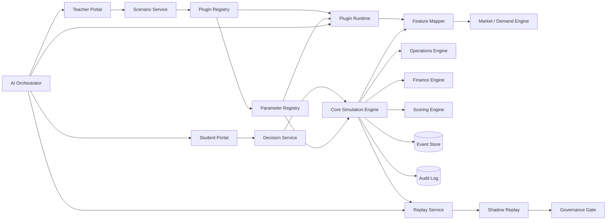

# docs/architecture/industry-plugin-model-report.md

## 文档信息与执行摘要

**文档信息**

| 项目 | 内容 |
|---|---|
| 文档名称 | docs/architecture/industry-plugin-model-report.md |
| 项目名称 | SimWar |
| 文档版本 | v1.0 |
| 文档状态 | Draft |
| 最后更新 | 2026-05-14 |
| 适用范围 | 行业插件 / 场景扩展 / 仿真模型 / SimWar 平台 |
| 维护人 | 请根据实际项目修改 |
| 相关文档 | docs/product/requirements.md / docs/architecture/system-architecture.md / docs/contracts/api-contract.md / docs/contracts/model-engineering-contract.md / docs/product/feature-refinement.md / docs/frontend/teacher-student-architecture.md / docs/quality/test-coverage.md |

SimWar 在现有文档中被统一定义为一个面向高管培训、商学院课程与企业学习场景的 SaaS 仿真平台 / AI 仿真平台，其核心链路覆盖教师开课、学员组队、多轮决策、回合结算、AI 复盘、Replay / Shadow Replay、行业插件扩展与学习闭环；项目已明确采用“核心仿真引擎唯一写真值、AI 只读建议、ParameterSet 正式运行不可变、Replay / Shadow Replay 为发布门禁、Kernel 稳定且 Plugin 可扩展”的架构原则。fileciteturn0file5 fileciteturn0file6 fileciteturn0file7

**执行摘要**

SimWar 需要行业插件，不是因为核心引擎不够强，而是因为跨行业经营训练同时存在两类能力：一类是跨行业相对稳定、必须严控真值写权限的能力，例如租户、课程、队伍、回合状态机、决策提交流程、预算与现金约束、事件账本、财务结算、评分、审计和 Replay；另一类是随行业而变化、且应放在受控扩展位中的能力，例如需求曲线、客群迁移、政策补贴、资质约束、地理摩擦、行业 shock 和行业化前端字段。项目文档已经反复强调，行业复杂性应进入插件与场景包，而不是硬编码进入 Kernel，更不能让 AI 或教师侧工具绕过正式结算链直接写入市场份额、收入、利润、现金流、正式评分或排名。fileciteturn0file0 fileciteturn0file6 fileciteturn0file7 fileciteturn0file12 fileciteturn0file14

把所有行业都压进核心引擎，短期看似统一，长期会导致对象模型污染、参数耦合失控、回放能力下降、前端字段失真和治理成本飙升。相反，Kernel + Plugin 架构使平台可以在统一的 Canonical Domain Model、Feature Mapper、L1-L3 真值链、Replay Hash 和治理门禁之上，承载康养、零售、制造、金融、能源等不同场景，并让教师端、学员端、治理后台、AI 编排层围绕同一套受控契约协作。fileciteturn0file1 fileciteturn0file7 fileciteturn0file9 fileciteturn0file11 fileciteturn0file14

对于 SimWar 当前最成熟的康养方向，上传文档已明确建议以“北京—燕郊一体化康养市场”为 eldercare plugin v1 的高保真母场景：L1 仍由 BLP / RCNL 或其批准实现承担选择与替代真值，插件负责把护理等级、医保互通、LTCI、探视便利、资质门槛、政策补贴、地理摩擦等因素映射为 utility adjustment、eligibility flag、migration matrix 与 policy shock；教师端通过场景包和 ShockEvent 驱动教学控制，学员端通过字段受控的 `state_obs` / `state_est` 做结构化决策，AI 只提供 advisory-only 的解释与建议。fileciteturn0file7 fileciteturn0file9 fileciteturn0file12 fileciteturn0file13 fileciteturn0file14

插件上线前必须经过 Replay / Shadow Replay，原因并非流程繁琐，而是平台的教学公平性、可复算性和正式成绩可信度都依赖“历史正式结果不被覆盖、同输入可复算、候选版本先旁路验证”。文档已将 `replay_hash` 一致性、差异报告、Shadow Replay 门禁、审计链与回滚路径列为上线前的硬性要求。fileciteturn0file1 fileciteturn0file2 fileciteturn0file7 fileciteturn0file8 fileciteturn0file10

**设计目标**

| 设计目标 | 说明 |
|---|---|
| 支持多行业场景扩展 | 通过 PluginPackage + ScenarioPackage 承载行业差异，而非改写 Kernel |
| 保持核心引擎稳定 | L1-L3 真值写入仅允许核心仿真引擎执行 |
| 支持行业字段映射 | 通过 Feature Mapper 将业务字段转成计量变量、运营约束和评分组件 |
| 支持行业参数治理 | ParameterSet 版本化、审批化、可回放 |
| 支持行业政策与 shock 注入 | 通过 ShockEvent 与安全 hook 参与结算 |
| 支持插件版本管理 | 插件须可追踪、可审计、可回滚、不可热替换进行中 Run |
| 支持插件测试与 Replay | 插件升级必须通过契约、兼容性、Replay 与 Shadow Replay |
| 支持教师端和学员端按行业动态展示字段 | 前端通过受控 Slot 和 UI Schema 呈现行业差异 |
| 支持 AI 小模型读取行业上下文但不写真值 | AI 只读裁剪快照、输出 advisory-only 结果 |

上述目标由 Requirements、docs/architecture/system-architecture.md、Feature Refinement、前端架构、API 契约和测试覆盖文档共同收口。fileciteturn0file0 fileciteturn0file6 fileciteturn0file7 fileciteturn0file8 fileciteturn0file9

**非目标**

| 非目标 | 说明 |
|---|---|
| 不把行业逻辑硬编码到核心引擎 | 行业语义进入 Plugin 与 ScenarioPackage |
| 不让插件绕过核心仿真引擎写真值 | 插件只能返还局部调整项，不直接写正式结果 |
| 不让 AI 小模型通过插件接口修改正式结果 | AI 只能输出建议、解释、复盘草稿与证据卡 |
| 不在正式 Run 中动态修改已冻结参数 | Run 创建后绑定的 ParameterSet、PluginVersion、ScenarioPackage 不漂移 |
| 不默认支持未授权行业数据 | 内容授权、品牌边界和数据血缘必须受控 |
| 不将某一行业字段污染通用领域模型 | Canonical Domain Model 保持行业无关 |

这些非目标是项目中的 P0/P1 边界，而不是实现偏好。fileciteturn0file0 fileciteturn0file1 fileciteturn0file6 fileciteturn0file7

## 总体架构与职责边界

**总体架构**

SimWar 的总体工程形态已经在系统架构、工程契约与功能深化文档中被收敛为：应用交互面通过 Teacher Web / Student Web 与 BFF 聚合层消费受控数据；核心仿真面由 Scenario Compiler、Decision Validator、Feature Mapper、Market / Operations / Finance / Scoring Engines 组成；插件运行时位于特征映射与行业语义扩展的受控位置；参数、Replay、审计和治理共同构成发布门禁；AI 编排层只消费裁剪后的状态与工具结果，不进入正式真值写链。fileciteturn0file0 fileciteturn0file1 fileciteturn0file7 fileciteturn0file9



**Kernel 与 Plugin 职责边界**

| 能力项 | Kernel 负责 | Plugin 负责 | 说明 |
|---|---|---|---|
| 对象模型 | 是 | 否 / 仅扩展字段 | Kernel 维护 Canonical Domain Model，Plugin 只能追加行业语义 |
| 回合状态机 | 是 | 否 | Course / Run / Round / Replay 状态机属于平台核心 |
| 决策提交 | 是 | 字段扩展 | 提交流程、幂等、锁轮与审计由 Kernel 控制，Plugin 仅扩展字段定义 |
| 预算与现金约束 | 是 | 行业参数扩展 | 会计恒等式、现金底线、预算约束不能交由插件重写 |
| 需求曲线 | 通用框架 | 行业实现 | Kernel 负责 BLP / RCNL / Logit 框架，Plugin 负责行业侧特征映射和修正 |
| 政策规则 | 通用事件机制 | 行业政策逻辑 | ShockEvent 与事件传播是 Kernel，政策参数与资格细则是 Plugin |
| 资质校验 | 基础校验框架 | 行业资格逻辑 | Plugin 输出 eligibility_mask，Core Engine 决定如何结算 |
| 供给 / 容量约束 | 是 | 行业修正 | Capacity、inventory、staff、risk 为内核，行业效率映射进入插件 |
| 评分 | 通用评分框架 | 行业分项扩展 | Plugin 可提供 `industry_subscore`，但不能直接改最终总分结构 |
| Replay | 是 | 提供可复算局部逻辑 | 插件必须在重放时给出相同局部输出 |
| 权限与审计 | 是 | 字段级标记 | Plugin 可声明字段可见性建议，但裁剪由平台执行 |
| 前端动态表单 | 否 | 是 | 插件通过 UI Schema / Plugin Slot 驱动行业字段 |
| 报告模板 | 通用容器 | 行业模板 | 插件负责行业解释组件和报告片段 |

该边界与项目文档中的核心约束一致：Kernel 只提供稳定机制，Plugin 只提供行业差异，Plugin 不能绕过 Kernel，双方通过契约而非内部耦合通信。fileciteturn0file0 fileciteturn0file1 fileciteturn0file6 fileciteturn0file7 fileciteturn0file14

**真值边界与参数冻结**

正式真值只能由 Core Simulation Engine 在 L1-L3 层写入；插件只能通过安全 hook 输出 `utility_shift`、`eligibility_mask`、`migration_matrix`、`policy_cost_shift`、辅助指标等局部对象；AI 必须停留在 advisory-only 层；任何正式结果都必须绑定 `scenario_package_id`、`plugin_package_id`、`parameter_set_id`、`engine_version`、`random_seed`、`replay_hash` 等回放关键信息，确保可复算、可审计、可申诉。fileciteturn0file1 fileciteturn0file2 fileciteturn0file7 fileciteturn0file11

**BLP / RCNL 边界**

BLP / RCNL 在 SimWar 中只位于 L1 市场真值层，负责价格响应、客户异质性、替代关系、份额分配、弹性与反事实；它不负责运营兑现、财务总账、教学评分、权限治理或前端字段展示。行业插件的职责，是把床位费、护理费、服务品质、地理摩擦、政策资格、探视便利、渠道覆盖等业务字段映射为 BLP / RCNL 可识别的特征变量、约束变量与效用修正项。fileciteturn0file1 fileciteturn0file7 fileciteturn0file11 fileciteturn0file12 fileciteturn0file14

**插件分类体系**

| 分类 | 定义 | 代表示例 | 主要输出 |
|---|---|---|---|
| 行业插件 | 表达行业需求、供给、政策、资质与 shock 语义 | 康养、零售、制造、金融、能源、医疗 | PluginContext、utility_shift、eligibility_mask、migration_matrix |
| 场景插件 | 表达特定市场或教学脚本 | 区域市场、政策冲击、供应链危机、竞争者进入、资本约束 | Round Script、Scenario Knobs、Shock 模板 |
| 规则插件 | 表达受监管或受制度控制的专项规则 | 政策补贴、资格准入、定价约束、人员排班、质量监管 | 规则校验项、约束项、罚则项 |
| 输出插件 | 表达行业化呈现与报告 | 行业报告模板、教师分析视图、学员反馈视图、AI 复盘证据卡 | UI Schema、报告片段、解释组件 |

这四类分类在现有文档中并未以单一表格形式出现，但它们与文档已经明确存在的 ScenarioPackage、PluginManifest、Plugin Runtime、ShockEvent、教师端/学员端插件 Slot、行业化报告与治理能力是相符的工程收口版本；请根据实际项目进一步细化。fileciteturn0file0 fileciteturn0file5 fileciteturn0file7 fileciteturn0file9 fileciteturn0file12

## 插件契约与运行时模型

> 说明：本节中的 Manifest、ScenarioPackage Schema、生命周期细分与部分 Hook 形态，是在现有文档已明确的 PluginManifest、PluginPackage、安全 hook、场景编译、参数冻结、Replay 门禁基础上形成的仓库级建议收口版本；若未来仓库已有正式 schema，请以实际项目实现为准并同步修改。fileciteturn0file0 fileciteturn0file1 fileciteturn0file5 fileciteturn0file6

**Plugin Manifest 设计**

| 字段 | 类型 | 必填 | 说明 |
|---|---|---:|---|
| plugin_id | string | 是 | 插件唯一 ID |
| name | string | 是 | 插件名称 |
| version | string | 是 | 插件版本 |
| industry | string | 是 | 所属行业 |
| supported_kernel_version | string | 是 | 支持的 Kernel 版本范围 |
| required_parameters | array | 是 | 插件运行所需的参数键集合 |
| exposed_decision_fields | array | 是 | 对教师端 / 学员端暴露的行业决策字段 |
| state_extensions | array | 否 | 行业扩展状态字段 |
| settlement_hooks | array | 是 | 可用结算钩子声明 |
| validation_rules | array | 是 | 字段、资质、边界、依赖校验规则 |
| event_types | array | 否 | 行业事件与 shock 类型 |
| ui_schema | object | 否 | 前端动态表单与说明区结构 |
| test_cases | array | 是 | 契约测试、兼容性测试、Replay 测试用例 |
| approval_status | string | 是 | 审批状态 |
| created_by | string | 是 | 创建人 |
| approved_by | string | 否 | 审批人 |
| audit_id | string | 否 | 审计链 ID |

现有文档已经明确存在 `PluginManifest`、`plugin_manifests` 元数据表、Manifest 契约校验、Artifact 上传、Plugin Context 编译接口和安全 hook 集合，但未把字段粒度展开到仓库级 schema；上表是为后续代码生成、契约测试和治理后台落地而给出的建议细化版本。fileciteturn0file0 fileciteturn0file2 fileciteturn0file5 fileciteturn0file6

```json
{
  "plugin_id": "eldercare-plugin",
  "name": "Eldercare Industry Plugin",
  "version": "1.0.0",
  "industry": "eldercare",
  "supported_kernel_version": ">=1.0.0",
  "required_parameters": [
    "pricing_package",
    "occupancy_series",
    "staffing_package",
    "policy_rules"
  ],
  "exposed_decision_fields": [
    "bed_pricing",
    "care_package_mix",
    "staff_schedule",
    "medical_partnership_level",
    "ltci_strategy",
    "service_quality_budget"
  ],
  "state_extensions": [
    "care_grade_mix",
    "ltci_eligibility_rate",
    "visit_friction_index"
  ],
  "settlement_hooks": [
    "beforeDecisionValidation",
    "afterDecisionValidation",
    "beforeFeatureMapping",
    "afterFeatureMapping",
    "beforeDemandSettlement",
    "afterDemandSettlement",
    "beforeOperationsSettlement",
    "afterOperationsSettlement",
    "beforeFinanceSettlement",
    "afterFinanceSettlement",
    "beforeScoring",
    "afterScoring"
  ],
  "validation_rules": [
    "pricing_non_negative",
    "staffing_qualification_check",
    "ltci_policy_eligibility_check"
  ],
  "event_types": [
    "policy_change",
    "public_health_event",
    "competitor_entry",
    "transport_improvement"
  ],
  "ui_schema": {
    "form_version": "1.0.0",
    "sections": []
  },
  "test_cases": [
    "manifest_schema_validation",
    "plugin_compatibility",
    "shadow_replay_baseline"
  ],
  "approval_status": "draft",
  "created_by": "<USER_ID>",
  "approved_by": null,
  "audit_id": null
}
```

**插件生命周期**

现有文档的插件状态机多为 `draft -> testing -> shadow_passed -> approved -> released -> disabled`；为了在代码仓库中更清晰地承载 Shadow Replay、部署面与回滚语义，本报告建议统一为下表的七态版本，便于治理系统和 CI/CD 明确区分“通过验证”“已部署”“已回滚”。请根据实际项目修改。fileciteturn0file0 fileciteturn0file6 fileciteturn0file7

```text
draft -> testing -> shadow_testing -> approved -> deployed -> deprecated -> rolled_back
```

| 状态 | 状态含义 | 进入条件 | 退出条件 | 允许操作 | 禁止操作 | 审批人 | 审计要求 |
|---|---|---|---|---|---|---|---|
| draft | 草稿开发态 | 上传插件包或创建 Manifest | 完成 schema / 基础兼容性校验 | 编辑 Manifest、补齐参数键、补测试 | 被正式场景引用、参与正式 Run | 无或场景设计师 | 记录创建人与变更摘要 |
| testing | 研发/测试态 | manifest 校验通过，artifact 可加载 | 契约测试、兼容测试、安全 hook 测试完成 | 执行单元/契约/集成测试 | 对正式课程发布 | 场景设计师 / 研发负责人 | 保留测试报告引用 |
| shadow_testing | 影子回放验证态 | 测试态通过且有历史基线 | Shadow Replay 通过门限 | 发起历史 run 旁路重放、生成 diff_report | 指向正式租户流量 | 模型治理人员 | 必须生成 shadow_replay_report |
| approved | 治理批准态 | Shadow Replay、兼容性、安全审查通过 | 被部署或被撤销 | 允许被场景包绑定、允许进入发布流程 | 热替换进行中 Run | 模型治理人员 / 双人审批 | 记录审批链、依据与审计 ID |
| deployed | 已部署可用态 | 已批准 + 已发布到可用 Registry | 下线、退役或回滚 | 供新 Run / 新 ScenarioPackage 绑定 | 覆盖旧版本历史结果 | 管理员 / 模型治理人员 | 记录部署面、版本、租户范围 |
| deprecated | 退役态 | 新版本替代或策略退役 | 彻底停用或回滚完成 | 只读查询、历史审计、旧 Run 重放 | 被新课程绑定 | 模型治理人员 | 保留退役原因及替代版本 |
| rolled_back | 已回滚态 | 已部署版本出现质量/合规/性能问题 | 人工重新批准替代版本 | 仅保留审计与历史重放 | 恢复为活跃生产版本 | 管理员 / 模型治理人员 | 记录触发指标、回滚事件与影响范围 |

**ScenarioPackage 设计**

ScenarioPackage 在项目文档中被定义为课程运行使用的版本化场景包，至少承担模板、插件绑定、轮次脚本、初始情境、可见性与场景配置。教师创建课程时先绑定场景包与已批准 ParameterSet；Run 创建时再冻结所用 ScenarioPackage、PluginVersion 与 ParameterSet。fileciteturn0file0 fileciteturn0file2 fileciteturn0file6 fileciteturn0file7

| 字段 | 说明 |
|---|---|
| scenario_package_id | 场景包 ID |
| scenario_name | 场景名称 |
| industry | 行业类型 |
| plugin_dependencies | 依赖插件及版本 |
| parameter_set_dependencies | 依赖参数集及版本约束 |
| round_count | 总回合数 |
| initial_state | 初始市场、初始资源、初始资金与起盘定位 |
| external_shocks | 预排布或可注入的 shock 列表 |
| visibility_policy | 可见信息配置 |
| teacher_config | 教师端仪表、控制开关与 Shock 模板 |
| student_config | 学员端决策字段、报告与公告策略 |
| scoring_rule | 评分规则、红线与行业分项 |
| replay_baseline_ref | Replay 基线引用 |
| audit | 创建、审批、来源证据与版本信息 |

```json
{
  "$schema": "https://json-schema.org/draft/2020-12/schema",
  "title": "ScenarioPackage",
  "type": "object",
  "required": [
    "scenario_package_id",
    "scenario_name",
    "industry",
    "plugin_dependencies",
    "parameter_set_dependencies",
    "round_count",
    "initial_state",
    "visibility_policy",
    "teacher_config",
    "student_config",
    "scoring_rule",
    "audit"
  ],
  "properties": {
    "scenario_package_id": { "type": "string" },
    "scenario_name": { "type": "string" },
    "industry": { "type": "string" },
    "plugin_dependencies": {
      "type": "array",
      "items": {
        "type": "object",
        "required": ["plugin_id", "version"],
        "properties": {
          "plugin_id": { "type": "string" },
          "version": { "type": "string" }
        }
      }
    },
    "parameter_set_dependencies": {
      "type": "array",
      "items": {
        "type": "object",
        "required": ["parameter_set_id", "version"],
        "properties": {
          "parameter_set_id": { "type": "string" },
          "version": { "type": "string" }
        }
      }
    },
    "round_count": { "type": "integer", "minimum": 1 },
    "initial_state": { "type": "object" },
    "external_shocks": { "type": "array", "items": { "type": "object" } },
    "visibility_policy": { "type": "object" },
    "teacher_config": { "type": "object" },
    "student_config": { "type": "object" },
    "scoring_rule": { "type": "object" },
    "replay_baseline_ref": { "type": "string" },
    "audit": {
      "type": "object",
      "required": ["created_by", "created_at", "evidence_refs"],
      "properties": {
        "created_by": { "type": "string" },
        "created_at": { "type": "string", "format": "date-time" },
        "approved_by": { "type": "string" },
        "evidence_refs": { "type": "array", "items": { "type": "string" } }
      }
    }
  }
}
```

**ParameterSet 设计**

ParameterSet 是真值核最关键的工程对象，不只是系数集合，还包括模型家族、公式、积分配置、有效区间、诊断记录、治理元数据、feature mapper 版本和 solver 版本；其状态在 `approved` 后不可覆盖，任何修改只能生成新版本，并且只有新 Run 能绑定新版本。fileciteturn0file1 fileciteturn0file2 fileciteturn0file7

| 参数类别 | 示例参数 | 来源 | 是否可改 | 是否需审批 | 是否进入 Replay |
|---|---|---|---|---|---|
| Demand | `x1_formula`、`x2_formula`、价格系数、质量系数 | 计量校准 / 行业研究 | 运行中不可改 | 是 | 是 |
| Supply | `x3_formula`、工资指数、租金指数、成本型式 | 计量校准 / 项目基线 | 运行中不可改 | 是 | 是 |
| Operations | 床位容量、排班阈值、服务比、资格阈值 | 项目基线 / 行业规则 | 运行中不可改 | 是 | 是 |
| Policy | LTCI 支付比例、医保互通规则、补贴规则 | 官方政策 / 场景设定 | 正式 Run 不可改，课堂变化走 ShockEvent | 是 | 是 |
| Scoring | 分项权重模板、红线阈值、惩罚规则 | 治理模板 / 课程配置 | 发布后不可中途改 | 是 | 是 |
| Visibility | 教师 / 学员可见字段、研究发现开放策略 | 场景设计 / 教学设计 | 发布后不可中途改 | 是 | 否，写入场景基线 |
| Randomization | `random_seed`、抽样配置、solver config 摘要 | Run 创建与治理模板 | Run 启动后不可改 | 是 | 是 |
| Governance | `approved_by`、`shadow_replay_report_id`、兼容级别 | 治理流程 | 审批后只读 | 是 | 是 |

当插件版本与参数版本不兼容时，应拒绝绑定课程发布与 Run 创建；不得在运行中自动降级或热替换。兼容性由 Manifest、Schema 校验、Feature Mapper 版本与 Shadow Replay 共同决定。fileciteturn0file1 fileciteturn0file2 fileciteturn0file8

**Feature Mapper 设计**

Feature Mapper 是插件与核心引擎之间最关键的“翻译层”。学员提交的是业务语言，计量核与结算核需要的是 `x1/x2/x3/price/availability/instruments/shocks`；因此任何行业字段都必须经由 Schema 校验、Feature Mapper 与 ParameterSet 约束后，才能进入正式结算。fileciteturn0file1 fileciteturn0file7

| 行业字段 | Kernel 字段 | 计量变量 | 映射方式 | 备注 |
|---|---|---|---|---|
| `bed_pricing` | `offer.price` | `prices` | 直接映射并保留币种 / 折扣规则 | 进入 L1 需求核 |
| `care_package_mix` | `offer.bundle` | `quality_score` / `service_level` | 通过服务包 lookup + 权重汇总 | 可同时影响 L1 与 L2 |
| `medical_partnership_level` | `qualification.medical_link` | `eligibility_flag` / `hospital_link_grade` | 规则映射 + 资质校验 | 影响可售性与效用 |
| `ltci_strategy` | `policy_contract` | `utility_adjustment` / `payment_ratio` | 政策规则映射 | 不能直接改财务总账 |
| `travel_time_peak` | `geo_friction` | `distance` / `friction_coefficient` | 归一化映射 | 进入地理摩擦修正 |
| `staff_schedule` | `staff_pool` | `capacity_effective` / `payroll_cost` | 排班规则与服务比计算 | 主要影响 L2 / L3 |
| `service_quality_budget` | `quality_stock` | `quality_score` / `x3` 可选输入 | 显式标注是否跨层计量 | 禁止重复计量 |
| `shock_policy_change` | `shock_event` | `exogenous_event` / `policy_cost_shift` | 事件映射 | 经过 Governance Gate |
| `market_report_signal` | `state_est` | 非正式解释变量 | 仅更新观察 / 估计态 | 不进入正式真值 |
| `industry_kpi_weight` | `score_component_ref` | `industry_subscore` | 由 `score_hooks` 提供分项 | 不改总评分结构 |

这张表综合了工程契约中冻结的映射原则、系统架构中的 `mapping_trace`、康养行业中的价格三元向量 / 资质 / 地理摩擦 / 医保互通等语义映射，以及前端行业字段输入设计。fileciteturn0file1 fileciteturn0file7 fileciteturn0file9 fileciteturn0file12 fileciteturn0file14

**结算钩子 Settlement Hooks**

现有文档已冻结了一组安全 hook：`compile_context`、`adjust_utility`、`segment_migration`、`qualification_check`、`apply_shock`、`provide_aux_kpi`、`score_hooks`、`autopilot_policy`。为了在代码仓库和结算流水线中更好地承接这些安全写入点，建议把它们包装到如下生命周期钩子中。所有钩子都只能返回结构化调整项，由 Core Simulation Engine 校验后写入，插件不得直接写入最终成绩或最终总分。fileciteturn0file0 fileciteturn0file1 fileciteturn0file7

| Hook | 调用时机 | 输入 | 输出 | 是否可修改真值 | 约束 |
|---|---|---|---|---|---|
| `beforeDecisionValidation` | 决策校验前 | 原始决策、角色上下文、插件 schema | 字段预校验建议 | 否 | 只可返回错误 / 警告建议 |
| `afterDecisionValidation` | 决策校验后 | `normalized_decision`、validation report | 默认补齐建议、缺岗策略建议 | 否 | 不得覆盖已提交字段 |
| `beforeFeatureMapping` | 特征映射前 | 编译场景、参数集、插件上下文 | 上下文补充、可见性策略 | 否 | 不得产出真值字段 |
| `afterFeatureMapping` | 特征映射后 | `mapping_trace`、product/agent/supply data | `utility_shift`、`eligibility_mask`、`migration_matrix` | 否 | 只可返回局部调整项 |
| `beforeDemandSettlement` | L1 求解前 | 映射结果、先验 shock、外部约束 | 需求侧修正建议 | 否 | 不得直接写份额或销量 |
| `afterDemandSettlement` | L1 求解后 | 临时 share / elasticity 结果 | 合法性检查、辅助诊断 | 否 | 可读不可写正式结果 |
| `beforeOperationsSettlement` | L2 兑现前 | 需求结果、容量、人员、资格 | 服务能力修正项 | 否 | 不能篡改 L1 真值 |
| `afterOperationsSettlement` | L2 兑现后 | served share、wait time、incident rate | 辅助 KPI、风险标签 | 否 | 不写正式财务 |
| `beforeFinanceSettlement` | L3 财务前 | 服务兑现结果、价格、成本映射 | 政策支付 / 补贴修正项 | 否 | 只返结构化会计调整项 |
| `afterFinanceSettlement` | L3 财务后 | provisional finance ledger | 审核类诊断、行业解释标签 | 否 | 不得覆盖总账 |
| `beforeScoring` | 评分前 | 规范化指标、行业辅助 KPI | `industry_subscore` 建议 | 否 | 不得改总评分公式 |
| `afterScoring` | 评分后 | provisional score / rank | 行业反馈解释组件 | 否 | 只可形成说明，不可重写结果 |

**行业事件与 Shock 设计**

ShockEvent 是正式运行中少数允许改变“未来回合条件”的受控机制。项目文档已经明确：教学中的正式变化只能建模为 ShockEvent，而不能修改 ParameterSet；Shadow Replay 也只能使用候选版本做旁路比较，不得回写历史正式成绩。fileciteturn0file1 fileciteturn0file7 fileciteturn0file8

| Shock 类型 | 示例 | 插件输出 | 影响层 |
|---|---|---|---|
| 政策变化 | 补贴扩容、资格收紧、医保互通落地 | `policy_cost_shift`、资格变化 | L2 / L3 |
| 市场需求变化 | 客群偏好变化、支付意愿变化 | `utility_shift`、market size 调整 | L1 |
| 供应链冲击 | 耗材短缺、外包涨价 | 成本曲线修正、可服务性下降 | L2 / L3 |
| 成本变化 | 工资上涨、能耗上涨、租金上涨 | `x3` / cost shifter | L1 / L3 |
| 监管变化 | 星级检查、合规调查 | 资格限售、罚则项 | L2 / L3 |
| 竞争者进入 | 新玩家开业、促销加剧 | 替代关系强化、outside option 变化 | L1 |
| 公共卫生事件 | 疫情、探视限制、传染控制 | 摩擦上升、质量风险上升 | L1 / L2 |
| 地理交通变化 | 地铁开通、高铁改善、班车恢复 | friction coefficient 下降 | L1 |
| 资本约束变化 | 银行授信收紧、融资成本上升 | interest cost、cash buffer 风险 | L3 |

```json
{
  "event_id": "<EVENT_ID>",
  "event_type": "<EVENT_TYPE>",
  "industry": "<INDUSTRY>",
  "round_id": "<ROUND_ID>",
  "affected_segments": [],
  "parameter_adjustments": {},
  "visibility": "teacher_only | student_visible | delayed",
  "requires_approval": true
}
```

## 康养插件样例与跨行业模板

**康养行业对象**

康养方向的上传文档已给出非常清晰的行业对象与结算主线：对象层应至少包括床位 / 房型、护理等级、服务包、医疗联动、人员池、外包合同、资本资产、政策合同、财务账本，并把入住、护理等级迁移、资源配置、收入拆分、现金流、投资回收与安全质量纳入同一条月度子步结算链。康养不能被压缩成“房费 × 入住率”的简单公式，而必须同时建模活力型 / CCRC 需求曲线与失能 / 失智 / 医养结合需求曲线。fileciteturn0file12 fileciteturn0file13 fileciteturn0file14

| 对象 | 插件内涵 | 说明 |
|---|---|---|
| 床位 / 房型 | 单人间、双人间、护理床、公寓型产品 | 决定价格带、服务深度与人效结构 |
| 护理等级 | 自理、介助、介护、认知照护等 | 影响需求、成本、资格与迁移 |
| 服务包 | 护理、餐饮、健康管理、课程、陪诊、社区活动 | 决定质量代理与价值结构 |
| 医疗联动 | 医院合作、医保定点、绿色转诊 | 影响资格、支付与品牌信任 |
| 人员池 | 护理员、护士、社工、康复师、保洁、后勤 | 决定可服务能力和事故率 |
| 外包合同 | 保洁、餐饮、安保、维修、班车 | 决定成本与波动弹性 |
| 资本资产 | 固定资产、改造投入、智能设备、折旧 | 决定 CapEx 与现金流质量 |
| 入住客户 | 北京外溢、本地普惠、旅居中产、社区活力老人 | 决定客群迁移与支付曲线 |
| 长护险 | LTCI 资格、报销比例、边界项 | 影响有效支付能力 |
| 医保互通 | 异地结算、定点资格、医疗可达性 | 影响跨区域迁移 |
| 政策补贴 | 运营补贴、星级奖补、信用加成 | 影响边际成本与现金流 |

**康养行业决策字段**

| 决策域 | 典型字段 | 核心作用 |
|---|---|---|
| 定价 | 床位费、护理费、餐费、会员费 / 入门费、折扣节奏 | 形成有效价格向量 |
| 护理服务包配置 | 护理等级组合、服务深度、课程与康复包 | 影响吸引力、成本和人效 |
| 床位配置 | 开床数量、房型比例、分期启用节奏 | 影响已开业区入住率与 CapEx |
| 人员排班 | 班次、编制、外包比例、培训投入 | 影响可服务能力与事故率 |
| 医疗合作 | 医院合作等级、医保定点策略 | 影响 eligibility 与支付能力 |
| 营销预算 | 品牌、渠道、社区触达、探视服务宣传 | 影响 brand stock 与渠道覆盖 |
| 服务质量投入 | 安全、数字化、远程探视、质量追踪 | 影响质量、风险和留存 |
| 长护险申请策略 | 资格申请、客户筛选、结算路径 | 影响政策支付与客群结构 |
| 资本支出 | 扩床、设备、数字化系统、改造 | 影响中长期能力与现金流 |
| 风险控制 | 储备金、应急演练、感染控制、合规审查 | 影响 incident rate 与惩罚项 |

这些字段与康养研究中提出的“价格三元向量、双付款人逻辑、护理等级、医保互通、探视便利、资质与服务质量一体化建模”保持一致。fileciteturn0file12 fileciteturn0file13 fileciteturn0file14

**康养行业结算逻辑**

| 结算模块 | 关键变量 | 结算说明 |
|---|---|---|
| 入住率 | 全盘入住率、已开业区入住率、等待名单 | 必须同时建模双入住率口径 |
| 客群迁移 | 北京→燕郊、本地→异地、活力→照护 | 受价格差、政策与探视便利影响 |
| 护理等级迁移 | ADL 变化、失能进展、康复转段 | 影响服务成本与资格 |
| 收入拆分 | 床位费、餐费、护理费、医疗收入、服务包收入 | 禁止粗暴合并为单一营收项 |
| 人工成本 | 固定编制、外包、培训、离职率 | 通常是最大成本项 |
| 服务成本 | 餐饮、耗材、维保、班车、外包 | 随入住与等级变化 |
| 医疗联动收入 | 医保、合作转诊、康复收入 | 取决于资质与合作等级 |
| 长护险支付 | LTCI 支付比例、支付边界、资格覆盖 | 只支付合规护理服务部分 |
| 政策补贴 | 运营补贴、星级奖补、信用加成 | 进入 policy_cost_shift / 财务修正 |
| 现金流 | 会籍 / 预售、经营现金流、融资、储备 | 比利润更先决定生存质量 |
| 投资回收期 | 静态回收、动态回收、NPV / IRR | 适合教师端高层视图 |
| 服务质量 | NPS、投诉率、等待时间、事故率 | 影响留存与评分 |
| 风险事件 | 感染、监管处罚、舆情、人员短缺 | 进入 L2 / L3 惩罚链 |

康养行业文档特别强调：收费必须从服务结构反推，资源配置要区分“已开业区入住率”和“全盘入住率”，收入必须拆开床位费 / 餐费 / 护理费 / 医疗收入 / 长护险支付等维度，现金流回正和利润转正往往明显晚于试营业启动。fileciteturn0file13

**康养行业 Shock**

| Shock | 触发示例 | 主要影响 |
|---|---|---|
| 医保互通政策 | 全面互通试点启动 | 外溢客群迁入增加，资格门槛下降 |
| 长护险支付比例变化 | 支付比例上调 / 下调 | 有效支付能力和客群结构变化 |
| 交通改善 | 地铁 / 高铁 / 班车改善 | 探视摩擦下降，跨区域承接增强 |
| 公共卫生事件 | 疫情、感染控制升级 | 探视受限、风险成本上升 |
| 护理人员短缺 | 离职潮、招聘困难 | 人效下降、服务比恶化 |
| 竞争者进入 | 新机构开业、价格战 | 替代关系增强、品牌压力上升 |
| 监管检查 | 星级 / 合规检查 | 资格紧缩、罚则与整改成本增加 |

北京—燕郊康养母场景的轮次脚本文档已给出典型脚本：第二轮可引入 LTCI / 护理补贴与医保互通试点，第三轮引入交通改善，第四轮引入疫情 / 公共卫生事件，第五至第六轮进入整合与成熟期。fileciteturn0file12

**跨行业扩展模板**

| 行业 | 需要新增的 Plugin 能力 | 可复用 Kernel 能力 | 主要风险 |
|---|---|---|---|
| 零售 | 渠道、库存、促销、门店流量、地理引力 | 预算、库存、价格、评分、回合与审计 | 需求波动、促销失真 |
| 制造 | 产线、良率、供应链、设备折旧、交付节拍 | 产能、库存、现金、质量、风险 | 供应链中断、良率漂移 |
| 金融 | 风险定价、合规约束、资本充足率、客群信用 | 客户、产品、风险、评分、治理 | 合规风险、参数黑箱化 |
| 能源 | 供需平衡、政策、碳约束、资产调度 | 资产、成本、现金、风控、审计 | 政策波动、极端事件 |
| 医疗 | 患者分层、医保支付、床位周转、临床路径 | 预约 / 容量、现金、权限、评分 | 合规与安全高风险 |
| 教育训练 | 课程品类、留存、推荐、学习路径 | 租户、课程、队伍、评分、Replay | 指标被 AI 叙事污染 |

跨行业扩展的核心不是让 LLM 一次性“写完整行业游戏”，而是先补齐谁买、谁付、什么可卖、哪些政策影响效用、哪些 shock 最重要，再生成 `plugin_stub + evidence_pack`，通过 Shadow Replay 和专家审核后进入正式 Registry。fileciteturn0file5 fileciteturn0file11 fileciteturn0file12 fileciteturn0file14

## 前端集成、API 与数据存储

**教师端与学员端集成**

项目的前端文档已明确：Teacher Web 是“教学驾驶台”，Student Web 是“有限信息下的结构化学习界面”；二者都必须通过 BFF 消费裁剪后的快照，不得直连内部正式结算接口，也不得混淆 official / sandbox / shadow_replay / counterfactual 视图。行业插件前端扩展位必须采用受控 Slot，只能扩展表单与解释区块，不能改变真值写入路径。fileciteturn0file9

| 前端区域 | Plugin 影响 | 数据来源 | 权限约束 |
|---|---|---|---|
| 教师端场景选择 | 展示可用行业插件、母场景、依赖版本 | Scenario Service / Plugin Registry | 仅教师 / 场景设计师 / 治理角色可配置 |
| 教师端插件选择 | 选择插件版本、显示兼容状态 | Plugin Registry / Validation Report | 未批准版本不可进入正式发布 |
| 教师端参数配置 | 加载行业参数模板与校验规则 | Parameter Registry / Plugin Context | 正式 Run 启动后只读 |
| 教师端 Shock 注入 | 加载行业 shock 模板与影响范围说明 | Shock Template / Plugin Context | 仅教师 / 治理可见；影响未来轮次 |
| 教师端行业指标查看 | 展示行业辅助 KPI、Replay diff、诊断摘要 | SettlementResult / ReplayReport / Aux KPI | 候选 diff 不对学员开放 |
| 教师端 Replay 对比 | 按行业指标比较 baseline / candidate / published | Replay Service | 仅教师 / 治理可见 |
| 学员端行业决策表单 | 动态渲染行业字段、分段说明、约束提示 | UI Schema / Plugin Slot / ValidationReport | 仅 `open` 状态可编辑 |
| 学员端行业市场报告 | 展示行业观察态和研究态说明 | `state_obs` / `state_est` | 不暴露完整 `state_true` 与完整参数 |
| 学员端行业结果反馈 | 三段式反馈中显示行业原因树与风险提示 | SettlementResult + CoachOutput | 必须区分事实与建议 |
| 学员端 AI 行业建议 | 结合行业上下文提供 advisory-only 解释 | AI Orchestrator / CoachOutput | 显示 `advisory_only` 标识 |
| 学员端行业复盘报告 | 行业 KPI 与改进建议联动 | LearningReport / DebriefDraft | 学员仅看本队版 |
| 学员端三段式反馈 | 按行业模板展示 `what/why/next` | Published Snapshot + Industry Explainer | 严禁显示候选 Replay 差异 |

**API 需求概览**

现有 API 文档已经覆盖插件列表、插件上传、插件上下文编译、插件发布、场景编译、Shadow Replay、参数集审批和内部结算等能力。为便于代码仓库与后续实现对齐，本报告在现有接口基础上补齐“插件校验 / 审批 / 部署”三个治理动作；这三项属于对现有发布门禁和治理后台能力的显式化收口。请根据实际项目修改。fileciteturn0file2 fileciteturn0file4 fileciteturn0file7

| API 编号 | 方法 | 路径 | 描述 | 权限 | 是否幂等 | 优先级 |
|---|---|---|---|---|---|---|
| API-PLUGIN-001 | POST | /api/plugins | 创建插件 | 场景设计师 / 管理员 | 否 | P0 |
| API-PLUGIN-002 | GET | /api/plugins | 查询插件列表 | 授权用户 | 是 | P0 |
| API-PLUGIN-003 | GET | /api/plugins/{id} | 查询插件详情 | 授权用户 | 是 | P0 |
| API-PLUGIN-004 | POST | /api/plugins/{id}/validate | 校验插件 | 场景设计师 / 模型治理人员 | 否 | P0 |
| API-PLUGIN-005 | POST | /api/plugins/{id}/shadow-replay | 发起 Shadow Replay | 模型治理人员 | 否 | P0 |
| API-PLUGIN-006 | POST | /api/plugins/{id}/approve | 审批插件 | 模型治理人员 | 否 | P0 |
| API-PLUGIN-007 | POST | /api/plugins/{id}/deploy | 部署插件 | 管理员 / 模型治理人员 | 否 | P1 |
| API-PLUGIN-008 | POST | /api/scenarios | 创建场景包 | 场景设计师 | 否 | P0 |

| API 编号 | 请求参数 | 响应结构 | 权限要求 | 审计要求 | 错误码 | 验收标准 |
|---|---|---|---|---|---|---|
| API-PLUGIN-001 | `plugin_name`、`industry`、`version`、`manifest`、`artifact_ref` | `plugin_id`、`version`、`status=draft` | 场景设计师 / 管理员 | 记录上传者、artifact 摘要、manifest digest | `PLG-409-001`、`PLG-422-001` | 上传后先为 `draft`，不能直接发布 |
| API-PLUGIN-002 | Query：`industry`、`status`、`page`、`page_size` | `items[]`、`latest_version`、`status` | 授权用户 | 读取默认不写业务审计，可保留访问痕迹 | `AUTH-403-*` | 只返回有权使用的插件 |
| API-PLUGIN-003 | Path：`id` | 全量 manifest 摘要、版本、依赖、状态 | 授权用户 | 记录敏感读取时可见性裁剪 | `PLG-404-001` | 不泄露无权字段 |
| API-PLUGIN-004 | Body：`target_version`、`validation_profile`、`schema_version` | `validation_report`、`compatibility_report_ref` | 场景设计师 / 治理 | 记录校验器版本、结果摘要 | `PLG-422-001`、`PLG-422-003` | Schema、安全 hook、依赖兼容性全部通过 |
| API-PLUGIN-005 | Body：`source_run_id`、`candidate_parameter_set_id`、`candidate_scenario_package_id`、`candidate_plugin_version` | `shadow_replay_id`、`diff_summary` | 模型治理人员 | 必须形成治理记录与 diff 报告 | `RPL-422-*` | 历史正式成绩不被改写 |
| API-PLUGIN-006 | Body：`version`、`validation_report_ref`、`shadow_replay_id`、`decision` | `plugin_id`、`version`、`status=approved` | 模型治理人员 | 审批人、依据、时间戳、审计链完整 | `PLG-409-APPROVAL-*` | 未通过 Shadow Replay 不可批准 |
| API-PLUGIN-007 | Body：`version`、`deployment_surface`、`tenant_scope` | `plugin_id`、`version`、`status=deployed` | 管理员 / 治理 | 记录部署环境、租户范围、回滚指针 | `PLG-409-DEPLOY-*` | 已绑定进行中 Run 的旧版本不得被热替换 |
| API-PLUGIN-008 | Body：`scenario_template_id`、`plugin_id`、`plugin_version`、`policy_params`、`round_script`、`visibility_policy`、`evidence_refs` | `scenario_package_id`、`version`、`compile_report` | 场景设计师 | 记录编译事件、版本与引用依赖 | `CRS-428-001`、`SCN-422-*` | 场景包可版本化、可校验 schema、可绑定 approved ParameterSet |

这些 API 与现有 API 合同中的 `/api/v1/plugins`、`/api/v1/plugins/{pluginId}/compile-context`、`/api/v1/plugins/{pluginId}/release`、`/api/v1/replays/shadow`、`/api/v1/scenarios/compile`、参数审批与审计要求高度一致；`validate / approve / deploy` 则是对治理面动作的显式化补充。fileciteturn0file2 fileciteturn0file4

**数据存储设计**

> 说明：以下保留策略为仓库级建议，请根据实际合规周期、租户合同和存储成本策略修改。平台现有文档明确了追加写、双账本、快照、版本冻结和审计链，但未统一冻结每类对象的保留年限。fileciteturn0file1 fileciteturn0file5 fileciteturn0file7 fileciteturn0file10

| 数据对象 | 说明 | 关键字段 | 写入方式 | 保留策略 |
|---|---|---|---|---|
| PluginPackage | 插件二进制 / 产物包 | `plugin_package_id`、`version`、`artifact_ref` | 版本化写入 | 长期保留，至少覆盖所有正式 Run 生命周期 |
| PluginManifest | 插件元数据与能力声明 | `plugin_id`、`version`、`industry`、`approval_status` | 版本化写入 | 长期保留 |
| PluginVersion | 插件版本状态流转 | `plugin_id`、`version`、`status`、`compatibility_level` | 状态追加写 | 长期保留，禁止覆盖 |
| ScenarioPackage | 场景包定义与轮次脚本 | `scenario_package_id`、`template_id`、`version` | 版本化写入 | 长期保留 |
| ParameterSet | 真值参数集 | `parameter_set_id`、`model_family`、`version`、`status` | 版本化写入 | 长期保留，`approved` 不可覆盖 |
| FeatureMappingRule | 字段到计量变量的映射规则 | `rule_id`、`feature_mapper_version`、`source_field` | 版本化写入 | 长期保留，用于审计和回放 |
| SettlementHookConfig | 钩子启用、顺序与限制 | `hook_id`、`plugin_id`、`version` | 配置版本化 | 随插件版本长期保留 |
| ShockEvent | 冲击事件 | `shock_id`、`run_id`、`effective_round` | 追加写 | 按正式 Run 长期保留 |
| PluginValidationReport | 插件契约 / 兼容 / 安全校验报告 | `report_id`、`plugin_id`、`version` | 追加写 | 至少保留到对应版本退役后 |
| PluginReplayReport | 插件相关 Replay / Shadow Replay 报告 | `replay_report_id`、`baseline`、`candidate` | 追加写 | 长期保留，支持申诉和治理追溯 |
| IndustryMetricDefinition | 行业指标定义 | `metric_id`、`industry`、`formula_ref` | 版本化写入 | 长期保留 |
| PluginAuditLog | 插件写操作和治理动作审计 | `audit_id`、`actor_id`、`action`、`resource` | 追加写 | 按合规要求长期或至少 3 年 |

## 测试验证、质量治理与实施路线

**测试与验证体系**

测试文档已将“真值可复算、权限可验证、边界可证明、发布可回滚”定义为正式质量目标，并把单元、契约、集成、Replay、Shadow Replay、AI 边界、多租户隔离、性能和安全测试都列为 P0 / P1 质量层。fileciteturn0file8

| 测试类型 | 测试目标 | 覆盖模块 | 示例用例 | 通过标准 |
|---|---|---|---|---|
| 单元测试 | 验证插件规则函数、映射规则、状态机 | Plugin Runtime / Feature Mapper | 康养 `ltci_eligibility` 输入不同资格组合时返回正确 `eligibility_mask` | 纯函数、边界分支、错误码稳定 |
| 契约测试 | 验证 Plugin Manifest 与 API Schema | Plugin Registry / OpenAPI / JSON Schema | Manifest 缺失 `required_parameters` 时返回 `PLG-422-001` | Schema、示例、错误码全部通过 |
| 集成测试 | 验证插件与 Kernel 集成 | Core Engine / Scenario Compiler | 课程绑定康养插件后，场景编译、决策提交、结算链完整打通 | 主链路通过，不丢事件，不串版本 |
| Replay 测试 | 验证可复算性 | Replay Service | 相同 `run + round + decision_batch + parameter_set + seed` 重放结果一致 | `replay_hash` 一致 |
| Shadow Replay 测试 | 验证插件上线影响 | Governance Gate | 候选康养插件版本替换后，仅生成 `diff_report`，不改历史成绩 | 差异报告齐全且历史结果只读 |
| 权限测试 | 验证字段可见性与插件 UI 边界 | Teacher / Student Portal | 学员请求教师摘要字段或候选 diff 字段被拒绝 | 不泄露无权字段 |
| 性能测试 | 验证大规模插件运行 | Settlement Engine / Replay / API | 多队伍并发提交、单 Run Shadow Replay | 满足 p95 / p99 门限 |
| 安全测试 | 防止插件越权与注入攻击 | API Gateway / Plugin Runtime | 恶意插件尝试直写 `state_true`、历史快照或总评分 | 全部阻断并审计 |

**插件质量评估指标**

现有架构文档已经给出一批治理观测指标，例如 `replay_hash_match_rate`、`shadow_diff_count`、`settlement_duration_ms`、AI 越权拒绝率等；本报告在此基础上补齐插件研发与教学交付需要的质量指标。目标值中，正式结算、Shadow Replay 和页面时延优先采用现有文档门限，其余为建议阈值，请根据实际项目修改。fileciteturn0file7 fileciteturn0file10

| 指标 | 定义 | 计算方式 | 目标值 | 适用阶段 |
|---|---|---|---|---|
| 插件校验通过率 | 插件版本在校验阶段的一次通过比例 | 通过校验版本数 / 进入校验版本数 | ≥ 95% | testing |
| Replay 一致性 | 正式 Replay 哈希完全匹配率 | 匹配次数 / 重放总次数 | 100% | pre-prod / prod |
| Shadow Replay 差异率 | 候选版本相对基线的可接受差异比例 | 合规 diff / 总 diff | 在治理预算内 | shadow_testing |
| 结算耗时 | 单回合端到端发布耗时 | `settlement_duration_ms` p95 | ≤ 30s | prod |
| 字段映射完整率 | 行业字段成功映射为合法特征的比例 | 成功映射字段 / 配置字段 | ≥ 99% | testing / prod |
| 参数覆盖率 | Manifest 所需参数齐备比例 | 已提供参数 / required_parameters | 100% | testing |
| 测试覆盖率 | 插件代码与契约用例覆盖度 | 覆盖代码 / 总代码；覆盖 case / 必需 case | 单测 ≥ 80%，关键 case 100% | testing |
| 权限违规率 | 非法读取或越权写尝试比例 | 违规事件 / 总请求 | 0 | all |
| 审计完整率 | 插件相关高风险写操作审计覆盖率 | 有审计事件数 / 高风险写操作数 | 100% | prod |
| 教师配置成功率 | 教师完成插件绑定和场景编译的成功率 | 成功配置课程数 / 尝试数 | ≥ 98% | UAT / prod |
| 学员提交错误率 | 学员因字段错误导致提交失败的比例 | 提交失败次数 / 提交总次数 | ≤ 3% | UAT / prod |
| 插件回滚次数 | 每版本因质量/合规问题触发回滚次数 | 版本回滚事件计数 | 越低越好，目标 0 | prod |

**风险与缓解措施**

| 风险 | 影响 | 缓解措施 |
|---|---|---|
| 插件与 Kernel 耦合过深 | 后续行业扩展困难 | 严格契约边界，禁止内核直接依赖行业字段 |
| 插件直接写真值 | 破坏公平和可复算 | 网关阻断、安全 hook、L4/L5 边界测试 |
| 参数未冻结 | 结果不可回放 | ParameterSet 生命周期治理与 Run 绑定冻结 |
| 字段映射错误 | 结算结果错误 | Feature Mapper 契约测试、映射追踪与回放校验 |
| Shock 规则过强 | 课堂结果失衡 | Shadow Replay、教师审核、影响范围预览 |
| 行业字段污染通用模型 | 架构复杂化 | 领域扩展隔离、Canonical Domain Model 守护 |
| 插件性能过低 | 结算超时 | 性能门禁、缓存、批处理与 profile 优化 |
| 未授权行业数据使用 | 合规风险 | 数据授权、LicenseRecord、审计与导出控制 |

以上风险都已在现有需求、系统架构、功能深化和测试文档中被明确为真实工程风险，而非假设问题。fileciteturn0file0 fileciteturn0file6 fileciteturn0file7 fileciteturn0file8

**开发任务拆解**

| 任务编号 | 任务名称 | 所属模块 | 优先级 | 依赖 | 验收标准 |
|---|---|---|---|---|---|
| TASK-PLG-001 | 实现 Plugin Registry | 平台治理 | P0 | OpenAPI / Schema | 支持插件增删查、版本查询、状态流转 |
| TASK-PLG-002 | 实现 Plugin Runtime | 核心仿真 | P0 | Plugin Registry | 能执行安全 hook，禁止越权写 |
| TASK-PLG-003 | 冻结 Plugin Manifest Schema | 契约层 | P0 | 领域模型 | JSON Schema / 示例 / 契约测试通过 |
| TASK-PLG-004 | 实现 Plugin Validation Service | 治理服务 | P0 | Manifest Schema | 输出 schema + compatibility 报告 |
| TASK-PLG-005 | 实现 ScenarioPackage Service | 场景服务 | P0 | Plugin Registry / Parameter Registry | 支持编译、版本化、引用依赖 |
| TASK-PLG-006 | 实现 ParameterSet 绑定逻辑 | Run Orchestrator | P0 | Parameter Registry | Run 创建后参数不可漂移 |
| TASK-PLG-007 | 实现 Feature Mapper | 核心仿真 | P0 | Schema / ParameterSet | 输出 `mapping_trace`，可回放 |
| TASK-PLG-008 | 实现 Settlement Hook Framework | 核心仿真 | P0 | Plugin Runtime | 钩子顺序、隔离与审计生效 |
| TASK-PLG-009 | 实现 ShockEvent Engine | 场景 / 结算 | P0 | ScenarioPackage | Shock 只影响未来回合 |
| TASK-PLG-010 | 实现 Plugin Replay Service | Replay Service | P0 | 事件账本 / 快照账本 | 正式 Replay 结果一致 |
| TASK-PLG-011 | 实现 Shadow Replay Pipeline | 治理服务 | P0 | Replay Service | 生成 diff_report，历史结果只读 |
| TASK-PLG-012 | 实现教师端插件配置页面 | Teacher Web | P0 | API / UI Schema | 教师可选择插件、参数和 Shock 模板 |
| TASK-PLG-013 | 实现学员端动态决策表单 | Student Web | P0 | UI Schema / Plugin Slots | 按行业动态渲染字段与校验提示 |
| TASK-PLG-014 | 实现插件权限与审计 | API Gateway / Audit | P0 | Identity / RBAC | 高风险动作全留痕 |
| TASK-PLG-015 | 实现康养插件 v1 | plugins/eldercare | P0 | 前述核心任务 | 支持北京—燕郊母场景与政策脚本 |
| TASK-PLG-016 | 实现插件指标仪表盘 | 观测与治理 | P1 | Audit / Metrics | 展示 Replay / Diff / 校验 / 性能指标 |
| TASK-PLG-017 | 实现插件版本回滚流程 | 治理服务 | P1 | Deployment / Audit | 支持未来流量回滚，不改历史 Run |

**MVP 范围建议**

| 阶段 | 建议范围 |
|---|---|
| MVP 必做 | Plugin Manifest、Plugin Registry、ScenarioPackage、ParameterSet 绑定、Feature Mapper、基础 Settlement Hooks、ShockEvent、康养插件 v1、插件校验、Replay 验证、教师端插件选择、学员端动态字段展示 |
| P1 增强 | Shadow Replay 自动对比、插件版本回滚、多行业插件模板、插件测试用例管理、插件指标仪表盘 |
| P2 扩展 | 跨行业 Plugin Factory、企业脱敏个性化插件、自动场景生成器、插件市场、插件质量评分 |

这个分阶段方案与项目文档中的路线图、P0/P1 功能范围、康养 v1 首发策略和治理门禁是一致的。fileciteturn0file0 fileciteturn0file5 fileciteturn0file7 fileciteturn0file12

**架构决策记录 ADR**

| ADR 编号 | 决策主题 | 决策内容 | 状态 | 影响 |
|---|---|---|---|---|
| ADR-PLUGIN-001 | 采用 Kernel + Plugin 双层架构 | 核心机制固定在 Kernel，行业差异进入 Plugin | Accepted | 支撑跨行业扩展 |
| ADR-PLUGIN-002 | Plugin 不能直接写真值 | 插件仅返还局部调整项，正式结果只能由 Core Engine 写入 | Accepted | 保证公平与可复算 |
| ADR-PLUGIN-003 | ParameterSet 与 PluginPackage 必须版本绑定 | Run 启动前冻结场景、插件、参数与种子 | Accepted | 防止运行漂移 |
| ADR-PLUGIN-004 | 插件上线必须经过 Shadow Replay | 候选版本先旁路重放，再进入正式发布 | Accepted | 保证发布安全 |
| ADR-PLUGIN-005 | 康养行业作为首个高保真插件 | 以北京—燕郊母场景验证双层架构 | Accepted | 快速形成高价值样板 |
| ADR-PLUGIN-006 | 行业字段不得污染通用 Kernel | 通过 Manifest、Slot、Feature Mapper 做隔离 | Accepted | 保持内核稳定 |
| ADR-PLUGIN-007 | 插件所有写操作必须进入审计日志 | 校验、审批、发布、Shock、Replay 全程留痕 | Accepted | 强化治理与申诉能力 |
| ADR-PLUGIN-008 | 动态表单由 Plugin UI Schema 驱动 | 前端通过受控 Slot 和 UI Schema 渲染行业字段 | Accepted | 降低前端硬编码成本 |

这些 ADR 与现有架构文档中的 `ADR-Kernel-Plugin-Boundary`、`ADR-Frozen-ParameterSet`、`ADR-Replay-Gate`、`ADR-AI-Advisory-Only`、`ADR-Contract-First` 等正式决策是一脉相承的仓库级细化版本。fileciteturn0file7

