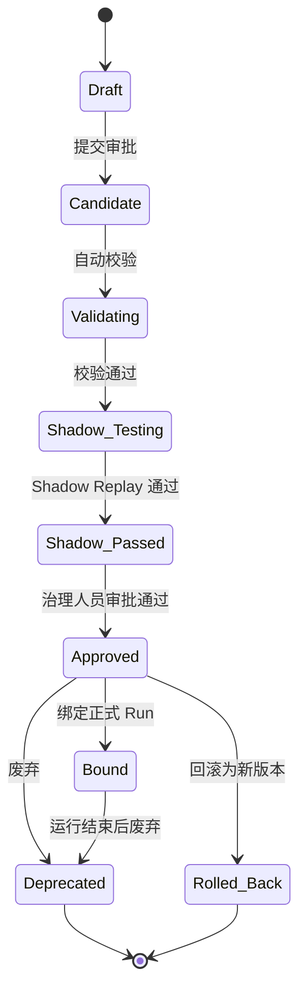
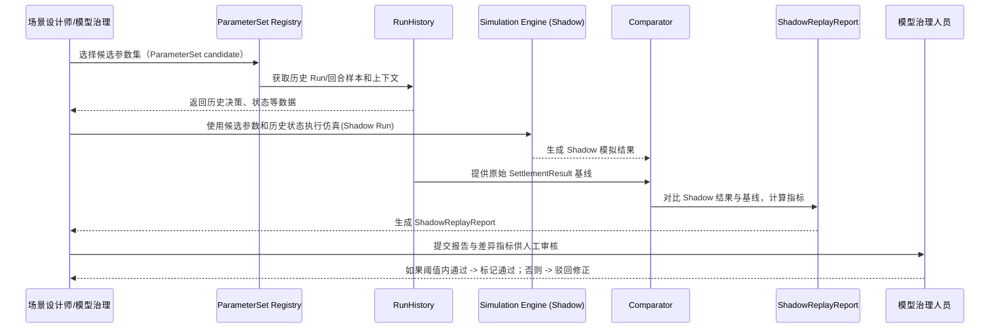
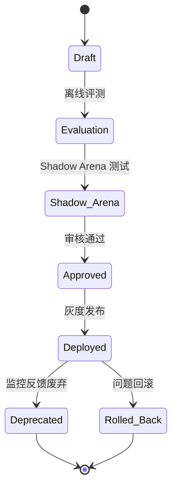

```markdown
# 参数集管理文档

## 文档信息

| 项目     | 内容                                                                      |
|----------|---------------------------------------------------------------------------|
| 文档名称 | docs/architecture/parameter-set-management.md                                               |
| 项目名称 | [项目名称]                                                                |
| 文档版本 | v1.0                                                                     |
| 文档状态 | Draft                                                                    |
| 最后更新 | YYYY-MM-DD                                                              |
| 适用范围 | 参数集管理 / 仿真结算 / Replay / 模型治理                                |
| 维护人   | 请根据实际项目修改                                                        |
| 相关文档 | docs/product/requirements.md / docs/architecture/system-architecture.md / docs/contracts/model-engineering-contract.md / docs/architecture/database-design.md |

## 执行摘要

参数集 (`ParameterSet`) 是仿真平台中所有商业结果（市场份额、销量、成本、利润、评分等）的基础治理对象。它定义了市场需求、计量系数、运营约束、财务参数和评分权重等核心数值，直接影响仿真结算的输出结果。**正式运行中使用的参数集必须被冻结**，保证结果可复算、可审计，不受后续修改干扰。参数集与场景包 (`ScenarioPackage`)、行业插件包 (`PluginPackage`) 共同构成仿真配置，上线前需通过 Shadow Replay 验证其对历史样本的一致性。参数集管理体系确保版本可追溯、变更可审计、可回滚，对维护教学公平性、仿真可信度和模型治理具有关键价值。

## ParameterSet 定义

**ParameterSet** 是封装仿真内核所有参数的实体，包含市场、计量模型、运营、财务、评分、行业扩展和冲击等参数集。它不包含业务配置、用户决策等运行时数据。`ParameterSet` 与场景包和插件包耦合：场景包确定场景上下文，插件包定义行业特异参数结构，参数集提供具体数值。仿真引擎在结算时读取冻结的 `ParameterSet` 获取真值参数。Replay/Shadow Replay 复算时也使用该参数集作为输入，确保可复算性。

| 对象            | 与 ParameterSet 的关系 | 说明                       |
|-----------------|------------------------|----------------------------|
| Run             | 绑定一个冻结参数集     | 正式运行使用的参数集       |
| ScenarioPackage | 引用参数集             | 定义场景上下文引用哪套参数 |
| PluginPackage   | 定义行业参数 Schema     | 扩展参数字段类型和必选项    |
| Simulation Engine | 读取参数集           | 结算真值计算使用           |
| ReplayReport    | 记录参数版本           | 复算报告中记录使用的参数   |
| AuditLog        | 记录参数操作           | 参数集创建/审批等操作审计  |

## 参数分类体系

`ParameterSet` 中的参数根据功能可分为以下类别：

| 参数类别       | 说明                             | 示例参数                           | 影响层级       | 是否可由教师配置 | 是否需审批 |
|--------------|--------------------------------|----------------------------------|--------------|---------------|----------|
| 市场需求参数  | 定义消费者偏好、市场规模、需求弹性等 | 价格敏感度、客户偏好权重、替代品弹性、市场容量等      | 市场层面 (L1) | 否            | 是       |
| BLP/RCNL计量参数 | 结构化模型系数与异质性参数          | 随机效用系数、产品特征系数、群体异质性参数、嵌套弹性等 | 市场层面 (L1) | 否            | 是       |
| 运营约束参数  | 产能、资源、人员效率等运营限制      | 产能上限、库存周转、人员效率、服务质量系数、风险事件概率等 | 运营层面 (L2) | 否            | 是       |
| 财务参数      | 成本、融资、税收等财务规则          | 固定成本、变动成本、折旧折旧规则、融资利率、税率、预算上限等 | 财务层面 (L3) | 否            | 是       |
| 评分参数      | 最终评分指标权重与规则             | 利润权重、市场份额权重、现金流权重、风险控制权重、服务质量权重等 | 结算层面 (L3) | 否            | 是       |
| 行业插件参数  | 特定行业场景的参数               | 床位类型、护理等级、服务包价格、医保支付比例、政策补贴、入住率参数等   | 行业扩展层   | 否            | 是       |
| 冲击事件参数  | 政策/市场/供应链等外部冲击事件强度   | 政策冲击系数、成本冲击强度、需求冲击概率、竞争者进入强度、供应链风险参数等 | 应急层面     | 否            | 是       |

以上各类参数均需经过统一审批流程方可正式生效，任何单一参数均不得直接由教师或学员随意改动，以维护公平性和可复算性。

## ParameterSet 数据结构

`ParameterSet` 的逻辑结构示例（JSON）如下所示：

```json
{
  "parameter_set_id": "<PARAMETER_SET_ID>",
  "name": "<PARAMETER_SET_NAME>",
  "version": "1.0.0",
  "status": "draft",
  "tenant_id": "<TENANT_ID>",
  "scenario_package_id": "<SCENARIO_PACKAGE_ID>",
  "plugin_package_id": "<PLUGIN_PACKAGE_ID>",
  "kernel_version": "<KERNEL_VERSION>",
  "created_by": "<USER_ID>",
  "approved_by": "<USER_ID>",
  "parameters": {
    "market": { /* 市场需求参数 */ },
    "econometric": { /* 计量模型参数 */ },
    "operations": { /* 运营参数 */ },
    "finance": { /* 财务参数 */ },
    "scoring": { /* 评分参数 */ },
    "industry": { /* 行业插件参数 */ },
    "shock": { /* 冲击事件参数 */ }
  },
  "validation_result": { /* 自动校验结果 */ },
  "replay_baseline": { /* Shadow Replay 比较基线 */ },
  "metadata": { /* 自定义元数据 */ },
  "audit_id": "<AUDIT_ID>"
}
```

说明：  
- `parameter_set_id`：参数集唯一标识。  
- `name`：参数集名称。  
- `version`：语义化版本号（详见第13节）。  
- `status`：生命周期状态（如 draft, approved, deprecated 等）。  
- `tenant_id`：租户或组织标识，多租户场景必填。  
- `scenario_package_id`：场景包 ID，关联本参数集适用的场景。  
- `plugin_package_id`：行业插件包 ID，定义参数结构。  
- `kernel_version`：仿真引擎版本号，确保计算逻辑一致。  
- `created_by` / `approved_by`：创建者、审批者用户ID。  
- `parameters`：各分类参数的具体数值配置，内部按类别分组。  
- `validation_result`：参数自动校验结果（参见第9节）。  
- `replay_baseline`：Shadow Replay 对比的基线结果数据（参见第10节）。  
- `metadata`：其他元数据或备注信息。  
- `audit_id`：关联审计记录ID，用于版本管理与审计追踪。

## 参数字段字典

下表列举了部分参数字段示例（实际项目中请根据需求补充完整），并说明字段类型、单位、范围及配置要求。示例值仅作说明用途，请根据实际项目修改：

| 参数路径                     | 参数名称             | 类型      | 单位        | 默认值    | 取值范围        | 是否必填 | 是否可配置 | 是否需审批 | 说明                     |
|-----------------------------|----------------------|----------|-----------|---------|---------------|---------|----------|---------|--------------------------|
| `market.price_sensitivity`     | 价格敏感度            | decimal  | N/A       | 0.50    | 0.00–1.00     | 是      | 是       | 是      | 消费者对价格变化的需求弹性   |
| `market.brand_preference`      | 品牌偏好权重          | decimal  | N/A       | 0.20    | 0.00–1.00     | 否      | 是       | 是      | 各品牌之间偏好的相对权重    |
| `econometric.random_coeff`     | 随机效用系数          | decimal  | N/A       | 1.000   | 0.000–+∞     | 是      | 否       | 是      | 离散选择模型中的随机系数    |
| `econometric.nesting_elasticity` | 嵌套结构弹性          | decimal  | N/A       | 0.75    | 0.00–1.00     | 否      | 是       | 是      | 嵌套 Logit 模型的组内替代弹性 |
| `operations.capacity_limit`     | 产能上限             | integer  | 单位产品    | 1000    | >=0          | 是      | 否       | 是      | 每回合最大生产能力         |
| `operations.staff_efficiency`   | 人员效率系数          | decimal  | N/A       | 0.80    | 0.00–1.00     | 否      | 是       | 是      | 员工效率对产能的加成比例    |
| `finance.fixed_cost`          | 固定成本             | decimal  | 货币单位    | 50000   | >=0          | 是      | 否       | 是      | 每回合的固定运营成本       |
| `finance.interest_rate`       | 融资利率             | decimal  | 百分比(%) | 5.00    | 0.00–100.00% | 否      | 是       | 是      | 贷款和借款的年化利率       |
| `scoring.profit_weight`        | 利润权重             | decimal  | N/A       | 0.40    | 0.00–1.00     | 是      | 否       | 是      | 最终评分中利润的权重       |
| `scoring.collaboration_weight` | 团队协作权重          | decimal  | N/A       | 0.10    | 0.00–1.00     | 否      | 是       | 是      | 评分中团队协作的权重       |
| `industry.service_price`      | 服务包价格           | decimal  | 货币单位    | 2000    | >=0          | 是      | 否       | 是      | 行业场景中单个服务包的定价  |
| `industry.subsidy_rate`       | 政策补贴比例          | decimal  | 百分比(%) | 20.00   | 0.00–100.00% | 否      | 是       | 是      | 政府或保险的补贴比例        |
| `shock.policy_impact`         | 政策冲击影响系数       | decimal  | N/A       | 1.00    | >=0          | 否      | 否       | 是      | 特定政策变动对业务的冲击强度 |
| `shock.demand_variation`      | 需求冲击概率          | decimal  | 百分比(%) | 10.00   | 0.00–100.00% | 否      | 是       | 是      | 市场需求受到外部冲击的概率   |

> **备注：** 示例字段仅展示部分典型参数。实际项目中各参数的定义、范围、单位等需根据业务模型和仿真逻辑确定。财务金额使用高精度 decimal 类型，比例和弹性使用百分比或范围[0,1]。复杂参数结构可嵌套 JSON 对象或数组。

## 参数生命周期

`ParameterSet` 的生命周期状态机如下所示，确保任何变更都有清晰流程：



| 状态          | 含义                            | 允许操作               | 禁止操作               | 进入条件                         | 退出条件             | 审计要求              |
|-------------|-------------------------------|----------------------|----------------------|--------------------------------|--------------------|--------------------|
| Draft       | 参数集草稿，可编辑、未提交审批状态        | 编辑、保存草稿、提交 Candidate | 删除已存在绑定              | 新建或从 Rolled_Back 创建新版本           | 提交 Candidate           | 记录创建者、时间、初始内容  |
| Candidate   | 已提交审批候选，等待校验            | 编辑草稿（未正式审批前）       | 不可发布 Run            | Draft 提交                          | 通过自动校验          | 记录提交者、版本     |
| Validating  | 自动校验中                        | 无                        | 不可修改               | Candidate 状态自动触发校验              | 校验完成            | 记录校验结果        |
| Shadow_Testing | Shadow Replay 验证中             | 无                        | 不可修改、不可发布 Run     | 校验通过后自动触发 Shadow Replay        | 验证通过或失败        | 记录选用样本、报告ID  |
| Shadow_Passed | Shadow Replay 验证通过           | 无                        | 不可修改、不可发布 Run     | Shadow Replay 结果满足阈值               | 治理人员审批结果      | 记录复核意见        |
| Approved    | 已批准冻结，正式参数集            | 绑定 Run、废弃、回滚       | 禁止修改原版本           | Shadow_Passed 审批通过               | Deprecated/ Rolled_Back | 记录审批者、意见    |
| Bound       | 已在正式 Run 中使用               | 无                        | 禁止删除或修改           | Approved 绑定至 Run                  | Run 结束或迁移        | 记录 Run ID、绑定时间 |
| Deprecated  | 不建议使用的新版本，保留历史       | 读取                     | 禁止发布至新 Run      | 参数集从 Approved 转为废弃状态         | —                  | 记录废弃原因、时间   |
| Rolled_Back | 被标记为回滚版本，只作为历史记录   | 读取                     | 不可修改               | 管理流程触发，将老版本标记为回滚         | —                  | 记录回滚者、关联版本 |

> **说明：** 已批准(`Approved`)的参数集不可原地修改，任何变更都需创建新版本并按照上述流程逐级审批。绑定(`Bound`)的参数集不可删除，只能通过标记废弃或回滚来停止使用。废弃(`Deprecated`)仅影响新 Run 的绑定，不影响历史回合结果的可追溯性。

## 参数创建流程

参数集的创建流程包括设计、填写、校验和提交流程。通常由场景设计师或管理员在系统中发起：

```mermaid
flowchart LR
  设计师(场景设计师) --> 创建(ParameterSet 草稿)
  创建 --> 选择Scenario[选择 ScenarioPackage]
  选择Scenario --> 选择Plugin[选择 PluginPackage]
  选择Plugin --> 加载Schema[加载参数 Schema]
  加载Schema --> 填写参数[填写参数值]
  填写参数 --> 自动校验[执行 Schema/范围 校验]
  自动校验 --> 保存Draft[保存 Draft 版本]
  保存Draft --> 提交Candidate[提交 Candidate 版本]
  提交Candidate --> 写Audit[记录审计日志]
  写Audit --> [*]
```

**流程说明：**  
1. 场景设计师在后台或设计界面创建新的 `ParameterSet` 草稿。  
2. 选择所属的场景包 (`ScenarioPackage`) 和行业插件包 (`PluginPackage`)。  
3. 系统根据所选插件加载对应的参数 Schema，自动渲染表单界面。  
4. 填写各分类参数值，系统实时进行字段校验。  
5. 保存草稿 (`draft`) 后，可继续编辑；准备好后提交成为候选版本 (`candidate`)。  
6. 系统执行自动校验并记录操作日志，然后进入审批流程。

## 参数校验规则

参数校验分为结构化校验、范围校验、兼容性校验和可运行性校验等。常见规则包括：

| 校验类型     | 校验目标            | 示例                      | 失败处理      |
|------------|-----------------|-------------------------|------------|
| Schema 校验  | 字段完整性、格式        | 缺少必填字段、类型不匹配        | 阻止提交     |
| 类型校验     | 数据类型正确性         | 非法数字、枚举值不符        | 阻止提交     |
| 范围校验     | 参数值是否在合法区间     | 百分比超出 0–100、成本为负    | 阻止提交     |
| 交叉校验     | 参数间逻辑一致性       | 销售预测 < 0 或利润权重不和谐   | 阻止提交     |
| 插件兼容性校验 | 插件包版本与参数结构匹配性 | 参数缺失或多余字段          | 阻止发布     |
| 试运行校验   | 参数能否用于仿真结算     | Dry Run 结算成功     | 记录报告，但不阻塞（可作为预警） |
| Replay 校验  | 历史复算一致性        | 与基线 SettlementResult 差异   | 标记为需要人工审查 |

> **提示：** 所有校验均记录在审核报告中，如有失败会在提交前提示用户并阻止进入下一流程。仅当所有必需校验通过，参数才可进入 Shadow Replay 和人工评审阶段。

## Shadow Replay 验证流程

上线前，任何影响仿真结果的参数变更都必须经过 **Shadow Replay** 验证。流程如下：



流程说明：  
1. 在 Shadow Replay 环节，选择待审批的参数集版本作为候选。  
2. 系统选取若干历史回合（Run）作为样本，包括输入决策和初始状态。  
3. 使用候选参数集在仿真引擎中进行**影子结算**，输出 Shadow 结果。  
4. 将 Shadow 结果与当时的真实结算结果（基线）对比，生成差异报告。  
5. 计算差异指标（如利润、销量等偏差），判断是否在可接受阈值内。  
6. 将报告提交给模型治理人员审核：阈值内者进入通过状态；否则需要调整参数或提供解释。  
7. 通过后参数集进入 `approved`；未通过则参数集保持 `candidate` 状态待修正。

> **注意：** Shadow Replay 不会修改正式结果，只作为上线前门禁。所有计算和报告必须记录到审计日志中。任何参数差异超过阈值的情况需人工分析原因。

## Replay 与可复算要求

正式运行后的 `ParameterSet` 必须保持可复算性。要求包括：  

- 正式 Run 绑定的 `parameter_set_id` 必须被永久记录，不能遗失。  
- Replay 时必须使用当时绑定的 `parameter_set_id`、`engine_version`、`plugin_package_id`、`scenario_package_id`、`random_seed` 等信息，确保与历史条件一致。  
- Replay 不得采用最新参数替代历史参数，否则失去复现效果。  
- ReplayReport 应记录复算差异指标，如有不一致需触发告警和人工检查。  
- 任何 Replay 操作都必须附带上下文信息（Run ID、参数版本等）并写入审计日志。

| Replay 依赖对象       | 是否必需 | 说明                      |
|-----------------|------|-------------------------|
| `parameter_set_id`    | 是   | 绑定当时使用的参数集          |
| `engine_version`     | 是   | 仿真引擎版本                |
| `plugin_package_id`  | 是   | 行业插件版本               |
| `scenario_package_id`| 是   | 场景包版本                 |
| `decision_version_id`| 是   | 决策逻辑/规则版本            |
| `random_seed`       | 是   | 随机数种子                |
| `settlement_result_id`| 是 | 原始结算结果 ID           |

## 参数审批流程

参数集的审批涉及多个角色和步骤。主要操作和责任人矩阵如下：

| 操作          | 场景设计师 | 教师         | 计量模型工程师 | 模型治理人员   | 平台管理员   |
|-------------|---------|------------|-------------|-------------|-----------|
| 创建 Draft   | 是      | 条件允许     | 是          | 是          | 是        |
| 提交 Candidate | 是      | 条件允许     | 是          | 是          | 是        |
| 修改 Draft   | 是      | 条件允许     | 是          | 是          | 是        |
| 审批 Approved | 否      | 否          | 建议        | 是          | 是        |
| 废弃 Deprecated | 否      | 否          | 建议        | 是          | 是        |
| 删除 Bound 参数 | 否      | 否          | 否          | 否          | 否        |

说明：  
- **场景设计师**：负责创建和提交参数草稿，与教师角色类似，但有更高权限。  
- **教师**：一般情况下不直接配置参数，只能在教学中提出建议（条件允许场景依赖）。  
- **计量模型工程师**：可参与参数制定和修改，负责参数校准和技术评估。  
- **模型治理人员**：拥有最高权限，负责最终审批、发布和废弃决策。  
- **平台管理员**：对所有操作均有权限，支持整体管理。  
- 已 `approved` 的参数仅可进入废弃或回滚流程，不可再次编辑。绑定到正式 Run 的参数集不可删除。

## 参数版本管理

所有 `ParameterSet` 均应遵循语义化版本控制规则：`MAJOR.MINOR.PATCH`。  

- **PATCH**：文档说明、注释等非关键数值修改。例如注释更正、阈值微调等（`1.0.0 -> 1.0.1`）。通常无需重新 Shadow Replay。  
- **MINOR**：对非核心权重或次要参数进行调整。例如学习权重变化、运营效率微调等（`1.0.0 -> 1.1.0`）。根据改动可能需要 Shadow Replay 验证。  
- **MAJOR**：对需求弹性、核心计量模型系数或结算逻辑进行重大变更。例如调整消费者偏好模型结构、重要参数范围变更等（`1.0.0 -> 2.0.0`）。必须重新进行全量 Shadow Replay。

示例：

| 变更类型 | 示例说明                 | 版本变化       | 是否需要 Shadow Replay |
|--------|---------------------|------------|------------------|
| PATCH   | 修正文档说明             | 1.0.0 -> 1.0.1 | 否               |
| MINOR   | 调整非关键评分权重         | 1.0.0 -> 1.1.0 | 条件需要           |
| MAJOR   | 修改需求弹性或核心结算逻辑   | 1.0.0 -> 2.0.0 | 是               |

所有版本均应可追溯并存档，支持回滚(`Rolled_Back`)到任意历史版本。

## 参数差异比较

参数修改时需生成差异报告，比对两个 `ParameterSet` 的不同之处，包括新增、删除和修改的参数。示例差异报告表格如下：

| 参数路径                   | 旧值        | 新值        | 变化类型 | 影响层级 | 是否影响结算 | 风险等级 |
|--------------------------|-----------|-----------|--------|--------|----------|-------|
| market.price_sensitivity   | 0.50      | 0.55      | 修改     | 市场层级 | 是       | 中    |
| econometric.nesting_elasticity | 0.75      | 0.75      | 无变化   | -      | 否       | 低    |
| operations.capacity_limit  | 1000      | 1200      | 修改     | 运营层级 | 是       | 中    |
| finance.fixed_cost        | 50000     | 50000     | 无变化   | -      | 否       | 低    |
| industry.new_field         | —         | 0.10      | 新增     | 行业扩展 | 是       | 高    |
| scoring.profit_weight     | 0.40      | —         | 删除     | 评分层级 | 否       | 中    |

- “变化类型”包括：新增、删除、修改；“影响层级”参考第4节分类；“是否影响结算”由业务判断；“风险等级”由模型治理人员评估。
- 必要时在报告中注明需额外 Shadow Replay 验证的改动项。

## 与 ScenarioPackage 的绑定关系

- **关联方式**：一个场景包(`ScenarioPackage`)在配置时可以关联多个候选 `ParameterSet`，供不同教学或校准场景使用。
- **默认参数**：场景发布或运行时，需要指定一个已 `approved` 的默认参数集 ID。若没有通过审批的参数集，则无法正式开启 Run。
- **场景修改**：如果修改场景包逻辑（如新增市场、产品等），通常需要创建新的参数版本与之匹配，确保参数完整性。
- **不兼容处理**：若参数集与场景包结构不匹配（如插件升级增加新字段），则该参数集不可用于该场景，需先更新参数或回退插件版本。

| 场景状态   | 可绑定参数状态           | 是否允许发布 | 说明                       |
|----------|---------------------|----------|--------------------------|
| 草稿       | draft / candidate    | 否       | 场景未发布前，可绑定候选参数，不用于正式 Run |
| 已发布     | approved            | 是       | 场景发布后，仅允许已审批参数用于 Run     |
| 已归档     | —                  | 否       | 场景结束或归档，禁止绑定新参数           |

> **注意：** 场景包的“发布”与参数集的“发布”流程相互独立，但最终运行时二者必须同时满足已批准状态。

## 与 PluginPackage 的绑定关系

- **Schema 定义**：`PluginPackage` 定义了行业特定参数的必填字段和类型，`ParameterSet` 必须符合对应插件版本的 Schema 要求。  
- **版本兼容**：如果插件升级，会变更 Schema；原有参数集需根据新版本重新校验或迁移。如果兼容性差异较大，建议废弃旧参数集并生成新版本。  
- **废弃处理**：插件废弃后，历史已绑定该插件参数的 Run 依然可复盘；但不允许创建新参数集或 Run 使用该插件。  
- **数据访问**：插件内部逻辑读取参数时只能通过 `ParameterSet` 提供的值，不得绕过或读取其他来源的运行参数。

| PluginPackage 状态 | ParameterSet 可用性     | 说明                                  |
|------------------|----------------------|---------------------------------------|
| 草稿               | 任何（仅测试用）        | 可在开发环境测试参数，仅供内部调试               |
| 已发布             | 符合 Schema 的参数集      | 正式可用，参数集需满足该版本的 Schema 要求         |
| 已废弃             | 不可用于新 Run（历史可回溯） | 不再用于新参数，原历史绑定记录保留                |

## 与核心仿真引擎的接口契约

仿真引擎只能通过只读接口获取参数集及相关快照，不允许修改任何真值或参数。具体接口权限如下：

| 接口类型         | 小模型是否可调用 | 权限       | 限制说明                       |
|---------------|--------------|----------|----------------------------|
| state_obs 查询  | 是           | 只读      | 仅限在授权范围内的数据快照              |
| state_est 查询  | 是           | 只读      | 仅限在授权范围内的估计值快照            |
| state_true 查询 | 条件允许        | 只读      | 仅限教师授权或模型治理任务使用，防止泄露真值 |
| SettlementResult 写入 | 否           | 禁止      | 只能由结构化仿真引擎结算写入            |
| ParameterSet 修改 | 否           | 禁止      | 只能通过治理流程创建新版本            |
| Replay 查询      | 是           | 只读      | 用于解释和复盘，不修改任何数据             |
| CoachOutput 写入  | 是           | 追加写    | AI 建议结果写入，需纳入审计              |

> **特别说明：** AI 小模型不得直接调用写入真值和参数的接口，所有读操作都应经过权限过滤和脱敏处理，确保安全合规。

## 教师端与学员端集成设计

### 教师端 AI 功能

- **AI 辅助点评**：教师在评分或点评过程中，系统可基于学员决策历史给出分析建议。  
- **复盘草稿生成**：系统可自动生成回合复盘草稿（“发生了什么 / 为什么会这样 / 下一步建议”），教师可编辑审核后发布。  
- **风险提示**：针对当前策略，AI 分析潜在风险点并提示给教师（例如市场变化、运营瓶颈等）。  
- **团队行为分析**：通过学习日志，AI 辅助教师识别团队决策模式和协作问题。  
- **Shadow Replay 对比解释**：展示 Shadow Replay 差异数据，帮助教师理解参数变更对结果的影响。  
- **Rubric 辅助评分**：根据 Rubric 规则，AI 给出证据质量和协作评价参考，教师可据此给分。  
- **学习诊断报告**：综合学员表现和复盘数据，AI 提供个性化学习诊断和建议。

### 学员端 AI 功能

- **策略建议**：基于当前可见经营状态，AI 提供经营策略备选建议，协助团队讨论。  
- **市场分析**：对当前市场环境（份额、弹性、趋势等）进行解读，帮助学员理解市场动态。  
- **财务解释**：分析已公布的财务数据（利润、现金流等）原因，给出解读说明。  
- **风险挑战**：模拟竞争、政策或运营挑战，对决策方案提出潜在风险清单或“反事实”问题。  
- **角色对练**：扮演不同决策角色（如竞争对手、监管者、投资者等），与学员进行虚拟对话。  
- **决策前提示**：在学员正式提交决策前提醒可能遗忘的要点或提示失衡风险。  
- **回合后复盘**：团队回合结束后，基于 AI 生成的复盘草稿和分析向学员提供反馈（需教师发布后可见）。  
- **学习推荐**：根据学员决策风格和复盘问题，推荐相关案例学习材料或练习题。

### 字段可见性差异

教师端和学员端对于 AI 输出数据的可见性不同，以确保教学过程和数据权限： 

| 输出内容       | 教师端       | 学员端       | 说明                 |
|-------------|-----------|-----------|--------------------|
| 完整复盘草稿   | 可见        | 不默认可见    | 学生需等教师审核发布后方可查看 |
| 团队策略建议   | 可见        | 本队可见     | 建议仅展示给对应团队，不跨队显示 |
| `state_true` 解释 | 条件可见    | 不可见       | 防止直接泄露未授权的真值     |
| 学习推荐       | 可见        | 可见        | 根据权限裁剪后展示      |
| Rubric 评分辅助 | 可见        | 可选展示     | 由教师决定是否向学生公开   |

## RAG 与知识库设计

- **知识库来源**：包括平台内置的行业报告、教学案例、官方文档以及经过授权的外部资源（文章、新闻、学术资料等）。  
- **授权管理**：所有知识内容必须经过版权和合规性审核，按租户或课程进行权限隔离。  
- **文档切片**：将资料拆分为语义片段，并提取元数据（来源、创建时间等），便于检索和引用。  
- **向量检索**：使用向量化索引对问题与知识库片段进行匹配，支持多轮对话检索。  
- **引用来源**：AI 输出时提供证据卡（evidence card），显示引用的文档片段和来源链接，增强解释可靠性。  
- **输出证据卡**：针对关键论点，生成带来源标记的证据卡，教师端可查看完整引用，学员端仅展示摘要或经权限裁剪的内容。  
- **内容过期策略**：知识库中的信息设置时效管理，过期或失效的数据会标记为次要，检索时优先新版本。  
- **未授权过滤**：对未经许可的内容（如版权文章、私有数据）严格过滤，不纳入检索或回答。  
- **多租户隔离**：不同租户知识库隔离存储，检索结果仅限本租户授权范围。

> **原则：** 未授权内容不得用于训练或推理增强；AI 输出建议尽量附带来源；教师端可查看完整证据卡，学员端只展示符合权限的摘要信息。

## 工具调用设计

AI 小模型可以调用一系列后端工具，以获取实时数据或执行特定任务。常见工具如下：

| 工具名称             | 功能描述                             | 可调用小模型                   | 权限        | 是否写数据库 | 审计要求      |
|-------------------|----------------------------------|-----------------------------|-----------|----------|------------|
| QueryCourseState  | 获取课程、班级、回合等上下文信息             | StrategyAdvisor、DebriefCoach、RoleAgent 等 | 只读        | 否       | 记录查询日志    |
| QueryTeamHistory  | 查询团队历史决策和提交记录                 | StrategyAdvisor、RiskRedTeam、DebriefCoach 等 | 只读        | 否       | 记录查询日志    |
| QueryPublishedResults | 查询已发布的结算结果（SettlementResult）      | FinanceCopilot、RubricJudge 等     | 只读        | 否       | 记录查询日志    |
| QueryReplayReport | 获取指定 Run 的 Replay 报告              | DebriefCoach、RiskRedTeam 等     | 只读        | 否       | 记录查询日志    |
| QueryLearningRecord | 查询学员个人或团队的学习记录和表现数据          | LearningRecommender、DebriefCoach 等 | 只读        | 否       | 记录查询日志    |
| QueryKnowledgeBase | 搜索知识库中文档片段                     | 全部 AI 小模型                    | 只读        | 否       | 记录查询日志    |
| GenerateDebriefDraft | 生成复盘分析草稿                         | DebriefCoach                  | 读（state）  | 否       | 记录调用日志    |
| GenerateLearningRec | 生成学习推荐                           | LearningRecommender             | 只读（用户记录） | 否       | 记录调用日志    |

> **说明：**  
> - 所有工具调用均经过权限检查，仅返回授权范围内数据；  
> - 写数据库操作仅限于 `CoachOutput`、`AuditLog` 等输出记录，不直接修改真值；  
> - 每次工具调用都需要记录在审计日志中，包括调用者、时间、输入参数等。

## 模型版本管理

小模型的版本生命周期如下：

```text
draft -> evaluation -> shadow_arena -> approved -> deployed -> deprecated -> rolled_back
```



| 状态         | 含义                               | 进入条件                     | 退出条件                    | 允许操作            | 禁止操作         | 审批人         | 审计要求         |
|------------|----------------------------------|---------------------------|-------------------------|-----------------|--------------|--------------|----------------|
| Draft      | 模型开发或微调中                        | 新模型代码或配置提交          | 离线评测通过                | 自由实验        | 对外服务上线     | -            | 记录版本信息      |
| Evaluation | 离线评测中                            | Draft 完成开发               | 评测指标达标                | 调整模型、日志记录   | 直接线上调度     | 研发负责人       | 记录评测结果      |
| Shadow_Arena | 与旧模型对比测试（Shadow Arena）       | Evaluation 阶段合格          | Shadow Arena 指标满足预设      | 调整模型         | 线上服务         | 评测主管       | 记录对比报告      |
| Approved   | 模型通过内部审核，可用于部署               | Shadow Arena 指标通过         | 开始灰度部署                  | 发布候选版本      | 直接生产使用     | 模型治理人员    | 记录审批意见      |
| Deployed   | 模型已部署到生产环境，开始服务             | 灰度发布并监控稳定          | 监控发现问题或新模型准备上线    | 提供线上服务      | 修改模型版本     | 运营团队       | 记录监控指标      |
| Deprecated | 模型停用，不再提供服务                   | 新模型取代或长期闲置          | 无再退出                     | 保留历史数据      | 新版本部署      | 模型治理人员    | 记录废弃时间与原因  |
| Rolled_Back | 回滚版本，用于恢复到之前稳定状态           | 发布后发现严重缺陷时触发      | 完成回滚并稳定                | 追踪差异、恢复旧版本 | 新功能上线      | 模型治理人员    | 记录回滚操作与原因  |

> **说明：**  
> - 模型版本全流程需记录审计日志，包括版本号、变更日志、评审意见等；  
> - 发布灰度时需监控性能指标，发现异常及时触发回滚；  
> - 任何一环节变更，都需按上述流程进行审批和记录，确保可追溯。

## Prompt 版本管理

- 每个任务类型应维护对应的 Prompt 模板，并进行版本控制。  
- Prompt 版本与模型版本、任务类型、场景插件版本绑定；修改 Prompt 需重新评测对话质量。  
- Prompt 修改前后都要保留历史版本，以支持对话回放和差异审计。  
- 引导词中禁止注入敏感系统信息，需经过过滤和校验。  
- 建议使用 PromptRegistry 表记录各版本信息：

| 字段           | 说明                            |
|--------------|---------------------------------|
| prompt_id     | Prompt 唯一标识                    |
| prompt_version| Prompt 版本号                      |
| task_type     | 任务类型                          |
| model_name    | 绑定模型名称                       |
| plugin_version| 绑定插件版本号（如有行业插件）          |
| status        | 状态（Draft/Candidate/Approved）    |
| created_by    | 创建人                           |
| approved_by   | 审批人                           |
| audit_id      | 审计记录标识                       |

## 模型治理与发布流程

模型和参数的发布流程通常包括以下阶段：  
- **离线评测**：对新模型/参数使用历史数据进行完整测试，检查性能指标；  
- **Shadow Arena**：与旧模型/参数在隔离环境进行对比，评估表现差异；  
- **人工审核**：治理人员审核评测报告和 Shadow 结果，决定是否推进；  
- **灰度发布**：先在有限范围内进行在线测试，实时监控稳定性；  
- **监控与回滚**：上线后监控系统，如果出现异常指标，立即触发回滚；  
- **正式发布**：确认无问题后全面替换旧版本；  
- **下线**：将旧版本标记为废弃。

```mermaid
flowchart LR
  Dev[开发/训练新模型/参数] --> Test[离线评测 (Offline Test)]
  Test --> ShadowArena[Shadow Arena 对比]
  ShadowArena --> Review[人工审核与评估]
  Review --> GrayRelease[灰度发布]
  GrayRelease --> Monitor[在线监控]
  Monitor -->|稳定| Production[正式发布]
  Monitor -->|异常| Rollback[回滚部署]
  Rollback --> Update[记录日志，通知]
  Production --> End([结束])
  Rollback --> End
```

> **说明：** 每一步均需生成报告并记录审计日志，只有评估通过方可进入下一阶段。Shadow Arena 是上线前关键门禁。上线后持续监控，及时回滚保证系统安全性。

## 测试与验证体系

| 测试类型       | 测试目标                       | 示例用例                     | 通过标准                   |
|------------|--------------------------|--------------------------|------------------------|
| 单元测试       | 验证输入输出格式、字段校验         | 提交缺失字段的参数集或不符类型   | 校验失败并给出明确错误     |
| 集成测试       | 验证 API、RAG、工具调用正确      | 调用 `GenerateDebriefDraft` 测试  | 输出结构正确且合理       |
| 权限测试       | 验证边界内无法越权读取或写入       | 通过学员账号调用管理员接口       | 返回权限拒绝            |
| AI 边界测试    | 验证 AI 不会写入真值/参数集       | AI 建议不包含修改参数的指令     | 不存在 `state_true` 直接修改  |
| Replay 测试    | 验证复盘结果与历史结算一致       | 使用绑定参数复算历史 Run       | 差异在允许阈值内        |
| Shadow Replay 测试 | 验证新参数上线前差异控制       | 对比候选参数与基线 Settlement   | 所有指标通过设定阈值      |
| 安全测试       | 防范 Prompt 注入与数据泄露       | 输入恶意构造对话进行测试       | 未泄露敏感内容，拒绝注入  |
| 质量评测       | 评估建议和解释质量               | 评分相关示例生成和反馈        | 建议符合业务逻辑，解释清晰 |

## 评测指标体系

| 指标             | 定义                              | 计算方式                                 | 目标值        | 适用模型           |
|----------------|---------------------------------|---------------------------------------|------------|-----------------|
| 建议相关性        | AI 建议与当前任务目标的匹配程度         | 人工标注相关度得分                         | ≥80%      | Strategy Advisor 等 |
| 解释准确性        | AI 给出的原因与真值结果的一致度         | 人工审核对比 AI 解释和实际结算差异             | ≥90%      | Finance Copilot 等 |
| 证据质量         | 引用文献或数据源的可信度与相关性         | 证据来源评分平均值                         | ≥4/5      | Market Analyst 等  |
| 风险覆盖率       | 风险建议中覆盖潜在问题的比例            | 检出实际案例中风险项比例                    | ≥95%      | Risk Red Team    |
| 复盘清晰度        | 复盘报告条理性与可理解程度             | 教师打分或自动评分                         | ≥4/5      | Debrief Coach    |
| 角色一致性        | 角色模拟中语气与观点与实际角色匹配度       | 教师或专家评估                              | ≥85%      | Role Agent      |
| 教师采纳率        | 教师使用 AI 建议并采纳的比例            | 教师最终方案与 AI 初步建议匹配度              | ≥50%      | 全部模型           |
| 学员满意度        | 学员对 AI 辅助效果的主观评价           | 调查评分                                   | ≥4/5      | 全部模型           |
| 越权率           | AI 输出中包含未经授权信息的比例         | 自动检测或人工审查违规输出次数占比            | 0%        | 全部模型           |
| 幻觉率           | AI 输出与真实数据不符或编造信息的比例      | 人工审查虚假信息条目次数比例                   | ≤5%       | 全部模型           |
| 审计完整率        | 模型调用和操作日志的记录完整度          | 审计日志条目/调用次数                      | 100%      | 全平台            |
| Replay 稳定性    | 重放结果与原始结果的匹配程度           | 复算差异指标                              | ≥95%      | 结算核算逻辑        |
| ShadowReplay 通过率 | 候选参数 Shadow 验证通过比例          | 通过次数/尝试次数                           | ≥90%      | ParameterSet 管理  |

## 数据存储设计

主要与参数集管理相关的数据对象如下：

| 数据对象           | 说明                           | 关键字段                                | 写入方式        | 保留策略    |
|----------------|------------------------------|-------------------------------------|-------------|----------|
| ParameterSet   | 参数集核心实体                     | parameter_set_id, version, parameters, status, approved_by, audit_id | 版本化写入      | 永久保留     |
| ParameterSchema | 参数 Schema 定义                | plugin_package_id, schema_definition   | 创建/修改     | 除非插件变更，长期保留 |
| ParameterVersion | 参数版本信息（历史记录）           | parameter_set_id, version, create_time, notes | 追加写入      | 永久保留     |
| ParameterValidationReport | 参数校验结果报告          | parameter_set_id, validation_result       | 追加写入      | 短期保留（如问题需留存） |
| ParameterDiffReport | 参数差异比较报告              | old_version, new_version, diff_details   | 追加写入      | 长期保留     |
| ParameterApprovalRecord | 审批记录                 | parameter_set_id, approver, action, comments | 追加写入      | 永久保留     |
| ShadowReplayReport | Shadow Replay 验证报告        | parameter_set_id, baseline_run_id, diff_metrics, passed | 追加写入      | 永久保留     |
| AuditLog       | 审计日志记录                     | trace_id, action, actor, timestamp, details | 追加写入      | 永久保留     |
| CoachOutput    | AI 小模型输出（建议/分析）         | output_id, model_name, request_context, content, requires_review | 追加写入      | 可根据策略保留 |
| ModelCallLog   | AI 模型调用日志                  | call_id, model_name, prompt_version, duration | 追加写入      | 短期归档/监控 |
| EvidenceCard   | 证据卡片                        | card_id, source, excerpt, relevance_score | 追加写入      | 长期保留     |
| RiskChallenge  | 风险挑战建议                    | challenge_id, content, related_risks        | 追加写入      | 长期保留     |
| DebriefDraft   | 复盘草稿                        | draft_id, content, created_by              | 追加写入      | 长期保留     |
| LearningRec    | 学习推荐记录                    | rec_id, user_id, course_id, recommendations | 追加写入      | 长期保留     |
| RubricAssessment | 评分辅助结果                  | assessment_id, criteria_scores, comments   | 追加写入      | 长期保留     |
| AIInteractionEvent | AI 交互事件（用户触发）       | event_id, user_id, action_type, timestamp   | 追加写入      | 短期归档     |

> **写入方式说明：** 以上表均采用追加写入方式，不删除历史记录。主键通常为组合键如 `(parameter_set_id, version)`。审计日志、调用日志等以只追加方式记录所有操作历史。

## API 需求概览

与参数集管理相关的后端接口示例如下：

| API 编号     | 方法   | 路径                              | 描述              | 权限           | 是否幂等 | 优先级 |
|-----------|------|---------------------------------|-----------------|--------------|-------|-----|
| API-PARAM-001 | POST | /api/parameter-sets             | 创建参数集             | 场景设计师         | 否    | P0  |
| API-PARAM-002 | GET  | /api/parameter-sets            | 查询参数集列表或详情       | 授权用户         | 是    | P0  |
| API-PARAM-003 | POST | /api/parameter-sets/{id}/validate | 参数集校验             | 场景设计师/模型治理  | 否    | P0  |
| API-PARAM-004 | POST | /api/parameter-sets/{id}/shadow-replay | 发起 Shadow Replay    | 模型治理人员       | 否    | P0  |
| API-PARAM-005 | POST | /api/parameter-sets/{id}/approve    | 审批并发布参数集         | 模型治理人员       | 否    | P0  |
| API-PARAM-006 | POST | /api/parameter-sets/{id}/deprecate   | 废弃参数集             | 模型治理人员       | 否    | P1  |
| API-PARAM-007 | GET  | /api/parameter-sets/{id}/diff       | 查询参数差异报告         | 授权用户         | 是    | P1  |
| API-PARAM-008 | GET  | /api/parameter-sets/schema/{id}     | 获取参数 Schema         | 场景设计师/管理员    | 是    | P1  |

**示例说明：**  
- `/api/parameter-sets` POST：请求体包含 `name, scenario_package_id, plugin_package_id, parameters` 等字段，响应返回新建的 `parameter_set_id`。  
- `/api/parameter-sets/{id}/validate`：请求触发系统执行自动校验，返回校验结果和建议。  
- `/api/parameter-sets/{id}/shadow-replay`：请求体提供样本 Run 列表，触发 Shadow Replay，返回报告 ID。  
- `/api/parameter-sets/{id}/approve`：执行参数审批，状态改为 `approved`。  
- 错误码：常见如 400 (Bad Request)、403 (Forbidden)、404 (Not Found)、409 (Conflict) 等，需在文档中详细列出。  
- 所有操作必须记录审计日志，包括请求参数、调用者、时间戳和请求 ID。

## 风险与缓解措施

| 风险                       | 影响                     | 缓解措施                                  |
|--------------------------|------------------------|----------------------------------------|
| 参数未冻结导致结果不可复算         | Replay 失败，影响公平性       | 严格执行审批冻结流程，校验 Run 绑定时参数状态          |
| 教师误改正式参数               | 数据不一致，仿真逻辑受损       | 参数编辑仅草稿级别，审批后只读；所有写操作审批记录         |
| AI 小模型越权改参              | 非授权更改参数破坏结果公平     | 接口网关拦截参数写操作，AI 仅可读部分裁剪数据          |
| 插件参数 Schema 不兼容        | 新旧参数无法互换，导致仿真异常   | 插件升级时强制旧参数校验，不兼容参数集禁止使用        |
| Shadow Replay 未执行          | 不可预测的上线风险         | 上线前作为必经门禁，未通过不允许发布                |
| 参数范围不合理导致结算异常      | 结算结果扭曲或溢出异常       | 参数范围校验和干预，如超限提示、自动回退安全值         |
| 参数版本与场景版本不匹配       | 场景无法运行或结果错误       | 场景发布时校验绑定参数版本一致，强制更新参数或回退场景版本   |
| 多租户参数泄露              | 数据隔离失败导致安全风险     | 严格租户隔离和权限控制，所有数据访问基于租户和角色认证     |
| 参数缺失导致结算失败          | 系统错误，无法产生结果       | Schema 校验阻止发布缺少字段的参数集，异常报警处理       |
| 参数过度复杂影响教学理解       | 学员困惑，教学效果下降       | 参数结构优化，提供简化示例和文档，逐步引入新参数        |

## 开发任务拆解

| 任务编号   | 任务名称           | 所属模块         | 优先级 | 依赖              | 验收标准                                            |
|---------|----------------|--------------|----|----------------|----------------------------------------------|
| T01     | ParameterSet 数据模型    | 后端核心模块       | P0 | 无               | 定义数据库表并能成功创建、更新、查询参数集                         |
| T02     | Parameter Schema 定义    | 后端核心模块       | P0 | T01             | 根据 PluginPackage 自动生成参数表单字段定义                       |
| T03     | 参数集 CRUD 接口        | 后端 API         | P0 | T01, T02       | RESTful 接口创建/查询/更新/删除参数集（草稿状态）               |
| T04     | 参数版本管理          | 后端服务         | P0 | T03             | 支持参数版本号语义化管理，禁止已发布版本覆盖，自动生成新版本           |
| T05     | 参数校验服务         | 后端校验模块       | P0 | T03             | Schema校验、范围校验、交叉校验等通过接口触发并返回详细结果            |
| T06     | 参数差异比较          | 后端校验模块       | P1 | T04, T05       | 提供两个参数集的差异对比报告                                       |
| T07     | 参数审批服务         | 后端工作流/治理模块   | P0 | T05, T04       | 实现参数提交、Shadow Replay 触发、审批通过/驳回流程                 |
| T08     | Shadow Replay 触发流程  | 后端仿真集成模块     | P1 | T05             | 支持通过 API 发起 Shadow Replay 并返回报告                         |
| T09     | ParameterSet 与 Run 绑定 | 后端仿真编排模块     | P0 | T03, T07       | Run 创建时必须绑定 `approved` 参数集，接口校验并记录日志             |
| T10     | ParameterSet 与 Scenario 绑定 | 后端场景配置模块     | P0 | T03, T07       | 场景创建/发布时可选择参数集并校验状态，发布前必须绑定版本             |
| T11     | ParameterSet 与 Plugin 绑定   | 后端场景配置模块     | P0 | T03, T02, T07   | 插件版本升级需校验参数兼容性，旧版本参数继续支持历史环境             |
| T12     | 参数审计日志           | 后端审计模块       | P0 | 其他后端模块      | 所有操作写入 `AuditLog`，包含 actor、action、traceID 等             |
| T13     | 教师端参数选择页面       | 前端教师模块       | P1 | T03, T09       | 提供参数集列表和详情供教师选择，显示状态、版本、绑定场景等            |
| T14     | 治理端审批页面         | 前端管理员模块     | P1 | T07, T08       | 提交 Shadow Replay 后显示结果和差异，支持审批通过/驳回              |
| T15     | 参数权限控制          | 后端安全模块       | P0 | T12             | 基于租户/角色控制参数集访问，只允许授权用户操作                         |
| T16     | 参数集测试用例        | 测试模块         | P0 | 全部后端模块      | 编写单元和集成测试覆盖所有功能点，确保稳定性                         |

## MVP 范围建议

**MVP 必做：**  
- 定义 `ParameterSet` 基础数据模型和存储结构。  
- 建立参数分类结构（market、econometric、operations、finance、scoring、industry、shock）。  
- 实现参数集创建和草稿保存功能。  
- 参数 Schema 校验功能（字段完整性、类型、范围）。  
- 版本号规则并支持简单版本管理。  
- 参数审批状态支持（draft/candidate/approved）。  
- Run 创建时绑定经批准的参数集，并禁止覆盖。  
- 基础审计日志记录参数操作。  
- 基础的 Replay 依赖记录（记录参数集ID等上下文）。

**P1 增强：**  
- 引入 Shadow Replay 验证功能。  
- 参数差异对比报告和可视化。  
- 完整参数审批工作流（校验、Shadow、人工审核）。  
- 参数回滚功能实现。  
- 插件 Schema 联动校验。  
- 教师端参数预览界面。  
- 治理端参数审批和差异显示界面。

**P2 扩展：**  
- 自动参数校准与优化建议工具。  
- 参数敏感性分析与热图展示。  
- 参数版本对比可视化工具。  
- 多行业参数模板库。  
- 企业定制参数脱敏发布工具。

## 附录：示例 ParameterSet JSON

以下示例展示了 `ParameterSet` 的通用结构（使用占位符数据）：

```json
{
  "parameter_set_id": "param_set_001",
  "name": "医疗健康行业示例参数集",
  "version": "1.0.0",
  "status": "approved",
  "tenant_id": "tenant_123",
  "scenario_package_id": "scenario_healthcare_1.0",
  "plugin_package_id": "plugin_healthcare_1.0",
  "kernel_version": "simwar_engine_v2.0",
  "created_by": "user_xyz",
  "approved_by": "governance_user",
  "parameters": {
    "market": {
      "price_sensitivity": 0.45,
      "brand_preference": [0.2, 0.8],
      "market_capacity": 100000
    },
    "econometric": {
      "random_coeff": 1.2,
      "nesting_elasticity": 0.65
    },
    "operations": {
      "capacity_limit": 5000,
      "staff_efficiency": 0.9
    },
    "finance": {
      "fixed_cost": 200000.00,
      "interest_rate": 4.50
    },
    "scoring": {
      "profit_weight": 0.35,
      "market_share_weight": 0.30,
      "collaboration_weight": 0.05
    },
    "industry": {
      "bed_count": 300,
      "service_price": 1500,
      "subsidy_rate": 25.0
    },
    "shock": {
      "policy_impact": 1.00,
      "supply_chain_risk": 5.0
    }
  },
  "validation_result": {
    "schema_check": "pass",
    "range_check": "pass",
    "consistency_check": "pass"
  },
  "replay_baseline": {
    "shadow_replay_report_id": "sr_2026_0001",
    "profit_difference": 0.02,
    "sales_difference": 0.01
  },
  "metadata": {
    "description": "初始医疗场景参数集",
    "notes": "无"
  },
  "audit_id": "audit_2026_0001"
}
```

上述示例中的数值仅为占位符，实际使用时需根据业务模型和场景需求进行调整。
