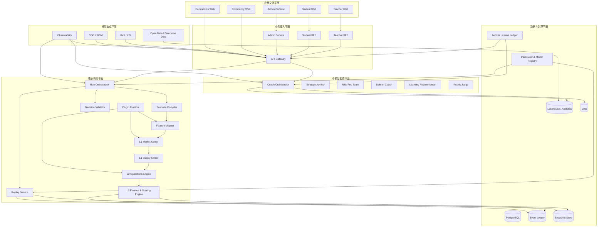
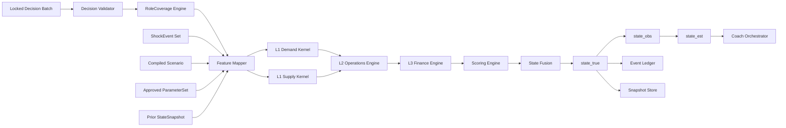
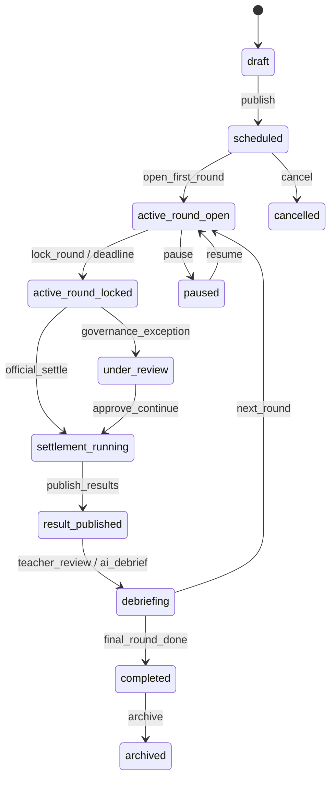
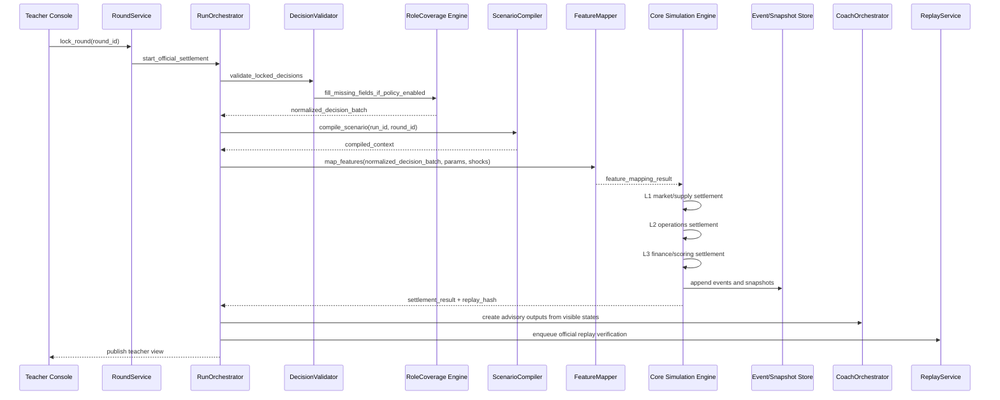
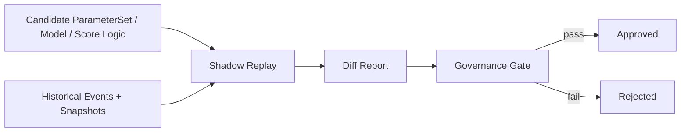
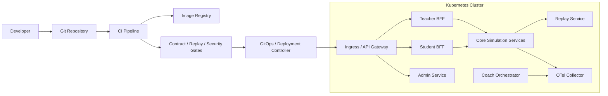

# SimWar docs/architecture/system-architecture.md

## 文档信息与架构结论

### 文档信息

| 项目       | 内容                                                                                                                                                                                                 |
| ---------- | ---------------------------------------------------------------------------------------------------------------------------------------------------------------------------------------------------- |
| 文档名称   | `docs/architecture/system-architecture.md`                                                                                                                                                           |
| 文档版本   | `v2.0 Final`                                                                                                                                                                                         |
| 文档状态   | 最终优化版                                                                                                                                                                                           |
| 适用范围   | SimWar SaaS 平台、核心仿真引擎、教师端、学员端、管理后台、AI 小模型体系、行业插件体系、学习记录与治理体系                                                                                            |
| 目标读者   | 系统架构师、平台工程负责人、前后端研发、算法/计量团队、测试团队、运维与安全团队、产品与教学设计团队                                                                                                  |
| 约束优先级 | P0 为不可妥协约束，P1 为架构级强约束，P2 为工程治理约束                                                                                                                                              |
| 命名规范   | 服务与实体采用 PascalCase；JSON 字段采用 `snake_case`；HTTP 路径采用 `kebab-case`；主键统一为 `<entity>_id`；版本统一使用 semver；状态视图仅使用 `state_true`、`state_obs`、`state_est` 三个正式术语 |

本版文档以已生成的 docs/architecture/system-architecture.md 草案为基础，统一吸收核心引擎、小模型体系、计量工程契约、行业无关 Kernel 与行业 Plugin 架构、康养行业样例、教师端/学员端深化、README 与 Requirements 的共识，将 SimWar 收口为一个“核心真值引擎唯一写、AI 小模型只读建议、ParameterSet 正式运行不可变、Replay/Shadow Replay 强门禁、Kernel 稳定且 Plugin 可扩展”的仿真操作系统。fileciteturn0file1 fileciteturn0file2 fileciteturn0file4 fileciteturn0file5 fileciteturn0file10 fileciteturn0file11 fileciteturn0file12 fileciteturn0file13

### 执行摘要

SimWar 的核心不是“叠加更多智能体”，而是明确“谁可以写什么、何时可以写、写入后如何回放与审计”。平台正式真值由 Core Simulation Engine 在 L1–L3 层生成，小模型体系位于 L4，只能读取授权快照、结构化诊断和受控工具结果，输出建议卡、风险提示、复盘草稿、证据卡与学习推荐，不得直接改写市场份额、销量、现金流、利润、最终分数、排名或 ParameterSet。L5 负责 ParameterSet 冻结、模型版本治理、Replay / Shadow Replay、审批、发布、回滚和审计。BLP / RCNL 仅承担 L1 市场真值层中的需求与供给求解，不替代运营结算、财务结算与评分引擎。fileciteturn0file1 fileciteturn0file2 fileciteturn0file4 fileciteturn0file7 fileciteturn0file11 fileciteturn0file13

### 架构目标与非目标

| 类型     | 说明                                                                                                                                                                                                       |
| -------- | ---------------------------------------------------------------------------------------------------------------------------------------------------------------------------------------------------------- |
| 架构目标 | 支持多租户 SaaS 交付；支持教师端、学员端、管理端、社区与竞赛扩展；支持行业无关 Kernel 与行业 Plugin 解耦；支持课程、Run、Round、Replay、学习诊断与 AI 教练闭环；支持审计、内容授权治理、模型治理与灰度发布 |
| 业务目标 | 用结构化仿真真值驱动学习，而不是只做问答式 AI；让课堂教学、企业培训、复盘诊断、社区协作和竞赛运营复用同一套核心内核                                                                                        |
| 工程目标 | Contract-first、Replayable、Deterministic、Auditable、Evolvable、Multi-tenant、Plugin-ready                                                                                                                |
| 非目标   | 不允许小模型替代正式真值引擎；不允许教师在正式 Run 中直接改写成绩；不允许把行业字段硬编码进 Kernel；不允许把未授权内容默认纳入训练、索引或公开外显；不将教师沙盒结果混同为正式成绩                         |

以上目标与非目标来自 Requirements、README、核心引擎深化报告、计量工程契约与行业插件研究中对平台边界的一致定义。fileciteturn0file1 fileciteturn0file2 fileciteturn0file8 fileciteturn0file9 fileciteturn0file12 fileciteturn0file13

### 不可变架构约束

| 约束                        | 约束级别 | 强制要求                                                                                                                              |
| --------------------------- | -------- | ------------------------------------------------------------------------------------------------------------------------------------- |
| 核心仿真引擎唯一写真值      | P0       | 只有 L1–L3 结构化引擎可写 `state_true`、正式 `SettlementResult`、正式 `Score`、`Rank`                                                 |
| AI 小模型只读边界           | P0       | AI 只能读取裁剪后的 `state_obs` / `state_est`、授权知识与工具输出；只能写 `CoachOutput`、`DraftDebrief`、`risk_card` 等 advisory 结果 |
| ParameterSet 不可变         | P0       | `approved` 的 ParameterSet 不可覆盖；Run 启动后绑定 `parameter_set_id`，运行期间不可变更                                              |
| Replay / Shadow Replay 门禁 | P0       | 正式结果必须可 Replay；候选参数、候选模型、候选评分逻辑必须先过 Shadow Replay 才能晋级                                                |
| Kernel 稳定、Plugin 可扩展  | P0       | Kernel 只包含通用对象、通用流程、通用真值链；行业差异进入 Plugin hook 与 ScenarioPackage                                              |
| BLP / RCNL 定位             | P0       | BLP / RCNL 位于 L1 市场真值层，只负责需求、供给、弹性、替代、加价率与反事实，不负责运营、财务和评分                                   |
| 事件溯源与双账本            | P1       | 正式 Run 同时保存 Event Ledger 与 State Snapshot Ledger，支持审计、回放与前台查询                                                     |
| 正式运行与沙盒物理隔离      | P1       | Teacher Sandbox、Counterfactual Sandbox、Shadow Replay 与 Official Settlement 物理隔离、逻辑隔离、数据标识隔离                        |
| 授权血缘可追踪              | P1       | 授权内容、向量索引、训练样本、模型版本必须绑定 `license_record_id` 与用途边界                                                         |
| 公共面品牌边界              | P2       | 未单独授权时，公开社区、公开竞赛、市场传播与产品 UI 不得外显受限制品牌背书或受限制原文内容                                            |

这些约束分别来自核心引擎与小模型体系深化报告、计量核心模型工程契约、三大平台融合研究、康养插件研究与 Requirements 的统一约束。fileciteturn0file1 fileciteturn0file2 fileciteturn0file4 fileciteturn0file5 fileciteturn0file7 fileciteturn0file13

## 总体架构与分层边界

### 总体架构总览

SimWar 在视图上同时采用“四层五区/六平面”和“L1–L5 写权限分层”两套坐标系。前者用于表达平台产品与工程全貌，后者用于确保真值、建议、治理之间的严格隔离。这两套坐标不是重复设计，而是同一个架构从“产品交付”与“写权限治理”两个角度的正交表达。fileciteturn0file1 fileciteturn0file8 fileciteturn0file9 fileciteturn0file12



### 六平面定义

以下平面划分综合了核心引擎、小模型、教师端/学员端和整体功能深化文档，用于指导团队按职责拆分模块与团队边界。fileciteturn0file1 fileciteturn0file8 fileciteturn0file9

| 平面           | 主要职责                                                           | 核心模块                                                                                                                            |
| -------------- | ------------------------------------------------------------------ | ----------------------------------------------------------------------------------------------------------------------------------- |
| 应用交互平面   | 承接教师端、学员端、管理后台、社区与竞赛的体验与交互               | Teacher Web、Student Web、Admin Console、Community Web、Competition Web                                                             |
| 核心仿真平面   | 承接 Run 生命周期、状态迁移、真值计算、回合结算与结果发布          | Run Orchestrator、Scenario Compiler、Decision Validator、Feature Mapper、Market Kernel、Operations Engine、Finance & Scoring Engine |
| 小模型协作平面 | 承接策略建议、风险挑战、角色互动、复盘草稿、学习推荐与教师辅助评分 | Strategy Advisor、Risk Red Team、Role Agent、Debrief Coach、Learning Recommender、Rubric Judge                                      |
| 数据与学习平面 | 承接事件、快照、学习记录、分析指标、特征与湖仓                     | Event Ledger、Snapshot Store、LRS、Lakehouse、Feature Recipes                                                                       |
| 授权与治理平面 | 承接内容授权、模型发布、参数审批、审计、输出防护与品牌边界         | Parameter Registry、Model Governance、Audit Ledger、Licensed Content Zone                                                           |
| 外部集成平面   | 承接 LMS、身份、外部数据与企业系统对接                             | LTI、SCIM、SSO、HRIS、开放数据 API                                                                                                  |

### L1–L5 写权限架构

L1–L5 是 SimWar 最重要的治理轴线。本版强制将写权限收敛到下表，不允许跨层绕写。fileciteturn0file2 fileciteturn0file4 fileciteturn0file5 fileciteturn0file7

| 层级              | 定义                                       | 可写对象                                                           | 典型模块                                               | 严禁写入                             |
| ----------------- | ------------------------------------------ | ------------------------------------------------------------------ | ------------------------------------------------------ | ------------------------------------ |
| L1 市场真值层     | 需求/供给/替代/加价率/反事实               | 需求真值、供给真值、中间求解结果                                   | BLP / RCNL / Logit / Supply Kernel                     | 最终运营台账、财务总账、最终评分     |
| L2 运营约束层     | 产能、库存、服务质量、资格、人员与政策约束 | 运营状态、资格约束、容量消耗、风险事件                             | Operations Engine、Qualification Rules、Plugin Runtime | 正式成绩、ParameterSet               |
| L3 财务与评分层   | 财务结算、评分、排名、账本                 | `SettlementResult`、`FinanceLedger`、`Score`、`Rank`               | Finance Engine、Scoring Engine                         | 原始市场求解参数、AI 输出            |
| L4 小模型与交互层 | 建议、解释、角色互动、推荐                 | `CoachOutput`、`debrief_draft`、`risk_card`、`recommendation_list` | Strategy Advisor、Debrief Coach、Learning Recommender  | `state_true`、正式成绩、ParameterSet |
| L5 校准与治理层   | 参数、模型、回放、审批、发布与回滚         | Parameter 状态、ModelVersion 状态、ReplayReport、审批记录          | Parameter Registry、Replay Service、Model Governance   | 历史正式成绩覆盖写                   |

### Kernel 与 Plugin 边界

Kernel 负责通用对象模型、通用回合逻辑、通用真值链、通用财务与评分、通用回放与治理。Plugin 负责行业上下文编译、资格规则、效用修正、客群迁移、政策成本、冲击映射等可扩展逻辑。行业差异必须进入 Plugin，而不是改写 Kernel 的核心求解流程。BLP / RCNL 只在 Kernel 的 L1 市场真值链中承担市场求解职责，不负责行业政策、运营规则和评分细则。fileciteturn0file0 fileciteturn0file2 fileciteturn0file4 fileciteturn0file5 fileciteturn0file7

| 类型           | 归属                     | 示例                                                                                                                 |
| -------------- | ------------------------ | -------------------------------------------------------------------------------------------------------------------- |
| 通用对象与流程 | Kernel                   | Market、Offer、Segment、Run、Round、Decision、ShockEvent、StateSnapshot、SettlementResult                            |
| 通用引擎       | Kernel                   | Decision Validator、Feature Mapper、Market Solver、Operations Engine、Finance Engine、Scoring Engine、Replay Service |
| 行业差异逻辑   | Plugin                   | 康养床位/房型、护理等级、服务包规则、资格校验、政策补贴、探视半径、护理人效约束                                      |
| 行业模板输出   | Plugin + ScenarioPackage | 行业场景初始市场、行业参数模板、行业可见性策略、行业 Shock 模板                                                      |

## 核心服务、领域模型与数据架构

### 核心服务边界

以下服务边界以核心引擎深化报告、计量工程契约、README 推荐仓库结构与教师端/学员端蓝图统一收口。fileciteturn0file1 fileciteturn0file2 fileciteturn0file8 fileciteturn0file12

| 服务               | 职责                                      | 读写边界                     | 关键输出                             |
| ------------------ | ----------------------------------------- | ---------------------------- | ------------------------------------ |
| APIGateway         | 外部入口、认证、限流、审计注入            | 不写真值，只转发与鉴权       | `trace_id`、身份上下文               |
| TeacherBFF         | 教师端聚合接口                            | 不写真值；写教师操作命令     | 教师工作台 DTO                       |
| StudentBFF         | 学员端聚合接口                            | 不写真值；写决策草稿/提交    | 学员驾驶舱 DTO                       |
| AdminService       | 租户、用户、审批、导出                    | 不写正式成绩                 | 管理视图、审批结果                   |
| RunOrchestrator    | 管理 Run / Round 生命周期                 | 写状态机、调度、命令事件     | `run_status`、`round_status`         |
| ScenarioCompiler   | 编译 `ScenarioPackage` 与 `PluginContext` | 写编译结果，不写正式成绩     | `compiled_scenario`                  |
| DecisionValidator  | 结构化校验、预算约束、截止规则            | 写校验报告，不写真值         | `validation_report`                  |
| FeatureMapper      | 业务字段转计量字段，生成映射痕迹          | 写 `FeatureMappingResult`    | `x1/x2/x3`、`mapping_trace`          |
| MarketSolver       | L1 市场真值求解                           | 写市场中间真值               | share、elasticity、diversion、markup |
| OperationsEngine   | L2 运营与资格约束结算                     | 写运营状态                   | 产能、库存、资格、服务风险           |
| FinanceScoreEngine | L3 财务、评分、排名                       | 写正式结果                   | `SettlementResult`、`Score`、`Rank`  |
| ReplayService      | Replay / Shadow Replay / Diff             | 写报告，不覆盖正式结果       | `ReplayReport`                       |
| ParameterRegistry  | 参数集与场景参数治理                      | 写参数状态，不写正式成绩     | `ParameterSet` 状态流转              |
| ModelGovernance    | 模型版本评测、Shadow Arena、灰度发布      | 写模型状态、审批链           | `ModelVersion` 状态                  |
| CoachOrchestrator  | 编排 AI 小模型、工具调用、输出裁剪        | 只写 advisory 结果           | `CoachOutput`                        |
| LRSAnalytics       | 学习记录、能力画像、诊断报告              | 不写真值                     | `LearningRecord`、诊断报告           |
| ContentGovernance  | 授权内容与品牌边界控制                    | 写 `license_record_id`、审计 | 授权清单、导出控制                   |

### 真值结算主链

真值计算链必须是可测试的稳定 pipeline。任何子引擎只能消费上游的结构化输出，不允许读取小模型自由文本并直接参与正式结算。fileciteturn0file1 fileciteturn0file2



### Canonical Domain Model

SimWar 的可扩展性来自 Canonical Domain Model，而不是把某个行业字段直接写死在求解核中。最小可用领域对象应统一如下。fileciteturn0file2 fileciteturn0file4 fileciteturn0file12 fileciteturn0file13

| 实体             | 说明                   | 关键字段                                                              |
| ---------------- | ---------------------- | --------------------------------------------------------------------- |
| Tenant           | 多租户主体             | `tenant_id`, `name`, `isolation_mode`, `status`                       |
| User             | 用户主体               | `user_id`, `tenant_id`, `status`                                      |
| UserRoleBinding  | 角色绑定               | `user_id`, `role_id`, `scope_type`, `scope_id`                        |
| Course           | 课程/班级              | `course_id`, `tenant_id`, `scenario_package_id`, `status`             |
| Run              | 一次完整赛局实例       | `run_id`, `course_id`, `parameter_set_id`, `seed`, `status`           |
| Round            | 回合实例               | `round_id`, `run_id`, `round_no`, `status`                            |
| Team             | 队伍与队内角色         | `team_id`, `course_id`, `role_map`, `status`                          |
| Decision         | 团队决策               | `decision_id`, `round_id`, `team_id`, `payload`, `version`            |
| ScenarioPackage  | 场景包                 | `scenario_package_id`, `template_id`, `plugin_package_ids`, `version` |
| PluginPackage    | 行业插件               | `plugin_package_id`, `plugin_type`, `version`, `approval_status`      |
| ParameterSet     | 真值参数集             | `parameter_set_id`, `model_family`, `version`, `status`               |
| ShockEvent       | 教师注入或系统生成冲击 | `shock_id`, `effective_round`, `trace`                                |
| StateSnapshot    | 状态快照               | `snapshot_id`, `run_id`, `round_id`, `visible_state`, `replay_hash`   |
| SettlementResult | 正式结算结果           | `result_id`, `round_id`, `score`, `rank`, `truth_state_ref`           |
| ReplayReport     | 回放差异报告           | `replay_report_id`, `baseline`, `candidate`, `diff_summary`           |
| CoachOutput      | AI 输出                | `coach_output_id`, `model_version_id`, `advisory_only`, `evidence`    |
| LearningRecord   | 学习事件               | `record_id`, `actor_id`, `verb`, `object_id`, `timestamp`             |
| AuditLog         | 审计日志               | `log_id`, `trace_id`, `actor_id`, `action`, `resource`                |
| LicenseRecord    | 授权血缘记录           | `license_record_id`, `source`, `usage_scope`, `expires_at`            |

### 三态快照模型

`state_true`、`state_obs`、`state_est` 是全平台唯一合法的三态快照表达。除此之外不再引入平级“真实态/观察态/估计态”的别名，以避免术语漂移。fileciteturn0file2 fileciteturn0file4 fileciteturn0file6 fileciteturn0file10

| 快照         | 定义                                   | 写入者                                  | 读者                             | 用途                        |
| ------------ | -------------------------------------- | --------------------------------------- | -------------------------------- | --------------------------- |
| `state_true` | L1–L3 真值链合并后的正式状态           | Core Simulation Engine                  | 引擎内部、治理角色、教师授权摘要 | 审计、回放、正式成绩        |
| `state_obs`  | 按可见性策略发布的可观察状态           | ObservationModel                        | 学员、教师、AI                   | 前台结果展示、教学反馈      |
| `state_est`  | 结合研究动作、调研与估计生成的估计状态 | IntelligenceModel / Research Projection | 学员、教师、AI                   | 决策解释、研究反馈、AI 建议 |

### ParameterSet、Feature Mapper 与计量契约

ParameterSet 是真值内核最关键的工程实体，至少包含 `model_family`、`demand`、`supply`、`integration`、`validity`、`governance`、`diagnostics`、`feature_mapper_version` 与 `solver_version`。Feature Mapper 负责把业务语言映射为计量变量，并输出 `mapping_trace`。学员提交字段绝不直接进入 BLP / RCNL。fileciteturn0file2 fileciteturn0file12

以下结构摘自工程契约并作为本版正式收口。fileciteturn0file2

```json
{
  "parameter_set_id": "param_eldercare_rcnl_1.4.2",
  "version": "1.4.2",
  "status": "approved",
  "model_family": "rcnl",
  "demand": {
    "x1_formula": "0 + quality_score + brand_stock + channel_coverage",
    "x2_formula": "0 + prices + quality_score + distance"
  },
  "supply": {
    "x3_formula": "0 + wage_index + rent_index + capacity_utilization",
    "costs_type": "linear"
  },
  "governance": {
    "approved_by": "model_governance_role",
    "shadow_replay_report_id": "sr_001"
  }
}
```

```json
{
  "run_id": "run_2026_hbs_001",
  "round_id": 4,
  "offer_id": "offer_A_premium",
  "price": 12800,
  "x1": {
    "quality_score": 0.74,
    "brand_stock": 0.61,
    "channel_coverage": 0.45
  },
  "x2": {
    "prices": 12800,
    "quality_score": 0.74,
    "distance": 0.32
  },
  "x3": {
    "wage_index": 1.08,
    "rent_index": 1.12,
    "capacity_utilization": 0.91
  },
  "mapping_trace": [
    {
      "decision_field": "service_quality_budget",
      "target_feature": "quality_score",
      "rule_id": "quality_stock_v2"
    }
  ]
}
```

### 事件账本、快照账本与分析存储

正式 Run 必须采用“事件账本 + 快照账本”双账本设计：事件账本保证审计、回放、对账与纠错；快照账本保证低延迟查询与前台展示。分析场景和学习诊断读取 Analytics / Lakehouse，不直接回写正式账本。fileciteturn0file1 fileciteturn0file2 fileciteturn0file11

| 存储     | 推荐实现                        | 主要数据                                                |
| -------- | ------------------------------- | ------------------------------------------------------- |
| 主事务库 | PostgreSQL                      | 租户、课程、用户、队伍、状态机、审批、元数据            |
| 事件账本 | Kafka / EventStoreDB 风格事件流 | 决策、锁轮、结算、回放、AI 工具调用、审批事件           |
| 快照存储 | PostgreSQL + 对象存储           | `state_true`、`state_obs`、`state_est`、结果包、Diff 包 |
| 分析仓   | Lakehouse / ClickHouse          | 学习诊断、运营分析、仪表盘聚合                          |
| 缓存     | Redis                           | 权限裁剪缓存、热点配置、短时会话、排行榜缓存            |
| 向量检索 | 可选独立向量库或 pgvector       | 授权知识、复盘索引、案例检索                            |
| LRS      | 独立 Logical 服务               | xAPI 学习记录、诊断事件、反思记录                       |

### 代码仓库结构

以下目录结构与 README 及计量工程契约建议一致，作为本版正式推荐的 monorepo 基线。fileciteturn0file2 fileciteturn0file12

```text
simwar/
├── contracts/
│   ├── jsonschema/
│   ├── openapi/
│   └── protobuf/
├── services/
│   ├── api-gateway/
│   ├── decision-validator/
│   ├── scenario-compiler/
│   ├── feature-mapper/
│   ├── market-solver-py/
│   ├── operations-solver/
│   ├── finance-score-engine/
│   ├── replay-service/
│   ├── parameter-registry/
│   ├── model-governance/
│   ├── coach-orchestrator/
│   ├── teacher-bff/
│   └── student-bff/
├── apps/
│   ├── teacher-web/
│   ├── student-web/
│   ├── community-web/
│   └── competition-web/
├── data/
│   ├── migrations/
│   ├── seed_scenarios/
│   ├── instrument_recipes/
│   ├── feature_recipes/
│   └── synthetic_panels/
├── tests/
│   ├── contract_tests/
│   ├── replay_tests/
│   ├── solver_golden_tests/
│   ├── shadow_replay_tests/
│   ├── performance_tests/
│   └── l4_boundary_tests/
└── docs/
    ├── architecture/
    ├── model_contracts/
    ├── calibration_playbooks/
    ├── teacher_student_views/
    └── runbooks/
```

## 运行流程、状态机与治理闭环

### Run 生命周期

Run Orchestrator 必须是唯一的流程主控，避免教师端、学员端、小模型和评分器发生竞态写入。推荐状态机如下。fileciteturn0file1 fileciteturn0file11 fileciteturn0file13



### 核心业务状态机

以下状态机为本版统一版式与统一命名。除 `draft` 类早期状态外，正式历史记录一律追加写，不做覆盖更新。fileciteturn0file1 fileciteturn0file2 fileciteturn0file11 fileciteturn0file13

| 对象          | 状态流转                                                                          | 说明                                                           |
| ------------- | --------------------------------------------------------------------------------- | -------------------------------------------------------------- |
| Course        | `draft -> published -> active -> completed -> archived`                           | 课程发布后允许入班；进入 `active` 后禁止删除关键资产           |
| Round         | `draft -> open -> locked -> settling -> settled -> published -> archived`         | `open` 允许提交；`locked` 后决策不可改；`published` 后前端可见 |
| ParameterSet  | `draft -> candidate -> shadow_testing -> shadow_passed -> approved -> deprecated` | `approved` 后仅可废弃，不可覆盖修改                            |
| ModelVersion  | `draft -> evaluation -> shadow_arena -> approved -> deployed -> rolled_back`      | 小模型与推荐模型统一走同一发布门禁                             |
| PluginPackage | `draft -> testing -> shadow_passed -> approved -> released -> disabled`           | 插件升级必须做兼容与写权限测试                                 |
| ReplayCase    | `queued -> running -> diff_generated -> approved / rejected`                      | Shadow Replay 只输出 `diff_report`，不覆盖正式结果             |

### 正式结算时序

正式结算必须以“锁轮后、参数冻结后、场景编译后”的结构化输入为前提。任何教师中途变化必须建模为 `ShockEvent`，而不是修改 ParameterSet。fileciteturn0file2 fileciteturn0file12 fileciteturn0file13



### Replay 与 Shadow Replay 治理

Replay 是复算正式 Run 的能力，Shadow Replay 是用候选 ParameterSet、候选模型或候选评分逻辑对历史事件进行旁路重放的能力。两者都不得回写历史正式成绩。Shadow Replay 是发布门禁，不是结果覆盖器。fileciteturn0file1 fileciteturn0file2 fileciteturn0file4 fileciteturn0file11



ReplayHash 采用统一输入集，确保“相同输入可复算、相同门径可审计”。建议公式如下。fileciteturn0file2

```text
replay_hash = sha256(
  parameter_set_id + parameter_set_digest +
  engine_version + feature_mapper_version + score_formula_version +
  prior_state_snapshot_hash + decision_batch_hash + shock_event_hash +
  random_seed + solver_config_digest + output_state_hash
)
```

### 权限矩阵

权限矩阵是“明确谁可以写什么”的制度化表达。本表为最终统一版。fileciteturn0file1 fileciteturn0file11 fileciteturn0file12 fileciteturn0file13

| 功能 / 数据                    | 平台管理员 | 教师         | 学员 | 企业管理员 | AI 小模型  | 模型治理人员 |
| ------------------------------ | ---------- | ------------ | ---- | ---------- | ---------- | ------------ |
| 创建课程                       | ✅         | ✅           | ❌   | ✅         | ❌         | ❌           |
| 发布场景包                     | ✅         | 受限         | ❌   | 受限       | ❌         | ✅           |
| 开启回合 / 锁定回合            | ✅         | ✅           | ❌   | ❌         | ❌         | ❌           |
| 提交决策                       | ❌         | ❌           | ✅   | ❌         | ❌         | ❌           |
| 注入 ShockEvent                | ✅         | ✅           | ❌   | ❌         | ❌         | ✅           |
| 触发正式结算                   | ✅         | ✅           | ❌   | ❌         | ❌         | ✅           |
| 查看 `state_true`              | 治理视图   | 教学授权摘要 | ❌   | ❌         | 裁剪摘要   | ✅           |
| 查看 `state_obs` / `state_est` | ✅         | ✅           | ✅   | 授权范围   | ✅（裁剪） | ✅           |
| 修改 ParameterSet              | ❌         | ❌           | ❌   | ❌         | ❌         | ✅           |
| 发布模型版本                   | ❌         | ❌           | ❌   | ❌         | ❌         | ✅           |
| 启动 Shadow Replay             | ✅         | ✅           | ❌   | ❌         | ❌         | ✅           |
| 修改正式成绩                   | ❌         | ❌           | ❌   | ❌         | ❌         | ❌           |
| 查看审计日志                   | ✅         | 课程级摘要   | ❌   | 租户级摘要 | ❌         | ✅           |

## AI 小模型、前端应用与行业插件

### AI 小模型体系边界

SimWar 的小模型体系不是单一聊天机器人，而是一个 simulation-grounded agent system。它围绕真值引擎工作，读取可见快照、工具结果和授权知识，输出结构化建议与教学辅导结果。其高价值在于解释、挑战、陪练、复盘和学习迁移，不在于改写正式真值。fileciteturn0file1 fileciteturn0file3 fileciteturn0file11 fileciteturn0file13

| 角色                | 输入                                  | 输出                     | 是否允许写正式业务数据 |
| ------------------- | ------------------------------------- | ------------------------ | ---------------------- |
| StrategyAdvisor     | `state_obs` / `state_est`、目标与约束 | 策略建议卡、行动优先级   | 否                     |
| FinanceCopilot      | 财务摘要、预算与现金约束              | 财务解释、风险提示       | 否                     |
| MarketAnalyst       | 市场反馈、研究动作结果                | 竞争解释、弹性摘要       | 否                     |
| RiskRedTeam         | 当前方案、历史失误、约束条件          | 反方挑战、极端情景警示   | 否                     |
| RoleAgent           | 队内/外部角色上下文                   | 角色对话、问答           | 否                     |
| DebriefCoach        | 结果、日志、反思文本                  | 复盘草稿、证据链         | 否                     |
| LearningRecommender | LRS 事件、能力画像、社区图谱          | 学习任务、案例、伙伴推荐 | 否                     |
| RubricJudge         | Rubric、反思、过程证据                | 评分草稿、点评建议       | 否，须教师确认         |

### AI 输出契约

所有 L4 输出必须携带证据字段、模型版本、可追踪上下文与 `advisory_only` 标记。没有证据链的建议不得进入正式界面主结论区。fileciteturn0file2 fileciteturn0file3

```json
{
  "coach_output_id": "rec_001",
  "type": "strategy_card",
  "advisory_only": true,
  "model_version_id": "coach_v1.3.0",
  "confidence": 0.74,
  "claim": "当前价格弹性较高，继续提价可能导致份额快速流失。",
  "evidence": [
    { "field": "own_price_elasticity_est", "value": "[-2.4, -1.8]" },
    { "field": "capacity_utilization", "value": 0.91 },
    { "field": "service_quality_gap", "value": -0.12 }
  ],
  "suggested_actions": ["优先提升服务质量", "对高端细分市场做定向渠道投入"]
}
```

### 教师端、学员端与管理端

平台端设计必须围绕“教师可驾驶、学员可学习、管理端可治理”三条主线展开。教师端是教学驾驶台，不是参数黑盒；学员端是有限可见信息下的结构化学习界面，不是裸露真值控制台；管理端与教师端必须物理与职责分离。fileciteturn0file8 fileciteturn0file9 fileciteturn0file12 fileciteturn0file13

| 端              | 核心能力                                                                     | 明确禁止                                                 |
| --------------- | ---------------------------------------------------------------------------- | -------------------------------------------------------- |
| Teacher Web     | 课程管理、回合控制、结果监控、Shock 注入、Replay 对比、AI 辅助点评、导出报告 | 直接改写正式成绩、直接编辑 `state_true`                  |
| Student Web     | 团队驾驶舱、结构化决策、三段式反馈、AI 建议、反思与学习报告                  | 查看完整 ParameterSet、完整 AgentPool、完整 `state_true` |
| Admin Console   | 多租户、用户、审批、插件、参数、模型、审计、导出                             | 越权跨租户访问、绕过审批直接发布                         |
| Community Web   | 经验分享、项目协作、问答、学习图谱推荐、内容审核                             | 公开外显未授权内容或受限品牌背书                         |
| Competition Web | 报名、赛制、对阵、公开榜单、赛事归档                                         | 外显不允许公开的字段或受限内容                           |

### RoleCoverage Engine 与缺岗兜底

当课程允许“缺岗继续比赛”时，系统通过 RoleCoverage Engine 只补空字段和缺岗职责，不追求最优解；所有 autopilot 介入都必须完整留痕、前台明示，并可被教师锁定或关闭。默认策略是保守兜底，而不是替团队“带飞”。这一机制的目标是帮助团队“跑完比赛”，不是替代团队“做出最佳决策”。fileciteturn0file5 fileciteturn0file7

| 场景                      | 策略                            | 强约束                       |
| ------------------------- | ------------------------------- | ---------------------------- |
| 缺少 CFO / COO / 风控字段 | 仅补空字段                      | 不覆盖学员已提交字段         |
| 整队未提交                | 允许基于课程策略做安全 fallback | 必须标记 `system_intervened` |
| 自动补全与已提交方向冲突  | 以学员已提交为准                | 不允许逆向覆盖               |
| 学习评分                  | 对“自主协同分”做轻微扣减        | 避免缺岗比满编更占优         |

### 行业插件架构

Plugin 的目标是把行业复杂性引入平台，而不污染 Kernel。Plugin 只能通过有限、可审计的 hook 改写安全写入项。fileciteturn0file0 fileciteturn0file5 fileciteturn0file6 fileciteturn0file7

| Hook                  | 用途             | 可写对象                          | 禁止写对象   |
| --------------------- | ---------------- | --------------------------------- | ------------ |
| `compile_context`     | 编译行业上下文   | 行业上下文、初始参数、可见性策略  | 正式成绩     |
| `adjust_utility`      | 行业效用修正     | `utility_shift`                   | `state_true` |
| `segment_migration`   | 客群迁移         | `migration_matrix`                | 正式分数     |
| `qualification_check` | 资格与可服务性   | `eligibility_mask`                | 财务总账     |
| `apply_shock`         | 冲击映射         | `policy_cost_shift`、局部约束变化 | 历史快照覆盖 |
| `provide_aux_kpi`     | 补充行业辅助指标 | 辅助 KPI                          | 正式排名     |

康养插件作为首个高复杂度行业样例，至少覆盖床位/房型、护理等级、服务包、医养结合、长护险、医保互通、探视半径、地理距离、政策补贴、入住率、护理人效、现金流与投资回收周期等维度；但这些具体参数值必须进入 ParameterSet 或 ScenarioPackage，不得硬编码在 Kernel 中。fileciteturn0file5 fileciteturn0file6 fileciteturn0file7

### 社区与学习图谱

社区模块不是娱乐平台，而是围绕能力缺口、证据质量、项目协作、角色互补与学习迁移组织内容的 Learning Graph。推荐目标应以 `GapReduction`、`LearningOutcome`、`EvidenceQuality`、`RoleComplement`、`ProjectFit`、`ComplianceRisk` 为核心，不采用娱乐化点击停留逻辑作为主目标。若参考公开推荐系统架构，应采用 clean-room reference，而非直接复制第三方源码。fileciteturn0file1 fileciteturn0file3 fileciteturn0file8 fileciteturn0file9

## 接口、权限、安全与部署运维

### 契约优先与标准化集成

SimWar 采用 Contract-first。对外与对内 HTTP 契约以 OpenAPI 3.1 为基线；学习记录以 xAPI/LRS 为标准；LMS 集成优先采用 LTI 1.3；企业身份预配优先采用 SCIM；内部高频事件与求解调用使用 JSON Schema 与 Protobuf 双轨契约。OpenAPI 的价值在于标准化、机器可读与自动化测试，LTI 1.3 用于标准化 LMS 工具集成并强化安全模型，SCIM 是标准化的跨域身份管理协议，xAPI 则以 JSON 数据模型与 REST API 表达活动到 LRS 的学习事件交换。fileciteturn0file2 fileciteturn0file12 fileciteturn0file13 citeturn0search0turn0search4turn0search1turn0search9turn1search0turn2search1

### API 面设计

以下 API 面是本版统一后的推荐分组。外部接口只暴露业务能力与 advisory 能力，正式真值结算入口保留在内部命名空间。fileciteturn0file2 fileciteturn0file8 fileciteturn0file12 fileciteturn0file13

| 分组     | 方法   | 路径                                                     | 说明                     |
| -------- | ------ | -------------------------------------------------------- | ------------------------ |
| 认证     | `POST` | `/api/v1/auth/login`                                     | 用户登录                 |
| 课程     | `POST` | `/api/v1/courses`                                        | 创建课程                 |
| 场景     | `POST` | `/api/v1/scenarios`                                      | 创建/编译场景包          |
| Run      | `POST` | `/api/v1/runs`                                           | 创建 Run，绑定场景与参数 |
| 队伍     | `POST` | `/api/v1/teams`                                          | 创建/导入队伍            |
| 决策     | `POST` | `/api/v1/runs/{run_id}/decisions`                        | 提交团队决策             |
| 回合     | `POST` | `/api/v1/rounds/{round_id}/lock`                         | 锁轮                     |
| 结果     | `GET`  | `/api/v1/runs/{run_id}/rounds/{round_no}/state-snapshot` | 获取裁剪后的状态快照     |
| 复盘     | `POST` | `/api/v1/agents/debrief-coach/generate`                  | 生成复盘草稿             |
| AI 建议  | `POST` | `/api/v1/agents/strategy-advisor/propose`                | 获取策略建议             |
| Replay   | `POST` | `/api/v1/replays/shadow`                                 | 启动 Shadow Replay       |
| 正式结算 | `POST` | `/internal/v1/runs/{run_id}/rounds/{round_id}/settle`    | 内部正式真值结算入口     |
| 插件     | `POST` | `/api/plugins/{plugin_id}/compile-context`               | 编译行业上下文           |
| 社区     | `POST` | `/api/v1/community/posts`                                | 发帖/协作内容            |
| 竞赛     | `POST` | `/api/v1/competitions`                                   | 创建竞赛                 |

正式结算接口必须幂等。推荐幂等键为 `run_id + round_id + decision_batch_digest + mode`。所有写操作必须进入审计；所有读取必须按租户、课程、队伍和字段可见性裁剪。fileciteturn0file11 fileciteturn0file12 fileciteturn0file13

### 安全与内容治理

SimWar 的安全架构不只处理身份与权限，也处理内容授权、品牌边界、AI 输出可追踪性与多租户隔离。授权内容统一进入 Licensed Content Zone，所有授权内容、派生样本、索引与模型版本均绑定 `license_record_id`、用途范围、可用模型、可外显范围、到期时间和删除义务。未列入授权清单的内容、工具、用途、用户范围、地域范围和模型范围默认拒绝。公开社区与公开竞赛默认不得外显受限原文、受限商标或构成背书暗示的表达。fileciteturn0file1

| 安全域      | 要求                                                             |
| ----------- | ---------------------------------------------------------------- |
| 身份认证    | OAuth2 / OIDC / JWT；支持企业 SSO                                |
| 身份预配    | SCIM 预配用户与组织                                              |
| 权限模型    | RBAC + Scope + 字段级可见性                                      |
| 多租户隔离  | 租户、课程、队伍三级范围收敛；日志、知识、模型和导出均带租户边界 |
| 密钥与机密  | Vault / KMS / Kubernetes Secret 托管                             |
| 审计        | 所有写操作、审批、导出、模型调用、工具调用留痕                   |
| 内容授权    | Licensed Content Zone；默认拒绝未授权内容                        |
| AI 输出治理 | 输出标识、来源追踪、版本绑定、违规下架与回滚                     |
| 品牌边界    | 公开面默认不外显受限品牌与受限原文                               |

### 部署架构

部署采用“本地 Docker 开发 + 云上 Kubernetes 生产 + GitOps 发布 + 多环境隔离”的模式。Kubernetes 适合作为容器编排底座，HPA 能依据观测到的指标自动扩缩工作负载；可观测性采用 OpenTelemetry 统一采集 traces、metrics、logs。fileciteturn0file12 fileciteturn0file11 citeturn1search3turn1search11turn1search2turn1search14



### 可观测性与运维基线

OpenTelemetry 是 vendor-neutral 的可观测性框架，支持统一采集并导出 traces、metrics 和 logs；Kubernetes 的 HPA 可依据 CPU、内存或自定义指标自动扩缩容。基于此，本版统一采用 OTel Collector 汇聚、Prometheus 指标、集中式日志和业务仪表盘的一体化方案。citeturn1search2turn1search6turn1search10turn1search14turn1search3turn1search11

| 可观测性域  | 指标 / 数据                                          | 说明                   |
| ----------- | ---------------------------------------------------- | ---------------------- |
| API 可用性  | QPS、p95 延迟、4xx/5xx、限流命中                     | 对外与对内接口统一监测 |
| 结算链路    | `settlement_duration_ms`、`publish_delay_ms`、失败率 | 核心课堂体验指标       |
| Replay 治理 | `replay_hash_match_rate`、`shadow_diff_count`        | 模型与参数风险指标     |
| AI 服务     | 响应延迟、成功率、证据缺失率、越权拒绝率             | L4 边界健康度          |
| 数据治理    | 授权命中率、过期内容拦截数、导出审计数               | 合规指标               |
| 学习记录    | LRS 写入量、诊断报告产出时延                         | 学习闭环指标           |
| 资源层      | CPU、内存、队列积压、Pod 重启、数据库连接池          | 运维基础指标           |

### 技术选型基线

PyBLP 是 Python 3 实现的 BLP 随机系数 Logit 估计工具，支持微观矩、供给侧、后估计输出与模拟，适合作为 SimWar 的离线校准与 Shadow Replay / Counterfactual Sandbox 适配层；正式在线路径则只使用已批准、已冻结参数与高性能前向求解。fileciteturn0file2 fileciteturn0file4 citeturn0search7turn0search3turn0search19

| 能力域         | 推荐基线                              | 说明                             |
| -------------- | ------------------------------------- | -------------------------------- |
| 前端           | Next.js / React                       | 教师端、学员端、社区与竞赛前台   |
| BFF / 业务服务 | TypeScript / Node.js                  | 契约友好、前后端协作效率高       |
| 计量求解       | Python + PyBLP 适配层                 | 离线校准、反事实、Shadow Replay  |
| 主事务库       | PostgreSQL                            | 复杂关系、强事务与审计友好       |
| 缓存           | Redis                                 | 会话、排行榜、权限裁剪与幂等     |
| 事件流         | Kafka 或等价事件总线                  | 事件账本、回放与异步处理         |
| 分析与湖仓     | ClickHouse / Lakehouse                | 学习诊断与运营分析               |
| 对象存储       | S3 兼容对象存储                       | 快照包、报告包、授权内容包       |
| 可观测性       | OpenTelemetry + Prometheus + 日志系统 | traces / metrics / logs 一体化   |
| 编排           | Kubernetes + Helm / GitOps            | 多环境部署、灰度与回滚           |
| 契约           | OpenAPI + JSON Schema + Protobuf      | HTTP、事件与高频内部调用分层表达 |

### 非功能与 SLO 基线

源材料已明确要求可执行的性能门禁和可观测性，但部分阈值仅“部分指定”。本版将其收口为可验收的工程基线，后续可按场景规模做参数化调优。fileciteturn0file2 fileciteturn0file9 fileciteturn0file11 fileciteturn0file13

| 类别          | 基线                                            |
| ------------- | ----------------------------------------------- |
| 可用性        | 核心教学链路月可用性目标不低于 99.9%            |
| 事务持久性    | RPO 不高于 15 分钟；RTO 不高于 60 分钟          |
| 读取接口      | 常规读取接口 p95 不高于 300ms                   |
| 决策提交      | `POST /decisions` p95 不高于 800ms              |
| 教师工作台    | 聚合页面 p95 不高于 2s                          |
| 正式结算      | 标准课堂规模单回合端到端发布时延 p95 不高于 30s |
| Shadow Replay | 标准单 Run 影子重放完成时间目标不高于 10 分钟   |
| AI 建议       | AI advisory p95 不高于 6s；超时必须降级         |
| Replay 一致性 | 正式 Replay `replay_hash` 必须一致              |
| 安全          | 越权写入、跨租户读取、AI 边界绕过必须全部阻断   |
| 扩展性        | 新行业 Plugin 不改 Kernel 核心代码即可接入      |

## 质量保障、演进路线与架构决策

### 测试架构

测试不应只覆盖 API 与页面，还必须覆盖契约、Replay、Shadow Replay、Golden Solver、L4 边界、插件兼容与多租户隔离。该分层来自 README、Requirements 与计量工程契约的一致要求。fileciteturn0file2 fileciteturn0file12 fileciteturn0file13

| 测试层                      | 目标                                         | 通过标准           |
| --------------------------- | -------------------------------------------- | ------------------ |
| Unit Test                   | 校验服务内核逻辑                             | 核心模块覆盖率达标 |
| Contract Test               | 校验 OpenAPI / JSON Schema / Protobuf 一致性 | 兼容性检查通过     |
| Integration Test            | 打通课程、回合、结算、复盘链路               | 主流程稳定通过     |
| Solver Golden Test          | 防止求解结果意外漂移                         | Golden 基准一致    |
| Replay Test                 | 同输入可复现实验                             | `replay_hash` 一致 |
| Shadow Replay Test          | 候选参数 / 模型差异可解释                    | 生成 `diff_report` |
| L4 Boundary Test            | 验证 AI 不改写真值                           | 全部越权写入失败   |
| Plugin Compatibility Test   | 验证插件不越权、版本可兼容                   | 安全 hook 测试通过 |
| Multi-Tenant Isolation Test | 验证租户数据、日志、知识隔离                 | 跨租户访问全部拒绝 |
| Performance Test            | 验证峰值课程/竞赛负载                        | 达到 SLO 基线      |
| Security Test               | 验证认证、鉴权、注入与审计                   | 无高危漏洞上线     |
| Compliance Test             | 验证授权、删除、导出、品牌边界               | 合规流程可执行     |

### 发布与运维策略

正式发布一律以契约测试、Replay 门禁、Shadow Replay 门禁、安全检查和回滚方案为前置条件。小模型发布额外要求通过评测流水线与 Shadow Arena。fileciteturn0file1 fileciteturn0file3 fileciteturn0file11

| 阶段     | 必过门禁                                                    |
| -------- | ----------------------------------------------------------- |
| 合并前   | lint、unit、contract、security 扫描                         |
| 测试环境 | integration、E2E、multi-tenant、plugin compatibility        |
| 预发布   | solver golden、replay、shadow replay、性能压测              |
| 生产灰度 | 指标观测、差异比对、错误率门禁、人工批准                    |
| 生产全量 | 可回滚镜像、数据库迁移回滚脚本、审计完成                    |
| 模型灰度 | evaluation、shadow_arena、teacher sandbox 验证、canary 观测 |
| 参数晋级 | candidate -> shadow_testing -> shadow_passed -> approved    |

### 路线图

路线图沿用“先冻结契约、再打通核心闭环、再扩展 AI 与插件、最后扩到社区与竞赛”的节奏。fileciteturn0file10 fileciteturn0file12 fileciteturn0file13

| 阶段    | 重点交付                                                                                  |
| ------- | ----------------------------------------------------------------------------------------- |
| Phase 0 | Requirements、Canonical Domain Model、权限矩阵、状态机、API 契约、事件字典冻结            |
| Phase 1 | 登录与租户隔离、教师开课、学员组队、决策提交、回合结算、结果反馈、基础复盘                |
| Phase 2 | Strategy Advisor / Debrief Coach、Replay / Shadow Replay、ParameterSet 审批、学习记录接入 |
| Phase 3 | 康养 Plugin v1、行业插件工厂、场景模板市场、多行业扩展预研                                |
| Phase 4 | 社区、竞赛、学习诊断增强、推荐系统、企业培训看板                                          |

### ADR 清单

以下 ADR 为本版统一后的正式架构决策目录。状态默认为 Accepted。fileciteturn0file1 fileciteturn0file2 fileciteturn0file11

| ADR                        | 决策                                                                     |
| -------------------------- | ------------------------------------------------------------------------ |
| ADR-Truth-Kernel           | Core Simulation Engine 是唯一正式真值写入者                              |
| ADR-Frozen-ParameterSet    | ParameterSet `approved` 后不可覆盖，Run 期间不可变                       |
| ADR-BLP-L1-Only            | BLP / RCNL 仅位于 L1 市场真值层                                          |
| ADR-Kernel-Plugin-Boundary | 行业差异必须进入 Plugin hook，不污染 Kernel                              |
| ADR-Dual-Ledger            | 正式 Run 同时保存事件账本与快照账本                                      |
| ADR-Replay-Gate            | Replay / Shadow Replay 是参数、模型与评分发布门禁                        |
| ADR-AI-Advisory-Only       | AI 小模型只输出 advisory 结果，不得写正式真值                            |
| ADR-Contract-First         | OpenAPI + JSON Schema + Protobuf 先行冻结再实现                          |
| ADR-Licensed-Content-Zone  | 授权内容进入独立 Licensed Content Zone 并绑定 `license_record_id`        |
| ADR-Sandbox-Isolation      | Teacher Sandbox / Counterfactual Sandbox 与 Official Settlement 物理隔离 |
| ADR-Clean-Room-Recommender | 社区推荐可参考公开架构，但不得直接复制第三方源码                         |
| ADR-Governed-RoleCoverage  | RoleCoverage 只补缺口、可见、可锁定、可审计                              |

### 术语表

| 术语                  | 定义                                                      |
| --------------------- | --------------------------------------------------------- |
| Kernel                | SimWar 通用核心仿真内核，负责真值链、状态机、财务与评分   |
| Plugin                | 行业扩展模块，通过有限 hook 接入行业逻辑                  |
| BLP / RCNL            | L1 市场真值层的需求/供给计量求解模型                      |
| ParameterSet          | 正式运行依赖的版本化参数集                                |
| ScenarioPackage       | 场景包，描述模板、插件、回合、可见性与初始情境            |
| Run                   | 一次完整赛局实例                                          |
| Round                 | Run 中的单个回合                                          |
| Decision              | 团队提交的结构化决策                                      |
| ShockEvent            | 教师注入或系统产生的冲击事件                              |
| StateSnapshot         | 状态快照总称，包括 `state_true`、`state_obs`、`state_est` |
| SettlementResult      | 一轮正式结算结果                                          |
| Replay                | 用相同输入重建正式结果的能力                              |
| Shadow Replay         | 用候选参数/候选模型旁路重放历史事件的能力                 |
| CoachOutput           | AI 小模型输出的结构化建议或复盘结果                       |
| LRS                   | 学习记录存储，用于学习事件与诊断                          |
| Licensed Content Zone | 授权内容的独立存储、索引、权限与审计边界                  |
| Governance Gate       | 参数、模型、插件、评分发布与仲裁门禁                      |
| RoleCoverage Engine   | 团队缺岗或缺字段时的保守兜底补全机制                      |

### 开放问题与限制

以下事项在现有材料中存在“部分指定”或需由业务侧进一步确认，因此本版已给出架构位置，但具体参数仍需在实施前冻结：康养及其他行业插件的具体参数值与校准样本、企业 SSO 与 SCIM 是否进入首批范围、LTI 对接的具体 LMS 清单、公开竞赛是否进入首版范围、移动端是否只做响应式 Web、不同租户隔离级别与独立资源套餐、模型部署采用全私有还是混合模式。上述问题不影响本版架构主干，但会影响实现排期与商业化配置。fileciteturn0file6 fileciteturn0file12 fileciteturn0file13
