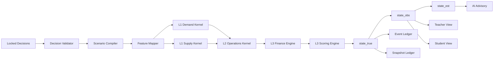

# docs/contracts/model-engineering-contract.md

| 字段 | 内容 |
|---|---|
| 项目名称 | SimWar |
| 文档名称 | `docs/contracts/model-engineering-contract.md` |
| 文档定位 | 仓库级计量模型、结算链路、参数治理与工程契约文档 |
| 项目类型 | SaaS 平台 / AI 仿真平台 / 企业高管培训与商战模拟系统 |
| 适用对象 | 后端工程、计量工程、数据工程、AI 小模型开发、测试团队、教师端与学员端开发、模型治理团队 |
| 新增计量依据 | `SimWar_计量核心模型深化与工程契约报告_清洁版_v3.0` |
| 约束优先级 | 法律与授权边界 > 本契约 > 已批准 `ScenarioPackage` / `ParameterSet` / `PluginPackage` > 前端展示文档 |
| 生效原则 | 本文定义默认工程合同；正式生产口径以已批准、已冻结、可回放版本化资产为准 |

本文件将 `docs/product/requirements.md`、`docs/architecture/system-architecture.md`、核心引擎深化报告、行业插件报告、高管培训小模型研究报告，以及新增上传的《SimWar_计量核心模型深化与工程契约报告_清洁版_v3.0》统一收口为单一仓库级合同：正式真值只能由 Core Simulation Engine 在 L1–L3 层生成；BLP / RCNL 与供给侧均衡仅位于 L1 市场真值层；L2 管运营与资源约束；L3 管财务、评分与排名；L4 小模型只输出 `advisory_only` 结果；L5 负责参数、回放、审批、发布与回滚。`ParameterSet` 在 `approved` 后不可覆盖，`Run` 启动后绑定固定 `parameter_set_id` 与 `seed`，`Replay / Shadow Replay` 是发布门禁而不是结果覆盖器。fileciteturn0file0 fileciteturn0file1 fileciteturn0file2 fileciteturn0file3 fileciteturn0file4

## 文档定位

SimWar 不是“让 AI 代替学员做经营”的系统，而是“以结构化仿真引擎生成为真值、以教师端和学员端组织学习、以 AI 小模型做解释与陪练”的仿真操作系统。因此，本文件同时冻结三类边界。第一，真值边界：L1–L3 是唯一正式数值来源。第二，写权限边界：L4 不得写 `state_true`、正式财务、正式评分、正式排名和 `ParameterSet`。第三，治理边界：任何参数、插件、评分公式、小模型和内容使用都必须走版本化、审计、Shadow Replay 与审批链路。fileciteturn0file0 fileciteturn0file1 fileciteturn0file2

| 层级 | 正式定义 | 允许写入 | 典型输出 | 明确禁止 |
|---|---|---|---|---|
| L1 | 市场需求与供给真值层 | 需求、份额、弹性、替代关系、边际成本、加价率、均衡价格 | `market_share_true`、`elasticity`、`diversion`、`markup`、`marginal_cost` | 直接写最终利润、最终评分、最终排名 |
| L2 | 运营与资源约束层 | 产能、人力、库存、等待时间、服务水平、资格约束、运营风险 | `served_demand`、`waiting_time`、`service_level`、`lost_demand` | 直接改写 L1 参数、直接写最终账本 |
| L3 | 财务与评分层 | 收入、成本、现金流、风险惩罚、评分、排名 | `ledger`、`cashflow`、`profit`、`score_final`、`rank` | 被 AI 自由文本直接驱动 |
| L4 | 交互与教练层 | 建议、解释、复盘草稿、角色对话、推荐 | `coach_output`、`analysis_card`、`debrief_draft` | 写 L1–L3 真值字段、改 `ParameterSet` |
| L5 | 校准与治理层 | 候选参数、回放报告、审批记录、发布状态、回滚状态 | `parameter_candidate`、`replay_report`、`approval_record` | 覆盖历史正式成绩 |

上表与新增计量核心模型报告、docs/architecture/system-architecture.md 和 Requirements 一致：L1–L3 必须保持确定性、可回放、可计算、可审计；小模型只能在字段级权限裁剪后消费状态快照；治理层记录候选资产、审批记录与回滚路径，而不是直接篡改正式 Run 历史。fileciteturn0file0 fileciteturn0file1 fileciteturn0file2

## 核心计量模型概述

新增上传的计量核心模型报告进一步冻结了 SimWar 的计量主张：平台不应把 BLP 仅做成“份额预测器”，而应将其与供给侧、运营约束、财务结算和评分链完整打通，构成可校准、可回放、可解释、可替换的结构化真值内核；其中 PyBLP 主要承担离线校准、后估计诊断、微观矩拟合、Shadow Replay 与反事实模拟，正式在线路径则只使用已冻结参数和高性能前向求解。该定位与 Requirements 对 `BLP/RCNL`、供给侧、微观矩、反事实、Replay 的要求，以及 docs/architecture/system-architecture.md 对 `FeatureMapper`、`MarketSolver`、`OperationsEngine`、`FinanceScoreEngine` 主链的定义保持一致。fileciteturn0file0 fileciteturn0file1 fileciteturn0file2



本契约冻结如下数学表达，作为 SimWar 经济真值核的默认仓库实现。该表达综合了新增计量核心模型报告中对 \(U_{ijt}=\delta_{jt}+\mu_{ijt}+\varepsilon_{ijt}\)、RCNL 分层替代、供给侧一阶条件、`ProductData / AgentData / ParameterSet / FeatureMapper` 的定义，以及行业插件报告中对 `ΔU_plugin`、`eligibility_mask`、`migration_matrix`、`policy_cost_shift` 的安全写入边界。fileciteturn0file0 fileciteturn0file1 fileciteturn0file3

\[
U_{ijt} = \delta_{jt} + \mu_{ijt} + \Delta U^{plugin}_{ijt} + \varepsilon_{ijt}
\]

\[
\delta_{jt} = X_{1,jt}\beta + \xi_{jt}
\]

\[
\mu_{ijt} = X_{2,jt}\left(\Sigma \nu_i + \Pi d_i\right)
\]

\[
s_{jt} = \int \frac{\chi_{ijt} \exp(U_{ijt})}{1 + \sum_k \chi_{ikt}\exp(U_{ikt})} dF(i)
\]

\[
Q^{raw}_{jt} = M_t \cdot s_{jt}, \qquad outside\_share_t = 1 - \sum_j s_{jt}
\]

在 RCNL 场景中，`nesting_id` 与组内替代参数 \(\rho\) 用于表达“高端/中端/普惠”“线上/线下”“区域/服务等级”等类内替代相关性；工程约束要求 `nesting_id` 只能由 `ScenarioCompiler` 或 `FeatureMapper` 产生，不得由前端自由拼接，也不得在运行中临时改变。若数据稀疏，可按批准流程从 `RCNL` 降级为 `Nested Logit` 或 `Logit`，但必须体现在 `ParameterSet.model_family` 与 `solver_version` 中。fileciteturn0file1 fileciteturn0file2

L1 供给侧与价格权力默认采用多产品 differentiated Bertrand 口径，工程冻结表达如下。新增计量核心模型报告明确要求：不做供给侧时，系统只能解释需求和份额；一旦需要解释“为什么份额上升而利润下降”“为什么某队拥有价格权力”“为什么成本冲击传导到价格”，就必须启用供给侧成本反推和价格均衡模块。fileciteturn0file0 fileciteturn0file1

\[
\mathbf{p} - \mathbf{mc} = \Delta^{-1}\mathbf{s}, \qquad \Delta = -\Omega \odot \frac{\partial \mathbf{s}}{\partial \mathbf{p}}
\]

\[
\log(mc_{jt}) = X_{3,jt}\gamma + \omega_{jt}
\]

其中，\(\Omega\) 为所有权矩阵，\(\frac{\partial \mathbf{s}}{\partial \mathbf{p}}\) 为需求导数矩阵，\(X_3\) 由工资指数、租金指数、产能利用率、供给冲击等组成；`quality_investment` 同时可能影响 \(X_1/X_2/X_3\)，必须在 `FeatureMapper` 中显式标注，避免重复计量。对外展示时，教师可查看弹性、替代关系、成本与加价诊断摘要；学员端只接收解释化后的商业反馈，不暴露完整 \(\beta,\Sigma,\Pi,\gamma,\rho\) 或完整弹性矩阵。fileciteturn0file0 fileciteturn0file2

需求意愿不会直接等于可服务结果。L2 与 L3 的合同表达必须将“选择真值”与“兑现真值”分离：`market_share_true` 表示消费者选择意愿或有效需求分配，`served_share` 表示经过容量、人力、库存、等待时间、合规和服务半径约束后的实际兑现比例。其基础工程表达冻结如下。fileciteturn0file1 fileciteturn0file2

\[
Q^{served}_{jt} = \min\left(Q^{raw}_{jt}, C^{effective}_{jt}, H^{effective}_{jt}, E^{eligible}_{jt}\right)
\]

\[
lost\_demand_{jt} = Q^{raw}_{jt} - Q^{served}_{jt}
\]

\[
served\_share_{jt} = \frac{Q^{served}_{jt}}{M_t}
\]

\[
service\_level_t = clamp(q_0 + \lambda_{train} \cdot training - \lambda_{overload}\cdot overload - \lambda_{turnover}\cdot turnover, 0, 1)
\]

财务与评分层使用“事件账本 + 结构化评分管线”实现，原则上不允许由前端、小模型或插件直接改写。默认评分采用“分项归一化 + 乘法型 BSC + 硬约束惩罚”的组合，以符合行业插件报告中 `Finance × Customer × Operations × Risk × Learning` 的整体框架，同时兼容 docs/architecture/system-architecture.md 中 `BSC / MAUT / SAS / 非补偿惩罚` 的描述。fileciteturn0file0 fileciteturn0file3

\[
Score_t = 100 \cdot \prod_{d\in\{finance,customer,operations,risk,learning\}} \max(\epsilon, S_d)^{W_d}\cdot P_{redline}
\]

\[
\sum_d W_d = 1,\qquad 0 < \epsilon \ll 1
\]

\[
P_{redline}=\prod_h(1-\lambda_h I_h)
\]

其中，`fatal redline` 包括但不限于：越权写真值、严重合规事故、致命财务违约、授权内容越权外显、教师沙盒结果混入正式成绩。若触发致命红线，本轮进入 `under_review`，不发布正式成绩。fileciteturn0file0 fileciteturn0file2 fileciteturn0file4

## 参数集管理和版本治理

新增计量核心模型报告将 `ParameterSet` 冻结为 SimWar 真值内核最重要的工程对象。它不只是若干系数集合，而是一个包含模型家族、公式、积分配置、有效区间、诊断记录、治理元数据、特征映射版本和求解器版本的完整快照。工程上，任何业务字段只有经过 `Schema 校验 → Feature Mapper → ParameterSet` 的组合约束后，才允许进入正式结算。学员提交不得直接进入 BLP / RCNL。fileciteturn0file0 fileciteturn0file1 fileciteturn0file2

```json
{
  "parameter_set_id": "param_simwar_rcnl_1.0.0",
  "version": "1.0.0",
  "status": "approved",
  "compatibility_level": "minor",
  "model_family": "rcnl",
  "feature_mapper_version": "1.2.0",
  "solver_version": "market-solver-py@1.0.0",
  "parameter_set_digest": "sha256:...",
  "formulation": {
    "x1_formula": "0 + quality_score + brand_stock + channel_coverage",
    "x2_formula": "0 + prices + quality_score + distance",
    "x3_formula": "0 + wage_index + rent_index + capacity_utilization"
  },
  "demand": {
    "beta": "scenario_required",
    "sigma": "scenario_required",
    "pi": "scenario_required",
    "rho": "optional"
  },
  "supply": {
    "gamma": "scenario_required",
    "costs_type": "log"
  },
  "integration": {
    "draws": 2000,
    "seed": 20260513,
    "method": "monte_carlo"
  },
  "validity": {
    "max_share_sum_error": 1e-6,
    "require_negative_own_price_elasticity": true,
    "require_positive_cost_floor": true
  },
  "governance": {
    "freeze_on_approve": true,
    "shadow_replay_report_id": "sr_001",
    "approved_by": "model_governance_role",
    "frozen_at": "2026-05-13T00:00:00Z",
    "supersedes": null
  },
  "diagnostics": {
    "gmm_converged": true,
    "micro_moment_fit_passed": true
  }
}
```

上例将 docs/architecture/system-architecture.md 中 `x1_formula / x2_formula / x3_formula`、新增计量核心模型报告中的 `model_family / formulation / integration / validity / governance / diagnostics / feature_mapper_version / solver_version` 统一为仓库级参数合同。`draws`、`seed`、`max_share_sum_error` 等属于平台默认值；需求系数、供给系数与组内替代参数不设置跨行业通用默认，必须由候选参数集显式提供并进入审批流。fileciteturn0file0 fileciteturn0file2

| 参数键 | 含义 | 类型 | 单位 | 默认值 | 允许范围 / 约束 | 冻结规则 |
|---|---|---|---|---|---|---|
| `model_family` | 需求模型家族 | enum | 无 | `rcnl` | `logit` / `nested_logit` / `blp` / `rcnl` | `approved` 后不可改 |
| `feature_mapper_version` | 特征映射规则版本 | string | semver | 必填 | 必须与 `mapping_trace` 可追溯对应 | Run 绑定后不可改 |
| `solver_version` | 求解器实现版本 | string | semver | 必填 | 必须能复算历史基准 | Run 绑定后不可改 |
| `formulation.x1_formula` | 平均效用特征式 | string | 无 | 必填 | 仅允许白名单字段 | `approved` 后冻结 |
| `formulation.x2_formula` | 异质性特征式 | string | 无 | 必填 | 仅允许白名单字段 | `approved` 后冻结 |
| `formulation.x3_formula` | 成本特征式 | string | 无 | 必填 | 仅允许白名单字段 | `approved` 后冻结 |
| `demand.beta` | 平均效用系数 | vector | 按特征而定 | 无通用默认 | 候选集必须显式提供 | 仅新版本可变更 |
| `demand.sigma` | 随机系数方差结构 | matrix | 无 | 无通用默认 | 半正定；维度与 `x2` 一致 | 仅新版本可变更 |
| `demand.pi` | 人口统计交互系数 | matrix | 无 | 可空 | 维度与 `agent_data` 一致 | 仅新版本可变更 |
| `demand.rho` | RCNL 组内替代参数 | float | 无 | `null` | 若启用 RCNL，建议 \(0 \le \rho < 1\) | 仅新版本可变更 |
| `supply.gamma` | 成本函数系数 | vector | 按特征而定 | 无通用默认 | 维度与 `x3` 一致 | 仅新版本可变更 |
| `supply.costs_type` | 成本函数类型 | enum | 无 | `log` | `log` / `linear` | `approved` 后冻结 |
| `integration.draws` | 积分抽样数 | int | 次 | `2000` | `>=100`，生产建议 `>=1000` | `approved` 后冻结 |
| `integration.seed` | 积分随机种子 | int | 无 | `20260513` | 必须可复现 | Run 绑定后不可改 |
| `integration.method` | 积分方法 | enum | 无 | `monte_carlo` | 白名单方法 | `approved` 后冻结 |
| `validity.max_share_sum_error` | inside share 合法误差上限 | float | 无 | `1e-6` | 必须满足 `outside_share > 0` | 治理模板字段 |
| `validity.require_negative_own_price_elasticity` | 自价格弹性符号校验 | bool | 无 | `true` | 正式环境必须开启 | 治理模板字段 |
| `validity.require_positive_cost_floor` | 成本正值下界约束 | bool | 无 | `true` | `log cost` 下强制 | 治理模板字段 |
| `governance.freeze_on_approve` | 审批后冻结 | bool | 无 | `true` | 正式环境必须为真 | 不得关闭 |
| `governance.shadow_replay_report_id` | 影子重放凭证 | string | 无 | 必填 | 无凭证不得晋级 | 审批记录字段 |
| `governance.supersedes` | 被替代参数集 | string/null | 无 | `null` | 仅指向历史版本 | 只追加不覆盖 |
| `diagnostics.gmm_converged` | GMM 是否收敛 | bool | 无 | 必填 | `false` 则不得晋级 | 只读诊断 |
| `diagnostics.micro_moment_fit_passed` | 微观矩拟合是否过线 | bool | 无 | 可空 | 启用微观矩时必填 | 只读诊断 |

`ParameterSet` 的状态机冻结为：`draft -> candidate -> shadow_testing -> shadow_passed -> approved -> deprecated`。`draft` 用于编辑；`candidate` 表示离线校准完成；`shadow_testing` 表示进入历史事件旁路重放；`shadow_passed` 表示通过差异、稳定性、公平性与可解释性门限；`approved` 方可被 `ScenarioPackage` 引用；`deprecated` 仅表示退役，绝不允许覆盖改写已批准版本。fileciteturn0file0 fileciteturn0file1 fileciteturn0file2

参数修改审批实行“新版本晋级，不做原位修改”的强约束。流程为：离线校准生成候选集，运行 Golden Solver Test，执行 Shadow Replay，生成差异与稳定性报告，提交治理审批，审核通过后发布为 `approved`，随后只允许新 `Run` 绑定。正在进行中的 `Run` 不允许换参；课堂中途变化只能建模为 `ShockEvent`，绝不允许直接改 `ParameterSet`。fileciteturn0file0 fileciteturn0file1 fileciteturn0file2

`ReplayHash` 的统一输入集合也在本契约中冻结，用于保证“相同输入、相同参数、相同版本、相同种子”可复算。任何字段缺失都视为回放合同不完整。fileciteturn0file0 fileciteturn0file2

\[
ReplayHash = sha256(
parameter\_set\_id +
parameter\_set\_digest +
engine\_version +
feature\_mapper\_version +
score\_formula\_version +
prior\_state\_snapshot\_hash +
decision\_batch\_hash +
shock\_event\_hash +
random\_seed +
solver\_config\_digest +
output\_state\_hash
)
\]

Shadow Replay 的默认校验逻辑如下。若业务需要更严格门限，可在 `Governance Gate` 中追加，但不得删减以下底线。该逻辑吸收了新增计量核心模型报告中对 `shadow_passed`、Golden Solver、弹性符号、微观矩、Replay Hash 与参数晋级的要求。fileciteturn0file1 fileciteturn0file2

| 校验项 | 目标 | 默认门槛 | 失败处理 |
|---|---|---|---|
| Deterministic Replay | 同输入、同参数、同种子完全复算 | `replay_hash` 一致 | 直接拒绝 |
| Share 合法性 | `inside_share_sum < 1` 且 `outside_share > 0` | `share_sum_error <= 1e-6` | 直接拒绝 |
| 弹性符号 | 自价格弹性通常为负 | 必须满足 | 进入治理阻断 |
| 成本合法性 | `log cost` 不得非正 | 必须满足 | 进入治理阻断 |
| 微观矩拟合 | 启用时拟合误差可解释 | 低于已批准阈值 | 退回候选 |
| 排名扰动预算 | 候选参数造成历史排名变化 | 仅在批准预算内 | 超预算则拒绝或标记 breaking change |
| 公平性回归 | 不同组别差异不显著恶化 | 无显著退化 | 退回重训 / 修参 |
| 性能回归 | 课堂 SLA 不恶化 | 在预设预算内 | 降级或拒绝发布 |

## 回合结算规则和公式说明

正式结算的唯一合法入口是“锁轮后、参数冻结后、场景编译后”的内部结算流程。无论教师端、学员端还是 AI 小模型，都不得绕开该主链。Requirements、docs/architecture/system-architecture.md 与新增计量核心模型报告一致强调：同一轮正式结算必须绑定 `locked decisions`、`approved ParameterSet`、`compiled scenario`、`plugin outputs`、`seed`、`prior state`，并在结果发布后写入事件账本、状态快照、学习记录与回放哈希。fileciteturn0file0 fileciteturn0file1 fileciteturn0file2

```text
def settle_round(run_id, round_no):
    assert round.status == "locked"
    assert parameter_set.status == "approved"
    assert run.parameter_set_id == parameter_set.parameter_set_id

    decisions = load_locked_decisions(run_id, round_no)
    validated = decision_validator.validate(decisions)
    compiled = scenario_compiler.compile(run_id, round_no)
    mapped = feature_mapper.map(validated, compiled, parameter_set, prior_state, shocks)

    demand_truth = demand_kernel.solve(mapped.product_data, mapped.agent_data, parameter_set)
    supply_truth = supply_kernel.solve(demand_truth, mapped.supply_data, parameter_set)
    ops_truth = operations_kernel.settle(demand_truth, supply_truth, compiled.ops_rules, shocks)
    finance_truth = finance_engine.post(ops_truth, compiled.finance_rules)
    score_truth = scoring_engine.score(finance_truth, compiled.scoring_template)

    state_true = fuse(demand_truth, supply_truth, ops_truth, finance_truth, score_truth)
    state_obs = observation_model.publish(state_true, visibility_policy)
    state_est = intelligence_model.estimate(state_obs, research_actions)

    replay_hash = compute_replay_hash(...)
    append_event_ledger(...)
    append_snapshot_ledger(...)
    enqueue_official_replay_verification(...)

    return settlement_result
```

正式结算的公式链按“市场结果 → 运营结果 → 财务结果 → 评分结果”顺序执行，任何下游只读上游结构化输出，绝不读取小模型自由文本。fileciteturn0file0 fileciteturn0file2

\[
Revenue_t = \sum_j P_{jt}\cdot Q^{served}_{jt} + Subsidy_t + ServiceAddon_t
\]

\[
COGS_t = \sum_j VC_{jt}\cdot Q^{served}_{jt}
\]

\[
OPEX_t = Payroll_t + Rent_t + Admin_t + Marketing_t + Safety_t
\]

\[
EBITDA_t = Revenue_t - COGS_t - OPEX_t
\]

\[
CashEnd_t = CashBegin_t + CashIn_t - CashOut_t + Financing_t
\]

\[
RiskPenalty_t = \lambda_1 IncidentLoss_t + \lambda_2 ComplianceLoss_t + \lambda_3 CovenantBreach_t
\]

\[
Profit_t = EBITDA_t - Depreciation_t - Interest_t - Tax_t - RiskPenalty_t
\]

归一化评分分两步完成。先做分项指标归一化与权重合成，再做非补偿惩罚。默认课程评分模板使用如下权重向量，教师只能在课程发布前选择或切换到已批准模板，不能在正式 Run 中途改权重。fileciteturn0file1 fileciteturn0file2

| 评分维度 | 默认权重 \(W_d\) | 典型指标 |
|---|---:|---|
| Finance | 0.30 | 收入增长、利润率、现金安全、ROIC |
| Customer / Market | 0.20 | 份额、留存、转化、客群结构 |
| Operations | 0.20 | 服务水平、等待时间、产能兑现、质量 |
| Risk / Compliance | 0.20 | 事故率、合规、财务违约、稳定性 |
| Learning | 0.10 | 反思质量、证据使用、协同度、二次改进率 |

\[
S_d = \sum_k w_{d,k}\cdot normalize(k), \qquad \sum_k w_{d,k} = 1
\]

\[
ScoreFinal = 100 \cdot \prod_d \max(\epsilon, S_d)^{W_d}\cdot P_{redline}
\]

教师端、学员端与 AI 小模型看到的是不同层次的数据视图，而不是同一份全量结果。`state_true` 可用于审计、正式成绩和治理；`state_obs` 是公开或角色可见的观察态；`state_est` 是基于研究动作形成的估计态。新增计量核心模型报告进一步要求：教师端可以看到弹性热力图、替代关系图、成本/加价诊断、Shadow Replay 预览，但学员端只接收“发生了什么、为什么、下轮风险”的三段式商业反馈，不暴露完整 \(\beta,\Sigma,\Pi,\gamma,\rho\)、完整导数矩阵、完整所有权矩阵、完整微观矩或完整 `ParameterSet`。fileciteturn0file0 fileciteturn0file1 fileciteturn0file2

| 角色 | 可见数据 | 禁止可见数据 | 用途 |
|---|---|---|---|
| 教师 | 教学授权范围内的 `state_true` 摘要、`state_obs`、`state_est`、Replay 报告、弹性与替代诊断摘要 | 完整竞争对手底层参数、未授权内容原文、未脱敏 `mapping_trace` | 开课、锁轮、复盘、教学干预 |
| 学员 | 本队 `state_obs`、研究后 `state_est`、三段式反馈、脱敏区间诊断 | 完整 `state_true`、完整 `ParameterSet`、完整弹性矩阵、完整微观矩 | 决策与学习 |
| AI 小模型 | 裁剪后的 `state_obs/state_est`、授权知识、工具结果 | 直接写真值接口、完整隐藏状态、完整参数集 | 提建议、解释、复盘 |
| 模型治理人员 | 全部治理视图、审计日志、回放差异、参数候选 | 无 | 审批、回滚、审计 |
| 企业管理员 | 租户授权范围内摘要、脱敏 `mapping_trace_ref` | 跨租户数据、未授权内容 | 监管租户资产与报告 |

正式结算的异常处理也必须合同化。任何异常都不能以“静默修复”方式吞没，必须进入事件、日志和操作界面。fileciteturn0file1 fileciteturn0file2

| 异常类型 | 触发点 | 处理动作 | 是否允许发布正式结果 |
|---|---|---|---|
| 决策字段非法 | Decision Validator | 拒绝结算，返回 `validation_report` | 否 |
| 参数状态非法 | Parameter Registry | 拒绝结算，写审计日志 | 否 |
| 求解不收敛 | L1 Solver | 进入 `under_review`，生成诊断报告 | 否 |
| 资格/容量冲突 | L2 Operations | 记录 `lost_demand` 与约束原因，不得静默截断 | 是，前提是约束可解释 |
| 财务违约 | L3 Finance | 应用风险惩罚，必要时触发红线审查 | 视规则而定 |
| 评分模板缺失 | Scoring Engine | 拒绝发布，进入治理异常 | 否 |
| 重复结算请求 | Settlement API | 按幂等键返回既有结果 | 是 |
| AI 越权写入尝试 | L4 / Gateway | 拒绝并审计，触发安全告警 | 与正式结算无关，但必须拦截 |
| 教师沙盒结果混入正式链路 | Sandbox / Publish | 直接阻断并进入审计 | 否 |

## 模型治理约束与契约说明

SimWar 的首要治理原则是“核心真值由仿真引擎提供，AI 小模型不得直接修改”。这不是产品偏好，而是全平台最硬的工程约束：前端、小模型、插件与教师操作都只能通过结构化命令、受控工具和批准版本化资产间接影响结算；任何试图直接调用 L1–L3 写接口的行为，都应被网关、鉴权与字段级策略同时阻断。所有 AI 输出必须自带 `advisory_only=true` 与 `truth_write_attempted=false`。fileciteturn0file0 fileciteturn0file1 fileciteturn0file2 fileciteturn0file4

```json
{
  "request_id": "REQ-2026-001",
  "agent_id": "strategy-advisor-v3",
  "proposal_id": "PROP-2026-003",
  "advisory_only": true,
  "truth_write_attempted": false,
  "action_proposals": [],
  "evidence_cards": [],
  "risk_challenges": []
}
```

行业插件与 `ScenarioPackage` 的接口也必须合同化。新增计量核心模型报告与行业插件报告都指出：行业扩展不能污染 Kernel，插件只能在有限 hook 中输出局部修正，而不能改写正式真值和总评分结构。为避免不同文档之间命名漂移，本仓库统一冻结如下 hook 集合。fileciteturn0file0 fileciteturn0file1 fileciteturn0file3

| Hook | 输入 | 输出 | 允许写对象 | 禁止写对象 |
|---|---|---|---|---|
| `compile_context` | 场景模板、行业事实、政策与地理信息 | `plugin_context` | 行业上下文、局部初值、可见性策略 | 正式成绩 |
| `adjust_utility` | `offer`、`segment`、`context` | `utility_shift` | \( \Delta U^{plugin}_{ijt} \) | `state_true` |
| `segment_migration` | policy、price、location、event | `migration_matrix` | 客群迁移权重 | 正式分数 |
| `qualification_check` | license、staff、care-grade、medical-link | `eligibility_mask` | 资格标记、可售性 | 财务总账 |
| `apply_shock` | shock、policy、calendar | `policy_cost_shift`、局部约束变化 | 局部冲击修正 | 历史快照覆盖 |
| `provide_aux_kpi` | 运营/行业状态 | `aux_kpi` | 辅助指标 | 正式排名 |
| `score_hooks` | 规范化分项指标 | `industry_subscore` | 行业分项 | 总评分结构 |
| `autopilot_policy` | 角色缺失、保底规则 | `fallback_action` | 缺岗兜底建议 | 正式真值 |

`FeatureMapper` 是计量合同的中枢服务。新增计量核心模型报告明确要求：学员提交的是业务语言，计量核需要的是 `X1/X2/X3/price/availability/instruments/shocks`；因此必须禁止前端字段直接进入 BLP。下面表格冻结默认映射原则。fileciteturn0file1 fileciteturn0file2

| 业务字段 | 映射后计量字段 | 默认规则 | 审计要求 |
|---|---|---|---|
| `price_change` | `price` | 直接进入需求核 | 记录原值、变换值、币种 |
| `channel_investment` | `channel_coverage`、`brand_stock` | 进入 `x1`，品牌为滞后 stock | 记录衰减与累计公式版本 |
| `staff_training` | `quality_score`、`service_level`、`payroll_cost` | 同时影响 L1 质量代理与 L2 运营状态 | 标记跨层影响 |
| `capacity_expansion` | `capacity_effective`、`capacity_utilization` | 进入 L2，并可作为供给侧状态变量 | 标记内生状态 |
| `quality_investment` | `quality_score`、`x3` 可选输入 | 需显式声明是否同时进入需求与供给 | 禁止隐式重复计量 |
| `financing_strategy` | `cash_buffer`、`interest_cost` | 只进 L3 财务，不直接进 L1 | 记录融资成本模型版本 |
| `marketing_message` | 不直接入核 | 仅能经审定文本特征工程进入品牌变量 | 原始文本不得直接进 L1 |
| `demand_instruments` | 工具变量集合 | 仅可由 `InstrumentFactory` 生成 | 前端不得手填 |
| `supply_instruments` | 供给工具变量集合 | 仅可由 `InstrumentFactory` 生成 | 前端不得手填 |

审计日志采用“双账本 + 追加写”策略。正式 Run 同时写 `Event Ledger` 和 `Snapshot Ledger`；更正只能追加 `correction_event`，不得覆盖历史事件。所有高风险操作——包括参数审批、模型发布、导出、插件启停、Shadow Replay、授权内容检索、AI 工具调用——都必须写入审计链。fileciteturn0file0 fileciteturn0file2

| 审计字段 | 说明 |
|---|---|
| `trace_id` | 全链路唯一追踪号 |
| `tenant_id` | 多租户边界主键 |
| `course_id` / `run_id` / `round_no` | 教学上下文 |
| `actor_id` / `role` | 操作者与角色 |
| `action` / `resource` | 动作与资源 |
| `before_digest` / `after_digest` | 变更前后摘要 |
| `parameter_set_id` / `model_version_id` | 参数与模型版本 |
| `plugin_version` / `scenario_hash` | 场景与插件追踪 |
| `replay_hash` | 回放一致性凭证 |
| `license_record_id` | 授权血缘根节点 |
| `runtime_surface` | 授权运行面 |
| `timestamp` | 时间戳 |

多租户隔离采用“租户、课程、队伍”三级收敛，并辅以 RBAC、Scope、字段级可见性与授权运行面裁剪。日志、知识索引、模型调用、导出文件与沙盒结果都必须带租户边界；教师沙盒、Counterfactual Sandbox 与 Official Settlement 必须物理隔离、逻辑隔离、数据标识隔离，沙盒结果不得混入正式成绩。fileciteturn0file0 fileciteturn0file2

## 测试与验证说明

质量保障不能只覆盖 API 和前端页面。新增计量核心模型报告、docs/architecture/system-architecture.md 与 Requirements 共同要求：测试必须覆盖契约、Replay、Shadow Replay、Golden Solver、L4 边界、插件兼容、多租户隔离、性能与合规。计量相关验证也必须独立列为验收项，而不是被埋在通用集成测试中。fileciteturn0file0 fileciteturn0file1 fileciteturn0file2

| 测试层 | 目标 | 通过标准 |
|---|---|---|
| Unit Test | 核心服务内逻辑正确 | 关键模块覆盖率达标 |
| Contract Test | OpenAPI / JSON Schema / 事件契约一致 | 契约兼容性检查通过 |
| Integration Test | 课程、回合、结算、复盘链路打通 | 主流程稳定通过 |
| Solver Golden Test | 固定小市场基准稳定 | 份额、弹性、成本、markup 基准一致 |
| Replay Test | 正式 Run 可复算 | `replay_hash` 完全一致 |
| Shadow Replay Test | 候选参数或模型差异可解释 | 生成 `diff_report` 并满足门限 |
| Econometrics Validation | 收敛、弹性、成本、微观矩合法 | 满足计量验收项 |
| L4 Boundary Test | AI 不得破坏真值边界 | 所有越权写入失败 |
| Plugin Compatibility Test | 插件不越权、版本兼容 | hook 安全与 schema 校验通过 |
| Multi-Tenant Isolation Test | 跨租户访问被阻断 | 全部拒绝 |
| Performance Test | 结算、回放与 AI 响应满足 SLA | 满足 SLO 基线 |
| Security / Compliance Test | 授权、隐私、品牌边界、导出审计 | 无高危缺陷上线 |

新增计量核心模型报告给出了更具体的计量验收项，本契约将其直接冻结为发布门禁。fileciteturn0file2

| 计量验收项 | 发布标准 |
|---|---|
| GMM 收敛 | `converged=true`，梯度范数低于场景阈值 |
| 工具变量 | rank / 弱工具变量告警可见；价格以外内生变量必须显式标注 |
| Share 合法性 | inside share 之和小于 1，outside share 大于 0 |
| 供给侧成本 | `log cost` 不得出现非正成本；clip 必须写 warning |
| 弹性矩阵 | self elasticity 通常为负；异常值进入模型健康度 |
| 替代关系 | diversion ratios 可解释且能定位竞品路径 |
| 微观矩 | observed vs simulated 差异低于阈值，记录样本量与权重 |
| Replay | 同输入、同参数、同 seed 复算一致 |
| Shadow Replay | 差异可定位到参数、场景、特征、事件或引擎版本 |

参数变更影响分析必须先于审批进行。为避免“参数能解释历史，但上线后破坏公平与课堂体验”，本契约要求对每次候选参数做四维影响分析：计量影响、业务影响、教学影响、治理影响。fileciteturn0file1 fileciteturn0file2

| 影响维度 | 必查问题 | 产物 |
|---|---|---|
| 计量影响 | 弹性、替代关系、成本与微观矩是否显著变化 | `econometric_delta_report` |
| 业务影响 | 份额、利润、现金流、风险事件是否异常漂移 | `business_impact_report` |
| 教学影响 | 排名、角色协同、复盘质量是否被系统性扭曲 | `learning_impact_report` |
| 治理影响 | 是否引入公平性回归、授权边界风险、SLA 回归 | `governance_impact_report` |

可复算性与可审计性验证必须满足三条硬约束。第一，正式 Replay 必须按 `replay_hash` 完全匹配；第二，所有结果对象必须带 `parameter_set_id`、`plugin_version`、`scenario_hash`、`mapping_trace_ref`、`replay_hash`；第三，教师预演、学员反事实沙盒、小模型输出和正式成绩必须在对象级别明确区分，且通过 UI 标签、API 字段和日志同时体现。若任一约束不满足，则不得宣告系统“可审计”。fileciteturn0file0 fileciteturn0file2

## 表格化参数公式约束和依赖清单

下表作为仓库落地清单，直接对应“模块 | 参数/公式 | 输入 | 输出 | 约束/范围 | 依赖模块 | 备注”的工程执行视图。该清单综合了 Requirements、docs/architecture/system-architecture.md、行业插件报告、核心引擎报告与新增计量核心模型报告对对象、接口、公式、治理与依赖关系的定义。fileciteturn0file0 fileciteturn0file1 fileciteturn0file2 fileciteturn0file3

| 模块 | 参数/公式 | 输入 | 输出 | 约束/范围 | 依赖模块 | 备注 |
|---|---|---|---|---|---|---|
| ScenarioCompiler | `scenario_hash`、轮次脚本、可见性策略 | 模板、插件、课程配置 | `ScenarioPackage` | 发布前必须编译成功 | Parameter Registry、Plugin Runtime | Run 启动前锁定 |
| DecisionValidator | schema、预算、权限、截止校验 | 决策草稿、角色上下文 | `validation_report`、`normalized_decision` | 锁轮后禁止改写 | RBAC、Course/Run 状态机 | 幂等重提 |
| FeatureMapper | `x1/x2/x3`、`price`、`instruments` 映射 | `normalized_decision`、prior state、shock | `mapping_trace`、product/agent/supply data | 前端字段不得直入 BLP | ScenarioCompiler、InstrumentFactory | 审计可追踪 |
| L1 Demand Kernel | \(U_{ijt}\)、\(s_{jt}\)、\(Q^{raw}_{jt}\) | ProductData、AgentData、ParameterSet | 份额、弹性、替代关系 | inside share < 1；outside share > 0 | FeatureMapper、ParameterSet | 可从 RCNL 降级到 NL/Logit |
| L1 Supply Kernel | \(\mathbf{p}-\mathbf{mc}=\Delta^{-1}\mathbf{s}\)、\(\log mc=X_3\gamma+\omega\) | 份额、价格、所有权、X3 | `marginal_cost`、`markup`、`equilibrium_price` | 非正成本禁止发布 | Demand Kernel、Ownership Matrix | 供给侧可选但一旦启用必须完整审计 |
| L2 Operations Kernel | \(Q^{served}=\min(Q^{raw},C,H,E)\) | L1 输出、容量、人力、库存、资格、shock | `served_demand`、`lost_demand`、`service_level` | 约束冲突不能静默吞没 | ScenarioCompiler、Plugin Runtime | 解释“有需求但没兑现” |
| L3 Finance Engine | `Revenue`、`COGS`、`OPEX`、`EBITDA`、`CashEnd` | 实际服务量、价格、成本、融资 | `ledger`、`profit`、`cashflow` | 账本可对账、可审计 | Operations Kernel | 不覆盖历史账本 |
| L3 Scoring Engine | `ScoreFinal = 100 × Π max(ε,Sd)^Wd × Predline` | 财务、市场、运营、学习、风险指标 | `score_final`、`rank` | 评分版本化；Run 中不可变 | Finance Engine、Rubric Template | 红线可触发 `under_review` |
| ObservationModel | `state_obs = mask(state_true, visibility_policy)` | `state_true`、角色与权限 | `state_obs` | 字段级裁剪 | State Store、RBAC | 面向教师/学员展示 |
| IntelligenceModel | `state_est` 估计更新 | `state_obs`、研究动作 | `state_est` | 必须标记估计来源 | ObservationModel、Research Events | 仅供学习与建议 |
| ReplayService | `ReplayHash`、`diff_report` | 正式事件、候选参数/模型 | `replay_report`、`shadow_replay_report` | 不得回写正式成绩 | Event Ledger、Snapshot Ledger | 发布门禁核心 |
| ParameterRegistry | 状态流转与冻结规则 | 候选参数、审批记录 | `ParameterSet` 状态 | `approved` 不可覆盖 | Governance Gate | 仅新版本晋级 |
| ModelRegistry | 模型版本、运行面、回滚指针 | 评测报告、许可元数据 | `ModelVersion` | 未通过 eval 不得部署 | Evals、Shadow Arena | 仅影响 L4 |
| Plugin Runtime | `utility_shift`、`eligibility_mask`、`migration_matrix` | plugin context、行业参数、shock | 插件局部输出 | 不得写 `state_true` / 正式成绩 | ScenarioCompiler、FeatureMapper | Kernel 稳定，Plugin 可扩展 |
| Teacher Console | 弹性热力图、替代关系、Shadow Replay | 课程序列、授权摘要 | 教学驾驶台视图 | 不得直接改正式结果 | ReplayService、State Store | 可预演，不可篡改 |
| Student App | 三段式反馈、反事实沙盒 | `state_obs`、`state_est` | 决策界面与学习反馈 | 不暴露完整参数 | ObservationModel、Coach | 反事实必须标记非正式 |
| CoachOrchestrator | `advisory_only`、证据卡、复盘草稿 | 裁剪状态、工具结果、授权内容 | `CoachOutput` | `truth_write_attempted=false` | ObservationModel、RAG、LRS | 不写正式业务数据 |
| Audit Ledger | `trace_id`、`parameter_set_id`、`replay_hash` | 所有高风险操作 | 不可变审计记录 | 追加写 | 全平台 | 法务、争议与复盘基础 |

补充的数据对象合同也一并冻结，以支持后端、算法与前端协同开发。fileciteturn0file0 fileciteturn0file2

| 数据对象 | 最小必填字段 | 关键约束 | 默认消费者 |
|---|---|---|---|
| `MarketOfferObservation` | `market_id`、`offer_id`、`firm_id`、`price`、`share`、`x1`、`x2` | 启用供给侧时 `firm_id` 必填；inside shares 和法 | Demand / Supply Kernel |
| `AgentData` | `agent_id`、`market_id`、`demo_vector`、`integration_weight` | 仅用于积分或微观矩；默认不向前端暴露 | Demand Kernel |
| `ParameterSet` | `parameter_set_id`、`model_family`、`formulation`、`integration`、`validity`、`governance` | `approved` 不可覆盖 | Registry / Solver |
| `StateSnapshot` | `snapshot_id`、`run_id`、`round_no`、`state_true_ref`、`state_obs_ref`、`state_est_ref`、`replay_hash` | 只追加不覆盖 | Teacher / Student / Replay |
| `ReplayReport` | `baseline_ref`、`candidate_ref`、`diff_summary`、`pass_fail` | 只读分析结果 | Governance / Teacher |
| `CoachOutput` | `coach_output_id`、`advisory_only`、`model_version_id`、`evidence` | 无证据链不得进主结论区 | Teacher / Student |

本契约的最终工程判断如下：SimWar 应把 BLP / RCNL 与供给侧均衡作为 L1 结构化真值内核，把运营、财务与评分作为 L2–L3 业务真值链，把小模型稳定约束在 L4 advisory 层，把 `ParameterSet`、`ModelVersion`、`PluginPackage` 和 `ScenarioPackage` 统一纳入 L5 治理层；任何想提高“智能感”的需求，都不能以牺牲参数冻结、Replay、一致性、审计和权限边界为代价。fileciteturn0file0 fileciteturn0file1 fileciteturn0file2 fileciteturn0file3 fileciteturn0file4

