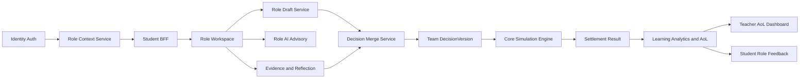
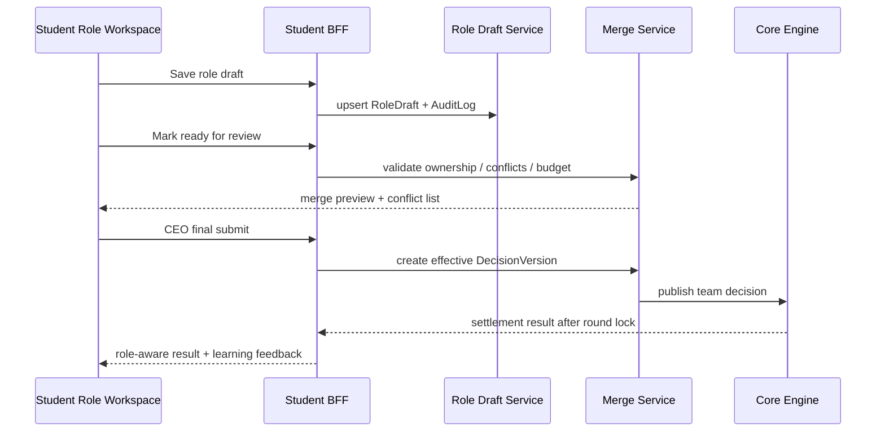

# STUDENT_ROLE_BASED_ACCESS_AND_DECISION_REFACTOR

> 建议路径：`/docs/architecture/docs/contracts/student-rbac-decision-refactor.md`  
> 文档状态：Proposed  
> 适用范围：System / Teacher / Student / Core Engine Integration / AI Advisory / Industry Plugin / Competition / Community / Testing / DevOps  
> 设计基线：本方案继承 SimWar 现有仓库文档已经反复冻结的边界：平台是多租户、契约优先、可回放、可治理的教学型 AI 仿真平台；核心仿真引擎是唯一正式真值来源；AI 只能产出 advisory 对象；Replay / Shadow Replay 是发布和治理门禁；插件不能绕过 Kernel 写正式结果。角色化改造必须建立在这些边界之上，而不是把“角色”做成前端标签切换。 fileciteturn0file2 fileciteturn0file3 fileciteturn0file4 fileciteturn0file5 fileciteturn0file6 fileciteturn0file7 fileciteturn0file11 fileciteturn0file12

## 文档定位与升级结论

现有“学员登录后直接填写团队整体决策”的设计，最大问题不是缺少一个 `role_name` 字段，而是缺少一整套贯穿身份、上下文、权限、页面、决策、评估、复盘和学习闭环的角色语义。AACSB 当前把 Assurance of Learning 视为持续改进的基础设施，而不是仅输出成绩的合规动作；其标准明确要求学校建立文档化 AoL 流程，用直接与间接测量对齐项目级能力目标，并将结果反馈到课程改进中。Marketplace 则进一步把 rubrics、定制化客观测评、Peer Evaluation、Cumulative Balanced Scorecard、教师辅导和学生报告组合成一条可执行的教学评估链条。对 SimWar 而言，学员端的角色化升级必须同时服务“真实经营协作”和“可审计学习闭环”两条主线。 citeturn6view1turn6view2turn6view3turn14view0turn14view1turn13view1

Marketplace 的公开 AoL 设计有几个直接可迁移的启发。其一，学习目标不是在课程结束后额外补报，而是叠加在模拟过程上的活动、rubrics 与客观测评。其二，系统既看团队绩效，也看个人表现。其三，客观测评不是脱离情境的通用考试，而是与当前模拟强绑定，重点考察功能知识、情境感知和跨职能整合。其四，教师获得比较报告和干预抓手，而不是只有排行榜。SimWar 应把这些优势转译为“角色化登录 + 角色化决策 + 角色化证据 + 角色化评估 + 角色化反馈”的统一体系。 citeturn14view0turn14view1turn3view0turn5view1turn5view2turn5view3

因此，本次重构的核心结论如下：  
一是“认证”和“角色上下文”必须分离；二是正式结算仍只读取团队级 `DecisionVersion`；三是角色草稿、评论、证据卡、AI 采纳记录和反思日志进入学习与审计层，不进入正式真值层；四是教师端必须新增 AoL 映射、Rubric 配置、角色轮换、同伴评价、客观测评和闭环追踪能力；五是学员端必须升级为角色工作台，而不是团队总表单；六是系统端必须提供字段级授权、角色态 BFF 裁剪、跨队隔离、强审计和 Shadow 模式迁移。以上方向与现有 SimWar 角色化重构草案、数据库、前端状态流、模型工程契约、行业插件和开发计划文档是一致的，但本文件将其提升到可直接指导 Codex 开发的仓库级规范。 fileciteturn0file0 fileciteturn0file2 fileciteturn0file3 fileciteturn0file8 fileciteturn0file9 fileciteturn0file11 fileciteturn0file12 fileciteturn0file15

本重构文档采用以下规范性词汇：**MUST** 表示必须实现；**SHOULD** 表示默认应实现，除非有文档化理由；**MAY** 表示可选增强项。MVP 推荐采用“角色主责编辑 + 全员可评论 + CEO/队长统一合并提交”的混合机制，而不是让每个角色直接向真值层单独提交。这样既保留真实分工，又不会破坏 SimWar 现有的单一正式决策输入边界。 fileciteturn0file0 fileciteturn0file7 fileciteturn0file12

## 目标架构与角色模型

角色化升级后的系统，不应只拆分前端表单，而应在系统端增加一个 **Role Context Layer**。该层位于身份认证之后、业务 API 之前，负责把“某个学员在某个租户、某门课程、某个 run、某支队伍、某一轮中的职责和权限”解析为一个短生命周期、可审计、可切换、可缓存的上下文会话。这样做能够把教师配置的角色策略、BFF 的字段裁剪、AI 的可见域、社区可见性和竞赛公开范围统一到同一份运行时上下文里，避免前后端各自维护“角色真相”。这与 SimWar 已有的多租户、BFF、状态裁剪、Plugin-ready 和审计优先设计完全一致。 fileciteturn0file2 fileciteturn0file5 fileciteturn0file7 fileciteturn0file8 fileciteturn0file9 fileciteturn0file15



角色上下文对象 **MUST** 最少包含以下字段：`tenant_id`、`user_id`、`course_id`、`run_id`、`round_id`、`team_id`、`role_id`、`role_template_id`、`seat_id`、`role_permissions`、`decision_scope`、`visibility_scope`、`competition_scope`、`community_scope`、`delegation_policy`、`source`、`expires_at`。其中，`role_permissions` 定义动作权限，`decision_scope` 定义可编辑字段边界，`visibility_scope` 定义可读取数据边界，`community_scope` 与 `competition_scope` 决定内容分发与榜单公开。认证只回答“你是谁”，角色上下文必须回答“你此时此地可以做什么、看什么、提交什么”。这一点也是当前角色化学生端草案中最重要但尚未完全系统化的部分。 fileciteturn0file0 fileciteturn0file9 fileciteturn0file15

建议默认角色模板采用“固定四主角、可扩展七职能”的设计。MVP 必做角色是 `CEO / 队长`、`CFO`、`CMO`、`COO`；P1 增加 `CTO/Product`、`CHRO`、`CRO/Risk`；P2 允许插件注入行业专属角色。这样既契合 Marketplace 强调的跨职能管理训练，也与 SimWar 行业插件文档提出的“Kernel 稳定、行业复杂性进入插件扩展位”的原则一致。Marketplace 的公开资料明确强调学生要理解 marketing、operations、finance、accounting 和 team management 之间的联动；其模拟也是按跨职能、整合型决策来设计的。 citeturn13view0turn13view1 fileciteturn0file7 fileciteturn0file11

| 角色 | 主责域 | 必须可编辑 | 默认只读摘要 | 默认禁止 |
|---|---|---|---|---|
| CEO / 队长 | 战略、整合、最终提交 | 战略目标、公司级约束、合并说明、最终确认 | 各角色完成度、冲突摘要、关键指标 | 越过字段校验直接改写他人专责字段 |
| CFO | 预算、融资、现金流、成本 | 预算、融资、分配、成本控制 | 市场摘要、产能摘要、风险摘要 | 查看其他队未公开财务草稿 |
| CMO | 定价、渠道、促销、细分定位 | 价格、渠道、投放、品牌与组合策略 | 财务可用额度、产能上限摘要 | 读取未授权 `state_true` |
| COO | 产能、库存、服务质量、执行 | 产能、库存、服务 SLA、执行计划 | 预算边界、需求预测摘要 | 直接提交正式团队决策 |
| CTO / Product | 研发、产品组合、技术质量 | 研发投入、产品路线、技术配置 | 财务与市场约束摘要 | 改写插件未声明字段 |
| CHRO | 招聘、培训、组织能力 | 用工、培训、激励、排班 | 财务与运营约束摘要 | 查看未授权个人私密反思 |
| CRO / Risk | 合规、风控、压力测试 | 风险缓释、合规动作、预案 | 财务/运营风险摘要 | 把风险建议当正式真值写入 |

角色分配模式 **SHOULD** 支持三种：固定角色、轮换角色、混合角色。固定角色适合短学期或企业培训；轮换角色适合 AoL 和全面能力培养；混合角色适合 MBA/EMBA 场景，即核心角色固定、次级角色轮换。Marketplace 的角色化学习不是靠“所有人看同样界面”完成的，而是通过阶段性活动和不同责任形成真实张力；SimWar 应进一步把这种张力产品化为可配置的角色策略。 citeturn3view0turn14view1

同时，教师端与系统端必须各自新增一层能力。教师端新增 **Role Template Studio**、**Role Assignment Console**、**AoL Mapping Studio**、**Peer Evaluation Scheduler**、**Objective Assessment Builder**、**Role Debrief Center**；系统端新增 **Role Context Service**、**Role Permission Policy Engine**、**Decision Merge Service**、**Role Contribution Analytics**、**AoL Export Service**。如果只做学员端页面而不补齐这两端，角色化只能是 UI 幻觉，无法形成可靠的课堂交付与认证证据。AACSB 明确要求 AoL 流程可文档化、可追踪并导致课程改进；Marketplace 之所以成熟，恰恰在于把教师可用工具链做到了课程运营层。 citeturn6view1turn6view2turn14view0turn13view1turn12view3

## 权限边界与决策闭环

角色化系统的第一原则，是把“动作权限、字段权限、可见权限、公开权限”拆开治理，而不是继续沿用“学生=可填所有表单”的粗粒度授权。SimWar 既有文档已经把多租户隔离、审计、可回放、真值写权限和 BFF 裁剪写成跨模块原则，因此角色权限必须下沉到字段和对象级别，前端只做体验提示，真正的安全边界只能在后端。任何角色 API 都不得返回未授权的 `state_true`、其他队伍草稿、未发布反思和未授权 AI 输出。所有写操作必须幂等并且强审计。 fileciteturn0file2 fileciteturn0file5 fileciteturn0file7 fileciteturn0file9 fileciteturn0file12 fileciteturn0file15

建议把学员端决策流程固定为六个状态：`assigned`、`editing`、`ready_for_review`、`merged_pending_ceo`、`submitted`、`locked_readonly`。角色草稿只在 `editing` 与 `ready_for_review` 之间循环；团队合并态只产生候选 `merge_preview`，直到 CEO 或队长点击正式提交，系统才生成新的团队级 `DecisionVersion`。这样可以保持现有结算链只读取有效的团队正式版本，同时完整保存角色层的过程证据。该模式既符合 SimWar 当前“DecisionVersion 追加写、正式结果不可被回放覆盖”的数据原则，也契合 Marketplace 用多种活动叠加到同一模拟之上的做法。 fileciteturn0file2 fileciteturn0file12 fileciteturn0file15 citeturn14view1turn5view1



后端 API 建议按上下文、草稿、合并、评估、反馈五类拆分，且全部走角色上下文鉴权：

```http
GET    /api/v1/student/role-context
POST   /api/v1/student/role-context/switch
GET    /api/v1/student/rounds/{round_id}/workspace
GET    /api/v1/student/rounds/{round_id}/role-drafts/{role_id}
PUT    /api/v1/student/rounds/{round_id}/role-drafts/{role_id}
POST   /api/v1/student/rounds/{round_id}/role-drafts/{role_id}/ready
POST   /api/v1/student/rounds/{round_id}/merge-preview
POST   /api/v1/student/rounds/{round_id}/decision-submit
POST   /api/v1/student/rounds/{round_id}/comments
POST   /api/v1/student/rounds/{round_id}/evidence-cards
POST   /api/v1/student/rounds/{round_id}/role-reflections
GET    /api/v1/student/rounds/{round_id}/feedback
GET    /api/v1/teacher/courses/{course_id}/roles
POST   /api/v1/teacher/courses/{course_id}/role-assignments
POST   /api/v1/teacher/courses/{course_id}/aol-config
POST   /api/v1/teacher/courses/{course_id}/peer-evals/schedule
POST   /api/v1/teacher/courses/{course_id}/objective-assessments/publish
```

数据库层建议在现有 schema 上新增或强制落地以下实体：`StudentRoleAssignment`、`RoleTemplate`、`RolePermissionPolicy`、`RoleDraft`、`RoleSubmission`、`TeamDecisionMergeLog`、`RoleContributionLog`、`RoleEvidenceCard`、`RoleReflection`、`RoleObjectiveAssessmentAttempt`、`RolePeerEvaluation`、`AoLCompetencyMap`、`CourseRubricTemplate`、`RoleKpiOwnership`、`CommunityVisibilityPolicy`。其中 `RoleSubmission`、`DecisionVersion`、`RoleContributionLog`、`LearningRecord`、`AuditLog`、`ModelCallLog` **MUST** 采用追加写或保留完整历史；`SettlementResult` 仍由核心引擎写入。 fileciteturn0file2 fileciteturn0file5 fileciteturn0file12 fileciteturn0file15

事件驱动层建议新增以下领域事件：`RoleContextResolved`、`RoleDraftSaved`、`RoleReadyForReview`、`MergePreviewGenerated`、`RoleConflictDetected`、`TeamDecisionSubmitted`、`RoleAssessmentPublished`、`PeerEvaluationCompleted`、`RoleFeedbackReleased`。这些事件可以让通知、审计、学习记录、AI 编排、社区审核和教师干预异步解耦，而不会阻塞前台提交链路。现有 SimWar 事件驱动文档已经明确把审计、AI、学习记录和回放放入事件流，因此角色化完全适合以增量事件方式接入。 fileciteturn0file5 fileciteturn0file3

若某角色缺岗，系统可按策略启用 `system_intervened` 保守补位，但补位逻辑只能以受控默认值填补缺失输入，并在 `TeamDecisionMergeLog`、`AuditLog` 和后续学习评分中显式标记；它绝不能隐式“帮学生做出更优决策”。这一点直接关系到 AoL 的有效性，因为如果系统代做决策，学习证据会失真，正式结果也无法说明学生真的掌握了能力。 fileciteturn0file12 fileciteturn0file15

## AoL 闭环与教师端重构

教师端的升级不是附属物，而是学生端角色化成立的前提。AACSB Standard 5 强调 AoL 需要与项目级能力目标对齐，采用直接和间接测量，并把结果导回课程改进；FAQ 进一步强调学校要拿得出文档化结果、形成至少一个完整的“close the loop”周期，并证明第二轮数据能够检验改进是否有效。SimWar 如果希望真正支撑商学院课程改革、教学督导和认证工作，就必须把教师端从“开课、看排名、导成绩”升级为“配置能力地图、组织角色化活动、收集证据、查看比较报告、触发教学干预、沉淀改进动作”。 citeturn6view1turn6view2turn6view3

Marketplace 的公开 AoL 页面和配套论文给出的成熟路径非常清晰：把 Executive Briefings、Business Plan Presentation、Final Report、Customized Objective Assessment、Peer Evaluation 与 Cumulative Balanced Scorecard 叠加到模拟本体上，形成团队与个人并行的 360 度评估；同时让 rubrics 负责标准化评价，让客观测评负责功能知识、情境感知与整合视角，让比较报告负责师生反馈。尤其值得借鉴的是，其 assessment strategy 直接要求学生轮流担任领导者、为 Balanced Scorecard 指标负责，并在不同阶段产生不同类型的证据。 citeturn14view0turn14view1turn3view0turn5view0turn5view1turn5view2

基于以上做法，SimWar 教师端 **MUST** 新增一个 **AoL Mapping Studio**。该模块把“项目级能力目标—课程学习目标—角色职责—活动证据—评分规则—改进行动”串成一张可执行地图。建议最少支持以下映射对象：

| 层级 | 示例对象 | 说明 |
|---|---|---|
| Program Competency | 战略整合、数据分析、团队协作、沟通表达、伦理与风控 | 面向 AACSB/学院层 |
| Course Learning Goal | 跨职能经营决策、财务约束意识、市场-运营协同、反思与改进 | 面向课程层 |
| Role Capability | CFO 预算治理、CMO 市场感知、COO 执行可靠性、CEO 跨职能整合 | 面向角色层 |
| Activity | 角色简报、合并会议、业务计划、客观测评、同伴评价、复盘报告 | 面向教学活动层 |
| Evidence | 草稿版本、证据卡、汇报 rubric、测评答卷、评论、反思日志 | 面向取证层 |
| Improvement Action | 增补案例、增加提示、调整轮换、优化教学材料、修改 rubric | 面向课程改进层 |

教师端 **SHOULD** 从 Marketplace 的 `Customized Objective Learning Assessment` 进一步升级出适配 SimWar 的 **ROLA：Role-Oriented Learning Assessment**。ROLA 不是脱离情境的通用选择题，而是围绕当前仿真轮次、当前角色、当前行业插件和当前竞争格局的客观测评。默认包括四个子量表：`Functional Knowledge`、`Situational Awareness`、`Cross-functional Integration`、`Evidence Interpretation`。Marketplace 已明确表明其定制化客观测评重点考查管理工具使用、市场位置理解、对竞争环境的感知、功能域现状理解以及整合视角，并向学生和教师都输出仪表板与比较报告；其研究论文还指出，相关问题可以通过比较“事实、判断、预测”来测量商业情境感知。SimWar 应直接吸收这一设计。 citeturn14view0turn14view1turn5view3

教师端还 **MUST** 内建 Rubric Center。建议至少配置六类 rubrics：角色启动简报、角色经营建议书、团队合并会议、业务计划汇报、结果复盘汇报、反思日志。Marketplace 的经验表明，rubrics 不仅提升评分一致性，还能提前明确学生预期，并为跨教师、跨班级和跨学期的比较提供稳定结构。AACSB 官方培训也把 competency goals、learning objectives 与 rubrics 的协同设计作为 AoL 的核心能力。 citeturn5view0turn6view3

同伴评价模块不能再是赛后一次性“互相打分”。Marketplace 公开论文建议在模拟过程中做多次 peer evaluation，并指出在启动阶段、战略规划阶段和后期精调阶段使用多轮评价更有助于纠偏；另外，关于团队学习的研究也显示，期中形成性同伴反馈能够提升后续团队技能表现。基于此，SimWar 默认应提供三波同伴评价：**启动波** 聚焦角色履职和团队规范，**策略波** 聚焦跨职能协同和冲突处理，**冲刺波** 聚焦承担责任、支持队友与复盘贡献。教师可选择匿名、仅教师可见、对学生释放摘要三种发布方式。 citeturn5view2turn2search13turn13view0turn7view1

Balanced Scorecard 在 SimWar 中不应只是团队排名器，还应成为角色责任锚点。Marketplace 的 assessment strategy 明确提出“每个学生对若干平衡计分卡指标负责”，其公开页面也显示累计计分卡可用于自动评分、比较和根因诊断。SimWar 应在教师端配置 **Role KPI Ownership Matrix**，默认将每个角色绑定 2–3 个主要指标和 1–2 个次要指标。例如，CFO 对 `cash_health` 与 `financing_discipline` 负责，CMO 对 `market_share` 与 `marketing_efficiency` 负责，COO 对 `service_level` 与 `capacity_utilization` 负责，CEO 对 `integrated_score` 与 `alignment_index` 负责。这样，团队结果与个人角色学习证据才有可解释的连接点。 citeturn3view0turn5view1turn13view1turn2search10

最后，教师端 **MUST** 提供 AoL 导出包。建议一键导出以下工件：课程能力图、角色分配记录、rubric 评分表、ROLA 分布、Peer Evaluation 摘要、Balanced Scorecard 趋势、角色学习增量、主要问题与改进行动、下一学期改版建议。AACSB FAQ 明确要求学校保留文档化结果，且第二轮数据要能够验证改进效果；AACSB 关于学生参与 AoL 的文章也指出，把学生视角纳入课程改进，能帮助教师识别真正的学习断点。SimWar 的导出包因此应同时包含学生反馈与教师改进行动，而不是只有成绩快照。 citeturn6view0turn6view2

## 计量模型、小模型与插件扩展

角色化不会改变 SimWar 的核心计量链。L1–L3 仍是正式真值层，L4 仍是 advisory layer，L5 仍负责版本、审批、回放与治理。也就是说，角色分工改变的是输入责任归属、学习证据采集和反馈解释机制，而不是把 AI 或角色草稿变成新的正式真值来源。Feature Mapper 只消费最终生效的团队级 `DecisionVersion`，绝不消费自由文本 AI 输出或任何未合并的角色草稿。现有模型工程契约、数据库和功能深化文档已经把这些边界冻结得很清楚，本方案只是在此基础上把“角色”并入可审计的输入治理层。 fileciteturn0file2 fileciteturn0file6 fileciteturn0file7 fileciteturn0file12

评分体系建议采用“四分制并行、双结果分离”的方式：正式经营结果与学习评估分开管理。默认不把角色学习得分写回正式利润、排名和结算结果，而是在教学层输出 `Outcome Score`、`Evidence Score`、`Collaboration Score`、`Reflection Score` 四类评分。这样既能服务 AACSB 的直接/间接测量，也能避免把“会写反思”误当成“经营更成功”。Marketplace 的 Career Readiness Reports 之所以有价值，也在于它们强调从学生真实行为与处理情境的方式中推断能力，而不是只看是否拿了第一名。 citeturn12view0turn14view1

建议默认学习总评权重如下，教师可在受限区间内配置：

```text
learning_total = 0.40 * outcome
               + 0.25 * evidence
               + 0.20 * collaboration
               + 0.15 * reflection
```

其中各分值的推荐构成如下：

```text
evidence = 0.30 * ownership_completion
         + 0.25 * evidence_quality
         + 0.20 * justification_quality
         + 0.15 * ai_usage_quality
         + 0.10 * timeliness

collaboration = 0.30 * peer_eval
              + 0.25 * cross_role_confirmation
              + 0.20 * conflict_resolution
              + 0.15 * discussion_quality
              + 0.10 * merge_readiness

reflection = 0.50 * debrief_rubric
           + 0.30 * mistake_diagnosis
           + 0.20 * next_round_actionability
```

在角色贡献算法上，建议引入 **数量-异质性双维度建模**，而不是只按操作次数计分。协作学习分析研究表明，日志数据可以识别有效协作指标，用于预测结果、个性化反馈和角色识别；2025 年关于 emerging roles 的研究进一步指出，分析个人贡献的数量与异质性，有助于识别学生在小组协作中的真实角色，并能帮助教师在个体学习层面理解发生了什么。但同一类研究也强调，分析结果的主要目的应是支持反思与教学调节，而不是鼓励学生为了刷存在感而“独立完成更多子任务”。因此，SimWar 的 `RoleContributionScore` 应采用质量加权、去水分和上限封顶机制。 citeturn9view0turn9view1turn9view2

建议核心算法集最少包含以下模块：

| 算法 | 作用 | 核心输入 | 输出 | 是否影响正式真值 |
|---|---|---|---|---|
| Ownership Gap Detector | 检测角色缺岗、字段空洞、责任未闭环 | 角色模板、字段归属、草稿完成度 | 缺口清单 | 否 |
| Cross-Functional Consistency Checker | 检查预算、产能、市场、风险的一致性 | CFO/CMO/COO/CRO 草稿与约束 | 冲突列表、严重度 | 否 |
| RoleDecisionMerge Algorithm | 生成团队合并预览 | 角色草稿、归属规则、教师策略 | `merge_preview` | 否 |
| Conservative Backfill Policy | 缺岗时受控补位 | 插件默认值、课程策略 | `system_intervened` 字段 | 是，但不得优化 |
| RoleContribution Analytics | 统计质量化贡献 | 保存、评论、证据、引用、确认 | 贡献画像 | 否 |
| Situational Awareness Scoring | 计算角色情境感知能力 | ROLA 答题、事实-判断-预测一致性 | SA 分数 | 否 |
| Improvement Loop Recommender | 生成教学改进行动 | AoL 数据、学生反馈、教师点评 | 改进建议 | 否 |

AI 小模型体系必须从“团队泛建议”升级为 **Role-Aware Advisory Layer**。建议最少包含五类 agent：`Role Coach`、`Counter-Argument Agent`、`Merge Assistant`、`Debrief Coach`、`Learning Recommender`。其中 `Role Coach` 只读当前角色授权数据，输出结构化建议与证据卡；`Counter-Argument Agent` 专门帮学生发现盲点与风险；`Merge Assistant` 不替代 CEO 提交，只负责总结冲突和缺口；`Debrief Coach` 在结果发布后生成三段式复盘；`Learning Recommender` 根据角色成长曲线和测评结果推荐下一轮学习重点。现有 SimWar AI 文档已经明确要求模型只能读取裁剪后的 `state_obs/state_est` 与授权工具结果，并把所有调用落到 `ModelCallLog` 中，这一原则必须保持不变。 fileciteturn0file6 fileciteturn0file12 fileciteturn0file15

协作学习分析的系统综述同时提醒，学习分析必须处理知情同意、隐私、偏差和使用者赋能问题。SimWar 因此应明确以下数据处理规则：私密反思默认不用于模型训练；社区内容默认不进入训练集合；学生侧只看到与自己相关且可解释的分析；教师可见团队分析但默认不看私密原文；所有 Analytics 面板都提供“数据来源说明”和“纠错申诉入口”；任何把学习分析输出用于高风险自动处分的设计都必须禁止。 citeturn9view2

行业插件扩展应通过 `role_extensions`、`field_ownership`、`kpi_ownership`、`assessment_extensions` 和 `ui_schema_ref` 五个扩展点接入。插件可以新增角色、字段、量表和行业 KPI，但不能跳过平台权限服务，也不能污染 Kernel 的 canonical domain model。康养、制造、零售、供应链等行业，只应把行业语义放在插件层，把正式市场与财务真值仍留在内核和批准后的映射层中。 fileciteturn0file11 fileciteturn0file12 fileciteturn0file15

```json
{
  "role_extensions": [
    {
      "role_id": "CARE_OPS",
      "role_name": "医养协同负责人",
      "field_ownership": ["medical_coordination_level", "rehab_service_mix"],
      "kpi_ownership": ["service_quality", "care_continuity"],
      "assessment_extensions": ["regulatory_readiness", "care_path_design"],
      "ui_schema_ref": "plugin://healthcare/role/care-ops-form"
    }
  ]
}
```

## 前端体验、竞赛社区与可访问性

前端必须按“角色驱动、真值边界可视化、复杂流程降噪、可解释可审计”的原则重构。SimWar 现有 Figma 原型规范与前端状态流文档已经明确：前端需要帮助用户理解自己当前处于哪个课程、哪个 run、哪个 round、哪个 team、当前能做什么、为什么能做或不能做；服务端数据应通过查询缓存统一管理，角色与权限是全局状态，而表单草稿是局部状态。角色化学员端应把这些原则进一步落到“角色选择页、角色工作台、团队合并页、结果反馈页、学习报告页”五个核心场景中。 fileciteturn0file8 fileciteturn0file9 fileciteturn0file10 fileciteturn0file15

学员端建议采用以下页面结构：登录后若仅有一个有效上下文则直接进入角色工作台；若有多个上下文，则先进入上下文选择器。角色工作台顶部固定显示课程、队伍、回合状态、角色、剩余时间和权限摘要；中部为角色 KPI 与主表单；右侧为 AI 建议、冲突提醒、待确认项和证据卡；底部为评论流、版本历史和反思入口。CEO 额外拥有“团队合并页”，该页只展示必要的跨角色聚合信息和冲突解释，而不是重新暴露全量表单，避免 CEO 在 UI 层面变成“重新填写所有字段的人”。这一点同时符合渐进披露原则，也更接近真实组织中的高层整合决策。 fileciteturn0file8 fileciteturn0file9

教师端对应新增六个核心页面：角色模板管理、课程角色分配、AoL 映射工作台、Peer Evaluation 调度台、ROLA 发布台、AoL 闭环看板。教师不应再只看到团队利润和榜单，而应看到“哪些角色长期理解不足、哪类活动对哪些能力帮助最大、哪支队伍的问题来自财务约束还是协作失灵、哪些改进行动在下一轮真正产生效果”。AACSB 和 Marketplace 都强调比较报告、趋势和闭环改进的重要性；SimWar 教师端必须把“教学判断”做成一类一等公民界面。 citeturn6view1turn6view2turn14view1turn13view1

Web 可访问性必须按 WCAG 2.2 的最低实现基线设计，而不是把可访问性理解为“上线后再修几个颜色问题”。W3C 明确把 WCAG 2.2 作为当前 Web 内容可访问性的国际标准；Marketplace 公开说明其学生界面围绕 WCAG 2.1 AA 做了高对比、键盘可操作、区域导航、非颜色单独编码等增强。对于 SimWar 这种高信息密度、课堂高压场景的企业应用，这些要求尤其重要。角色工作台、合并页、排行榜、图表、弹窗和编辑器都必须满足键盘可达、焦点可见、图形有文本替代、颜色不作为唯一语义、错误信息可理解、倒计时可感知。 citeturn1search3turn1search23turn12view2

课程落地方面，SimWar **SHOULD** 在 P1 兼容 LTI / LMS 集成。Marketplace 公开把无密码登录和成绩回传作为学校采用的重要原因之一；对 SimWar 来说，角色化系统如果能通过 LTI 带入课程、班级和学生身份，再输出团队结果、学习评分或证据包到 LMS，将显著降低教师开课成本并提高校内 IT 部门接受度。 citeturn12view1

竞赛与社区的角色化规则要比课堂内更严格。竞赛中默认只公开团队正式结果与教师允许公开的指标，不公开其他队伍草稿、AI 建议、角色贡献、反思日志和任何未发布策略；进行中的竞赛不得借由社区泄露角色决策。课程内讨论区、小组私有区、角色方法论专区和公开案例库应分层治理，且所有可见性必须由后端策略控制，而不是前端隐藏。现有学生角色化草案已经提出这一路线，本文件将其提升为强制规则。 fileciteturn0file15

长期来看，SimWar 可以借鉴 Marketplace 的 Career Readiness 思路，把角色轨迹转译为“岗位能力画像”而不是只输出比赛名次。Marketplace 的做法是用模拟过程中的真实行为推断批判性思维、学习敏捷性、创新、结果驱动等 24 个能力指标。SimWar 不必照搬这 24 项，但完全可以在 P2 增加 `Role Career Card`，把跨课程、跨场景的 CFO/CMO/COO/CEO 成长记录转为学生可理解、教师可辅导、企业可解释的能力输出。 citeturn12view0

## 开发计划、测试与迁移执行

从工程落地看，本项目最适合采用“模式先冻结、接口先行、数据先迁移、功能分阶段放量”的方式。现有开发计划文档已经把仓库推进拆为多阶段，并要求 Codex 在不同阶段分别参考数据库、API、前端、模型与测试文档；角色化升级不需要推翻原路线图，但必须把角色上下文、AoL 教学层和数据治理门禁插入现有计划的前半段。最稳妥的做法是先建立 schema 和 BFF 裁剪，再引入学员端角色草稿，最后放开教师端 AoL 和竞赛社区联动。 fileciteturn0file3 fileciteturn0file5 fileciteturn0file15

建议实施阶段如下：

| 阶段 | 目标 | 主要产物 | 发布策略 |
|---|---|---|---|
| P0 | 数据与鉴权基线 | `RoleTemplate`、`StudentRoleAssignment`、`RolePermissionPolicy`、`RoleDraft`、`TeamDecisionMergeLog`、Role Context Service、BFF 裁剪 | 不对终端放量，仅后台可见 |
| P1 | 学员端 MVP | 角色选择、四主角工作台、角色草稿、合并预览、CEO 提交、基础 AI 建议 | 课程白名单 + Feature Flag |
| P1.5 | 教师端 AoL 基础 | 角色分配、Rubric Center、ROLA 发布、Peer Evaluation 三波调度、AoL 看板初版 | 教师 Beta |
| P2 | 竞赛与社区联动 | 角色可见性策略、案例脱敏、角色方法论专区、竞赛公开规则 | 受控赛事 |
| P2+ | 能力画像与企业映射 | Role Career Card、岗位能力映射、跨课成长档案 | 可选商业增强 |

Codex 的改造工作流建议按“数据库迁移 → 鉴权中间件 → BFF DTO 裁剪 → 学员端路由与状态 → 合并服务 → 教师端 AoL → 测试与监控”顺序推进。仓库层至少应新增如下目录或模块：

```text
/backend/services/role_context/
/backend/services/role_permission/
/backend/services/decision_merge/
/backend/services/aol/
/backend/services/role_analytics/
/backend/events/role_events/
/backend/models/role_*.py
/frontend/student/routes/role/*
/frontend/student/stores/roleContextStore.ts
/frontend/student/stores/roleDraftStore.ts
/frontend/teacher/routes/aol/*
/frontend/components/permission/*
/docs/contracts/role-context.openapi.yaml
/docs/contracts/role-draft.openapi.yaml
```

迁移策略 **MUST** 采用双写与 Shadow 模式，禁止直接切断旧团队表单。推荐顺序是：先创建新表和新事件；其次把旧团队表单的保存动作并行写入 `RoleDraft` 的“legacy_ceo_mode”；再让白名单课程启用真实角色分工；随后用 Shadow 对比“新角色化链路提交后的正式 `DecisionVersion`”与“旧团队表单链路”的差异；当差异、越权、审计和回放均通过后，再移除旧入口。由于 SimWar 现有体系已经把 Replay / Shadow Replay 定义为发布门禁，这一迁移方式与仓库既有治理设计完全一致。 fileciteturn0file4 fileciteturn0file5 fileciteturn0file12

测试方面，角色化升级必须把“功能能用”提升为“边界可靠”。最低测试矩阵如下：

| 测试域 | 关键用例 | 阻断级别 |
|---|---|---|
| 角色上下文 | 同一用户多课程、多 run、多队、单队约束、上下文切换 | P0 |
| 权限控制 | 字段级裁剪、跨队访问、越权评论、未授权导出 | P0 |
| 真值边界 | 学员端和 AI 读取 `state_true` 被拦截；AI 不写正式结果 | P0 |
| 合并与幂等 | 重复提交、并发提交、冲突预览、CEO 最终提交 | P0 |
| 数据完整性 | 角色草稿版本、贡献日志、ModelCallLog、AuditLog 完整 | P0 |
| AoL | rubric 评分、ROLA 发布与回收、peer evaluation 三波、导出包一致性 | P1 |
| 插件 | 行业角色字段 schema 校验、Feature Mapper 合法映射 | P0 |
| Replay | 正式结果不被覆盖；角色证据仅做复盘视图 | P0 |
| 前端 | 角色工作台 E2E、缓存失效、路由守卫、键盘无障碍 | P0 |
| 性能 | 课程高并发下上下文解析、草稿保存、AI 延迟、榜单读取 | P1 |

监控层建议至少接入以下指标：`role_context_resolution_failed_total`、`role_permission_denied_total`、`cross_team_access_blocked_total`、`student_state_true_blocked_total`、`decision_version_idempotency_conflict_total`、`system_intervened_team_total`、`role_ai_advice_latency_ms`、`peer_evaluation_publish_failed_total`、`aol_export_failed_total`。角色化系统最怕的不是普通 bug，而是静默越权、静默丢日志和静默泄露，因此告警门槛应按安全系统而非普通表单系统来设置。 fileciteturn0file5 fileciteturn0file15

最终验收标准应以“系统边界、教学闭环、开发可执行性”三个维度共同完成为准。只有当以下条件同时满足，本重构才算完成：  
其一，正式结算仍唯一依赖团队级有效 `DecisionVersion`；其二，任一学员与任一 AI 请求均无法读取未授权 `state_true`；其三，教师可配置并导出学习目标—活动—证据—改进行动的闭环链；其四，学生可在角色工作台中完成分工、协作、决策、反馈与反思；其五，竞赛与社区不会在进行中泄露未发布策略；其六，Replay / Shadow Replay 能证明本次升级没有破坏正式结果链路。做到这一步，SimWar 的“学员端分角色登录与角色化决策”才不再是单点功能，而会成为支撑高管培训、商学院 AoL、竞赛、社区与行业插件扩展的底层操作系统能力。 citeturn6view1turn6view2turn14view1turn13view1 fileciteturn0file2 fileciteturn0file3 fileciteturn0file5 fileciteturn0file7 fileciteturn0file11 fileciteturn0file12 fileciteturn0file15
