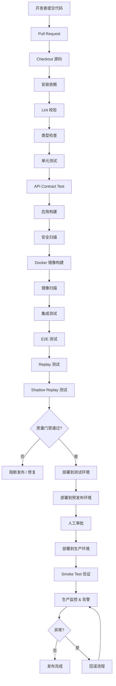
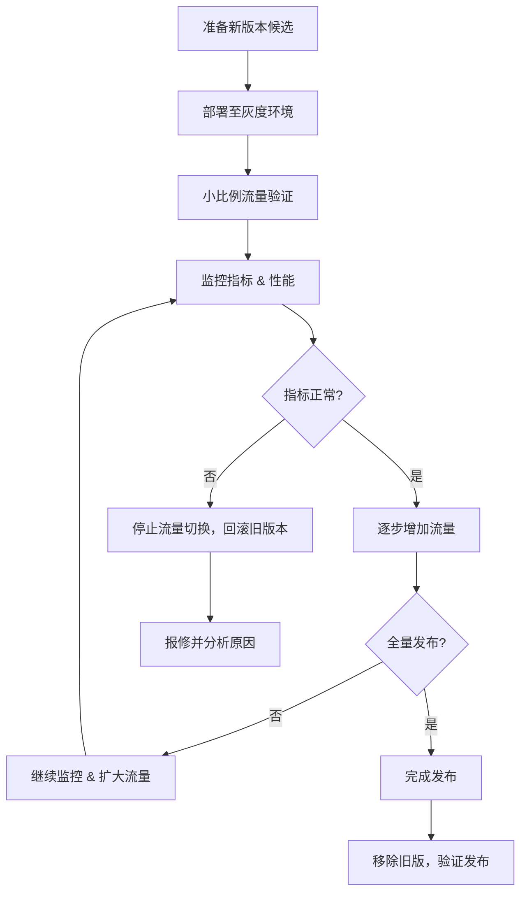

# docs/devops/ci-cd-pipeline.md

## 1. 文档信息

| 项目     | 内容                                                                                                                                                                                                                                                                                                                                                                                                           |
| -------- | -------------------------------------------------------------------------------------------------------------------------------------------------------------------------------------------------------------------------------------------------------------------------------------------------------------------------------------------------------------------------------------------------------------- |
| 文档名称 | docs/devops/ci-cd-pipeline.md                                                                                                                                                                                                                                                                                                                                                                                  |
| 项目名称 | SimWar 商战仿真平台                                                                                                                                                                                                                                                                                                                                                                                            |
| 文档版本 | v1.0                                                                                                                                                                                                                                                                                                                                                                                                           |
| 文档状态 | Draft                                                                                                                                                                                                                                                                                                                                                                                                          |
| 最后更新 | 2026-05-14                                                                                                                                                                                                                                                                                                                                                                                                     |
| 适用范围 | CI/CD / 构建 / 测试 / 部署 / 发布 / 回滚                                                                                                                                                                                                                                                                                                                                                                       |
| 维护人   | 请根据实际项目修改                                                                                                                                                                                                                                                                                                                                                                                             |
| 相关文档 | README.md / docs/devops/env-setup.md / docs/quality/test-coverage.md / docs/architecture/system-architecture.md / docs/product/requirements.md / docs/contracts/api-contract.md / docs/architecture/database-design.md / docs/architecture/event-driven-architecture.md / docs/architecture/bpmn-workflows.md / docs/architecture/parameter-set-management.md / docs/quality/replay-shadow-replay-test-plan.md |

---

## 2. 执行摘要

CI/CD 流程的目标是确保 SimWar 平台的代码质量、部署稳定性和安全性，能够支持从开发到生产的全流程自动化交付。通过严格的质量门禁和多级环境验证，保证每次发布都可追踪、可审计、可回滚。SimWar 作为多模块、多前端、多 AI 服务的 SaaS 仿真平台，统一构建和发布流程，可以通过 monorepo 及流水线模板实现一致性管理。CI/CD 流程可以自动执行 Lint、类型检查、单元测试、集成测试、API 契约测试、E2E 测试、安全扫描、镜像构建等步骤，有效拦截缺陷和漏洞，减小回归风险。对于仿真平台而言，Replay 和 Shadow Replay 测试是核心发布门禁，用于验证历史运行结果的可复算性和候选变更的影响。如果 Replay 差异超阈，或 Shadow Replay 发现异常，流水线将阻断发布并进行人工审查。本文档面向开发工程师、测试工程师、DevOps/运维、安全和发布管理人员，描述代码提交、分支管理、自动化流水线、环境部署、灰度发布、回滚策略、密钥管理及监控告警等全流程内容。开发者可据此理解分支流程、提交约束和质量检测；测试人员可了解自动测试和验证节点；运维/DevOps 可据此实现流水线与部署；安全人员可审查依赖扫描、容器扫描和权限管理；AI 工程师可了解模型/Prompt 发布门禁；架构师可确认多服务、多环境部署策略；同时可供自动化工具或 AI 助手继续生成具体的 GitHub Actions、GitLab CI、Dockerfile、Kubernetes YAML、Helm Chart、部署脚本等。

---

## 3. 仓库与分支策略

### 3.1 仓库模式

- **Monorepo**：所有前端、后端、AI 服务、基础设施代码集中在一个仓库。**优点**：契约一致、统一 CI/CD、跨模块改动易追踪；方便对接 API 契约、数据库迁移、共享库；利于整体治理和版本管理。**缺点**：仓库规模增长后需要优化 CI 速度和缓存策略。适用于平台初期和中期阶段，尤其需要多服务联动时。
- **Polyrepo**：每个服务独立仓库。**优点**：服务自治、独立权限；适合服务拆分或不相关模块；**缺点**：跨服务变更需协调多个仓库，CI 复杂度增高。可作为后期在经过一定稳定后拆分部分子系统使用。
- **推荐方案**：**Monorepo**。SimWar 项目早期或中期阶段，各模块高度耦合，需要统一测试和联调；参数集、插件、模型等治理门禁需要统一管理；Codex 助手生成文件时维护一致性更容易。可在后期根据项目需求适度拆分部分模块为独立仓库（形成 Hybrid 模式）。

示例仓库结构（Monorepo）：

```text
apps/
  teacher-web/
  student-web/
  admin-web/

services/
  api-gateway/
  auth-service/
  course-service/
  decision-service/
  simulation-engine/
  ai-orchestrator/
  replay-service/
  plugin-service/
  audit-service/
  notification-service/

packages/
  api-contracts/
  shared-types/
  ui/
  test-fixtures/

infra/
  docker/
  k8s/
  helm/
  terraform/

scripts/
  ci/
  deploy/
  rollback/
  db/
  replay/
  smoke/

docs/
  docs/devops/ci-cd-pipeline.md
  docs/architecture/system-architecture.md
  ...
```

### 3.2 分支策略

SimWar 建议使用 Git Flow 风格分支策略：

| 分支           | 用途                                                | 触发流水线                                                                          | 合并要求                                                   |
| -------------- | --------------------------------------------------- | ----------------------------------------------------------------------------------- | ---------------------------------------------------------- |
| `main`         | 生产就绪分支，只允许 `release/*` 或 `hotfix/*` 合并 | 完整CI、Build、Security Scan、镜像构建、Deploy Staging、人工审批、Deploy Production | 完成所有质量门禁和安全检查，并经过审批                     |
| `develop`      | 集成开发分支，合并 feature 后自动部署至测试环境     | PR/Lint/Type Check/Unit Test/Build/Contract Test，合并后 Deploy Test                | PR 通过自动化测试和代码审查                                |
| `feature/*`    | 功能开发分支                                        | PR/Lint/Type Check/Unit Test/Build/Contract Test                                    | PR 需关联需求，测试通过，审查通过                          |
| `fix/*`        | 修复 bug 分支                                       | PR/相关测试回归                                                                     | PR 关联缺陷或Issue，通过测试和审查                         |
| `release/*`    | 发布候选分支                                        | 完整回归测试、Replay、Shadow Replay、Security Scan、Deploy Staging                  | 发布审批、版本号归档，保证稳定后合并至 `main` 与 `develop` |
| `hotfix/*`     | 紧急修复生产问题                                    | Hotfix CI、Security Scan、Smoke Test、Production Approval                           | 紧急小改动，双人审批，合并后需同步回 `develop`             |
| `experiment/*` | 实验性功能/技术预研分支                             | 可选 CI 流程，无部署或仅内部测试                                                    | 不得直接合并到 `main`，变更需要额外评估                    |

### 3.3 Pull Request 规则

- PR 必须关联需求或任务号，描述变更目的、影响范围和测试结果；
- PR 触发全量自动化检测：Lint、格式检查、类型检查、单元测试、Contract Test 等全部通过；
- PR 必须通过至少 1 名同事代码审查；对于核心模块（仿真引擎、支付、权限等）需 2 人审查；
- 高风险变更（数据库变更、权限设计、仿真引擎、核心算法、参数/插件/模型发布等）需架构师或相关负责人额外审批；
- 禁止在 PR 中提交真实的 `.env` 文件或敏感 Secret（例如生产 API Key、数据库连接串等）；
- 禁止在 PR 中添加跳过质量门禁或绕过 Replay 流程的代码；
- 所有合并操作需记录在案，合并后流水线继续完成后续发布流程。

---

## 4. 环境规划

| 环境           | 用途                       | 部署方式                                 | 数据来源                   | 是否自动部署           | 是否需要审批 |
| -------------- | -------------------------- | ---------------------------------------- | -------------------------- | ---------------------- | ------------ |
| **local**      | 本地开发、调试与单元测试   | Docker Compose / 本地运行                | 开发 Seed Data / Mock 数据 | 否                     | 否           |
| **CI**         | Pull Request 验证          | CI Runner（容器）                        | 临时测试数据               | 是                     | 否           |
| **test**       | 集成测试、测试团队联调     | Kubernetes / Docker Compose / 云测试环境 | 独立测试库，自动 Seed Data | 是                     | 否           |
| **staging**    | 预发布验证、预演、灰度测试 | Kubernetes / Helm / GitOps               | 脱敏数据 / 生产等价配置    | 半自动（部署后需审批） | 是           |
| **production** | 正式生产环境               | Kubernetes / Helm / GitOps               | 真实生产数据               | 否（需人工触发）       | 是           |

环境隔离要求：

- **密钥隔离**：生产环境不得使用测试密钥；测试环境不得访问生产秘钥；CI/测试使用专用开发密钥；
- **资源隔离**：各环境应使用独立的数据库、Redis、消息队列、对象存储、API 服务端点；
- **数据隔离**：测试/预发布环境使用模拟或脱敏数据；生产环境使用真实业务数据；
- **模型隔离**：AI 模型、Prompt、RAG 策略等配置按环境区分，例如生产使用正式模型密钥，测试使用Sandbox；
- **依赖隔离**：开发本地可以使用 Docker Compose，CI/测试环境在云容器中部署，生产使用正式 Kubernetes 集群；
- **发布审批**：Pre-Prod 和生产环境发布需要指定负责人审批；生产环境部署需审批并记录发布内容。

---

## 5. CI/CD 总体流程



1. **开发提交和 PR**：开发者在 `feature/*` 或 `fix/*` 分支提交代码，创建 Pull Request。触发自动流水线执行 Lint、类型检查、单元测试、Contract Test 等。
2. **合并与构建**：PR 合并到 `develop` 分支后触发完整 CI，成功后自动部署到 **测试环境**。发布候选分支（release/\*）合并到 `main` 则生成镜像并部署到 **预发布环境**。
3. **测试与验证**：在 `staging` 环境执行完整回归测试，包括 Replay/Shadow Replay 安全门禁等。所有重要测试通过后，等待人工审批发布到生产。
4. **生产部署**：在审批通过后，将镜像和配置部署到生产环境，执行 Smoke Test 验证，确保核心功能可用。
5. **监控与回滚**：部署完成后，通过监控和告警观察服务运行状态。若出现异常（如高错误率、性能突降或指标异常），则启动回滚流程，恢复到前一稳定版本。

该流程覆盖代码质量、构建、测试、镜像和部署各个环节，确保自动化和可审计性。Replay/Shadow Replay 作为仿真平台的特殊门禁，在候选部署前强制执行，防止参数、插件、模型、Prompt 等变更引入未发现的逻辑差异。

---

## 6. Pipeline 阶段总览

| 阶段                 | 触发条件                  | 主要任务                                              | 阻断发布 | 输出产物                       |
| -------------------- | ------------------------- | ----------------------------------------------------- | -------- | ------------------------------ |
| Checkout             | PR 提交 / Push / 手动触发 | 拉取仓库最新代码                                      | 是       | 源代码工作区                   |
| Install Dependencies | 代码拉取后                | 安装 Node.js、Python 及其他依赖                       | 是       | 依赖缓存 (node_modules, .venv) |
| Lint                 | PR / Push                 | 代码风格检查 (ESLint/Ruff)                            | 是       | Lint 报告                      |
| Type Check           | PR / Push                 | TS/JS 的类型检查 (TypeScript)；Python 类型检查 (mypy) | 是       | 类型检查报告                   |
| Unit Test            | PR / Push                 | 执行单元测试                                          | 是       | 单元测试报告 (coverage)        |
| Build                | PR / Push                 | 前端打包，后端编译/打包                               | 是       | 构建产物 (dist/, JAR, Wheel)   |
| API Contract Test    | PR / Push / Release       | 验证 OpenAPI/GraphQL/SOAP 等契约一致性                | 是       | 合约测试报告                   |
| Integration Test     | develop / release         | 验证服务间集成逻辑                                    | 是       | 集成测试报告                   |
| E2E Test             | develop / release         | 端到端业务流程测试                                    | 是       | E2E 测试报告                   |
| Replay Test          | release / staging         | 验证历史业务结果一致性                                | 是       | Replay 测试报告                |
| Shadow Replay Test   | release / staging         | 验证候选变更对历史业务的影响                          | 是       | ShadowReplay 报告（人工复核）  |
| Security Scan        | PR / release              | 依赖漏洞扫描、SAST、Secret 扫描等                     | 是       | 安全扫描报告                   |
| Container Build      | main / release            | 构建 Docker 镜像                                      | 是       | Docker 镜像                    |
| Container Scan       | main / release            | 镜像漏洞/配置扫描                                     | 是       | 镜像扫描报告                   |
| Push Image           | main / release            | 推送镜像到私有 Registry                               | 是       | 镜像 Tag                       |
| Deploy Test          | develop                   | 部署到测试环境（CI 自动）                             | 是       | 测试环境部署                   |
| Deploy Staging       | release / main            | 部署到预发布环境                                      | 是       | 预发布环境部署                 |
| Manual Approval      | staging                   | 发布生产前审批                                        | 是       | 审批记录                       |
| Deploy Production    | main / 手动               | 部署到生产环境                                        | 是       | 生产环境部署                   |
| Smoke Test           | staging / production      | 关键功能冒烟测试                                      | 是       | Smoke Test 报告                |
| Rollback             | 部署失败或异常            | 应用回滚、DB 回滚、Feature Flag 回滚等                | 否       | 回滚报告                       |

每个阶段通过持续集成工具自动触发执行，关键步骤失败将阻断后续发布。完成各阶段后会输出构建产物、测试报告、镜像 Tag 等，可用于追溯和审计。

---

## 7. 构建矩阵

项目模块及其构建方式如下（技术栈和命令为示例，请根据实际项目修改）：

| 模块                     | 技术栈                                          | 构建命令                                   | 输出产物                             | 是否生成镜像 |
| ------------------------ | ----------------------------------------------- | ------------------------------------------ | ------------------------------------ | ------------ |
| `teacher-web`            | Vue.js / React (TypeScript)，前端               | `pnpm --filter teacher-web build`          | `apps/teacher-web/dist`              | 是           |
| `student-web`            | Vue.js / React (TypeScript)，前端               | `pnpm --filter student-web build`          | `apps/student-web/dist`              | 是           |
| `admin-web`              | Vue.js / React (TypeScript)，前端               | `pnpm --filter admin-web build`            | `apps/admin-web/dist`                | 是           |
| `api-gateway`            | Node.js / NestJS，API 网关                      | `pnpm --filter api-gateway build`          | `services/api-gateway/dist`          | 是           |
| `auth-service`           | Node.js / Python，认证服务                      | `pnpm --filter auth-service build`         | `services/auth-service/dist`         | 是           |
| `course-service`         | Node.js / Python，课程服务                      | `pnpm --filter course-service build`       | `services/course-service/dist`       | 是           |
| `decision-service`       | Node.js / Python，决策服务                      | `pnpm --filter decision-service build`     | `services/decision-service/dist`     | 是           |
| `simulation-engine`      | Python / Go / Rust，仿真引擎                    | `python -m build`                          | `dist/`                              | 是           |
| `ai-orchestrator`        | Python / FastAPI，AI 协调器                     | `python -m build`                          | `dist/`                              | 是           |
| `replay-service`         | Python / Node.js，复盘服务                      | `python -m build`                          | `dist/`                              | 是           |
| `plugin-service`         | Node.js / Python，插件服务                      | `pnpm --filter plugin-service build`       | `services/plugin-service/dist`       | 是           |
| `audit-service`          | Node.js / Python，审计服务                      | `pnpm --filter audit-service build`        | `services/audit-service/dist`        | 是           |
| `notification-service`   | Node.js / Python，通知服务                      | `pnpm --filter notification-service build` | `services/notification-service/dist` | 是           |
| `packages/api-contracts` | OpenAPI / JSON Schema                           | `pnpm --filter api-contracts build`        | API 契约定义文件                     | 否           |
| `packages/shared-types`  | TypeScript typings                              | `pnpm --filter shared-types build`         | 类型声明包                           | 否           |
| `packages/ui`            | TypeScript / docs/frontend/component-library.md | `pnpm --filter ui build`                   | 组件库 Bundle                        | 否           |

**构建命令示例：**

```bash
# 安装依赖
pnpm install --frozen-lockfile

# 前端项目构建
pnpm --filter teacher-web build
pnpm --filter student-web build

# 后端服务构建
pnpm --filter api-gateway build
python -m build  # 用于 Python 服务

# 其他
npm ci  # 如果使用 npm 的场景
```

各服务构建完成后，将产物打包进对应 Docker 镜像。

---

## 8. 依赖安装与缓存策略

### Node.js 依赖缓存

- 使用 `pnpm`（或 `npm`）进行依赖安装，锁定版本。
  ```bash
  pnpm install --frozen-lockfile
  ```
  或者
  ```bash
  npm ci
  ```
- CI 中启用依赖缓存，如：`~/.pnpm-store`、`node_modules/.cache` 等，以加速后续构建。
- 缓存键可基于操作系统和锁文件哈希，如：`node-${{ runner.os }}-${{ hashFiles('pnpm-lock.yaml') }}`。

### Python 依赖缓存

- 使用 `pip` 安装并锁定版本。
  ```bash
  pip install -r requirements.txt
  pip install -r requirements-dev.txt
  ```
- 缓存 pip 下载目录和虚拟环境，键可采用：`python-${{ runner.os }}-${{ python-version }}-${{ hashFiles('requirements*.txt') }}`。
- 缓存内容：`~/.cache/pip`、`.venv/` 等。

### Docker Layer 缓存

- 在 CI 构建镜像时启用缓存层（BuildKit）。示例：
  ```bash
  docker buildx build \
    --cache-from type=registry,ref=<registry>/<service-name>:buildcache \
    --cache-to type=registry,ref=<registry>/<service-name>:buildcache,mode=max \
    -t <registry>/<service-name>:<git-sha> \
    infra/docker/<service-name>/Dockerfile
  ```
- 缓存键可为镜像标签或仓库路径。

### Monorepo 构建缓存

- 如果使用 TurboRepo、Nx 等工具，缓存命令输出和中间产物（例如 `.turbo/`、`.nx/` 等）。
- 缓存键可基于 Monorepo 配置文件或全局哈希：`turbo-cache-${{ hashFiles('turbo.json', 'workspace.json', 'pnpm-lock.yaml') }}`。

### 测试缓存

- 单元测试或端到端测试可开启缓存，如 Jest 的 `--cache`，Playwright 的浏览器缓存目录等。
- 示例：`npm test -- --cache` 或 `pytest --cache-clear` 根据需求清理或复用缓存。

### 构建产物缓存

- 构建产物可以缓存用于后续流水线阶段，但应避免跨环境直接复用生产镜像：
  - 前端/后端构建产物（`dist/`、`build/` 等）可缓存于 CI。
  - 缓存键可含 Git 提交哈希或版本号，确保每次构建隔离。

### 缓存失效策略

| 缓存类型     | 失效触发条件                                | 处理方式           |
| ------------ | ------------------------------------------- | ------------------ |
| Node 依赖    | `pnpm-lock.yaml` / `package-lock.json` 变化 | 重建缓存           |
| Python 依赖  | `requirements.txt` 或 `pyproject.toml` 变化 | 重建缓存           |
| Docker Layer | Dockerfile 或依赖层变化                     | 自动失效           |
| 构建产物     | 代码更新或环境变化                          | 重新生成           |
| 测试缓存     | 测试代码或配置变化                          | 清理缓存，重新测试 |
| CI 配置      | CI 文件变化                                 | 重建缓存           |

---

## 9. 代码质量检查

### 9.1 Lint

- **前端/Node.js**：使用 ESLint 对 JavaScript/TypeScript 代码进行静态检查。
  ```bash
  npm run lint  # 或 pnpm run lint
  ```
- **Python**：使用 `ruff` 或 `flake8` 进行代码规范检查。
  ```bash
  ruff check .
  ```
- 配置规则需涵盖缩进、命名风格、代码复杂度等。

### 9.2 格式化检查

- **前端/Node.js**：使用 Prettier 检查代码格式。
  ```bash
  npm run format:check
  ```
- **Python**：使用 Black 检查格式。
  ```bash
  black --check .
  ```

### 9.3 类型检查

- **TypeScript**：严格类型检查。
  ```bash
  npm run typecheck
  ```
- **Python**：使用 Mypy 进行静态类型检查。
  ```bash
  mypy .
  ```

### 9.4 质量门禁

| 检查项               | 命令                      | 失败是否阻断 | 备注                       |
| -------------------- | ------------------------- | ------------ | -------------------------- |
| ESLint (前端/Node)   | `npm run lint`            | 是           | 静态代码风格检查           |
| Ruff/Flake8 (Python) | `ruff check .`            | 是           | Python 代码风格检查        |
| Prettier 检查        | `npm run format:check`    | 是           | 保证一致的代码格式         |
| Black 检查           | `black --check .`         | 是           | Python 代码格式            |
| TypeScript 检查      | `npm run typecheck`       | 是           | 类型定义和使用一致         |
| Mypy (Python)        | `mypy .`                  | 是           | Python 静态类型检查        |
| Import 顺序          | `ruff check --select I .` | 是           | Python 导入排序            |
| OpenAPI 验证         | `npm run lint:openapi`    | 是           | OpenAPI/GraphQL 文档一致性 |
| Markdown Lint        | `npm run lint:docs`       | 否           | 文档格式检查               |

所有检查项如果标记为“是”，失败时都会阻断当前流水线阶段并反馈错误，防止不符合规范的代码进入下一步。项目可根据实际情况添加更多自定义规则（如安全检查、代码复杂度等）。

---

## 10. 自动化测试流水线

| 测试类型                       | 触发阶段                 | 命令                                                                   | 阻断发布          | 说明                                             |
| ------------------------------ | ------------------------ | ---------------------------------------------------------------------- | ----------------- | ------------------------------------------------ |
| Unit Test (单元测试)           | PR / Push                | `npm test` / `pytest --maxfail=1 --disable-warnings -q`                | 是                | 验证函数、组件、服务单元逻辑；快速反馈           |
| Integration Test (集成测试)    | `develop` / `release`    | `npm run test:integration`                                             | 是                | 验证服务间调用（数据库、API、消息队列等）        |
| API Contract Test              | PR / release             | `npm run test:contract`                                                | 是                | 验证 OpenAPI/GraphQL 契约；接口规范符合文档      |
| E2E Test (端到端)              | `develop` / `release`    | `npm run test:e2e`                                                     | 是                | 模拟真实业务场景（教师开课、学员决策、回合结算） |
| Permission Test (权限测试)     | PR / release             | `npm run test:permission`                                              | 是                | 验证 RBAC、租户隔离、字段权限等                  |
| Multi-tenant Test (多租户隔离) | `release`                | `npm run test:tenant-isolation`                                        | 是                | 验证不同租户数据互不干扰                         |
| Replay Test (复盘测试)         | `release` / `staging`    | `python scripts/replay/replay_test.py --run-id=<RUN_ID>`               | 是                | 验证历史运行结果可复算                           |
| Shadow Replay Test             | `release` / `staging`    | `python scripts/replay/shadow_replay.py --candidate-id=<CANDIDATE_ID>` | 是 / **人工复核** | 验证候选参数/模型变化的影响                      |
| AI Boundary Test (AI 边界)     | PR / release             | `npm run test:ai-boundary`                                             | 是                | 验证 AI 模型输出仅为建议（无写真值输出）         |
| Migration Test (迁移测试)      | PR / release             | `npm run test:migration`                                               | 是                | 验证数据库迁移脚本可执行并可回滚                 |
| Performance Smoke Test         | `staging` / `production` | `npm run test:perf-smoke`                                              | 是                | 验证关键接口性能未明显退化（响应时间、吞吐量）   |

**示例命令：**

```bash
npm test
npm run test:integration
npm run test:e2e
npm run test:contract
npm run test:permission
npm run test:tenant-isolation
python scripts/replay/replay_test.py --run-id=12345
python scripts/replay/shadow_replay.py --candidate-id=67890
npm run test:ai-boundary
npm run test:migration
npm run test:perf-smoke
```

测试成果需生成报告（JUnit/XML、HTML），并作为流水线输出产物保存。

覆盖率要求（示例，可按实际项目调整）：

| 模块/服务                    | 最低覆盖率 | 备注                      |
| ---------------------------- | ---------: | ------------------------- |
| API/后端服务                 |        80% | 关键逻辑和边界场景覆盖    |
| simulation-engine (仿真引擎) |        90% | 真值计算核心，需要高覆盖  |
| replay-service               |        85% | 发布门禁服务              |
| ai-orchestrator              |        80% | AI 协调器及边界逻辑       |
| 前端 (教师/学员/管理员)      |        70% | 配合 E2E 测试确保整体流程 |
| plugin-service               |        85% | 插件管理和加载逻辑        |
| audit-service                |        80% | 审计日志写入与访问        |
| 其他模块                     |        70% | 根据模块重要性设定        |

如覆盖率低于要求，可阻断流程或发出警告要求补充测试。

---

## 11. Replay / Shadow Replay 发布门禁

Replay (复盘) 与 Shadow Replay (影子复盘) 是 SimWar 核心的发布前检查，确保历史仿真结果可复算并评估候选变更影响，防止异常逻辑进入生产。

### 11.1 Replay Test

Replay 用于验证 **历史正式运行** 在相同参数下可复算，与历史 **SettlementResult** 等保持一致。必须验证：

- 历史 Run/回合能够用已发布的 ParameterSet、PluginPackage、Simulation Engine 版本等重跑；
- Replay 过程使用相同随机种子、决策代码等；
- Replay 不会覆盖正式的 SettlementResult，只生成 `ReplayReport`；
- Replay 后输出结果（收益、利润、分数、排名等）与正式结果差异在预设阈值内；
- Replay 过程必须产生完整审计日志和 Trace ID；
- Replay 操作应在专用环境执行，不影响生产数据。

**示例命令：**

```bash
python scripts/replay/replay_test.py \
  --run-id=<RUN_ID> \
  --round-id=<ROUND_ID> \
  --mode=official-replay \
  --output=reports/replay/<RUN_ID>.json
```

**禁止行为：**

- 禁止直接覆盖生产库中的 SettlementResult 或审核日志；
- 禁止在 Replay 中使用候选的参数集或插件包；
- 禁止绕过审计机制或替换 Decision 代码；
- 禁止将 Replay 结果当作正式结果下发。

### 11.2 Shadow Replay Test

Shadow Replay 用于验证 **候选变更**（参数集、插件包、引擎版本、模型、Prompt、RAG 策略等）对一组样本任务的影响。其目的是在不影响生产的情况下评估变更的安全性和效果。必须验证：

- **候选变更项**：ParameterSet、PluginPackage、EngineVersion、ModelVersion、PromptVersion、RAG 配置、Tool Calling 策略、评分规则、场景脚本等；
- 将候选变更应用于代表性样本（例如过去的 runs 或固定测试集）执行仿真，不影响原有结果；
- 比较候选与基线的结果差异，计算差异率、分数变化、排名变化等指标；
- 差异若超过阈值需记录并触发人工审核；AI 模型不得因提示词差异而进行写真值输出；
- Shadow Replay 生成报告，不修改正式数据。

**示例命令：**

```bash
python scripts/replay/shadow_replay.py \
  --candidate-id=<CANDIDATE_ID> \
  --baseline-set=<BASELINE_SET_ID> \
  --output=reports/shadow-replay/<CANDIDATE_ID>.json
```

### 11.3 通过标准

| 检查项                    | 通过标准                           | 失败处理                     |
| ------------------------- | ---------------------------------- | ---------------------------- |
| **Replay 一致性**         | 与历史结果差异在阈值内             | 阻断发布，需调查             |
| **Shadow Replay 差异**    | 未超过阈值或已获得批准             | 如果超阈值，阻断或需人工审核 |
| **AI 输出边界**           | 无写真值行为；只输出建议和分析     | 检测到写真值时阻断发布       |
| **审计完整性**            | 所有操作生成审计日志               | 缺失审计日志视为失败         |
| **ParameterSet 合法**     | 只能发布已审批的版本；历史不可覆盖 | 阻断发布                     |
| **PluginPackage 合法**    | 只能发布兼容性通过的版本           | 阻断发布                     |
| **ModelVersion 合法**     | 模型输出符合说明，不泄露未授权信息 | 阻断发布                     |
| **PromptVersion 合法**    | 不泄露隐藏字段、不绕过权限控制     | 阻断发布                     |
| **SettlementResult 保护** | 正式结果完全未被修改               | 如被修改立即中断并审计       |
| **ReplayReport 写入**     | 以追加方式记录                     | 如覆盖已有报告视为异常阻断   |

**示例阈值（根据项目调整）：**

| 指标              | 默认阈值 | 说明                     |
| ----------------- | -------- | ------------------------ |
| 总收入差异率      | ≤ 0.5%   | 业务核心指标误差尽量接近 |
| 利润差异率        | ≤ 0.5%   |                          |
| 得分差异率        | ≤ 0.1%   | 决策得分更敏感           |
| 排名变化数        | 0        | 正式排名变动需严格审查   |
| ReplayHash 匹配率 | 100%     | 确保可重现性             |
| AI 边界违规次数   | 0        | 严禁写真值               |
| 审计记录缺失率    | 0%       | 完整日志记录             |

以上阈值和标准需要项目治理团队定期评审和更新。

---

## 12. 安全扫描

项目安全扫描覆盖以下方面：

| 扫描类型                | 建议工具                                                           | 触发阶段     | 阻断规则                     |
| ----------------------- | ------------------------------------------------------------------ | ------------ | ---------------------------- |
| **依赖漏洞扫描**        | npm audit / pnpm audit / pip-audit / OWASP Dependency-Check / Snyk | PR / release | 发现 High/Critical 漏洞阻断  |
| **Secret 扫描**         | Gitleaks / TruffleHog / GitHub Secret Scanning                     | PR / Push    | 检测到真实秘钥阻断           |
| **SAST (静态代码分析)** | CodeQL / Semgrep / SonarQube                                       | PR / release | 触发高危安全规则阻断         |
| **DAST (动态扫描)**     | OWASP ZAP（预留）                                                  | staging      | 发现高危漏洞需修复，阻断上线 |
| **Container 扫描**      | Trivy / Grype                                                      | 镜像构建完成 | 高危漏洞阻断，其他需审查     |
| **IaC 扫描**            | Checkov / tfsec / kube-linter                                      | PR / release | 发现错误配置阻断             |
| **License 检查**        | FOSSA / License Finder                                             | release      | 非兼容许可证阻断             |
| **AI 权限检查**         | 自定义脚本或策略检查                                               | PR / release | 权限越界或泄露敏感信息阻断   |
| **Kubernetes Policy**   | OPA/Gatekeeper / Kyverno                                           | 部署时       | 高危权限或配置阻断           |
| **SBOM 生成**           | Syft / CycloneDX                                                   | 镜像构建     | 未生成 SBOM 阻断上线         |

**重要规定：**

- 发现真实 API Key、数据库凭证等敏感信息时，必须立即阻断并报告；
- 高危安全漏洞（如 RCE、特权逃逸）必须阻断发布；
- 所有生产镜像必须通过漏洞扫描，High/Critical 漏洞禁用；
- **禁止**将任何生产 Secret 提交到代码仓库；CI/CD 日志中也不能泄露 Secret；
- CI/CD 工具和 Runner 的权限必须最小化，只允许必要操作；
- AI 模型配置和提示词必须验证，不允许提示导致模型输出写真值；
- 所有安全检查工具的配置和版本需要固定，不得使用默认漏洞忽略规则。

---

## 13. Docker 镜像构建与发布

### 13.1 镜像命名规范

镜像格式遵循：`<registry>/<namespace>/<service-name>:<tag>`。  
示例占位符：

```text
<registry>/simwar/teacher-web:<git-sha>
<registry>/simwar/simulation-engine:<version>
```

**命名原则：**

- `registry` 和 `namespace` 按公司或团队约定配置（示例为 `simwar`）。
- `service-name` 与代码模块名一致，便于识别。
- `<tag>` 可使用版本号、Git SHA、环境名称等组合。

### 13.2 Tag 规范

建议使用多种 Tag 形式：

- `<service>:<version>`：例如 `simulation-engine:v1.0.0`；
- `<service>:<git-sha>`：例如 `simulation-engine:abc123def` 用于精确回溯；
- `<service>:<environment>`：如 `teacher-web:staging` 用于标记环境（注意不得滥用，确保版本唯一）；
- `<service>:<version>-<git-sha>`：`plugin-service:v2.1.0-abc123`。

禁止仅依赖 `latest` 作为生产部署标签。生产环境部署需指定不可变版本标签或SHA。

### 13.3 多服务镜像构建

每个服务使用独立 Dockerfile。示例命令：

```bash
# 以 simulation-engine 为例
docker build \
  -f infra/docker/simulation-engine.Dockerfile \
  -t <registry>/simwar/simulation-engine:${GIT_SHA} \
  --build-arg NODE_ENV=production \
  --build-arg APP_ENV=${ENVIRONMENT} \
  .
```

构建完成后执行镜像扫描和推送。

### 13.4 镜像扫描

构建完镜像后使用扫描工具检测漏洞或不合规。

```bash
trivy image --severity HIGH,CRITICAL <registry>/simwar/<service>:<tag>
```

如果发现 Critical 漏洞或违规内容，应阻断发布。

### 13.5 镜像推送

```bash
docker push <registry>/simwar/<service>:<tag>
```

推送镜像前，应先通过扫描，镜像合格后再上报。

### 13.6 镜像保留策略

| 镜像类型         | 保留策略                     |
| ---------------- | ---------------------------- |
| PR 构建镜像      | 保留 7 天（CI 清理）         |
| develop 测试镜像 | 保留 14 天                   |
| release 测试镜像 | 保留 30 天                   |
| 生产镜像         | 保留最近 N 个版本 (如 20 个) |
| 热修镜像         | 保留 180 天                  |
| 构建缓存镜像     | 定期清理，避免占满存储       |

### 13.7 发布规则

- 只有 `main`、`release/*`、`hotfix/*` 分支可推送到生产注册表；
- 生产部署镜像使用精确版本标签（Git SHA 或语义化版本号）；
- 构建过程需生成 SBOM 并存档；
- 镜像中应包含构建信息（COMMIT、构建时间等）；
- 对于高风险服务镜像，需附加扫描报告和审计记录。

---

## 14. 数据库迁移流程

数据库迁移是高风险操作，必须纳入 CI/CD 门禁并谨慎执行。

### 14.1 迁移文件检查

- 迁移脚本/定义文件需按规范命名并版本控制（如 `V001__create_table.sql` 等）。
- 禁止直接修改已发布的迁移记录。若需要变更，创建新的补丁迁移。
- 迁移内容需审查：不得直接删除或重命名生产中核心表（例如 SettlementResult、ParameterSet、AuditLog 等）。
- 所有迁移脚本加入到代码审查流程，PR 除常规评审外，涉及核心业务表的迁移需额外审批。

示例检查命令：

```bash
npm run db:migration:lint
```

或

```bash
python scripts/db/check_migrations.py
```

### 14.2 测试环境自动迁移

在 Test 环境中自动执行迁移并验证：

```bash
python scripts/db/migrate.py --env=test
```

确保迁移脚本能顺利应用到测试数据库。

### 14.3 预发布迁移验证

在 Staging 环境使用模拟数据验证迁移：

```bash
python scripts/db/migrate.py --env=staging --dry-run
python scripts/db/verify_migration.py --env=staging
```

检查 Schema/数据变更是否符合预期，且可回滚。

### 14.4 生产迁移审批

生产环境迁移必须满足以下要求：

- 提前计划发布窗口，并通知相关团队；
- 对生产数据库完整备份，并记录备份 ID；
- 迁移脚本通过所有测试环境验证；
- 针对不可逆操作须额外审批并记录；
- 涉及核心表/大数据量操作的迁移需架构和 DB 负责人审批；
- 严格禁止在高峰时段执行；
- 一旦批准方可上线执行。

### 14.5 生产迁移前备份

在生产执行迁移前必须备份相关数据库：

```bash
python scripts/db/backup.py \
  --env=production \
  --backup-id=$(date +'%Y%m%d%H%M%S')
```

或使用云数据库快照服务，确保可回退。

### 14.6 回滚策略

- **可逆迁移**：设计每个迁移时提供对应的回滚脚本（如 Flyway/Rollback SQL）。如果失败，立即执行：
  ```bash
  python scripts/db/rollback.py \
    --env=production \
    --target-version=<pre-migration-version>
  ```
- **不可逆迁移**：任何更改不可逆结构（如数据拆分、批量删除）都必须标记，审批时明确数据恢复方案。若失败，应先恢复数据库备份。
- 回滚操作需要审批并记录。

### 14.7 数据修复脚本审批

- 必要的数据修复脚本应放置在 `scripts/db/fixes/` 目录；
- 必须提供 `--dry-run` 或 `--preview` 模式，并记录预计影响行数；
- 生产执行前需要架构和业务团队审批；
- 绝对禁止在修复脚本中硬删除历史 SettlementResult 等核心业务数据。

环境迁移策略：

| 环境       | 自动迁移                   | 是否审批 | 回滚要求                 |
| ---------- | -------------------------- | -------- | ------------------------ |
| local      | 是（手动或容器）           | 否       | 可重建                   |
| CI         | 是（自动容器临时库）       | 否       | 废弃临时库               |
| test       | 是（CI 部署触发）          | 否       | 可回滚或重建             |
| staging    | 自动触发部署，但需人工确认 | 是       | 验证回滚脚本执行         |
| production | 否（审批后执行）           | 是       | 必须备份并有明确回滚脚本 |

**核心表额外保护**：

- **SettlementResult/Score/Rank**：绝不覆盖历史数据，变更 Schema 需双人审批；
- **ParameterSet/PluginPackage**：已发布版本不可原位覆盖，只能废弃新建版本；
- **AuditLog/ReplayReport**：只能追加写，不可删除或篡改历史记录；
- **事件记录表**：任何变更须保证数据完整性与可追溯。

---

## 15. 环境变量与 Secret 管理

### 15.1 `.env.example`

仓库中保留 `.env.example` 模板，列出所有必需的环境变量名，示例：

```bash
DATABASE_URL=<DATABASE_URL_PLACEHOLDER>
REDIS_URL=<REDIS_URL_PLACEHOLDER>
MESSAGE_QUEUE_URL=<MQ_URL_PLACEHOLDER>
JWT_SECRET=<JWT_SECRET_PLACEHOLDER>
OPENAI_API_KEY=<OPENAI_API_KEY_PLACEHOLDER>
AWS_ACCESS_KEY_ID=<AWS_ACCESS_KEY_ID_PLACEHOLDER>
AWS_SECRET_ACCESS_KEY=<AWS_SECRET_ACCESS_KEY_PLACEHOLDER>
```

**注意**：切勿将真实敏感值提交到仓库，`.env` 文件只在本地开发中存在并加入 `.gitignore`。

### 15.2 CI Secret

- 在 CI 系统（GitHub Actions、GitLab CI 等）中配置机密变量用于运行时使用，如镜像仓库凭证、部署凭证、API Key 等。
- 禁止在日志中打印或输出机密值。
- PR 流水线（尤其来自 Fork）不应具有读取敏感 Secret 的权限，以防泄露。
- 建议分环境配置 Secret，例如 `DEV_`, `STAGE_`, `PROD_` 前缀区分，并只允许对应流水线读取。

### 15.3 Kubernetes Secret

- 在 Kubernetes 环境中使用 Secret 对象存储敏感信息：
  ```bash
  kubectl create secret generic <service-name>-secret \
    --from-literal=DATABASE_URL=<placeholder> \
    --namespace=<namespace>
  ```
- 对于生产环境，推荐使用外部密钥管理（例如 AWS KMS/GCP KMS + External Secrets Controller）同步到 K8s Secret，无需人工手动维护。
- Secret 轮换和访问日志同样重要，避免长期使用同一凭证。

### 15.4 云密钥管理

- 推荐使用云平台的密钥管理服务（AWS Secret Manager / HashiCorp Vault / Azure Key Vault 等）。
- 在 CI/CD 中通过角色或服务账号拉取，避免明文存储。
- 示例占位：`<CLOUD_KMS_PLACEHOLDER>`、`<SECRET_MANAGER_PLACEHOLDER>`。

### 15.5 Secret 轮换策略

| Secret 类型               | 轮换周期         | 触发条件   |
| ------------------------- | ---------------- | ---------- |
| JWT_SECRET / 认证秘钥     | 90 天 / 安全事件 | 密钥泄露   |
| 数据库连接密码            | 按数据库安全策略 | 定期或泄露 |
| 第三方 API Key            | 30-90 天         | 安全策略   |
| Registry Token (镜像仓库) | 90 天            | 权限变更   |
| Deploy Token (发布凭证)   | 90 天            | 权限变更   |
| Webhook Secret            | 90 天            | 整合变更   |

### 15.6 Secret 权限

| 环境       | 使用主体            | 授权范围                   |
| ---------- | ------------------- | -------------------------- |
| CI         | CI Runner           | 访问开发/测试 Secret，只读 |
| test       | Deploy Workflow     | 访问测试环境 Secret        |
| staging    | Release Workflow    | 访问预发布 Secret          |
| production | Production Workflow | 访问生产 Secret（审批后）  |
| local      | 开发者个人          | 访问本地测试 Secret        |

### 15.7 Secret 审计

- 记录谁在何时何地（哪个流水线、哪个用户）访问了哪些 Secret；
- 如使用 Vault 或云 Secret Manager，开启访问日志，确保可追溯；
- 访问失败也需记录。

### 强制要求

- **绝不**将真实 `.env` 或 Secret 写入仓库或日志；
- `OPENAI_API_KEY`、`DATABASE_URL`、`JWT_SECRET` 等敏感值必须通过 Secret 管理；
- 生产环境密钥仅授权给生产部署流水线使用；
- CI 日志输出或异常日志中避免直接暴露敏感值；
- 使用 Secret 时原则上只暴露给**最小权限原则**所需的组件或服务；
- 定期审查和轮换密钥，及时撤销不再使用的凭证。

---

## 16. 部署策略

| 策略                          | 说明                                           | 适用场景                           | 风险                       |
| ----------------------------- | ---------------------------------------------- | ---------------------------------- | -------------------------- |
| **Rolling Update** (滚动更新) | 逐个替换旧版本 Pod，无需停止服务               | 大部分常规服务                     | 中低（可能短暂流量切换）   |
| **Blue-Green** (蓝绿发布)     | 并行部署新版本到新环境，切换流量后停用旧环境   | 无缝升级、全量切换                 | 中（需要双份资源）         |
| **Canary** (金丝雀发布)       | 部分流量先导入新版本，验证指标正常后再全量放开 | 高风险变更（核心服务、仿真引擎等） | 低（逐步扩展风险）         |
| **Manual Deploy**             | 手动触发更新流程，人工监控                     | 特殊场景、紧急修复                 | 取决于操作（人为出错风险） |
| **Feature Flag** (功能开关)   | 借助配置控制功能开关，上线未激活或渐进激活     | 流量灰度、功能实验                 | 低（可快速切关闭）         |

**推荐策略：**

- 常规服务（前端 Web、通知服务等）可用 Rolling Update；
- 核心后端服务（如 API Gateway、AuthService）使用 Rolling Update 或 Blue-Green 保证高可用；
- 高风险后端（仿真引擎、插件管理、模型服务）推荐 Canary 发布，结合 Replay 门禁逐步放量；
- 前端静态网站可以使用 CDN + Rolling Update；
- Feature Flag 用于控制实验性功能或逐步启用新功能，配合 Canary 更灵活；
- 紧急或版本迭代固定切换时可考虑 Blue-Green。

部署时应保证：发布窗口通知、版本回滚可行、审批记录完整。

---

## 17. Kubernetes 部署流程

- **Namespace**：每个环境使用独立 Namespace（如 `simwar-dev`、`simwar-staging`、`simwar-prod`），各租户可在层面隔离。
- **ConfigMap**：存储非敏感配置，如应用配置文件、环境变量模板等。
- **Secret**：存储数据库连接串、API 密钥等敏感配置，可使用 External Secrets 与云 KMS 整合。
- **Deployment**：Deployment 定义副本数量、镜像版本、更新策略、资源请求限制等。使用 RollingUpdate 或 Canary 策略（可结合 `@kubernetes-sigs/kustomize` 或 Istio Service Mesh 控制灰度）。
- **Service**：为每个 Deployment 创建 ClusterIP / LoadBalancer 服务，提供内部访问；API Gateway 或 Ingress 进行外部暴露。
- **Ingress**：配置域名路由和 TLS 证书，将外部流量导向对应 Service（可使用 Nginx / Traefik / Istio Ingress）。
- **Job / CronJob**：用于一次性任务或定时任务，例如批处理、数据同步等。
- **HPA (Horizontal Pod Autoscaler)**：根据 CPU/内存或自定义指标自动扩缩容，保证性能和成本平衡。
- **Rollout**：部署更新后使用 `kubectl rollout status deployment/<name>` 监控部署状态，确保 Pod 就绪；如出现问题可 `kubectl rollout undo` 回滚。
- **Health Check**：为 Deployment 配置健康检查：
  - **Liveness Probe**：探测应用是否存活，出现问题时重启容器（如 HTTP 检查或 TCP/命令）。
  - **Readiness Probe**：探测应用是否准备好接流量，在未就绪前不加入 Service LB。
- **资源监控**：在 Deployment 中定义 `resources.requests` 和 `resources.limits`，防止过度资源占用或 OOM。

示例命令：

```bash
# 应用 Kubernetes 资源定义
kubectl apply -f infra/k8s/

# 查看某服务部署状态
kubectl rollout status deployment/teacher-web -n simwar-staging

# 回滚操作
kubectl rollout undo deployment/simulation-engine -n simwar-production
```

Kubernetes 配置建议使用 GitOps 或 Helm 管理，确保与代码库版本保持一致。所有 YAML/Helm Chart 应在 CI 通过后进行格式校验和合规检查。

---

## 18. 灰度发布流程

1. **部署候选版本**：将新版本镜像和配置部署到预发布环境（或专用灰度 Namespace）使用 Canary 策略。
2. **流量分配**：在生产环境使用流量分配策略，将小部分流量（如 5-10%）引导到候选版本。
3. **监控指标**：实时监控错误率、延迟、CPU/内存、业务指标（例如交易成功率）。
4. **验证 Replay/Shadow Replay**：同时运行 Replay/Shadow Replay，验证候选对样本数据的影响指标（收入、利润、分数等）。
5. **验证 AI 边界**：监控 AI 服务调用日志，确保新 Prompt/模型未触发非法输出。
6. **扩大流量**：确认无异常后逐步将流量增加至 50%、80%，持续监控。
7. **全量发布**：最后切换剩余流量，新版本升级完成；此时可以移除老版 Pods 或将其归为下线。
8. **异常回滚**：如在任何阶段发现关键指标异常升高（或超出阈值），立即停止升级，将流量切回稳定版本，并启动回滚流程。



灰度发布结合 CI/CD 流程中的 Manual Approval 和 Rollout 步骤执行，务必确保每一步记录在案，并有安全人员或架构人员参与监控。

---

## 19. 回滚策略

### 19.1 应用回滚

- **镜像回滚**：生产发现问题时，可重启时指定回滚镜像标签（如回滚到上一个稳定 Tag）。
- **Kubernetes 回滚**：利用 `kubectl rollout undo deployment/<name>` 回滚到上一个 Deployment 版本。确保 Deployment 记录了历史版本。
- **Feature Flag**：如问题功能由 Feature Flag 控制，可快速通过关闭 Flag 来回滚功能，不需重启服务。

### 19.2 数据库回滚

- **可逆迁移**：针对每个可逆的迁移脚本，编写对应的下行脚本，失败时执行下行回滚。
- **备份恢复**：对于不可逆或重大数据变更，必须依赖生产数据备份恢复。确保在备份后执行任何破坏性迁移。
- **禁止直接删除**：核心数据表（SettlementResult、AuditLog 等）禁止直接删除行；只允许批量新增或状态变更。回滚只能恢复至备份状态，不做部分删除。

### 19.3 AI 模型回滚

- **ModelVersion 回滚**：AI 模型服务支持多版本并存，回滚时将客户端指向老版本或重新部署旧版镜像。
- **PromptVersion 回滚**：使用版本化 Prompt，回滚时恢复到旧版本 Prompt。
- **RAG 配置回滚**：如有检索增强（RAG）策略更改，同步回滚相关 Embedding/Index。
- **Tool 权限回滚**：如果变更了 AI 工具链或接口，应立即撤销变更并恢复旧配置。

### 19.4 参数 / 插件回滚

- **ParameterSet**：参数集版本不可覆盖，回滚时应废弃当前问题版本，新建并激活旧版本。
- **PluginPackage**：对于插件包发布，可将后续版本标记为 `deprecated` 或 `rolled_back`，并指向旧版继续使用。
- **新 Run 避免使用问题版本**：发布门禁内禁止生成新的决策 Run 绑定问题版本，一旦问题发现应切换使用旧版。
- **历史 Run 绑定**：所有历史决策 Run 均绑定创建时的参数、插件、模型版本，不随线上版本切换而改变，保证可追溯性。

| 回滚对象              | 回滚方式               | 是否影响历史数据 | 注意事项                     |
| --------------------- | ---------------------- | ---------------- | ---------------------------- |
| 应用镜像              | 重置到旧镜像 Tag       | 否               | 保留新镜像以备分析           |
| Kubernetes Deployment | `kubectl rollout undo` | 否               | 确保 Deployment 历史版本存在 |
| Feature Flag          | 关闭问题功能           | 否               | 支持快速关闭，无需代码变更   |
| 可逆 Migration        | 执行 Down 脚本         | 否               | 需先备份，确认影响           |
| 数据库恢复            | 恢复备份               | 否               | 执行前通知业务并备份当前数据 |
| ModelVersion          | 恢复旧模型版本         | 否               | 需同步回滚依赖的 Prompt/配置 |
| PromptVersion         | 恢复旧 Prompt          | 否               | 验证旧 Prompt 与旧模型兼容   |
| ParameterSet          | 废弃新版本，激活旧版本 | 否               | 旧版本参数立即生效           |
| PluginPackage         | 废弃新版本或回归旧版本 | 否               | 旧版插件应可兼容使用         |
| RAG / Tools           | 恢复旧策略/权限        | 否               | 确认索引和权限设置回归正常   |

---

## 20. 发布审批流程

生产发布需通过多角色审批，确保变更合理且安全。

| 发布类型            | 审批人                         | 必需检查               | 是否可自动发布         |
| ------------------- | ------------------------------ | ---------------------- | ---------------------- |
| 普通前端变更        | 开发负责人、测试负责人         | UI 样式、功能回归      | 否（审批上线）         |
| 普通后端变更        | 开发负责人、测试负责人         | 接口兼容性、压力测试   | 否                     |
| 数据库迁移          | 后端负责人、DBA、DevOps 负责人 | 迁移脚本审核、备份方案 | 否                     |
| 仿真引擎变更        | 架构负责人、测试负责人         | Replay 测试通过        | 否                     |
| ParameterSet 发布   | 模型治理人员、架构负责人       | Shadow Replay 审查     | 否                     |
| PluginPackage 发布  | 插件负责人、模型治理人员       | 插件兼容测试           | 否                     |
| ModelVersion 发布   | AI 负责人、模型治理人员        | Shadow Replay 审查     | 否                     |
| PromptVersion 发布  | AI 负责人、模型治理人员        | Shadow Replay 审查     | 否                     |
| 安全修复 (高危漏洞) | 安全负责人、DevOps 负责人      | 漏洞验证               | 根据情形（紧急可跳审） |

- **审核人职责**：确认功能需求、测试结果和变更影响；对于模型、Prompt、参数等治理级别变更，需要有对应专家审核签字。
- **自动发布**：大部分生产发布都要求审批；只有极特殊快速修复情形允许跳过流程，但需事后补全审批记录。

---

## 21. 部署后验证 Smoke Test

部署完成后，应执行关键功能验证，确保系统基本可用：

| 验证项               | 验证方式                  | 通过标准                    |
| -------------------- | ------------------------- | --------------------------- |
| 服务健康检查         | 调用健康端点或Kubectl状态 | HTTP 200 或 Pod 就绪状态    |
| 登录认证             | 模拟用户登录              | 登录成功并返回 Token 或页面 |
| 课程列表查询         | 调用课程列表 API          | 返回非空课程列表            |
| 决策提交             | 执行一次学员决策（模拟）  | 返回成功结果                |
| 回合状态查询         | 查询决策回合状态          | 返回正确状态和结果          |
| 仿真引擎健康         | 检查引擎服务健康端点      | HTTP 200                    |
| AI Orchestrator 健康 | 检查 AI 服务健康端点      | HTTP 200                    |
| Replay Service 健康  | 调用 Replay API           | 返回响应                    |
| 数据库连接           | 应用日志确认连接成功      | 无错误连接日志              |
| Redis 连接           | 应用日志确认              | 无连接异常                  |
| 消息队列连接         | 测试生产/消费消息         | 成功发布和消费              |
| 审计日志写入         | 执行操作并检查审计表      | 日志正确写入                |

Smoke Test 建议使用自动化脚本执行，并生成报告。必须人工确认所有检查项通过后才能认为发布成功。

---

## 22. 监控与告警

关键 CI/CD 和业务监控指标，设定合理阈值触发告警：

| 指标                          | 说明             | 告警条件                     |
| ----------------------------- | ---------------- | ---------------------------- |
| `deployment_failure_rate`     | 部署失败率       | 高于 **阈值** 时告警         |
| `build_duration`              | 构建耗时         | 超过预估时间时告警           |
| `test_failure_rate`           | 测试失败率       | 任何阶段测试失败率>0% 时告警 |
| `api_error_rate`              | 接口错误率       | 请求错误率超过阈值（如5%）   |
| `api_latency_p95`             | API P95 响应延迟 | 超过 SLA 时告警              |
| `settlement_duration`         | 结算耗时         | 超过正常波动范围             |
| `replay_diff_rate`            | Replay 差异率    | 超出安全阈值时告警           |
| `ai_call_error_rate`          | AI 调用错误率    | 错误率过高时告警             |
| `dead_letter_count`           | 死信队列数量     | 有异常消息堆积时告警         |
| `resource_cpu_utilization`    | CPU 利用率       | 长时间高于预设 %             |
| `resource_memory_utilization` | 内存利用率       | 长时间高于预设 %             |
| `db_connection_errors`        | 数据库连接错误数 | 有错误日志则告警             |
| `auth_failure_rate`           | 认证失败率       | 不正常高的失败率             |

所有告警通知应发送到团队协作平台（如 Slack、钉钉、企业微信等），并触发相应的响应流程。

---

## 23. CI/CD 配置文件建议

推荐的目录结构示例：

```text
.github/
└── workflows/
    ├── pr-check.yml           # Pull Request 检查 (Lint/Type/Unit/Contract)
    ├── test.yml               # 测试环境部署与集成测试
    ├── build.yml              # 构建与镜像打包
    ├── deploy-test.yml        # 部署到测试环境
    ├── deploy-staging.yml     # 部署到预发布环境
    └── deploy-production.yml  # 部署到生产环境（含审批）
infra/
├── docker/                    # 各服务 Dockerfile 和构建脚本
├── k8s/                       # Kubernetes Manifests / Helm Charts
├── helm/                      # Helm Chart 模板（可选）
└── terraform/                 # 基础设施 Terraform 定义（云资源）
scripts/
├── ci/                        # CI 辅助脚本（如镜像版本工具）
├── deploy/                    # 部署脚本（自动化部署 & 回滚脚本）
├── rollback/                  # 回滚脚本
├── db/                        # 数据库管理脚本（迁移、备份、回滚）
├── replay/                    # Replay 和 Shadow Replay 脚本
└── smoke/                     # Smoke Test 验证脚本
```

**说明：**

- `.github/workflows/` 存放 GitHub Actions 工作流配置（或 `.gitlab-ci.yml` 放置在根目录）。
- `infra/docker/` 包含各服务的 Dockerfile 和打包脚本。
- `infra/k8s/` 存放 Kubernetes YAML 文件，环境可通过 `kustomize` 或 `helm` 管理。
- `scripts/` 包含各种自动化脚本：CI 辅助、部署、回滚、DB 操作、Replay 测试、Smoke Test 等。
- 此目录结构仅为示例，可根据团队习惯做适当调整；关键是代码、基础设施和脚本分离明确。

---

## 24. GitHub Actions 示例

以下为占位型 GitHub Actions 配置示例（需根据实际项目修改）：

```yaml
name: CI

on:
  pull_request:
    branches:
      - develop
      - feature/*
  push:
    branches:
      - main
      - develop
      - release/*
      - hotfix/*

jobs:
  build:
    runs-on: ubuntu-latest
    steps:
      - name: Check out repo
        uses: actions/checkout@v3

      - name: Set up Node.js
        uses: actions/setup-node@v3
        with:
          node-version: "<NODE_VERSION>"
      - name: Set up Python
        uses: actions/setup-python@v3
        with:
          python-version: "<PYTHON_VERSION>"

      - name: Install Dependencies
        run: |
          pnpm install --frozen-lockfile
      - name: Lint Code
        run: npm run lint
      - name: Run Unit Tests
        run: npm test

      - name: Build Application
        run: npm run build

      - name: Build Docker Image
        run: |
          docker build -t <registry>/<service>:${{ github.sha }} \
            infra/docker/<service>/Dockerfile .
      - name: Scan Docker Image (placeholder)
        run: echo "安全扫描占位"

      - name: Push Docker Image
        if: github.ref == 'refs/heads/main' || startsWith(github.ref, 'refs/heads/release/')
        run: |
          echo "<DOCKER_REGISTRY_CREDENTIALS>"

      - name: Deploy (placeholder)
        if: github.ref == 'refs/heads/main'
        run: echo "部署到生产占位 (需要人工审批)"
```

此示例仅演示常见步骤和条件。请根据实际服务名称、镜像地址、环境变量、部署目标等进行修改。所有 Secrets（如 `DOCKER_REGISTRY_CREDENTIALS`）应通过 GitHub 密文变量配置。

---

## 25. GitLab CI 示例

以下为占位型 `.gitlab-ci.yml` 示例（请根据实际项目修改）：

```yaml
stages:
  - lint
  - test
  - build
  - security
  - deploy

variables:
  NODE_VERSION: "<NODE_VERSION>"
  PYTHON_VERSION: "<PYTHON_VERSION>"

lint:
  stage: lint
  image: node:16
  script:
    - npm ci
    - npm run lint

unit_test:
  stage: test
  image: node:16
  script:
    - npm ci
    - npm test
  artifacts:
    reports:
      junit: reports/junit.xml

build:
  stage: build
  image: node:16
  script:
    - npm ci
    - npm run build
    - docker build -t <registry>/<service>:${CI_COMMIT_SHORT_SHA} infra/docker/<service>/Dockerfile
    - docker push <registry>/<service>:${CI_COMMIT_SHORT_SHA}

security_scan:
  stage: security
  image: aquasec/trivy:latest
  script:
    - trivy fs --exit-code 1 --severity HIGH,CRITICAL .
  allow_failure: false

deploy_staging:
  stage: deploy
  image: bitnami/kubectl:latest
  script:
    - echo "Deploy to staging placeholder (请根据实际项目修改)"
  when: manual

deploy_production:
  stage: deploy
  image: bitnami/kubectl:latest
  script:
    - echo "Deploy to production placeholder (请根据实际项目修改)"
  when: manual
  environment:
    name: production
```

- 使用 `stages` 划分流水线阶段，包括 lint、test、build、security、deploy。
- 每个 job 在适当的镜像中执行对应任务。Secrets 和环境变量需要在 GitLab CI/CD 设置中配置。
- `when: manual` 表示需要人工触发部署到预发布或生产。
- 请依据实际项目结构调整镜像、脚本和路径。

---

## 26. 失败处理与排错

| 失败场景                   | 可能原因                                                     | 处理方式                                                           |
| -------------------------- | ------------------------------------------------------------ | ------------------------------------------------------------------ |
| **依赖安装失败**           | 网络问题、镜像源失效、`package.json`/`requirements.txt` 错误 | 检查依赖文件格式；尝试更换镜像源；确认版本兼容；重试 CI            |
| **Lint 失败**              | 代码风格不符，语法错误                                       | 阅读 Lint 报告，修复错误或添加忽略规则                             |
| **单元测试失败**           | 业务逻辑错误、测试用例过时                                   | 查看测试日志定位错误；修正代码或测试；确保环境一致                 |
| **集成/E2E 测试失败**      | 服务未启动或地址错误、数据环境不一致                         | 检查服务部署状态、环境变量；排查网络或依赖服务问题                 |
| **Docker 构建失败**        | Dockerfile 错误、依赖包未找到                                | 检查 Dockerfile 指令及路径；测试本地构建；确认基础镜像可访问       |
| **镜像推送失败**           | Registry 认证失败、网络问题                                  | 检查仓库地址和凭证；确认网络连接；检查权限                         |
| **数据库迁移失败**         | SQL 语法错误、表结构冲突                                     | 查看数据库日志；手动回滚事务；修正迁移脚本后重新执行               |
| **Kubernetes 部署失败**    | YAML 配置错误、资源不足                                      | 查看 `kubectl describe` 输出；检查容器日志；修正配置（端口、卷等） |
| **健康检查失败**           | 服务未就绪、环境变量错误                                     | 检查应用日志和探针配置；确保依赖服务可用                           |
| **Replay 测试失败**        | 复算结果与历史不一致                                         | 检查参数/插件是否正确；核对版本；分析差异原因                      |
| **Shadow Replay 差异过大** | 候选变更影响过大                                             | 停止发布；对比数据，必要时调整参数/模型或审批通过                  |
| **AI 边界测试失败**        | 模型输出出现写真值                                           | 调整 Prompt/模型策略；增加限制或审查                               |
| **Secret 缺失**            | CI/CD 未配置必要 Secret                                      | 确认所需 Secret 名称和作用域，正确配置到 CI/CD                     |
| **权限不足**               | CI Runner 无相关权限、K8s 角色不足                           | 提高相应权限，或拆分任务到具备权限的流程                           |
| **构建超时**               | 服务或测试耗时过长                                           | 优化构建步骤，调整 CI 超时设置，增加资源                           |
| **资源配额不足**           | 云主机/集群资源限制                                          | 调整资源配额，增加节点/CPU/内存                                    |
| **版本冲突**               | 多分支合并导致依赖冲突                                       | 回退或合并最新 `develop`，重建依赖                                 |

遇到失败时，首先查看相应流水线日志及错误信息，根据提示定位并修复问题。可以通过本地复现失败过程或逐步拆分步骤排查。

---

## 27. 安全注意事项

- **禁止提交真实 `.env` 文件** 到代码仓库；只提交 `.env.example` 模板；
- **禁止在日志或输出中打印 Secret**，包括 CI/CD 日志、错误日志等；
- **禁止代码中硬编码敏感信息**（如 API Key、数据库密码、Token 等）；
- **CI Runner 权限最小化**：仅授予执行任务所需权限，避免运行过度授权账户；
- **生产发布审批**：所有向生产环境的变更都需要审批（无论代码还是基础设施）；
- **数据库迁移前备份**：任何可能影响数据的迁移都必须先备份；备份日志必须记录在案；
- **高风险操作审计**：版本发布、迁移、配置变更等高风险操作都要有审计记录；
- **第三方依赖扫描**：所有外部库和镜像必须经过漏洞扫描；定期更新依赖；
- **Docker 镜像扫描**：镜像构建后扫描漏洞；禁止含恶意行为的镜像；
- **AI 模型/Prompt 发布治理**：任何模型、Prompt、参数集、插件发布都必须经过治理流程和 Shadow Replay 验证；
- **禁止覆盖正式数据**：严禁在部署流程或脚本中覆盖生产中的 SettlementResult、AuditLog、Run 记录等，必须采用追加写入策略；
- **特权隔离**：生产环境不使用过高权限账号，应采用最小权限原则提供必要资源访问；
- **网络隔离**：测试环境不接入生产系统；敏感系统需有限制访问，如只允许内部网络访问。

---

## 28. 开发任务拆解

| 任务编号 | 任务名称                   | 所属模块        | 优先级 | 依赖                       | 验收标准                                            |
| -------- | -------------------------- | --------------- | ------ | -------------------------- | --------------------------------------------------- |
| 01       | PR Check Workflow          | CI/CD Pipelines | 高     | 代码仓库结构               | PR 提交后触发 Lint、Type、Unit 流程，报告可用       |
| 02       | Test Workflow              | CI/CD Pipelines | 高     | PR Check Workflow          | 完整集成测试与 E2E 流程自动执行                     |
| 03       | Build Workflow             | CI/CD Pipelines | 高     | Test Workflow              | 前端/后端构建产物正常生成                           |
| 04       | Docker Build Workflow      | CI/CD Pipelines | 高     | Build Workflow             | 自动构建并推送 Docker 镜像                          |
| 05       | Security Scan Workflow     | CI/CD Pipelines | 中     | Build Workflow             | 引入依赖漏洞/镜像扫描工具，运行并阻断高危           |
| 06       | Deploy Test Workflow       | CI/CD Pipelines | 高     | Docker Build Workflow      | 合并 develop 后自动部署到测试环境                   |
| 07       | Deploy Staging Workflow    | CI/CD Pipelines | 中     | Deploy Test Workflow       | release 分支部署到预发布环境                        |
| 08       | Deploy Production Workflow | CI/CD Pipelines | 高     | Deploy Staging Workflow    | main 分支或人工触发部署到生产，需要审批             |
| 09       | Rollback Script            | DevOps          | 中     | Deploy Production Workflow | 支持回滚应用、镜像和数据库                          |
| 10       | Database Migration Script  | Backend         | 高     | Test Environment           | 数据库迁移脚本编写与测试                            |
| 11       | Smoke Test Script          | QA/DevOps       | 高     | Deploy Production Workflow | 部署后自动或手动运行核心冒烟测试                    |
| 12       | Replay Test Pipeline       | DevOps/测试     | 高     | Build Workflow             | 自动运行 Replay 测试，报告差异                      |
| 13       | Shadow Replay Gate         | AI 工程/测试    | 高     | Replay Test Pipeline       | 自动运行 Shadow Replay，并辅助审批流程              |
| 14       | AI Boundary Test Pipeline  | AI 工程         | 中     | Build Workflow             | 自动检测 AI 输出边界和政策合规                      |
| 15       | Kubernetes Manifests       | DevOps          | 高     | Deploy Staging Workflow    | 完整 K8s 资源清单文件 (Namespace/Deploy/Service 等) |
| 16       | Secret Management          | DevOps/安全     | 高     | -                          | 秘密管理集成（Vault/Secrets Manager）与配置文档     |
| 17       | Monitoring Alerts          | DevOps          | 中     | Deploy Production Workflow | 配置 CI/CD 和业务监控指标告警                       |
| 18       | Feature Flag Framework     | DevOps/Backend  | 低     | -                          | 集成 Feature Flag 服务并测试                        |

每项任务需明确负责人和截止日期。验证标准包括任务自动化成功运行、日志完整和文档补充。任务优先级可根据项目阶段和资源调整。

---

## 29. MVP 范围建议

### MVP 必做

- Pull Request 自动检查流程（Lint、Type Check、Unit Test）
- 代码格式检查和质量门禁（ESLint/Prettier/Black 等）
- 基础单元测试和构建流程
- Docker 镜像构建并推送至测试注册表
- 测试环境自动部署
- 数据库迁移检查与回滚验证
- Smoke Test 脚本（基本健康检查）
- 基础 Secret 管理（Env 变量和密钥加密）
- 基础回滚脚本（应用和数据库）

### P1 增强

- API Contract Test（确保接口契约正确）
- Integration Test 与 E2E Test 自动化
- Replay Test 和 Shadow Replay 流水线
- AI 边界测试（Prompt 安全检测）
- 安全扫描（依赖和镜像扫描、Secret 检测）
- 容器镜像合规扫描
- 添加 Staging 环境和人工审批流程
- 生产环境审批和回滚演练

### P2 扩展

- Canary 发布和 Blue-Green 发布流程
- 自动回滚触发（根据监控自动执行回滚）
- 多区域/多集群部署支持
- 完整基础设施即代码（IaC）自动化
- 全面监控指标与自动告警
- 模型版本自动治理（自动 Shadow Replay）
- Prompt 版本自动审核与治理

后续迭代可以根据团队反馈和业务需要不断细化和完善 CI/CD 能力，确保平台稳定安全交付。
