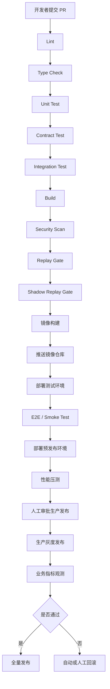

# docs/devops/env-setup.md

> 本文档基于当前已上传的 SimWar 资料整理生成，用于作为仓库中的标准化运行环境与构建指南基线。需要特别说明的是，项目文档已经多次强调：SimWar 当前仍处于“设计文档先行、源码工程待完全落地”的阶段，因此本文中的服务名、目录、脚本名、端口和部署方式，凡未被现有实现冻结者，均应视为**推荐基线**，并在代码落地后同步修订，而不是长期维持“文档与实现分叉”的状态。平台的核心架构边界已经相对稳定：**核心仿真引擎唯一写真值、AI 只读协同、已批准 ParameterSet 不可原位覆盖、Replay / Shadow Replay 是发布门禁、Kernel 稳定且 Plugin 可扩展**。fileciteturn0file0 fileciteturn0file1 fileciteturn0file3 fileciteturn0file7 fileciteturn0file8 fileciteturn0file9 fileciteturn0file12

## 文档信息与设计基线

### 文档信息

| 项目 | 内容 |
|---|---|
| 文档名称 | `docs/devops/env-setup.md` |
| 项目名称 | SimWar |
| 文档版本 | v1.0 |
| 文档状态 | Draft |
| 最后更新 | 2026-05-14 |
| 适用范围 | 本地开发 / 测试 / 构建 / Docker / Kubernetes / CI/CD / 部署 / 运维 |
| 维护人 | 请根据实际项目修改 |
| 相关文档 | `README.md` / `docs/product/requirements.md` / `docs/architecture/system-architecture.md` / `docs/contracts/api-contract.md` / `docs/quality/test-coverage.md` / `docs/product/feature-refinement.md` / `docs/research/executive-model-study.md` / `docs/architecture/industry-plugin-model-report.md` |

### 文档定位

SimWar 被一致定义为面向高管培训、商学院课程与企业学习场景的 SaaS 仿真平台 / AI 仿真平台。平台主链覆盖教师开课、学员组队、多轮决策、回合结算、AI 复盘、Replay / Shadow Replay、行业插件扩展与学习闭环；工程上要求 Contract-first、Replayable、Deterministic、Auditable、Multi-tenant 与 Plugin-ready。本文同时面向开发、测试、部署和运维，目标是把**本地开发环境、容器化运行、数据库初始化、测试门禁、Kubernetes、CI/CD 与排错规则**统一为一份可直接入库的标准文档。fileciteturn0file1 fileciteturn0file5 fileciteturn0file7 fileciteturn0file8 fileciteturn0file9 fileciteturn0file10 fileciteturn0file11 fileciteturn0file12

### 核心环境原则

本项目的环境与构建必须贯彻以下约束：

| 原则 | 要求 |
|---|---|
| 环境一致性 | 本地、测试、预发布、生产尽量锁定同一依赖大版本；所有服务有稳定启动入口；所有环境变量提供 `.env.example` |
| 真值保护 | 只有 L1–L3 核心引擎可写 `state_true`、正式 `SettlementResult`、`Score`、`Rank` |
| AI 边界 | AI 只可读取经裁剪的 `state_obs` / `state_est`、授权知识与受控工具结果；只可写 advisory 对象 |
| 发布门禁 | `ParameterSet`、插件版本、模型版本、评分逻辑变更必须经过 Replay / Shadow Replay 与审批 |
| 自动化优先 | 优先提供一键安装、一键启动、迁移、种子数据、测试、构建、清理和重置入口 |
| 可观测性 | 所有核心服务应暴露健康检查、结构化日志、指标和追踪 |
| 多租户隔离 | 所有请求同时经过 `X-Tenant-Id`、RBAC、scope 与字段级可见性裁剪 |

上述边界不是实现偏好，而是项目文档中反复强调的 P0 / P1 基线。fileciteturn0file1 fileciteturn0file3 fileciteturn0file6 fileciteturn0file8 fileciteturn0file9 fileciteturn0file10

### 环境总览

SimWar 的文档已经收敛到一条比较清晰的工程路线：**前端与多数业务服务优先采用 TypeScript / Node.js，计量与仿真求解侧采用 Python，主事务库采用 PostgreSQL，缓存采用 Redis，事件链路采用 Kafka 或等价事件总线，快照与报告进入对象存储，向量检索采用 pgvector 或独立向量库，可观测性采用 OpenTelemetry + Prometheus + 集中日志**。同时，仓库形态以 monorepo 为推荐基线，服务分为 Gateway、BFF、Run/Decision/Compiler/Mapper/Solver/Replay/AI 编排等边界。fileciteturn0file7 fileciteturn0file8 fileciteturn0file9 fileciteturn0file11 fileciteturn0file12

| 模块 | 推荐技术 | 推荐版本 | 用途 | 是否必需 |
|---|---|---|---|---|
| 教师端 | Next.js / React / TypeScript | Node.js 24 LTS 运行 | 教师控制台、开课、锁轮、Replay、点评 | 是 |
| 学员端 | Next.js / React / TypeScript | Node.js 24 LTS 运行 | 团队驾驶舱、决策、结果反馈、学习报告 | 是 |
| 管理后台 | Next.js / React / TypeScript | Node.js 24 LTS 运行 | 租户、用户、审批、导出治理 | 建议 |
| API Gateway | Node.js + TypeScript | Node.js 24 LTS | 外部统一入口、鉴权、限流、审计注入 | 是 |
| Auth / IAM | Node.js + TypeScript | Node.js 24 LTS | 登录、JWT、角色绑定、租户隔离；MVP 可并入 Gateway / Admin | 是 |
| Course Service | Node.js + TypeScript | Node.js 24 LTS | 课程、班级、场景绑定；MVP 可并入 Gateway / Admin | 是 |
| Decision Service | Node.js + TypeScript | Node.js 24 LTS | 决策草稿、提交、校验编排；可映射到 RunOrchestrator + DecisionValidator | 是 |
| Simulation Engine | Python + 结构化求解内核 | Python 3.11.x | L1–L3 真值结算、快照生产 | 是 |
| AI Orchestrator | Node.js 或 Python | Node.js 24 LTS / Python 3.11.x | advisory-only 的 AI 编排、RAG、工具调用 | 是 |
| Replay Service | Node.js / Python | 与引擎同大版本 | Replay / Shadow Replay / diff 报告 | 是 |
| Plugin Service | Node.js / Python | 与内核兼容版本 | 行业插件注册、编译、运行时 hook；可映射到 ScenarioCompiler / PluginRuntime | 是 |
| Audit Service | Node.js + PostgreSQL | Node.js 24 LTS | 审计查询、导出、实体时间线；MVP 可逻辑并入 Gateway | 是 |
| PostgreSQL | PostgreSQL | 16.x 基线，兼容 17.x / 18.x | 主事务库、快照元数据、审计索引 | 是 |
| Redis | Redis | 7.4+，请按团队镜像锁定 | 缓存、会话、排行榜、幂等键 | 是 |
| 消息队列 | Kafka 或 RabbitMQ | Kafka 4.1+/4.2 系列 或 RabbitMQ 4.2+/4.3 系列 | 事件账本、审计异步消费、Replay 队列 | 建议 |
| 对象存储 | MinIO / S3 兼容对象存储 | 当前稳定版 | 结果包、快照包、审计导出、授权内容包 | 建议 |
| 向量数据库 | pgvector / Qdrant | 请根据实际项目修改 | 授权内容检索、案例搜索、RAG | 可选 |
| LRS | xAPI / LRS 服务 | 请根据实际项目修改 | 学习记录、诊断事件、反思闭环 | 建议 |
| OpenTelemetry Collector | OTel Collector | 当前稳定版 | traces / metrics / logs 汇聚 | 建议 |
| Prometheus | Prometheus | 当前稳定版 | 指标抓取与告警 | 建议 |
| Grafana | Grafana | 当前稳定版 | 仪表盘与告警展示 | 建议 |
| Docker | Docker Desktop / Engine | Compose v2 | 本地容器化开发与镜像构建 | 是 |
| Kubernetes | Kubernetes | 1.35+，优先 1.36 | 生产编排、HPA、Ingress、灰度、回滚 | P1 |
| CI/CD | GitHub Actions / GitLab CI / Jenkins + GitOps | 请根据实际项目修改 | 自动检查、镜像构建、部署与回滚 | P1 |

版本基线的原因如下：Node.js 官方建议生产应用使用 Active LTS 或 Maintenance LTS 分支；截至本文更新时，v24 与 v22 处于 LTS，v20 已 EOL。Docker 官方将 Docker Compose 作为 Docker Desktop / Docker CLI 体系的一部分，并明确把 Docker Desktop 作为推荐安装方式；Kubernetes 官方当前维护最近三个小版本分支，即 1.36、1.35、1.34；PostgreSQL 官方对每个大版本提供约 5 年支持，而 16/17/18 当前仍在支持窗口内；Python 官方显示 3.11 仍处于 security 支持周期直到 2027-10，而 3.9 已 EOL，因此本文将 3.11.x 作为统一 Python 基线，不再把 3.9 作为新的标准环境。RabbitMQ 官方当前列出了 4.3 与 4.2 两条受支持发布线，因此若团队追求更长的支持窗口，可优先选择 4.2.x；若需要更新特性，可选择 4.3.x。citeturn10view1turn10view2turn10view3turn10view4turn10view5turn10view0

## 系统依赖与目录约定

### 开发机系统依赖

以下依赖用于开发机本地安装。若团队全部采用容器化开发，也建议至少保留 Git、Docker、Make、OpenSSL、PostgreSQL Client 和 Redis CLI，便于排障和脚本执行。项目文档已经把 Node.js、Python、Docker、PostgreSQL、Redis、消息队列、对象存储和可观测性列为运行基线。fileciteturn0file7 fileciteturn0file9 fileciteturn0file12

#### macOS

| 软件 | 推荐版本 | 安装方式示例 | 验证命令 |
|---|---|---|---|
| Git | 当前稳定版 | `brew install git` | `git --version` |
| Node.js | 24 LTS | `brew install node@24` 或 `nvm install 24` | `node -v` |
| npm | 11+ | 随 Node.js 安装 | `npm -v` |
| Python | 3.11.x | `brew install python@3.11` | `python3.11 --version` |
| uv | 当前稳定版 | `brew install uv` | `uv --version` |
| Docker Desktop | 当前稳定版 | 官网安装包 | `docker --version` |
| Docker Compose | Compose v2 | Docker Desktop 自带 | `docker compose version` |
| PostgreSQL Client | 16+ | `brew install libpq && brew link --force libpq` | `psql --version` |
| Redis CLI | 7.4+ | `brew install redis` | `redis-cli --version` |
| Make | 系统自带或当前稳定版 | `xcode-select --install` | `make --version` |
| OpenSSL | 当前稳定版 | `brew install openssl` | `openssl version` |
| kubectl | 与集群 minor 保持一致 | `brew install kubectl` | `kubectl version --client` |
| Helm | 当前稳定版 | `brew install helm` | `helm version` |
| Terraform | 当前稳定版 | `brew install terraform` | `terraform version` |
| MinIO Client | 当前稳定版 | `brew install minio-mc` | `mc --version` |

#### Windows

| 软件 | 推荐版本 | 安装方式示例 | 验证命令 |
|---|---|---|---|
| Git | 当前稳定版 | `winget install Git.Git` | `git --version` |
| Node.js | 24 LTS | `winget install OpenJS.NodeJS.LTS` 或 `nvm-windows` | `node -v` |
| Python | 3.11.x | `winget install Python.Python.3.11` | `python --version` |
| uv | 当前稳定版 | `winget install astral-sh.uv` | `uv --version` |
| Docker Desktop | 当前稳定版 | `winget install Docker.DockerDesktop` | `docker --version` |
| Docker Compose | Compose v2 | Docker Desktop 自带 | `docker compose version` |
| PostgreSQL Client | 16+ | PostgreSQL Installer 或 `winget` | `psql --version` |
| Redis CLI | 7.4+ | 建议使用 Docker 容器内 CLI 或 WSL | `redis-cli --version` |
| Make | 当前稳定版 | `choco install make` 或使用 Git Bash / MSYS2 | `make --version` |
| OpenSSL | 当前稳定版 | `winget install ShiningLight.OpenSSL.Light` | `openssl version` |
| kubectl | 与集群 minor 保持一致 | `winget install Kubernetes.kubectl` | `kubectl version --client` |
| Helm | 当前稳定版 | `winget install Helm.Helm` | `helm version` |
| Terraform | 当前稳定版 | `winget install Hashicorp.Terraform` | `terraform version` |
| MinIO Client | 当前稳定版 | 下载二进制并加入 PATH | `mc --version` |

#### Linux

| 软件 | 推荐版本 | 安装方式示例 | 验证命令 |
|---|---|---|---|
| Git | 当前稳定版 | `sudo apt-get install git` | `git --version` |
| Node.js | 24 LTS | 使用 `nvm` 或官方仓库 | `node -v` |
| Python | 3.11.x | `sudo apt-get install python3.11 python3.11-venv` | `python3.11 --version` |
| uv | 当前稳定版 | 官方安装脚本或发行版包 | `uv --version` |
| Docker Engine | 当前稳定版 | Docker 官方仓库 | `docker --version` |
| Docker Compose Plugin | Compose v2 | Docker 官方仓库 | `docker compose version` |
| PostgreSQL Client | 16+ | `sudo apt-get install postgresql-client` | `psql --version` |
| Redis CLI | 7.4+ | `sudo apt-get install redis-tools` | `redis-cli --version` |
| Make | 当前稳定版 | `sudo apt-get install make` | `make --version` |
| OpenSSL | 当前稳定版 | `sudo apt-get install openssl` | `openssl version` |
| kubectl | 与集群 minor 保持一致 | 官方 apt/yum 仓库 | `kubectl version --client` |
| Helm | 当前稳定版 | 官方脚本或包仓库 | `helm version` |
| Terraform | 当前稳定版 | HashiCorp 仓库 | `terraform version` |
| MinIO Client | 当前稳定版 | 下载二进制 | `mc --version` |

#### 推荐验证命令

```bash
git --version
node -v
npm -v
python3.11 --version
uv --version
docker --version
docker compose version
psql --version
redis-cli --version
make --version
openssl version
kubectl version --client
helm version
terraform version
```

### 项目目录结构

项目文档已经比较明确地建议采用 monorepo：`contracts/`、`services/`、`apps/`、`tests/`、`docs/` 为主干，同时教师端 / 学员端通过 BFF 聚合层消费数据，而不是直连正式结算入口。下面的目录结构综合了 docs/architecture/system-architecture.md、README、教师端/学员端架构和运行环境文档。fileciteturn0file7 fileciteturn0file9 fileciteturn0file11 fileciteturn0file12

```text
simwar/
├── apps/
│   ├── teacher-web/
│   ├── student-web/
│   ├── admin-web/
│   ├── community-web/
│   └── competition-web/
├── services/
│   ├── api-gateway/
│   ├── auth-service/                 # 请根据实际项目修改；MVP 可并入 gateway/admin
│   ├── course-service/               # 请根据实际项目修改；MVP 可并入 gateway/admin
│   ├── decision-service/             # 请根据实际项目修改；可映射到 decision-validator + run orchestration
│   ├── decision-validator/
│   ├── scenario-compiler/
│   ├── feature-mapper/
│   ├── simulation-engine/            # 可映射到 market-solver-py + operations + finance-score-engine
│   ├── market-solver-py/
│   ├── operations-solver/
│   ├── finance-score-engine/
│   ├── replay-service/
│   ├── coach-orchestrator/
│   ├── plugin-service/               # 请根据实际项目修改；可映射到 plugin runtime / registry
│   ├── audit-service/                # 请根据实际项目修改；MVP 可逻辑并入 gateway/admin
│   ├── parameter-registry/
│   ├── model-governance/
│   ├── teacher-bff/
│   └── student-bff/
├── contracts/
│   ├── openapi/
│   ├── jsonschema/
│   └── protobuf/
├── packages/
│   ├── shared-types/
│   ├── api-sdk/
│   ├── ui-kit/
│   ├── auth-permission/
│   ├── replay-player/
│   └── ai-widgets/
├── infra/
│   ├── docker/
│   ├── compose/
│   ├── k8s/
│   ├── helm/
│   └── terraform/
├── data/
│   ├── migrations/
│   ├── seed_scenarios/
│   ├── seed_parameter_sets/
│   ├── seed_plugins/
│   └── synthetic_panels/
├── tests/
│   ├── unit/
│   ├── contract_tests/
│   ├── integration/
│   ├── e2e/
│   ├── replay_tests/
│   ├── shadow_replay_tests/
│   ├── solver_golden_tests/
│   ├── performance_tests/
│   └── l4_boundary_tests/
├── docs/
│   ├── architecture/
│   ├── runbooks/
│   ├── model_contracts/
│   └── teacher_student_views/
├── scripts/
│   ├── bootstrap/
│   ├── db/
│   ├── seed/
│   ├── replay/
│   └── ci/
├── .env.example
├── docker-compose.yml
├── Makefile
└── README.md
```

| 目录 | 用途 |
|---|---|
| `apps/` | 前端应用，教师端、学员端、管理后台、社区与竞赛前台 |
| `services/` | API、BFF、仿真内核、Replay、AI、治理等服务 |
| `contracts/` | OpenAPI、JSON Schema、Protobuf 契约，支撑 Contract-first |
| `packages/` | 共享类型、SDK、UI 组件、权限守卫、Replay / AI 小部件 |
| `infra/` | Docker、Compose、Kubernetes、Helm、Terraform 等基础设施编排 |
| `data/` | 数据迁移、种子数据、场景包、参数集、插件包样本 |
| `tests/` | 单元、契约、集成、E2E、Replay、Shadow Replay、性能、AI 边界 |
| `docs/` | 架构文档、运行手册、模型契约、前端蓝图 |
| `scripts/` | 启动、迁移、种子、Replay、CI 辅助脚本 |

### 克隆项目

#### monorepo 推荐方式

```bash
git clone <REPOSITORY_URL> simwar
cd simwar
```

#### polyrepo 兼容方式

如果项目后续改为 polyrepo，建议按以下顺序拉取，避免契约与共享类型先后不一致：

```bash
# 先拉 contracts 与 shared packages
git clone <CONTRACTS_REPOSITORY_URL> simwar-contracts
git clone <PACKAGES_REPOSITORY_URL> simwar-packages

# 再拉核心服务
git clone <CORE_SERVICES_REPOSITORY_URL> simwar-services

# 最后拉前端应用
git clone <APPS_REPOSITORY_URL> simwar-apps
```

```bash
# 建议统一在一个工作区目录下组织
mkdir simwar-workspace
mv simwar-contracts simwar-packages simwar-services simwar-apps simwar-workspace/
cd simwar-workspace
```

项目文档当前整体倾向 monorepo；若后续拆仓，请继续维持**契约优先**与**脚本名称稳定**，避免 CI / 文档 / 自动化生成器失效。fileciteturn0file5 fileciteturn0file9 fileciteturn0file12

### 环境变量配置

项目已有运行环境文档给出一组相对完整的环境变量基线，包括数据库、Redis、JWT、LRS、内部服务地址、AI Provider、默认场景包、默认参数集、授权内容目录和功能开关。下面的 `.env.example` 在其基础上补充了教师端、学员端、独立 Auth/Course/Decision/Plugin/Audit Service 与向量数据库条目；其中新增项属于**推荐补齐项**，请根据实际项目修改。fileciteturn0file6 fileciteturn0file9 fileciteturn0file12

#### `.env.example`

```env
# App
APP_NAME=simwar
APP_ENV=development
DEBUG=false
APP_PORT=3000
LOG_LEVEL=info
APP_BASE_URL=http://localhost:3000

# Tenant
TENANT_MODE=single
DEFAULT_TENANT_ID=tenant_demo

# Web
TEACHER_WEB_PORT=3001
STUDENT_WEB_PORT=3002
ADMIN_WEB_PORT=3003
TEACHER_WEB_URL=http://localhost:3001
STUDENT_WEB_URL=http://localhost:3002
ADMIN_WEB_URL=http://localhost:3003

# Auth
JWT_SECRET=<JWT_SECRET_PLACEHOLDER>
JWT_EXPIRES_IN=3600
REFRESH_TOKEN_SECRET=<REFRESH_TOKEN_SECRET_PLACEHOLDER>
SESSION_SECRET=<SESSION_SECRET_PLACEHOLDER>
INTERNAL_SERVICE_TOKEN=<INTERNAL_SERVICE_TOKEN_PLACEHOLDER>

# Database
DATABASE_URL=postgresql://<DB_USER>:<DB_PASSWORD>@localhost:5432/<DB_NAME>
DATABASE_POOL_SIZE=10
POSTGRES_HOST=localhost
POSTGRES_PORT=5432
POSTGRES_DB=simwar
POSTGRES_USER=simwar_app
POSTGRES_PASSWORD=<DB_PASSWORD_PLACEHOLDER>

# Redis
REDIS_URL=redis://localhost:6379/0
REDIS_PASSWORD=<REDIS_PASSWORD_PLACEHOLDER>

# Message Bus
MQ_ENABLED=true
MQ_MODE=kafka
KAFKA_BROKERS=localhost:9092
KAFKA_CLIENT_ID=simwar-local
KAFKA_TOPIC_EVENTS=simwar.events
KAFKA_TOPIC_AUDIT=simwar.audit
KAFKA_TOPIC_REPLAY=simwar.replay
KAFKA_TOPIC_LEARNING=simwar.learning
RABBITMQ_URL=amqp://<RABBITMQ_USER>:<RABBITMQ_PASSWORD>@localhost:5672/<VHOST>

# Object Storage
S3_ENDPOINT=http://localhost:9000
S3_REGION=us-east-1
S3_BUCKET=simwar-artifacts
AUDIT_EXPORT_BUCKET=simwar-audit
S3_ACCESS_KEY=<S3_ACCESS_KEY_PLACEHOLDER>
S3_SECRET_KEY=<S3_SECRET_KEY_PLACEHOLDER>

# Vector DB
VECTOR_DB_MODE=qdrant
VECTOR_DB_URL=http://localhost:6333
VECTOR_DB_COLLECTION=simwar_knowledge
PGVECTOR_ENABLED=false

# Analytics / LRS
CLICKHOUSE_ENABLED=false
CLICKHOUSE_URL=http://localhost:8123
CLICKHOUSE_USER=default
CLICKHOUSE_PASSWORD=<CLICKHOUSE_PASSWORD_PLACEHOLDER>
CLICKHOUSE_DATABASE=simwar_analytics
LRS_ENDPOINT=http://localhost:8081/xAPI/
LRS_KEY=<LRS_KEY_PLACEHOLDER>
LRS_SECRET=<LRS_SECRET_PLACEHOLDER>

# Service URLs
API_GATEWAY_URL=http://localhost:3000
AUTH_SERVICE_URL=http://localhost:3005
COURSE_SERVICE_URL=http://localhost:3006
DECISION_SERVICE_URL=http://localhost:3007
SIMULATION_ENGINE_URL=http://localhost:8000
MARKET_SOLVER_URL=http://localhost:8100
REPLAY_SERVICE_URL=http://localhost:8200
AI_ORCHESTRATOR_URL=http://localhost:8300
PLUGIN_SERVICE_URL=http://localhost:8400
AUDIT_SERVICE_URL=http://localhost:8500
PARAMETER_REGISTRY_URL=http://localhost:8600
MODEL_GOVERNANCE_URL=http://localhost:8700
TEACHER_BFF_URL=http://localhost:3010
STUDENT_BFF_URL=http://localhost:3020

# AI / LLM
MODEL_PROVIDER=<MODEL_PROVIDER_PLACEHOLDER>
MODEL_NAME=<MODEL_NAME_PLACEHOLDER>
OPENAI_API_KEY=<OPENAI_API_KEY_PLACEHOLDER>
OPENAI_BASE_URL=<OPENAI_BASE_URL_PLACEHOLDER>
MODEL_GUARDRAIL_MODE=enforced
RAG_TOP_K=6

# Scenario / Governance
DEFAULT_SCENARIO_PACKAGE_ID=<SCENARIO_PACKAGE_ID_PLACEHOLDER>
DEFAULT_PARAMETER_SET_ID=<PARAMETER_SET_ID_PLACEHOLDER>
DEFAULT_PLUGIN_PACKAGE_ID=<PLUGIN_PACKAGE_ID_PLACEHOLDER>
DEFAULT_MODEL_VERSION_ID=<MODEL_VERSION_ID_PLACEHOLDER>
LICENSED_CONTENT_ZONE_PATH=/data/licensed-content

# Observability
OTEL_EXPORTER_OTLP_ENDPOINT=http://localhost:4317
OTEL_EXPORTER_OTLP_HTTP_ENDPOINT=http://localhost:4318
OTEL_SERVICE_NAME=simwar-api-gateway
PROMETHEUS_PORT=9090
GRAFANA_PORT=3004

# Feature Flags
FEATURE_ENABLE_COMMUNITY=true
FEATURE_ENABLE_COMPETITION=true
FEATURE_ENABLE_LRS=true
FEATURE_ENABLE_SHADOW_REPLAY=true
FEATURE_ENABLE_VECTOR_SEARCH=true
```

#### 环境变量说明

| 变量名 | 必填 | 默认值 | 说明 | 使用模块 |
|---|---|---:|---|---|
| `APP_NAME` | 是 | `simwar` | 应用名称 | 全部 |
| `APP_ENV` | 是 | `development` | 运行环境 | 全部 |
| `DEBUG` | 是 | `false` | 调试模式；生产必须关闭 | 全部 |
| `APP_PORT` | 是 | `3000` | 统一入口端口 | API Gateway |
| `APP_BASE_URL` | 是 | `http://localhost:3000` | 外部访问基址 | API Gateway / 前端 |
| `TENANT_MODE` | 是 | `single` | 多租户模式 | Gateway / Admin |
| `DEFAULT_TENANT_ID` | 否 | `tenant_demo` | 本地开发默认租户 | Gateway / Admin |
| `TEACHER_WEB_PORT` | 否 | `3001` | 教师端独立开发端口 | Teacher Web |
| `STUDENT_WEB_PORT` | 否 | `3002` | 学员端独立开发端口 | Student Web |
| `ADMIN_WEB_PORT` | 否 | `3003` | 管理后台独立开发端口 | Admin Web |
| `JWT_SECRET` | 是 | 无 | 访问令牌签名密钥 | Auth |
| `JWT_EXPIRES_IN` | 否 | `3600` | Token 生命周期 | Auth |
| `REFRESH_TOKEN_SECRET` | 是 | 无 | 刷新令牌签名密钥 | Auth |
| `SESSION_SECRET` | 是 | 无 | 会话签名密钥 | Gateway / Web |
| `INTERNAL_SERVICE_TOKEN` | 是 | 无 | 内部可信服务调用凭证 | Internal APIs |
| `DATABASE_URL` | 是 | 无 | PostgreSQL 主连接串 | 全部后端 |
| `DATABASE_POOL_SIZE` | 否 | `10` | 连接池大小 | 全部后端 |
| `POSTGRES_*` | 是 | 见示例 | 结构化数据库连接参数 | DB / migrations |
| `REDIS_URL` | 是 | `redis://localhost:6379/0` | Redis 连接串 | Cache / session / idempotency |
| `REDIS_PASSWORD` | 否 | 无 | Redis 口令 | Cache |
| `MQ_ENABLED` | 否 | `true` | 是否启用消息队列 | Eventing |
| `MQ_MODE` | 否 | `kafka` | 消息实现方式 | Eventing |
| `KAFKA_*` | 视模式而定 | 见示例 | Kafka Broker、client 与 topic 配置 | Event bus / Replay |
| `RABBITMQ_URL` | 视模式而定 | 无 | RabbitMQ AMQP 连接串 | Event bus |
| `S3_*` | 建议 | 见示例 | 对象存储连接、桶、密钥 | Artifacts / audit |
| `AUDIT_EXPORT_BUCKET` | 建议 | `simwar-audit` | 审计导出桶 | Audit |
| `VECTOR_DB_MODE` | 否 | `qdrant` | 向量检索后端 | RAG / AI |
| `VECTOR_DB_URL` | 否 | `http://localhost:6333` | 向量库地址 | RAG / AI |
| `VECTOR_DB_COLLECTION` | 否 | `simwar_knowledge` | 向量集合名称 | RAG / AI |
| `PGVECTOR_ENABLED` | 否 | `false` | 是否使用 pgvector | DB / RAG |
| `CLICKHOUSE_*` | 可选 | 见示例 | 分析库连接参数 | Analytics |
| `LRS_ENDPOINT` | 建议 | `http://localhost:8081/xAPI/` | 学习记录服务入口 | LRS / Analytics |
| `LRS_KEY` / `LRS_SECRET` | 建议 | 无 | LRS 访问凭据 | LRS |
| `API_GATEWAY_URL` | 是 | `http://localhost:3000` | API 统一入口 | 全部 |
| `AUTH_SERVICE_URL` | 视拆分而定 | `http://localhost:3005` | 认证服务 | Auth |
| `COURSE_SERVICE_URL` | 视拆分而定 | `http://localhost:3006` | 课程服务 | Course |
| `DECISION_SERVICE_URL` | 视拆分而定 | `http://localhost:3007` | 决策服务 | Decision |
| `SIMULATION_ENGINE_URL` | 是 | `http://localhost:8000` | 仿真引擎入口 | Simulation |
| `MARKET_SOLVER_URL` | 是 | `http://localhost:8100` | Python 求解服务 | Simulation |
| `REPLAY_SERVICE_URL` | 是 | `http://localhost:8200` | Replay 服务 | Replay |
| `AI_ORCHESTRATOR_URL` | 是 | `http://localhost:8300` | AI 编排 | AI |
| `PLUGIN_SERVICE_URL` | 视拆分而定 | `http://localhost:8400` | 插件治理/运行时 | Plugin |
| `AUDIT_SERVICE_URL` | 视拆分而定 | `http://localhost:8500` | 审计服务 | Audit |
| `PARAMETER_REGISTRY_URL` | 建议 | `http://localhost:8600` | 参数治理 | Governance |
| `MODEL_GOVERNANCE_URL` | 建议 | `http://localhost:8700` | 模型治理 | Governance |
| `TEACHER_BFF_URL` | 是 | `http://localhost:3010` | 教师端聚合层 | Teacher BFF |
| `STUDENT_BFF_URL` | 是 | `http://localhost:3020` | 学员端聚合层 | Student BFF |
| `MODEL_PROVIDER` | 是 | 无 | 模型服务商标识 | AI |
| `MODEL_NAME` | 是 | 无 | 具体模型名 | AI |
| `OPENAI_API_KEY` | 视提供商而定 | 无 | AI API Key | AI |
| `OPENAI_BASE_URL` | 否 | 无 | 兼容网关地址 | AI |
| `MODEL_GUARDRAIL_MODE` | 否 | `enforced` | 输出护栏策略 | AI |
| `RAG_TOP_K` | 否 | `6` | 检索召回条数 | AI / RAG |
| `DEFAULT_SCENARIO_PACKAGE_ID` | 建议 | 无 | 默认场景包 | Course / Seed |
| `DEFAULT_PARAMETER_SET_ID` | 建议 | 无 | 默认参数集 | Simulation |
| `DEFAULT_PLUGIN_PACKAGE_ID` | 建议 | 无 | 默认插件包 | Plugin |
| `DEFAULT_MODEL_VERSION_ID` | 建议 | 无 | 默认模型版本 | AI / Governance |
| `LICENSED_CONTENT_ZONE_PATH` | 建议 | `/data/licensed-content` | 授权内容受控路径 | Content governance |
| `OTEL_EXPORTER_OTLP_ENDPOINT` | 建议 | `http://localhost:4317` | OTLP gRPC 导出地址 | Observability |
| `OTEL_EXPORTER_OTLP_HTTP_ENDPOINT` | 建议 | `http://localhost:4318` | OTLP HTTP 导出地址 | Observability |
| `OTEL_SERVICE_NAME` | 是 | `simwar-api-gateway` | OTel 服务识别名 | Observability |
| `PROMETHEUS_PORT` | 否 | `9090` | Prometheus 面板端口 | Observability |
| `GRAFANA_PORT` | 否 | `3004` | Grafana 面板端口 | Observability |
| `FEATURE_ENABLE_*` | 否 | 见示例 | 功能开关 | 全部 |

**强制要求**：`.env`、`.env.production`、真实 Token、真实数据库密码、真实 LLM API Key、真实对象存储密钥都不得提交到版本库。生产环境必须使用 Secret Manager / KMS / Vault / Kubernetes Secret，而不是把 `.env` 当成长期配置真值。fileciteturn0file5 fileciteturn0file6 fileciteturn0file9 fileciteturn0file12

## 本地开发与数据初始化

### 安装根目录依赖

项目文档默认使用 `npm` 作为 TypeScript / 前端的统一入口，并保留 Python 计量服务的独立虚拟环境。为保持后续文档、CI 和自动化脚本一致，若未来改用 `pnpm`、`yarn`、`poetry` 或 `uv`，也应维持相同的脚本语义，而不是重命名全部命令。fileciteturn0file5 fileciteturn0file7 fileciteturn0file12

```bash
npm install
```

```bash
cd services/market-solver-py
python3.11 -m venv .venv
source .venv/bin/activate
python -m pip install --upgrade pip
pip install -r requirements.txt
cd ../..
```

Windows PowerShell:

```powershell
cd services/market-solver-py
python -m venv .venv
.\.venv\Scripts\Activate.ps1
python -m pip install --upgrade pip
pip install -r requirements.txt
cd ..\..
```

### 本地开发启动

#### 启动基础依赖服务

```bash
docker compose up -d postgres redis
```

如需完整验证事件链、对象存储、向量检索与观测链路：

```bash
docker compose up -d postgres redis kafka minio qdrant otel-collector prometheus grafana
```

#### 启动前端

如果前端采用独立开发端口，建议使用 3001 / 3002 / 3003；如果采用统一反向代理，则统一从 3000 入口进入。fileciteturn0file11 fileciteturn0file12

```bash
cd apps/teacher-web
npm run dev
```

```bash
cd apps/student-web
npm run dev
```

```bash
cd apps/admin-web
npm run dev
```

#### 启动后端服务

```bash
cd services/api-gateway
npm run dev
```

```bash
cd services/teacher-bff
npm run dev
```

```bash
cd services/student-bff
npm run dev
```

如采用更细粒度服务拆分，可继续单独启动：

```bash
cd services/auth-service && npm run dev
cd services/course-service && npm run dev
cd services/decision-service && npm run dev
cd services/plugin-service && npm run dev
cd services/audit-service && npm run dev
```

#### 启动仿真引擎

如果你把 `simulation-engine` 作为聚合目录，使用以下方式；如果仓库以 `market-solver-py + operations-solver + finance-score-engine` 分拆，请分别映射同名命令。

```bash
cd services/simulation-engine
python3.11 -m venv .venv
source .venv/bin/activate
pip install -r requirements.txt
python main.py
```

如果采用文档中出现频率更高的 `uvicorn` 入口：

```bash
cd services/market-solver-py
source .venv/bin/activate
python -m uvicorn simwar_solver.api.app:app --reload --host 0.0.0.0 --port 8100
```

#### 启动 AI Orchestrator

```bash
cd services/coach-orchestrator
npm run dev
```

或根据实际项目改为 Python：

```bash
cd services/coach-orchestrator
source .venv/bin/activate
python main.py
```

#### 启动 Replay Service

```bash
cd services/replay-service
npm run dev
```

#### 启动一键联调

```bash
docker compose up --build
```

后台启动：

```bash
docker compose up -d
```

查看日志：

```bash
docker compose logs -f
```

停止服务：

```bash
docker compose down
```

清理数据卷：

```bash
docker compose down -v
```

Docker 官方建议优先使用 `docker compose`；在 Linux 上若已安装 Docker Engine + CLI，也可使用 Compose plugin；独立 `docker-compose` 仅用于兼容旧环境。citeturn10view2

### 默认访问地址

| 服务 | 地址 | 说明 |
|---|---|---|
| 统一入口 | `http://localhost:3000` | API Gateway / 统一反向代理 |
| 教师端 | `http://localhost:3000/teacher` 或 `http://localhost:3001` | 教师控制台 |
| 学员端 | `http://localhost:3000/student` 或 `http://localhost:3002` | 学员驾驶舱 |
| 管理后台 | `http://localhost:3000/admin` 或 `http://localhost:3003` | 管理控制台 |
| Teacher BFF | `http://localhost:3010` | 教师端聚合服务 |
| Student BFF | `http://localhost:3020` | 学员端聚合服务 |
| Auth Service | `http://localhost:3005` | 认证与鉴权 |
| Course Service | `http://localhost:3006` | 课程与班级管理 |
| Decision Service | `http://localhost:3007` | 决策服务 |
| Simulation Engine | `http://localhost:8000` | 仿真引擎逻辑入口 |
| Market Solver | `http://localhost:8100` | Python 求解入口 |
| Replay Service | `http://localhost:8200` | Replay / Shadow Replay |
| AI Orchestrator | `http://localhost:8300` | AI 建议与复盘编排 |
| Plugin Service | `http://localhost:8400` | 插件服务 |
| Audit Service | `http://localhost:8500` | 审计查询与导出 |
| PostgreSQL | `localhost:5432` | 主事务库 |
| Redis | `localhost:6379` | 缓存 / 幂等 / 会话 |
| Kafka | `localhost:9092` | 事件总线 |
| MinIO | `http://localhost:9000` | 对象存储 |
| Qdrant | `http://localhost:6333` | 向量数据库 |
| Prometheus | `http://localhost:9090` | 指标系统 |
| Grafana | `http://localhost:3004` | 监控仪表盘 |

### Docker Compose 启动说明

项目文档推荐的本地形态是“**基础依赖容器化 + 业务服务可独立调试**”，这样既能保证环境一致性，又能保持调试效率。fileciteturn0file7 fileciteturn0file12

| 容器 | 端口 | 用途 |
|---|---|---|
| `postgres` | `5432` | 主事务数据库 |
| `redis` | `6379` | 缓存、会话、幂等键 |
| `kafka` | `9092` | 事件总线 |
| `minio` | `9000` | S3 兼容对象存储 |
| `qdrant` | `6333` | 向量检索 |
| `otel-collector` | `4317/4318` | 遥测汇聚 |
| `prometheus` | `9090` | 指标抓取 |
| `grafana` | `3004` | 仪表盘 |
| `api-gateway` | `3000` | 外部统一入口 |
| `teacher-bff` | `3010` | 教师端聚合层 |
| `student-bff` | `3020` | 学员端聚合层 |
| `market-solver` | `8100` | 求解服务 |
| `replay-service` | `8200` | Replay |
| `coach-orchestrator` | `8300` | AI 编排 |
| `teacher-web` | `3001` | 教师端开发服务器 |
| `student-web` | `3002` | 学员端开发服务器 |
| `admin-web` | `3003` | 管理后台开发服务器 |

### 数据库初始化

SimWar 文档明确把 PostgreSQL 作为主事务存储，把 Redis 定义为缓存 / 会话 / 排行榜 / 幂等键存储，并把状态快照与结果包放入 PostgreSQL + 对象存储组合中。fileciteturn0file9 fileciteturn0file12

```bash
docker compose up -d postgres redis
```

```bash
psql -h localhost -U postgres <<'SQL'
CREATE ROLE simwar_app WITH LOGIN PASSWORD 'CHANGE_ME_IN_LOCAL_DEV';
CREATE DATABASE simwar OWNER simwar_app;
GRANT ALL PRIVILEGES ON DATABASE simwar TO simwar_app;
SQL
```

```bash
psql -h localhost -U simwar_app -d simwar <<'SQL'
CREATE EXTENSION IF NOT EXISTS "pgcrypto";
CREATE EXTENSION IF NOT EXISTS "uuid-ossp";
CREATE EXTENSION IF NOT EXISTS vector;
SQL
```

### 数据库迁移与种子数据

由于当前仓库还没有完全冻结 ORM / migration 方案，文档建议**先冻结脚本名称**，再由实际技术栈实现它们。这样无论后续采用 Prisma、Drizzle、Knex、Alembic 还是 Django，都能保持文档、CI 和自动化生成器入口一致。fileciteturn0file5 fileciteturn0file12

```bash
npm run db:migrate
npm run db:seed
```

可选的更细分入口：

```bash
npm run db:init
npm run db:migrate
npm run db:seed:tenant
npm run db:seed:iam
npm run db:seed:courses
npm run db:seed:scenarios
npm run db:seed:plugins
npm run db:seed:parameters
npm run db:seed:model-versions
```

如果后台采用 Django：

```bash
python manage.py migrate
python manage.py loaddata seed_data.json
```

如果 Python 服务使用 Alembic：

```bash
alembic upgrade head
python scripts/seed.py
```

#### 建议初始化的数据对象

| 数据对象 | 说明 |
|---|---|
| 默认租户 | `tenant_demo`，用于本地开发与演示 |
| 默认管理员 | `admin_demo`，初始口令必须通过环境变量或初始化脚本注入 |
| 默认角色与权限 | `platform_admin` / `tenant_admin` / `teacher` / `learner` / `team_captain` / `model_governor` / `ops` |
| 默认课程 | 示例课程、班级、运行实例 |
| 默认场景包 | `ScenarioPackage` 示例 |
| 默认插件包 | `PluginPackage` 示例 |
| 默认参数集 | `ParameterSet` 示例，状态为 `approved` 或 `candidate`，请根据实际项目修改 |
| 默认模型版本 | AI 模型版本、prompt 版本、护栏版本 |
| 示例运行数据 | 示例队伍、回合、决策模板、Replay 样本 |

#### 数据库重置

```bash
npm run db:reset
```

或：

```bash
docker compose down -v
docker compose up --build
npm run db:migrate
npm run db:seed
```

### 健康检查

现有运行文档中的 Kubernetes 样例已经使用 `/healthz` 作为 liveness / readiness probe，因此本文将 `/healthz` 作为推荐健康检查端点；若实际项目希望同时暴露 `/health` 和 `/readyz`，可在实现中映射到同一探针逻辑。fileciteturn0file12

| 服务 | 健康检查路径 | 说明 |
|---|---|---|
| API Gateway | `/healthz` | 统一入口与依赖可用性 |
| Teacher BFF | `/healthz` | 教师聚合层健康检查 |
| Student BFF | `/healthz` | 学员聚合层健康检查 |
| Auth Service | `/healthz` | 认证服务 |
| Course Service | `/healthz` | 课程服务 |
| Decision Service | `/healthz` | 决策服务 |
| Simulation Engine | `/healthz` | 仿真引擎 |
| Replay Service | `/healthz` | Replay 服务 |
| AI Orchestrator | `/healthz` | AI 编排服务 |
| Plugin Service | `/healthz` | 插件服务 |
| Audit Service | `/healthz` | 审计服务 |

示例请求：

```bash
curl http://localhost:3000/healthz
curl http://localhost:3010/healthz
curl http://localhost:8100/healthz
curl http://localhost:8200/healthz
curl http://localhost:8300/healthz
```

数据库与缓存依赖建议使用专用探针：

```bash
pg_isready -h localhost -p 5432 -U simwar_app
redis-cli -h localhost -p 6379 ping
```

## 构建、迁移与测试门禁

### 数据库迁移规范

项目文档已经明确：正式发布必须可回滚，`ParameterSet` 不能在 `approved` 后被原位覆盖，正式结果不得被 Shadow Replay 回写。基于这些边界，数据库迁移必须纳入发布治理，而不能作为“开发便利脚本”随意执行。fileciteturn0file3 fileciteturn0file9 fileciteturn0file10 fileciteturn0file12

#### 迁移文件命名规范

> 以下命名规则为推荐基线，请根据实际项目修改。

```text
20260514_001_create_tenant_table.sql
20260514_002_create_course_tables.sql
20260514_003_create_run_round_tables.sql
20260514_004_create_parameter_set_tables.sql
20260514_005_add_plugin_package_version.sql
20260514_006_add_model_version_registry.sql
20260514_007_add_replay_report_index.sql
```

#### 本地迁移流程

```bash
git pull
npm install
npm run db:migrate
npm run db:seed
npm run test:contract
npm run test:integration
```

#### 测试环境迁移流程

```bash
npm ci
npm run db:migrate
npm run test:integration
npm run test:e2e
npm run test:replay
```

#### 生产环境迁移审批

在预发布通过前，不得把迁移直接推入生产。生产迁移至少需要满足：

| 要求 | 说明 |
|---|---|
| 审批单 | 关联变更单、风险单、回滚方案 |
| 备份 | 迁移前完成 PostgreSQL 快照 / 逻辑备份 |
| 兼容性 | 应用新旧版本与迁移脚本兼容 |
| 回滚脚本 | 对应 down migration 或等效回滚手册 |
| Replay 检查 | 影响结算链时必须补跑 Replay / Shadow Replay |
| 低峰执行 | 在业务低峰或维护窗口执行 |

#### 回滚策略

项目运行环境文档明确建议的回滚优先级为：**镜像回滚 > 配置回滚 > 参数回滚 > 数据迁移回滚**。也就是说，优先回滚服务与配置，最后才回滚数据库结构。fileciteturn0file12

#### 迁移前备份要求

```bash
pg_dump -h <DB_HOST> -U <DB_USER> -Fc <DB_NAME> > backup_$(date +%Y%m%d_%H%M%S).dump
```

```bash
aws s3 cp backup_$(date +%Y%m%d_%H%M%S).dump s3://<BACKUP_BUCKET>/database/
```

### 构建命令

#### 前端构建

```bash
cd apps/teacher-web
npm run build
```

```bash
cd apps/student-web
npm run build
```

```bash
cd apps/admin-web
npm run build
```

#### 后端构建

```bash
cd services/api-gateway
npm run build
```

```bash
cd services/teacher-bff
npm run build
```

```bash
cd services/student-bff
npm run build
```

如采用更细粒度服务：

```bash
cd services/auth-service && npm run build
cd services/course-service && npm run build
cd services/decision-service && npm run build
cd services/plugin-service && npm run build
cd services/audit-service && npm run build
```

#### Python 服务构建 / 打包

```bash
cd services/market-solver-py
pip install -r requirements.txt
python -m compileall .
```

如需要 wheel / 镜像前构建：

```bash
python -m build
```

#### Docker 镜像构建

```bash
docker build -t <REGISTRY_HOST>/simwar/api-gateway:<TAG> services/api-gateway
docker build -t <REGISTRY_HOST>/simwar/teacher-bff:<TAG> services/teacher-bff
docker build -t <REGISTRY_HOST>/simwar/student-bff:<TAG> services/student-bff
docker build -t <REGISTRY_HOST>/simwar/market-solver:<TAG> services/market-solver-py
docker build -t <REGISTRY_HOST>/simwar/replay-service:<TAG> services/replay-service
docker build -t <REGISTRY_HOST>/simwar/coach-orchestrator:<TAG> services/coach-orchestrator
```

#### 全项目构建

```bash
npm run build:all
```

或：

```bash
make build
```

### 测试命令

SimWar 的测试门禁不只是普通单测，而是围绕“**真值可复算、权限可验证、边界可证明、发布可回滚**”组织的分层体系；文档已明确要求覆盖 unit、contract、integration、E2E、Replay、Shadow Replay、Golden Solver、L4 Boundary、插件兼容、多租户隔离和安全测试。fileciteturn0file9 fileciteturn0file10 fileciteturn0file12

#### 单元测试

```bash
npm test
```

```bash
pytest services/market-solver-py/tests -q
```

#### 集成测试

```bash
npm run test:integration
```

#### E2E 测试

```bash
npm run test:e2e
```

#### API 契约测试

```bash
npm run test:contract
```

#### Replay 测试

```bash
python scripts/replay_test.py --run-id=<RUN_ID>
```

#### Shadow Replay 测试

```bash
python scripts/shadow_replay.py --candidate=<CANDIDATE_ID>
```

#### AI 边界测试

```bash
npm run test:ai-boundary
```

#### 推荐补充测试

```bash
npm run test:replay
npm run test:solver-golden
npm run test:multi-tenant
npm run test:plugin-compatibility
npm run test:performance
npm run test:security
npm run test:compliance
```

#### 测试用途说明

| 测试类型 | 用途 |
|---|---|
| 单元测试 | 验证纯函数、状态机、校验规则、字段白名单、求解辅助模块 |
| 契约测试 | 验证 OpenAPI / JSON Schema / Protobuf 与实现一致 |
| 集成测试 | 跑通课程、回合、结算、结果发布、复盘的服务间链路 |
| E2E 测试 | 从教师端 / 学员端视角验证真实业务闭环 |
| Replay 测试 | 验证同输入、同参数、同 seed 的正式结果一致 |
| Shadow Replay 测试 | 验证候选参数 / 模型 / 插件差异可解释且不覆盖正式结果 |
| Solver Golden 测试 | 防止计量或求解结果意外漂移 |
| AI 边界测试 | 验证 AI 不得写入真值字段或越权读取 |
| 插件兼容测试 | 验证 Plugin 不绕过 Kernel、不污染 Canonical Model |
| 多租户隔离测试 | 验证跨租户与字段泄漏全部被拒绝 |
| 性能测试 | 验证课堂高峰与竞赛高峰下的延迟与吞吐 |
| 合规测试 | 验证授权内容、导出审批、品牌边界与审计链完整性 |

### Lint、格式化与类型检查

```bash
npm run lint
npm run format
npm run typecheck
```

Python 侧：

```bash
ruff check .
black .
mypy .
```

提交前至少执行：

```bash
npm run lint
npm run typecheck
npm test
npm run test:contract
pytest services/market-solver-py/tests -q
```

### 本地开发常用命令

| 命令 | 说明 |
|---|---|
| `npm run dev` | 启动主开发服务 |
| `npm run dev:teacher-web` | 启动教师端 |
| `npm run dev:student-web` | 启动学员端 |
| `npm run build` | 构建当前模块 |
| `npm run build:all` | 全项目构建 |
| `npm test` | 运行单元测试 |
| `npm run test:integration` | 运行集成测试 |
| `npm run test:e2e` | 运行 E2E 测试 |
| `npm run test:contract` | 运行 API / Schema 契约测试 |
| `npm run test:ai-boundary` | AI 边界测试 |
| `npm run db:migrate` | 执行数据库迁移 |
| `npm run db:seed` | 初始化种子数据 |
| `npm run db:reset` | 重置数据库 |
| `docker compose up --build` | 使用 Docker 构建并启动 |
| `docker compose down -v` | 清理本地环境与数据卷 |
| `make setup` | 一键初始化，请根据实际项目实现 |
| `make test` | 一键测试 |
| `make build` | 一键构建 |

## 部署、Kubernetes 与 CI/CD

### 生产环境构建与部署

项目文档已将“本地 Docker 开发 + 云上 Kubernetes 生产 + GitOps / 灰度发布 + 参数与模型治理”作为推荐生产形态。正式发布必须以前置测试、Replay、Shadow Replay、安全检查与回滚方案为条件。fileciteturn0file9 fileciteturn0file10 fileciteturn0file12

#### 生产部署流程

| 步骤 | 说明 |
|---|---|
| 准备生产环境变量 | 由 Secret Manager / Vault / KMS / Kubernetes Secret 提供 |
| 安装依赖 | CI 中使用 `npm ci` 与 Python 锁定依赖 |
| 构建静态资源 | 前端出产物或镜像 |
| 构建后端服务 | TypeScript 编译、Python 打包 / 镜像 |
| 数据库迁移 | 先备份，再执行迁移，再执行 smoke test |
| 镜像推送 | 推送至镜像仓库 |
| 部署测试 / 预发布 | 先执行 contract / integration / replay / shadow replay |
| 健康检查 | 通过 `/healthz`、日志、指标和业务 smoke test |
| 灰度发布 | `5% -> 20% -> 100%` 或蓝绿切换 |
| 回滚 | 优先镜像回滚，再配置回滚，再参数回滚，最后数据迁移回滚 |

#### 生产构建命令示例

```bash
npm ci
npm run build:all
```

```bash
docker build -t <REGISTRY_HOST>/simwar/api-gateway:<TAG> services/api-gateway
docker build -t <REGISTRY_HOST>/simwar/teacher-bff:<TAG> services/teacher-bff
docker build -t <REGISTRY_HOST>/simwar/student-bff:<TAG> services/student-bff
docker build -t <REGISTRY_HOST>/simwar/market-solver:<TAG> services/market-solver-py
docker build -t <REGISTRY_HOST>/simwar/replay-service:<TAG> services/replay-service
docker build -t <REGISTRY_HOST>/simwar/coach-orchestrator:<TAG> services/coach-orchestrator
```

```bash
docker push <REGISTRY_HOST>/simwar/api-gateway:<TAG>
docker push <REGISTRY_HOST>/simwar/teacher-bff:<TAG>
docker push <REGISTRY_HOST>/simwar/student-bff:<TAG>
docker push <REGISTRY_HOST>/simwar/market-solver:<TAG>
docker push <REGISTRY_HOST>/simwar/replay-service:<TAG>
docker push <REGISTRY_HOST>/simwar/coach-orchestrator:<TAG>
```

```bash
kubectl apply -f infra/k8s/namespace.yaml
kubectl apply -f infra/k8s/configmap.yaml
kubectl apply -f infra/k8s/secret.example.yaml
kubectl apply -f infra/k8s/
```

Docker 官方建议将 Docker Desktop 作为推荐安装方式，且 Docker Desktop 已包含 Docker Engine、Docker CLI 与 Compose；这样本地与 CI 的命令体系可以统一到 `docker build` 和 `docker compose`。citeturn10view2

### Kubernetes 部署建议

Kubernetes 官方当前维护最近三个小版本分支，现阶段为 1.36、1.35、1.34，因此本文推荐集群基线为 1.35+，优先 1.36，并要求 `kubectl` 与集群 minor 版本保持兼容。项目本身也把 Kubernetes、HPA、Ingress、可观测性、多环境隔离和灰度发布列为部署基线。citeturn10view3 fileciteturn0file9 fileciteturn0file12

#### Kubernetes 基本结构

| 资源 | 用途 |
|---|---|
| Namespace | 环境隔离，如 `simwar-dev` / `simwar-staging` / `simwar-prod` |
| Deployment | 无状态业务服务，如 Gateway、BFF、Replay、AI 编排 |
| StatefulSet | 有状态依赖，如自建 Kafka / ClickHouse / 向量库 |
| Service | 集群内服务发现 |
| Ingress | 对外统一入口 |
| ConfigMap | 非敏感配置 |
| Secret | 敏感配置与密钥占位 |
| Job / CronJob | 迁移、种子、Shadow Replay、审计导出 |
| HPA | 自动扩缩容 |
| PVC | 持久卷声明，用于数据库、对象存储等 |

#### 建议目录结构

```text
infra/k8s/
├── namespace.yaml
├── configmap.yaml
├── secret.example.yaml
├── api-gateway-deployment.yaml
├── teacher-bff-deployment.yaml
├── student-bff-deployment.yaml
├── simulation-engine-deployment.yaml
├── replay-service-deployment.yaml
├── ai-orchestrator-deployment.yaml
├── plugin-service-deployment.yaml
├── audit-service-deployment.yaml
├── ingress.yaml
├── hpa/
│   ├── api-gateway-hpa.yaml
│   ├── replay-service-hpa.yaml
│   └── ai-orchestrator-hpa.yaml
└── jobs/
    ├── db-migrate-job.yaml
    ├── db-seed-job.yaml
    └── shadow-replay-cronjob.yaml
```

#### `secret.example.yaml` 示例

> 只能使用占位符，不能写真实密钥。

```yaml
apiVersion: v1
kind: Secret
metadata:
  name: simwar-secrets
  namespace: simwar-prod
type: Opaque
stringData:
  JWT_SECRET: "<JWT_SECRET_PLACEHOLDER>"
  REFRESH_TOKEN_SECRET: "<REFRESH_TOKEN_SECRET_PLACEHOLDER>"
  DATABASE_URL: "postgresql://<DB_USER>:<DB_PASSWORD>@postgres-rw:5432/<DB_NAME>"
  REDIS_URL: "redis://:<REDIS_PASSWORD>@redis:6379/0"
  OPENAI_API_KEY: "<OPENAI_API_KEY_PLACEHOLDER>"
  INTERNAL_SERVICE_TOKEN: "<INTERNAL_SERVICE_TOKEN_PLACEHOLDER>"
  S3_ACCESS_KEY: "<S3_ACCESS_KEY_PLACEHOLDER>"
  S3_SECRET_KEY: "<S3_SECRET_KEY_PLACEHOLDER>"
```

#### Deployment 基线建议

| 服务 | 副本数建议 | 资源建议 | HPA 建议 |
|---|---:|---|---|
| API Gateway | 2 起步 | `250m/512Mi` 请求，`1000m/1024Mi` 上限 | 是 |
| Teacher BFF | 2 起步 | `250m/512Mi` | 是 |
| Student BFF | 2 起步 | `250m/512Mi` | 是 |
| Simulation Engine | 2 起步 | 视求解负载提高 CPU | 是 |
| Replay Service | 1–2 | 以 CPU / 内存为主 | 建议 |
| AI Orchestrator | 2 起步 | 视模型调用并发调整 | 是 |
| Plugin Service | 1–2 | 中等 | 可选 |
| Audit Service | 1–2 | 中等 | 可选 |

### CI/CD 流程

项目的测试覆盖文档与系统架构文档已经把 PR 检查、lint、类型检查、单元测试、契约测试、集成测试、Replay、Shadow Replay、性能压测、人工批准、灰度和回滚明确写成发布门禁。fileciteturn0file9 fileciteturn0file10 fileciteturn0file12



#### 流水线阶段建议

| 阶段 | 必过门禁 |
|---|---|
| Pull Request | `lint`、`typecheck`、`unit`、`contract`、基础 `security` 扫描 |
| Merge 后测试环境 | `integration`、`E2E`、`multi-tenant`、`plugin compatibility` |
| 预发布 | `solver golden`、`replay`、`shadow replay`、`performance` |
| 生产灰度 | canary 观测、错误率门禁、指标回归、人工批准 |
| 生产全量 | 可回滚镜像、迁移回滚脚本、审计完成 |

#### 建议的 CI 入口

```bash
npm ci
npm run lint
npm run typecheck
npm test
npm run test:contract
npm run test:integration
npm run build:all
```

```bash
pytest services/market-solver-py/tests -q
python scripts/replay_test.py --run-id=<RUN_ID>
python scripts/shadow_replay.py --candidate=<CANDIDATE_ID>
```

## 可观测性、安全与排错

### 日志与监控

OpenTelemetry Collector 官方将自身定义为“vendor-agnostic 的方式来接收、处理和导出 telemetry data”，并建议在一般场景下将 Collector 与服务一起部署，以统一处理 retries、batching、encryption 和 sensitive data filtering。项目架构文档也明确采用 OTel Collector + Prometheus + 集中日志 + 仪表盘的一体化方案。citeturn8view2 fileciteturn0file9 fileciteturn0file12

#### 日志分类

| 日志类型 | 内容 | 最低要求 |
|---|---|---|
| 应用日志 | 请求入口、响应码、依赖调用 | 结构化 JSON，带 `trace_id` |
| 审计日志 | 决策提交、锁轮、结算、审批、导出、权限变更 | 不可删除，必须可查询导出 |
| API 调用日志 | 网关调用、限流、鉴权失败 | 写入集中日志系统 |
| 仿真结算日志 | round 锁定、settle 开始/结束、耗时、异常 | 需与 `run_id` / `round_id` 关联 |
| AI 模型调用日志 | prompt 版本、model version、耗时、拒绝率 | 严禁记录敏感明文 Token |
| Replay 差异日志 | baseline / candidate / hash / diff_summary | 必须可审计 |
| 错误日志 | uncaught exception、依赖故障、超时 | 必须告警 |

#### 推荐指标

| 指标 | 说明 | 告警建议 |
|---|---|---|
| `api_latency_p95` | API P95 延迟 | 持续超过阈值告警 |
| `settlement_duration` | 回合结算耗时 | 超过课堂 SLA 告警 |
| `ai_call_error_rate` | AI 调用错误率 | 连续窗口超阈值告警 |
| `replay_diff_rate` | Replay 差异率 | 非预期增长必须阻断发布 |
| `db_connection_usage` | 数据库连接池使用率 | 超过 80% 告警 |
| `publish_delay_ms` | 结算完成到结果发布耗时 | 超出阈值告警 |
| `shadow_diff_count` | Shadow Replay 差异数量 | 超阈值阻断晋级 |
| `ai_guardrail_denied_total` | AI 越权拒绝次数 | 异常激增告警 |
| `kafka_consumer_lag` | 队列积压 | 持续堆积告警 |
| `pod_restart_total` | Pod 重启次数 | 高频重启告警 |

#### 推荐 JSON 日志格式

```json
{
  "ts": "2026-05-14T00:00:00Z",
  "level": "INFO",
  "service": "api-gateway",
  "trace_id": "trace_xxx",
  "request_id": "req_xxx",
  "tenant_id": "tenant_demo",
  "actor_id": "usr_demo",
  "action": "ROUND_SETTLED",
  "resource": "Run/run_demo_001",
  "message": "round settled successfully"
}
```

### 安全注意事项

SimWar 的安全不是普通 Web 应用安全的子集，而是“多租户 SaaS + 仿真真值链 + AI 边界 + 授权内容治理”的组合安全问题。文档已经明确要求：真实密钥不得入库，AI 不得改写真值，跨租户读取必须阻断，导出必须进入审批和审计链。fileciteturn0file3 fileciteturn0file6 fileciteturn0file8 fileciteturn0file9 fileciteturn0file12

- 不要提交 `.env`
- 不要提交真实密钥、真实 Token、真实 API Key
- 不要在日志中打印 Token、会话、数据库口令或完整 Prompt 明文
- 生产环境必须关闭 `DEBUG`
- Secret 必须进入密钥管理服务
- 数据库密码必须轮换
- AI API Key 仅通过环境变量 / Secret 注入
- 跨租户数据访问必须被拒绝
- 数据导出必须有审批与审计记录
- 审计日志、Replay 报告与 ParameterSet 审批记录不得随意删除
- AI 结果必须显式标识 `advisory_only`
- 正式运行中的教学变化只能通过 `ShockEvent` 注入，不得直接改数据库
- 未授权内容不得进入公开展示、训练链路或检索增强

### 常见问题与排错

| 问题 | 问题现象 | 可能原因 | 解决步骤 |
|---|---|---|---|
| 数据库连接失败 | 服务启动时报 `ECONNREFUSED` / `password authentication failed` | PostgreSQL 未启动、口令错误、`DATABASE_URL` 配错 | 检查 `docker compose ps`；执行 `pg_isready`；核对 `.env`；重新创建角色与数据库 |
| Redis 连接失败 | 登录态、幂等键或排行榜异常 | Redis 未启动、端口冲突、密码不一致 | `redis-cli ping`；检查 `REDIS_URL`；确认端口 `6379` 未被占用 |
| Docker 启动失败 | `docker compose up` 失败 | Docker Desktop 未运行、WSL / Hyper-V 问题、镜像不存在 | 确认 `docker info`；重新登录镜像仓库；检查 Compose 文件语法 |
| 端口被占用 | `EADDRINUSE` | 本机已有进程监听端口 | `lsof -i :3000` / `netstat -ano`；释放端口或修改 `.env` 端口 |
| 数据库迁移失败 | migrate 中断、表不存在、版本冲突 | 迁移顺序错、旧数据残留、down migration 缺失 | 查看迁移日志；先备份；必要时本地重置库；修复迁移顺序后重跑 |
| 前端无法访问 API | 页面白屏、401、CORS 或 404 | `API_GATEWAY_URL` 错误、反向代理未配置、JWT 或 Tenant 头丢失 | 检查浏览器 Network；核对网关配置；确认路径 `/teacher` / `/student` 或开发端口正确 |
| AI 服务调用失败 | 建议面板超时或报 5xx | API Key 缺失、模型名错误、Provider 限流、RAG 配置错 | 检查 `OPENAI_API_KEY` / `MODEL_PROVIDER` / `MODEL_NAME`；查看 AI Orchestrator 日志；验证外部网络与配额 |
| Replay 测试失败 | `replay_hash` 不一致 | 输入不稳定、随机种子不固定、候选参数漂移、代码改动影响求解 | 固定 `seed`；检查 `parameter_set_id`；确认历史数据未被覆盖；查看 diff report |
| 环境变量未加载 | 服务读取到默认值或空值 | `.env` 文件位置不对、compose 未引用、shell 未导出 | 检查应用启动目录；打印非敏感配置确认；检查 Compose `env_file` 与 `environment` |
| 权限或 Token 失效 | 401 / 403、路由被拒绝 | JWT 过期、角色绑定缺失、`X-Tenant-Id` 不匹配 | 刷新 Token；检查角色绑定；确认租户头与用户范围一致 |
| Shadow Replay 阻断发布 | 预发布被拒绝 | 参数、插件、模型或评分逻辑差异超阈值 | 查阅 `diff_report`；回退候选版本；修正后重新发起 Shadow Replay |
| 学员看到不该看到的数据 | 前端泄漏真值或内部字段 | BFF 裁剪缺失、字段白名单错误、缓存污染 | 检查可见性策略；清理缓存；补充多租户与字段级测试 |

### 开发前检查清单

- [ ] 已安装 Git
- [ ] 已安装 Node.js 24 LTS 或兼容的 22 LTS
- [ ] 已安装 Python 3.11.x
- [ ] 已安装 Docker 与 Docker Compose
- [ ] 已安装 PostgreSQL Client 与 Redis CLI
- [ ] 已复制 `.env.example` 为 `.env`
- [ ] 已配置 `DATABASE_URL`
- [ ] 已配置 `REDIS_URL`
- [ ] 已配置 `JWT_SECRET`
- [ ] 已配置 AI 相关占位符或本地 mock
- [ ] 已启动 PostgreSQL
- [ ] 已启动 Redis
- [ ] 已执行数据库迁移
- [ ] 已初始化 Seed Data
- [ ] 已创建默认租户
- [ ] 已创建默认管理员
- [ ] 已启动 API Gateway
- [ ] 已启动教师端
- [ ] 已启动学员端
- [ ] 已启动仿真引擎
- [ ] 已启动 AI Orchestrator
- [ ] 已运行最小闭环测试
- [ ] 已运行 `lint`、`typecheck` 和关键测试

### MVP 环境范围建议

#### MVP 必做

| 能力 | 是否必须 | 说明 |
|---|---|---|
| 本地开发环境 | 是 | 至少支持开发者一键起本地环境 |
| Docker Compose | 是 | 至少管理 PostgreSQL、Redis、基础依赖 |
| PostgreSQL | 是 | 主事务库 |
| Redis | 是 | 会话、缓存、幂等 |
| API Gateway | 是 | 统一入口 |
| 教师端 | 是 | 课程与回合控制 |
| 学员端 | 是 | 决策与结果反馈 |
| Simulation Engine | 是 | 正式结算 |
| AI Orchestrator | 是 | advisory-only |
| Replay Service | 是 | 最小可回放闭环 |
| 数据库迁移 | 是 | 可自动执行 |
| Seed Data | 是 | 演示与联调用 |
| 基础测试命令 | 是 | unit / contract / integration 最小集合 |

#### P1 增强

| 能力 | 说明 |
|---|---|
| Kubernetes | 生产编排 |
| CI/CD | 自动检查与部署 |
| 对象存储 | 报告与快照包 |
| 向量数据库 | 授权知识检索 |
| 监控告警 | OTel + Prometheus + Grafana |
| Shadow Replay 自动任务 | Job / CronJob 形式运行 |

#### P2 扩展

| 能力 | 说明 |
|---|---|
| 多区域部署 | 跨地域可用性 |
| 蓝绿发布 | 更稳健的生产切换 |
| 自动扩缩容 | 更细粒度弹性 |
| 灾备环境 | 更强恢复能力 |
| 完整数据湖 | 深度分析与训练数据治理 |
| 插件市场部署 | 行业插件市场化交付 |

### 最终说明

本文优先保证三件事：**环境一致性、真值保护、自动化可执行**。如果后续真实仓库的脚本名、目录名、服务名与本文存在差异，应优先修改代码与 CI 入口并同步更新本文；不要让开发、测试、运维与 AI 代码生成工具长期依赖一份失真的“文档基线”。这一点与仓库开发说明、系统架构、运行环境文档和测试门禁文档保持一致。fileciteturn0file5 fileciteturn0file9 fileciteturn0file10 fileciteturn0file12

