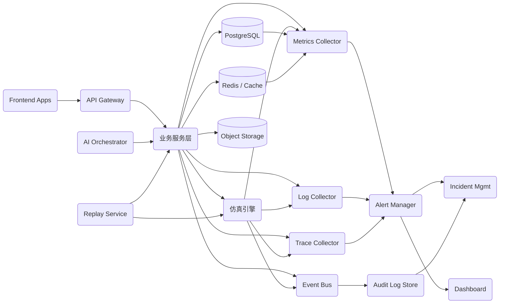
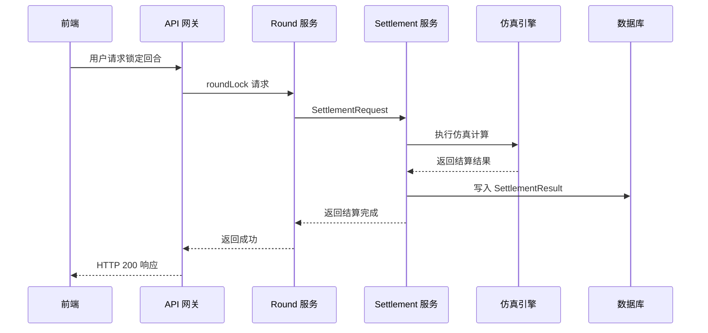
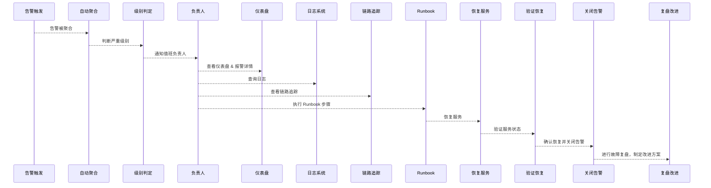

# SimWar 平台监控与告警配置文档

## 1. 文档信息

| 项目       | 内容                                               |
|-----------|--------------------------------------------------|
| 文档名称   | `docs/devops/monitoring-alerting.md`                         |
| 项目名称   | Sim War                                          |
| 文档版本   | v1.0                                             |
| 文档状态   | Draft                                            |
| 最后更新   | 2026-05-14                                      |
| 适用范围   | 监控 / 告警 / 可观测性 / SRE / 运维            |
| 维护人     | (请根据实际项目修改)                             |
| 相关文档   | `docs/architecture/system-architecture.md` / `docs/devops/env-setup.md` / `docs/devops/ci-cd-pipeline.md` / `docs/architecture/event-driven-architecture.md` |

## 2. 执行摘要

本项目为面向高管培训与商学院课程的 SaaS 仿真平台，涉及复杂的多租户、分布式业务流程，需要构建完善的监控与告警体系来保障系统稳定性和业务可用性。观测体系应覆盖基础设施到应用各层，遵循可观测性“三大支柱”原则（Metrics、Logs、Traces）【5†L21-L23】，并补充事件(Events)、审计日志、健康检查、仪表盘、告警与 Runbook 等要素。监控与告警体系覆盖如下层级：基础设施层、容器/Kubernetes 层、API 网关层、业务服务层、仿真引擎层、AI 模型层、Replay/Shadow Replay 层、数据库/缓存层、消息队列层、前端体验层、安全审计层、CI/CD 流水线层等，每一层均需设计关键指标与日志监控。

关键业务场景（如回合结算、决策提交、多租户隔离等）需要专门指标监控，例如监控回合结算耗时、失败率、结算结果写入成功率，Replay/Shadow Replay 通过率与差异率，参数集审批状态与绑定状态，以及 Plugin 部署状态、AI 小模型调用成功率、越权访问拦截次数、AI 输出可信度等。专门针对 AI 小模型、Replay 与 Shadow Replay、参数治理等模块制定监控方案，以防范“AI 写入真值”与结果覆盖的风险，并实时告警异常操作。

告警通过 Alertmanager 等聚合并触发事件响应流程，由 SRE/运维值班人员快速响应。告警规则应明确优先级、影响范围和应对方案，并关联专门仪表盘和 Runbook。监控体系将支持系统稳定性（SLO/SLA、错误预算）、安全合规性（审计日志、越权拦截）、业务可视化与持续交付（CI/CD 部署监控），确保问题可快速定位与恢复，问题复盘与持续改进。

## 3. 可观测性总体架构

以下为建议的可观测性架构图示例（使用 Mermaid 语法）：各组件包括前端应用、API 网关、业务服务、仿真引擎、AI 协调服务、Replay 服务、事件总线、数据库、缓存、对象存储，以及指标、日志、链路收集器、告警管理、仪表盘、事故管理和审计日志存储等。



## 4. 监控对象总览

| 监控对象        | 监控内容                                  | 指标来源             | 重要级别 |
|---------------|---------------------------------------|-------------------|--------|
| 前端应用        | 页面加载时间、首屏时间、资源请求失败率、JS 错误等      | RUM 前端监控工具        | 中      |
| API 网关        | 请求总数、错误数、延迟、吞吐量、认证/授权失败率       | 服务端指标、NGINX/Envoy日志 | 高      |
| Auth 服务       | 登录成功率、失败率、响应延迟、用户数               | Prometheus 指标      | 高      |
| Course 服务    | 课程发布/开启数、响应延迟、错误率                 | 应用埋点指标           | 中      |
| Decision 服务  | 决策提交请求数、成功率、响应时间                  | 应用埋点指标           | 高      |
| Round 服务     | 回合锁定数、回合开销、失败数                    | 应用埋点指标           | 高      |
| Settlement 服务| 结算请求数、成功率、耗时、失败数                 | 应用埋点指标           | 高      |
| 仿真引擎        | 结算启动数、完成数、失败数、耗时                 | 引擎内部指标           | 高      |
| AI Orchestrator| 模型调用次数、耗时、错误数、Token 使用量           | 应用埋点指标           | 高      |
| Replay 服务     | Replay 请求数、成功率、耗时、差异率              | 应用埋点指标           | 高      |
| Plugin 服务    | 插件加载数、部署成功率、回滚数                   | 应用埋点指标           | 中      |
| 参数注册服务    | 参数集创建/审批数、绑定运行数、审批失败数          | 应用埋点指标           | 中      |
| 模型注册服务    | 模型版本部署数、回滚数、启动失败数                | 应用埋点指标           | 中      |
| 事件总线        | 消息发布/消费速率、队列积压、死信数               | 消息队列监控工具        | 高      |
| PostgreSQL    | 连接数、慢查询次数、锁等待、数据库响应时间         | 数据库自带监控          | 高      |
| Redis        | 连接数、命中率、内存使用、键淘汰率、延迟           | Redis 导出器           | 中      |
| 对象存储        | 存储用量、读写延迟、错误率                     | 存储服务监控           | 中      |
| 向量数据库      | 连接数、查询耗时、磁盘使用                     | 服务监控              | 中      |
| 审计服务        | 审计事件写入成功率、备份延迟                     | 应用埋点指标           | 高      |
| 通知服务        | 通知发送数、失败数、延迟                       | 应用埋点指标           | 中      |
| CI/CD Pipeline | 构建次数、构建失败率、平均构建时长               | 构建系统监控           | 中      |

## 5. SLO / SLA / 错误预算

定义核心服务的 SLO，例如：API 可用性、延迟、业务功能成功率等。SLO 应根据用户需求和历史数据设定具体目标，并在约定的统计窗口（如 30 天、90 天）内满足要求，同时计算错误预算【13†L30-L33】。示例表：

| 服务 / 场景            | SLI                                           | SLO 目标         | 统计窗口  | 错误预算     |
|----------------------|---------------------------------------------|---------------|--------|----------|
| API 可用性            | HTTP 2xx 响应率占比                              | 99.9% (月)      | 30 天   | <43 分钟不可用【13†L30-L33】 |
| API P95 延迟         | HTTP 请求耗时 P95                               | <500 毫秒 (月)  | 30 天   | ？       |
| 登录成功率            | 登录请求成功数占比                              | 99% (日)        | 30 天   | ？       |
| 决策提交成功率         | 决策提交请求成功率                              | 99% (日)        | 30 天   | ？       |
| 回合结算成功率         | 完成结算请求率                                 | 99% (日)        | 30 天   | ？       |
| 回合结算耗时 (P95)     | 单个回合结算耗时 P95                            | <5 秒 (日)      | 30 天   | ？       |
| Replay 成功率         | Replay 任务成功率                              | 99% (日)        | 30 天   | ？       |
| Shadow Replay 成功率  | Shadow Replay 任务成功率                       | 99% (日)        | 30 天   | ？       |
| AI 建议生成成功率      | AI 小模型调用生成建议成功率                      | 99% (日)        | 30 天   | ？       |
| AI 边界违规率         | AI 输出非授权信息的占比                          | 0% (日)         | 30 天   | 0       |
| 审计日志写入成功率     | 审计服务写入日志成功率                          | 100% (日)       | 30 天   | 0       |
| 多租户隔离违规次数     | 发生跨租户访问或数据泄露的次数                    | 0 次 (日)       | 30 天   | 0       |

*注：以上目标值仅作示例，请根据实际业务需求和历史数据调整；目标值不确定项请标注“请根据实际项目修改”。错误预算可按(SLO 达成比例 1 - SLO)计算【13†L30-L33】。*

## 6. 指标命名规范

采用统一的指标命名规范：建议使用应用或模块统一前缀，统一为小写下划线风格（snake_case），指标名称表达清晰含义。例如：`simwar_api_requests_total`、`simwar_settlement_duration_seconds`、`simwar_ai_call_total` 等【11†L112-L120】【11†L121-L129】。对计数器指标添加 `_total` 后缀、对时长指标添加单位后缀 `_seconds` 等【11†L121-L129】。标签（Label）维度需审慎设计，避免过多高基数标签（如用户 ID）【19†L298-L302】。可使用固定维度（如服务名、接口名、状态码、租户 ID 等可控标签），并尽量保持标签总量可控，防止造成监控系统高负载【19†L298-L302】。

示例指标名称：  
```text
simwar_api_request_total
simwar_api_request_duration_seconds
simwar_settlement_duration_seconds
simwar_settlement_failure_total
simwar_ai_call_total
simwar_ai_call_error_total
simwar_replay_diff_rate
simwar_audit_log_write_total
```

## 7. 核心技术指标

### API 指标

| 指标名称                      | 类型     | 说明                    | 标签                 | 告警建议            |
|-----------------------------|--------|-----------------------|--------------------|-----------------|
| `http_requests_total`       | Counter| API 请求总数             | method, endpoint, status | 異常下降        |
| `http_request_errors_total` | Counter| API 错误（4xx/5xx）总数    | status, endpoint      | 持续增加        |
| `http_request_duration_seconds_bucket` | Histogram/Summary | 请求延迟（P50/P95/P99）| endpoint             | P95/P99 超阈值 |
| `http_5xx_rate`             | Gauge  | 5xx 错误率（%）         | endpoint             | 超过阈值（如 5%）|
| `http_4xx_rate`             | Gauge  | 4xx 错误率（%）         | endpoint             | 超过阈值（如 10%）|
| `auth_failures_total`       | Counter| 认证失败次数            | -                  | 异常上升        |
| `permission_denied_total`   | Counter| 授权拒绝次数            | -                  | 异常上升        |

### 服务指标

| 指标名称               | 类型  | 说明                    | 标签         | 告警建议          |
|----------------------|-----|-----------------------|------------|---------------|
| `process_cpu_seconds_total`   | Counter/Gauge | CPU 使用率（秒/核）   | instance, service | 陡增/飙升       |
| `process_memory_bytes`        | Gauge | 内存使用量 (bytes)       | instance, service | 接近上限或泄漏   |
| `process_disk_io`            | Gauge | 磁盘读写速率 (bytes)    | instance, service | 異常下降或延迟  |
| `network_receive_bytes_total` | Counter| 网络流入速率 (bytes)    | instance     | 速率骤升/骤降   |
| `container_restarts_total`    | Counter| 容器重启次数            | pod         | 非0，则立即告警  |
| `thread_count`                | Gauge | 线程/Worker 数         | service     | 突增           |
| `gc_pause_seconds_total`     | Counter| GC 停顿总时长 (seconds)  | service     | 增长异常        |

### 数据库指标

| 指标名称                    | 类型  | 说明                   | 标签        | 告警建议             |
|---------------------------|-----|----------------------|-----------|------------------|
| `db_connections`           | Gauge | 活跃连接数              | db         | 接近最大连接数        |
| `db_slow_queries_total`    | Counter| 慢查询数                | db         | 持续增加              |
| `db_lock_waits_total`      | Counter| 锁等待次数              | db, table  | 持续增加              |
| `db_query_duration_seconds_bucket` | Histogram | 查询时长（P95/P99）      | db, query  | P95/P99 超阈值      |
| `db_transaction_fail_total` | Counter| 事务失败次数            | db         | 持续增加              |
| `db_disk_usage_bytes`       | Gauge | 数据库磁盘使用量 (bytes) | db         | 超过阈值或趋满        |
| `db_replication_lag_seconds`| Gauge | 主从延迟 (秒)         | master, slave | > 配置阈值           |

### 缓存指标

| 指标名称               | 类型  | 说明                   | 标签       | 告警建议         |
|----------------------|-----|----------------------|----------|--------------|
| `redis_connected_clients` | Gauge | Redis 连接数           | instance | 突增           |
| `redis_keyspace_hits_total` | Counter| 命中次数            | instance | 降低           |
| `redis_keyspace_misses_total` | Counter| 未命中次数        | instance | 升高           |
| `redis_memory_used_bytes` | Gauge | 内存使用量 (bytes)     | instance | 接近阈值       |
| `redis_evicted_keys_total` | Counter| 被淘汰的键数        | instance | 升高           |
| `redis_latency_seconds_bucket` | Histogram | 延迟分布             | instance | 95%，99% 超阈值 |

### 消息队列指标

| 指标名称                 | 类型  | 说明                     | 标签       | 告警建议         |
|------------------------|-----|------------------------|----------|--------------|
| `mq_publish_rate`        | Gauge | 消息发布速率 (msgs/s)     | queue    | 突降           |
| `mq_consume_rate`        | Gauge | 消息消费速率 (msgs/s)     | queue    | 突降           |
| `mq_consumer_lag`        | Gauge | 消费者延迟（滞后条数）     | consumer | 增加           |
| `mq_dead_letter_total`   | Counter| 死信消息总数           | queue    | 持续增加         |
| `mq_retry_count`         | Counter| 重试次数               | queue    | 持续增加         |
| `mq_queue_depth`         | Gauge | 队列深度                | queue    | 增大异常         |

## 8. 核心业务指标

| 指标名称             | 说明                    | 维度            | 告警建议           |
|--------------------|-----------------------|---------------|----------------|
| 活跃租户数           | 当前有活动的租户数量        | 无             | 下降/飙升         |
| 活跃课程数           | 当前有活动课程的数量        | 无             | 下降/飙升         |
| 活跃教师数           | 当前在线或有活动的教师数     | 无             | 异常下降         |
| 活跃学员数           | 当前在线或有活动的学员数     | 无             | 异常下降         |
| 当前打开回合数        | 处于进行中的回合数         | 无             | 突增/骤降        |
| 当前锁定回合数        | 正在被教师锁定的回合数       | 无             | 异常            |
| 决策提交率           | 用户提交决策的请求数占比     | -             | 下降            |
| 决策提交失败率        | 决策提交失败请求的比例       | -             | 上升            |
| 未提交队伍数         | 未按时提交决策的队伍数       | -             | 变化异常        |
| 教师锁轮成功率        | 教师成功锁定回合的比例       | -             | 下降            |
| 结果发布成功率        | 发布结算结果给用户的成功率    | -             | 下降            |
| 学习报告生成数量       | 生成的学习报告总数         | -             | 下降            |
| 竞赛报名数量 (如适用)  | 报名参加竞赛人数           | -             | 下降            |
| 社区发帖数量 (如适用)  | 发布社区帖子/互动数量       | -             | 下降            |

## 9. 仿真引擎监控

仿真引擎是平台核心，应重点监控其各类结算相关指标：

| 指标名称                          | 说明           | 告警条件        |
|---------------------------------|--------------|-------------|
| `simwar_settlement_started_total`       | 结算启动次数       | 突然下降       |
| `simwar_settlement_completed_total`     | 结算成功次数       | 成功率下降     |
| `simwar_settlement_failed_total`        | 结算失败次数       | 超过阈值       |
| `simwar_settlement_duration_seconds`    | 结算耗时 (秒)     | P95 超阈值     |
| `simwar_decision_validation_failed_total` | 决策校验失败次数  | 异常上升       |
| `simwar_state_snapshot_write_failed_total` | 快照写入失败次数 | 立即告警 (P0) |
| `simwar_settlement_result_write_failed_total` | 结果写入失败次数 | 立即告警 (P0) |
| `simwar_scoring_failed_total`           | 评分失败次数       | 超阈值        |
| `simwar_engine_idempotency_conflict_total` | 引擎幂等冲突次数   | 超阈值        |

**说明：** SettlementResult 写入失败属于关键故障，应触发 P0 级告警并立即响应；结算结果被重复写入（幂等冲突）也应告警；仿真引擎无法写入结果或超时时，需执行故障处理流程。

## 10. Replay / Shadow Replay 监控

Replays 用于验证仿真结果，应监控其成功率与差异情况：

| 指标名称                        | 说明             | 告警条件                 |
|------------------------------|----------------|-----------------------|
| `simwar_replay_started_total`    | Replay 开始次数      | -                     |
| `simwar_replay_completed_total`  | Replay 成功次数      | 成功率下降              |
| `simwar_replay_failed_total`     | Replay 失败次数      | 超过阈值               |
| `simwar_replay_duration_seconds` | Replay 耗时 (秒)   | P95 超阈值             |
| `simwar_replay_diff_rate`        | Replay 差异率        | 超阈值 (结果差异过大)    |
| `simwar_shadow_replay_started_total` | Shadow Replay 开始次数 | -                  |
| `simwar_shadow_replay_failed_total`  | Shadow Replay 失败次数 | 超过阈值             |
| `simwar_shadow_replay_diff_exceeded_total` | 差异超阈次数 | 立即通知治理人员 (P1)  |
| `simwar_replay_report_write_failed_total`   | 报告写入失败次数     | 立即告警 (P0)        |

**说明：** Replay/Shadow Replay 不得覆盖正式结果；Shadow Replay 差异需严格管理，超阈值时发出通知并暂停新模型上线；Replay 或报告写入失败可能导致系统失去可信度，应触发高优先级告警并及时处理。

## 11. AI 小模型监控

AI 服务调用需监控调用量、性能及安全性指标：

| 指标名称                        | 说明                   | 告警条件              |
|------------------------------|----------------------|-------------------|
| `simwar_ai_call_total`           | AI 模型调用总次数          | -                 |
| `simwar_ai_call_error_total`     | AI 调用失败次数           | 错误率上升          |
| `simwar_ai_latency_seconds`      | AI 调用耗时 (秒)         | P95 超阈值         |
| `simwar_ai_token_usage_total`    | Token 使用总量           | 突增 (成本异常)      |
| `simwar_ai_output_generated_total` | AI 输出生成总数          | -                 |
| `simwar_ai_policy_violation_total` | AI 边界违规次数         | 立即告警 (P0)      |
| `simwar_ai_attempted_truth_write_total` | AI 试图著写真值次数    | 立即告警 (P0)      |
| `simwar_ai_unauthorized_read_blocked_total` | 越权读取被拦截次数 | 超过阈值          |
| `simwar_ai_hallucination_flagged_total` | AI 幻觉标记次数         | 超过阈值          |
| `simwar_model_call_log_write_failed_total` | 模型调用日志写入失败次数 | 立即告警 (P0)  |

**说明：** AI 小模型只能产生建议性输出（如 CoachOutput），严禁直接写入 SettlementResult 或 state_true 等真值字段；任何越权读写、幻觉行为都应触发高优先级告警；AI 调用成本（Token 用量）异常时也应触发告警。

## 12. 参数 / 插件 / 模型治理监控

治理操作涉及审批与部署，应监控相关动作和失败率：

| 指标名称                     | 说明                   | 告警条件            |
|----------------------------|----------------------|-----------------|
| `parameterset_created_total`   | ParameterSet 创建次数    | -               |
| `parameterset_approved_total`  | ParameterSet 审批次数    | -               |
| `parameterset_approval_failed_total` | ParameterSet 审批失败次数 | 持续增加         |
| `parameterset_bound_runs_total` | 已绑定运行的 ParameterSet 次数 | -           |
| `parameterset_approved_modification_attempt_total` | 已批准 ParameterSet 被修改尝试次数 | 立即告警 (P0) |
| `plugin_validation_failed_total` | 插件校验失败次数        | 持续增加         |
| `plugin_deploy_failed_total`     | 插件部署失败次数        | 立即通知治理人员 |
| `plugin_rollback_total`          | 插件回滚次数          | -               |
| `modelversion_deploy_total`      | 模型版本部署次数        | -               |
| `modelversion_rollback_total`    | 模型版本回滚次数        | 记录事件         |
| `promptversion_change_total`     | Prompt 版本变更次数     | -               |
| `shadow_replay_gate_failed_total` | Shadow Replay 门禁失败次数 | 立即告警 (P1) |

**说明：** 已批准的参数集不可被随意修改，任何修改尝试应触发高优先级告警；插件部署失败应通知治理人员；模型版本回滚需要记录日志与审计，防止问题忽略。

## 13. 安全与审计监控

包含用户认证、权限与审计相关指标：

| 指标名称                           | 说明                      | 严重级别 | 告警条件                   |
|----------------------------------|-------------------------|------|------------------------|
| `login_failure_rate`             | 登录失败率                 | 中    | 突增                       |
| `unexpected_login_total`         | 异常登录（非工作时段/异常IP） | 中    | 增加                       |
| `token_expiration_rate`          | Token 失效率                | 中    | 突增                       |
| `permission_denied_total`        | 权限拒绝次数               | 高    | 持续增加                   |
| `cross_tenant_access_blocked_total` | 跨租户访问被阻断次数        | 高    | 发生时立即审计与告警          |
| `sensitive_data_access_total`     | 敏感数据访问次数            | 高    | 发生时立即审计与告警          |
| `data_export_total`              | 数据导出操作次数            | 中    | 异常增加                   |
| `audit_log_write_failed_total`   | 审计日志写入失败次数        | 高    | 立即阻断高风险操作          |
| `audit_log_missing_incidents`    | 审计日志缺失（检测到审计失效）| 高    | 立即告警                   |
| `high_risk_action_total`         | 高风险操作次数              | 高    | 超阈值                     |
| `secret_leak_detected_total`     | Secret 泄露检测次数        | 高    | 立即告警                   |
| `api_key_abuse_total`            | API Key 异常使用次数       | 高    | 立即告警                   |

**说明：** 跨租户访问阻断事件应纳入安全监控与审计流程；审计日志写入失败意味着审计链中断，应立即停止关键操作并恢复审计；任何查看 `state_true` 等核心真值的操作都必须审计记录。

## 14. 前端体验监控

监控用户体验相关指标：

| 指标名称             | 说明                | 告警建议          |
|--------------------|-------------------|---------------|
| 页面加载时间（Load Time）    | 页面完全加载耗时        | P95 超阈值     |
| 首屏加载时间（First Paint） | 首屏可见耗时          | P95 超阈值     |
| API 请求失败率          | 前端发起 API 请求失败比例 | 突增          |
| 前端 JS 异常（console error） | 运行时脚本错误        | 立即修复      |
| 路由错误             | 单页应用路由失败次数    | 持续发生警告    |
| 表单提交失败          | 表单提交错误次数        | 异常增加      |
| 决策提交页面错误        | 决策提交界面错误        | 异常发生      |
| AI 建议页面错误        | AI 建议显示页面错误      | 异常发生      |
| Replay 报告页面错误     | Replay 报告显示错误     | 异常发生      |
| 用户操作埋点计数        | 关键按钮点击等操作量    | -             |

## 15. 日志设计

日志按类型分类，统一收集存储，并设置合理保留周期：

| 日志类型   | 内容                                 | 存储位置       | 保留周期          |
|----------|------------------------------------|-------------|---------------|
| 应用日志   | 服务运行时输出、错误、业务事件等              | Log Store    | 3–6 个月（基础应用日志） |
| API 访问日志 | HTTP 请求/响应记录                         | Log Store    | 3–6 个月（按需留存）  |
| 审计日志   | 高风险操作记录（用户管理、权限变更等）        | Audit Store  | ≥12 个月（合规需求）【34†L370-L379】 |
| 结算日志   | 每轮回合结算过程细节                        | Log Store    | 3–6 个月        |
| AI 调用日志 | AI 模型调用上下文与结果摘要                 | ModelCallLog DB | 6–12 个月       |
| Replay 日志 | Replay 执行过程细节                        | Replay Store | 3–12 个月      |
| 安全日志   | 登录、越权、敏感数据访问等                 | Security Log Store | ≥12 个月      |

*备注：具体保留周期应结合成本和合规要求制定。一般建议审计和安全日志长期保存（>1年）【34†L370-L379】，其他日志视需保留数月至一年。*

## 16. 日志字段规范

统一日志字段结构示例（JSON 格式）：

```json
{
  "timestamp": "<TIMESTAMP>",
  "level": "info | warn | error",
  "service": "<SERVICE_NAME>",
  "environment": "<ENV>",
  "tenant_id": "<TENANT_ID>",
  "user_id": "<USER_ID>",
  "request_id": "<REQUEST_ID>",
  "trace_id": "<TRACE_ID>",
  "span_id": "<SPAN_ID>",
  "correlation_id": "<CORRELATION_ID>",
  "event_type": "<EVENT_TYPE>",
  "message": "<MESSAGE>",
  "metadata": {}
}
```

- 不记录明文敏感信息（如密码、完整 Token、API Key 等）【41†L429-L433】；敏感字段应脱敏或做哈希处理。  
- 学员/用户端日志不得包含未经授权的真实商业真值（`state_true` 等），否则记录并告警。  
- 审计日志与安全日志应存储在独立系统中，且实时写入失败需触发告警。

## 17. 链路追踪设计

使用 OpenTelemetry 等实现全链路追踪。设计跨服务 Trace 场景，包括但不限于：

| 场景               | Trace 起点       | Trace 终点        | 关键 Span                  |
|------------------|--------------|---------------|-----------------------|
| 前端请求全链路       | 前端浏览器      | 后端服务         | API Gateway、业务服务调用 |
| 服务调用数据库       | 业务服务       | PostgreSQL     | DB 查询               |
| 服务调用消息队列     | 业务服务       | 消息队列        | 发布、消费 Span         |
| 回合锁定到结算       | Round Service | Settlement Service | 锁定回合、提交结算任务     |
| 结算到仿真引擎       | Settlement Service | Simulation Engine | 结算请求、结果返回        |
| AI 请求到模型服务    | AI Orchestrator | AI 模型服务      | 模型调用 Span            |
| Replay 执行链路      | Replay Service | Simulation Engine | Replay 请求与结果 Span   |
| Shadow Replay 到审批门 | Shadow Replay Service | Governance Gate | 审批网关 Span          |

下图示例为“回合结算”场景的链路追踪流程：



## 18. 健康检查

定义各服务健康检查接口，持续自检并报警。示例如下：

| 服务               | 健康检查路径          | 检查内容                      | 失败处理        |
|------------------|-------------------|---------------------------|-------------|
| API Gateway      | `/health`         | 下游服务连通性、依赖可用性             | 重启、报警      |
| Auth Service     | `/health`         | 数据库连接、认证服务连通性             | 报警/备份切换   |
| Course Service   | `/health`         | 数据库连接、缓存连通性               | 报警          |
| Decision Service | `/health`         | 同时检查 DB、队列                  | 报警          |
| Settlement Service | `/health`       | 检查仿真引擎可用性、DB 写入            | 报警          |
| Simulation Engine | `/health`        | 内部算法自检、存储可用性             | 报警          |
| AI Orchestrator  | `/health`         | AI 模型服务可用性                  | 报警          |
| Replay Service   | `/health`         | 仿真引擎可用性、事件总线连通性         | 报警          |
| Plugin Service   | `/health`         | 插件仓库连通性、脚本执行功能          | 报警          |
| PostgreSQL      | n/a              | 监控端口响应、`SELECT 1` 查询        | 重启/切换      |
| Redis          | n/a              | PING 响应                       | 重启/清理      |
| Event Bus (MQ)  | n/a              | Broker 可用、队列通畅               | 重启/切换      |

*示例命令：`curl http://localhost:<PORT>/health`。*

## 19. 告警等级定义

根据故障严重性定义告警级别：

| 等级 | 名称   | 响应时间   | 影响                   | 示例                                |
|----|------|---------|----------------------|-----------------------------------|
| P0 | 紧急   | 立即响应   | 核心功能不可用或数据风险     | `SettlementResult` 写入失败，数据不一致      |
| P1 | 高    | 尽快响应   | 关键功能异常             | API 错误率过高，仿真引擎频繁失败      |
| P2 | 中    | 工作时间处理 | 局部功能异常             | AI 调用失败率升高，消息队列轻微积压   |
| P3 | 低    | 排期处理   | 次要问题或非核心监控     | 某图表加载失败，前端少量错误 |

## 20. 告警规则总览

设定 Prometheus/Alertmanager 告警规则，示例项包括：

| 告警名称                  | 指标                                      | 触发条件                       | 等级 | 通知对象      | Runbook       |
|-------------------------|-----------------------------------------|-----------------------------|----|-----------|--------------|
| API 5xx 错误率过高          | `(sum(rate(http_requests_total{status=~"5.."}[5m])) / sum(rate(http_requests_total[5m])))` | >5% 持续 5 分钟                 | P1 | 开发团队     | api-5xx      |
| API P95 延迟过高           | `histogram_quantile(0.95, sum(rate(http_request_duration_seconds_bucket[5m])))` | >500ms 持续 5 分钟               | P1 | 开发团队     | api-latency  |
| 数据库连接池耗尽           | `db_connections > max_connections * 0.9` | 超过 90%                      | P1 | DBA 团队     | db-pool      |
| 慢查询过多               | `increase(db_slow_queries_total[10m]) > 10` | 10 分钟内慢查询超过阈值            | P2 | DBA 团队     | db-slow      |
| 消息队列堆积             | `mq_queue_depth > 1000`               | 持续 5 分钟队列深度超限           | P1 | 运维团队     | mq-lag       |
| 死信队列增长             | `increase(mq_dead_letter_total[10m]) > 0` | 10 分钟内死信队列增长           | P1 | 运维团队     | mq-deadletter |
| 回合结算失败              | `increase(simwar_settlement_failed_total[5m]) > 0` | 5 分钟内有新的失败              | P1 | SRE          | settlement-failed |
| 回合结算超时              | `increase(simwar_settlement_duration_seconds[5m]) > 0` (可结合 Histogram P95) | P95 时长超阈值                  | P1 | SRE          | settlement-timeout |
| SettlementResult 写入失败  | `increase(simwar_settlement_result_write_failed_total[1m]) > 0` | 发生任何写入失败              | P0 | SRE          | settlement-result |
| Replay 失败率过高          | `(increase(simwar_replay_failed_total[5m]) / increase(simwar_replay_started_total[5m])) > 0.05` | 失败率 >5% 持续 5 分钟       | P1 | 测试团队     | replay-failed  |
| Shadow Replay 差异超阈值   | `increase(simwar_shadow_replay_diff_exceeded_total[1h]) > 0` | 1 小时内有差异超阈值           | P1 | 治理团队     | shadow-diff    |
| AI 调用失败率过高         | `(increase(simwar_ai_call_error_total[5m]) / increase(simwar_ai_call_total[5m])) > 0.1` | 错误率 >10% 持续 5 分钟     | P2 | AI 团队      | ai-error       |
| AI 越权读取被拦截         | `increase(simwar_ai_unauthorized_read_blocked_total[5m]) > 0` | 发生次数 >0                  | P1 | 安全团队     | ai-unauth      |
| AI 试图写真值            | `increase(simwar_ai_attempted_truth_write_total[1m]) > 0` | 有任何尝试                   | P0 | 安全团队     | ai-truth       |
| AuditLog 写入失败        | `increase(simwar_audit_log_write_failed_total[5m]) > 0` | 发生任何失败                   | P1 | 合规团队     | audit-log      |
| 跨租户访问被阻断         | `increase(simwar_cross_tenant_access_blocked_total[5m]) > 0` | 有越权拦截                   | P2 | 安全团队     | multi-tenant   |
| CI/CD 部署失败          | `increase(ci_pipeline_fail_total[5m]) > 0` | 发生部署失败                   | P2 | DevOps 团队  | cicd-fail      |
| 生产健康检查失败          | `up{job="*"} == 0`                      | 服务实例不可用                 | P1 | 运维团队     | health-check  |

*注：上述规则示例使用占位表达式，实际使用时需替换为真实指标名称和阈值，并在 Alertmanager 中设置通知渠道和分组。*

## 21. Prometheus 告警规则示例

以下为示例 Prometheus 规则（占位）：


```yaml
groups:
- name: example_alerts
  rules:
  - alert: Api5xxErrorRateHigh
    expr: |
      (sum(rate(http_requests_total{status=~"5.."}[5m]))
       / sum(rate(http_requests_total[5m]))) > 0.05
    for: 5m
    labels:
      severity: "P1"
    annotations:
      summary: "API 5xx 错误率过高"
  - alert: ApiLatencyHigh
    expr: |
      histogram_quantile(0.95, sum(rate(http_request_duration_seconds_bucket[5m])))
      > 0.5
    for: 5m
    labels:
      severity: "P1"
    annotations:
      summary: "API 95th 延迟过高"
  - alert: SettlementFailed
    expr: |
      increase(simwar_settlement_failed_total[5m]) > 0
    labels:
      severity: "P1"
    annotations:
      summary: "存在回合结算失败"
  - alert: ReplayFailed
    expr: |
      increase(simwar_replay_failed_total[5m]) > 0
    labels:
      severity: "P1"
    annotations:
      summary: "Replay 任务失败"
  - alert: AIPolicyViolation
    expr: |
      increase(simwar_ai_policy_violation_total[1m]) > 0
    labels:
      severity: "P1"
    annotations:
      summary: "检测到 AI 输出违规"
  - alert: AuditLogWriteFailed
    expr: |
      increase(simwar_audit_log_write_failed_total[5m]) > 0
    labels:
      severity: "P1"
    annotations:
      summary: "审计日志写入失败"
```

## 22. Grafana Dashboard 设计

规划多套仪表盘以服务不同团队和场景：

| Dashboard              | 面向对象        | 主要面板                             |
|-----------------------|---------------|----------------------------------|
| 系统总览 Dashboard       | SRE/管理员     | 服务健康状态、错误率、延迟、活跃租户/课程数、当前回合状态、告警总数等      |
| API 服务 Dashboard     | 后端/DevOps    | API 请求数、错误数、延迟分布、依赖服务状态                    |
| 数据库 Dashboard       | DBA/运维      | 连接数、慢查询、锁等待、磁盘使用率、复制延迟                 |
| 消息队列 Dashboard     | 运维         | 队列深度、发布/消费速率、消费者延迟、死信数                  |
| 仿真引擎 Dashboard      | 算法/运维      | 结算启动/完成/失败次数、结算耗时 P95、决策校验失败数、结果写入失败数     |
| AI 小模型 Dashboard    | AI 团队       | AI 调用次数、错误率、延迟、Token 使用量、违规次数、输出错误数        |
| Replay / Shadow Dashboard | SRE/测试     | Replay 成功率、差异率、Shadow 差异超阈、耗时、报告写入失败数     |
| 治理 Dashboard         | 平台治理团队   | ParameterSet 审批数、失败数，Plugin 部署失败数、ModelVersion 回滚数等 |
| 安全与审计 Dashboard     | 安全/审计团队  | 登录失败率、异常登录、越权事件、敏感数据访问、审计写入成功率       |
| CI/CD Dashboard       | DevOps        | 构建次数、成功/失败统计、平均耗时、部署状态                   |
| 前端体验 Dashboard     | 前端/QA       | 页面加载时间分布、API 调用失败率、前端错误率                   |

## 23. 关键 Dashboard 面板设计

### 23.1 系统总览

- **服务健康状态**：各微服务（前端、API 网关、核心服务、数据库等）的 Up/Down 状态指示。  
- **错误率**：整体 5xx/4xx 错误率趋势图。  
- **延迟**：关键 API P95 响应时间的走势图。  
- **活跃租户 / 课程 / 用户**：当前活动租户数、课程数、教师/学员数。  
- **当前回合状态**：正在进行和锁定的回合数。  
- **告警数量**：各级别未处理告警计数。

### 23.2 仿真引擎 Dashboard

- **Settlement Started**：`simwar_settlement_started_total` 随时间的增量。  
- **Settlement Completed**：`simwar_settlement_completed_total` 增量。  
- **Settlement Failed**：`simwar_settlement_failed_total` 增量。  
- **Settlement Duration (P95)**：`simwar_settlement_duration_seconds` 的 P95 值。  
- **Decision Validation Failed**：`simwar_decision_validation_failed_total` 增量。  
- **StateSnapshot Write Failed**：`simwar_state_snapshot_write_failed_total` 增量。  
- **SettlementResult Write Failed**：`simwar_settlement_result_write_failed_total` 增量。  

### 23.3 AI 小模型 Dashboard

- **AI Call Count**：`simwar_ai_call_total` 增量。  
- **AI Error Rate**：`simwar_ai_call_error_total` / `simwar_ai_call_total`。  
- **AI Latency**：`simwar_ai_latency_seconds` 的 P95。  
- **Token Usage**：`simwar_ai_token_usage_total` 随时间的增长。  
- **Policy Violation**：`simwar_ai_policy_violation_total` 增量。  
- **Unauthorized Read Blocked**：`simwar_ai_unauthorized_read_blocked_total` 增量。  
- **ModelCallLog Write Failed**：`simwar_model_call_log_write_failed_total` 增量。  

### 23.4 Replay Dashboard

- **Replay Success Rate**：`simwar_replay_completed_total / simwar_replay_started_total` 趋势。  
- **Replay Diff Rate**：`simwar_replay_diff_rate` 趋势。  
- **Shadow Replay Diff Exceeded**：`simwar_shadow_replay_diff_exceeded_total` 增量。  
- **Replay Duration**：`simwar_replay_duration_seconds` 的 P95。  
- **Replay Report Write Failed**：`simwar_replay_report_write_failed_total` 增量。  

## 24. 通知渠道与值班机制

采用多种渠道通知保证告警及时处理：包括 Email、即时消息（Slack/Teams）、PagerDuty/Opsgenie、Webhook、短信、电话等。根据告警等级设定通知对象和升级策略：

| 告警等级 | 通知渠道             | 响应人   | 升级策略             |
|--------|------------------|--------|------------------|
| P0     | 邮件 + PagerDuty + 短信 + 电话 | SRE 值班组 | 5 分钟内未响应升级到负责人并电话通知 |
| P1     | 邮件 + PagerDuty + 企业群    | SRE 值班组 | 15 分钟内未响应升级管理员   |
| P2     | 邮件 + 企业群          | 开发/运维  | 无人响应，第二天跟进      |
| P3     | 邮件             | 开发团队  | 可在工作时间内处理      |

## 25. 事件响应流程



## 26. Runbook 模板

```markdown
# Runbook：告警名称

## 告警说明
描述告警触发的现象和含义。

## 影响范围
受影响的服务、用户和业务。

## 可能原因
列出常见的引发原因。

## 排查步骤
1. 检查相关指标和日志（列出具体查询命令）。  
2. 查看链路追踪，定位故障环节。  
3. 联系相关团队确认最近发布或变更。  
4. ...

## 临时缓解措施
- 应急关闭问题功能、重启服务、切换流量等措施。  
- 如人为干预（回滚部署/切换备用服务）。

## 根因修复
- 修复代码缺陷，调整配置，补充分区容量等。  
- 发布补丁并回归测试。

## 恢复验证
- 再次触发相关场景，确认指标恢复正常。  
- 监控后续一段时间无异常上升。

## 相关 Dashboard
- 链接至相关 Grafana 仪表盘（例如系统总览、服务性能面板）。

## 相关日志查询
- 示例：按 `request_id`、`trace_id` 或关键字段过滤日志。  
- 列出可能用到的日志系统查询语句。

## 升级联系人
- 高级别别 : xxx，电话号码：xxx  
- XX 负责人：xxx  
```

## 27. 核心 Runbook 清单

- **API 5xx 错误率过高**  
  - 可能原因：后端服务抛出未捕获异常、依赖服务宕机或网络问题。  
  - 排查步骤：检查报错日志（HTTP 500 错误日志）、查看最近发布记录、确认下游系统健康。  
  - 缓解措施：回滚最近变更、重启异常服务、启用备用实例或限流降级。  
  - 恢复验证：接口返回正常，5xx 率下降，确认错误日志不再新增。

- **数据库连接池耗尽**  
  - 可能原因：连接泄漏、并发访问量骤增、配置过低。  
  - 排查步骤：检查应用日志中 DB 连接池错误、查看活动连接数、确认最近是否有长事务。  
  - 缓解措施：扩大连接池、水平扩展数据库、清理长事务、重启应用释放连接。  
  - 恢复验证：连接数恢复正常，应用不再出现 “connection refused” 错误。

- **消息队列堆积**  
  - 可能原因：消费者处理滞后、消费进程挂掉。  
  - 排查步骤：检查消费者日志、查看队列深度和消费率、确认消费者实例状态。  
  - 缓解措施：重启或扩容消费者服务、优化业务逻辑、清理积压消息或临时停止生产。  
  - 恢复验证：队列深度下降，生产/消费速率恢复正常。

- **回合结算失败**  
  - 可能原因：输入数据校验失败、仿真引擎故障或超时、DB 写入异常。  
  - 排查步骤：查 Settlement Service 日志、确认传入参数合法性、检查仿真引擎健康和日志。  
  - 缓解措施：重试结算操作、修复数据问题、重启仿真引擎实例。  
  - 恢复验证：结算任务成功执行且结果写入正常。

- **回合结算超时**  
  - 可能原因：引擎处理慢、资源饱和、死锁。  
  - 排查步骤：查看耗时分布、确认是否有长时间任务，检查系统负载。  
  - 缓解措施：增加并发执行资源、优化引擎算法、拆分超大任务。  
  - 恢复验证：结算响应时间恢复正常范围。

- **SettlementResult 写入失败**  
  - 可能原因：数据库不可用或数据冲突。  
  - 排查步骤：检查数据库状态、查看写入错误日志（事务回滚、唯一约束失败）。  
  - 缓解措施：切换到备用数据库、清理冲突数据。  
  - 恢复验证：新结算结果写入成功。

- **Replay 失败率过高**  
  - 可能原因：测试环境或数据不一致、Replay 服务异常。  
  - 排查步骤：查看 Replay 日志、对比失败数据和正式结果、检查相关依赖。  
  - 缓解措施：修复 Replay 服务错误、校对环境配置。  
  - 恢复验证：Replay 成功率回归正常。

- **Shadow Replay 差异超阈值**  
  - 可能原因：参数或模型更新导致结果偏差。  
  - 排查步骤：检查差异报告，定位导致差异的改动（参数/插件/模型）。  
  - 缓解措施：暂停涉及改动、调整模型或参数，提交审批流程。  
  - 恢复验证：差异回到可接受范围或改动通过审批后继续监控。

- **AI 调用失败率过高**  
  - 可能原因：模型服务不可用、输入非法。  
  - 排查步骤：查看模型服务日志、检查调用参数、确认模型版本。  
  - 缓解措施：切换备用模型、修复输入、重新部署 AI 服务。  
  - 恢复验证：AI 调用恢复正常，错误率下降。

- **AI 试图写真值**  
  - 可能原因：程序逻辑缺陷、配置错误。  
  - 排查步骤：检查 AI 调用日志、确认触发该行为的模型输出、审计违规日志。  
  - 缓解措施：修复 AI 服务逻辑或安全模块，重新部署；限制该模型输出范围。  
  - 恢复验证：不再触发写入真值的日志，AI 行为恢复正常。

- **AuditLog 写入失败**  
  - 可能原因：审计数据库故障、存储空间不足。  
  - 排查步骤：检查审计服务和数据库状态、查看写入错误。  
  - 缓解措施：恢复审计数据库、释放空间或增加存储；暂停高风险操作。  
  - 恢复验证：审计日志写入恢复正常，可查询最近记录。

- **跨租户访问被阻断**  
  - 可能原因：客户端尝试访问非授权数据。  
  - 排查步骤：审计被阻断的请求日志、核实请求用户和目标资源所属租户。  
  - 缓解措施：联系用户或管理员确认权限、禁止该行为；检查接口鉴权逻辑。  
  - 恢复验证：无新的越权行为发生，审计记录符合预期。

- **CI/CD 部署失败**  
  - 可能原因：代码编译错误、测试失败、环境配置错误。  
  - 排查步骤：查看构建和部署日志、定位失败步骤、确认环境变量和凭据。  
  - 缓解措施：修复代码/配置，重新运行 Pipeline；必要时回滚到稳定版本。  
  - 恢复验证：CI/CD 构建通过，部署回滚或完成。

## 28. 日志查询示例

以下示例展示常用日志查询方式（Loki/Elasticsearch 风格）：

- 按 `trace_id` 查询：  
  ```  
  {trace_id="abcd1234ef56"}  
  ```  
- 按 `tenant_id` 查询：  
  ```  
  {tenant_id="tenant_xyz"}  
  ```  
- 查询结算失败日志：  
  ```  
  message~"SettlementFailed" OR message~"结算失败"  
  ```  
- 查询 AI 越权访问事件：  
  ```  
  message~"policy violation" OR event_type="AI_VIOLATION"  
  ```  
- 查询 Replay 失败日志：  
  ```  
  message~"Replay failed" OR message~"回放失败"  
  ```  
- 查询审计日志写入失败：  
  ```  
  message~"AuditLog write failed" OR event_type="AuditWriteFail"  
  ```  
- 查询跨租户访问拦截：  
  ```  
  message~"Cross-tenant access blocked"  
  ```  

*注：以上查询为示例语法，实际环境中需要根据日志格式适当调整关键词和字段。*

## 29. 监控数据保留策略

| 数据类型      | 保留周期      | 存储位置         | 说明                            |
|-------------|-----------|---------------|-------------------------------|
| Metrics    | ≥12 个月   | TSDB (Prometheus) | 方便趋势分析和容量规划【34†L370-L379】       |
| 应用日志     | 3–6 个月   | 日志存储 (Elasticsearch/Loki) | 常规业务和错误日志                 |
| 审计日志     | ≥12 个月   | 审计存储 (AuditStore) | 合规要求：长期保留审计记录【34†L370-L379】 |
| Trace 数据  | 3 个月    | 链路追踪存储 (Tempo/Jaeger) | 问题排查和分析短期需求               |
| ModelCallLog| 6–12 个月  | 日志存储或数据库   | AI 调用日志                     |
| ReplayReport| 6–12 个月  | 文件存储或数据库   | Replay 比对报告                   |
| 安全日志     | ≥12 个月   | 日志存储         | 安全审计需要长期留存【34†L370-L379】    |
| CI/CD 日志  | 6 个月    | 日志存储         | 持续集成流水线记录                 |

## 30. 成本监控

设计成本相关指标并设置阈值：

| 成本项           | 指标                 | 告警条件                   | 优化建议                   |
|----------------|--------------------|------------------------|------------------------|
| AI Token 成本    | `simwar_ai_token_usage_total` 总量 | 略高于预估或异常飙升           | 优化调用频次/使用策略        |
| 模型调用成本     | 模型服务计费/调用量       | 成本曲线异常上升             | 调整模型选择/复用缓存        |
| 数据库存储成本   | DB 存储量增长           | 存储用量增长超预计阈值         | 清理历史数据、压缩表          |
| 日志存储成本     | 日志容量               | 日志量飙升                   | 调整采集粒度、压缩旧日志       |
| 对象存储成本     | 对象总量 & 存储费用       | 存储费用异常增长             | 定期删除旧数据、使用归档      |
| 向量数据库成本   | VectorDB 存储量/流量    | 存储/访问成本超标            | 精简向量量、压缩索引         |
| CI/CD 构建分钟数 | 构建时间总消耗          | 项目活跃期构建时间飙升         | 优化构建配置、缓存依赖        |
| Kubernetes 资源成本 | 集群资源使用量 & 费用    | 资源费率涨价或超配            | 右尺寸调整、闲置节点下线      |

## 31. 可观测性测试

设计并定期执行可观测性验证测试：

| 测试类型         | 测试目标                     | 示例用例                                    | 通过标准                       |
|----------------|--------------------------|----------------------------------------|----------------------------|
| 指标上报测试      | 确保关键指标正确上报与存储         | 模拟请求后检查 Prometheus 是否采集到对应指标值         | 指标值正确变化          |
| 日志脱敏测试      | 验证日志敏感数据是否脱敏          | 在日志中记录包含用户 ID/Token，检查落库后是否被遮盖      | 敏感信息未记录在日志中      |
| Trace 贯通测试   | 确保每个关键调用的 Trace 都能收集    | 发起一次多服务调用请求，看链路追踪是否关联完整           | 完整链路可视化       |
| 告警触发测试      | 验证告警触发逻辑是否正确           | 人为制造错误（如制造 5xx）看是否产生对应告警          | 告警正确触发和通知     |
| 告警恢复测试      | 验证故障恢复后告警自动清除        | 将故障修复后检查告警是否在配置的 `for` 期间内恢复状态       | 告警自动归零或消除      |
| 仪表盘数据正确性测试 | 校验Dashboard 中统计数据是否准确   | 比对 Dashboard 显示的请求数与实际日志或指标是否一致        | 数据数值吻合        |
| Runbook 演练     | 演练告警对应的应急预案             | 通过模拟故障触发告警，执行 Runbook 步骤                 | 完成复现恢复流程      |
| AI 边界告警测试   | 验证 AI 越权或输出违规时告警有效   | 模拟 AI 输出包含越权内容，检查边界违规告警是否触发        | 告警及时触发         |
| Replay 差异告警测试 | 验证 Replay 差异超阈值告警       | 制造不同结果让 Shadow Replay 差异超过阈值，观察是否告警      | 告警及时触发         |
| AuditLog 写入失败测试 | 验证审计日志写入失败告警       | 模拟审计数据库不可用，看是否触发审计写入失败告警        | 告警及时触发         |

## 32. 监控配置目录结构建议

```text
observability/
├── prometheus/
│   ├── rules/                # Prometheus Alert 和 Recording 规则配置
│   └── scrape-configs/       # 服务抓取配置 (scrape config)
├── grafana/
│   ├── dashboards/           # Grafana 仪表盘 JSON 定义文件
│   └── provisioning/         # 仪表盘自动化部署配置
├── alerts/
│   ├── alertmanager.yml      # Alertmanager 全局配置
│   └── routes.yml            # 告警路由与接收器定义
├── otel/
│   └── collector-config.yml  # OpenTelemetry Collector 配置
├── logs/
│   └── parsers/              # 日志解析模板和过滤规则
└── runbooks/
    ├── api-5xx.md
    ├── settlement-failed.md
    ├── replay-failed.md
    ├── ai-policy-violation.md
    └── audit-log-failed.md
```

**说明：**  
- `prometheus/`：存放 Prometheus 的规则和抓取配置。  
- `grafana/`：存放 Grafana 仪表盘定义和自动部署配置。  
- `alerts/`：Alertmanager 的配置与告警路由文件。  
- `otel/`：OpenTelemetry Collector 或 Sidecar 配置文件，用于链路收集。  
- `logs/`：日志收集系统相关配置，如日志解析器、索引模板等。  
- `runbooks/`：各类告警对应的 Runbook 文档。

## 33. 技术选型建议

根据可观测性需求选用合适工具，常见推荐如下：

| 能力           | 推荐技术               | 可替代方案           | 说明                                               |
|--------------|--------------------|-------------------|--------------------------------------------------|
| 指标采集        | Prometheus          | Datadog / CloudWatch | 开源监控系统，适合微服务和容器环境【11†L112-L120】             |
| 仪表盘         | Grafana            | Datadog Dashboard    | 配置灵活，支持多种数据源                              |
| 日志          | Loki               | Elasticsearch / OpenSearch | 与 Prometheus 生态兼容，适合结构化日志                        |
| 链路追踪        | OpenTelemetry + Tempo | Jaeger             | 开源标准方案，可集成至 Prometheus/Grafana                          |
| 告警          | Alertmanager       | PagerDuty / Opsgenie | 支持自定义路由和接收；可与企业级报警平台（PD）集成            |
| 前端监控        | Sentry             | Datadog RUM        | 监测前端错误和性能                                     |
| 错误追踪        | Sentry             | Rollbar           | 实时捕获与报告异常                                   |
| Kubernetes 监控 | kube-state-metrics | 云厂商监控服务       | 提供 Kubernetes 对象指标                               |

*说明：以上技术选型仅作建议，实际应优先考虑现有技术栈和运维经验。*

## 34. 开发任务拆解

| 任务编号  | 任务名称           | 所属模块        | 优先级 | 依赖         | 验收标准                                      |
|---------|----------------|-------------|------|------------|------------------------------------------|
| T1      | 指标命名规范制定      | 通用           | 高    | 无           | 完整文档，遵循 [Prometheus 命名规范]【11†L112-L120】        |
| T2      | API 指标埋点        | API 服务        | 高    | T1          | API 请求数、错误数、延迟上报；Prometheus 可查询             |
| T3      | 仿真引擎指标埋点     | 仿真引擎服务      | 高    | T1          | 结算启动/完成/失败等指标上报，满足可视化需求              |
| T4      | AI 调用指标埋点      | AI Orchestrator | 中    | T1          | AI 调用次数、失败次数、Token 使用量指标上报                 |
| T5      | Replay 指标埋点      | Replay 服务      | 中    | T1          | Replay 成功/失败/差异等指标上报                             |
| T6      | 审计日志指标         | 审计服务        | 高    | T1          | 审计事件写入计数指标上报                                    |
| T7      | OpenTelemetry Trace 埋点 | 通用           | 高    | T1          | 链路 Trace 跨服务传递，分布式调用可关联                      |
| T8      | Prometheus 规则编写    | Prometheus    | 高    | T2,T3,T4,T5  | 常规告警规则示例配置，语法正确，通知可用                     |
| T9      | Grafana Dashboard    | Grafana       | 高    | T2–T5,T7    | 包含系统总览、API、数据库等仪表盘，面板可视化                  |
| T10     | Alertmanager 路由    | Alertmanager | 中    | T8          | 定义多级告警通知策略与接收器                                |
| T11     | Runbook 编写         | 通用           | 中    | T9          | 核心告警对应 Runbook 文档完成                                 |
| T12     | 日志脱敏与聚合       | 安全/日志系统    | 中    | T6          | 日志系统禁止输出敏感字段；审计日志独立存储                   |
| T13     | 前端错误监控接入      | 前端           | 低    | 无           | 引入 Sentry 等前端监控，收集 JS 错误和性能指标                 |
| T14     | 可观测性测试用例编写   | 测试/QA        | 高    | T2–T7       | 包含指标、日志、Trace、告警的完整测试方案                      |
| T15     | 告警演练             | SRE/运维       | 中    | T14         | 定期执行演练，验证告警链路和 Runbook 的有效性                   |

## 35. MVP 阶段监控告警能力建议

### MVP 必做

- API 基础指标监控（请求数、错误数、延迟）  
- 服务健康检查 / 心跳监控  
- 数据库基础监控（连接数、慢查询、磁盘使用）  
- Redis 基础监控（连接数、内存、命中率）  
- 回合结算（Settlement）成功/失败次数和耗时监控  
- `SettlementResult` 写入失败告警 (P0)  
- AI 调用成功/失败/延迟监控  
- AI 越权读取拦截告警 (P1)  
- Replay 成功/失败监控  
- 审计日志写入失败告警 (P1)  
- 系统总览 Dashboard  
- P0/P1 级告警通知配置  
- 基础 Runbook（紧急事件应对流程）

### P1 增强

- Shadow Replay 差异率监控与 Dashboard  
- 模型调用成本/Token 使用监控  
- 前端 RUM 性能监控  
- 全链路 Trace 覆盖  
- 消息队列详细监控（Lag、死信等）  
- 安全审计 Dashboard (登录、越权、审计)  
- CI/CD 流程监控（构建、部署）  
- 定期 Runbook 演练

### P2 扩展

- 异常检测与智能告警（Anomaly Detection）  
- 多区域或多集群监控视图  
- 自动错误预算消耗报告  
- SLO 自动报告生成  
- 生产故障自动演练（Chaos Engineering）  
- 成本优化 Dashboard

## 36. 风险与注意事项

| 风险                            | 影响                             | 缓解措施                                  |
|-------------------------------|--------------------------------|---------------------------------------|
| 指标不足导致故障不可见               | 难以及时发现问题                        | 全面梳理核心场景和业务流，完善监控指标      |
| 指标过多引起噪音                  | 告警泛滥，响应困难                        | 分级筛选关键指标，避免重复告警，设置合适阈值   |
| 高基数标签导致监控系统压力           | 存储和查询成本暴增                        | 谨慎选择标签，避免使用用户ID等高基数标签【19†L298-L302】 |
| 日志中包含敏感数据                | 数据泄露风险                           | 日志脱敏和加密策略，审计日志独立存储【41†L429-L433】 |
| 链路追踪不贯通                   | 难以定位分布式问题                        | 确保所有关键接口埋点，传递 Trace 信息             |
| 告警缺少 Runbook 指南            | 响应人员不确定如何处置                      | 制定并维护 Runbook，实现告警与处理方案关联        |
| AI 越权行为未监控                | 数据泄露或结果污染                         | 监控 AI 调用行为，触发违规操作告警               |
| Replay 差异未告警                | 结果误差未被注意，影响系统可信度                   | Shadow Replay 差异必须设门限并告警             |
| 审计日志写入失败未阻断高风险操作       | 风险操作不可追溯                           | 审计日志失败触发 P1/P0 告警，必要时停用相关功能      |
| 仪表盘指标与真实业务不一致           | 运维误判系统健康状态                        | 定期校验仪表盘数据，确保指标语义与业务匹配        |
| 告警无人响应                     | 事故得不到及时处理                         | 建立值班制度、明确响应人和升级流程               |
| 生产故障无复盘                     | 无法吸取经验教训                           | 事故后必须进行复盘并制定改进计划                 |

【5†L21-L23】【11†L112-L120】【11†L121-L129】【19†L285-L288】【19†L298-L302】【13†L30-L33】【34†L370-L379】【34†L339-L347】【41†L429-L433】
