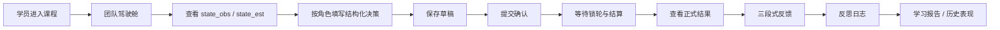
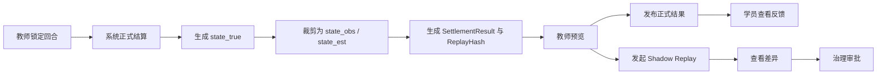

# docs/frontend/figma-prototype-spec.md

## 文档基线与设计原则

| 项目 | 内容 |
|---|---|
| 文档名称 | `docs/frontend/figma-prototype-spec.md` |
| 项目名称 | SimWar |
| 文档版本 | v1.0 |
| 文档状态 | Draft |
| 最后更新 | 2026-05-14 |
| 适用范围 | Figma 原型 / 前端页面 / UI 组件 / 交互设计 / 前后端接口联调 / 测试验收 |
| 维护人 | 请根据实际项目修改 |
| 相关文档 | `docs/product/requirements.md` / `docs/architecture/system-architecture.md` / `docs/contracts/api-contract.md` / `docs/product/feature-refinement.md` / `docs/frontend/teacher-student-architecture.md` / `docs/architecture/database-design.md` / `docs/quality/test-coverage.md` / `docs/devops/env-setup.md` |

SimWar 已在需求、系统架构、API 合同、功能深化、数据库与前端架构文档中被收敛为一个面向高管培训、课程对抗与企业学习场景的多租户 SaaS / AI 仿真平台；平台主链覆盖教师开课、学员组队、多轮决策、正式结算、AI 建议、AI 复盘、Replay / Shadow Replay、行业插件、学习诊断、社区与竞赛等能力。更关键的是，项目边界已经明确：**核心仿真引擎是唯一正式真值来源，AI 只能提供 advisory 输出，ParameterSet 在正式运行中不可变，Replay / Shadow Replay 是治理门禁**。fileciteturn0file37turn0file38turn0file30turn0file35turn0file8turn0file40

当前仓库仍处于“文档先行、实现待冻结”的阶段，因此以下原型、路由和组件命名采用**可直接落地但允许细化调整**的工程基线写法；一旦源码、BFF DTO、设计 Token 或插件 UI 协议落地，仓库内文档与设计稿应同步更新，避免长期出现“原型、代码、接口三套真相”。fileciteturn0file34turn0file41

本原型规范以四组不可妥协原则为前提。其一，**角色驱动设计**：教师、学员、企业管理员、平台管理员、场景设计师、模型治理人员和运维人员必须拥有不同入口、不同字段密度、不同按钮权限与不同错误恢复路径。其二，**真值边界可视化**：学员端只能看到授权后的 `state_obs` / `state_est`；教师可看到教学授权摘要；`state_true`、正式成绩、排名和财务结果必须展示为“系统正式结果”，不能与 AI 输出混淆。其三，**复杂流程降噪**：创建课程、参数绑定、冲击注入、审批、Replay 对比等流程应以向导、抽屉、步骤条和状态遮罩组织，而不是一次性暴露全部复杂度。其四，**可解释与可审计**：前端必须帮助用户理解“我当前在哪个课程、哪个 Run、哪个 Round、哪个 Team、为什么能做或不能做这一步、这条建议来自系统还是 AI、这份结果是否已发布、这组参数是否已冻结”。fileciteturn0file40turn0file30turn0file38turn0file8turn0file29

对于复杂企业应用和信息密集型界面，渐进披露与分步披露是降低误用和学习成本的成熟方法。NN/g 将 progressive disclosure 归纳为“初始只展示最重要选项，把高级或低频能力延后到二级视图”，并指出这种做法能改善可学性、效率和错误率；这与 SimWar 中课程发布、决策提交、Replay 对比和 AI 工作台的设计目标高度一致。citeturn4view4

可访问性方面，建议本项目把 WCAG 2.2 作为原型与实现的最低基线，至少覆盖对比度、键盘可达、焦点可见、错误识别、标签与说明、状态消息等要求；这些条目都已经被纳入 W3C 的 WCAG 2.2 推荐标准中。citeturn3view0

AI 相关界面不应仅靠视觉“像聊天窗口”来交付，而应满足治理与透明性要求。NIST AI RMF 将“accountable and transparent”“explainable and interpretable”列为可信 AI 的核心属性，并把 GOVERN、MAP、MEASURE、MANAGE 作为风险管理核心函数；因此，SimWar 的 AI 卡片、复盘草稿、证据面板、模型版本页与审批页都应显式呈现来源、版本、证据、置信度和人工确认边界。citeturn5view0turn4view3

下表给出各端的建议定位与权限特征。其内容综合自需求、功能深化、系统架构、前端架构与数据库设计文档，并按 Figma 与前端落地需要做了结构化重组。fileciteturn0file37turn0file38turn0file30turn0file40turn0file8

| 端 | 目标用户 | 核心任务 | 主要页面 | 权限特点 |
|---|---|---|---|---|
| 教师端 | 教师 / 教练 / 授课助教 | 开课、绑定场景和参数、监控提交、锁轮、发布结果、点评复盘、导出 | 课程列表、课程创建、课程工作台、回合控制、队伍监控、Replay 中心、AI 辅助点评、学习诊断 | 可见课程级摘要、班级结果、授权 `state_true` 摘要；不可改写真值 |
| 学员端 | 学员 / 队长 / 队员 | 查看驾驶舱、填报结构化决策、提交、查看结果、反思与学习闭环 | 我的课程、团队驾驶舱、市场信息、决策填写、提交确认、回合结果、三段式反馈、AI 建议、学习报告 | 仅见本队 `state_obs` / `state_est` 和赛制允许的聚合信息；不可见完整真值 |
| 企业后台 | 企业管理员 / 租户管理员 | 组织用户、课程模板、租户配置、导出、租户级报表 | 租户管理、用户管理、课程模板、组织报表、导出中心 | 租户内全局；不可跨租户 |
| 平台管理后台 | 平台管理员 / 运维 | 平台治理、审计、系统策略、跨租户运维 | 审计日志、系统配置、敏感导出、故障追踪 | 高权限；关键动作强审计 |
| 场景设计后台 | 场景设计师 | 设计场景模板、编译场景包、配置插件扩展位 | 场景模板、场景编译、行业字段映射、Shock 模板 | 可管理场景与插件上下文；不可改正式结果 |
| 模型治理后台 | 模型治理人员 | 参数审批、模型版本审批、Shadow Replay、发布/回滚 | 参数集、模型版本、Replay 报告、审批中心 | 可审批治理对象；不可覆盖历史正式结果 |
| 社区端 | 学员 / 教师 / 审核员 | 发帖、复盘沉淀、答疑、内容协作 | 社区首页、帖子详情、协作任务、审核面板 | 公开/私域可见性严格隔离 |
| 竞赛前台 | 参赛队伍 / 观赛者 / 教师 | 报名、赛程、公开榜单、赛事归档 | 竞赛首页、报名页、赛程页、榜单页、赛事回顾 | 榜单来自正式结果；公开字段受控 |

## 信息架构与用户流程

以下信息架构把项目文档中的“教师端 / 学员端 / 管理后台 / 社区与竞赛 / 学习诊断 / 插件与治理”收敛为可直接用于 Figma 分页与导航设计的 IA。它遵循项目既有的双应用 + 双 BFF + 共享 UI / 契约 / 状态域方案，并继承“课程上下文 → Run → Round → Team”的核心导航顺序。fileciteturn0file40turn0file38turn0file30

```mermaid
flowchart TD
    Root[SimWar UI] --> Teacher[教师端]
    Root --> Student[学员端]
    Root --> Admin[管理后台]
    Root --> Scenario[场景设计后台]
    Root --> Governance[模型治理后台]
    Root --> Community[社区端]
    Root --> Competition[竞赛前台]

    Teacher --> TCourse[课程控制台]
    Teacher --> TCreate[课程创建]
    Teacher --> TScenario[场景配置]
    Teacher --> TTeams[队伍管理]
    Teacher --> TRound[回合控制]
    Teacher --> TDecision[决策监控]
    Teacher --> TResult[结算结果]
    Teacher --> TAI[AI 辅助点评]
    Teacher --> TDebrief[复盘报告]
    Teacher --> TReplay[Replay / Shadow Replay]
    Teacher --> TLearning[学习诊断]
    Teacher --> TNotice[通知中心]

    Student --> SCourse[我的课程]
    Student --> SDash[团队驾驶舱]
    Student --> SMarket[市场信息]
    Student --> SDecision[决策填写]
    Student --> SSubmit[提交确认]
    Student --> SResult[回合结果]
    Student --> SFeedback[三段式反馈]
    Student --> SAI[AI 策略建议]
    Student --> SDebrief[复盘反思]
    Student --> SReport[学习报告]
    Student --> SHistory[历史表现]

    Admin --> ATenant[租户管理]
    Admin --> AUser[用户管理]
    Admin --> ARole[角色权限]
    Admin --> AScenario[场景包]
    Admin --> APlugin[插件包]
    Admin --> AParam[参数集]
    Admin --> AModel[模型版本]
    Admin --> AAudit[审计日志]
    Admin --> AConfig[系统配置]

    Scenario --> DTemplate[场景模板]
    Scenario --> DCompile[场景编译]
    Scenario --> DIndustry[行业字段映射]

    Governance --> GParam[参数审批]
    Governance --> GModel[模型审批]
    Governance --> GReplay[Replay 报告]
    Governance --> GApproval[治理审批]

    Community --> CFeed[社区首页]
    Community --> CPost[帖子详情]
    Community --> CTask[协作任务]

    Competition --> PHome[竞赛首页]
    Competition --> PRegister[报名]
    Competition --> PSchedule[赛程]
    Competition --> PBoard[榜单]
```



这些导航分层直接对应现有文档对交付模块的划分：教师端偏控制与解释，学员端偏输入与学习，管理后台偏治理，社区与竞赛是 P2 外显层，学习诊断与模型治理是贯穿主链的增强层。fileciteturn0file30turn0file40turn0file38turn0file8

下表定义教师端、学员端和治理后台的一级导航建议。其目的不是替代产品菜单，而是为 Figma 的侧边栏、顶部导航与 Breadcrumb 架构提供统一骨架。fileciteturn0file40turn0file30

| 端 | 一级导航 | 二级导航建议 | 默认落点 |
|---|---|---|---|
| 教师端 | 课程、班级运行、结果与复盘、学习诊断、通知 | 课程工作台 / 场景配置 / 队伍管理 / 回合控制 / 决策监控 / Replay / AI 点评 | 课程列表 |
| 学员端 | 我的课程、当前团队、结果与反馈、学习成长 | 驾驶舱 / 市场信息 / 决策填写 / 历史结果 / 反思日志 / 学习报告 | 我的课程 |
| 企业后台 | 组织、课程模板、租户报表、导出 | 用户管理 / 租户配置 / 模板库 / 报表中心 | 用户管理 |
| 平台后台 | 审计、系统配置、导出、运维 | 审计日志 / 实体时间线 / 策略中心 / 故障面板 | 审计日志 |
| 场景设计后台 | 场景、插件、Shock 模板 | 模板列表 / 编译中心 / 字段映射 | 场景模板 |
| 模型治理后台 | 参数、模型、Replay、审批 | 参数集 / 模型版本 / Shadow Replay / 批准记录 | 参数集 |

以下用户流程基于项目文档中已经冻结的主链整理而成：教师先完成课程与运行环境绑定，再驱动开轮、锁轮、结算、发布和复盘；学员先读取有限信息，再完成结构化填报、提交、等待结算、查看正式结果与学习诊断；Replay / Shadow Replay 仅作为教师 / 治理面向的分析与审批入口。fileciteturn0file40turn0file30turn0file38turn0file35






教师端的 AI 复盘和学员端的 AI 建议属于**正式结果之后的解释层**，不能越位到正式结算之前，更不能被伪装成系统自动提交。项目文档已经把 AI 明确定义为 strategy advisor、debrief coach、risk red team、learning recommender 等 advisory 模块，而不是正式真值写入者。fileciteturn0file29turn0file30turn0file38turn0file35turn0file8

## 页面范围与详细规格

以下页面清单综合自需求、功能深化、前端架构、管理后台与数据库实体设计。页面编号、所属端、目标角色与优先级可直接作为 Figma 页面目录、前端路由清单与测试用例编号的统一主键。fileciteturn0file37turn0file30turn0file40turn0file8turn0file39

| 页面编号 | 页面名称 | 所属端 | 角色 | 页面目标 | 优先级 |
|---|---|---|---|---|---|
| T-001 | 课程列表页 | 教师端 | 教师 / 教练 | 查看课程、筛选状态、进入工作台 | P0 |
| T-002 | 创建课程页 | 教师端 | 教师 / 教练 | 用向导完成课程创建与发布前校验 | P0 |
| T-003 | 课程详情页 | 教师端 | 教师 / 教练 | 查看课程摘要、Run、Round 与全班进度 | P0 |
| T-004 | 场景配置页 | 教师端 | 教师 / 场景设计协作者 | 绑定场景包、插件、参数集与评分规则 | P0 |
| T-005 | 队伍管理页 | 教师端 | 教师 | 创建队伍、导入名册、角色槽位绑定 | P0 |
| T-006 | 回合控制页 | 教师端 | 教师 | 开轮、暂停、锁轮、发布结果 | P0 |
| T-007 | 决策监控页 | 教师端 | 教师 | 看提交率、缺岗、异常与草稿状态 | P0 |
| T-008 | 结算结果页 | 教师端 | 教师 | 查看正式结果、图表与结果摘要 | P0 |
| T-009 | AI 辅助点评页 | 教师端 | 教师 / 教练 | 生成、编辑、发布 AI + 教师点评 | P1 |
| T-010 | 复盘报告页 | 教师端 | 教师 / 教练 | 组织复盘内容、导出讲义与报告 | P1 |
| T-011 | Replay 对比页 | 教师端 | 教师 / 治理协作人 | 查看 published / baseline / candidate diff | P1 |
| T-012 | 学习诊断页 | 教师端 | 教师 | 查看团队能力画像、学习趋势与推荐 | P1 |
| S-001 | 我的课程页 | 学员端 | 学员 | 查看加入课程与当前状态 | P0 |
| S-002 | 团队驾驶舱页 | 学员端 | 学员 / 队长 | 查看 KPI、任务、截止时间与状态 | P0 |
| S-003 | 市场信息页 | 学员端 | 学员 | 查看 `state_obs` / `state_est` 和可见研究结果 | P0 |
| S-004 | 决策填写页 | 学员端 | 学员 / 队长 | 完成结构化决策填报与草稿保存 | P0 |
| S-005 | 决策提交确认页 | 学员端 | 队长 / 授权成员 | 汇总核验后正式提交 | P0 |
| S-006 | 回合结果页 | 学员端 | 学员 | 查看正式结果与排行 | P0 |
| S-007 | 三段式反馈页 | 学员端 | 学员 | 理解发生了什么、为什么、下一步建议 | P0 |
| S-008 | AI 策略建议页 | 学员端 | 学员 | 查看 AI 辅助建议、风险与证据卡 | P0 |
| S-009 | 复盘反思页 | 学员端 | 学员 | 填写反思与查看裁剪版复盘 | P1 |
| S-010 | 学习报告页 | 学员端 | 学员 | 查看能力画像、推荐任务与反思质量 | P1 |
| S-011 | 历史表现页 | 学员端 | 学员 | 查看历史轮次趋势与自己的决策版本 | P1 |
| A-001 | 租户管理页 | 管理后台 | 平台管理员 / 企业管理员 | 管理租户与隔离模式 | P0 |
| A-002 | 用户管理页 | 管理后台 | 平台管理员 / 企业管理员 | 管理用户、组织与启停状态 | P0 |
| A-003 | 角色权限页 | 管理后台 | 平台管理员 / 企业管理员 | 绑定角色、字段策略与 scope | P0 |
| A-004 | 场景包管理页 | 管理后台 | 场景设计师 / 管理员 | 管理场景模板与场景包 | P1 |
| A-005 | 插件包管理页 | 管理后台 | 场景设计师 / 模型治理 | 管理插件包、版本与发布 | P1 |
| A-006 | 参数集管理页 | 管理后台 | 模型治理人员 | 管理参数集、状态与审批 | P1 |
| A-007 | 模型版本管理页 | 管理后台 | 模型治理人员 | 管理模型版本、Prompt 版本、发布状态 | P1 |
| A-008 | 审计日志页 | 管理后台 | 管理员 / 运维 | 查看操作日志、实体时间线与导出 | P1 |
| D-001 | 场景设计页 | 场景设计后台 | 场景设计师 | 设计模板、回合脚本、Shock 模版 | P1 |
| M-001 | 治理审批页 | 模型治理后台 | 模型治理人员 | 审批参数、模型、Replay 报告 | P1 |
| C-001 | 社区首页 | 社区端 | 学员 / 教师 | 查看帖子、协作内容与推荐 | P2 |
| P-001 | 竞赛首页 | 竞赛前台 | 参赛者 / 观众 | 查看赛程、报名与榜单 | P2 |

以下详细规格覆盖教师端和学员端的核心页面；管理后台、场景设计后台与治理后台更偏配置和治理，建议采用统一的列表页 + 详情抽屉 + 审批弹窗模式，以保持可维护性。页面规格中的 API 依赖以 `docs/contracts/api-contract.md` 与前端架构文档为准；实际 BFF DTO 命名可在接口冻结后补充。fileciteturn0file40turn0file35turn0file39

**教师端详细规格**

| 页面 | 所属端 | 目标角色 | 页面目标 | 前置条件 | 入口路径 | 核心模块 | 主要操作 | 数据来源 / API 依赖 | 权限控制 | 状态说明 | 验收标准 |
|---|---|---|---|---|---|---|---|---|---|---|---|
| T-001 课程列表页 | 教师端 | 教师 / 教练 | 查询、筛选、复制、进入课程工作台 | 已登录且具备课程读取权限 | `/teacher/courses` | FilterBar、课程表格、状态徽章、快捷操作菜单 | 创建课程、复制课程、归档、进入工作台 | `GET /api/v1/courses`、`GET /api/v1/auth/me` | `course:read` / `course:create` | 默认、空状态、加载、错误、无权限、归档态 | 可正确显示课程状态、场景包、参数集、进行中 Run 摘要 |
| T-002 创建课程页 | 教师端 | 教师 / 教练 | 通过向导创建课程、选择场景、绑定参数集、导入名册 | 用户具备建课权限；场景与参数可用 | `/teacher/courses/new` | Stepper、ScenarioSelector、ParameterSetSelector、RosterImporter、发布前检查 | 保存草稿、配置评分、发布课程 | `POST /api/v1/courses`、`POST /api/v1/scenarios/compile`、`PATCH /api/v1/courses/{courseId}`、`POST /api/v1/courses/{courseId}/publish` | `course:create` | 草稿、校验失败、审批中、可发布、已发布 | 向导不跳步越权；未批准 ParameterSet 不可选；发布前必须通过校验 |
| T-003 课程详情页 | 教师端 | 教师 / 教练 | 汇总课程、Run、Round、提交进度、风险提醒 | 课程已存在 | `/teacher/courses/:courseId` | PageHeader、RunSummary、RoundBoard、告警条、通知区 | 查看当前 Run、切换 Round、跳转队伍和结果 | Teacher BFF 聚合 `CourseDetail` / `TeacherDashboardDTO` | `course:read` | 默认、空 Run、运行中、已完成、已归档 | 页面可在一个视图中回答“课程当前进行到哪一步” |
| T-004 场景配置页 | 教师端 | 教师 / 场景设计协作者 | 绑定场景包、插件包、参数集、轮次脚本与 Shock 模板 | 课程草稿或可编辑 | `/teacher/courses/:courseId/scenario` | 场景包选择、插件配置、参数集表、评分规则、回合脚本 | 选择版本、查看依赖、比较差异、保存配置 | 场景包 / 插件包 / 参数集相关治理接口 | `scenario:read` / `course:update` | 草稿、审批中、已冻结、差异提示 | 正式运行后显示“已冻结”，禁止替换核心资产 |
| T-005 队伍管理页 | 教师端 | 教师 | 导入名册、创建队伍、分配角色槽位、设置队长 | 课程已创建 | `/teacher/courses/:courseId/teams` | 队伍列表、成员抽屉、角色冲突检查、导入报告 | 新建队伍、批量导入、调换成员、标记队长 | `POST /api/v1/courses/{courseId}/teams`、`PUT /api/v1/teams/{teamId}/members` | `team:manage` | 默认、空状态、导入中、冲突告警 | 角色冲突、队长唯一、缺岗标记可读且可追踪 |
| T-006 回合控制页 | 教师端 | 教师 | 管理回合状态机与发布节奏 | Run 已创建 | `/teacher/courses/:courseId/rounds/:roundId` | RoundStatusStepper、命令栏、提交统计、事件时间线 | 开轮、暂停、锁轮、发布结果 | `POST /api/v1/runs/{runId}/rounds/{roundNo}/start`、`POST /api/v1/runs/{runId}/rounds/{roundNo}/lock` | `round:open` / `round:lock` / `result:publish` | `draft/open/locked/settling/settled/published/archived` | 锁轮后学员端立刻只读；published 前不泄露正式结果 |
| T-007 决策监控页 | 教师端 | 教师 | 查看队伍提交率、草稿率、异常队伍与系统代管 | 回合已开启 | `/teacher/courses/:courseId/monitor` | TeamMonitorGrid、角色覆盖徽章、告警面板 | 查看队伍、钻取决策日志、提醒未提交 | Teacher BFF 聚合监控 DTO | `run:monitor` | 默认、实时刷新、异常告警 | 能快速识别缺岗、未提交、系统干预与异常队伍 |
| T-008 结算结果页 | 教师端 | 教师 | 展示正式结果、图表、排名与教师视角摘要 | 回合至少 settled | `/teacher/courses/:courseId/results` | KPI 卡片、图表、表格、摘要说明、导出 | 预览结果、比较队伍、发布结果 | `GET /api/v1/runs/{runId}/rounds/{roundNo}/results`、`GET /api/v1/runs/{runId}/rounds/{roundNo}/state-snapshot` | `result:read_teacher` | settled、published、archived | 已 settled 未 published 时仅教师可见；学员不可提前访问 |
| T-009 AI 辅助点评页 | 教师端 | 教师 / 教练 | 在 AI 草稿基础上编辑并发布点评 | 结果已发布或进入复盘期 | `/teacher/courses/:courseId/ai-comments` | AICoachCommentWorkbench、EvidenceCard、教师批注区 | 生成草稿、编辑、插入证据、发布点评 | `POST /api/v1/agents/debrief-coach/generate`、CoachOutput 读取接口 | `comment:edit` / `comment:publish` | 生成中、草稿、发布前确认、发布后只读 | AI 文案不直接对学员可见；教师确认后才成为正式点评 |
| T-010 复盘报告页 | 教师端 | 教师 / 教练 | 组织复盘讲义、导出课程报告 | 课程存在已发布结果 | `/teacher/courses/:courseId/debrief` | 报告编辑器、模块排序、导出设置、学员裁剪预览 | 配置章节、编辑标题、导出 PDF/分享链接 | Debrief DTO、Learning Report 聚合 | `debrief:read` / `debrief:publish` | 草稿、导出中、已发布 | 学员看到的是裁剪版，不含治理视图与候选 Replay diff |
| T-011 Replay 对比页 | 教师端 | 教师 / 治理协作人 | 比较正式结果与 Replay / Shadow Replay 候选结果 | Replay 已发起 | `/teacher/courses/:courseId/replay` | ReplayDiffCard、时间线、差异阈值、导出 | 发起 shadow replay、切换基线、查看 diff | `POST /api/v1/replays/shadow`、`GET /api/v1/replays/{replayId}` | `replay:read` | queued、running、completed、failed、passed/failed | candidate 与 published 必须视觉显著区分，且不能回写正式结果 |
| T-012 学习诊断页 | 教师端 | 教师 | 查看团队能力画像、跨轮趋势与推荐任务 | 学习报告存在 | `/teacher/courses/:courseId/learning` | 雷达图、趋势图、任务列表、团队对比 | 切换团队、查看诊断、导出报告 | Learning Report 聚合接口 | `learning:read_teacher` | 空状态、已生成、过期待刷新 | 可从课堂管理切入 learning闭环，而非孤立报表页 |

**学员端详细规格**

| 页面 | 所属端 | 目标角色 | 页面目标 | 前置条件 | 入口路径 | 核心模块 | 主要操作 | 数据来源 / API 依赖 | 权限控制 | 状态说明 | 验收标准 |
|---|---|---|---|---|---|---|---|---|---|---|---|
| S-001 我的课程页 | 学员端 | 学员 | 查看已加入课程、当前阶段与待办 | 已登录并具备课程成员身份 | `/student/courses` | 课程卡片、状态徽章、待办进度、课程搜索 | 进入课程、查看状态、进入历史课 | 学员课程列表 BFF | `course:member` | 默认、空状态、加载、错误 | 学员能一眼看到“我现在该去哪一门课做哪一步” |
| S-002 团队驾驶舱页 | 学员端 | 学员 / 队长 | 展示本队 KPI、目标、截止时间、任务提醒 | 已加入队伍 | `/student/courses/:courseId/dashboard` | TeamCockpitHeader、MetricCard、任务区、通知区 | 切换角色视角、进入表单、查看历史 | `GET /api/v1/teams/{teamId}/dashboard` | `team:read_self` | 默认、锁定、结果待发布 | 显示本队上下文，不出现他队细节 |
| S-003 市场信息页 | 学员端 | 学员 | 展示 `state_obs` / `state_est`、研究结果与赛制允许信息 | 回合已开始 | `/student/courses/:courseId/market` | MarketIntelPanel、EvidenceCard、市场图表、事件列表 | 查看研究、展开证据、切换标签 | `GET /api/v1/runs/{runId}/rounds/{roundNo}/state-snapshot` | `snapshot:read_self` | open、locked、published | 不得泄露完整 `state_true`、微观矩阵和他队敏感信息 |
| S-004 决策填写页 | 学员端 | 学员 / 队长 | 按角色完成结构化决策录入 | 回合为 `open` | `/student/courses/:courseId/decision` | DecisionForm、Role tabs、校验提示、假设编辑器 | 改字段、保存草稿、切角色 | `POST /api/v1/runs/{runId}/rounds/{roundNo}/decisions`（草稿 / 提交策略由 BFF 控制） | `decision:write_self` | 草稿、脏表单、校验失败、锁定只读 | 支持草稿保存、字段级校验、截止锁定与协同编辑提示 |
| S-005 决策提交确认页 | 学员端 | 队长 / 授权成员 | 在最终提交前做预算、角色、缺失项核验 | 表单已完成部分输入 | `/student/courses/:courseId/decision/confirm` | DecisionSummary、ValidationReport、ConfirmDialog | 保存草稿、最终提交 | Decision Validator + Submit API | `decision:submit` | 可提交、缺失项、预算超限、已锁定 | 不允许 AI 自动代提；最终提交有二次确认 |
| S-006 回合结果页 | 学员端 | 学员 | 查看正式排名、KPI、趋势和赛制允许对比 | 结果已 published | `/student/courses/:courseId/results` | 结果 KPI、趋势图、榜单、摘要面板 | 切换本轮/历史轮、查看详情 | `GET /api/v1/runs/{runId}/rounds/{roundNo}/results` | `result:read_self` | published、archived | 结果来源明确标注为系统正式结果 |
| S-007 三段式反馈页 | 学员端 | 学员 | 用可解释结构呈现本轮学习反馈 | 结果已 published | `/student/courses/:courseId/feedback` | FeedbackPanel、原因树、风险卡、行动建议 | 展开解释、确认已读、进入反思 | Student BFF `ThreeStageFeedback` | `feedback:read_self` | 已发布、AI 输出失败、内容裁剪 | 顺序固定为“发生了什么 → 为什么发生 → 下一步建议” |
| S-008 AI 策略建议页 | 学员端 | 学员 | 查看 AI 新一轮建议、风险挑战与证据 | 赛制允许 AI 辅助 | `/student/courses/:courseId/advice` | AIAdviceCard、EvidenceCard、RiskCard、复制到草稿 | 请求建议、复制建议、查看证据 | `POST /api/v1/agents/strategy-advisor/propose` | `coach:read_self` | 初始、生成中、成功、失败、权限不足 | 每张卡都标记“AI 辅助建议”，且无“自动提交”按钮 |
| S-009 复盘反思页 | 学员端 | 学员 | 填写反思、查看教师/AI 裁剪版复盘 | 结果与点评已发布 | `/student/courses/:courseId/debrief` | 反思表单、点评卡片、证据追问 | 提交反思、查看点评、进入学习报告 | Debrief / Reflection BFF | `reflection:write_self` | 可编辑、已提交、只读 | 学员仅见裁剪版复盘，不见治理差异与候选结果 |
| S-010 学习报告页 | 学员端 | 学员 | 查看能力画像、推荐任务、协作与反思质量 | learning report 已生成 | `/student/learning-report` | 雷达图、任务列表、成长趋势、标签云 | 查看推荐、下载、跳转训练任务 | Learning Report 聚合接口 | `learning:read_self` | 空状态、已生成、刷新中 | 报告解释学习表现而不重写经营结果 |
| S-011 历史表现页 | 学员端 | 学员 | 查看历史轮次、决策版本与趋势 | 至少有一轮已 published | `/student/courses/:courseId/history` | 历史走势图、版本 diff、时间线 | 对比轮次、看决策版本、回看反馈 | 历史查询 + 决策版本接口 | `history:read_self` | 无历史、已归档、只读 | 仅能回看本队已发布历史，不显示 candidate replay diff |

**管理后台与治理页模式**

管理后台页建议统一采用“列表页 + 过滤区 + 详情抽屉 + 时间线 + 高风险操作确认”的治理型模式。A-001 至 A-008 需要至少支持搜索、筛选、状态徽章、导出、审批记录与审计跳转。高风险动作，如参数审批、模型发布、插件 release、审计导出，必须以二次确认或双人审批占位呈现。fileciteturn0file30turn0file35turn0file8

## 设计系统与组件规范

Figma Frame 命名、组件规范、Token 和交互状态必须服务于多人协作和代码生成。项目文档已明确 Teacher Web 与 Student Web 是分离应用，但底层共享 UI kit、domain contracts、state core、AI widgets 和 plugin slots；因此，命名系统与组件分类必须同时支持跨端复用和差异化裁剪。fileciteturn0file40turn0file34

**Figma Frame 命名规范**

| 层级 | 示例 | 说明 |
|---|---|---|
| 端 | `Teacher` / `Student` / `Admin` / `Governance` | 产品端口 |
| 模块 | `Course` / `Round` / `Decision` / `Replay` / `Audit` | 领域模块 |
| 页面编号与名称 | `T-001-CourseList` | 与页面清单一一对应 |
| 状态 | `Default` / `Loading` / `Empty` / `Locked` / `Published` / `Forbidden` | 交互或业务态 |
| 完整命名 | `Teacher/Course/T-001-CourseList/Default` | 推荐完整格式 |

建议补充三个辅助后缀：`/Spec` 用于结构说明稿，`/Review` 用于评审版本，`/DevReady` 用于开发冻结版本。这样设计评审、前端开发和测试引用可以基于同一 Frame 路径。此命名法为本规范推荐基线，实际目录可依团队习惯做微调。fileciteturn0file40turn0file34

**Figma 文件结构**

```text
00 Cover
01 Design System
02 Components
03 Teacher Portal
04 Student Portal
05 Admin Portal
06 Scenario & Plugin
07 AI & Replay
08 Prototype Flow
09 Mobile & Tablet
10 Archive
```

| 页面组 | 用途 |
|---|---|
| 00 Cover | 项目简介、版本、更新记录、引用文档 |
| 01 Design System | 色彩、字体、间距、图标、Token |
| 02 Components | 原子组件、组合组件、交互状态 |
| 03 Teacher Portal | 教师端全部页与高保真流程 |
| 04 Student Portal | 学员端全部页与移动适配 |
| 05 Admin Portal | 管理后台、治理后台、审计页 |
| 06 Scenario & Plugin | 场景选配、插件配置、行业扩展位 |
| 07 AI & Replay | AI 建议卡、复盘、Replay diff 组件 |
| 08 Prototype Flow | 关键按钮跳转与可点击流程图 |
| 09 Mobile & Tablet | 响应式 frame 与 small-screen pattern |
| 10 Archive | 历史版本与废弃稿 |

**设计 Token 建议**

以下 Token 是推荐默认值，用于让 Figma、前端主题与 E2E 选择器保持一致；除品牌色外，均可直接进入 design token JSON。

| 维度 | Token | 建议值 | 说明 |
|---|---|---|---|
| 主色 | `color.primary.500` | `#2F6BFF` | 主操作、高亮链接、关键状态 |
| 辅助色 | `color.secondary.500` | `#6B4EFF` | 辅助导航、强调说明 |
| 成功色 | `color.success.500` | `#1F9D55` | 成功、已通过、健康 |
| 警告色 | `color.warning.500` | `#C88719` | 审批中、提醒、待处理 |
| 错误色 | `color.error.500` | `#D14343` | 错误、失败、阈值越界 |
| 信息色 | `color.info.500` | `#2C7BE5` | 系统说明、提示 |
| 中性色 | `gray.50 ~ gray.900` | 9 级灰 | 文字、边框、背景层级 |
| 背景色 | `bg.canvas` / `bg.surface` | `#F7F8FA` / `#FFFFFF` | 画布与卡片层 |
| 边框色 | `border.default` / `border.muted` | `#D9DEE7` / `#E8ECF3` | 分隔与弱边框 |
| AI 标记色 | `color.ai.500` | `#8B5CF6` | AI 建议、AI 解释、AI 草稿 |
| 正式结果色 | `color.official.500` | `#0F766E` | 正式发布结果专用 |
| Replay 色 | `color.replay.500` | `#A16207` | Replay / Shadow Replay 专用 |

建议把“AI”与“正式结果”做视觉配色隔离，用于落实项目文档中的真值边界；同时为 `official / sandbox / shadow_replay / counterfactual` 预留 surface 级标识色，以免教师误把候选结果看成正式成绩。fileciteturn0file40turn0file38turn0file30

**字体、间距、圆角与图标**

| 类别 | Token / 规格 | 建议值 |
|---|---|---|
| 页面标题 | `font.h1` | 24/32，Semibold |
| 区块标题 | `font.h2` | 20/28，Semibold |
| 卡片标题 | `font.title` | 16/24，Medium |
| 正文 | `font.body` | 14/22，Regular |
| 辅助说明 | `font.caption` | 12/18，Regular |
| 表格文字 | `font.table` | 13/20，Regular |
| 数字指标 | `font.metric` | 24/28，Semibold，tabular numbers |
| 标签文字 | `font.tag` | 12/16，Medium |
| 页面边距 | `space.page` | 24 |
| 卡片内边距 | `space.card` | 20 |
| 表单项间距 | `space.form` | 16 |
| 表格行高 | `space.row` | 44 / 52 |
| 按钮间距 | `space.button-group` | 12 |
| 卡片圆角 | `radius.card` | 12 |
| 按钮圆角 | `radius.button` | 10 |
| 弹窗圆角 | `radius.modal` | 16 |
| 阴影 | `shadow.surface` | 0 8 24 0 / 8% |
| 图标命名 | `ic_[domain]_[action]_[size]` | 如 `ic_round_lock_20` |

**组件库清单**

下表综合了前端架构文档里已经明确的核心组件与本原型规范建议补充的治理、状态和通用交互组件。fileciteturn0file40

| 组件名称 | 用途 | 使用页面 | 状态 | 备注 |
|---|---|---|---|---|
| AppShell | 应用整体骨架 | 全站 | 默认 / 折叠 / 移动态 | 承载侧边栏与顶部导航 |
| Sidebar | 左侧导航 | 教师端 / 管理后台 | 展开 / 折叠 / 权限裁剪 | 隐藏无权限菜单 |
| TopNav | 顶栏 | 全站 | 默认 / 通知展开 | 展示租户与课程上下文 |
| Breadcrumb | 路径导航 | 全站 | 默认 | 支持课程→Run→Round→Team |
| PageHeader | 页头 | 全站 | 默认 / 带操作 / 带状态条 | 含状态徽章 |
| DataTable | 列表阵列 | 课程 / 队伍 / 审计 / 插件 | 默认 / 加载 / 空 / 错误 | 支持 sticky header |
| FilterBar | 检索筛选 | 列表页 | 默认 / 有筛选 / 清空 | 搭配搜索框 |
| SearchInput | 搜索 | 列表页 | 默认 / 聚焦 / 错误 | 支持 debounce |
| StatCard | 单值指标 | 仪表盘 | 默认 / 对比 | 用于 KPI |
| MetricCard | 复合指标 | 驾驶舱 / 结果页 | 默认 / 趋势 | 可带 mini chart |
| ChartCard | 图表容器 | 结果 / 诊断 / 历史 | 默认 / 空 / 错误 | 统一标题与说明区 |
| StatusBadge | 状态标识 | 全站 | 多状态 | 课程 / 回合 / 审批 |
| RoleBadge | 角色标识 | 队伍与权限页 | 多状态 | CEO/CFO 等 |
| PermissionTag | 权限标签 | 管理后台 | 默认 | 用于 role matrix |
| RoundStatusStepper | 回合步骤条 | 教师端 / 学员端 | 多状态 | 教师可操作，学员只读 |
| DecisionForm | 决策表单 | S-004 | 草稿 / 校验失败 / 只读 | 角色分区 |
| DecisionSummary | 提交摘要 | S-005 | 正常 / 缺失 / 超限 | 提交前核验 |
| TeamMemberList | 队伍成员清单 | T-005 / S-002 | 默认 / 缺岗 | 角色冲突提示 |
| ScenarioSelector | 场景选择 | T-002 / T-004 | 默认 / 冻结 | 仅显示允许版本 |
| PluginSelector | 插件选择 | T-004 / A-005 | 默认 / 审批中 | 支持版本对比 |
| ParameterSetSelector | 参数集选择 | T-002 / T-004 | 默认 / 已批准 / 已冻结 | 仅已批准可选 |
| AIAdviceCard | AI 建议卡 | S-008 / T-009 | 生成中 / 成功 / 失败 | 强制 advisory 标记 |
| EvidenceCard | 证据卡 | S-003 / S-008 / T-009 | 默认 / 权限裁剪 | 区分来源 |
| RiskCard | 风险卡 | S-007 / S-008 | 默认 / 高风险 | 可带等级 |
| ReplayDiffCard | Replay 差异卡 | T-011 / M-001 | 正常 / 超阈值 | 候选与正式强区分 |
| FeedbackPanel | 三段式反馈 | S-007 | 默认 / AI 部分失败 | 顺序固定 |
| AuditTimeline | 审计时间线 | A-008 / T-011 | 默认 / 加载 | 显示实体变更 |
| EmptyState | 空状态 | 全站 | 默认 | 给出下一步操作 |
| LoadingState | 加载状态 | 全站 | Spinner / Skeleton | 骨架优先 |
| ErrorState | 错误状态 | 全站 | 可重试 / 不可恢复 | 保留 trace 占位 |
| ConfirmDialog | 关键确认 | 提交 / 发布 / 审批 | 默认 | 支持风险说明 |
| Toast | 轻提示 | 全站 | success / warning / error | 非阻塞 |
| Drawer | 抽屉 | 监控、详情、提交确认 | 右侧 / 底部 | 高频辅助查看 |
| Modal | 弹窗 | 审批、删除、发布 | 小/中/大 | 高风险确认 |

**核心组件详细规格**

| 组件 | 功能说明 | Props | Events | 状态 | 权限 | 使用场景 | 验收标准 |
|---|---|---|---|---|---|---|---|
| RoundStatusStepper | 显示 `draft / open / locked / settling / settled / published / archived`；教师端可点阶段性命令，学员端仅读 | `currentStatus` `availableActions` `deadline` | `onOpen` `onLock` `onPublish` | 默认、禁用、结算中、已发布 | 教师可操作，学员只读 | T-006、S-002、S-006 | 状态不可跳跃；锁轮后自动进入只读 |
| DecisionForm | 承载角色化结构化填报，支持草稿、字段校验、协作提示、截止时间锁定 | `schema` `draft` `roleMap` `validation` `readonly` | `onChange` `onAutosave` `onValidate` | 草稿、脏表单、校验错误、锁定 | 本队成员可编辑；队长可提交 | S-004 | 草稿不会丢失；字段级错误清晰；锁定后全表只读 |
| AIAdviceCard | 展示 AI 辅助建议、置信度、证据与风险，并支持复制建议到草稿 | `coachOutput` `evidenceRefs` `confidence` | `onCopyToDraft` `onOpenEvidence` `onRegenerate` | 生成中、成功、失败、权限裁剪 | 仅在权限允许时可见 | S-008、T-009 | 明确标记“AI 辅助建议”；无自动提交按钮 |
| EvidenceCard | 呈现系统数据、调研数据、授权知识库等证据来源，并支持权限裁剪 | `sourceType` `summary` `refs` `visibility` | `onExpand` | 默认、裁剪、不可展开 | 学员端按字段策略裁剪 | S-003、S-008、T-009 | 证据来源可追踪，受限内容不外泄 |
| ReplayDiffCard | 呈现 baseline / candidate / published 的差异、阈值状态与通过结论 | `baseline` `candidate` `thresholdProfile` | `onChangeMetric` `onExport` | 正常、超阈值、失败 | 教师 / 治理可见 | T-011、M-001 | 超阈值高亮；candidate 不被误识别为正式结果 |
| FeedbackPanel | 三段式反馈容器，顺序固定为“发生了什么 / 为什么发生 / 下一步建议” | `whatHappened` `whyHappened` `nextActions` | `onAcknowledge` `onOpenDetail` | 默认、部分数据缺失、AI 失败 | 本队成员可见 | S-007 | 正式结果与 AI 建议视觉分层清晰 |

**表单设计规范**

表单是本项目误用风险最高的部分，因此建议统一遵守“字段解释前置、错误信息就地、关键命令二次确认”的原则。WCAG 2.2 明确包含 labels、error identification、error suggestion、status messages 等成功准则，这些要求尤其适用于课程创建、参数审批与决策提交。citeturn3view0

| 表单 | 字段 | 类型 | 必填 | 校验规则 | 权限 | 备注 |
|---|---|---|---|---|---|---|
| 创建课程表单 | 名称、简介、教学目标、计划回合、发布日期 | 文本 / 数字 / 日期 | 是 | 名称必填；回合数 > 0；日期合法 | 教师 / 管理员 | 分步填写 |
| 场景配置表单 | 场景包、插件包、回合脚本、评分规则 | 选择 / JSON 预览 / 配置卡 | 是 | 未批准资产不可绑定 | 教师 / 场景协作人 | 正式运行后冻结 |
| 参数集选择表单 | 参数集版本、状态、审批记录 | 单选 + 详情抽屉 | 是 | 仅 `approved` 可选 | 教师 / 治理 | 要显示冻结提示 |
| 队伍创建表单 | 队伍名、队长、成员、角色槽位 | 文本 / 选择 / 多选 | 是 | 队长唯一、角色冲突校验 | 教师 | 支持批量导入 |
| 决策提交表单 | 价格、营销、运营、财务、人效、战略说明 | 数字 / 滑块 / 文本域 | 是 | 预算约束、范围校验、缺失项校验 | 学员 / 队长 | 支持草稿 |
| Shock 注入表单 | Shock 模板、生效轮次、影响范围、说明 | 选择 / 日期 / 文本 | 是 | 当前锁定轮次不可回写 | 教师 / 治理 | 需提示影响范围 |
| AI 复盘生成表单 | 复盘范围、语气、重点团队、输出深度 | 选择 / 开关 / 文本 | 否 | 仅 published 可用 | 教师 | 输出为草稿 |
| 插件配置表单 | 插件版本、上下文事实、策略参数 | 选择 / 键值 / 文件引用 | 是 | 版本兼容性校验 | 场景设计师 / 管理员 | 不得越权写真值 |
| 模型版本审批表单 | 审批结论、shadow replay id、审批说明 | 单选 / 文本 | 是 | 未附 replay 不可批准 | 模型治理人员 | 高风险动作 |

**表格、列表和可视化规范**

下表与下文是本规范对高密度 SaaS 列表与数据可视化的默认规则。它们既要服务课程与治理页面的效率，也要避免学员端信息泄露。fileciteturn0file40turn0file30turn0file8

| 设计对象 | 规则 |
|---|---|
| 列表页布局 | 统一为 PageHeader + FilterBar + DataTable + 分页区 |
| 搜索 | 搜索框固定在左上；支持关键词与明确字段 |
| 筛选 | 课程状态、回合状态、参数状态、审批状态统一使用枚举筛选 |
| 排序 | 默认按 `updated_at desc` 或业务上最紧迫字段排序 |
| 分页 | 默认 20 条；治理页支持 50 / 100 |
| 批量操作 | 仅后台与治理页支持；前台页默认禁用 |
| 空状态 | 提供“下一步动作”按钮，不只显示无数据 |
| 加载状态 | 列表使用 Skeleton row，图表使用 placeholder |
| 错误状态 | 保留错误摘要、trace 占位与重试 |
| 权限隐藏 | 先隐藏菜单，再隐藏按钮，再裁剪字段，最后显示无权限说明 |

| 图表 | 使用场景 | 数据来源 | 权限 |
|---|---|---|---|
| 折线图 | 多轮表现趋势 | SettlementResult / History Snapshot | 教师；学员仅本队裁剪 |
| 柱状图 | 队伍对比 | SettlementResult | 教师 |
| 雷达图 | 能力诊断 | LearningReport | 教师 / 学员本人 |
| 热力图 | 弹性 / 替代关系 | Market Analysis / Plugin Context | 教师 / 场景设计师 |
| 瀑布图 | 利润变化解释 | Finance Result | 教师；学员裁剪版 |
| 漏斗图 | 决策转化 / 市场漏斗 | Market Result | 教师 |
| 时间线 | 审计与事件 | AuditLog / EventStore | 管理员 / 教师摘要 |

学员端图表不得泄露未授权真值；教师端可见更完整分析，但依然应以摘要和解释优先；凡 AI 生成的解释图表或图表说明，都需要显式标记为“AI 辅助解释”，并把正式数值来源指向系统结果。fileciteturn0file40turn0file38turn0file8turn0file29

## 路由、数据、权限与原型交付

以下路由树与 API 映射是按“前端按业务能力调用 BFF，BFF 再聚合领域服务”的原则整理的。项目文档已经明确 Teacher Web 与 Student Web 不得直连内部正式结算入口，正式结果由核心仿真引擎写入后再通过裁剪快照与结果 API 暴露。fileciteturn0file40turn0file35turn0file38

| 路由 | 页面 | 角色 | 权限 | 说明 |
|---|---|---|---|---|
| `/teacher/courses` | T-001 课程列表页 | 教师 | `course:read` | 教师端默认首页 |
| `/teacher/courses/new` | T-002 创建课程页 | 教师 | `course:create` | 向导式建课 |
| `/teacher/courses/:courseId` | T-003 课程详情页 | 教师 | `course:read` | 课程工作台 |
| `/teacher/courses/:courseId/scenario` | T-004 场景配置页 | 教师 | `course:update` | 场景 / 参数 / 插件配置 |
| `/teacher/courses/:courseId/teams` | T-005 队伍管理页 | 教师 | `team:manage` | 名册与角色 |
| `/teacher/courses/:courseId/rounds/:roundId` | T-006 回合控制页 | 教师 | `round:control` | 开轮、锁轮、发布 |
| `/teacher/courses/:courseId/monitor` | T-007 决策监控页 | 教师 | `run:monitor` | 提交与异常监控 |
| `/teacher/courses/:courseId/results` | T-008 结算结果页 | 教师 | `result:read_teacher` | 正式结果 |
| `/teacher/courses/:courseId/ai-comments` | T-009 AI 辅助点评页 | 教师 | `comment:publish` | AI 草稿 + 人工确认 |
| `/teacher/courses/:courseId/debrief` | T-010 复盘报告页 | 教师 | `debrief:publish` | 复盘组织与导出 |
| `/teacher/courses/:courseId/replay` | T-011 Replay 对比页 | 教师 / 治理 | `replay:read` | Replay / Shadow Replay |
| `/teacher/courses/:courseId/learning` | T-012 学习诊断页 | 教师 | `learning:read_teacher` | 教学诊断 |
| `/student/courses` | S-001 我的课程页 | 学员 | `course:member` | 学员默认首页 |
| `/student/courses/:courseId/dashboard` | S-002 团队驾驶舱页 | 学员 | `team:read_self` | 本队驾驶舱 |
| `/student/courses/:courseId/market` | S-003 市场信息页 | 学员 | `snapshot:read_self` | 可见信息 |
| `/student/courses/:courseId/decision` | S-004 决策填写页 | 学员 | `decision:write_self` | 决策输入 |
| `/student/courses/:courseId/decision/confirm` | S-005 决策提交确认页 | 队长 | `decision:submit` | 提交核验 |
| `/student/courses/:courseId/results` | S-006 回合结果页 | 学员 | `result:read_self` | 正式结果 |
| `/student/courses/:courseId/feedback` | S-007 三段式反馈页 | 学员 | `feedback:read_self` | 解释与建议 |
| `/student/courses/:courseId/advice` | S-008 AI 策略建议页 | 学员 | `coach:read_self` | AI 建议 |
| `/student/courses/:courseId/debrief` | S-009 复盘反思页 | 学员 | `reflection:write_self` | 反思与点评 |
| `/student/learning-report` | S-010 学习报告页 | 学员 | `learning:read_self` | 个人成长 |
| `/student/courses/:courseId/history` | S-011 历史表现页 | 学员 | `history:read_self` | 历史趋势 |
| `/admin/tenants` | A-001 租户管理页 | 管理员 | `tenant:manage` | 平台 / 企业后台 |
| `/admin/users` | A-002 用户管理页 | 管理员 | `user:manage` | 用户管理 |
| `/admin/roles` | A-003 角色权限页 | 管理员 | `role:manage` | RBAC |
| `/admin/scenarios` | A-004 场景包管理页 | 设计师 / 管理员 | `scenario:manage` | 场景治理 |
| `/admin/plugins` | A-005 插件包管理页 | 设计师 / 治理 | `plugin:manage` | 插件治理 |
| `/admin/parameters` | A-006 参数集管理页 | 治理 | `parameter:approve` | 参数集治理 |
| `/admin/models` | A-007 模型版本管理页 | 治理 | `model:approve` | 模型治理 |
| `/admin/audit-logs` | A-008 审计日志页 | 管理员 / 运维 | `audit:read` | 审计与导出 |

**API 与页面映射**

| 页面 | API | 请求时机 | 数据用途 | 错误处理 |
|---|---|---|---|---|
| 课程列表页 | `GET /api/v1/courses` | 进入页面 / 切筛选 | 渲染课程列表与状态 | 表格空态 + 重试 |
| 创建课程页 | `POST /api/v1/courses` `POST /api/v1/scenarios/compile` `PATCH /api/v1/courses/{courseId}` `POST /api/v1/courses/{courseId}/publish` | 向导各步与发布时 | 创建草稿、编译场景、发布课程 | 步骤级错误 + 页头摘要 |
| 回合控制页 | `POST /api/v1/runs/{runId}/rounds/{roundNo}/start` `POST /api/v1/runs/{runId}/rounds/{roundNo}/lock` | 点击命令时 | 控制回合状态机 | ConfirmDialog + 幂等防抖 |
| 决策填写页 | `GET /api/v1/teams/{teamId}/dashboard` `GET /api/v1/runs/{runId}/rounds/{roundNo}/state-snapshot` | 页面加载 / 轮次切换 | 驾驶舱和可见信息 | 错误状态 + trace 占位 |
| 决策提交确认页 | `POST /api/v1/runs/{runId}/rounds/{roundNo}/decisions` | 最终提交时 | 提交结构化决策 | 表单级错误 + 全局警告 |
| 回合结果页 | `GET /api/v1/runs/{runId}/rounds/{roundNo}/results` | 结果已发布后 | 呈现正式结果 | 如果未发布，显示等待态 |
| AI 策略建议页 | `POST /api/v1/agents/strategy-advisor/propose` | 用户主动触发 | 获取 AI 建议 | 生成失败卡片 + 重试 |
| 复盘报告页 | `POST /api/v1/agents/debrief-coach/generate` | 教师触发草稿时 | 生成复盘草稿 | 草稿失败不影响正式结果页 |
| Replay 对比页 | `POST /api/v1/replays/shadow` `GET /api/v1/replays/{replayId}` | 发起比对 / 刷新状态 | 展示 diff 报告 | queued / running / failed 明确状态 |
| 参数集管理页 | `POST /api/v1/governance/parameter-sets/{parameterSetId}/approve` | 审批动作 | 参数集批准/驳回 | 强确认 + 审批记录 |
| 插件包管理页 | `GET /api/v1/plugins` `POST /api/v1/plugins` `POST /api/v1/plugins/{pluginId}/release` | 列表 / 上传 / 发布 | 插件管理 | 审批失败提示与时间线 |
| 审计日志页 | `GET /api/v1/audit/logs` `GET /api/v1/audit/entities/{entityType}/{entityId}/timeline` | 打开页面 / 点开实体 | 审计查询与实体时间线 | 支持筛选、导出与重试 |

**前端状态管理设计**

Teacher Web 与 Student Web 的状态建议沿用项目文档中的三层划分：Query Cache 负责服务端只读资源，Domain Store 负责课程上下文、草稿、AI 面板和 Replay 视角，本地状态负责 Drawer、排序和筛选。所有 Query Key 至少包含 `tenant_id + course_id`，结果相关还要加上 `run_id + round_id`，团队相关再加 `team_id`。fileciteturn0file40turn0file8

| Store | 管理数据 | 来源 API | 持久化 | 备注 |
|---|---|---|---|---|
| Auth Store | 当前会话、角色、租户 | `/api/v1/auth/login` `/api/v1/auth/me` | session | 登录后初始化 |
| Tenant Store | 租户上下文、切换状态 | Auth / Admin BFF | session | 多租户切换时 reset |
| Course Store | 当前课程、课程列表摘要 | Courses BFF | memory | 进入课程页时装载 |
| Round Store | 当前 Run / Round、状态机 | Round BFF | memory | 控制 Stepper 与 gating |
| Team Store | 当前 Team、角色槽位、成员 | Team BFF | memory | 仅本队或班级监控摘要 |
| Decision Store | 决策草稿、表单脏状态、版本摘要 | Decision draft API / local autosave | local + memory | 三轨并存：本地、服务端、AI复制值 |
| Result Store | 正式结果、排行榜、趋势图 | Result BFF | memory | 不缓存未发布结果 |
| AI Store | CoachOutput、风险卡、复盘草稿 | AI APIs | memory | 必须含模型版本与 advisory 标识 |
| Replay Store | replay 任务、diff 报告、视角切换 | Replay APIs | memory | official / shadow 分仓 |
| Plugin Store | 插件上下文、slot 配置 | Plugin APIs | memory | 只允许安全扩展位 |
| Notification Store | SSE / WebSocket 事件、Toast 队列 | 实时事件通道 | memory | 决策提交、锁轮、结果发布等 |
| Permission Store | scope、字段策略、菜单 gating | Auth / Role APIs | session | 控制页面与字段可见性 |

**权限与字段可见性设计**

以下矩阵综合了需求、系统架构、数据库与前端架构文档，并面向 Figma 图层、前端组件裁剪以及测试用例设计。fileciteturn0file37turn0file38turn0file8turn0file40

| 页面 / 数据 | 平台管理员 | 教师 | 学员 | 企业管理员 | 场景设计师 | 模型治理人员 |
|---|---|---|---|---|---|---|
| `state_true` | 治理视图 | 教学授权摘要 | 否 | 摘要且裁剪 | 否 | 全量治理视图 |
| `state_obs` | 可见 | 可见 | 可见 | 授权范围 | 裁剪可见 | 可见 |
| `state_est` | 可见 | 可见 | 可见 | 授权范围 | 裁剪可见 | 可见 |
| `ParameterSet` | 全量 | 已绑定摘要 / 已批准列表 | 否 | 租户级摘要 | 只读依赖信息 | 全量 |
| `SettlementResult` | 全量 | 课程级全量 | 本队 / 赛制允许信息 | 租户级摘要 | 否 | 全量 |
| `ReplayReport` | 全量 | 本课程摘要或详细 | 否 | 摘要 | 否 | 全量 |
| `CoachOutput` | 可见 | 可见并可编辑点评流程 | 本队可见裁剪版 | 摘要 | 否 | 可见 |
| `AuditLog` | 全量 | 本课程摘要 | 否 | 租户级摘要 | 否 | 全量 |
| `ModelCallLog` | 全量 | 摘要 | 否 | 摘要 | 否 | 全量 |
| 插件配置 | 全量 | 已绑定摘要 | 否 | 摘要 | 可配置 | 只读治理视图 |
| 课程发布 | 可代理 | 可执行 | 否 | 可执行 | 否 | 否 |
| 回合锁定 | 可代理 | 可执行 | 否 | 可执行 | 否 | 否 |
| 决策提交 | 否 | 不代学员提交 | 队长 / 授权成员可执行 | 否 | 否 | 否 |

**页面状态设计**

复杂状态统一化是降低误操作的关键。前端架构文档已经明确所有页面至少支持 `loading / empty / error / forbidden / stale / updating` 等标准态；本规范在此基础上增加与业务相关的锁定、审批与 AI 失败态。fileciteturn0file40

| 状态 | 触发条件 | UI 表现 | 用户可操作项 |
|---|---|---|---|
| 默认状态 | 数据已加载且权限正常 | 正常页面 | 全部允许操作 |
| 空状态 | 无课程 / 无结果 / 无报告 | EmptyState + CTA | 创建、导入、返回 |
| 加载状态 | 首次进入或请求中 | Skeleton / Spinner | 取消或等待 |
| 错误状态 | 请求失败 | ErrorState + trace 位 | 重试、联系支持 |
| 权限不足 | 无路由或无字段权限 | ForbiddenState | 返回首页、申请权限 |
| 数据过期 | 缓存 stale 或版本变更 | 顶部 stale banner | 刷新 |
| 网络异常 | 断线 / 重连 | AsyncStateBanner | 重试、离线提示 |
| 已锁定 | 回合 lock 后 | 表单控件只读，按钮禁用 | 仅查看 |
| 审批中 | 参数 / 插件 / 模型未批准 | 状态徽章 + 禁用动作 | 查看审批进度 |
| 已发布 | 正式结果已发布 | 结果页解锁，显示 official 标识 | 查看、导出、反思 |
| 已归档 | 课程 / 回合归档 | 只读模式 | 查看历史 |
| Replay 差异异常 | diff 超阈值 | ReplayDiffCard 高亮 | 导出、发起治理 |
| AI 输出失败 | AI 接口失败或超时 | AI 卡片错误态 | 重试，不影响正式结果 |

**响应式设计、Figma 交互与可访问性要求**

本项目以桌面端为主，尤其是教师端与治理后台；学员端需要同时支持平板与移动查看。复杂列表在窄屏下应改为卡片列表或“列折叠 + 详情抽屉”，图表需支持 summary-first 呈现，避免移动端读不清轴标签。课程创建、决策提交、Replay 查看这三类复杂任务优先设计桌面稿，再向平板做裁剪版，而不是反过来。fileciteturn0file40

原型交付层面，关键按钮必须有明确跳转与状态反馈：创建课程下一步、提交决策确认、教师锁轮确认、发布结果确认、生成 AI 建议、生成复盘草稿、发起 Shadow Replay、审批通过/拒绝。Drawer 用于高频查看与低破坏性编辑，Modal 用于高风险确认，Toast 用于轻提示，Banner 用于异步系统态。fileciteturn0file40turn0file35

可访问性方面，本项目至少应满足这几项显式要求：颜色不能成为唯一信息通道；关键按钮与表单控件应支持键盘访问；焦点必须可见且不被遮挡；表单错误要就地提示并给出建议；图表需有文字摘要；禁用按钮需要说明原因；重要操作必须二次确认。WCAG 2.2 已把 contrast、keyboard、focus visible、error identification、labels or instructions、status messages 等列为正式成功准则。citeturn3view0

AI 相关可用性还需要额外约束：所有 AI 输出必须显示免责声明、模型版本、生成时间、证据来源和置信提示；AI 建议只能“复制到草稿”，不能“直接提交”；教师点评与 AI 草稿必须以不同视觉层级展示。透明性与可解释性是可信 AI 的核心组成部分，这与 NIST AI RMF 的治理要求一致。citeturn5view0turn4view3

## 验收、MVP 与风险控制

以下验收标准把原型、开发、测试和治理要求绑定到同一条主链，而不是停留在“页面都有了”的假完成状态。项目测试文档已经明确，真正的验收目标是“真值可复算、权限可验证、边界可证明、发布可回滚”。fileciteturn0file39turn0file30turn0file38

| 页面 / 组件 | 验收标准 | 测试方式 | 优先级 |
|---|---|---|---|
| 教师创建课程 | 能完成向导、场景编译、参数选择、名册导入、发布前校验 | UI + E2E | P0 |
| 教师锁定回合 | 锁轮后学员端表单立即只读，状态条同步更新 | E2E + 状态机测试 | P0 |
| 学员提交决策 | 支持草稿、校验、二次确认、幂等提交 | UI + E2E + 合同测试 | P0 |
| 学员查看反馈 | 结果发布前不可见；发布后显示三段式反馈 | E2E | P0 |
| AI 建议展示 | 显示 advisory_only、证据、模型版本；无自动提交 | UI + 权限测试 | P0 |
| 复盘草稿编辑 | 教师可编辑 AI 草稿并发布裁剪版给学员 | UI + 集成测试 | P1 |
| Replay 差异展示 | published / baseline / candidate 明确区分，超阈值高亮 | UI + 集成测试 | P1 |
| 权限字段隐藏 | 学员端无法看到完整 `state_true`、候选 Replay diff、完整参数集 | 权限测试 + E2E | P0 |
| 表单校验 | 数值越界、预算超限、必填缺失能就地提示 | 组件测试 + E2E | P0 |
| 移动端适配 | 学员端在平板和移动设备可完成查看、填写、反馈流程 | UI 测试 + 手工验收 | P1 |

**MVP 原型范围建议**

| 阶段 | 建议页面 / 能力 |
|---|---|
| MVP 必做 | 教师端课程列表、创建课程、队伍管理、回合控制、结算结果；学员端我的课程、团队驾驶舱、决策填写、回合结果、三段式反馈；AI 策略建议卡片；基础登录与权限页 |
| P1 增强 | AI 复盘草稿、Replay 对比、学习诊断、插件配置、参数集管理、审计日志 |
| P2 扩展 | 社区、竞赛前台、高级图表、移动端完整适配、多语言 |

**风险与缓解措施**

| 风险 | 影响 | 缓解措施 |
|---|---|---|
| 页面信息过载 | 教师与学员难以快速判断下一步 | 使用渐进披露、分步创建、可折叠高级项 citeturn4view4 |
| 教师流程过长 | 开课效率低、出错率高 | 用向导 + 发布前检查统一收口；减少跨页跳转 fileciteturn0file40turn0file30 |
| 学员误把 AI 建议当正式答案 | 决策错误、责任边界模糊 | AI 卡片强制 advisory_only 标记；禁止自动提交 fileciteturn0file38turn0file35turn0file29 |
| 学员看到未授权真值 | 破坏赛制、公平性和治理边界 | DTO 裁剪 + 前端字段守卫 + 权限测试三重保障 fileciteturn0file40turn0file37turn0file8 |
| 决策表单过复杂 | 学员提交率下降 | 角色分区、分段保存、提交前摘要、字段解释前置 fileciteturn0file40turn0file30 |
| 回合状态不清晰 | 学员误操作、教师误发布 | 全站统一 RoundStatusStepper 和状态徽章 fileciteturn0file40 |
| Replay 与正式结果混淆 | 治理与教学误判 | official / shadow_replay 采用独立色系和页头标识 fileciteturn0file40turn0file38 |
| 图表误导 | 用户对结果产生错误理解 | 每张图标明数据来源、时间范围、是否裁剪；必要时增加文字摘要 fileciteturn0file40turn0file8 |
| 移动端可用性不足 | 学员无法随时查看与提交 | 教师端桌面优先，学员端提供平板/移动稿并降低信息密度 fileciteturn0file40 |
| 多角色权限混乱 | 菜单错显、字段错显、测试困难 | 用统一 Permission Store、RoleBadge、PermissionGate 和矩阵验收 fileciteturn0file40turn0file8turn0file39 |

**交付结论**

这份原型规范的核心目标，不是把 SimWar 画成一个“好看的大屏”，而是把项目文档已经明确的边界真正转译到 Figma 与前端中：教师端是受控教学驾驶台，学员端是有限信息下的结构化学习界面，AI 只做建议与解释，正式结果来自核心仿真引擎，Replay / Shadow Replay 必须与正式结果在视觉与权限上彻底区分。只要后续前端路由、BFF DTO、设计 Token、组件库和 E2E 用例都以这份规范为准，Codex 或开发团队就可以继续生成高保真页面、可复用组件、状态管理、API Client 和测试脚本，而不会破坏真值边界与治理边界。fileciteturn0file40turn0file38turn0file35turn0file8turn0file39turn0file34
