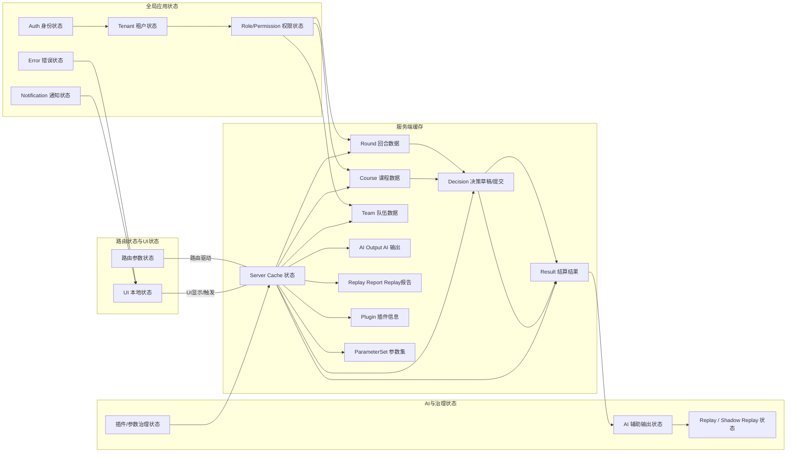
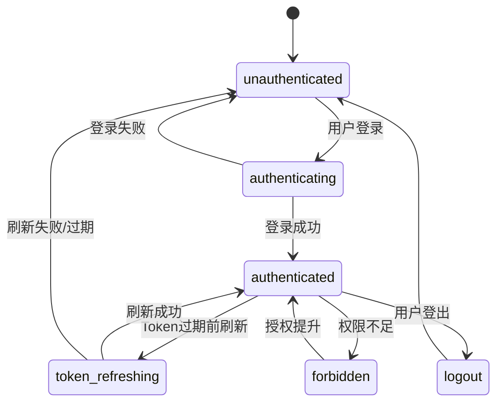
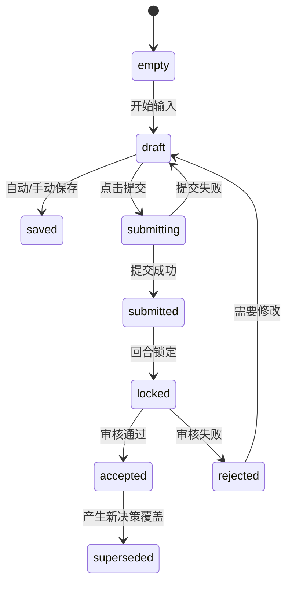
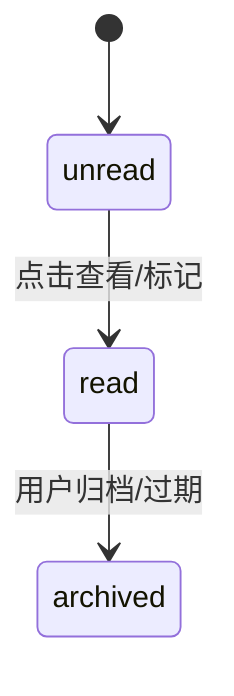

# docs/frontend/frontend-state-flow.md

## 1. 文档信息

| 项目     | 内容                                                                                                                                                       |
| -------- | ---------------------------------------------------------------------------------------------------------------------------------------------------------- |
| 文档名称 | docs/frontend/frontend-state-flow.md                                                                                                                       |
| 项目名称 | SimWar                                                                                                                                                     |
| 文档版本 | v1.0                                                                                                                                                       |
| 文档状态 | Draft                                                                                                                                                      |
| 最后更新 | 2026-05-14                                                                                                                                                 |
| 适用范围 | 前端状态管理 / 页面交互 / API 数据流 / E2E 测试                                                                                                            |
| 维护人   | 请根据实际项目修改                                                                                                                                         |
| 相关文档 | docs/frontend/teacher-student-architecture.md / docs/contracts/api-contract.md / Udocs/frontend/component-library.md / docs/architecture/bpmn-workflows.md |

---

## 2. 前端状态架构总览

SimWar 前端采用多层次状态管理架构，将应用状态分为**全局状态**、**路由状态**、**服务端缓存状态**和**本地 UI 状态**等。全局状态包括认证身份、租户、角色权限、通知、错误等；全局状态通过 React Context 或全局 Store 管理。服务端数据（课程、回合、决策、结果、AI 输出等）使用查询缓存（React Query 或类似方案）统一管理，不随意复制到多个全局 Store。页面局部状态（表单草稿、UI 控件状态）使用组件内部状态或局部 Store 管理。教师端和学员端维护不同视图状态。如下架构图展示了各类状态及其关系：



---

## 3. 状态分类与管理策略

| 状态类别          | 示例数据                                                         | 推荐管理方式                             | 生命周期           | 是否持久化                 | 说明                                                   |
| ----------------- | ---------------------------------------------------------------- | ---------------------------------------- | ------------------ | -------------------------- | ------------------------------------------------------ |
| Auth 状态         | 用户 Token、UserInfo                                             | React Context / Redux                    | 从登录到登出       | 长期（LocalStorage）       | 存储 Token 和用户信息；登录后初始化，全局可用          |
| Tenant 状态       | currentTenantId、可切换租户列表                                  | Redux / Context                          | 会话持续           | 短期（SessionStorage）     | 当前选中租户；切换租户需清空依赖缓存                   |
| Permission 状态   | 用户角色、权限列表                                               | Redux / Context                          | 会话持续           | 不持久化                   | 存储角色权限，控制路由与页面可见性                     |
| Route 状态        | route params, query params                                       | React Router / URL                       | 浏览器会话         | 不持久化                   | 存储当前页面上下文如 courseId、roundId 等              |
| Server Cache 状态 | Course、Round、Team、Decision、Result、AIOutput、ReplayReport 等 | React Query / TanStack Query / SWR       | 取决于数据更新时间 | 不持久化                   | 服务端数据缓存，支持缓存、失效、轮询、实时推送         |
| Form Draft 状态   | 表单输入草稿                                                     | 组件内部 State / React Hook Form / Redux | 从填写到提交       | 可选持久化（LocalStorage） | 草稿数据本地保存，用于自动恢复，提交后清除             |
| Workflow 状态     | 多步骤表单进度，如课程发布向导                                   | XState / Zustand / Redux                 | 从开始到完成       | 仅会话                     | 控制多步骤表单流程和状态转换                           |
| AI Output 状态    | AI 建议内容 (CoachOutput)                                        | React Query (异步请求)                   | 单次请求周期       | 不持久化                   | 存储 AI 小模型输出，不纳入正式结果，只做展示或保存笔记 |
| Replay 状态       | Replay/ShadowReplay 任务状态                                     | React Query 或组件状态                   | 从排队到完成       | 不持久化                   | 存储长任务状态和结果差异，用于发布门禁和报告展示       |
| Notification 状态 | 通知消息列表                                                     | Redux / Context                          | 来自后端推送       | 可持久化（IndexedDB）      | 系统/课程等通知状态，包括未读、已读等                  |
| Error 状态        | 网络错误、验证错误                                               | Redux / Context / 本地状态               | 发生时             | 非持久化                   | 展示错误信息状态，用户可关闭后清除                     |

以上分类有助于边界清晰：例如**认证、租户、权限**可在全局 Store 管理，而表单草稿和步骤状态留在本地，服务端数据用查询缓存管理。

---

## 4. 推荐状态管理技术选型

| 状态类型       | 推荐技术                                        | 可替代方案                | 选择理由                                 |
| -------------- | ----------------------------------------------- | ------------------------- | ---------------------------------------- |
| 全局身份认证   | React Context + Redux Toolkit 或 Pinia          | Zustand                   | 简洁，易于集中管理 Token 和用户信息      |
| 服务端数据缓存 | TanStack Query / SWR                            | Apollo Client (GraphQL)   | 自动缓存、失效、轮询和统一错误处理       |
| 表单草稿       | React Hook Form / Redux                         | localState + LocalStorage | 表单库+持久化，自动脏检查和校验          |
| WebSocket 事件 | useWebSocket / @use-sse / GraphQL Subscriptions | Polling fallback          | 实时推送架构，自定义 Hook 或框架插件     |
| 页面 UI 状态   | React 本地 State                                | Redux / Context           | 灵活简单，单页面内部状态不需全局管理     |
| 多步骤表单     | XState 状态机 / Zustand                         | Redux                     | 清晰定义状态转换，易于测试和复用         |
| 权限可见性     | React Context + usePermission                   | 高阶组件 (HOC)            | 在渲染层控制，结合权限列表判断可见性     |
| AI 输出        | TanStack Query                                  | Redux + Saga              | 异步数据请求+缓存，独立于业务逻辑        |
| Replay 长任务  | React Query + WebSocket                         | 轮询                      | 管理任务状态、自动刷新，提供取消/重试    |
| 前端测试       | Jest/React Testing Library + Mock Server        | Cypress (E2E)             | 单元/集成测试 + 接口模拟；E2E 验证状态流 |

实际选型时，可根据团队技术栈及复杂度取舍，但应符合上表原则：服务端数据优先查询缓存、表单与UI局部状态优先组件管理、全局类状态用集中式管理。

---

## 5. Store 划分设计

| Store / Module    | 管理数据                           | 来源                   | 是否持久化  | 主要消费者               | 备注                                           |
| ----------------- | ---------------------------------- | ---------------------- | ----------- | ------------------------ | ---------------------------------------------- |
| authStore         | Token、UserInfo、登录状态          | 登录 API               | 是（Token） | 全局路由守卫、所有页面   | 不存密码；Token 可 localStorage 记住           |
| tenantStore       | 当前租户ID、租户列表               | 登录结果、租户切换接口 | 否或短期    | 页面路由、权限检查       | 切换租户需清缓存；仅存 ID、名称                |
| permissionStore   | 用户角色、权限集                   | 登录结果、刷新用户接口 | 否          | 权限控制组件/页面        | 控制字段可见性；无需存整功能列表               |
| courseStore       | 当前课程详情、列表                 | 课程 API               | 否          | 课程相关页面             | 只存当前选中课程或列表，不存历史记录           |
| roundStore        | 当前回合状态（草案、开启、结算等） | 回合 API、WebSocket    | 否          | 回合控制页面、决策页面   | 仅存当前回合的状态和元数据                     |
| teamStore         | 队伍列表、学员名单                 | 队伍 API               | 否          | 教师分配学员、学员驾驶舱 | 存储当前课程下队伍的学员信息                   |
| decisionStore     | 决策草稿内容、提交状态             | 决策 API               | 否          | 决策表单组件             | 存储当前队伍的最新草稿；提交后可清空或转为历史 |
| resultStore       | 结算结果、审核状态                 | 结算 API               | 否          | 结果查看组件、复盘报告   | 仅存展示所需字段，不重复计算                   |
| aiStore           | AI 建议结果、状态                  | AI API                 | 否          | AI 建议面板、复盘组件    | 存储 CoachOutput，不写入正式评分               |
| replayStore       | Replay/ShadowReplay 任务状态、报告 | Replay API             | 否          | 复盘对比页面、治理界面   | 存储任务ID和结果差异，不覆盖正式结果           |
| pluginStore       | PluginPackage 列表、状态           | 插件 API               | 否          | 参数/插件管理页面        | 存储各插件当前选中版本和状态                   |
| parameterSetStore | ParameterSet 列表、状态            | 参数 API               | 否          | 参数集管理、场景配置     | 存储参数集配置和审批状态                       |
| notificationStore | 通知列表、已读标记                 | 通知 API/WebSocket     | 否          | 通知中心、Toast          | 推送系统和业务通知                             |
| uiStore           | 全局 UI 状态（主题、模态框）       | 组件事件               | 否          | 全局布局、组件           | 仅存界面相关状态，不存业务数据                 |
| auditStore        | 审计日志（只读）                   | 审计 API               | 否          | 审计追踪界面             | 存储审计事件流，只用于查看                     |

**备注：**

- **不缓存敏感字段：** authStore 不应存储敏感信息；permissionStore 仅存角色和权限标识。
- **ID vs 对象：** tenantStore、permissionStore 只存 ID 和最小字段，不冗余存完整用户或课程对象。
- **Query 代替：** Course 列表、Round 列表等可直接通过 Query 获取，无需额外 Store。
- **避免重复：** 如果 Course 数据已由 React Query 缓存，则 courseStore 可只存当前选中课程 ID，避免多处存储。

---

## 6. 服务端状态缓存策略

- **查询 Key 设计：** 每个数据对象使用带主键的多维 Key，例如 `[“course”, courseId]`, `[“round”, roundId]`, `[“decision”, runId, teamId]` 等，确保缓存独立、可识别。
- **缓存失效：** 依据业务事件主动失效或轮询。例如课程配置修改后 invalidate 对应 Query，回合结束后 invalidate 决策、结果。
- **乐观更新：** 对于用户创建/修改操作（如提交决策、发布结果），可使用乐观更新刷新页面状态，失败时回退。
- **轮询：** 对应有延迟性结果的场景，如 AI 输出、Replay 报告，可使用短轮询或 WebSocket。
- **WebSocket/SSE：** 对实时性要求高的数据（回合状态变更、通知推送），优先使用订阅推送，降低轮询负担。
- **长任务刷新：** Replay、AI 生成等长任务可记录任务ID，通过轮询查询任务状态。完成后 fetch 最终结果。
- **错误重试：** 数据请求失败时按策略（指数退避）重试；关键操作失败需提示用户并允许重试。
- **权限变更清理：** 当用户权限变化（角色切换、登出）时，清空相关缓存，防止越权缓存泄露。

| 数据对象                  | Query Key 示例                | 失效时机             | 刷新方式                  |
| ------------------------- | ----------------------------- | -------------------- | ------------------------- |
| Course 课程               | `["course", courseId]`        | 课程信息更新时       | 手动刷新 / WebSocket 通知 |
| Round 回合                | `["round", roundId]`          | 回合开启/锁定/结束时 | WebSocket 推送 / 轮询     |
| Decision 决策             | `["decision", runId, teamId]` | 提交后立即刷新       | Invalidate Trigger        |
| SettlementResult 结算结果 | `["result", roundId]`         | 结算完成后           | 轮询 / 发布事件触发       |
| CoachOutput AI 建议       | `["ai-output", outputId]`     | AI 生成成功后        | 轮询 / 完成回调           |
| ReplayReport 回放报告     | `["replay-report", reportId]` | 任务完成后           | 轮询 / 发布事件           |
| ParameterSet 参数集       | `["param-set", paramId]`      | 审批状态变化时       | Invalidate Trigger        |
| PluginPackage 插件包      | `["plugin", pluginId]`        | 上线/下线时          | Invalidate Trigger        |
| AuditLog 审计日志         | `["audit-log", tenantId]`     | 新日志写入           | 轮询 / 实时更新           |

---

## 7. 路由状态设计

路由状态用于定位当前页面上下文，关键参数会直接影响页面展示和请求行为。以下为系统常用路由列表及对应状态含义：

| 路由                                         | 页面            | 路由参数            | Query 参数               | 状态含义                                             |
| -------------------------------------------- | --------------- | ------------------- | ------------------------ | ---------------------------------------------------- |
| `/teacher/courses`                           | 课程列表 (教师) | 无                  | `page`、`filter`、`sort` | 教师查看所有课程列表，支持分页/筛选。                |
| `/teacher/courses/:courseId`                 | 课程详情 (教师) | `courseId`          | `tab` (概览/设置/报告)   | 教师查看某课程基本信息、编辑课程设置、查看报告等。   |
| `/teacher/courses/:courseId/rounds/:roundId` | 回合控制 (教师) | `courseId, roundId` | `section` (执行 / 复盘)  | 教师管理指定回合，执行决策锁定、结算发布和复盘报告。 |
| `/teacher/courses/:courseId/teams`           | 队伍管理 (教师) | `courseId`          | 无                       | 教师为课程创建/分配学员队伍。                        |
| `/teacher/courses/:courseId/reports`         | 综合报告 (教师) | `courseId`          | `runId`                  | 查看课程或回合的学习报告和数据统计。                 |
| `/teacher/courses/:courseId/replay`          | 回放分析 (教师) | `courseId`          | `type` (Replay/Shadow)   | 管理回放任务，查看 Replay/Shadow Replay 差异报告。   |

| 路由                                   | 页面              | 路由参数   | Query 参数                 | 状态含义                             |
| -------------------------------------- | ----------------- | ---------- | -------------------------- | ------------------------------------ |
| `/student/courses`                     | 我的课程 (学员)   | 无         | `status` (joined/archived) | 学员查看已加入课程列表。             |
| `/student/courses/:courseId/dashboard` | 学习驾驶舱 (学员) | `courseId` | 无                         | 学生查看课程概览和当前回合状态。     |
| `/student/courses/:courseId/decision`  | 决策页 (学员)     | `courseId` | 无                         | 学生在当前回合填写和提交决策表单。   |
| `/student/courses/:courseId/results`   | 决策结果 (学员)   | `courseId` | `runId`                    | 学生查看己方决策结果和回合结算情况。 |
| `/student/courses/:courseId/debrief`   | 复盘反思 (学员)   | `courseId` | `runId`                    | 学生编写学习总结和反馈。             |
| `/student/learning-report`             | 学习报告 (学员)   | 无         | `courseId`、`runId`        | 学生查看完整学习报告。               |

| 路由                | 页面       | 路由参数 | Query 参数              | 状态含义                     |
| ------------------- | ---------- | -------- | ----------------------- | ---------------------------- |
| `/admin/tenants`    | 租户管理   | 无       | `page`                  | 管理所有租户（高级管理员）。 |
| `/admin/users`      | 用户管理   | 无       | `tenantId`、`role`      | 管理租户内用户及角色。       |
| `/admin/scenarios`  | 场景管理   | 无       | `page`                  | 管理系统内预置场景模型。     |
| `/admin/plugins`    | 插件包管理 | 无       | `status`                | 管理自定义插件包及状态。     |
| `/admin/parameters` | 参数集管理 | 无       | `status`                | 管理参数集版本和审批。       |
| `/admin/models`     | 模型管理   | 无       | `status`                | 管理 AI 模型版本和状态。     |
| `/admin/audit-logs` | 审计日志   | 无       | `tenantId`、`dateRange` | 查询系统操作审计记录。       |

以上路由示例反映了应用上下文状态，其中 Route 参数和 Query 参数会驱动相应页面加载对应的数据。教师端和学员端路由独立，管理员后台使用不同前缀以隔离权限。

---

## 8. 认证与权限状态流



- **流程说明：**
  - 初始状态是 `unauthenticated`（未认证）。当用户提交登录表单，进入 `authenticating`，请求后端校验。
  - 登录成功后进入 `authenticated`，加载用户信息、所属租户和权限列表，并初始化可访问路由。
  - 在 `authenticated` 状态下，若 Token 临近过期，会自动进入 `token_refreshing` 刷新 Token，刷新成功返回 `authenticated`，失败则回到 `unauthenticated`。
  - 如果用户尝试访问未授权资源，则进入 `forbidden` 状态，提示无权限；经权限提升后可返回 `authenticated`。
  - 用户主动登出时，进入 `logout`，清理所有敏感状态和缓存，最后回到 `unauthenticated`。
  - **登出流程：** 清空 `authStore`、`permissionStore` 等敏感数据，以及需要持久化的状态，如登录信息等。

---

## 9. 租户与角色状态流

| 事件           | 状态变化                              | 缓存处理                             | UI 变化                       |
| -------------- | ------------------------------------- | ------------------------------------ | ----------------------------- |
| 登录后选择租户 | 设置当前 `tenantId`，加载租户相关数据 | 清空与租户相关的缓存（课程、回合等） | 页面刷新到租户仪表盘          |
| 切换租户       | 更新 `tenantId`，更新角色与权限       | 清除旧租户的缓存，重新请求数据       | 显示新租户的数据和页面        |
| 权限变更       | 更新 `permissionStore` 中角色/权限    | 清空受影响页面缓存                   | 重渲染界面，隐藏/显示相应功能 |
| 登出           | 重置租户状态到初始                    | 清除所有缓存                         | 返回登录页                    |

- **说明：** 多租户切换后，需清理前一租户的缓存数据，确保权限隔离。管理员跨租户操作时需记录审计日志。学员端不可跨租户访问课程，一旦租户变化应提示或自动退出当前课程视图。

---

## 10. 教师端状态流

### 10.1 课程列表状态流

状态：`loading` → `empty/loaded` → `filtering` → `error` → `archived_view`

- **loading：** 初始加载课程列表数据。
- **empty：** 返回无数据时，提示“暂无课程”。
- **loaded：** 成功加载课程列表，显示课程表格。
- **filtering：** 用户在课程列表筛选或搜索时，展示加载动画。
- **archived_view：** 切换到已归档课程视图（仅列表视图，不加载详情）。
- **error：** 加载失败时提示错误，可重试。

### 10.2 创建课程状态流

状态：`editing` → `saving_draft` → `draft_saved` → `validating` → `publish_ready` → `publishing` → `published`/`publish_failed`

- **editing：** 页面中填写课程基本信息、导入学员名册等。
- **saving_draft：** 用户点击“保存草稿”或自动保存时。
- **draft_saved：** 草稿保存成功，可稍后继续编辑。
- **validating：** 用户点击“发布课程”时，进行字段校验、组件兼容性检查。
- **publish_ready：** 所有校验通过，准备发版。
- **publishing：** 发布流程进行中，包括调用场景编译接口等。
- **published：** 发布成功，课程正式上线。
- **publish_failed：** 发布失败，可查看错误并重试。

### 10.3 场景配置状态流

状态：`selecting_scenario` → `selecting_plugin` → `selecting_parameter_set` → `validating` → `valid`/`invalid` → `saved`

- **selecting_scenario：** 选择课程场景。
- **selecting_plugin：** 选择行业插件或自定义插件包。
- **selecting_parameter_set：** 绑定参数集版本。
- **validating：** 校验所选插件与参数集与场景兼容。
- **valid：** 校验通过，允许保存配置。
- **invalid：** 校验失败，展示不兼容详情。
- **saved：** 场景配置保存成功，可应用到后续回合。

### 10.4 队伍管理状态流

状态：`loading_students` → `assigning` → `assigned` → `invite_pending` → `confirmed` → `error`

- **loading_students：** 加载学员列表和现有队伍。
- **assigning：** 分配学员到队伍，或发送邀请中。
- **assigned：** 分配完成，学员已加入队伍。
- **invite_pending：** 发送邀请但学员未接受。
- **confirmed：** 学员接受邀请并加入。
- **error：** 分配或邀请过程出错时。

### 10.5 回合控制状态流

状态：`draft -> open -> locked -> settling -> settled -> published -> archived`

- **draft：** 未开启回合，教师可编辑回合配置、启动回合。
- **open：** 回合开始，学生可提交决策。教师可选择提前锁定。
- **locked：** 回合截止，停止接受新决策，准备结算。
- **settling：** 后端执行结算，教师可查看进度。
- **settled：** 结算完成，结果进入审核或待发布状态。
- **published：** 教师发布结算结果，学生可查看反馈。
- **archived：** 回合归档，所有数据只读，不可再编辑。

**教师可执行操作：**

- `draft`：启动回合、删除回合、编辑回合参数。
- `open`：手动锁定回合。
- `locked`：开始结算流程。
- `settling`：可取消结算（若业务允许），或等待完成。
- `settled`：审阅结果，反馈修改，或直接发布。
- `published`：可查看归档数据、下载报告。
- **禁止操作：** 在 `locked/settling/archived` 状态下不得修改回合配置；在 `published` 状态下不得再次开启或编辑回合。

### 10.6 决策监控状态流

状态：`waiting_submissions` → `partially_submitted` → `all_submitted` → `locked` → `validation_failed`

- **waiting_submissions：** 回合 `open` 后，无队伍提交。
- **partially_submitted：** 部分队伍提交决策，仍在收集中。
- **all_submitted：** 所有队伍提交完成（学生自动或手动提交）。
- **locked：** 回合结束或教师提前锁定。
- **validation_failed：** 提交内容不符合格式或规则，需修正。

### 10.7 结算结果状态流

状态：`not_started` → `settling` → `settled` → `review_pending` → `published` → `failed`

- **not_started：** 回合未结算状态。
- **settling：** 教师触发结算，等待系统返回结果。
- **settled：** 系统完成计算，结果准备就绪。
- **review_pending：** 结算结果待教师复核。
- **published：** 结果由教师发布给学生查看。
- **failed：** 结算过程中出现错误，需重试或回退。

### 10.8 复盘报告状态流

状态：`not_generated` → `generating` → `draft_ready` → `teacher_editing` → `published` → `failed`

- **not_generated：** 尚未生成复盘。
- **generating：** 系统生成复盘草稿（包括AI分析）。
- **draft_ready：** 草稿生成完成，教师可审阅。
- **teacher_editing：** 教师在草稿基础上编辑补充。
- **published：** 复盘最终版发布后，学生可查看。
- **failed：** 复盘生成失败，需重新发起。

---

## 11. 学员端状态流

### 11.1 我的课程状态流

状态：`no_course` → `invited` → `joined` → `active` → `completed` → `archived`

- **no_course：** 学生尚未加入任何课程。
- **invited：** 学生收到课程邀请，未确认加入。
- **joined：** 学生接受邀请并进入课程。
- **active：** 课程进行中，有正在进行的回合。
- **completed：** 课程结束，所有回合已公布结果。
- **archived：** 课程已归档，仅可查看历史数据。

### 11.2 团队驾驶舱状态流

状态：`loading` → `loaded` → `stale` → `locked` → `error`

- **loading：** 加载当前队伍及回合摘要。
- **loaded：** 数据加载完成，展示驾驶舱信息。
- **stale：** 回合状态更新，驾驶舱数据需要刷新。
- **locked：** 回合锁定后，驾驶舱进入只读状态。
- **error：** 数据加载或渲染失败时。

### 11.3 决策填写状态流

状态：`empty` → `draft` → `saving` → `saved` → `submitting` → `submitted` → `locked` → `readonly`

- **empty：** 刚进入决策页面，无输入。
- **draft：** 学生输入决策后本地生成草稿。
- **saving：** 自动保存或手动保存时，显示保存中。
- **saved：** 草稿已保存。
- **submitting：** 点击提交按钮，发起决策提交。
- **submitted：** 决策提交成功，等待回合结束。
- **locked：** 回合锁定后，决策被锁定，不可再修改。
- **readonly：** 回合结束后，决策表单只读展示。

说明：决策在 `draft` 状态时会自动保存（e.g. 离开页面或定时），学生可手动“保存草稿”按钮。提交后进入 `submitted`，若提交失败则保留 `draft` 供重试。回合锁定 (`locked`) 后表单不可编辑；若教师在结算后拒绝通过（非常规），则可能返回 `draft` 供修改。

### 11.4 AI 策略建议状态流

状态：`idle` → `requesting` → `generated` → `failed` → `dismissed` → `saved_to_notes`

- **idle：** 学生尚未请求 AI 建议。
- **requesting：** 学生提交 AI 建议请求，等待系统生成。
- **generated：** 建议生成完成，展示在界面上。
- **failed：** 生成过程出现错误。
- **dismissed：** 学生关闭建议框，不保存输出。
- **saved_to_notes：** 学生将建议内容保存为个人笔记。

说明：AI 建议仅作为参考，**不等同于正式决策**，且不可自动提交。前端需标记 AI 输出为“建议 (advisory)”。学员端只显示授权的建议类型，且不得保存到正式决策状态。

### 11.5 回合结果状态流

状态：`waiting_settlement` → `result_pending_publish` → `published` → `feedback_ready` → `hidden_by_permission` → `error`

- **waiting_settlement：** 回合结束等待教师结算和发布结果。
- **result_pending_publish：** 结算已完成，等待教师发布。
- **published：** 结果已发布，学生可查看分数与排名。
- **feedback_ready：** 教师已发布三段式反馈（系统结果、解释、建议）。
- **hidden_by_permission：** 无权限查看结果（例如课程仍进行中）。
- **error：** 获取结果失败或权限异常时。

### 11.6 复盘反思状态流

状态：`not_started` → `drafting` → `submitted` → `reviewed` → `returned_for_revision`

- **not_started：** 学生尚未开始填写复盘反思。
- **drafting：** 学生编辑复盘表单。
- **submitted：** 学生提交复盘后的感想。
- **reviewed：** 教师已查看或点评，不会修改原内容。
- **returned_for_revision：** 教师要求重新修改后再次提交。

---

## 12. 回合状态机与前端表现

| 回合状态  | 教师端 UI                          | 学员端 UI                    | 可执行操作                   | 禁止操作           |
| --------- | ---------------------------------- | ---------------------------- | ---------------------------- | ------------------ |
| draft     | 显示新回合配置表单、“开始回合”按钮 | 不可见                       | 编辑场景/插件/参数、启动回合 | 学生提交决策       |
| open      | 显示决策监控仪表盘                 | 显示决策表单                 | 教师可提前锁定回合、发送通知 | 修改场景/插件/参数 |
| locked    | 显示“结算进行中”提示               | 决策表单只读，显示提交的决策 | 无（等待结算完成）           | 提交/修改决策      |
| settling  | 显示结算进度条                     | 显示“等待结果”提示           | 可取消/查看进度              | 所有数据修改       |
| settled   | 显示待审核结果及三段式反馈编辑     | 显示“等待发布”状态           | 审核并发布结果               | 发布后不得修改结算 |
| published | 显示结果和反馈面板                 | 显示反馈/排名/分数           | 查看详情、下载报告           | 再次启动此回合     |
| archived  | 只读查看历史数据                   | 只读查看历史数据             | 无                           | 编辑任何内容       |

- **说明：**
  - 在 `open` 状态，学生可以提交决策，教师可选择提前 `locked`。
  - `locked` 后学生无法提交新决策，教师开始结算。
  - `settling` 时展示进度或动画，无交互。
  - `published` 后，学生可以查看本回合详情（但查看权限取决于配置），教师和学生均仅可查看历史。
  - 在非 `open` 状态，学生端表单变为只读或隐藏。教师端按状态展示相应操作按钮和提示。

---

## 13. 决策状态机与前端表现



| 决策状态   | 触发条件           | UI 表现                    | 可执行操作       |
| ---------- | ------------------ | -------------------------- | ---------------- |
| empty      | 刚进入决策页面     | 空白表单                   | 开始填写         |
| draft      | 输入内容未提交     | 展示当前输入，自动保存指示 | 编辑/继续填写    |
| saved      | 自动或手动保存完成 | 显示“已保存”提示           | 继续编辑或提交   |
| submitting | 点击提交时         | 显示提交 loading           | 等待后台响应     |
| submitted  | 成功提交           | 表单不可编辑，显示“已提交” | 无（或允许查看） |
| locked     | 回合被教师锁定     | 表单被锁定，无法编辑       | 无               |
| accepted   | 教师审核通过决策   | 标记决策状态为通过         | 无               |
| rejected   | 教师审核拒绝决策   | 显示拒绝原因               | 编辑并重新提交   |
| superseded | 产生了新的决策版本 | 显示被覆盖提示             | 编辑生成新决策   |

- **说明：** `empty` 到 `draft` 表示学生开始填写。`submitted` 后进入回合锁定阶段，表单不可更改。教师可以审核决策，未通过时返回 `rejected`，学生需修改。若允许同一回合多次提交新决策，则原决策状态为 `superseded`。

---

## 14. AI 输出状态流

状态：`idle` → `requesting` → `generated` → `review_required` → `published` → `failed` → `archived`

- **AI 输出类型：**
  - 策略建议 (strategy_advice)
  - 市场分析 (market_analysis)
  - 财务解释 (finance_explanation)
  - 风险挑战 (risk_challenge)
  - 复盘草稿 (debrief_draft)
  - 学习建议 (learning_recommendation)
  - 打分指导 (rubric_assessment)

| AI 输出类型             | 教师端状态                          | 学员端状态         | 是否需审核         | 数据表        |
| ----------------------- | ----------------------------------- | ------------------ | ------------------ | ------------- |
| strategy_advice         | generated/review_required/published | advisory_only 可见 | 否（仅建议）       | `CoachOutput` |
| market_analysis         | generated/review_required           | 可见摘要           | 否                 | `CoachOutput` |
| finance_explanation     | generated                           | 可见摘要           | 否                 | `CoachOutput` |
| risk_challenge          | generated                           | 可见               | 否                 | `CoachOutput` |
| debrief_draft           | generated/teacher_editing/published | `feedback_ready`   | 是（编辑发布）     | `CoachOutput` |
| learning_recommendation | generated                           | advisory_only      | 否                 | `CoachOutput` |
| rubric_assessment       | generated/review_required           | 教师可见           | 是（审核后可显示） | `CoachOutput` |

- **说明：** 所有 AI 输出均写入 `CoachOutput` 表，并记录在 `ModelCallLog`。AI 输出始终标记为建议 (`advisory_only`)，不得直接影响正式计算。学员端仅能看到授权的建议类型（如策略建议摘要），严禁展示未经授权的内部字段。需要教师复盘审批的输出（如复盘草稿）由教师端发布，发布后学员可见总结内容。AI 输出失败时需显示友好提示并允许重试。

---

## 15. Replay / Shadow Replay 状态流

- **Replay 状态：** `idle` → `queued` → `running` → `completed` → `failed` → `requires_review`
- **Shadow Replay 状态：** `idle` → `queued` → `running` → `diff_generated` → `passed` → `requires_review` → `rejected`

| 状态            | 教师端 UI          | 治理端 UI    | 学员端 UI | 操作                     |
| --------------- | ------------------ | ------------ | --------- | ------------------------ |
| idle            | 无状态             | 无状态       | 不可见    | 发起Replay或ShadowReplay |
| queued          | 等待队列中         | 等待队列中   | 不可见    | 等待启动                 |
| running         | 显示进度           | 显示进度     | 不可见    | 无                       |
| diff_generated  | 显示差异报告       | 显示差异报告 | 不可见    | 审核结果                 |
| completed       | ReplayReport可查看 | 同上         | 不可见    | 复查报告                 |
| passed          | (ShadowReplay通过) | 标记已通过   | 不可见    | 进入下一审批             |
| requires_review | 需人工复审         | 标记需复审   | 不可见    | 人工干预或拒绝           |
| rejected        | (ShadowReplay被拒) | 标记已拒绝   | 不可见    | 需修改后重试             |

- **说明：** Replay 会基于历史跑次复算，不修改正式结果。Shadow Replay 用于验证候选参数/模型变更，对比差异。若差异超阈值，则进入 `requires_review`，需要治理审核；否则可标记 `passed` 自动批准。学员端默认不可见任何 Replay 状态或结果；治理界面展示详情供决策。教师端可查看 Replay 结果作为参考，但无法直接应用到正式结果。所有流程均不会覆盖正式SettlementResult。

---

## 16. ParameterSet / PluginPackage 前端状态流

- **ParameterSet 状态流：** `draft` → `candidate` → `validating` → `shadow_testing` → `shadow_passed` → `approved` → `bound` → `deprecated` → `rolled_back`
- **PluginPackage 状态流：** `draft` → `testing` → `shadow_testing` → `approved` → `deployed` → `deprecated` → `rolled_back`

- **说明：**
  - `draft`：创建后可编辑参数或插件配置。
  - 参数集的 `candidate` 状态表示提交审批的候选版本；插件包的 `testing` 同理。
  - 进入 `validating/testing` 表示后台检查兼容性或安全。
  - `shadow_testing`：进行 Shadow Replay 验证候选版本影响。
  - `shadow_passed`：通过 Shadow Replay，可进入审批。
  - `approved`：版本被正式审批通过，前端只读显示。
  - `bound`（仅参数集）：表示该版本已被绑定到课程上，不允许删除或覆盖。
  - `deployed`（插件包）：表示已发布到系统中供选择。
  - `deprecated`：已废弃版本，前端显示为不建议使用。
  - `rolled_back`：回滚状态，正式环境不再使用该版本。

更改 `approved` 以上状态会触发前端刷新对应列表和可选项。Shadow Replay 结果通常影响审批按钮是否可用。

---

## 17. 表单状态管理

表单提交与草稿的状态需要细致管理，以保证用户体验和数据一致性。

| 表单           | 状态                                                    | 触发条件           | UI 表现                         | 数据保存位置                                |
| -------------- | ------------------------------------------------------- | ------------------ | ------------------------------- | ------------------------------------------- |
| 创建课程表单   | idle/draft → submitting → success/failure               | 输入/验证/提交     | 显示校验提示、保存中、完成提示  | 本地状态（必要时LocalStorage）              |
| 决策填写表单   | empty → draft → saving → saved → submitting → submitted | 输入/自动保存/提交 | “自动保存”提示、提交按钮loading | React State（保存后清空或存SessionStorage） |
| 场景配置表单   | idle → draft → validating → valid/invalid → saved       | 选择/提交/校验     | 显示兼容性校验结果              | React State + Query 缓存                    |
| 参数集编辑表单 | idle → draft → saving → saved                           | 编辑/提交          | 表单输入校验、保存中指示        | 本地状态、History API 存储草稿              |
| 插件配置表单   | idle → draft → saving → saved                           | 编辑/提交          | 与参数集类似，展示测试结果      | 本地状态                                    |
| 复盘反思表单   | not_started → drafting → submitting → submitted         | 输入/提交          | 按钮Loading、提交成功提示       | React State                                 |

- **自动保存：** 决策表单和复盘表单等应支持自动保存草稿（定时或离开提示），以防数据丢失。
- **脏数据检测：** 当用户有未保存更改时，提示确认或自动保存。
- **提交中/失败处理：** 显示按钮 Loading 并禁用表单，失败后显示错误信息并保持草稿。
- **多人协作：** 如果多人同时编辑（如教师分配时），需要在后端返回 409 冲突由前端合并策略。

---

## 18. 长任务状态管理

长任务包括回合结算、AI 建议生成、AI 复盘生成、Replay、Shadow Replay、报告生成、学员导入、数据导出等。

- 使用**轮询/推送**监控任务进度：获取任务 ID 后可通过 WebSocket 或轮询定期查询状态。
- **状态刷新：** 任务状态变化时更新界面（e.g. 显示进度百分比、日志）；完成后展示结果或链接下载。
- **失败重试：** 失败后提供重试按钮，重新触发任务。
- **离开恢复：** 如果用户离开页面，再次进入时需获取任务最后状态，确保进度不丢失。

| 长任务                | 状态来源                  | 推荐刷新方式   | 失败处理                           |
| --------------------- | ------------------------- | -------------- | ---------------------------------- |
| 回合结算              | WebSocket 推送或 API 轮询 | WebSocket 优先 | 提示失败原因，允许重新结算         |
| AI 建议生成           | API 返回 TaskId           | 轮询 Task API  | 展示错误，用户可重试请求           |
| AI 复盘生成           | API 返回 TaskId           | 轮询           | 同上                               |
| Replay / ShadowReplay | API 返回 TaskId           | 轮询           | 提示任务失败，可调整参数后重试     |
| 报告生成 (导出)       | API 返回 TaskId           | 轮询           | 通知导出失败，允许重新导出         |
| 学员导入              | API 返回 TaskId           | 轮询           | 显示导入错误详情，指导用户修正数据 |
| 数据导出              | API 返回 TaskId           | 轮询           | 同上                               |

用户可在任何时刻查看长任务列表和状态，也可取消或忽略失败的任务。任务完成后须在界面上提供下载或查看结果的入口。

---

## 19. 通知状态流



系统和业务通知包括系统公告、课程通知、回合提醒、决策提醒、结算完成通知、AI 输出完成、Replay 完成、审批结果、错误告警等。通知可通过 WebSocket 推送或定期轮询获取，并以**Toast**和**通知中心**形式提示。表内状态代表通知是否已读/归档：

| 通知类型    | 触发时机              | 推送方式       | UI 表现       | 状态流                   | 备注                  |
| ----------- | --------------------- | -------------- | ------------- | ------------------------ | --------------------- |
| 系统通知    | 平台公告发布          | WebSocket      | Banner/邮件   | unread → read → archived | 重要信息提醒          |
| 课程通知    | 新回合开始/结束       | WebSocket      | 系统消息      | unread → read            | 包含课程名称上下文    |
| 决策提醒    | 回合即将锁定          | WebSocket      | Modal/Toast   | unread → read            | 提示学生提交决策      |
| 结算完成    | 教师发布结果          | WebSocket      | 系统消息/邮件 | unread → read            | 通知学生查看反馈      |
| AI 输出完成 | AI 生成结果           | WebSocket      | 系统消息      | unread → read            | 建议结果生成完毕      |
| Replay 完成 | Replay/Shadow生成差异 | WebSocket      | 系统消息      | unread → read            | 提示教师/治理查看报告 |
| 审批结果    | 参数/插件审批         | WebSocket      | 系统消息      | unread → read            | 提示管理员审批结果    |
| 错误告警    | 系统异常              | WebSocket/邮件 | 报错提示      | unread → read            | 需要运维关注          |

每条通知记录在前端 `notificationStore` 中，可标记已读或存档，展示在通知中心列表。重要通知可通过邮件备份，前端轮询作为备用方案。

---

## 20. 错误状态与异常恢复

| 错误类型       | 触发场景           | UI 表现                             | 恢复方式                 |
| -------------- | ------------------ | ----------------------------------- | ------------------------ |
| 网络错误 (500) | 任意网络请求失败   | 通用错误页面或 Toast 提示“请求失败” | 检查网络，点击重试       |
| 401 未登录     | 接口返回未授权     | 自动重定向登录页                    | 提示重新登录             |
| 403 无权限     | 请求资源权限不足   | 提示“无权限”，访问受限页面          | 联系管理员或返回主页     |
| 404 未找到     | 资源不存在或已删除 | 显示“页面不存在”                    | 检查路径是否正确         |
| 409 状态冲突   | 并发修改导致冲突   | 表单提示冲突信息                    | 刷新数据或合并冲突后重试 |
| 422 校验失败   | 提交表单格式错误   | 表单字段错误提示                    | 按提示修改后重新提交     |
| 500 服务异常   | 后端内部错误       | 显示错误提示                        | 重试或联系运维           |
| AI 输出失败    | 调用 AI 接口失败   | 显示“AI服务异常”                    | 允许重试或人工决策       |
| 结算失败       | 后端结算异常       | 显示结算错误信息                    | 回滚回合或重置结算       |
| Replay 失败    | Replay 任务错误    | 提示差异生成失败                    | 调整参数或联系开发       |
| 数据过期       | 缓存或 Token 过期  | 自动刷新页面或弹登录                | 重新加载或登录           |
| 回合已锁定     | 学生提交时回合锁定 | 提示“回合已结束”                    | 反馈只读页面             |
| 多租户冲突     | 跨租户操作被拒绝   | 显示权限错误                        | 切换到正确租户重试       |

前端要针对不同错误类型给出合理提示，并确保阻断流程或回滚到安全状态。例如，回合计算失败应阻止发布流程；权限错误禁止显示敏感数据。所有错误信息尽量用户友好，不暴露内部细节。

---

## 21. 权限与字段可见性状态

| 数据 / 字段              | 教师端            | 学员端       | 管理员 | AI 小模型            | 说明                                           |
| ------------------------ | ----------------- | ------------ | ------ | -------------------- | ---------------------------------------------- |
| `state_true`（真实状态） | 可见              | 不可见       | 可见   | 不可见               | 教师可查看真值以评估，学员只能看到经授权的子集 |
| `state_obs`（可见状态）  | 可见              | 可见         | 可见   | 可见                 | 学生端和教师端可见，用于展示当前局部信息       |
| `state_est`（估算状态）  | 可见              | 可见         | 可见   | 可见                 | 模拟结果展示，所有可见                         |
| `SettlementResult`       | 可见（复核）      | 可见（查看） | 可见   | 不写入               | 结算结果对学生公开，AI 模型不参与写入          |
| `CoachOutput` (AI 输出)  | 可见（审核/展示） | 可见（建议） | 可见   | 可写出建议           | 只有教师可发布，AI 只能生成建议，不影响状态    |
| `ReplayReport`           | 可见              | 不可见       | 可见   | 不参与               | 仅教师和运维看，保护学生学习公平性             |
| `ParameterSet`           | 可见              | 不可见       | 可见   | 不可见               | 学生端不直接查看参数集详情                     |
| `PluginPackage`          | 可见              | 不可见       | 可见   | 可选（指定可用插件） | 学生端只能使用，通过后端裁剪权限               |
| `AuditLog`               | 可见（完整）      | 不可见       | 可见   | 不可见               | 仅管理员查看，教师查看与角色相关部分           |
| `ModelCallLog`           | 可见              | 不可见       | 可见   | 可写（API记录）      | 学生端不可见，开发者用于调试AI调用             |

- **说明：** 前端必须严格按照角色控制字段展示，**学员端不得缓存或展示未授权的 `state_true`**。后端应做二次裁剪，前端仅隐藏视图。权限变更或登出时必须清理相关缓存（如从教转为学时清空教师权限数据）。

---

## 22. 页面与 Store 映射

| 页面                | 依赖 Store                   | 依赖 Query                                                                  | 触发 Mutation                         | 备注                           |
| ------------------- | ---------------------------- | --------------------------------------------------------------------------- | ------------------------------------- | ------------------------------ |
| 教师 - 课程列表     | tenantStore、permissionStore | `useQuery("courses", tenantId)`                                             | `createCourse`, `archiveCourse`       | 加载课程列表                   |
| 教师 - 创建课程向导 | courseStore                  | `useQuery("scenarios")`, `useQuery("parameterSets")`, `useQuery("plugins")` | `addCourseDraft`, `publishCourse`     | 场景、参数、插件均从服务端拉取 |
| 教师 - 回合控制页   | roundStore、teamStore        | `useQuery("round", roundId)`, `useQuery("teams", courseId)`                 | `lockRound`, `startSettlement`        | 监控回合状态和队伍决策进度     |
| 教师 - 决策监控     | decisionStore                | `useQuery("decisions", roundId)`                                            | `acceptDecision`, `rejectDecision`    | 列出各队决策提交状态           |
| 教师 - 结算结果     | resultStore                  | `useQuery("result", roundId)`                                               | `publishResult`                       | 显示结算数据，发布后刷新学生端 |
| 教师 - 复盘报告     | resultStore、aiStore         | `useQuery("result", roundId)`, `useQuery("coachOutput", runId)`             | `generateDebrief`                     | 利用AI结果生成反馈             |
| 学生 - 我的课程     | authStore                    | `useQuery("myCourses", userId)`                                             | `joinCourse`                          | 显示可加入课程列表             |
| 学生 - 团队驾驶舱   | teamStore                    | `useQuery("team", teamId)`                                                  | `refreshCockpit`                      | 显示队伍决策概况               |
| 学生 - 决策填写     | decisionStore                | `useQuery("decisionDraft", runId, teamId)`                                  | `saveDecisionDraft`, `submitDecision` | 加载或创建草稿，保存后变为提交 |
| 学生 - 决策结果     | resultStore                  | `useQuery("result", roundId, teamId)`                                       | 无                                    | 显示自己的分数和排名           |
| 学生 - AI 建议      | aiStore                      | `useQuery("coachOutput", callId)`                                           | `requestAIAdvice`                     | 请求AI服务生成建议             |
| 管理 - 参数集页面   | parameterSetStore            | `useQuery("parameterSets")`                                                 | `approveParamSet`, `createParamSet`   | 管理各版本状态                 |
| 管理 - 插件包页面   | pluginStore                  | `useQuery("plugins")`                                                       | `approvePlugin`, `uploadPlugin`       | 管理插件包生命周期             |
| Replay 对比页       | replayStore                  | `useQuery("replayReport", reportId)`                                        | `startReplay`, `startShadowReplay`    | 查看Replay/Shadow报告差异      |

以上映射示例帮助理解页面数据流：页面组件通过 Store 读取状态，通过 Query 获取服务端数据，通过 Mutation 发起操作。跨页面共享数据如当前课程、回合状态等应由全局 Store 或 URL 驱动。

---

## 23. 组件与状态映射

| 组件                     | 依赖状态                 | 触发事件       | 状态变化                                                  |
| ------------------------ | ------------------------ | -------------- | --------------------------------------------------------- |
| `RoundStatusStepper`     | `roundStore.state`       | 回合状态更新   | 渲染当前回合状态流程图                                    |
| `DecisionForm`           | `decisionStore.draft`    | 输入/保存/提交 | 更新草稿状态，提交触发 `submitted` 状态                   |
| `AIAdviceCard`           | `aiStore.output`         | 请求按钮点击   | 从 `idle` 到 `requesting` 到 `generated`，显示建议        |
| `EvidenceCard`           | 课程与回合信息           | N/A            | 展示回合结果的证据数据（系统解释/建议）                   |
| `ReplayDiffCard`         | `replayStore.report`     | 选择对比任务   | 显示已完成 Replay/Shadow 报告的差异内容                   |
| `ParameterSetSelector`   | `parameterSetStore.list` | 选中版本       | `selectedParamSet` 更新，触发校验                         |
| `PluginSelector`         | `pluginStore.list`       | 选中插件       | `selectedPlugin` 更新，触发校验                           |
| `SettlementResultPanel`  | `resultStore.data`       | 发布按钮点击   | 显示或隐藏最终结果表格，发布后状态变更                    |
| `ThreePartFeedbackPanel` | `resultStore.data`       | 发布反馈       | 随 `resultStore.published` 更新显示系统/解释/建议三段反馈 |
| `AuditTimeline`          | `auditStore.logs`        | 页面加载       | 按时间顺序展示审计日志事件                                |

各组件根据全局 Store 和查询数据渲染UI，并通过事件回调修改对应状态或发起 API 请求。组件应仅关心自己的视图逻辑，不直接管理业务状态逻辑。

---

## 24. API 与状态映射

| API                                     | 触发页面 / 组件 | 成功状态变化                   | 失败状态变化 | 缓存处理            |
| --------------------------------------- | --------------- | ------------------------------ | ------------ | ------------------- |
| `POST /api/login`                       | 登录页面        | 设置 `authStore`、跳转课程列表 | 显示登录错误 | 清空相关缓存        |
| `GET /api/v1/courses`                   | 教师课程列表    | 更新课程列表 Cache             | 提示加载失败 | 自动重试/提示       |
| `POST /api/v1/courses`                  | 创建课程向导    | 新课程加入课程列表             | 提示创建失败 | Invalidate 课程列表 |
| `POST /api/v1/courses/:id/publish`      | 发布课程        | 课程状态变更为已发布           | 提示发布失败 | 刷新课程详情        |
| `GET /api/v1/rounds/:id`                | 回合控制页      | 更新回合状态Cache              | 提示加载失败 | 轮询或订阅更新      |
| `POST /api/v1/rounds/:id/lock`          | 锁定回合        | 回合状态变为 `locked`          | 提示锁定失败 | 更新 roundStore     |
| `GET /api/v1/results/:roundId`          | 获取结算结果    | 更新结算结果Cache              | 提示加载失败 | 刷新结果面板        |
| `POST /api/v1/results/:roundId/publish` | 发布结算结果    | 标记结果为已发布               | 提示发布失败 | 通知学生端刷新      |
| `POST /api/v1/ai/suggest`               | 请求AI策略建议  | 存储任务ID，轮询AI结果         | 提示请求失败 | 触发 AIOutput 查询  |
| `GET /api/v1/ai/output/:id`             | 查询AI输出      | 更新 `aiStore`，显示建议       | 提示获取失败 | 可重试获取          |
| `POST /api/v1/replay/start`             | 发起Replay      | 存储任务ID，轮询任务状态       | 提示失败     | 更新 replayStore    |
| `GET /api/v1/replay/report/:id`         | 查询Replay报告  | 更新 `replayStore.report`      | 提示获取失败 | 继续轮询或显示错误  |
| `GET /api/v1/parameters`                | 获取参数集列表  | 更新 `parameterSetStore`       | 提示加载失败 | 缓存参数列表        |
| `POST /api/v1/parameters/:id/approve`   | 审批参数集      | 更新对应版本状态               | 提示审批失败 | 刷新列表状态        |
| `GET /api/v1/plugins`                   | 获取插件包列表  | 更新 `pluginStore`             | 提示加载失败 | 缓存插件列表        |
| `POST /api/v1/plugins/:id/deploy`       | 发布插件包      | 更新对应版本状态               | 提示发布失败 | 刷新列表状态        |

以上示例映射前后端 API 调用与前端状态变化。成功时更新全局 Store 或触发 UI 跳转，失败时给出错误提示并保持状态。必要时调用刷新或重新发起请求。

---

## 25. 事件与前端状态映射

| 后端事件                  | 前端状态变化           | 更新方式                   | 影响页面                       |
| ------------------------- | ---------------------- | -------------------------- | ------------------------------ |
| `CoursePublished`         | 课程状态更新为已发布   | 全局订阅事件，刷新课程列表 | 教师/学员课程列表更新          |
| `RoundOpened`             | 回合状态变为 open      | `roundStore` 更新          | 学生决策页面激活、教师监控更新 |
| `DecisionSubmitted`       | 队伍决策状态更新       | WebSocket 推送决策进度     | 决策监控仪表盘刷新             |
| `RoundLocked`             | 回合状态变为 locked    | `roundStore` 更新          | 学生表单只读、结算启动         |
| `SettlementStarted`       | 结算状态变为 settling  | WebSocket                  | 教师显示进度，屏蔽操作         |
| `SettlementCompleted`     | 结算状态变为 settled   | 更新 `resultStore`         | 教师展示结果待审核             |
| `SettlementFailed`        | 结算状态变为 failed    | 触发错误通知               | 教师页面提示错误               |
| `ResultPublished`         | 结果状态变为 published | 清空学生页面缓存           | 学生可以查看结算结果           |
| `AIAdviceGenerated`       | AI输出完成             | 更新 `aiStore`             | AI建议卡片更新内容             |
| `ReplayCompleted`         | Replay任务完成         | 更新 `replayStore.report`  | Replay页面显示差异报告         |
| `ShadowReplayCompleted`   | Shadow Replay完成      | 更新报告并进入审批         | 治理界面显示结果差异           |
| `ParameterSetApproved`    | 参数集状态变更         | 更新对应版本状态           | 参数管理列表刷新               |
| `PluginPackageDeployed`   | 插件包状态变更         | 更新列表状态               | 插件管理页面刷新               |
| `ModelVersionDeployed`    | 模型版本变更           | 更新模型列表               | AI设置页面更新                 |
| `LearningReportGenerated` | 学习报告生成           | 提示可下载                 | 学习报告页面可查看下载链接     |

前端通过订阅后端事件（WebSocket/SSE 或轮询）来被动接收状态变化通知，自动更新相关 Store 和 UI。这样可确保多用户协作时各端数据一致。

---

## 26. 数据持久化策略

| 数据          | 是否持久化         | 存储位置                       | 清理时机             | 风险                               |
| ------------- | ------------------ | ------------------------------ | -------------------- | ---------------------------------- |
| Token (JWT)   | 可（取决记住登录） | LocalStorage / HttpOnly Cookie | 过期或登出时清除     | 本地存储风险低，但需加密和定期轮换 |
| 用户信息      | 可                 | LocalStorage / SessionStorage  | 登出或切换用户时清除 | 无敏感字段时可存档                 |
| 租户ID        | 可                 | SessionStorage                 | 登出或切换租户清除   | -                                  |
| 表单草稿      | 可（选）           | LocalStorage                   | 提交成功或登出清除   | 键名避免泄露                       |
| Route 状态    | 否                 | URL 中                         | 切换页面自动更新     | -                                  |
| state_obs/est | 否                 | 不持久化                       | 页面刷新或登出清除   | 学生端不存储敏感状态               |
| state_true    | 禁止               | 不存                           | 不允许存储           | 严格禁止泄露                       |
| 决策草稿      | 可（会话）         | SessionStorage                 | 提交成功或登出清除   | 过期清理                           |
| 临时AI建议    | 否                 | 不存                           | 生成后可丢弃         | -                                  |
| Notification  | 可（选）           | IndexedDB / localStorage       | 过期或用户清理       | 存量可控                           |
| Playback 状态 | 否                 | 不存                           | 完成后清理           | 仅显示流程状态                     |
| 缓存 (Query)  | 否                 | 内存或缓存存储                 | 失效/重启清理        | 保证不会泄露隐私                   |
| Feature Flags | 可                 | LocalStorage                   | 更新或登出清理       | 特性开启状态                       |

**说明：**

- 生产敏感数据（`state_true`、`SettlementResult`等）**不得**在客户端持久化。
- 草稿数据可暂存，提交或登出后务必清除。
- 切换租户或登出时必须清理所有租户相关缓存和持久化数据，以防串库。
- Token 类密钥需适时轮换，并使用安全存储方式。

---

## 27. 并发与冲突处理

| 冲突场景               | 检测方式         | 前端处理                       | 后端要求           |
| ---------------------- | ---------------- | ------------------------------ | ------------------ |
| 多人同时编辑决策       | 提交时状态不一致 | 前端禁用并显示“已提交其他决策” | 事务锁定或乐观锁   |
| 队伍成员协作           | 冲突保存数据     | 提示“已有更改，是否覆盖”       | 后端合并或警告     |
| 教师锁定回合时学员提交 | 回合状态检查     | 提交前检查回合状态，失败提示   | 后端校验回合状态   |
| 重复触发结算           | 并发任务ID       | 禁用按钮，只允许一次结算       | 后端幂等控制       |
| AI 输出重复请求        | 防抖节流         | 前端按钮禁用，避免重复         | 后端限频处理       |
| Replay 重复请求        | 任务ID唯一       | 显示已有任务进度               | 后端返回相同任务号 |
| 参数集审批冲突         | 版本号校验       | 提示版本已变更，刷新页面       | 并发审批需锁版本   |

- 前端在发起会引起冲突的操作（如提交、发布）前应检查最新状态。
- 对于可能的并发修改（决策、课程配置），推荐使用**乐观锁**版本控制或**Etag**。
- 关键操作如结算、发布结果应在后端保证幂等性，前端只触发一次并反馈进度。
- 对于多人协作场景，前端提供清晰提示引导用户解决冲突。

---

## 28. 状态测试策略

| 测试类型              | 测试目标       | 示例用例                                        | 通过标准                       |
| --------------------- | -------------- | ----------------------------------------------- | ------------------------------ |
| Store 单元测试        | 状态逻辑正确   | authStore 触发登录后 state 变为 `authenticated` | State 变化符合预期             |
| Query 缓存测试        | 缓存失效与更新 | 模拟 API 变更后刷新 query                       | 缓存自动刷新 / Invalidate 起效 |
| 表单状态测试          | 表单校验和保存 | 决策表单输入触发自动保存                        | 保存成功提示出现               |
| 权限状态测试          | 不同角色可见性 | 学生视图不展示 `state_true`                     | 符合权限规则                   |
| 回合状态机测试        | 状态转换完整   | 从 `open` 触发 `lock` 转到 `settling`           | 无法跳过中间状态               |
| 决策提交状态测试      | 提交流程       | 提交草稿 -> `submitted` -> 回合锁定             | 决策表单变为只读               |
| AI 输出状态测试       | 异步请求流程   | 请求 AI 建议 -> `generated`                     | 输出展示，并标记为建议         |
| Replay 长任务状态测试 | 任务生命周期   | 发起 Replay -> `running` -> `completed`         | 报告差异正确获取               |
| 错误恢复测试          | 错误时提示     | 触发 403 错误                                   | 显示无权限提示                 |
| E2E 状态流测试        | 整体流程验证   | 教师发布课程全流程                              | 所有中间状态可达且表现正常     |
| 多租户切换测试        | 租户数据隔离   | 切换租户后不见前租户数据                        | 缓存清理正确                   |
| 缓存清理测试          | 登录登出验证   | 登出后刷新课程列表                              | 重新请求登录跳转               |

自动化测试需覆盖上述场景，确保状态机器和权限控制在各种边界条件下均符合预期。E2E测试用于验证用户真实操作流程和状态流是否通顺。

---

## 29. E2E 状态流用例

| 用例编号   | 用例名称                  | 初始状态       | 操作                             | 预期状态                                     |
| ---------- | ------------------------- | -------------- | -------------------------------- | -------------------------------------------- |
| E2E-FS-001 | 教师创建课程并发布        | 无课程         | 填写创建向导并发布               | 课程列表中出现新课程，状态为已发布           |
| E2E-FS-002 | 学员加入课程并提交决策    | 学生已登录     | 接受邀请进入课程，填写并提交决策 | 决策列表显示已提交，状态变为 `submitted`     |
| E2E-FS-003 | 教师锁定回合并触发结算    | 回合 `open`    | 点击锁定并开始结算               | 回合状态变为 `settling`，后台结算执行        |
| E2E-FS-004 | 学员查看发布后的反馈      | 结算 `settled` | 刷新页面查看反馈                 | 学员能看到分数和教师反馈（不含真值）         |
| E2E-FS-005 | 学员请求 AI 策略建议      | 决策页 `draft` | 点击“AI建议”按钮                 | 收到生成的建议卡片，状态为 `generated`       |
| E2E-FS-006 | 教师生成 AI 复盘草稿      | 回合已发布     | 发起 AI 复盘                     | 生成`debrief_draft`输出，教师端可编辑并发布  |
| E2E-FS-007 | Replay 完成后显示差异报告 | 发起 `queued`  | 等待完成                         | `replayStore.report` 更新，DiffCard 显示报告 |
| E2E-FS-008 | 权限不足时字段不可见      | 学员登录       | 访问应隐藏 `state_true` 的页面   | 页面中不显示任何 `state_true` 相关字段       |
| E2E-FS-009 | 切换租户后缓存清理        | 登录状态       | 切换租户                         | 原租户的数据从视图消失，加载新租户数据       |
| E2E-FS-010 | 回合锁定后决策表单只读    | 回合锁定       | 尝试修改决策                     | 表单禁止编辑，只读提示                       |

---

## 30. 代码目录建议

```text
src/
├── api/                    # API 客户端与查询/变更逻辑
│   ├── clients/           # 原始 HTTP 客户端（封装 Axios/fetch）
│   ├── queries/           # React Query 钩子定义
│   └── mutations/         # 数据变更的钩子（create/update/delete）
├── stores/                 # 全局状态管理（Context/Redux/TanStack Store）
│   ├── authStore.ts
│   ├── tenantStore.ts
│   ├── permissionStore.ts
│   ├── courseStore.ts
│   ├── roundStore.ts
│   ├── decisionStore.ts
│   ├── resultStore.ts
│   ├── aiStore.ts
│   ├── replayStore.ts
│   ├── pluginStore.ts
│   ├── parameterSetStore.ts
│   ├── notificationStore.ts
│   └── uiStore.ts
├── features/               # 按功能模块划分的业务目录
│   ├── courses/           # 课程列表、创建、编辑、发布
│   ├── rounds/            # 回合控制、结算
│   ├── teams/             # 队伍管理
│   ├── decisions/         # 决策填写与监控
│   ├── results/           # 结果查看与复盘
│   ├── ai/                # AI 建议与复盘
│   ├── replay/            # Replay/ShadowReplay
│   ├── plugins/           # 插件管理
│   ├── parameters/        # 参数集管理
│   └── admin/             # 管理后台
├── hooks/                  # 自定义 Hook
│   ├── useAuth.ts
│   ├── usePermissions.ts
│   └── ...
├── state-machines/        # XState 或类似定义的状态机
├── components/            # 复用组件
│   ├── RoundStatusStepper/
│   ├── DecisionForm/
│   ├── AIAdviceCard/
│   ├── ReplayDiffCard/
│   ├── ParameterSetSelector/
│   └── ...
└── tests/                 # 测试代码
    ├── unit/             # 单元测试
    └── e2e/              # 端到端测试（使用 Cypress 或 Playwright）
```

- **api/**：封装所有后端接口调用和 React Query 钩子。
- **stores/**：全局状态管理文件，分别管理不同业务领域的状态。
- **features/**：业务相关模块，包含页面组件和相关 Hook、状态机等。
- **hooks/**：可复用的自定义 Hook，例如认证、权限检查等。
- **state-machines/**：定义复杂流程的状态机，如回合/表单状态机。
- **components/**：共享组件库，跨页面复用的 UI 元素。
- **tests/**：所有测试文件，区分单元和集成/E2E 测试目录。

---

## 31. 开发任务拆解

| 任务编号 | 任务名称            | 所属模块                | 优先级 | 依赖             | 验收标准                           |
| -------- | ------------------- | ----------------------- | ------ | ---------------- | ---------------------------------- |
| FS-01    | Auth 状态管理       | authStore               | 高     | 登录接口、Token  | 登录成功后状态跳转到 Authenticated |
| FS-02    | Tenant 状态管理     | tenantStore             | 高     | authStore        | 切换租户后所有数据刷新             |
| FS-03    | Permission 状态管理 | permissionStore         | 高     | authStore        | 不同角色视图权限正确               |
| FS-04    | Course 查询         | features/courses        | 高     | API / courses    | 加载课程列表、创建课程表单         |
| FS-05    | Round 状态机        | state-machines          | 高     | API / rounds     | 回合状态转换流程完整，UI响应正确   |
| FS-06    | Decision 表单状态   | components/DecisionForm | 高     | FS-04, FS-05     | 编辑/保存/提交流程正常             |
| FS-07    | AI 输出状态         | aiStore                 | 中     | API / ai         | 请求并显示AI建议、标记advisory     |
| FS-08    | Replay 任务状态     | replayStore             | 中     | API / replay     | 发起、监测和展示Replay报告         |
| FS-09    | ParameterSet 管理   | features/parameters     | 中     | API / parameters | 列表显示、审批流程                 |
| FS-10    | PluginPackage 管理  | features/plugins        | 中     | API / plugins    | 列表显示、部署流程                 |
| FS-11    | Notification Store  | notificationStore       | 中     | WebSocket        | 推送通知显示正确，状态可读/存档    |
| FS-12    | Error Boundary      | global                  | 高     | -                | 全局抛错捕获，并在 UI 显示友好提示 |
| FS-13    | Query Key 规范      | api/queries             | 中     | -                | 所有 React Query Hook 包含唯一 Key |
| FS-14    | Cache Invalidation  | api/queries             | 中     | FS-04 等         | 操作后对应缓存失效，界面刷新       |
| FS-15    | E2E 状态流测试      | tests/e2e               | 低     | FS-01~FS-10      | 包含主要 E2E 用例，自动化通过      |

每项任务应包含单元测试和文档说明，保证功能完整且可维护。

---

## 32. MVP 范围建议

### MVP 必做

- Auth 状态管理、权限校验
- 租户状态切换
- Course 服务端数据查询和创建
- Round 基础状态机（draft→open→locked）
- Decision 草稿与提交流程
- Settlement 结果状态及发布
- AI 建议请求状态 (advisory only)
- 基础 Notification 机制
- 基础错误状态提示
- 权限字段隐藏机制
- 登出/切换租户时清理缓存

### P1 增强

- API Contract 测试（Query 校验）
- Integration / E2E 测试
- Replay 长任务状态与报告查看
- Shadow Replay 审核状态
- AI 复盘输出状态
- 参数集审批状态
- 插件包审批状态
- 完善生产审批与通知
- Staging 环境与多租户测试

### P2 扩展

- WebSocket 或 SSE 实时推送
- Canary 发布前端任务
- 自动回滚与状态恢复
- 离线草稿和协作编辑
- 高级通知中心（订阅管理）
- 状态流可视化调试工具
- 前端跨设备同步

---

## 33. 风险与注意事项

| 风险                 | 影响          | 缓解措施                                                       |
| -------------------- | ------------- | -------------------------------------------------------------- |
| 状态重复存储         | 数据不一致    | 避免冗余存储，单一数据来源（Query 或 Store），更新时同步       |
| 服务端状态复制       | 过时/错误数据 | 优先使用查询缓存，减少手动赋值；及时失效更新                   |
| 学员端缓存未授权数据 | 敏感信息泄露  | 前端和后端共同严格过滤 `state_true` 等字段，测试验证学员不可见 |
| 权限变化后缓存未清理 | 显示过时视图  | 切换登录/角色后主动清空相关缓存，确保重新加载权限资源          |
| 回合锁定状态不同步   | 决策提交失效  | 监听后端事件，前端锁定时禁用提交；后端也要校验提交权限         |
| AI 输出误解为真值    | 决策错误      | 前端注明“建议”标记，后端不将 AI 输出纳入评分计算               |
| Replay 状态混淆      | 影响结果判断  | 明确UI区分 Replay 与正式报告；不使用Replay结果更新正式状态     |
| 表单草稿覆盖正式提交 | 数据丢失      | 提交时清除草稿或同步版本，避免覆盖提交数据                     |
| 长任务失败状态不明确 | 用户困惑      | 提供详细失败提示和重试选项，确保状态可查                       |
| 多租户数据串扰       | 权限安全问题  | 独立命名空间、登出时彻底清理；严格校验租户隔离                 |
| E2E 未覆盖关键流     | 生产事故风险  | 编写全面的状态流测试，尤其覆盖权限和错误场景                   |

以上为前端状态管理的主要注意点，开发时应与后端协作，确保状态边界清晰、安全性符合 SimWar 的核心原则。
