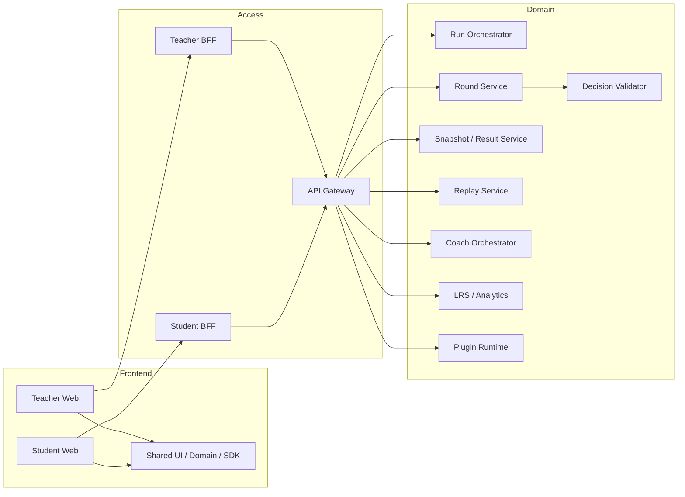
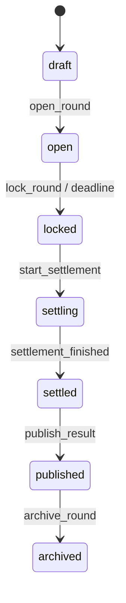
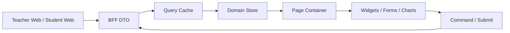
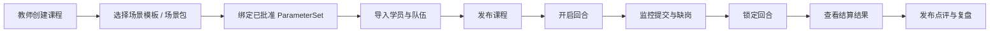
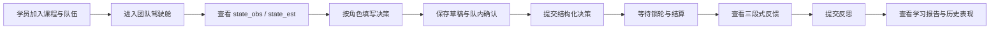

# SimWar 教师端与学员端前端架构

| 项目     | 内容                                                                                                            |
| -------- | --------------------------------------------------------------------------------------------------------------- |
| 文件名   | `docs/frontend/teacher-student-architecture.md`                                                                 |
| 项目名称 | SimWar                                                                                                          |
| 文档类型 | 教师端 / 学员端前端架构文档                                                                                     |
| 适用范围 | Teacher Web、Student Web、BFF 聚合层、前端共享包、AI 前端集成、Replay 可视化、行业插件前端扩展位                |
| 目标读者 | 前端研发、后端/BFF 研发、AI 研发、测试、产品、教研、运维                                                        |
| 文档目标 | 将课程交付、团队协作、回合控制、结构化决策、结果发布、AI 解释、复盘与学习报告收敛为可直接落仓开发的前端实现蓝图 |

本架构以 SimWar 的统一约束为前提：核心仿真引擎是唯一正式真值来源；小模型只能输出 advisory 结果；正式运行中的 ParameterSet 不可变；Replay / Shadow Replay 是治理门禁；Teacher Web 与 Student Web 必须通过 BFF 和裁剪快照消费数据，而不是直连核心结算链。前端职责是组织交互、展示可见状态、提交结构化命令、承接 AI 与 Replay 能力，不承担真值计算，也不得绕过权限边界。fileciteturn0file0 fileciteturn0file1 fileciteturn0file2 fileciteturn0file3

本文采用“框架无关的领域模型 + 可替换前端实现”的写法。推荐基线为 TypeScript 单仓双应用架构，Teacher Web 与 Student Web 分别独立部署，底层共用 UI、契约、状态域与 SDK；若项目采用 Vue 3，则推荐 `Pinia + Vue Router + TanStack Query`；若项目采用 React，则等价映射为 `Zustand/Redux Toolkit + Router + TanStack Query`。无论采用哪一套实现，均必须满足 Contract-first、BFF 聚合、多租户隔离、事件驱动刷新、插件扩展位受控、AI 输出显式标记 `advisory_only` 这几条硬约束。fileciteturn0file0 fileciteturn0file2 fileciteturn0file3

## 文档定位与设计原则

前端在整体系统中属于产品交付层，位于 Teacher Web / Student Web 一侧，消费 Teacher BFF / Student BFF 暴露的工作台 DTO、驾驶舱 DTO、状态快照和 advisory 输出。正式真值链始终是“决策校验 → 特征映射 → L1/L2/L3 结算 → 三态快照发布 → 审计与回放”，前端只能围绕这条链路组织页面和状态，不得把草稿、AI 建议、模拟推演结果误当为正式成绩。fileciteturn0file0 fileciteturn0file2

教师端定位为“教学驾驶台”，必须覆盖课程列表、课程工作台、场景与轮次配置、开轮锁轮、队伍监控、冲击事件注入、Replay 对比、AI 辅助点评与导出；学员端定位为“有限信息下的结构化学习界面”，必须覆盖团队驾驶舱、角色视图、市场信息、结构化决策表单、三段式反馈、AI 策略建议、反思日志、学习报告与历史表现。二者共享同一套领域上下文键：`tenant_id`、`course_id`、`run_id`、`round_id`、`team_id`、`scenario_package_id`、`parameter_set_id`。任何缓存、路由跳转或组件数据绑定都不得脱离这些上下文主键。fileciteturn0file0 fileciteturn0file1 fileciteturn0file2

本架构采用三层状态策略。第一层是服务端状态，承载课程、回合、快照、结果、Replay 报告与学习报告，必须由 Query Cache 管理；第二层是领域状态，承载当前课程上下文、选中队伍、决策草稿、回放视角、AI 面板开关等，必须由 Store 管理；第三层是局部 UI 状态，承载 Drawer、Wizard 步骤、表格排序、图表时间窗等，只在页面组件内存在。这样可以避免把只读快照和可变表单混写，也能严格区分“查询结果”“用户草稿”“AI 建议复制值”三种不同数据来源。fileciteturn0file0 fileciteturn0file2 fileciteturn0file3

## 总体前端架构与代码组织



双应用 + 双 BFF 是本项目最稳妥的前端拆法。Teacher Web 更偏课程调度、班级监控和结果治理，Student Web 更偏驾驶舱、表单输入和反馈学习；二者共享组件体系，但不共享权限面。Teacher BFF 负责课务、班级、监控、Replay、导出等聚合；Student BFF 负责团队驾驶舱、决策草稿、结果反馈、学习报告和 AI 建议聚合；两端都只能经由 Gateway 访问领域服务，不得调用内部正式结算入口 `/internal/v1/.../settle`。fileciteturn0file2 fileciteturn0file0

推荐目录结构如下：

```text
simwar/
  apps/
    teacher-console/
      src/
        app/
        routes/
        pages/
        widgets/
        stores/
    learner-app/
      src/
        app/
        routes/
        pages/
        widgets/
        stores/
  packages/
    ui-kit/
    domain-contracts/
    api-sdk/
    state-core/
    replay-player/
    ai-widgets/
    plugin-slots/
    charts/
    auth-permission/
```

该结构与整体架构中 `apps/teacher-console`、`apps/learner-app` 的交付形态一致，同时补齐前端需要的共享包：`ui-kit` 负责标准化视觉与表单原子组件；`domain-contracts` 冻结 DTO、枚举和状态机常量；`api-sdk` 封装 Teacher BFF / Student BFF；`state-core` 管理领域 Store；`replay-player` 承担时间轴、指标 diff 与历史回放；`ai-widgets` 承担 Strategy Advisor、Debrief Coach、Risk Red Team 的展示容器；`plugin-slots` 提供行业插件 UI 扩展位，但插件只能扩展表单与解释区块，不能越权改变真值写入路径。fileciteturn0file2 fileciteturn0file3 fileciteturn0file5

前端必须提供统一的上下文壳层 `AppContextShell`，至少完成六件事：租户解析、角色绑定、课程上下文选择、回合阶段感知、字段级可见性裁剪、异步事件订阅。多租户与多课程并行不是“多开标签页”的体验问题，而是缓存边界问题；因此所有 Query Key 必须显式包含 `tenant_id`，所有 Store Reset 必须在租户、课程、队伍切换时执行，所有导出和跳转都必须附带权限上下文。fileciteturn0file0 fileciteturn0file1 fileciteturn0file2

行业插件前端扩展位统一采用受控 Slot，而不是开放式页面注入。推荐仅开放以下 Slot：`course.workspace.summary_widgets`、`decision.form.sections`、`result.explainer.widgets`、`learning.report.widgets`、`shock.template.panels`。每个 Slot 只能读取当前页面允许暴露的 `state_obs` / `state_est`、插件上下文和 DTO 扩展字段，不能请求 `state_true`、不能触发正式结算、不能覆盖核心页面字段。这样既满足 Kernel 稳定、Plugin 可扩展，又能支持康养等行业差异化表单和反馈呈现。fileciteturn0file2 fileciteturn0file4 fileciteturn0file5

## 页面结构与组件拆分

下表将需求文档中的教师端与学员端能力、功能深化中的交付模块以及整体架构中的 Teacher / Student Web 分层翻译为可实现页面。路由只体现前端导航，不代表后端资源结构；所有页面均需支持 `loading / empty / error / forbidden / stale / updating` 六类标准交互状态。fileciteturn0file0 fileciteturn0file1 fileciteturn0file2

| 端     | 页面               | 建议路由                                                     | 页面职责                                                            | 主要组件                                                                                           | 关键权限                                     |
| ------ | ------------------ | ------------------------------------------------------------ | ------------------------------------------------------------------- | -------------------------------------------------------------------------------------------------- | -------------------------------------------- |
| 教师端 | 课程列表           | `/teacher/courses`                                           | 查看课程、筛选状态、复制课程、进入工作台                            | `CourseFilterBar`、`CourseTable`、`CourseActionMenu`                                               | `course:read` / `course:create`              |
| 教师端 | 课程创建与发布向导 | `/teacher/courses/new`                                       | 创建课程、绑定场景、选择已批准 ParameterSet、导入名册、配置评分规则 | `CoursePublishWizard`、`ScenarioPicker`、`ParameterSetSelector`、`RosterImporter`                  | `course:create`                              |
| 教师端 | 课程工作台         | `/teacher/courses/:courseId/workspace`                       | 显示课程摘要、当前 Run、轮次日程、提交进度、风险提示                | `CourseContextHeader`、`RoundStateBoard`、`RunSummaryPanel`                                        | `course:read`                                |
| 教师端 | 回合控制台         | `/teacher/runs/:runId/rounds/:roundId/control`               | 开轮、暂停、锁轮、触发结算、发布结果、查看流程日志                  | `RoundControlPanel`、`RoundCommandBar`、`EventLedgerDrawer`                                        | `round:open` / `round:lock` / `round:settle` |
| 教师端 | 队伍监控           | `/teacher/runs/:runId/monitor`                               | 查看全班提交状态、缺岗、草稿进度、异常队伍                          | `TeamMonitorGrid`、`DecisionProgressTable`、`RoleCoverageBadge`                                    | `run:monitor`                                |
| 教师端 | 学生表现分析       | `/teacher/runs/:runId/analysis`                              | 查看团队 KPI、角色贡献、风险暴露、学习诊断                          | `TeamPerformanceMatrix`、`ContributionHeatmap`、`LearningDiagnosticPanel`                          | `result:read_teacher`                        |
| 教师端 | 冲击事件注入       | `/teacher/runs/:runId/shocks`                                | 按有效轮次注入 ShockEvent，预览影响范围                             | `ShockInjectionDrawer`、`ShockTemplatePicker`、`ImpactScopeNote`                                   | `shock:inject`                               |
| 教师端 | Replay 与复盘中心  | `/teacher/runs/:runId/replay` `/teacher/runs/:runId/debrief` | 对比 published 结果与历史 Replay，生成点评和复盘报告                | `ReplayComparisonPanel`、`AICoachCommentWorkbench`、`DebriefReportBuilder`                         | `replay:read` / `comment:publish`            |
| 学员端 | 课程入口           | `/student/courses`                                           | 查看加入课程、进入本队、查看课程状态                                | `StudentCourseList`、`CourseJoinStatusCard`                                                        | `course:member`                              |
| 学员端 | 团队驾驶舱         | `/student/teams/:teamId/cockpit`                             | 汇总本队 KPI、市场观察、任务分工、截止提醒                          | `TeamCockpitHeader`、`KPITrendPanel`、`MarketIntelPanel`、`TeamTaskBoard`                          | `team:read_self`                             |
| 学员端 | 决策填写页         | `/student/runs/:runId/rounds/:roundId/decision`              | 按角色填写结构化决策、草稿保存、校验和提交                          | `RoleDecisionWorkspace`、`DecisionFormSection`、`AssumptionEvidenceEditor`、`DecisionSubmitDrawer` | `decision:write_self`                        |
| 学员端 | 结果反馈页         | `/student/runs/:runId/rounds/:roundId/result`                | 查看三段式反馈、排行榜、队伍对比、可见事件                          | `ThreeStageFeedbackPanel`、`LeaderboardCard`、`RoundEventTimeline`                                 | `result:read_self`                           |
| 学员端 | AI 建议页签        | 嵌入驾驶舱与结果页                                           | 请求策略建议、风险挑战、反事实问题                                  | `StrategyAdvisorPanel`、`RiskChallengeCard`、`CoachOutputCard`                                     | `coach:read_self`                            |
| 学员端 | 学习报告           | `/student/teams/:teamId/learning`                            | 查看个人/团队报告、能力画像、推荐任务                               | `LearningReportPanel`、`SkillProfileRadar`、`RecommendationList`                                   | `learning:read_self`                         |
| 学员端 | 历史表现与回看     | `/student/teams/:teamId/history`                             | 查看历史轮次趋势、已发布结果、自己的决策版本                        | `HistoryReplayPanel`、`DecisionVersionDiff`、`MetricHistoryChart`                                  | `history:read_self`                          |

上述页面直接对应教师端的课程管理、回合控制、监控、冲击注入、Replay 对比与 AI 辅助点评，以及学员端的团队驾驶舱、结构化决策、三段式反馈、学习报告与历史表现。教师端偏“控制与解释”，学员端偏“输入与学习”，共享同一条已发布快照链。fileciteturn0file0 fileciteturn0file1 fileciteturn0file5

建议路由树如下：

```text
/teacher
  /courses
  /courses/new
  /courses/:courseId/workspace
  /runs/:runId/rounds/:roundId/control
  /runs/:runId/monitor
  /runs/:runId/analysis
  /runs/:runId/shocks
  /runs/:runId/replay
  /runs/:runId/debrief

/student
  /courses
  /teams/:teamId/cockpit
  /runs/:runId/rounds/:roundId/decision
  /runs/:runId/rounds/:roundId/result
  /teams/:teamId/learning
  /teams/:teamId/history
```

该路由组织遵循“课程上下文 → Run → Round → Team”的领域顺序，能同时满足多课程并行和多轮回看。页面不直接暴露内部服务边界，而是围绕教学与学习任务构建导航。fileciteturn0file0 fileciteturn0file2

核心组件清单如下。表中“输入”既可对应 Vue props，也可对应 React props + hooks 参数；“输出”对应事件、回调或 command dispatcher；“状态依赖”中“全局”表示依赖 Query / Store，“本地”表示仅依赖组件内状态。

| 组件                       | 类型         | 功能描述                                                              | 输入                                                                       | 输出                                                    | 状态依赖                                            | 权限约束                             |
| -------------------------- | ------------ | --------------------------------------------------------------------- | -------------------------------------------------------------------------- | ------------------------------------------------------- | --------------------------------------------------- | ------------------------------------ |
| `CoursePublishWizard`      | 页面容器     | 完成课程创建、场景选择、参数绑定、名册导入、评分配置与发布前检查      | `courseDraft`、`scenarioOptions`、`approvedParameterSets`、`rosterSummary` | `saveDraft`、`validateBeforePublish`、`publishCourse`   | 全局：`authStore`、`courseStore`；本地：Wizard 步骤 | 教师/管理员；学员不可见              |
| `RoundControlPanel`        | 页面容器     | 显示当前回合状态、时间窗、提交统计，并提供开轮/锁轮/发布命令          | `runStatus`、`roundStatus`、`submissionStats`、`deadline`                  | `openRound`、`pauseRound`、`lockRound`、`publishResult` | 全局：`runStore`、`roundStore`                      | 教师可控；不可替队伍提交             |
| `TeamMonitorGrid`          | 状态组件     | 展示各队提交率、角色覆盖、异常告警、系统代管标记                      | `teamSummaries[]`、`roleCoverage[]`、`alertFeed[]`                         | `selectTeam`、`openDecisionLog`                         | 全局：`teamStore`、`monitorQuery`                   | 教师可见全班；学员不可见班级全量     |
| `ShockInjectionDrawer`     | 状态组件     | 选择 Shock 模板、设置生效轮次、提交冲击事件                           | `shockTemplates`、`effectiveRoundOptions`、`pluginContext`                 | `submitShockEvent`、`previewImpactScope`                | 全局：`pluginStore`、`roundStore`；本地：Form       | 教师/治理；锁定无效轮次时禁用        |
| `ReplayComparisonPanel`    | 复杂组件     | 对比 baseline / candidate / published 结果，展示 diff、hash、指标偏差 | `baselineRef`、`candidateRef`、`metricKeys`                                | `requestReplay`、`changeMetric`、`exportDiff`           | 全局：`replayStore`                                 | 教师/治理；学员不显示 candidate diff |
| `AICoachCommentWorkbench`  | 复杂组件     | 汇聚 AI 辅助点评、教师批注、证据卡与报告草稿                          | `coachOutputs[]`、`teacherNotes[]`、`evidenceRefs[]`                       | `saveCommentDraft`、`publishComment`                    | 全局：`coachStore`、`commentStore`                  | 教师可编辑；AI 仅生成草稿            |
| `TeamCockpitHeader`        | 页面容器     | 汇总本队本轮目标、截止时间、关键 KPI 和状态徽章                       | `teamSummary`、`roundStatus`、`deadline`                                   | `switchRoleView`、`openHistory`                         | 全局：`teamStore`、`roundStore`                     | 仅本队成员可见                       |
| `MarketIntelPanel`         | 状态组件     | 展示 `state_obs` 与 `state_est` 中可见的市场、调研、竞品聚合信息      | `marketSnapshot`、`researchFindings`、`visibleEvents`                      | `requestMoreEvidence`                                   | 全局：`snapshotQuery`                               | 仅可见字段；不可暴露完整竞品明细     |
| `RoleDecisionWorkspace`    | 页面容器     | 按 CEO/CFO/CMO/COO/CHO 等角色组织表单，合并为统一决策草稿             | `roleMap`、`decisionSchema`、`currentDraft`                                | `updateRoleSection`、`mergeDraft`                       | 全局：`decisionDraftStore`；本地：当前 Tab          | 本队成员；队长有最终提交权           |
| `DecisionFormSection`      | 表单组件     | 承载定价、营销、运营、财务、人效、战略说明等字段输入                  | `sectionSchema`、`sectionDraft`、`validationErrors`                        | `changeField`、`blurValidate`                           | 全局：`decisionDraftStore`；本地：表单脏状态        | `open` 状态可编辑，其他状态只读      |
| `AssumptionEvidenceEditor` | 表单组件     | 录入假设、证据引用、战略说明，服务审计与复盘                          | `assumptions[]`、`evidenceOptions[]`                                       | `saveAssumption`、`attachEvidence`                      | 全局：`decisionDraftStore`                          | 学员可写；教师只读，不代填           |
| `DecisionSubmitDrawer`     | 状态组件     | 进行提交前总览、预算校验、角色确认、最终提交                          | `normalizedDraft`、`validationReport`、`roleChecklist`                     | `submitDecision`、`saveDraft`                           | 全局：`decisionDraftStore`、`validatorQuery`        | 仅队长或授权角色可提交               |
| `ThreeStageFeedbackPanel`  | 复杂组件     | 以“发生了什么 / 为什么发生 / 下一步风险与建议”三段展示结果            | `resultSnapshot`、`causeSummary`、`coachOutputs`                           | `openMetricDrillDown`、`acknowledgeFeedback`            | 全局：`resultStore`、`coachStore`                   | 仅 published 后可见                  |
| `StrategyAdvisorPanel`     | AI 组件      | 展示策略建议、资源配置建议、反方挑战与证据卡                          | `visibleState`、`goals`、`constraints`、`coachOutputs[]`                   | `requestAdvice`、`applySuggestionToDraft`               | 全局：`coachStore`；本地：Prompt 输入               | 只读可见状态；自动应用必须二次确认   |
| `LearningReportPanel`      | 复杂组件     | 展示学习报告、能力画像、反思质量、改进建议                            | `learningReport`、`skillProfile`、`recommendations[]`                      | `openRecommendation`、`downloadReport`                  | 全局：`learningStore`                               | 本人/教师按范围可见                  |
| `HistoryReplayPanel`       | 复杂组件     | 展示历史轮次指标趋势、已发布结果、自己的决策版本和事件时间轴          | `historySnapshots[]`、`decisionVersions[]`                                 | `jumpToRound`、`compareRounds`                          | 全局：`historyStore`、`replayStore`                 | 学员仅看本队已发布历史               |
| `PermissionGate`           | 共享守卫     | 根据角色、scope 与字段策略裁剪组件可见性和交互态                      | `ability`、`scope`、`fieldPolicy`                                          | `onForbidden`                                           | 全局：`permissionStore`                             | 全页面通用                           |
| `RoundPhaseBadge`          | 共享 UI      | 统一显示 `draft/open/locked/settling/settled/published/archived` 状态 | `roundStatus`                                                              | 无                                                      | 全局：`roundStore`                                  | 全页面通用                           |
| `PluginSlotRenderer`       | 共享扩展位   | 在驾驶舱、表单、反馈、报告中挂载插件 UI 区块                          | `slotKey`、`pluginContext`、`visibleState`                                 | `onPluginAction`                                        | 全局：`pluginStore`                                 | 仅允许安全 Slot；不可写真值          |
| `CoachOutputCard`          | 共享 AI 卡片 | 统一展示 AI 建议、模型版本、证据、`advisory_only` 标记                | `coachOutput`                                                              | `copyToDraft`、`openEvidence`                           | 全局：`coachStore`                                  | 必须显示 advisory 标识               |
| `AsyncStateBanner`         | 共享状态条   | 展示结算中、回放中、断线重连、数据过期等异步状态                      | `asyncState`、`traceId`                                                    | `retry`、`dismiss`                                      | 全局：`notificationStore`                           | 全页面通用                           |

上述组件拆分遵循三个原则。第一，页面容器组件负责路由上下文、BFF 聚合与权限守卫，不直接写业务真值；第二，状态组件围绕领域状态和回合机组装页面；第三，共享组件保持跨行业复用，插件差异进入 `PluginSlotRenderer`，AI 差异进入 `CoachOutputCard`/`StrategyAdvisorPanel`。这样既能满足课程、商战、康养等不同场景的插件化扩展，也不破坏 Kernel 稳定和字段可见性边界。fileciteturn0file0 fileciteturn0file2 fileciteturn0file4 fileciteturn0file5

## 状态流与数据绑定

状态管理建议显式划分为 Query、Store、Local State 三层，并围绕 BFF DTO 组织，而不是围绕页面散落请求。Teacher Web 与 Student Web 共享同一套领域枚举、DTO 与 Query Key 约定。所有 Query 缓存键至少包含 `tenant_id + course_id`，涉及回合结果时必须再包含 `run_id + round_id`，涉及团队时必须再包含 `team_id`，从根上阻断跨租户、跨课程和错轮缓存污染。fileciteturn0file0 fileciteturn0file1 fileciteturn0file2

| 状态层       | 建议承载内容                                                                                                                      | 推荐实现                        | 不应承载的内容                   |
| ------------ | --------------------------------------------------------------------------------------------------------------------------------- | ------------------------------- | -------------------------------- |
| Query Cache  | `CourseDetail`、`TeacherDashboardDTO`、`StudentCockpitDTO`、`StateSnapshot`、`SettlementResult`、`ReplayReport`、`LearningReport` | TanStack Query / 等价方案       | 表单脏状态、Wizard 步骤、UI 开关 |
| Domain Store | 当前课程上下文、当前角色、决策草稿、AI 面板状态、Replay 视角、通知队列                                                            | Pinia / Zustand / Redux Toolkit | 完整服务端副本                   |
| Local State  | Drawer 开闭、图表筛选、表格排序、临时复制文本                                                                                     | Component State                 | 跨页面共享业务状态               |

推荐建立以下领域 Store：`authStore`、`permissionStore`、`courseContextStore`、`roundPhaseStore`、`decisionDraftStore`、`coachStore`、`replayStore`、`learningStore`、`notificationStore`。其中 `decisionDraftStore` 必须支持本地草稿、服务端草稿与 AI 建议复制值三轨并存；`coachStore` 必须将 AI 输出与用户复制行为区分存档；`replayStore` 必须把 published replay、shadow replay 和 history playback 分仓管理，防止教师误把候选差异看成正式结果。fileciteturn0file0 fileciteturn0file2 fileciteturn0file3

回合状态机如下，前端应直接消费统一状态枚举，不得各页面自行解释状态文案或自行推断流程。



系统文档同时给出了更完整的运行闭环：课程从 `draft -> published -> active -> completed -> archived`，回合从 `draft -> open -> locked -> settling -> settled -> published -> archived`，而正式结果发布后再进入 debriefing / learning 视图。前端的页面 gating 必须以这些状态机为唯一依据：`open` 允许学员写草稿和提交；`locked` 后立即切只读；`settling` 时展示等待屏和追踪号；`published` 后放开结果、AI 复盘和学习报告入口。fileciteturn0file0 fileciteturn0file1 fileciteturn0file2

教师与学员的核心状态流如下：



前端的数据绑定必须采用“只读快照绑定 + 显式命令写入”的模式。`StateSnapshot`、`SettlementResult`、`ReplayReport`、`CoachOutput`、`LearningReport` 都是后端生成的只读资源；前端对这些资源只做展示、筛选和显式复制，不能就地改写。前端可写的只有用户命令和草稿，例如课程草稿、决策草稿、反思文本、教师批注、ShockEvent 创建请求、Replay 比较请求。fileciteturn0file0 fileciteturn0file2 fileciteturn0file3

关键数据绑定规则如下：

| 绑定对象              | 来源                      | 目标页面 / 组件                | 绑定规则                                                                    | 写边界                   |
| --------------------- | ------------------------- | ------------------------------ | --------------------------------------------------------------------------- | ------------------------ |
| `TeacherDashboardDTO` | Teacher BFF               | 课程工作台、队伍监控、分析页   | 仅聚合显示；命令按钮单独走 action API                                       | 前端不得本地拼装真值摘要 |
| `StudentCockpitDTO`   | Student BFF               | 团队驾驶舱                     | 作为驾驶舱主数据源，包含本队 KPI、市场观察和任务提醒                        | 仅读                     |
| `DecisionDraft`       | 学员输入 + 草稿接口       | 决策填写页                     | 字段变更实时写本地 Store，定时 autosave 到草稿接口                          | 仅 `open` 可写           |
| `ValidationReport`    | Decision Validator        | 决策提交抽屉                   | 字段级错误映射到表单；全局错误映射到摘要区                                  | 仅读                     |
| `StateSnapshot`       | Snapshot / Result Service | 教师监控、学员结果页、学习报告 | `state_true` 仅教师授权摘要可见；学员和 AI 只绑定 `state_obs` / `state_est` | 仅读                     |
| `ThreeStageFeedback`  | Student BFF 聚合          | 结果反馈页                     | 第一段来自结果摘要，第二段来自原因树/约束命中，第三段来自 AI 建议与风险卡   | 仅读                     |
| `CoachOutput`         | Coach Orchestrator        | AI 建议面板、教师点评工作台    | 必须显示 `advisory_only`、模型版本、证据引用；复制到草稿需显式确认          | 不得自动提交             |
| `ReplayReport`        | Replay Service            | 教师 Replay 页                 | baseline / candidate / published 分栏展示；candidate 仅教师/治理可见        | 不得回写正式结果         |
| `LearningReport`      | LRS / Analytics           | 学习报告页、教师分析页         | 只作为教学诊断与推荐输入，不反向改动经营结果                                | 仅读                     |
| `ShockEvent`          | 教师命令                  | 教师冲击页、学员市场公告       | 生效前仅教师可见；发布后仅暴露赛制允许的市场公告和观察态变化                | 不得回写历史轮次         |

其中，三段式反馈必须严格按“系统结果优先、解释其次、建议最后”的顺序渲染。建议的数据结构拆为：`what_happened`、`why_happened`、`next_risks_and_actions` 三块。第一块只绑定正式发布后的 KPI 变化、排名、约束命中和事件影响；第二块绑定原因树、可见映射摘要、教师说明与风险触发；第三块绑定 Strategy Advisor / Risk Red Team / Debrief Coach 输出，且全部带 `advisory_only`。这样既能保证反馈可读，也能严格区分“发生的事实”和“面向下一轮的建议”。fileciteturn0file1 fileciteturn0file2 fileciteturn0file3

异步事件处理推荐用 SSE 或 WebSocket 统一进入 `notificationStore`，事件名建议直接复用领域词汇。至少要监听 `DecisionSubmitted`、`RoundLocked`、`TruthStateCalculated`、`ResultPublished`、`ShockEventCreated`、`ReplayRequested`、`ReplayDiffGenerated`、`DebriefSubmitted`。当收到 `RoundLocked` 时，决策页立刻全字段只读；收到 `TruthStateCalculated` 时，教师端先刷新班级监控和结果摘要；收到 `ResultPublished` 时，学员端再打开结果页和三段式反馈；收到 `ReplayDiffGenerated` 时，只更新教师 Replay 页面。fileciteturn0file0 fileciteturn0file2

## 核心交互流程与权限可见性

教师端主流程应被实现为单向、可审计的操作闭环，而不是松散页面跳转。



教师在前端上的具体操作顺序应固定为：先在课程创建向导中完成场景、参数、评分规则和名册绑定；进入课程工作台后查看 Run 与 Round 状态；在 `open` 阶段通过队伍监控页查看提交率、角色覆盖和异常队伍；必要时通过冲击事件页注入本轮或后续轮生效的 ShockEvent；在满足截止条件后进入回合控制台执行锁轮；锁轮后只允许查看结算进度与日志，不允许继续变更任何队伍决策；结果 published 后才允许开启 Replay 对比、AI 点评工作台与复盘报告导出。教师端可以看到教学授权的 `state_true` 摘要，但不能修改正式结果，更不能把 Teacher Sandbox/Counterfactual Sandbox 的预演结果混入正式成绩。fileciteturn0file0 fileciteturn0file1 fileciteturn0file2 fileciteturn0file3

学员端主流程同样必须固定，避免在结果未发布前开放解释或学习结论。



学员在前端上的操作顺序应为：先进入本队驾驶舱，查看当前 KPI、市场观察与截止时间；切换到角色决策工作区填报价格、营销、运营、财务、人效与战略说明等结构化字段；在提交抽屉中查看预算校验、缺失项和角色确认；提交后进入只读等待状态；回合结果 published 后进入三段式反馈；反馈确认后进入反思与学习报告。学员端默认只可见本队 `state_obs`、本队 `state_est`、赛制允许的聚合竞品信息和已发布历史；不可见完整 `state_true`、完整 ParameterSet、完整弹性矩阵、完整微观矩和候选 Replay 差异。fileciteturn0file0 fileciteturn0file1 fileciteturn0file2

回合状态对前端行为的约束如下：

| 回合状态    | 教师端行为                            | 学员端行为                               | UI 锁定规则                  |
| ----------- | ------------------------------------- | ---------------------------------------- | ---------------------------- |
| `draft`     | 可配置课程和轮次，不可开赛            | 不可访问决策页                           | 全部 command 隐藏或禁用      |
| `open`      | 可监控、提醒、注入允许的 future shock | 可编辑草稿、提交决策、查看 advisory 建议 | 表单可写，结果页只显示上一轮 |
| `locked`    | 仅查看锁轮成功与队伍冻结状态          | 决策页立即只读                           | 禁止继续提交与改草稿         |
| `settling`  | 查看结算进度、链路标识、异常日志      | 显示结算中等待页                         | 所有策略操作禁用             |
| `settled`   | 可预览待发布摘要                      | 仍不可见正式结果                         | 仅教师可见中间状态           |
| `published` | 可看结果、Replay 摘要、发布点评       | 可看三段式反馈、排行榜、学习入口         | 结果组件解锁                 |
| `archived`  | 只读导出与历史回看                    | 只读历史回看                             | 新写入全部禁止               |

权限与可见字段矩阵必须在前端显式实现，而不能完全依赖后端“返回什么就展示什么”。原因是本项目存在教师授权摘要、学员可见聚合视图、AI 只读裁剪快照和治理级视图多层并存的场景，前端必须在容器层、字段层和按钮层三重守卫。fileciteturn0file0 fileciteturn0file1 fileciteturn0file2

| 角色         | 可见字段                                                                        | 不可见字段                                               | 前端处理                                    |
| ------------ | ------------------------------------------------------------------------------- | -------------------------------------------------------- | ------------------------------------------- |
| 教师         | 课程级摘要、全班提交率、班级结果、授权 `state_true` 摘要、Replay 摘要、学习诊断 | 正式结果编辑能力、他租户数据、原始参数向量               | 展示结果监控与说明区，隐藏“编辑真值”型动作  |
| 学员         | 本队 `state_obs`、本队 `state_est`、聚合竞品、三段式反馈、学习报告、历史表现    | 完整 `state_true`、ParameterSet、弹性矩阵、候选模型 diff | 所有敏感字段在 DTO 层和组件层双重屏蔽       |
| 队长         | 与学员一致，外加提交确认、队内最终提交                                          | 教师级摘要与他队细节                                     | 在提交抽屉出现最终提交按钮                  |
| AI 小模型    | 裁剪后的 `state_obs` / `state_est`、证据卡、授权内容                            | 原始正式账本、跨租户敏感内容、真值写权限                 | UI 必须显示 advisory 标识和来源             |
| 模型治理人员 | 参数、模型、Replay 报告、审批链                                                 | 对历史正式成绩的覆盖写                                   | 不在 Teacher / Student App 暴露，走治理后台 |

AI 输出在前端必须强制区分四类标签：`系统结果`、`AI 解释`、`AI 建议`、`教师点评`。颜色、图标和文案都应显式不同，且所有 AI 区块都带 `advisory_only`、模型版本、证据引用和生成时间。AI 可以把建议复制到决策草稿，但不能自动写入最终提交，也不能代点“提交决策”；Rubric Judge 只能生成评分草稿，最终由教师确认。fileciteturn0file1 fileciteturn0file2 fileciteturn0file3

当出现角色缺失或信息未补齐时，前端应支持“系统保底代管”的感知呈现，而不是静默补值。队伍监控页和结果页都应明确显示 `system_intervened` 或等价标记，提示哪些职能由 bounded autopilot 做了保底运转；这些信息应在学习报告中同步体现，并提示该轮自主协同分可能受到轻微扣减。这样可以保证教学实验完整进行，但避免系统代管为队伍带来隐性优势。fileciteturn0file0 fileciteturn0file5

## API 映射与实施约束

页面与接口映射应遵循“前端按业务能力调用 BFF，BFF 再聚合领域服务”的原则。虽然系统文档给出了统一 API 面，但前端应优先绑定 DTO 级聚合接口，而不是在页面中拼装多服务请求。下表给出最小实现映射。fileciteturn0file1 fileciteturn0file2

| 页面 / 模块      | 主要接口                                                 | 方法           | 用途                         | 前端说明                                       |
| ---------------- | -------------------------------------------------------- | -------------- | ---------------------------- | ---------------------------------------------- |
| 登录与权限初始化 | `/api/v1/auth/login`                                     | `POST`         | 登录并获取上下文             | 登录后立即加载 `permissionStore`               |
| 课程列表         | `/api/v1/courses`、`/api/v1/courses/{id}`                | `GET` / `POST` | 查询、创建课程               | Teacher BFF 聚合课程状态和运行摘要             |
| 课程发布向导     | `/api/v1/scenarios`、`/api/v1/runs`、`/api/v1/teams`     | `POST`         | 编译场景、创建 Run、导入队伍 | 严禁直接在前端拼装内部编译字段                 |
| 回合控制         | `/api/v1/rounds/{round_id}/lock`                         | `POST`         | 锁轮                         | 需幂等防抖，成功后立刻刷新状态                 |
| 决策提交         | `/api/v1/runs/{run_id}/decisions`                        | `POST`         | 提交团队决策                 | 提交必须带版本摘要与幂等标识                   |
| 结果快照         | `/api/v1/runs/{run_id}/rounds/{round_no}/state-snapshot` | `GET`          | 获取裁剪快照                 | Student BFF/Teacher BFF 读取后再裁剪成页面 DTO |
| AI 策略建议      | `/api/v1/agents/strategy-advisor/propose`                | `POST`         | 获取策略建议                 | 输入只能是可见状态和约束                       |
| AI 复盘草稿      | `/api/v1/agents/debrief-coach/generate`                  | `POST`         | 生成复盘问题与反事实提示     | 仅 published 后开放                            |
| Shadow Replay    | `/api/v1/replays/shadow`                                 | `POST`         | 发起影子回放                 | 仅教师/治理入口可见                            |
| 学习报告         | 由 Student BFF / Teacher BFF 聚合 LRS/Analytics          | `GET`          | 读取学习报告与画像           | 页面不直连 Analytics 明细接口                  |
| 插件上下文       | `/api/plugins/{plugin_id}/compile-context`               | `POST`         | 获取行业表单/解释扩展上下文  | 只注入安全扩展字段                             |

前端需要额外约束四点。第一，任何正式写操作都必须带幂等能力，尤其是 `lockRound`、`submitDecision`、`requestReplay`；用户双击、网络抖动和恢复重试都不能产生重复指令。第二，任何结果页都只能展示 published 或赛制允许的 settled 摘要，不能因为查询命中就提前展示。第三，Teacher App 与 Student App 都不得调用内部正式结算路径。第四，页面跳转时必须保留 `trace_id` 或请求链路标识，便于教师在结算异常时回溯日志。fileciteturn0file1 fileciteturn0file2

正式运行、沙盒运行和 Replay 结果在前端上必须物理区分。推荐统一以 `run_surface` 或 `view_surface` 标识 `official / sandbox / shadow_replay / counterfactual` 四类视图，并在页面头部显示明显徽标。Teacher Sandbox 和 Counterfactual Sandbox 可以用于参数影响预览和教学演示，但任何 sandbox 结果都必须禁止导入正式排行榜、正式三段式反馈和正式学习报告。fileciteturn0file0 fileciteturn0file2 fileciteturn0file3

测试与验收必须围绕“主链闭环 + 边界正确”组织，而不是只看页面可访问。前端至少覆盖以下测试：教师从建课到锁轮到发布点评的 E2E；学员从驾驶舱到提交到三段式反馈到学习报告的 E2E；Truth Boundary Test，验证 AI、教师端和插件 UI 不越权展示或写入真值；Replay Test，验证历史回放展示与 `replay_hash` 一致；Shadow Replay Test，验证教师端 diff 呈现不会污染正式结果；多租户缓存隔离测试，验证切换租户和课程时无脏数据残留。fileciteturn0file0 fileciteturn0file1 fileciteturn0file2

本架构的最终交付标准不是“页面齐全”，而是以下五点同时成立：教师端能完成从开课到复盘的闭环；学员端能完成从入队到提交到反馈到学习报告的闭环；回合状态机在前端被严格执行；AI 输出始终保持 advisory-only 边界；多租户、多课程、多轮次、多插件场景下缓存、权限和展示不串线。只有在这些条件满足后，Teacher Web 和 Student Web 才真正符合 SimWar 的核心系统约束。fileciteturn0file0 fileciteturn0file1 fileciteturn0file2
