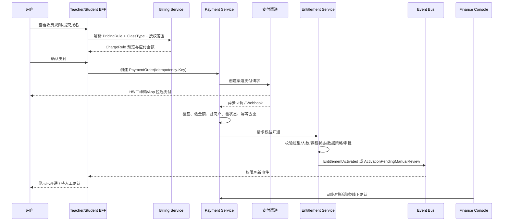
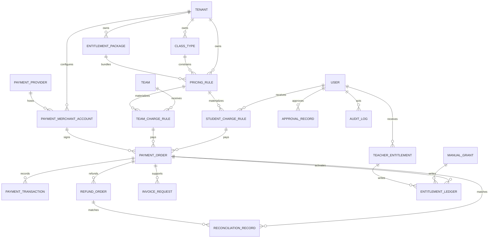
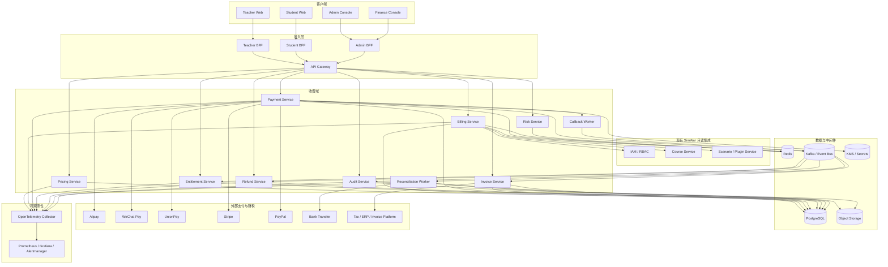

# SimWar 收费与权益授权功能开发文档

**执行摘要：**本文基于首个提示词文档和现有 SimWar 架构材料，提出一套“收费规则、支付执行、权益开通、审计治理”分离的实现方案。方案强调支付成功不等于自动开通，所有收费都受班型、场景、租户、角色与数据策略约束，并兼容线上支付、线下合同、人工授权和后续国际化扩展。

## 输入假设与需求映射

### 输入材料与未指定项

| 类型               | 状态   | 说明                                                                                                                                                                                                                                                                                                                                                                                                                                                         | 对本文影响                                                            |
| ------------------ | ------ | ------------------------------------------------------------------------------------------------------------------------------------------------------------------------------------------------------------------------------------------------------------------------------------------------------------------------------------------------------------------------------------------------------------------------------------------------------------ | --------------------------------------------------------------------- |
| 第一个文档提示词   | 已提供 | 实际上传文件为 `粘贴的 markdown (1)。md(3)`，内容是生成 `PRICING_ENTITLEMENT_PAYMENT_RULES.md` 的完整提示词集合                                                                                                                                                                                                                                                                                                                                              | 作为本方案最优先的收费与授权需求来源                                  |
| 参考文档           | 已提供 | `docs/product/requirements.md`、`docs/architecture/system-architecture.md`、`docs/architecture/database-design.md`、`DEVELOPMENT_PLAN.md`、`docs/architecture/event-driven-architecture.md`、`SimWar docs/frontend/frontend-state-flow.md(3).md`、`docs/frontend/teacher-student-architecture.md`、`SimWar docs/frontend/figma-prototype-spec.md(3).md`、`docs/product/non-functional-requirements.md`、`SimWar docs/devops/monitoring-alerting.md(1).md` 等 | 用于把收费模块对齐到现有多租户、事件驱动、Replay、AI 边界和前后端架构 |
| API 契约文档       | 未提供 | `docs/contracts/api-contract.md` 未出现在本轮附件                                                                                                                                                                                                                                                                                                                                                                                                            | 下文 API 形态为**建议契约**，上线前需进入正式 OpenAPI 冻结流程        |
| 测试覆盖文档       | 未提供 | `docs/quality/test-coverage.md` 未出现在本轮附件                                                                                                                                                                                                                                                                                                                                                                                                             | 下文验收与测试用例为**建议门禁**                                      |
| CI/CD 文档         | 未提供 | `docs/devops/ci-cd-pipeline.md` 未出现在本轮附件                                                                                                                                                                                                                                                                                                                                                                                                             | 下文流水线门禁为**建议实现**                                          |
| 用户故事与功能规格 | 未提供 | `docs/product/user-stories.md`、`FUNCTIONAL_SPECIFICATION.md` 未出现在本轮附件                                                                                                                                                                                                                                                                                                                                                                               | 角色行为与页面粒度以首个提示词和现有前端文档推导                      |
| 商户主体与税务接入 | 未指定 | 支付宝/微信/银联商户主体、结算账户、税务开票服务商、发票类目、税率策略均未给出                                                                                                                                                                                                                                                                                                                                                                               | 本文默认采用“配置化 + 审批化”，而不固化商户和税务实现                 |
| 币种与国际化策略   | 未指定 | 币种未明确                                                                                                                                                                                                                                                                                                                                                                                                                                                   | 默认 `CNY`，并在数据模型中预留 `currency_code`                        |

### 首个文档提示词与设计映射

| 首个文档中的关键要求                                          | 设计映射                                                                                           | 落地对象                                                         |
| ------------------------------------------------------------- | -------------------------------------------------------------------------------------------------- | ---------------------------------------------------------------- |
| 规则、收费、支付、授权分离                                    | 按 Bounded Context 拆为 Pricing、Billing、Payment、Entitlement、Finance                            | `PricingRule`、`ChargeRule`、`PaymentOrder`、`EntitlementLedger` |
| 系统只确定规则、原则和权益边界，不直接决定最终价格            | 规则层与人工改价层分离，人工改价不覆盖原始规则                                                     | `PricingRule` + `PriceOverride` + `BillingApproval`              |
| 教师端授权必须由系统端控制                                    | 教师只能消费已授权班型、场景、插件、AI 和 Replay 权益                                              | `TeacherEntitlement`、`ScenarioEntitlement`、`PluginEntitlement` |
| 班型决定收费结构                                              | 班型作为收费分流器，控制收费对象、支付方式、审批和数据策略                                         | `ClassType`                                                      |
| 学生个人收费与自动组队收费并存                                | 个人收费与团队收费模型并存，团队形成后再激活团队权益                                               | `StudentChargeRule`、`TeamChargeRule`                            |
| 企业内训、商学院采购、高管训练营支持线下合同与对公转账        | 线上订单与线下合同分流，均走统一权益激活规则                                                       | `OfflineContract`、`OfflinePaymentConfirmation`、`ManualGrant`   |
| 支付成功不等于自动获得所有权益                                | 引入 `Entitlement Activation Rule Engine`                                                          | `EntitlementActivationTask`、`EntitlementLedger`                 |
| 收费模块不得突破隐私、AI、Replay、ParameterSet 和真值治理规则 | 收费域对核心仿真域只读，不允许写 `state_true`、`SettlementResult`、`Score`、`Rank`、`ParameterSet` | 领域隔离 + RBAC + 审计                                           |
| 人工授权不能绕过审计                                          | 所有人工改价、授权、退款、线下确认都强制审计                                                       | `AuditLog`、`ApprovalRecord`                                     |
| 发票系统属于后续增强                                          | 本文采用“MVP 申请与台账、P2 正式开票”双层设计                                                      | `InvoiceRequest`、`InvoiceRecord`                                |

### 与现有 SimWar 架构的硬边界对齐

现有 SimWar 文档已经明确了几条不能被收费模块突破的红线：核心仿真引擎才是正式真值来源；AI 只能做 advisory-only；`ParameterSet` 在正式运行后不可变；Replay/Shadow Replay 是治理门禁；平台采用多租户、契约优先、可审计、可回放、事件驱动架构。基于这些约束，收费模块只能**读取**课程、班型、场景、插件、租户、用户和队伍元数据，用于计算应收规则与权限展示；它绝不能写入正式结算真值，也不能通过“付费购买”绕过教师授权、数据隐私或模型治理边界。内部依据主要来自 `docs/architecture/system-architecture.md`、`docs/product/requirements.md`、`docs/architecture/database-design.md`、`docs/architecture/event-driven-architecture.md`、`docs/frontend/teacher-student-architecture.md`。

| 现有约束                    | 收费模块落地要求                                                           |
| --------------------------- | -------------------------------------------------------------------------- |
| 核心仿真引擎唯一写真值      | Billing 域只能写订单、交易、权益、审计和财务对象                           |
| AI advisory-only            | 付费 AI 权益只增加调用额度、模型席位或面板可见性，不赋予 AI 写真值能力     |
| ParameterSet 正式运行不可变 | 付费不能触发 `ParameterSet` 修改，仅能解锁“可使用的已批准版本”             |
| Replay/Shadow Replay 强门禁 | 付费 Replay 权益只赋予查看/发起权限，不绕过治理审批                        |
| 多租户隔离                  | 所有核心表必须带 `tenant_id`，缓存和事件主题必须带租户边界                 |
| 审计与追加写                | `ManualGrant`、`RefundOrder`、`EntitlementLedger`、`AuditLog` 均采用追加写 |

## 目标与产品范围

### 业务目标、非目标与范围分层

收费模块的业务目标不是“接上支付就结束”，而是把 **定价规则、订单执行、权益开通、人工授权、财务确认和权限刷新** 串成一条可审计主链。它要同时服务四类业务：公开课程与竞赛报名、教师端场景/插件/AI 权益授权、企业内训与商学院采购、以及后续的案例库/社区/Replay 增值能力。与之相对，收费模块的**非目标**是：不负责决定正式仿真结果；不自动把学生数据开放为模型训练素材；不允许教师自助启用未授权插件或高风险场景；不把支付渠道配置暴露给普通教师和学生。

为兼容首个文档与现有系统，建议范围分三层：

| 范围层级       | 内容                                                                                                     | 优先级 |
| -------------- | -------------------------------------------------------------------------------------------------------- | ------ |
| 支付与权益主链 | 班型、权益包、教师授权、学生收费规则、团队收费规则、支付订单、回调验签、权益开通、线下收款确认、审计日志 | P0     |
| 财务与运营增强 | 退款、对账、异常处理队列、审批流、队长代付、成员分摊、企业合同确认                                       | P1     |
| 商业扩展       | 银联/云闪付完整接入、发票系统、企业账期、复杂折扣、优惠券、Revenue Dashboard                             | P2     |

### 用户角色与职责

| 角色          | 关键职责                                               | 主要界面        | 明确禁止                         |
| ------------- | ------------------------------------------------------ | --------------- | -------------------------------- |
| 平台管理员    | 管理收费规则、班型、权益包、商户配置、跨租户治理       | 系统端管理后台  | 直接改正式结算数据               |
| 租户管理员    | 管理本租户价格策略、教师授权、课程收费策略             | 租户管理后台    | 访问其他租户订单与交易           |
| 财务人员      | 对账、退款审批、线下收款确认、开票处理                 | 财务控制台      | 修改场景授权或教师权限边界       |
| 运营人员      | 人工改价、赠送、奖学金、活动价、异常订单处理           | 运营后台        | 绕过审批直接改商户密钥           |
| 教师          | 在授权范围内配置课程收费和查看学生收费状态             | 教师端          | 自授场景、插件、班型或高风险权益 |
| 学生          | 查看自己的收费规则、下单、支付、申请退款、查看本人权益 | 学生端          | 查看他人价格隐私或队外权益       |
| 企业采购/教务 | 发起企业合同、线下付款、批量授权                       | 企业端/财务端   | 绕过数据策略开放训练权           |
| 审计员        | 查看收费、授权、退款、对账审计记录                     | 审计后台        | 执行任何业务写操作               |
| 系统服务账号  | 处理回调、激活权益、发送权限刷新事件                   | Backend Service | 发起人工改价或人工授权           |

### 计费模式比较与推荐

首个文档没有指定唯一计费模式，因此建议采用“**计费对象** × **计费模式**”双层模型。外层先确定收费对象是个人、队伍、课程、教师还是企业租户，内层再决定按次、订阅、套餐、试用、优惠券还是线下合同。Stripe Billing 官方已支持 flat-rate、usage-based、tiered 和 trial 等订阅模型，PayPal Subscriptions 也采用 plan + billing cycle 的订阅抽象，这说明该双层模型既适合当前 SimWar，也便于未来国际化扩展。citeturn11search10turn11search0turn12search1

| 计费模式           | 优点                                       | 缺点                             | 适用场景                                   | SimWar 建议 |
| ------------------ | ------------------------------------------ | -------------------------------- | ------------------------------------------ | ----------- |
| 按次               | 规则清晰、易理解、最适合课程报名和单次竞赛 | 复购管理弱、收入波动大           | 学生单门课程、单场竞赛、一次性 AI 包       | P0          |
| 订阅               | 适合长期教学平台、月度权限包、教师席位     | 退订、续费、账单复杂度更高       | 教师场景包、机构月包、社区会员             | P1          |
| 套餐/点数          | 适合 AI 次数、Replay 次数、案例库下载量    | 用户理解成本高，需要额度清晰展示 | AI 增值包、Replay 包、案例包               | P1          |
| 试用               | 降低转化门槛，可绑定邀请码和班型门槛       | 滥用风险高，需要风控             | 试听班、演示赛、校内试点                   | P0          |
| 优惠券/奖学金/减免 | 支持营销与教务政策                         | 叠加规则复杂，易产生财务争议     | 招生赠课、奖学金、推广活动                 | P2          |
| 企业合同/线下      | 符合 B2B 大额采购、法务和对公结算流程      | 周期长、审核重、自动化程度低     | 企业内训、商学院采购、高管训练营、私有部署 | P0          |

### 班型体系建议

班型是收费设计的中枢。班型不仅决定价格，还决定谁付费、是否线上支付、是否必须人工审批、以及数据策略是否允许上传或沉淀案例。

| 班型         | 适用对象           | 收费对象             | 默认权益                             | 支付方式                 | 是否需人工审批 | 默认数据策略                         |
| ------------ | ------------------ | -------------------- | ------------------------------------ | ------------------------ | -------------- | ------------------------------------ |
| 试听旁听班   | 试用用户、校内体验 | 个人 / 免费授权      | 基础课堂访问、有限 AI                | 免费 / 邀请码 / 人工授权 | 否             | 不上传训练、不沉淀案例               |
| 标准公开班   | 普通学员           | 学生个人             | 课程访问、基础场景、基础 AI          | 微信/支付宝              | 否             | 仅教学必需数据                       |
| 商学院班     | 商学院项目         | 个人或机构           | 课程访问、案例复盘、部分 Replay      | 微信/支付宝/线下         | 可配置         | 教学内闭环，默认不公开沉淀           |
| 企业内训班   | 企业客户           | 企业/对公            | 企业课程权限、教师授权场景、批量席位 | 线下合同/对公转账        | 是             | 默认 `no_training`、`no_public_case` |
| 高管训练营   | 高价值项目         | 企业或个人           | 高阶场景、AI 增值、Replay、报告导出  | 线上定金 + 线下合同      | 是             | 强隐私、案例需脱敏审批               |
| 竞赛班       | 校赛/公开赛        | 个人、队长代付或企业 | 报名资格、队伍资格、榜单参与         | 微信/支付宝/队长代付     | 可配置         | 公开字段受控                         |
| 私有化部署班 | 私有部署客户       | 企业租户             | 场景包、插件、教师席位、私有案例库   | 合同、账期、人工授权     | 是             | 默认高保密，不上传                   |

### 支付渠道范围建议

面向中国大陆主路径，支付宝开放平台覆盖手机网站支付、App 支付、退款和异步通知；微信支付 API v3/商户文档覆盖 H5、Native、App 等场景，并明确要求商户以服务器端回调或查询结果为准，而不是客户端返回；银联开放平台公开了 WAP 支付、退货/退款通知以及 RSA/SM2 签名机制。因此大陆默认建议优先做 **支付宝 + 微信支付**，企业与政企采购补充 **银联/对公转账**。citeturn14search0turn14search4turn14search3turn13search8turn21search22turn22search7turn22search2turn18search10turn18search7turn18search4

面向国际化扩展，Stripe Checkout 同时支持一次性支付和订阅，Stripe Subscriptions 支持订阅生命周期与 webhook 驱动；PayPal 提供 Orders、Payments、Subscriptions、Webhooks 与 Invoicing API。因此建议在领域模型中预留 `provider_code`、`merchant_account_id`、`provider_trade_no` 和 `currency_code`，但把 Stripe/PayPal 作为 P2 适配器，而不是当前主路径。citeturn11search6turn11search0turn20search0turn20search9turn12search7turn12search5turn12search1turn12search3turn12search13

## 功能方案与接口契约

### 总体流程与状态机

收费主链建议采用如下统一流程：**规则解析 → 生成应收规则 → 创建支付订单 → 渠道支付 → 回调验签 → 权益开通判断 → 权限刷新 → 财务对账 → 退款/回收**。其中，支付成功只进入“可开通”的候选状态，真正的开通必须再通过班型、人数、课程状态、授权范围、数据策略和审批状态校验。



建议落地以下状态机，状态名沿用首个文档中的约束，避免前后端表达不一致：

| 对象                 | 状态                                                                                                     | 含义                                             | 允许操作                     |
| -------------------- | -------------------------------------------------------------------------------------------------------- | ------------------------------------------------ | ---------------------------- |
| `PricingRule`        | `draft -> active -> deprecated -> archived`                                                              | 草稿、启用、弃用、归档                           | 创建、激活、弃用、归档       |
| `ManualGrant`        | `requested -> approved -> active -> expired -> revoked`                                                  | 申请、批准、生效、过期、撤销                     | 审批、激活、撤销、到期处理   |
| `StudentChargeRule`  | `pending -> authorized -> payment_required -> waived -> expired -> cancelled`                            | 待生成、已授权、需付款、已减免、过期、取消       | 预览、转付款、减免、取消     |
| `TeamChargeRule`     | `forming -> pending_confirmation -> authorized -> locked -> cancelled`                                   | 组队中、待确认、已授权、锁定、取消               | 组队、确认、代付、取消       |
| `PaymentOrder`       | `created -> pending_payment -> paid -> failed -> cancelled -> expired -> refunded -> partially_refunded` | 订单生命周期                                     | 支付、取消、过期关闭、退款   |
| `PaymentTransaction` | `received -> verified -> matched -> processed -> duplicated -> rejected`                                 | 收到回调、验签通过、匹配成功、已处理、重复、拒绝 | 处理或拒绝                   |
| `RefundOrder`        | `requested -> approved -> submitted -> succeeded -> failed -> cancelled`                                 | 退款请求生命周期                                 | 审批、提交、成功、失败、取消 |

### 前端与后端功能清单

#### 前端页面清单

| 端     | 页面               | 主要功能                                            | 依赖 API                                                                                       | 权限                       |
| ------ | ------------------ | --------------------------------------------------- | ---------------------------------------------------------------------------------------------- | -------------------------- |
| 系统端 | 收费规则管理       | 新建/启停 `PricingRule`、班型价格结构、价格版本比较 | `/api/v1/pricing-rules`                                                                        | `pricing:manage`           |
| 系统端 | 班型与权益包管理   | 管理 `ClassType`、`EntitlementPackage`、数据策略    | `/api/v1/class-types`、`/api/v1/entitlement-packages`                                          | `billing:catalog_manage`   |
| 系统端 | 教师/场景/插件授权 | 授权教师可用场景、插件、班型、AI、Replay            | `/api/v1/teacher-entitlements`、`/api/v1/scenario-entitlements`、`/api/v1/plugin-entitlements` | `entitlement:grant`        |
| 系统端 | 支付与财务后台     | 订单、交易、退款、对账、线下收款确认、异常支付处理  | `/api/v1/admin/payments/*`                                                                     | `finance:operate`          |
| 教师端 | 我的授权           | 查看自己可用班型、场景、插件、AI、Replay            | `/api/v1/teacher/my-entitlements`                                                              | `teacher:self_read`        |
| 教师端 | 课程收费设置       | 在授权范围内为课程绑定班型、价格策略、收费对象      | `/api/v1/courses/{course_id}/pricing-policy`                                                   | `course:pricing_configure` |
| 教师端 | 学生/小组收费状态  | 查看学生收费进度、团队收费状态、线下授权申请        | `/api/v1/courses/{course_id}/student-charge-status`、`/team-charge-status`                     | `billing:teacher_read`     |
| 学生端 | 报名与支付页       | 个人课程、竞赛报名、AI 增值包购买                   | `/api/v1/student/charge-rules`、`/api/v1/payments/orders`                                      | `student:self_pay`         |
| 学生端 | 订单与权限中心     | 订单列表、付款状态、退款申请、本人权益              | `/api/v1/payments/my-transactions`、`/api/v1/student/my-entitlements`                          | `student:self_read`        |
| 学生端 | 小组收费与代付     | 队长代付、成员分摊、自动组队收费确认                | `/api/v1/student/team-charge-confirmation`、`/api/v1/grouping/*`                               | `team:self_billing`        |
| 财务端 | 发票与对账中心     | 开票申请、开票结果、对账异常人工处理                | `/api/v1/invoice-requests`、`/api/v1/admin/payments/reconciliation-records`                    | `finance:invoice`          |

#### 后端服务清单

| 服务                      | 核心职责                                                            | 读写边界                                            |
| ------------------------- | ------------------------------------------------------------------- | --------------------------------------------------- |
| `Pricing Service`         | 维护价格规则、班型、权益包、活动价和覆盖规则                        | 写 `PricingRule`、`ClassType`、`EntitlementPackage` |
| `Billing Service`         | 生成 `StudentChargeRule` / `TeamChargeRule`，预览应收，冻结可计费项 | 写 `ChargeRule`，只读课程/班型/场景元数据           |
| `Payment Service`         | 创建 `PaymentOrder`、封装适配器、处理回调、统一订单状态             | 写订单、交易、订单事件                              |
| `Entitlement Service`     | 执行权限开通、续期、回收、过期、撤销和权限刷新                      | 写 `EntitlementLedger`、`TeacherEntitlement` 等     |
| `Refund Service`          | 退款审批、退款提交、权益回收与补偿                                  | 写 `RefundOrder`、`EntitlementLedger`               |
| `Reconciliation Worker`   | 下载账单、自动对账、异常入人工队列                                  | 写 `ReconciliationRecord`                           |
| `Invoice Service`         | 接收开票申请、校验抬头、同步税务/ERP、回写发票结果                  | 写 `InvoiceRequest`、`InvoiceRecord`                |
| `Risk Service`            | 风控评分、限频、异常支付、代付与优惠滥用监测                        | 写风控决策与告警                                    |
| `Audit Service`           | 所有人工审批、改价、授权、退款、线下确认、导出留痕                  | 追加写 `AuditLog`                                   |
| `Merchant Config Service` | 商户号、证书、密钥、回调配置和渠道开关                              | 写 `PaymentMerchantAccount`，密钥入 KMS             |

### API 分组与契约建议

首个文档已经给出了清晰的 API 目录，建议尽量保持原始分组，以降低后续产品、前端和测试对接成本。由于 `docs/contracts/api-contract.md` 未提供，以下形态视为**建议契约**，但路径与分组尽量沿用首个文档。

| API 分组         | 建议路径                                                                                                                                                                                                                                                                                                                                                                                                                     |
| ---------------- | ---------------------------------------------------------------------------------------------------------------------------------------------------------------------------------------------------------------------------------------------------------------------------------------------------------------------------------------------------------------------------------------------------------------------------- |
| 系统端收费与权益 | `POST /api/v1/pricing-rules`、`GET /api/v1/pricing-rules`、`PATCH /api/v1/pricing-rules/{pricing_rule_id}`、`POST /api/v1/entitlement-packages`、`POST /api/v1/class-types`、`POST /api/v1/teacher-entitlements`、`POST /api/v1/scenario-entitlements`、`POST /api/v1/plugin-entitlements`、`POST /api/v1/manual-grants`、`POST /api/v1/price-overrides`、`POST /api/v1/billing-approvals`、`GET /api/v1/entitlement-ledger` |
| 教师端           | `GET /api/v1/teacher/my-entitlements`、`GET /api/v1/teacher/available-class-types`、`GET /api/v1/teacher/available-scenarios`、`GET /api/v1/teacher/available-plugins`、`POST /api/v1/courses/{course_id}/pricing-policy`、`POST /api/v1/courses/{course_id}/student-grants`、`GET /api/v1/courses/{course_id}/student-charge-status`、`GET /api/v1/courses/{course_id}/team-charge-status`                                  |
| 学生端           | `GET /api/v1/student/charge-rules`、`GET /api/v1/student/my-entitlements`、`POST /api/v1/student/enrollments`、`POST /api/v1/student/team-charge-confirmation`、`GET /api/v1/student/payment-or-authorization-status`、`GET /api/v1/student/my-transactions`                                                                                                                                                                 |
| 自动组队         | `POST /api/v1/grouping/pools`、`POST /api/v1/grouping/pools/{pool_id}/join`、`POST /api/v1/grouping/pools/{pool_id}/charge-rules`、`POST /api/v1/grouping/pools/{pool_id}/auto-team`                                                                                                                                                                                                                                         |
| 支付订单         | `POST /api/v1/payments/orders`、`GET /api/v1/payments/orders/{order_id}`、`POST /api/v1/payments/orders/{order_id}/cancel`、`GET /api/v1/payments/my-transactions`、`GET /api/v1/payments/my-entitlement-status`                                                                                                                                                                                                             |
| 支付渠道         | `POST /api/v1/payments/providers/{provider_code}/create-request`、`POST /api/v1/payments/providers/wechat/callback`、`POST /api/v1/payments/providers/alipay/callback`、`POST /api/v1/payments/providers/unionpay/callback`                                                                                                                                                                                                  |
| 管理端支付       | `GET /api/v1/admin/payments/orders`、`GET /api/v1/admin/payments/transactions`、`POST /api/v1/admin/payments/refunds`、`POST /api/v1/admin/payments/offline-confirmations`、`POST /api/v1/admin/payments/reconciliation`、`GET /api/v1/admin/payments/reconciliation-records`                                                                                                                                                |
| 商户配置         | `POST /api/v1/admin/payment-providers`、`POST /api/v1/admin/payment-merchant-accounts`、`GET /api/v1/admin/payment-merchant-accounts`、`PATCH /api/v1/admin/payment-merchant-accounts/{account_id}`                                                                                                                                                                                                                          |
| 发票             | `POST /api/v1/invoice-requests`、`GET /api/v1/invoice-requests/{invoice_request_id}`、`GET /api/v1/me/invoices`                                                                                                                                                                                                                                                                                                              |

#### 统一请求约定

| 项目     | 约定                                                                  |
| -------- | --------------------------------------------------------------------- |
| 鉴权     | `Authorization: Bearer <token>`                                       |
| 租户透传 | `X-Tenant-Id`                                                         |
| 幂等键   | `Idempotency-Key`，适用于创建订单、回调消费、退款、人工授权和线下确认 |
| 请求追踪 | `X-Request-Id`                                                        |
| 响应信封 | `request_id`、`code`、`message`、`data`                               |
| 金额字段 | API 返回十进制字符串，数据库存 `amount_minor` 整数分                  |
| 时间字段 | ISO 8601 UTC                                                          |
| 扩展字段 | `metadata` / `provider_payload_ref`，禁止前端依赖渠道私有字段         |

#### 代表性接口定义

**创建支付订单**

```http
POST /api/v1/payments/orders
```

请求示例：

```json
{
  "charge_rule_id": "scr_20260516_0001",
  "provider_code": "alipay",
  "scene": "course_enrollment",
  "payer": {
    "subject_type": "student",
    "subject_id": "usr_10001"
  },
  "client_context": {
    "terminal": "h5",
    "return_url": "https://simwar.example.com/payment/result"
  }
}
```

响应示例：

```json
{
  "request_id": "req_01jv0r2d2f",
  "code": "OK",
  "message": "success",
  "data": {
    "order_id": "po_20260516_0001",
    "status": "pending_payment",
    "amount": {
      "currency_code": "CNY",
      "total": "299.00"
    },
    "provider_code": "alipay",
    "provider_payload": {
      "pay_url": "https://openapi.alipay.com/gateway.do?...token=***"
    },
    "expires_at": "2026-05-16T18:00:00Z"
  }
}
```

**渠道回调处理**

```http
POST /api/v1/payments/providers/alipay/callback
POST /api/v1/payments/providers/wechat/callback
POST /api/v1/payments/providers/unionpay/callback
```

回调处理规范必须统一：先验签，再验商户号/应用标识，再验金额、币种与订单状态，最后落地 `PaymentTransaction` 并异步触发权益开通。支付宝异步通知通过 `notify_url` 以 POST 方式返回；微信支付要求接收后立即验签，验签通过返回 `200` 或 `204`，并建议应答后异步处理业务，同时明确不能以客户端返回作为最终支付结果；银联退款通知同样通过 HTTP POST(JSON) 异步发送。citeturn13search4turn13search12turn22search3turn22search2turn18search3

回调成功响应建议：

```http
204 No Content
```

回调失败响应建议：

```json
{
  "code": "PAYMENT_CALLBACK_VERIFY_FAILED",
  "message": "signature verification failed"
}
```

**人工授权**

```http
POST /api/v1/manual-grants
```

请求示例：

```json
{
  "grant_scope": {
    "subject_type": "student",
    "subject_id": "usr_10001",
    "course_id": "course_3001"
  },
  "grant_type": "waiver",
  "entitlement_package_id": "epkg_basic_course",
  "reason": "奖学金减免",
  "effective_at": "2026-05-16T00:00:00Z",
  "expires_at": "2026-06-30T23:59:59Z",
  "approval_required": true
}
```

响应示例：

```json
{
  "request_id": "req_01jv0r3rx9",
  "code": "OK",
  "message": "submitted",
  "data": {
    "manual_grant_id": "mg_90001",
    "status": "requested"
  }
}
```

**申请退款**

```http
POST /api/v1/admin/payments/refunds
```

请求示例：

```json
{
  "payment_order_id": "po_20260516_0001",
  "refund_amount": {
    "currency_code": "CNY",
    "total": "299.00"
  },
  "reason": "课程取消",
  "revoke_entitlement": true
}
```

响应示例：

```json
{
  "request_id": "req_01jv0r4yzr",
  "code": "OK",
  "message": "refund_submitted",
  "data": {
    "refund_order_id": "ro_20260516_0008",
    "status": "submitted"
  }
}
```

**查询本人权益**

```http
GET /api/v1/student/my-entitlements
```

响应示例：

```json
{
  "request_id": "req_01jv0r5df7",
  "code": "OK",
  "message": "success",
  "data": [
    {
      "entitlement_id": "el_70001",
      "package_code": "basic_course_access",
      "scope_type": "course",
      "scope_id": "course_3001",
      "status": "active",
      "source_type": "payment_order",
      "effective_at": "2026-05-16T13:00:00Z",
      "expires_at": "2026-06-30T23:59:59Z"
    }
  ]
}
```

#### 错误码建议

| 错误码                            | HTTP | 含义                     | 处理建议                 |
| --------------------------------- | ---: | ------------------------ | ------------------------ |
| `PRICING_RULE_NOT_ACTIVE`         |  409 | 价格规则未启用           | 提示更换班型或联系管理员 |
| `CLASS_TYPE_NOT_AUTHORIZED`       |  403 | 当前用户/教师无班型授权  | 隐藏按钮并提示申请授权   |
| `SCENARIO_NOT_AUTHORIZED`         |  403 | 场景或插件未授权         | 只返回授权范围内资源     |
| `CHARGE_RULE_EXPIRED`             |  410 | 应收规则过期             | 重新生成规则             |
| `PAYMENT_PROVIDER_UNAVAILABLE`    |  503 | 支付渠道不可用           | 提示切换渠道或稍后重试   |
| `PAYMENT_CALLBACK_VERIFY_FAILED`  |  400 | 回调验签失败             | 记录审计，拒绝处理并告警 |
| `PAYMENT_AMOUNT_MISMATCH`         |  409 | 回调金额与订单金额不一致 | 拒绝开通，进入人工队列   |
| `PAYMENT_ORDER_ALREADY_FINALIZED` |  409 | 订单已进入终态           | 幂等返回，不重复处理     |
| `IDEMPOTENCY_CONFLICT`            |  409 | 幂等键与请求体不一致     | 拒绝请求，要求客户端修正 |
| `ENTITLEMENT_ACTIVATION_BLOCKED`  |  422 | 付款成功但开通条件不满足 | 进入待人工确认或补偿队列 |
| `REFUND_NOT_ALLOWED`              |  422 | 当前状态不允许退款       | 进入人工审批             |
| `TENANT_SCOPE_VIOLATION`          |  403 | 跨租户访问/操作          | 记录高优先级安全审计     |

### 支付、退款、对账、发票与用户中心设计

#### 支付适配层

建议定义统一适配器接口，隐藏支付宝、微信、银联、Stripe、PayPal 的差异：

```text
create_payment_request()
query_payment()
verify_callback()
request_refund()
query_refund()
download_statement()
build_client_payload()
```

这样做的原因很明确：支付宝走 `notify_url` 异步通知，微信支付强调 APIv3 验签与服务端结果权威，银联在不同产品上使用 RSA/SM2 签名和专用网关，Stripe/PayPal 则大量依赖 webhook。统一适配器可以让核心领域对象只处理**规则、订单、交易、权益、退款、对账**，而不是到处充满渠道 if-else。citeturn13search8turn22search1turn18search4turn20search0turn12search3

#### 权益开通规则

建议把权益开通独立成规则引擎，而不是由支付回调直接写权限。推荐判定式如下：

```text
order.status == paid
AND charge_rule.status in {authorized, payment_required, waived}
AND class_type.status == active
AND course_status in {draft, published, enrolling}
AND subject_scope_valid == true
AND scenario/plugin/teacher scope valid == true
AND data_policy_check == passed
AND manual_approval_state in {not_required, approved}
```

若满足条件，写入 `EntitlementLedger(activate)`；若不满足，则进入 `ActivationPendingManualReview` 或 `ActivationFailedRetriable`。这条链路必须与课程、权限和前端刷新解耦：Billing 域只发 `EntitlementActivated`/`EntitlementRevoked` 事件，由 Teacher/Student BFF 统一刷新菜单可见性与按钮权限。

#### 退款与异常处理

退款必须是**资金动作**与**权益动作**并列处理，而不是“删掉订单”。微信支付官方退款接口要求商户退款单号唯一，同一退款单号多次请求只退一笔，并允许配置退款结果通知；支付宝提供退款与退款查询接口；银联开放平台支持退货和退款通知；PayPal Payments API 支持对 capture 执行 refund。基于这些能力，建议把退款统一抽象成 `RefundOrder` + `EntitlementLedger(revoke/expire/adjust)`。citeturn23search1turn14search3turn14search7turn18search7turn18search3turn12search5

| 异常场景               | 处理方式                                           | 是否告警 | 是否审计 |
| ---------------------- | -------------------------------------------------- | -------- | -------- |
| 支付未完成取消         | 关闭 `PaymentOrder`，保留审计                      | 否       | 是       |
| 订单超时关闭           | 定时任务置 `expired`                               | 否       | 是       |
| 支付成功但回调失败     | 依赖渠道重试 + 主动查询补偿                        | 是       | 是       |
| 回调重复               | 写 `PaymentTransaction=duplicated`，不重复开通     | 是       | 是       |
| 金额不一致             | 交易拒绝，进入人工队列                             | 是       | 是       |
| 支付成功但权益开通失败 | 创建补偿任务，必要时人工授权或退款                 | 是       | 是       |
| 权益已使用后的退款     | 人工审批；只回收未来权益，不回滚已发布仿真结果     | 是       | 是       |
| 小组人数不足退款       | 按班型规则自动退或转旁听                           | 可配置   | 是       |
| 竞赛取消退款           | 批量退款 + 批量权益回收                            | 是       | 是       |
| 企业合同退款           | 合同审批后手工确认，保留财务凭证                   | 是       | 是       |
| 对账异常               | 生成 `ReconciliationRecord=exception` 并入人工队列 | 是       | 是       |

#### 对账与财务确认

对账流程建议严格遵循首个文档要求：**拉取支付渠道账单 → 匹配 `PaymentTransaction` → 匹配 `PaymentOrder` → 匹配 `EntitlementLedger` → 标记正常/异常 → 生成 `ReconciliationRecord` → 异常人工处理**。为兼容不同渠道，建议账单导入后先做“原始账单层”和“标准化账单层”分离。

| 对账对象         | 匹配字段                                                    | 异常类型                         | 处理方式                |
| ---------------- | ----------------------------------------------------------- | -------------------------------- | ----------------------- |
| 渠道支付成功记录 | `provider_trade_no` / `out_trade_no` / `merchant_id` / 金额 | 平台缺单、金额不一致、商户不一致 | 拒绝自动开通，人工核实  |
| 渠道退款记录     | `provider_refund_no` / `out_refund_no`                      | 平台缺退款单、金额不一致         | 生成人工退款工单        |
| 平台订单         | `order_id` / `charge_rule_id`                               | 已支付未开通、已开通未支付       | 自动补偿或人工授权/回收 |
| 权益台账         | `source_type` / `source_id` / `subject_id`                  | 重复开通、未回收、过期开通       | 进入权限整顿队列        |
| 线下付款凭证     | 合同号 / 回单号 / 金额 / 币种                               | 凭证缺失、审批未通过             | 财务驳回                |
| 企业合同         | 合同号 / 客户号 / 开票号                                    | 期次不一致、账期错配             | 法务/财务人工处理       |

#### 账单、发票与用户中心

中国税务总局已明确：数电发票属于电子发票的一种，与纸质发票具有同等法律效力；其票面基本内容包括发票名称、号码、日期、购买方/销售方信息、项目名称、数量、单价、金额、税率/征收率、税额与价税合计等。因此，SimWar 至少要在订单层沉淀买方抬头、税号、邮箱、项目明细、税目和归属订单；若税务系统未指定，MVP 先做发票申请、发票状态与下载记录，P2 再接数电发票平台或 ERP。citeturn19search0turn19search10

建议用户中心按角色展示：

| 角色       | 用户中心主要卡片                                                               |
| ---------- | ------------------------------------------------------------------------------ |
| 学生       | 我的课程权益、待支付订单、已支付订单、退款申请、AI 增值余额、队伍代付/分摊状态 |
| 教师       | 我的授权、可创建班型、可用场景/插件、课程收费状态、线下授权申请                |
| 企业管理员 | 合同状态、企业授权包、批量席位开通、对公付款确认、发票申请                     |
| 财务       | 订单总览、退款队列、对账异常、线下收款确认、发票申请与开具状态                 |
| 平台管理员 | 价格规则、权益包、教师授权、商户号、审计与异常总览                             |

## 数据模型与部署架构

### 领域模型与 ER 图

建议把收费能力建成独立的 `billing` schema 或独立服务库，并与 `identity`、`course`、`scenario`、`plugin` 做只读集成。核心对象分四层：**规则层**、**订单层**、**权益层**、**财务层**。



### 关键表字段定义

| 表                         | 关键字段                                                                                                                                                                                                               | 说明                                 |
| -------------------------- | ---------------------------------------------------------------------------------------------------------------------------------------------------------------------------------------------------------------------- | ------------------------------------ |
| `class_type`               | `class_type_id`, `tenant_id`, `code`, `name`, `billing_object`, `payment_mode`, `approval_required`, `data_policy_code`, `status`                                                                                      | 班型定义，是价格与权限的分流器       |
| `entitlement_package`      | `entitlement_package_id`, `code`, `features_json`, `quota_json`, `expires_rule`, `status`                                                                                                                              | 权益包定义，能力集合，不等于支付订单 |
| `pricing_rule`             | `pricing_rule_id`, `tenant_id`, `class_type_id`, `subject_type`, `scope_type`, `base_amount_minor`, `currency_code`, `discount_policy_json`, `activation_policy_json`, `version`, `status`                             | 规则层对象，可版本化                 |
| `teacher_entitlement`      | `teacher_entitlement_id`, `teacher_user_id`, `allowed_class_types_json`, `allowed_scenarios_json`, `allowed_plugins_json`, `ai_capability_json`, `replay_scope_json`, `effective_at`, `expires_at`, `status`           | 教师授权边界                         |
| `student_charge_rule`      | `charge_rule_id`, `student_user_id`, `course_id`, `class_type_id`, `pricing_rule_id`, `amount_minor`, `currency_code`, `status`, `requires_manual_confirm`, `idempotency_key`                                          | 学生个人应收规则                     |
| `team_charge_rule`         | `team_charge_rule_id`, `team_id`, `course_id`, `pool_id`, `payer_mode`, `split_policy_json`, `amount_minor`, `status`                                                                                                  | 团队收费与分摊规则                   |
| `payment_order`            | `payment_order_id`, `tenant_id`, `charge_rule_type`, `charge_rule_id`, `merchant_account_id`, `provider_code`, `out_trade_no`, `amount_minor`, `currency_code`, `status`, `expires_at`, `paid_at`, `provider_trade_no` | 统一支付订单                         |
| `payment_transaction`      | `payment_transaction_id`, `payment_order_id`, `provider_code`, `provider_event_id`, `provider_trade_no`, `provider_status_raw`, `verified`, `matched`, `processed_at`, `payload_hash`, `status`                        | 原始回调和归一化交易台账             |
| `refund_order`             | `refund_order_id`, `payment_order_id`, `out_refund_no`, `refund_amount_minor`, `reason`, `approval_status`, `provider_refund_no`, `status`                                                                             | 退款对象                             |
| `manual_grant`             | `manual_grant_id`, `tenant_id`, `subject_type`, `subject_id`, `grant_type`, `scope_json`, `reason`, `approved_by`, `effective_at`, `expires_at`, `status`                                                              | 人工授权/减免/赠送                   |
| `entitlement_ledger`       | `entitlement_ledger_id`, `tenant_id`, `subject_type`, `subject_id`, `entitlement_package_id`, `action`, `source_type`, `source_id`, `effective_at`, `expires_at`, `status`, `extra_json`                               | 追加写权益台账                       |
| `invoice_request`          | `invoice_request_id`, `payment_order_id`, `invoice_type`, `buyer_title`, `buyer_tax_no`, `email`, `line_items_json`, `tax_policy_json`, `status`                                                                       | 开票申请                             |
| `reconciliation_record`    | `reconciliation_record_id`, `provider_code`, `statement_date`, `recon_type`, `matched_object_type`, `matched_object_id`, `mismatch_code`, `status`, `resolved_by`                                                      | 对账记录                             |
| `payment_merchant_account` | `merchant_account_id`, `provider_code`, `merchant_no`, `app_id`, `sign_cert_ref`, `api_secret_ref`, `callback_config_json`, `status`                                                                                   | 商户号与密钥引用，真正密钥只存 KMS   |
| `audit_log`                | `audit_log_id`, `tenant_id`, `actor_type`, `actor_id`, `action`, `target_type`, `target_id`, `before_json`, `after_json`, `request_id`, `created_at`                                                                   | 审计日志追加写                       |

### 示例数据

| 对象                                | 示例                                                       |
| ----------------------------------- | ---------------------------------------------------------- |
| `class_type.code`                   | `enterprise_bootcamp`                                      |
| `pricing_rule.code`                 | `PR_CNY_ENTERPRISE_2026Q2`                                 |
| `student_charge_rule.status`        | `payment_required`                                         |
| `payment_order.out_trade_no`        | `SW20260516ORD000001`                                      |
| `payment_transaction.provider_code` | `wechat`                                                   |
| `manual_grant.grant_type`           | `waiver`                                                   |
| `entitlement_ledger.action`         | `activate` / `revoke` / `expire` / `refund_adjust`         |
| `data_policy_code`                  | `no_training`, `tenant_private_only`, `public_case_opt_in` |

### 索引、分区与一致性建议

| 主题       | 建议                                                                                                                                                                                       |
| ---------- | ------------------------------------------------------------------------------------------------------------------------------------------------------------------------------------------ |
| 唯一索引   | `payment_order(tenant_id, provider_code, out_trade_no)`、`refund_order(payment_order_id, out_refund_no)`、`payment_transaction(provider_code, provider_event_id)`                          |
| 幂等索引   | `student_charge_rule(tenant_id, idempotency_key)`、`manual_grant(tenant_id, subject_type, subject_id, reason, effective_at)` 视业务去重                                                    |
| 查询索引   | `payment_order(status, created_at)`、`payment_order(student_user_id, created_at)`、`entitlement_ledger(subject_type, subject_id, status)`、`reconciliation_record(statement_date, status)` |
| 分区建议   | `payment_order`、`payment_transaction`、`refund_order`、`reconciliation_record`、`audit_log` 按月 `created_at` Range 分区；当单表年数据量 > 1000 万，再对子表按 `tenant_id` Hash 子分区    |
| 金额精度   | DB 用 `BIGINT amount_minor`，避免浮点误差；API 用字符串小数                                                                                                                                |
| 事务边界   | 订单创建、订单状态迁移、权益开通写账、退款写账都使用本地事务 + Outbox 事件模式                                                                                                             |
| 不可变对象 | `PricingRule.version`、`ManualGrant`、`EntitlementLedger`、`AuditLog`、`PaymentTransaction.payload_hash` 一律追加写，不做覆盖更新                                                          |

### 部署架构图



推荐沿用 OpenTelemetry 采集 traces、metrics 和 logs，再统一汇入监控后端；官方文档明确 OTel 既支持这三类 telemetry，也提供 vendor-neutral 的 Collector，实现对支付下单、回调、权益开通、退款、对账整条链路的上下文关联。citeturn24search1turn24search2turn24search7

## 安全合规与非功能设计

### 支付安全、数据隐私与合规基线

在中国大陆部署时，收费域涉及的个人信息、支付标识、发票资料、企业合同附件和日志归档，至少应满足《个人信息保护法》《数据安全法》《网络安全法》以及自 2025 年 1 月 1 日起施行的《网络数据安全管理条例》。因此设计上必须坚持最小必要、目的限制、分类分级、越权拦截、定期清理和全过程审计。citeturn9search0turn9search1turn8search5turn9search9

如果系统会存储、处理或传输支付账户数据，就会进入 PCI DSS 范围。最佳做法是尽量采用钱包跳转、二维码、App 拉起或托管支付页，让 SimWar 只持久化**订单号、商户号、交易号、回调签名头、金额、状态和脱敏开票信息**，不直接接触完整账户数据。PCI SSC 将 PCI DSS 定义为保护存储、处理或传输支付账户数据环境的安全要求基线。citeturn26search6turn14search0turn21search22turn11search6

建议按数据等级做分层保护：

| 数据等级      | 数据示例                                             | 存储方式                                   | 展示规则           |
| ------------- | ---------------------------------------------------- | ------------------------------------------ | ------------------ |
| S0 公开数据   | 班型说明、收费说明、权益包公开描述                   | 明文                                       | 全员可见           |
| S1 业务敏感   | `PaymentOrder`、`ChargeRule`、订单金额、退款状态     | 数据库字段级访问控制                       | 仅订单相关角色可见 |
| S2 个人信息   | 发票抬头、税号、邮箱、付款人实名信息                 | AES/KMS 信封加密 + 脱敏展示                | 默认掩码显示       |
| S3 密钥与证书 | 微信 APIv3 密钥、支付宝密钥、银联证书、Stripe secret | 仅 KMS/Secret Manager 引用，不落业务库明文 | 永不回传前端       |
| S4 审计与回单 | 合同附件、对公回单、例外审批意见                     | 对象存储 + WORM/版本化                     | 仅财务/审计可见    |

### 风控策略、异常处理与重试机制

| 风险点             | 检测策略                                          | 自动动作                                                | 人工动作                   |
| ------------------ | ------------------------------------------------- | ------------------------------------------------------- | -------------------------- |
| 批量薅试用/优惠    | 同设备/同 IP/同租户短时多账号下单、频繁领取       | 限频、要求实名、阻断试用                                | 运营复核                   |
| 回调伪造           | 签名失败、商户号不匹配、金额不一致                | 直接拒绝回调，记审计并告警                              | 安全排查                   |
| 重复回调           | `provider_event_id` 或 `provider_trade_no` 已处理 | 标记 `duplicated`，不再开通                             | 无需人工，异常比率高时排查 |
| 代付滥用           | 队长代付频繁撤单/退款、不同成员异常切换           | 暂停代付权限                                            | 运营确认                   |
| 线下合同失控       | 合同未审批、金额偏差、回单不完整                  | 不开通权益                                              | 财务与法务复核             |
| 教师授权跃迁       | 教师尝试使用未授权场景/插件/班型                  | 接口拒绝 + `unauthorized_scenario_access_blocked_total` | 平台管理员处理             |
| 支付成功但开通失败 | 规则校验失败、课程未发布、人数不足                | 进入补偿任务；必要时待人工确认                          | 教务/财务协同              |
| 对账异常           | 渠道账单与平台账不一致                            | 标记异常并冻结自动退款/开通                             | 财务处理                   |

建议重试策略采用指数退避：`3m -> 10m -> 30m -> 2h`，最多 4 次；超过次数后进入 DLQ 和人工队列。**可重试**错误包括临时网络失败、数据库锁冲突、第三方查询超时；**不可重试**错误包括验签失败、金额不一致、权限越权和合同号缺失。

### 权限与角色控制设计

RBAC 建议在现有 SimWar 角色上扩出收费专属权限，并继续坚持“按钮级 + 字段级 + 数据范围”三层控制。

| 角色               | 关键权限                                               | 数据范围               |
| ------------------ | ------------------------------------------------------ | ---------------------- |
| `platform_admin`   | 定义全局班型、渠道、商户号、模板规则                   | 全平台                 |
| `tenant_admin`     | 管理本租户价格、教师授权、课程收费策略                 | 本租户                 |
| `finance_operator` | 查看订单、提交退款、对账、线下确认、开票               | 本租户或指定财务域     |
| `ops_operator`     | 人工改价、赠送、奖学金、异常审批                       | 本租户                 |
| `teacher`          | 只读查看自身授权、配置课程收费策略、查看本课程收费状态 | 自己被授权范围内的课程 |
| `student`          | 查看本人收费规则、本人订单、本人权益、本人退款         | 仅本人                 |
| `enterprise_buyer` | 发起企业采购、上传付款凭证、查看合同状态               | 本企业                 |
| `auditor`          | 只读订单、交易、授权、退款、对账、合同日志             | 审计授权范围           |
| `service_account`  | 回调处理、开通权益、发布事件                           | 系统内部，不登录 UI    |

关键控制点如下：

| 控制点         | 规则                                                                                  |
| -------------- | ------------------------------------------------------------------------------------- |
| 教师场景可见性 | 只返回 `TeacherEntitlement` 中允许的场景、插件和班型                                  |
| 学生价格隐私   | 学生端只能查看自己的 `ChargeRule`，不能看同队他人价格                                 |
| 财务对账权限   | 财务可见交易与开票，但看不到学生决策内容和教师受限教学数据                            |
| 管理员操作审计 | 所有人工改价、人工授权、线下确认、退款审批都写 `AuditLog`                             |
| 权限刷新       | `EntitlementActivated`、`ManualGrantApproved`、`RefundSucceeded` 触发前端权限刷新事件 |

### 性能、幂等、事务、容灾与 SLA 建议

| 主题         | 建议                                                                                                                                                   |
| ------------ | ------------------------------------------------------------------------------------------------------------------------------------------------------ |
| 下单延迟     | `POST /payments/orders` P95 ≤ 300ms                                                                                                                    |
| 回调确认     | 验签与基础校验后在 200ms 内返回 ACK，后续业务异步化                                                                                                    |
| 权益开通 SLA | 支付成功后 95% 在 5 秒内完成自动开通；需人工审批的订单在 UI 上标记 `pending_manual_review`                                                             |
| 可用性       | 沿用现有平台底线 99.5%，建议收费主链提升到 99.9%                                                                                                       |
| 幂等键       | 下单：`tenant_id + charge_rule_id + provider_code + payer_id`；退款：`payment_order_id + refund_request_no`；回调：`provider_code + provider_event_id` |
| 事务         | 订单状态迁移与 Outbox 同事务；权益开通采用本地事务 + 事件驱动补偿                                                                                      |
| 分布式锁     | 以 `payment_order_id`、`charge_rule_id`、`subject_id+scope_id` 为粒度，避免重复开通                                                                    |
| 缓存         | 缓存 Key 必须带 `tenant_id` + `role` + `subject_id`，权限变更后主动失效                                                                                |
| 容灾         | PostgreSQL 主从 + PITR；对象存储版本化；商户密钥双活备份；回调入口多副本多可用区                                                                       |
| RPO/RTO      | 建议核心收费库 `RPO <= 15 分钟`，`RTO <= 60 分钟`；支付回调积压需具备重放能力                                                                          |

月度错误预算若按 99.9% 计算，30 天窗口允许不可用约 43 分钟；按 99.5% 计算，允许不可用约 3 小时 36 分钟。建议把**支付下单、回调、权益开通**提升到更高等级，而把**对账后台、开票后台**维持在平台默认等级。

## 测试验收与开发里程碑

### 测试与验收标准

建议把收费模块验收分为：**规则正确、边界正确、财务正确、治理正确** 四类。至少覆盖如下样例：

| 用例        | 场景                                                  | 预期结果                                                        |
| ----------- | ----------------------------------------------------- | --------------------------------------------------------------- |
| TC-PR-01    | 创建并激活 `PricingRule`                              | 规则进入 `active`，历史版本保留                                 |
| TC-AU-01    | 教师查看可用场景                                      | 仅返回被授权场景/插件/班型                                      |
| TC-ST-01    | 学生查看收费规则                                      | 只能看到本人，不泄露同队他人价格                                |
| TC-PAY-01   | 学生成功支付课程                                      | 生成 `PaymentOrder=paid`，满足条件后开通课程权益                |
| TC-PAY-02   | 支付成功但课程未满足开通条件                          | 不直接开通，进入 `pending_manual_review`                        |
| TC-PAY-03   | 渠道重复回调                                          | 仅一条 `EntitlementLedger(activate)`，其余交易标记 `duplicated` |
| TC-PAY-04   | 回调签名伪造                                          | 交易拒绝、告警生效、无任何权益开通                              |
| TC-REF-01   | 课程取消后全额退款                                    | 生成 `RefundOrder=succeeded`，写入权益回收流水                  |
| TC-REF-02   | 权益已使用后退款                                      | 不回滚历史已发布仿真结果，仅处理未来权益和财务状态              |
| TC-REC-01   | 日终对账发现异常                                      | 生成 `ReconciliationRecord=exception`，进入人工处理队列         |
| TC-OFF-01   | 企业线下付款确认                                      | 财务确认后才能激活企业课程权益                                  |
| TC-SEC-01   | 跨租户访问收费数据                                    | 接口返回 `TENANT_SCOPE_VIOLATION`                               |
| TC-BOUND-01 | 收费模块企图修改 `SettlementResult` 或 `ParameterSet` | 设计与测试必须失败，服务账号无权限                              |
| TC-UI-01    | 前端支付成功页误触发开通                              | 不允许；只有服务端事件能触发权限刷新                            |

除业务功能外，还建议增加四类专项测试：

| 测试类型 | 重点                                                               |
| -------- | ------------------------------------------------------------------ |
| 单元测试 | 规则解析、折扣叠加、状态迁移、幂等键生成、权限决策                 |
| 集成测试 | 渠道沙箱联调、回调验签、订单到权益链路、退款到权益回收链路         |
| 压力测试 | 500 并发下单、200 回调/秒、日终 50 万笔对账匹配                    |
| 安全测试 | 签名伪造、重放攻击、越权访问、租户串扰、人工审批绕过、敏感字段脱敏 |

### 部署与运维要点

| 运维主题 | 建议                                                                                                                                                                                                                                                                                                                        |
| -------- | --------------------------------------------------------------------------------------------------------------------------------------------------------------------------------------------------------------------------------------------------------------------------------------------------------------------------- |
| 监控指标 | 沿用首个文档中的核心指标，并补充延迟、队列积压与失败重试指标                                                                                                                                                                                                                                                                |
| 关键指标 | `payment_order_created_total`、`payment_success_total`、`payment_failed_total`、`payment_callback_verify_failed_total`、`payment_callback_duplicate_total`、`payment_amount_mismatch_total`、`entitlement_activation_failed_total`、`refund_failed_total`、`reconciliation_mismatch_total`、`offline_payment_pending_total` |
| 授权指标 | `pricing_rule_activation_failed_total`、`teacher_entitlement_denied_total`、`unauthorized_scenario_access_blocked_total`、`manual_grant_created_total`、`student_charge_rule_failed_total`、`team_charge_rule_failed_total`                                                                                                 |
| 日志规范 | 结构化 JSON；固定字段包含 `request_id`、`tenant_id`、`subject_id`、`order_id`、`provider_code`、`trace_id`                                                                                                                                                                                                                  |
| 链路追踪 | 支付下单、渠道请求、回调验签、权益开通、退款和对账全链路打点                                                                                                                                                                                                                                                                |
| Runbook  | 回调积压处理、渠道故障切换、退款卡单、对账异常、线下付款等待、发票失败重推                                                                                                                                                                                                                                                  |
| 发布策略 | 先开沙箱渠道与占位适配，再灰度真实商户；回调入口先走测试商户白名单                                                                                                                                                                                                                                                          |
| 数据备份 | 订单库 PITR；对象存储版本化；对账文件和合同附件不可变留存                                                                                                                                                                                                                                                                   |

### CI/CD 门禁建议

由于 `docs/devops/ci-cd-pipeline.md` 未提供，建议在收费模块发布线上前至少加入以下流水线门禁：

| 门禁                  | 说明                                                              |
| --------------------- | ----------------------------------------------------------------- |
| OpenAPI Diff          | 任何支付与退款 API 变更必须经过兼容性检查                         |
| Migration Dry Run     | 数据库迁移先在影子库执行，验证唯一索引和分区正确                  |
| Sandbox Callback Test | 自动回放支付宝/微信/银联/Stripe/PayPal 沙箱回调样本               |
| Idempotency Test      | 重复下单、重复回调、重复退款请求必须通过                          |
| Truth Boundary Test   | 收费模块对 `SettlementResult` / `Score` / `ParameterSet` 无写权限 |
| Security Scan         | 密钥、证书、日志脱敏、依赖漏洞、SAST/DAST                         |
| Reconciliation Replay | 对账作业可重跑且结果一致                                          |
| Rollback Script       | 支持快速停用商户号、停用支付渠道、停用班型、停用权益包            |

### 开发计划、任务拆解与估时

建议把收费功能作为一个独立交付流，嵌入现有 SimWar 开发节奏，分为 **MVP、P1、P2** 三段推进，这也与首个文档中的阶段划分一致。

| 阶段 | 周期   | 目标                                                                      | 核心产物                                                                                                                                                                                     |
| ---- | ------ | ------------------------------------------------------------------------- | -------------------------------------------------------------------------------------------------------------------------------------------------------------------------------------------- |
| MVP  | 4–5 周 | 跑通规则、订单、回调、权益开通、线下确认、学生/教师可见授权               | `ClassType`、`EntitlementPackage`、`TeacherEntitlement`、`StudentChargeRule`、`TeamChargeRule`、`PaymentOrder`、`PaymentTransaction`、回调验签、线下付款确认、学生端支付状态页、系统端订单页 |
| P1   | 3–4 周 | 做完自动组队收费、完整微信/支付宝接入、退款、对账、队长代付、企业合同确认 | 自动组队收费、退款链路、对账作业、异常队列、企业付款确认                                                                                                                                     |
| P2   | 2–3 周 | 银联/云闪付、正式发票系统、账期与复杂促销、收入看板                       | 银联接入、发票系统、账期、优惠券、Revenue Dashboard                                                                                                                                          |

更细的工作包建议如下：

| 工作包             | 内容                                                  |       估时 | 优先级 |
| ------------------ | ----------------------------------------------------- | ---------: | ------ |
| 规则与目录域       | 班型、权益包、价格规则、教师授权、场景/插件授权       |  8–10 人日 | P0     |
| 收费规则生成       | `StudentChargeRule`、`TeamChargeRule`、组队收费生成器 |   6–8 人日 | P0     |
| 支付订单与适配层   | `PaymentOrder`、订单状态机、适配器接口、密钥配置      |  8–10 人日 | P0     |
| 回调处理           | 验签、金额/商户校验、去重、交易归一化、Outbox 事件    |  8–10 人日 | P0     |
| 权益服务           | 开通规则引擎、台账、权限刷新、过期回收                |  8–10 人日 | P0     |
| 线下合同与人工授权 | `ManualGrant`、线下付款确认、审批记录                 |   5–7 人日 | P0     |
| 教师端与学生端页面 | 我的授权、支付页、订单页、退款页、收费状态页          | 10–14 人日 | P0     |
| 退款与对账         | 退款申请、查询、回收、对账文件导入、异常队列          |  8–10 人日 | P1     |
| 发票申请与台账     | 开票申请、发票状态页、邮件投递占位                    |   4–6 人日 | P1     |
| 风控与监控         | 限频、异常监测、指标埋点、仪表盘、告警                |   5–7 人日 | P0     |
| 自动化测试         | 单元、集成、沙箱、E2E、边界与回放测试                 |  8–10 人日 | P0     |
| 银联/国际化扩展    | 银联/Stripe/PayPal 适配器、币种扩展                   |  6–10 人日 | P2     |

如果按 **2 名后端 + 1 名前端 + 1 名 QA + 0.5 名产品 + 0.5 名运维/安全** 配置，MVP 通常可在 5 周左右形成可灰度版本；但**真实商户入网、法务合同模板、财税开票接口和生产证书申请**属于外部前置依赖，这部分不应计入纯研发估时。
