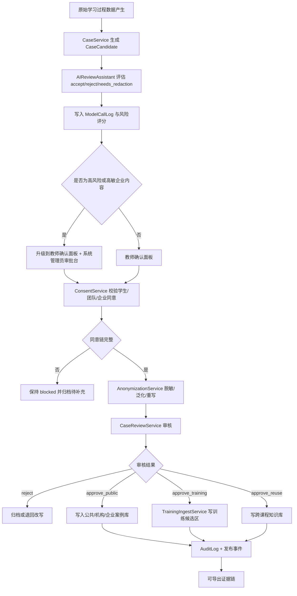

# 数据隐私、案例沉淀与社区终身学习规则

## Executive Summary

本章节用于替换或新增到 `docs/contracts/student-rbac-decision-refactor.md`，并与已上传的 SimWar 内部文档保持一致：继续遵守“核心仿真引擎唯一写真值、AI 小模型仅输出 advisory、Replay/Shadow Replay 为治理门禁、BFF 与服务端做作用域裁剪、关键对象追加写与强审计”的总原则，同时把原“默认不训练/不公开/不跨课程复用”的策略，改造为**高风险激活模式**：`policy_default.training_enabled = true`、`policy_default.public_reuse_enabled = true`、`policy_default.cross_course_reuse_enabled = true`。但为了尽量靠近 GDPR、FERPA、NIST、Jisc、UNESCO、EDPB 的要求，本章把这些默认值定义为**策略默认意图**，而不是“无需确认即可自动生效”的处理动作；任何真正进入训练集、公共社区或跨课程复用的行为，都必须经过显式同意、AI 辅助审查、教师或系统管理员人工确认，并形成可导出的证据链。未指定的本地法域细节，统一标注为“未指定，本方案采用 GDPR/Federal US best-practice 作为默认”。优先参考来源包括 GDPR Article 5/25、FERPA 学生记录披露规则、NIST SP 800-188 去标识化、NIST Privacy Framework、NIST AI RMF、Jisc 学习分析规范、UNESCO 教育中生成式 AI 指南与 AI 伦理建议、EDPB 假名化指南。 citeturn12view0turn12view1turn8view8turn8view7turn8view6turn8view5turn8view4turn13view1turn8view3turn8view1turn10view0turn9view0turn8view9

本章的关键设计，不是简单宣布“默认公开/默认训练”，而是把 SimWar 变成一个**双态治理系统**。第一态是 `policy_default`，用来表达课程或套餐在商业和教学运营层面的默认开放方向；第二态是 `effective_processing_status`，用来表达该数据是否已经满足合法性、同意链、人工确认、审计与脱敏要求而真正允许处理。只有当两态同时满足时，数据才可以进入 `public_case_library`、`cross_course_corpus` 或 `training_dataset_zone`。这样既满足用户提出的默认逻辑变更，又避免把学生原始决策、反思、AI 对话和队内讨论直接暴露给公共社区或训练管线。GDPR 要求处理遵循 purpose limitation、data minimisation 和 privacy by default；FERPA 只允许具有 legitimate educational interest 的人员访问教育记录中的可识别信息；Jisc 要求机构明示学习分析的目标、数据源、访问边界、保留责任和第三方处理规则；NIST 与 UNESCO 都要求 AI 风险可审计、可追踪并保留人类监督。因此，本章将“默认开放”解释为**默认进入候选工作流**，而不是默认无条件公开。 citeturn12view1turn12view2turn8view8turn8view6turn11view1turn8view1turn13view1turn8view3turn10view0

若某国或某机构政策禁止将学生学习过程数据设为默认公开或默认训练，则以更严格法律、校规、企业客户合同或 DPA 条款覆盖本章；系统必须支持按租户、课程、Run、Team、Role、套餐、部署模式、法域标签和企业定制条款降级到更严格模式。也就是说，本章定义的是一套**可配置但可审计的高开放度治理合同**，不是强行绕过合规的硬编码开关。NIST Privacy Framework 将“选择性收集/披露”“日志与审计”“利益相关者隐私偏好进入系统设计”列为系统能力；UNESCO 强调 AI 全生命周期都要保护隐私并保持人类最终责任；DOE 的 disclosure avoidance 指南也明确指出，公开或共享任何学生相关数据前，必须结合上下文评估再识别风险。 citeturn13view0turn13view1turn10view0turn11view0turn8view4

## 设计原则与适用范围

本章适用于 SimWar 的学员端、教师端、系统端、企业管理员后台、社区模块、案例沉淀模块、模型训练入库管线、存储分层、日志审计、AI 小模型访问控制与回放验证链路。其实现必须与内部文档 `docs/architecture/system-architecture.md`、`docs/architecture/database-design.md`、`docs/contracts/model-engineering-contract.md`、`docs/frontend/teacher-student-architecture.md`、`docs/product/non-functional-requirements.md`、`docs/devops/monitoring-alerting.md`、`docs/quality/replay-shadow-replay-test-plan.md`、`docs/architecture/event-driven-architecture.md`、`docs/product/feature-refinement.md`、`docs/frontend/frontend-state-flow.md` 对齐：一切训练、公开与复用都只能在**不破坏真值边界**的前提下进行，且不得让 AI 写正式成绩、正式参数、正式排名或 `state_true`。这与 NIST AI RMF 对训练数据隐私风险的提醒、NIST Privacy Framework 对审计/偏好/选择性披露的要求，以及 UNESCO 对人类监督与可追踪性的要求一致。 citeturn8view3turn13view1turn10view0

本章采用下列设计原则：

| 原则 | 规范性要求 | 合规依据 |
|---|---|---|
| 默认策略与生效策略分离 | `policy_default` 可设为训练/公开/跨课程复用开启，但 `effective_processing_status` 未满足同意与人工确认前必须保持 `blocked` | GDPR Article 25；Jisc transparency and consent |
| 训练、公开、复用三条链路分治 | 训练集入库、公共社区发布、跨课程复用必须分别确认，不能用单次勾选同时授权全部用途 | GDPR purpose limitation；FERPA disclosure control |
| 原始数据与衍生数据分层 | 原始草稿、反思、AI 对话、队内讨论与脱敏案例、训练切片、公共案例必须物理或逻辑隔离 | NIST SP 800-188；EDPB pseudonymisation |
| 人工最终责任 | AI 只能给出 accept / reject / needs_redaction 建议与风险评分，最终入库和公开必须人工确认 | UNESCO AI ethics；NIST AI RMF |
| 证据链完整 | 所有候选识别、审查、同意、撤回、脱敏、发布、训练入库、回滚必须写入 AuditLog 并可导出 | NIST Privacy Framework；UNESCO auditability |
| 更严格法域优先 | 若本地法律或客户合同更严格，则覆盖本章默认值 | GDPR/Federal US best-practice fallback |
| 最小必要读取 | 即使默认开放，也不得允许 AI 或非授权角色读取未授权 `state_true`、跨队私密反思或未发布策略 | FERPA legitimate educational interest；NIST disassociability |
| 可撤回与可复核 | 学生、教师、企业、系统管理员都必须有查看同意状态、撤回授权、争议申诉与复核通道 | FERPA amendment/review rights；Jisc responsibility/transparency |

上表中的“合规依据”并不意味着这些法规支持“默认公开”；相反，它们共同指向一个事实：如果业务一定要采用高开放默认值，就必须辅以更强的同意、人工确认、风控和审计机制。GDPR Article 5 明确要求个人数据只为具体、明确、合法的目的而处理，并且所处理的数据应限于必要范围；Article 25 要求系统默认不得让个人数据被不特定多数访问。FERPA 则要求学校只让具有 legitimate educational interest 的人员在必要范围内访问教育记录。Jisc 还强调，机构必须向学生讲清楚“哪些数据、为了什么、谁有权访问、边界在哪里”。因此，本章把“默认公开/默认训练/默认复用”重写为**默认进入审批链**。 citeturn12view1turn12view2turn8view8turn8view6turn11view1turn8view1

本章还采用一条额外的仓库级约束：**任何原始内容的公开与训练都不得直接发生在前端按钮点击之后，而必须由后端状态机驱动**。也就是说，前端只能表达授权意向与人工确认动作，真正的处理必须由 `ConsentService`、`CaseReviewService`、`TrainingIngestService` 和 `CaseService` 根据后端策略与审计条件推进。这样可以保证与 SimWar 现有的事件驱动、BFF 裁剪、追加写、Replay/Shadow Replay、强审计和服务端权限控制相兼容。Jisc 关于学习分析透明与第三方边界的要求，以及 FERPA 对技术性访问控制的要求，也支持这种服务端中心治理。 citeturn8view1turn11view1turn15view0

## 默认策略与强制人工确认

### 默认策略定义

本章节将“默认用于训练、默认公开、默认跨课程复用”定义为以下三个默认字段：

```text
policy_default.training_enabled = true
policy_default.public_reuse_enabled = true
policy_default.cross_course_reuse_enabled = true
```

但这三个字段只代表课程或租户的**策略默认值**，不代表已经满足合法性前提。为避免把高风险默认配置直接转化为违规处理动作，系统必须同时维护下列生效状态：

```text
effective_processing_status.training = blocked | pending_human_confirmation | approved | revoked
effective_processing_status.publication = blocked | pending_human_confirmation | approved | revoked
effective_processing_status.cross_course_reuse = blocked | pending_human_confirmation | approved | revoked
```

只有在 `effective_processing_status.* = approved` 时，相关数据才可以进入训练集、公共社区或跨课程知识库。NIST Privacy Framework 要求把隐私偏好、日志、选择性收集/披露纳入系统能力；UNESCO 要求最终人类责任不被 AI 替代；NIST AI RMF 则强调训练数据使用本身就是 AI 风险来源。因此，业务默认值不能替代治理默认值。 citeturn13view1turn10view0turn8view3

### 强制人工确认点

下列节点必须强制人工确认，任何自动化服务都不得绕过：

| 确认点 | 触发时机 | 必需确认人 | 不通过结果 | 审计要求 |
|---|---|---|---|---|
| 课程级默认策略激活 | 课程创建 / 数据策略修改 | 教师 + 系统管理员 | 保持 `blocked` | `CourseDataPolicyChanged` |
| 首次训练入库 | 首次向训练集写入某课程数据 | 教师或系统管理员 | 转入待审队列 | `TrainingIngestApproved/Rejected` |
| 首次公共发布 | 首次进入公共社区或公共案例库 | 教师 + 系统管理员 | 仅保留私有候选 | `CaseReviewApproved/Rejected` |
| 首次跨课程复用 | 同一案例或数据切片复用到其他课程 | 教师 | 课程内留存 | `CrossCourseReuseApproved/Rejected` |
| 企业课程外发 | 企业内容拟进入机构外范围 | 企业管理员 + 教师 + 系统管理员 | 仅企业内保留 | `EnterpriseExternalReleaseRejected` |
| AI 建议为 `accept` 且风险评分高 | AI 评估高风险但建议可用 | 人工复核双签 | 不得入库 | `AIReviewEscalated` |
| 同意撤回后继续保留 | 发生撤回但需依合规保留审计 | 系统管理员 | 停止公开/训练并转归档 | `ConsentWithdrawn`、`RetentionHoldApplied` |
| 脱敏规则变化后重发布 | 匿名化算法或模板升级 | 教师或系统管理员 | 下线旧条目 | `CaseRepublishRequired` |

DOE 的 disclosure avoidance 指南指出，发布学生相关数据前必须先评估具体情境下的可披露风险；EDPB 也说明假名化是重要措施但必须叠加额外控制；FERPA 允许 certain school officials 在必要范围内访问，但并不要求学校披露，也不鼓励把记录默认外发。因此，强制人工确认点不仅是产品流程，也是法律与信任风险缓冲区。 citeturn11view0turn8view9turn15view0

### 课程类型策略表

| 课程类型 | 默认训练候选 | 默认公开候选 | 默认跨课程复用候选 | 是否需要额外授权 | 是否可撤回 |
|---|---|---|---|---|---|
| 普通教学课程 | 是 | 是 | 是 | 是 | 是 |
| 商学院课程 | 是 | 是 | 是 | 是 | 是 |
| 公开竞赛 | 是 | 是 | 是 | 是，赛事规则 + 教师确认 | 是，结果公告后受赛事规则限制 |
| 企业内训定制课程 | 是 | 否，默认仅企业内候选 | 是，默认仅企业内跨班复用候选 | 是，企业 + 教师 + 学员 | 是 |
| 私有部署课程 | 是 | 否 | 是，默认仅私有环境内 | 是 | 是 |

上表的关键点在于：即使课程策略把训练、公开或跨课程复用都设成默认候选，企业内训和私有部署仍然必须优先遵循企业合同与部署边界；系统应把“默认公开”和“默认可进入公共社区”拆开，企业内训默认只能进入企业工作台候选池，私有部署则默认只能在私有环境中做训练或复用候选。Jisc 要求对外部共享与第三方处理作清晰说明；FERPA 对外包方访问教育记录设置了“direct control”和用途边界；GDPR 则要求控制者能证明处理符合其目的和必要性。 citeturn8view1turn15view0turn12view3

### 套餐与权益映射表

| 套餐 / 权益 | 可开启训练候选默认值 | 可开启公开候选默认值 | 可开启跨课程复用默认值 | 自动获得的只是“功能可用”还是“处理已批准” | 是否仍需显式同意与审计 |
|---|---|---|---|---|---|
| 基础教学版 | 可 | 可 | 可 | 仅功能可用 | 是 |
| 专业教学版 | 可 | 可 | 可 | 仅功能可用 | 是 |
| 商学院机构版 | 可 | 可 | 可 | 仅功能可用 | 是 |
| 企业内训版 | 可 | 默认仅企业内可 | 默认仅企业内可 | 仅功能可用 | 是 |
| 企业高保密版 / 私有部署 | 可，限私有环境 | 否 | 可，限私有环境 | 仅功能可用 | 是 |
| 公开竞赛版 | 可 | 可，依赛事配置 | 可，依赛事配置 | 仅功能可用 | 是 |

任何套餐都**不得默认获得“无需学生/教师/企业显式同意即可公开或训练”的权利**。套餐只决定你是否拥有某条产品能力链，如私有案例库、企业审批台、公共社区精选发布、训练入库工作流、企业知识库隔离、跨课程复用管理台，而不决定是否可以跳过合法性与审计。Jisc 的学生调研显示，学生对 AI 应用如何使用、存储和再利用其材料存在明显不安，尤其担心自己的作品被模型保存并复用于他人场景；NIST AI RMF 也把训练数据导致的隐私风险列为核心问题。因此，把“付费能力”和“合法处理许可”拆开，是本章最重要的商业与合规分离规则之一。 citeturn14view0turn14view2turn8view3

## 权限矩阵、同意与撤回

### 角色权限矩阵

| 主体 | 查看原始学习过程数据 | 发起训练候选 | 批准训练入库 | 发起公共发布 | 批准公共发布 | 批准跨课程复用 | 撤回同意 | 导出证据链 |
|---|---|---|---|---|---|---|---|---|
| 学生 | 本人相关 | 可发起本人授权 | 否 | 可发起本人授权 | 否 | 可发起本人授权 | 是 | 可导出本人记录 |
| 教师 | 课程授权范围内 | 是 | 是 | 是 | 是 | 是 | 否，但可触发停用流程 | 可导出课程证据链 |
| 系统管理员 | 审批与审计范围内 | 是 | 是 | 是 | 是 | 是 | 可执行系统级停用与撤回落实 | 是 |
| 企业管理员 | 企业租户授权范围内 | 是，限企业内容 | 否，除非合同赋权 | 是，限企业范围 | 是，限企业范围 | 是，限企业范围 | 否，但可要求冻结 | 可导出租户级证据链 |
| AIReviewAssistant | 否，仅裁剪读取 | 是，生成建议 | 否 | 是，生成建议 | 否 | 是，生成建议 | 否 | 否 |

FERPA 的核心并不是“教师可以看一切”，而是“学校必须用合理方法确保只有具有 legitimate educational interest 的 school official 访问相应记录”；对于外包方，还要求其处于学校的直接控制之下，只能为披露所指向的功能使用数据。Jisc 也强调要向学生解释谁有访问权、边界是什么、第三方如何处理。基于这些原则，本章对教师、系统管理员、企业管理员和 AIReviewAssistant 施加了不同层级的“可见而不等于可批准、可发起而不等于可生效”的约束。 citeturn8view6turn11view1turn15view0turn8view1

### 同意与撤回机制

同意必须至少拆成五类，而不得合并为一个总开关：`training_consent`、`public_case_consent`、`cross_course_reuse_consent`、`teacher_private_access_consent`、`enterprise_internal_reuse_consent`。所有同意对象均要求记录 `granted_at`、`expires_at`、`revoked_at`、`policy_version`、`purpose_scope`、`source_scope`、`human_confirmation_ref` 和 `notice_snapshot_ref`。其中 `notice_snapshot_ref` 指向学生当时看到的政策说明快照，保证审计时能复原“他/她到底同意了什么”。GDPR Article 5 与 25 要求目的明确、最小必要和可证明的控制措施；FERPA 则要求学校就披露与访问规则提供年度通知，并赋予 eligible student 对教育记录相关事项的查看与更正权利。 citeturn12view1turn8view8turn15view0

撤回机制必须区分三类处理结果。第一类是**未来性停止**：停止后续训练、停止后续公开、停止未来跨课程复用。第二类是**现实性下线**：对尚未进入不可逆流程的公共内容、案例候选、训练候选立即撤销或下线。第三类是**审计性保留**：对已经依法或依合同必须保留的操作记录，不做物理删除，而是转入 `archived_restricted` 状态，并禁止继续被训练或公开使用。GDPR 的 storage limitation 和 accountability，NIST 的按策略销毁与日志治理，FERPA 的 amendment/review rights，都支持这种“停止使用 ≠ 删除审计”的双轨模型。 citeturn12view3turn13view1turn15view0

### 社区可见性矩阵

下表按用户要求，将默认值改造为“默认允许训练/公开/跨课程复用的候选模式”，但每一行都明确列出**授权与人工确认步骤**。换言之，表中的“可”表示“默认允许进入候选与审批链”，不表示“无需确认即自动对外可见或自动进入训练集”。

| 内容类型 | 本人 | 本队 | 本课程 | 本机构 | 企业内部 | 公共社区 | 是否允许训练模型 | 授权与人工确认步骤 |
|---|---|---|---|---|---|---|---|---|
| 个人反思原文 | 可 | 可，课程策略允许时 | 可，课程策略允许时 | 可，机构策略允许时 | 可，企业策略允许时 | 可，默认候选 | 可，默认候选 | 学生同意 + 教师确认 + 系统管理员确认；高风险需脱敏 |
| 角色草稿 | 可 | 可 | 可 | 可 | 可 | 可，默认候选 | 可，默认候选 | 学生同意 + 教师确认；公共发布需系统管理员确认 |
| 团队内部讨论 | 可 | 可 | 可 | 可 | 可 | 可，默认候选 | 可，默认候选 | 团队多数授权 + 教师确认；敏感讨论需脱敏 |
| AI 建议记录 | 可 | 可 | 可 | 可 | 可 | 可，默认候选 | 可，默认候选 | 学生/队伍同意 + 教师确认；需保留 advisory_only 标识 |
| 团队正式决策 | 可 | 可 | 可 | 可 | 可 | 可，默认候选 | 可，默认候选 | 教师确认；企业课程需企业确认 |
| 教师点评 | 可 | 可 | 可 | 可 | 可 | 可，默认候选 | 可，默认候选 | 教师主动发布 + 系统确认 |
| 脱敏优秀案例 | 可 | 可 | 可 | 可 | 可 | 可 | 可 | 脱敏完成 + 审核通过 |
| 脱敏失败复盘 | 可 | 可 | 可 | 可 | 可 | 可 | 可 | 脱敏完成 + 审核通过 + 风险分级通过 |
| 角色方法论总结 | 可 | 可 | 可 | 可 | 可 | 可 | 可 | 教师确认；若含个人内容需学生授权 |
| 行业通用案例 | 可 | 可 | 可 | 可 | 可 | 可 | 可 | 场景设计师/教师确认 |
| 企业内训案例 | 可 | 可 | 可，企业策略允许时 | 否，除非企业与机构协议允许 | 可 | 否，默认不出企业边界 | 可，默认企业内候选 | 企业管理员 + 教师 + 系统管理员三方确认 |

上表是本章最激进、也最需要治理刹车的部分。之所以仍然保留“默认候选可进入训练/公开/跨课程复用”，是为了满足用户提出的方向调整；但为了不把平台变成无审查的数据外流器，所有候选对象都必须先经过同意链和人工确认链。DOE 的 disclosure avoidance 指南强调，小群体、罕见情境和公开上下文可能造成再识别；EDPB 也指出假名化并不能自动消除风险。因此，在工程上，任何显示为“可”的对象都必须拥有 `risk_level` 与 `requires_redaction` 标志，且默认 UI 上用“候选开放”而不是“已开放”来表达状态。 citeturn11view0turn8view9turn8view4

## 数据流、AI 辅助审查与人工确认

本章要求在原有角色化学习闭环上，新增一条**候选识别—AI 审查建议—人工确认—脱敏—发布/训练/复用—归档**的数据流。该流必须是后端驱动、事件驱动、可回放且带审计链的；前端只负责触发、展示与确认，不得绕过服务层直接写训练集或公共案例库。NIST AI RMF 强调组织需要建立适当的 accountability mechanisms 和 senior-level commitment；UNESCO 同样强调 AI 的最终责任不能由系统替代人类承担。 citeturn8view3turn10view0



AIReviewAssistant 必须支持三类输出：`accept`、`reject`、`needs_redaction`，并且必须附带 `risk_score`、`confidence_score`、`rationale_summary`、`sensitive_entities[]`、`cross_team_leakage_risk`、`enterprise_sensitivity_risk`、`reidentification_risk`。这些输出写入 `ModelCallLog`，但绝不直接触发训练集写入或公共发布。NIST SP 800-188 明确指出，去标识化前应明确共享目标和风险，并在开放、查询接口、受保护环境等不同共享模型间作出选择；UNESCO 则要求 AI 可审计、可追踪、并保留人工最终判断。 citeturn8view4turn10view0

AI 小模型的权限边界必须硬编码为如下规则：

```text
- 不得直接写入 training_dataset_zone。
- 不得直接写入 public_case_library。
- 不得读取未授权 state_true。
- 不得跨队读取私密反思、未发布策略、企业敏感参数。
- 不得在未获得有效 consent_scope 前输出 “approved” 状态。
- 不得覆盖教师或系统管理员的最终判定。
- 不得绕过 AnonymizationService 直接对外输出原始内容。
- 不得把检索到的私密原文当作面向其他课程或其他租户的建议语料。
```

这些限制不仅是内部架构需求，也与 FERPA legitimate educational interest、Jisc 第三方数据处理透明性、NIST Privacy Framework 的选择性披露、UNESCO 伦理建议中的 human oversight、以及 NIST AI RMF 对训练数据隐私风险的警示一致。 citeturn8view6turn8view1turn13view1turn10view0turn8view3

### 服务与 UI 流

| 服务 / 页面 | 主要职责 | 输入 | 输出 | 关键权限 |
|---|---|---|---|---|
| `CaseService` | 识别案例候选、管理状态机 | 原始学习对象、策略配置 | `CaseCandidate` | 系统/教师 |
| `AIReviewAssistant` | 生成 accept/reject/needs_redaction 建议 | 裁剪后的候选内容 | 风险评分与建议 | 仅服务账号 |
| `AnonymizationService` | 脱敏、泛化、重写、实体遮蔽 | `CaseCandidate` | `anonymized_ref` | 系统/管理员 |
| `ConsentService` | 管理同意、撤回、到期 | 学生/团队/企业授权动作 | `CaseConsent` | 学生/教师/企业 |
| `CaseReviewService` | 人工确认与审核 | 候选、同意、脱敏结果 | 审核结论 | 教师/系统管理员 |
| `TrainingIngestService` | 训练候选入库、分区、快照化 | 已审核通过内容 | `training_ingest_job` | 系统管理员/教师 |
| 教师确认面板 | 查看候选、AI建议、风险与同意链 | 候选列表 | approve/reject/escalate | 教师 |
| 学生授权弹窗 | 同意/撤回训练、公开、复用 | 政策快照 | consent artifact | 学生 |
| 企业审批台 | 审核企业课程外发与训练 | 企业候选 | allow/deny/internal_only | 企业管理员 |
| 模型入库建议面板 | 展示 AI 建议、去标识化预览、训练分区写入计划 | 审核通过候选 | 最终确认 | 系统管理员 |

前端必须围绕 `teacher-confirm-panel`, `student-consent-modal`, `enterprise-approval-workbench`, `training-ingest-suggestion-panel` 四条 UI 流设计，并通过 BFF 只下发当前操作者有权看到的摘要、风险评分和证据引用，而不是全量原文。Jisc 要求向学生清楚说明谁能访问哪些数据以及算法如何使用；FERPA 对技术控制与外包访问控制有明确要求；NIST manageability 也强调系统必须有足够粒度来实现偏好管理和用途控制。 citeturn8view1turn11view1turn13view3

## 数据模型、API 与事件契约

### 数据对象与默认值

| 数据对象 | 说明 | 关键字段 | 默认值 / 约束 |
|---|---|---|---|
| `CaseCandidate` | 系统识别的候选案例 | `case_candidate_id`, `source_type`, `source_id`, `tenant_id`, `course_id`, `run_id`, `team_id`, `role_id`, `candidate_type`, `risk_level`, `ai_recommendation`, `effective_processing_status` | `risk_level='medium'`, `effective_processing_status='blocked'` |
| `CaseConsent` | 同意与撤回记录 | `consent_id`, `subject_user_id`, `team_id`, `tenant_id`, `consent_scope`, `granted_at`, `expires_at`, `revoked_at`, `notice_snapshot_ref`, `policy_version` | `revoked_at=null` |
| `CaseAnonymizationLog` | 脱敏日志 | `anonymization_log_id`, `original_ref`, `anonymized_ref`, `method`, `reviewer_id`, `reidentification_risk`, `version` | `method='hybrid_redaction'` |
| `CaseReview` | 人工审核记录 | `case_review_id`, `case_candidate_id`, `reviewer_id`, `status`, `reason`, `decision_scope`, `approved_targets[]` | `status='pending'` |
| `CaseLibraryItem` | 正式案例库条目 | `case_item_id`, `visibility_scope`, `case_type`, `tags`, `source_refs`, `anonymized_body_ref`, `published_at`, `status` | `status='draft'` |
| `CourseDataPolicy` | 课程数据策略 | `course_data_policy_id`, `training_enabled_default`, `public_enabled_default`, `cross_course_reuse_default`, `effective_mode`, `requires_human_confirmation`, `enterprise_override_flag` | 默认三项均 `true`，`effective_mode='candidate_only'` |
| `EnterpriseDataPolicy` | 企业租户策略 | `enterprise_data_policy_id`, `tenant_id`, `no_upload`, `private_case_library`, `private_community`, `external_release_requires_enterprise_approval`, `retention_policy` | `external_release_requires_enterprise_approval=true` |
| `TrainingIngestJob` | 训练入库任务 | `training_ingest_job_id`, `source_case_ids[]`, `dataset_partition`, `approved_by`, `status`, `snapshot_ref`, `license_record_id` | `status='pending'` |
| `TrainingDatasetItem` | 训练集切片 | `training_dataset_item_id`, `training_ingest_job_id`, `content_ref`, `tenant_scope`, `course_scope`, `reuse_scope`, `expires_at` | 仅通过 job 写入 |
| `ConsentWithdrawalRequest` | 撤回请求 | `withdrawal_request_id`, `consent_id`, `requested_by`, `reason`, `status`, `resolved_at` | `status='pending'` |

其中最关键的默认值是：`CourseDataPolicy.training_enabled_default = true`、`public_enabled_default = true`、`cross_course_reuse_default = true`，但 `effective_mode` 必须默认是 `candidate_only`，而不是 `approved_live`。这就是本章将“默认开放”与“实际生效”分离的核心工程实现。GDPR Article 25 要求默认只处理为特定目的所必需的数据并限制其可访问性；NIST Privacy Framework 要求通过技术手段支持 selective collection or disclosure；UNESCO 要求保留人类最终责任。 citeturn8view8turn13view0turn10view0

### 示例 SQL DDL

```sql
create table course_data_policy (
  course_data_policy_id uuid primary key,
  tenant_id uuid not null,
  course_id uuid not null,
  training_enabled_default boolean not null default true,
  public_enabled_default boolean not null default true,
  cross_course_reuse_default boolean not null default true,
  effective_mode varchar(32) not null default 'candidate_only',
  requires_human_confirmation boolean not null default true,
  enterprise_override_flag boolean not null default false,
  policy_version varchar(32) not null,
  created_at timestamptz not null default now(),
  updated_at timestamptz not null default now()
);

create table case_candidate (
  case_candidate_id uuid primary key,
  tenant_id uuid not null,
  course_id uuid not null,
  run_id uuid,
  round_id uuid,
  team_id uuid,
  role_id varchar(64),
  source_type varchar(64) not null,
  source_id uuid not null,
  candidate_type varchar(64) not null,
  risk_level varchar(32) not null default 'medium',
  ai_recommendation varchar(32),
  risk_score numeric(5,4),
  confidence_score numeric(5,4),
  requires_redaction boolean not null default true,
  effective_processing_status varchar(32) not null default 'blocked',
  created_at timestamptz not null default now()
);

create table case_consent (
  consent_id uuid primary key,
  tenant_id uuid not null,
  course_id uuid not null,
  subject_user_id uuid not null,
  team_id uuid,
  consent_scope varchar(64) not null,
  granted_at timestamptz,
  expires_at timestamptz,
  revoked_at timestamptz,
  notice_snapshot_ref text not null,
  policy_version varchar(32) not null,
  human_confirmation_ref uuid,
  created_at timestamptz not null default now()
);

create table case_review (
  case_review_id uuid primary key,
  case_candidate_id uuid not null references case_candidate(case_candidate_id),
  reviewer_id uuid not null,
  status varchar(32) not null default 'pending',
  reason text,
  approved_targets jsonb,
  created_at timestamptz not null default now()
);

create table training_ingest_job (
  training_ingest_job_id uuid primary key,
  tenant_id uuid not null,
  dataset_partition varchar(128) not null,
  source_case_ids jsonb not null,
  approved_by uuid not null,
  status varchar(32) not null default 'pending',
  snapshot_ref text,
  license_record_id uuid,
  created_at timestamptz not null default now()
);
```

上述 DDL 只展示关键骨架。正式实现时，还应补齐 `AuditLog`、`ModelCallLog`、`CaseAnonymizationLog`、`CaseLibraryItem`、`ConsentWithdrawalRequest`、`EnterpriseDataPolicy` 的索引、分区键、唯一约束和外键。特别是 `ModelCallLog` 必须记录 `task_type='case_review' | 'training_ingest_advice' | 'public_release_advice'`、`advisory_only=true`、`truth_write_attempted=false`、`visibility_scope` 和 `request_id`，以对齐 SimWar 既有 AI 合约边界。NIST Privacy Framework 将日志与偏好纳入系统能力，UNESCO 强调可审计和追踪，NIST AI RMF 也强调需要制度化 accountability。 citeturn13view1turn10view0turn8view3

### API 端点与示例

```http
GET    /api/v1/courses/{course_id}/data-policy
PUT    /api/v1/courses/{course_id}/data-policy
POST   /api/v1/case-candidates/identify
GET    /api/v1/case-candidates/{case_candidate_id}
POST   /api/v1/case-candidates/{case_candidate_id}/ai-review
POST   /api/v1/case-candidates/{case_candidate_id}/consents
POST   /api/v1/case-candidates/{case_candidate_id}/withdraw-consent
POST   /api/v1/case-candidates/{case_candidate_id}/anonymize
POST   /api/v1/case-candidates/{case_candidate_id}/review
POST   /api/v1/case-candidates/{case_candidate_id}/publish
POST   /api/v1/case-candidates/{case_candidate_id}/ingest-training
POST   /api/v1/case-candidates/{case_candidate_id}/reuse-cross-course
GET    /api/v1/training-ingest-jobs/{training_ingest_job_id}
GET    /api/v1/audit/evidence-chain/{entity_type}/{entity_id}
```

请求示例：

```json
POST /api/v1/case-candidates/{case_candidate_id}/review
{
  "decision": "approve_training",
  "approved_targets": ["training_dataset_zone", "course_case_library"],
  "requires_additional_redaction": true,
  "review_note": "允许入训练候选区，但先执行二次脱敏与企业边界检查",
  "human_confirmation_token": "<SIGNED_CONFIRM_TOKEN>"
}
```

响应示例：

```json
{
  "case_review_id": "b0e2f95a-7fbb-4f07-b2ef-3ff0f8f6a9a7",
  "case_candidate_id": "9b4f0b58-3dc8-45fe-b475-2a284a29f685",
  "status": "approved_pending_redaction",
  "next_actions": [
    "anonymization_required",
    "consent_chain_recheck",
    "training_ingest_job_create"
  ],
  "audit_ref": "AUD-2026-05-16-000913"
}
```

同意端点示例：

```json
POST /api/v1/case-candidates/{case_candidate_id}/consents
{
  "subject_user_id": "<USER_ID>",
  "consent_scopes": [
    "training_consent",
    "public_case_consent",
    "cross_course_reuse_consent"
  ],
  "notice_snapshot_version": "policy-v3.2",
  "acknowledge_default_open_policy": true
}
```

这些 API 必须由 BFF 对外暴露“意图”和“状态”，而不能让前端直接写训练集或公共库。FERPA 对受控外包访问、Jisc 对第三方处理与算法透明度、NIST 对日志和选择性披露的要求，都支持这种服务化、状态机化的 API 方式。 citeturn15view0turn8view1turn13view1

### 事件与审计事件名

| 事件名 | 生产者 | 消费者 | 必须审计 |
|---|---|---|---|
| `CaseCandidateIdentified` | CaseService | Review/BFF/Monitoring | 是 |
| `CaseAIReviewSuggested` | AIReviewAssistant | Teacher Panel / Audit | 是 |
| `CaseConsentGranted` | ConsentService | Review / TrainingIngest | 是 |
| `CaseConsentWithdrawn` | ConsentService | Publication / TrainingIngest / Archive | 是 |
| `CaseAnonymizationCompleted` | AnonymizationService | Review / Publish | 是 |
| `CaseReviewApproved` | CaseReviewService | Publish / Ingest / Reuse | 是 |
| `CaseReviewRejected` | CaseReviewService | Archive / Notification | 是 |
| `CaseLibraryPublished` | CaseService | Community / Search | 是 |
| `TrainingIngestRequested` | TrainingIngestService | Governance / Audit | 是 |
| `TrainingIngestApproved` | Governance Service | Training Pipeline | 是 |
| `TrainingDatasetMaterialized` | TrainingIngestService | Monitoring / Audit | 是 |
| `CrossCourseReuseApproved` | CaseReviewService | Knowledge Base | 是 |
| `UnauthorizedAccessAttempted` | Auth/BFF/Gateway | Monitoring / Security | 是 |
| `StateTrueAccessBlocked` | AI/BFF/Policy Engine | Security / Audit | 是 |
| `PublicReleaseRolledBack` | CaseService | Community / Audit | 是 |

这些事件名应直接补入内部事件驱动架构文档，并纳入 Replay 与 Shadow 观察链。因为本章引入了更高风险的数据开放默认值，事件账本必须足够细，才能在争议、撤回、误发布或训练数据污染时进行追溯。DOE、NIST 和 UNESCO 都强调：没有可验证的审计链，所谓“人工确认”就不能真正被证明发生过。 citeturn11view0turn13view1turn10view0

## 迁移、测试、监控与风险治理

### 存储分层、加密与保留策略

SimWar 应将相关数据划分为六个层级区：

| 存储层 | 内容 | 访问控制 | 加密策略 | 默认保留 |
|---|---|---|---|---|
| `raw_zone` | 原始决策草稿、反思原文、队内讨论、AI 对话 | 仅本人、课程教师授权、系统服务 | KMS 包信封加密 + 行级/对象级 ACL | 课程期 + 合规窗口 |
| `candidate_zone` | `CaseCandidate` 与 AI 审查建议 | 教师、系统管理员、企业管理员受限可见 | KMS + 审计强制 | 12 个月 |
| `anonymized_zone` | 已脱敏案例与重写文本 | 审核服务、发布服务 | KMS + 版本化 | 24 个月 |
| `training_dataset_zone` | 训练切片、数据快照、快照引用 | 系统管理员、训练服务 | 独立密钥域 + 只读快照 | 依模型生命周期 |
| `public_case_library` | 已发布结构化案例 | 社区可见策略控制 | 公开层不含密钥材料 | 持续，直至撤回/归档 |
| `archive_zone` | 已撤回、已停用、审计保留内容 | 合规与系统管理员 | 冷存储加密 | 按合同与法域 |

GDPR storage limitation、NIST 的 data destruction according to policy、Jisc 的 retention and stewardship、以及 DOE 对披露规避与重识别风险的提醒，都说明：高开放策略不能没有更细的分层存储。特别是 `training_dataset_zone` 必须与 `public_case_library` 分离，不能用公共发布状态推断训练集写入状态，也不能由社区服务直接查询训练切片。 citeturn12view3turn13view1turn8view1turn11view0

### 迁移与回滚策略

| 阶段 | 动作 | 风险控制 | 回滚点 |
|---|---|---|---|
| Schema 扩展 | 新增表、枚举、索引、对象存储路径 | 只加不切旧流 | 回滚 migration |
| 双写阶段 | 现有私密链继续运行，同时写 `CaseCandidate`、`CourseDataPolicy` 等新表 | `effective_mode='candidate_only'`，禁止真正公开/训练 | 关闭新写入 Feature Flag |
| Shadow 审查阶段 | AIReviewAssistant 只给建议，不触发生产入库 | 对比人工判断与 AI 建议差异 | 停用 AIReviewAssistant |
| Shadow 发布阶段 | 生成候选发布与候选训练任务，但不执行真实外发 | Replay/Shadow 验证行为与审计完整性 | 清空候选队列 |
| 有限灰度 | 白名单课程启用真实确认流 | 每租户可独立停用 | 切回 `effective_mode='legacy_private'` |
| 全量启用 | 默认候选流程上线 | 监控、审计、告警全开 | 全租户强制降级脚本 |

由于 SimWar 内部架构已经把 Replay / Shadow Replay 作为治理门禁，本章要求对“训练入库事件”“公共发布时间线”“撤回后停用时间”做回放验证：同一输入在 Shadow 模式下必须产生同样的候选、同样的审查建议、同样的审计写入数量和同样的拦截结果。任何发现“在无有效 consent 的情况下进入训练集”“在无教师确认的情况下进入公共库”“AI 建议绕过人工确认”的情形，都必须阻断上线。 citeturn8view3turn13view1turn10view0

### 测试矩阵

| 类别 | 核心用例 | 通过标准 |
|---|---|---|
| 功能 | 候选识别、同意记录、撤回、脱敏、审核、发布、训练入库 | 端到端状态机闭环通过 |
| 安全 | 未授权读取 `state_true`、跨队私密反思读取、跨租户访问 | 0 个越权成功 |
| 合规 | 无 consent 尝试训练、无双签尝试公共发布 | 0 个未经批准处理 |
| 隐私风险 | 再识别风险评分过高的内容是否被阻断 | 100% 阻断 |
| AI 审查 | accept/reject/needs_redaction 输出、日志落地、人工覆盖 | 100% 记录 ModelCallLog |
| 性能 | 候选识别、审查面板、训练入库队列 | P95 在 SLA 内 |
| Replay/Shadow | 同输入同策略同样产生审计与阻断结果 | 差异为 0 或在阈值内 |
| 回滚 | `effective_mode='legacy_private'` 后所有开放链停用 | 5 分钟内停用完成 |
| UI/BFF | 学生授权弹窗、教师确认面板、企业审批台、BFF 裁剪 | 无越权字段渲染 |
| 数据保留 | 到期归档、撤回停用、审计保留 | 生命周期作业 100% 通过 |

Jisc 要求学习分析部署必须考虑法律、伦理和流程责任；NIST 与 UNESCO 都强调 AI 风险与数据处理要落实到治理机制与可验证测试；DOE 则提醒公开或共享的风险来自上下文而不是单个字段本身。因此，本章的测试必须把“合规”和“隐私风险”视为一等功能，而不是上线后补做。 citeturn8view1turn8view3turn10view0turn11view0

### 监控与告警指标

| 指标 | 说明 | 阈值 | 告警级别 |
|---|---|---|---|
| `case_candidate_identified_total` | 候选识别总量 | 异常波动 > 3σ | Warning |
| `ai_review_reject_rate` | AI 建议拒绝率 | > 60% 连续 3 天 | Warning |
| `ai_review_needs_redaction_rate` | AI 建议需脱敏占比 | > 40% 连续 3 天 | Warning |
| `manual_override_rate` | 人工推翻 AI 建议比例 | > 25% 连续 7 天 | High |
| `training_ingest_without_active_consent_total` | 无有效同意的训练尝试 | > 0 | Critical |
| `public_publish_without_human_confirmation_total` | 无人工确认的公共发布 | > 0 | Critical |
| `unauthorized_access_attempt_total` | 越权访问尝试 | > 10/租户/小时 | High |
| `state_true_access_blocked_total` | 被拦截的真值访问请求 | > 0 需复核 | High |
| `consent_withdrawal_pending_over_48h_total` | 撤回请求 48h 未完成 | > 0 | High |
| `training_dataset_materialized_total` | 训练集生成事件数 | 异常增长 > 2x 周均值 | Warning |
| `reidentification_risk_high_total` | 高重识别风险候选数量 | > 0 进入双签 | High |
| `enterprise_external_release_attempt_total` | 企业内容外发尝试 | > 0 必须复核 | High |

这些指标应接入 `docs/devops/monitoring-alerting.md` 的系统告警体系，并采用按租户、课程、企业类型、部署模式分桶监控。特别是 `training_ingest_without_active_consent_total` 和 `public_publish_without_human_confirmation_total` 采用**零容忍**阈值，因为一旦发生，就说明本章核心治理门槛被绕过。NIST Privacy Framework 的日志治理、NIST AI RMF 的风险管理、UNESCO 的 auditability 原则都要求系统不仅能记录，还要能及时发现和阻断。 citeturn13view1turn8view3turn10view0

### 风险与缓解

| 风险 | 描述 | 缓解措施 | 量化门槛 |
|---|---|---|---|
| 隐私泄露 | 原始反思或草稿误入公共社区 | 双态模型 + 双签发布 + 回滚下线 | 公共误发布 = 0 |
| 重识别 | 即使脱敏仍可通过情境识别团队/个人 | 风险评分、二次泛化、企业特征剥离 | `reidentification_risk > 0.20` 不得发布 |
| 滥用训练数据 | 无效授权内容进入训练集 | Consent 校验 + ingest 前二次审查 | 无同意入库 = 0 |
| 企业合规冲突 | 企业课程被误公开或跨租户复用 | `EnterpriseDataPolicy` 强覆盖 + 三方确认 | 企业外发绕过 = 0 |
| 学生信任下降 | 默认开放带来感知风险 | UI 明示、可撤回、可导出证据链、可申诉 | 撤回 SLA ≤ 48h |
| 模型偏差放大 | 默认训练导致同质化、偏差扩散 | Dataset 审查、分层采样、偏差监测 | 月度 bias review 必做 |
| 竞赛泄题 | 进行中竞赛内容进入公共库或跨课程库 | 竞赛未结束前强制 `blocked` | 赛中泄露 = 0 |
| 法律责任 | 本地法域不允许默认公开/训练 | 法域标签 + stricter override | 未配置法域的课程不得进入 `approved_live` |
| AI 审查误判 | AI 错把高敏内容标成 accept | 人工必审 + 高风险升级双签 | 高风险 accept 必须双签 |
| 审计不完整 | 发生处理但证据链缺失 | 事件账本 + AuditLog + 导出校验 | 审计缺口率 < 0.1% |

上表中的量化门槛应直接进入 `docs/product/non-functional-requirements.md` 与 `docs/devops/monitoring-alerting.md`。其中“公共误发布 = 0”“无同意入库 = 0”“企业外发绕过 = 0”“赛中泄露 = 0”属于硬阻断指标，不允许通过灰度或异常审批绕过。DOE、NIST、UNESCO 和 Jisc 的共同点不在于给出同一个数值，而在于都强调：风险不能停留在口头承诺，必须被技术化、度量化、可回溯化。 citeturn11view0turn13view1turn10view0turn8view1

## 仓库同步更新与落地清单

本章落地时，应同步更新下列仓库文档，并保持术语一致：

| 文档 | 关键变更要点 |
|---|---|
| `docs/product/non-functional-requirements.md` | 新增双态默认值、人工确认门槛、审计与导出要求、零容忍指标 |
| `FUNCTIONAL_SPECIFICATION.md` | 新增候选识别、AI 审查建议、同意/撤回、企业审批、训练入库、公共发布功能说明 |
| `docs/architecture/database-design.md` | 新增本章表结构、默认值、分层存储、索引、分区、审计字段、`license_record_id`/`notice_snapshot_ref` |
| `docs/contracts/api-contract.md` | 新增数据策略 API、候选/同意/撤回/审查/训练入库/发布接口与错误码 |
| `COMMUNITY_MODULE.md` | 新增默认候选开放逻辑、公共发布双签、竞赛期间阻断规则、回滚下线规则 |
| `PRICING_AND_ENTITLEMENTS.md` | 明确套餐只影响能力可用，不等于免同意、免审核；企业与私有部署特殊覆盖 |
| `AGENTS.md` | 新增 AIReviewAssistant、系统提示词硬边界、检索边界、禁止自动写训练集/公共库 |
| `docs/devops/monitoring-alerting.md` | 新增训练入库、公共发布、撤回 SLA、越权访问、AI 审查覆盖率指标 |
| `docs/quality/replay-shadow-replay-test-plan.md` | 新增候选、公开、训练入库链路的 Shadow 验证与回滚用例 |
| `docs/contracts/student-rbac-decision-refactor.md` | 替换原章节，接入本章完整规范 |

最后，需要在仓库中明确写入以下硬性规则，并作为代码评审、灰度发布与合规检查单的一部分：

```text
本章将“默认用于训练/默认公开/默认跨课程复用”解释为默认进入候选与审批链，而非自动对外生效。
任何内容真正进入训练集、公共社区或跨课程知识库之前，必须满足有效同意、人工确认、审计落地与必要脱敏。
AIReviewAssistant 只提供建议，不能直接写训练集、不能直接公开发布、不能读取未授权 state_true、不能跨队读取私密反思。
企业内训与私有部署可保留高开放默认值的策略开关，但默认只在企业或私有环境内形成候选，不得自动外发。
所有撤回、停用、回滚、例外审批都必须可导出证据链。
未指定的本地合规细节，一律采用 GDPR/Federal US best-practice 作为默认，并允许更严格法域覆盖。
```

这组规则是本章最重要的“补充材料”。它们把用户要求的高开放默认值转译为一种在 SimWar 架构中仍可被治理、可被审计、可被回滚、可被 Shadow 验证的系统行为，而不是简单把学生学习过程数据默认裸露给训练和公共传播通道。只要后续 Codex 重构严格按本章实现，SimWar 就能在不破坏既有真值边界、事件架构、BFF 裁剪、Replay/Shadow Replay 和强审计链的前提下，支持这一更激进的数据开放模式。 citeturn12view1turn8view6turn13view1turn8view3turn10view0

