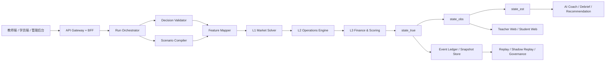
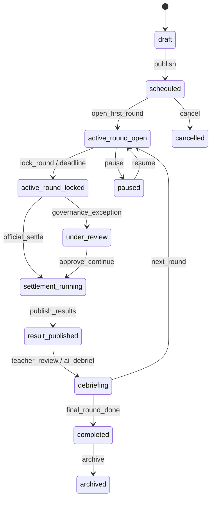
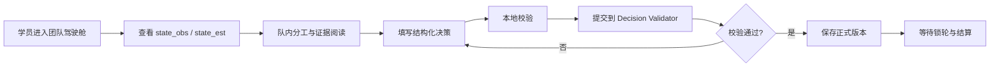
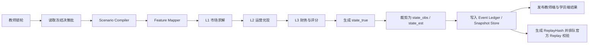

# docs/product/feature-refinement.md

| 项目         | 内容                                                                                                                                                                                     |
| ------------ | ---------------------------------------------------------------------------------------------------------------------------------------------------------------------------------------- |
| 文件名       | `docs/product/feature-refinement.md`                                                                                                                                                     |
| 项目名称     | SimWar                                                                                                                                                                                   |
| 项目类型     | SaaS 平台 / AI 仿真平台 / 企业高管培训与商战模拟系统                                                                                                                                     |
| 核心业务场景 | 教师开课、学员组队、多轮决策、回合结算、AI 复盘、Replay、行业插件、社区学习、竞赛训练                                                                                                    |
| 目标读者     | 产品、前端、后端、算法、AI、测试、运维、教研、治理团队                                                                                                                                   |
| 文档定位     | 在现有 Requirements、docs/architecture/system-architecture.md、核心引擎、小模型、教师端/学员端、行业插件资料基础上，统一沉淀整体建构与功能深化定义，作为开发、联调、测试与验收的共用蓝图 |

本文件将 SimWar 统一定义为“核心仿真引擎唯一写真值、AI 小模型只读协同、ParameterSet 正式运行不可变、Replay/Shadow Replay 作为发布门禁、Kernel 稳定而 Plugin 可扩展”的仿真操作系统；平台交付形态则由教师端、学员端、管理后台、社区与竞赛前台共同组成。fileciteturn0file0 fileciteturn0file1 fileciteturn0file2 fileciteturn0file4 fileciteturn0file5

## 文档定位与适用范围

SimWar 的产品目标不是增加一个泛聊天入口，而是把课程交付、团队协作、回合对抗、正式结算、AI 解释、复盘和学习诊断纳入同一条可审计、可回放、可治理的业务链。业务上，平台应支持教师快速开课、学员多人组队、多轮经营决策、按轮结算、风险挑战、教师复盘以及赛后持续学习；工程上，平台必须遵循 Contract-first、Replayable、Deterministic、Auditable、Multi-tenant 与 Plugin-ready 原则。fileciteturn0file1 fileciteturn0file0 fileciteturn0file2

本文件默认以 SimWar 作为项目名称落地；如果代码仓库后续改名为 AI 仿真平台、SaaS 教育训练平台或其他商业名称，本文的领域对象、权限边界、状态机、接口面和模块拆分仍可保持不变，仅需替换品牌、租户策略和行业插件配置。fileciteturn0file0 fileciteturn0file5

本文件的范围覆盖以下正式模块：用户与权限管理、课程管理、队伍与角色管理、回合控制与决策管理、仿真结算、AI 小模型模块、Replay / Shadow Replay、行业插件管理、教师端功能、学员端功能、管理后台功能、社区与竞赛模块、学习诊断模块。同时，场景包、参数集、模型版本、内容授权、字段可见性、多租户隔离与审计链路被视为跨模块基础能力，而不是某单一页面功能。fileciteturn0file1 fileciteturn0file0 fileciteturn0file2

## 整体建构与模块边界

SimWar 的整体建构同时遵循两套坐标：一套是产品交付视角下的应用层、仿真层、AI 协作层、数据层、治理层；另一套是写权限治理视角下的 L1–L5 分层。前者负责团队协作与产品实现，后者负责“谁可以写什么、何时写、写入后如何回放与审计”。二者必须同时成立，否则平台要么失去产品完整性，要么失去真值可信性。fileciteturn0file0 fileciteturn0file2

| 分层 | 业务职责                                                 | 允许写入                   | 典型模块                                              |
| ---- | -------------------------------------------------------- | -------------------------- | ----------------------------------------------------- |
| L1   | 市场真值层；需求、供给、份额、弹性、替代、markup、反事实 | 市场结构真值               | BLP / RCNL、Market Solver、Feature Mapper 结果        |
| L2   | 运营兑现层；产能、库存、等待、资格、质量、服务约束       | 运营状态真值               | Operations Engine、Qualification Rules                |
| L3   | 财务与评分层；收入、成本、现金流、分数、排名             | 正式结果与账本             | Finance Engine、Scoring Engine                        |
| L4   | 交互与小模型层；建议、解释、复盘、推荐                   | 仅 advisory 输出           | Strategy Advisor、Debrief Coach、Learning Recommender |
| L5   | 校准与治理层；参数、模型、Replay、审批、发布、回滚       | 只对候选版本与治理记录可写 | Parameter Registry、Model Governance、Replay Service  |

在业务边界上，仿真结算、回合控制、参数冻结、事件账本和正式结果发布属于**核心模块**；AI 小模型、Replay、行业插件属于**强约束辅助模块**，它们可以增强能力，但不能反向改写正式真值；教师端、学员端、管理后台、社区与竞赛、学习诊断属于**产品交付模块**，它们承接不同角色的输入、观察、解释和治理视图，但都必须服从同一条真值链。fileciteturn0file0 fileciteturn0file1 fileciteturn0file2 fileciteturn0file4

上述数据流决定了标准调用顺序：先有课程、队伍和场景资产，再由学员提交结构化决策，再由核心引擎进行特征映射和 L1–L3 结算，最后将裁剪视图分发给教师端、学员端与 AI 协作模块，并把正式事件沉淀到 Replay、审计与学习记录体系。任何试图跳过 Validator、Feature Mapper、ParameterSet 冻结或 Snapshot 发布的写入行为，均应被视为越权。fileciteturn0file0 fileciteturn0file1 fileciteturn0file2

运行状态机统一约束 Run、Round、结果发布与复盘闭环；同时，课程、ParameterSet、ModelVersion、PluginPackage 还分别具有自己的状态机：课程遵循 `draft -> published -> active -> completed -> archived`，回合遵循 `draft -> open -> locked -> settling -> settled -> published -> archived`，参数集遵循 `draft -> candidate -> shadow_testing -> shadow_passed -> approved -> deprecated`，模型版本遵循 `draft -> evaluation -> shadow_arena -> approved -> deployed -> rolled_back`，插件包遵循 `draft -> testing -> shadow_passed -> approved -> released -> disabled`。fileciteturn0file1 fileciteturn0file0

| 异步事件                     | 生产方                      | 消费方                                | 作用                       |
| ---------------------------- | --------------------------- | ------------------------------------- | -------------------------- |
| `DecisionSubmitted`          | 学员端 / Student BFF        | Validator、审计、学习记录             | 形成团队决策输入与版本留痕 |
| `RoundLocked`                | 教师端 / Run Orchestrator   | Settlement Pipeline                   | 触发正式结算准备           |
| `TruthStateCalculated`       | Core Simulation Engine      | Snapshot、Teacher/Student BFF、Replay | 发布真值与生成回放哈希     |
| `AgentProposalCreated`       | Coach Orchestrator          | 前端、审计、学习诊断                  | 记录 advisory 输出         |
| `ReplayRequested`            | 治理 / 教师端               | Replay Service                        | 做正式复算或影子验证       |
| `DebriefSubmitted`           | 学员 / 教师 / Debrief Coach | LRSAnalytics、Recommendation          | 形成反思与诊断样本         |
| `ContentModerationRequested` | 社区 / 竞赛模块             | 审核、推荐、治理                      | 控制公开面内容风险         |

字段可见性必须与三态快照绑定：`state_true` 仅供核心引擎、治理角色和教师授权摘要使用；`state_obs` 面向教师、学员和 AI 的标准前台视图；`state_est` 承载研究、调研、估计与解释场景。学员端不得直接看到完整 `state_true`、完整 ParameterSet、完整弹性矩阵、完整 AgentPool 或完整微观矩；教师可见教学授权摘要，但也不得直接修改正式分数；AI 只能读取经过裁剪的状态与授权知识。fileciteturn0file0 fileciteturn0file1 fileciteturn0file2

## 核心引擎与治理模块深化

本节覆盖八个强约束模块：用户与权限管理、课程管理、队伍与角色管理、回合控制与决策管理、仿真结算、AI 小模型模块、Replay / Shadow Replay、行业插件管理。其共同原则是：业务输入可以丰富，但正式真值写入只能沿着“决策校验 → 特征映射 → L1/L2/L3 结算 → 快照发布 → 审计回放”的单向链路执行。fileciteturn0file0 fileciteturn0file1 fileciteturn0file2

**用户与权限管理**

| 维度                | 说明                                                                                                                                                                                                                                  |
| ------------------- | ------------------------------------------------------------------------------------------------------------------------------------------------------------------------------------------------------------------------------------- |
| 模块描述            | 负责认证、租户绑定、角色解析、RBAC + Scope + 字段级可见性裁剪，并为教师、学员、企业管理员、平台管理员、模型治理人员与 AI 服务发放最小权限上下文。fileciteturn0file1 fileciteturn0file0                                          |
| 核心业务逻辑        | 用户登录后先解析 `tenant_id`、`role_binding` 和资源范围，再按课程、队伍、字段三级裁剪返回权限；高风险写操作必须同时写入审计日志。AI 服务只能拿到裁剪后的只读上下文，不得持有结果覆盖权限。fileciteturn0file1 fileciteturn0file0 |
| 子功能列表          | 注册/登录；组织邀请；角色绑定；课程/班级/队伍 scope 解析；字段可见性策略；企业 SSO / SCIM 预配；访问令牌发放；异常账号冻结；审计追踪。                                                                                                |
| 用户角色与权限关系  | 平台管理员与企业管理员管理租户和组织；教师管理授权课程；学员只能访问本人课程与本队细节；模型治理人员管理参数与模型门禁；AI 小模型仅可读取裁剪状态与授权知识。fileciteturn0file1 fileciteturn0file0                              |
| 输入 / 输出数据类型 | 输入：`LoginRequest`、`InviteUserRequest`、`RoleBinding`、`ScopeContext`；输出：`AccessToken`、`RoleBinding[]`、`FieldVisibilityPolicy`、`AuditTrace`。                                                                               |
| 与其他模块依赖关系  | 上游依赖租户、组织和课程上下文；下游服务于课程、队伍、决策、报告、社区、学习诊断与管理后台。                                                                                                                                          |
| 优先级              | `P0`                                                                                                                                                                                                                                  |
| 接口调用依赖        | `POST /api/v1/auth/login`；SSO / OIDC；SCIM 预配接口；权限中间件与审计中间件。fileciteturn0file1 fileciteturn0file0                                                                                                             |
| 状态机与回合流程    | 认证成功后进入“身份解析 → scope 裁剪 → 授权访问”；其本身不驱动回合状态，但决定谁可以执行 `open/lock/settle/publish`。                                                                                                                 |
| 特殊约束与注意事项  | 多租户必须隔离到数据、日志、索引、模型调用与导出层；学员默认不可见完整 `state_true`；AI 只能读摘要；所有高风险写操作必须留痕。fileciteturn0file1 fileciteturn0file0                                                             |

**课程管理**

| 维度                | 说明                                                                                                                                                                                                                         |
| ------------------- | ---------------------------------------------------------------------------------------------------------------------------------------------------------------------------------------------------------------------------- |
| 模块描述            | 面向课程、班级与项目交付的主入口，负责创建课程、绑定场景包、设定评分规则、导入学员、发布课程并驱动 Run 创建。fileciteturn0file1 fileciteturn0file4                                                                     |
| 核心业务逻辑        | 教师先创建 `Course`，再绑定 `ScenarioPackage`、选择已批准 `ParameterSet`、配置时间与评分模板、导入学员和队伍，最后进入课程发布和开赛流程。课程是 Run 的业务外壳，不承担正式结算。fileciteturn0file1 fileciteturn0file0 |
| 子功能列表          | 课程创建；课程复制；编辑与归档；班级名册导入；场景模板引用；评分权重配置；课程发布时间窗；课程工作台；开课前检查。                                                                                                           |
| 用户角色与权限关系  | 教师可管理授权课程；企业管理员可管理本企业课程；平台管理员有全局视图；学员仅可访问已加入课程。                                                                                                                               |
| 输入 / 输出数据类型 | 输入：`CourseDraft`、`RosterImportRequest`、`ScenarioPackageRef`、`ScoreRuleConfig`；输出：`CourseDetail`、`CourseStatus`、`PublishReport`、`RunCreateRequest`。                                                             |
| 与其他模块依赖关系  | 依赖用户权限、场景资产、参数审批、队伍与角色管理；向回合控制、教师端、学员端提供上下文。                                                                                                                                     |
| 优先级              | `P0`                                                                                                                                                                                                                         |
| 接口调用依赖        | `POST /api/v1/courses`；`GET /api/v1/courses/{id}`；`POST /api/v1/scenarios`；`POST /api/v1/runs`。fileciteturn0file1 fileciteturn0file0                                                                               |
| 状态机与回合流程    | 课程遵循 `draft -> published -> active -> completed -> archived`；课程进入 `active` 后可开第一轮，不允许删除关键资产。fileciteturn0file1                                                                                  |
| 特殊约束与注意事项  | 评分规则允许“模板 + 教师权重配置”，但正式运行后不得随意变更影响公平性的核心资产；课程级变更必须审计。fileciteturn0file1                                                                                                   |

**队伍与角色管理**

| 维度                | 说明                                                                                                                                                                                                                                                              |
| ------------------- | ----------------------------------------------------------------------------------------------------------------------------------------------------------------------------------------------------------------------------------------------------------------- |
| 模块描述            | 负责教学组织中的团队建模、成员分配、角色槽位、协作痕迹和缺岗识别，是学员端与回合决策的结构化入口。fileciteturn0file1 fileciteturn0file4                                                                                                                     |
| 核心业务逻辑        | 课程发布后，教师创建或导入队伍，绑定成员，设定 CEO/CFO/CMO/COO/CHO/风控等角色；学员在队内协作后提交统一 `DecisionPayload`。系统可识别缺岗，但只能以保守 autopilot 方式兜底，不能替团队追求最优。fileciteturn0file1 fileciteturn0file0 fileciteturn0file3 |
| 子功能列表          | 建队与拆队；角色槽位模板；队长设定；协作记录；缺岗提醒；角色冲突检测；系统兜底标记；变更历史。                                                                                                                                                                    |
| 用户角色与权限关系  | 教师管理全部队伍；学员仅可查看本队协作细节；管理员可跨课程查看结构视图；系统 autopilot 只能补空字段，不可覆盖已提交项。                                                                                                                                           |
| 输入 / 输出数据类型 | 输入：`TeamCreateRequest`、`MemberAssignment[]`、`RoleMap`；输出：`TeamRoster`、`RoleGraph`、`ChangeLog`、`RoleCoverageStatus`。                                                                                                                                  |
| 与其他模块依赖关系  | 依赖课程管理与用户权限；向学员端、回合控制、学习诊断、教师端贡献协作信息。                                                                                                                                                                                        |
| 优先级              | `P0`                                                                                                                                                                                                                                                              |
| 接口调用依赖        | `POST /api/v1/teams`；`GET /api/v1/teams/{team_id}`；角色占位与协作可通过 Team Service 暴露。fileciteturn0file1 fileciteturn0file4                                                                                                                          |
| 状态机与回合流程    | 队伍通常经历“组建 → 锁定角色 → 参与回合 → 结算后复盘”；回合 `open` 期间允许协作与草稿，但 `locked` 后角色与提交版本均冻结。                                                                                                                                       |
| 特殊约束与注意事项  | 缺岗继续比赛时，系统只能“保底补位”，不得偷偷优化结果；所有自动补位都必须写 `system_intervened` 留痕，并对学习评分做适度扣减。fileciteturn0file0 fileciteturn0file3                                                                                          |

**回合控制与决策管理**

| 维度                | 说明                                                                                                                                                                                                         |
| ------------------- | ------------------------------------------------------------------------------------------------------------------------------------------------------------------------------------------------------------ |
| 模块描述            | 统一管理回合开启、截止、锁轮、草稿保存、提交校验、版本追踪和结算触发，是课堂节奏与正式结算之间的流程枢纽。fileciteturn0file1 fileciteturn0file0                                                        |
| 核心业务逻辑        | 回合进入 `open` 时，学员提交结构化决策；提交先经前端校验，再经 `DecisionValidator` 做预算、权限、截止和字段约束检查；教师锁轮后，决策进入结算队列，禁止追加写入。fileciteturn0file1 fileciteturn0file2 |
| 子功能列表          | 开轮；暂停/恢复；草稿保存；决策提交；版本比较；截止控制；异常反馈；锁轮；结算命令发起；结果发布前门禁。                                                                                                      |
| 用户角色与权限关系  | 教师与授权管理员拥有开轮、锁轮、结算触发权；学员只可提交本队决策；AI 不得自动代提交最终决策。                                                                                                                |
| 输入 / 输出数据类型 | 输入：`RoundCommand`、`DecisionPayload`、`Assumption[]`、`EvidenceRef[]`；输出：`ValidationReport`、`DecisionVersion`、`RoundStatus`、`PublishRequest`。                                                     |
| 与其他模块依赖关系  | 依赖课程、队伍、权限和仿真结算；向教师端、学员端、Replay 和审计提供事件输入。                                                                                                                                |
| 优先级              | `P0`                                                                                                                                                                                                         |
| 接口调用依赖        | `POST /api/v1/runs/{run_id}/decisions`；`POST /api/v1/rounds/{round_id}/lock`；`POST /api/v1/rounds/{id}/settle`；前端可通过 Team Service / Round Service 聚合。fileciteturn0file1 fileciteturn0file2  |
| 状态机与回合流程    | 回合遵循 `draft -> open -> locked -> settling -> settled -> published -> archived`；其中 `open` 允许提交，`locked` 后不可改，`settling` 期间只允许系统真值求解。fileciteturn0file1 fileciteturn0file0  |
| 特殊约束与注意事项  | 锁轮后任何写入都必须被拒绝；提交接口需具备幂等性；教师只能控制流程不能替队伍提交正式决策；证据引用可用于审计与复盘，但不能绕过正式引擎直接写结果。fileciteturn0file1 fileciteturn0file2                |

**仿真结算**

| 维度                | 说明                                                                                                                                                                                                                                                                                                                                                                                   |
| ------------------- | -------------------------------------------------------------------------------------------------------------------------------------------------------------------------------------------------------------------------------------------------------------------------------------------------------------------------------------------------------------------------------------- |
| 模块描述            | 平台唯一正式真值来源，负责 `ScenarioCompiler`、`FeatureMapper`、L1 市场求解、L2 运营结算、L3 财务评分、状态快照发布与 ReplayHash 生成。fileciteturn0file0 fileciteturn0file2                                                                                                                                                                                                     |
| 核心业务逻辑        | 正式结算只接受锁轮后的决策批、冻结的 `ParameterSet`、固定 `seed`、冻结的插件版本和已编译场景；业务字段先被 `FeatureMapper` 映射为计量特征，再进入 BLP / RCNL 或等价 L1 真值核、运营约束核和财务评分核，最终形成 `state_true`、`state_obs`、`state_est`、`SettlementResult`、`Score` 与 `Rank`。fileciteturn0file0 fileciteturn0file1 fileciteturn0file2 fileciteturn0file5 |
| 子功能列表          | 场景编译；特征映射；需求/供给求解；运营兑现；财务结算；评分与排名；快照裁剪；ReplayHash 生成；事件账本写入；结果发布。                                                                                                                                                                                                                                                                 |
| 用户角色与权限关系  | 只有核心引擎服务可写 `state_true`、正式 `Score` 与 `Rank`；教师只能查看授权摘要；学员只读发布后的观察态；AI 只读裁剪态。                                                                                                                                                                                                                                                               |
| 输入 / 输出数据类型 | 输入：`LockedDecisionBatch`、`CompiledScenario`、`ParameterSet`、`PluginOutput`、`ShockEventSet`、`PriorStateSnapshot`、`seed`；输出：`StateSnapshot`、`SettlementResult`、`ScoreRecord[]`、`RankSnapshot`、`ReplayHash`。                                                                                                                                                             |
| 与其他模块依赖关系  | 强依赖回合控制、行业插件、参数注册表、事件账本；向教师端、学员端、AI、Replay、学习诊断提供上游真值。                                                                                                                                                                                                                                                                                   |
| 优先级              | `P0`；其中高阶 RCNL、微观矩、复杂反事实和离线校准能力可按 `P1` 递进。fileciteturn0file1 fileciteturn0file5                                                                                                                                                                                                                                                                       |
| 接口调用依赖        | `POST /internal/v1/runs/{run_id}/rounds/{round_id}/settle`；`GET /api/v1/runs/{run_id}/rounds/{round_no}/state-snapshot`；引擎内部依赖事件总线与 Snapshot Store。fileciteturn0file0 fileciteturn0file2                                                                                                                                                                           |
| 状态机与回合流程    | `active_round_locked -> settlement_running -> result_published`；同一事件集、参数集、种子与求解版本必须产生一致 ReplayHash。                                                                                                                                                                                                                                                           |
| 特殊约束与注意事项  | 核心仿真引擎是唯一真值来源；学员提交字段不能直接进入 BLP / RCNL；正式运行中不可修改 ParameterSet；小模型不可直接写市场份额、营收、利润、现金流、排名或最终分数。fileciteturn0file0 fileciteturn0file1 fileciteturn0file2                                                                                                                                                      |

**AI 小模型模块**

| 维度                | 说明                                                                                                                                                                                                                                                                                                              |
| ------------------- | ----------------------------------------------------------------------------------------------------------------------------------------------------------------------------------------------------------------------------------------------------------------------------------------------------------------- |
| 模块描述            | 以 simulation-grounded agent system 方式提供策略建议、财务解释、市场分析、风险红队、角色陪练、复盘教练、学习推荐与 rubric 辅助打分。fileciteturn0file2 fileciteturn0file0                                                                                                                                   |
| 核心业务逻辑        | AI 仅能读取裁剪后的状态快照、授权内容、学习记录与工具结果，输出结构化 `CoachOutput`、`action_proposal`、`risk_challenge`、`debrief_card`、`recommendation_list` 等 advisory 结果；所有输出必须带 `advisory_only`、模型版本、证据卡和上下文引用。fileciteturn0file1 fileciteturn0file0 fileciteturn0file2 |
| 子功能列表          | Strategy Advisor；Finance Copilot；Market Analyst；Risk Red Team；Role Agent；Debrief Coach；Learning Recommender；Rubric Judge。                                                                                                                                                                                 |
| 用户角色与权限关系  | 学员和教师可请求建议；Rubric Judge 仅生成评分草稿，必须由教师确认；模型治理人员负责版本发布；AI 本身无真值写权限。                                                                                                                                                                                                |
| 输入 / 输出数据类型 | 输入：`StateSnapshotRef`、`Goal`、`Constraint`、`EvidenceCard[]`、`ReflectionText`、`Rubric`；输出：`CoachOutput`、`ActionProposal[]`、`RiskChallengeCard[]`、`DialogueEvent[]`、`DebriefDraft`、`RecommendationList`。                                                                                           |
| 与其他模块依赖关系  | 依赖仿真结算、内容授权、学习诊断与前端展示；其输出回流到复盘和推荐，但不能回流到正式真值。                                                                                                                                                                                                                        |
| 优先级              | `P1`                                                                                                                                                                                                                                                                                                              |
| 接口调用依赖        | `POST /api/v1/agents/strategy-advisor/propose`；`POST /api/v1/agents/debrief-coach/generate`；`POST /api/v1/licensed-content/retrieve`。fileciteturn0file2                                                                                                                                                     |
| 状态机与回合流程    | 建议链路通常为“读取快照 → 检索证据 → 生成 structured output → 安全审查 → 发布建议”；它存在于 `open`、`published`、`debriefing` 阶段，但不改变回合状态。                                                                                                                                                           |
| 特殊约束与注意事项  | AI 只读边界是 P0 约束；不得写 truth fields；无证据链的建议不得成为前台主结论；教师与学员界面必须显式区分“系统结果”“AI 解释”“AI 建议”“教师点评”。fileciteturn0file0 fileciteturn0file2                                                                                                                       |

**Replay / Shadow Replay**

| 维度                | 说明                                                                                                                                                                                                                                                |
| ------------------- | --------------------------------------------------------------------------------------------------------------------------------------------------------------------------------------------------------------------------------------------------- |
| 模块描述            | 用于正式复算、差异检测、参数/模型/评分逻辑影子验证和发布门禁，是平台可信度和可审计性的核心治理能力。fileciteturn0file0 fileciteturn0file2                                                                                                     |
| 核心业务逻辑        | Deterministic Replay 以正式事件、锁定参数和固定种子重建结果；Shadow Replay 以历史事件 + 候选版本生成 diff report；Shadow Arena 用 ghost players 或 candidate agents 做对照评测；三者都不能覆盖正式成绩。fileciteturn0file2 fileciteturn0file0 |
| 子功能列表          | 正式 Replay；Shadow Replay；Shadow Arena；差异报告；治理门禁；回滚计划；候选版本审批。                                                                                                                                                              |
| 用户角色与权限关系  | 模型治理人员与平台管理员拥有完整操作权；教师可发起受限 replay 预览；学员不可直接触发正式 replay。                                                                                                                                                   |
| 输入 / 输出数据类型 | 输入：`ReplayCase`、`HistoricalEventRange`、`CandidateParameterSet`、`CandidateModelVersion`；输出：`ReplayReport`、`DiffSummary`、`ApprovalState`、`RollbackPlan`。                                                                                |
| 与其他模块依赖关系  | 依赖事件账本、ParameterRegistry、ModelGovernance、仿真结算；向管理后台、教师端和发布流程提供门禁。                                                                                                                                                  |
| 优先级              | `P1`                                                                                                                                                                                                                                                |
| 接口调用依赖        | `POST /api/v1/replays/shadow`；内部读取 Event Ledger / Snapshot Store；治理服务消费 diff report。fileciteturn0file1 fileciteturn0file2                                                                                                        |
| 状态机与回合流程    | `queued -> running -> diff_generated -> approved / rejected`；正式 Replay 要求结果 100% 一致，Shadow Replay 只生成旁路差异报告。fileciteturn0file0                                                                                               |
| 特殊约束与注意事项  | Replay / Shadow Replay 只用于验证、解释与治理，不得回写历史成绩；发布前必须通过 Shadow Replay；回滚通过新版本切换实现，不能直接改写历史正式 Run。fileciteturn0file0 fileciteturn0file2                                                        |

**行业插件管理**

| 维度                | 说明                                                                                                                                                                                                                                                                                                                                                                                                                           |
| ------------------- | ------------------------------------------------------------------------------------------------------------------------------------------------------------------------------------------------------------------------------------------------------------------------------------------------------------------------------------------------------------------------------------------------------------------------------ |
| 模块描述            | 负责在不污染 Kernel 的前提下引入行业逻辑、政策规则、地理摩擦、资格约束、客群迁移和场景高保真特征。fileciteturn0file5 fileciteturn0file3                                                                                                                                                                                                                                                                                  |
| 核心业务逻辑        | 插件只通过受控 hook 输出 `utility_shift`、`eligibility_mask`、`migration_matrix`、`policy_cost_shift`、辅助 KPI 和上下文编译结果；Kernel 仍负责对象模型、回合机理、预算、库存、现金、评分、Replay 和审计。康养插件是首个高复杂度样例，应把床位/房型、护理等级、医保互通、长护险、探视半径、地理距离、补贴与护理人效等放入插件与参数集，而不是硬编码在内核中。fileciteturn0file5 fileciteturn0file3 fileciteturn0file0 |
| 子功能列表          | Plugin Manifest；`compile_context`；`adjust_utility`；`segment_migration`；`qualification_check`；`apply_shock`；`provide_aux_kpi`；测试与审批；版本发布与禁用。                                                                                                                                                                                                                                                               |
| 用户角色与权限关系  | 场景设计师编写插件；模型治理人员审批发布；教师在课程中引用插件，不可越权修改其正式行为；学员只感知插件结果，不感知底层实施细节。                                                                                                                                                                                                                                                                                               |
| 输入 / 输出数据类型 | 输入：`PluginManifest`、`IndustryFacts`、`PolicyRules`、`GeoData`、`ProjectBaseline`；输出：`PluginContext`、`utility_shift`、`migration_matrix`、`eligibility_mask`、`PluginPackage`、`PluginTestReport`。                                                                                                                                                                                                                    |
| 与其他模块依赖关系  | 强依赖 Scenario Compiler、Feature Mapper、仿真结算和 Replay；被课程管理与管理后台引用。                                                                                                                                                                                                                                                                                                                                        |
| 优先级              | `P1`                                                                                                                                                                                                                                                                                                                                                                                                                           |
| 接口调用依赖        | `POST /api/plugins/{plugin_id}/compile-context`；`POST /api/plugins/{id}/adjust-utility`；`POST /api/plugins/{id}/segment-migration`；`POST /api/plugins/{id}/qualification-check`；`POST /api/plugins/{id}/apply-shock`。fileciteturn0file5 fileciteturn0file3                                                                                                                                                          |
| 状态机与回合流程    | `draft -> testing -> shadow_passed -> approved -> released -> disabled`；Run 创建时绑定插件版本，回合中途不得热切换。                                                                                                                                                                                                                                                                                                          |
| 特殊约束与注意事项  | Plugin 不能直接覆盖 `state_true`、财务总账、正式分数和历史快照；一切行业差异通过安全 hook 写入；插件升级必须做兼容测试和 Shadow Replay。fileciteturn0file0 fileciteturn0file5                                                                                                                                                                                                                                            |

## 前台交互与学习生态模块深化

本节覆盖五个交付模块：教师端、学员端、管理后台、社区与竞赛、学习诊断。它们决定产品是否可用、可控、可扩展，但它们看到的都不是“裸真值”，而是遵循字段可见性、授权边界和教学节奏裁剪后的业务视图。fileciteturn0file0 fileciteturn0file1 fileciteturn0file4

**教师端功能**

| 维度                | 说明                                                                                                                                                                                                                                      |
| ------------------- | ----------------------------------------------------------------------------------------------------------------------------------------------------------------------------------------------------------------------------------------- |
| 模块描述            | 教师端是教学驾驶台，负责开课、调度、锁轮、监控班级、注入冲击、对比 Replay、发布点评与导出报告，而不是直接修改正式结果。fileciteturn0file1 fileciteturn0file4 fileciteturn0file0                                                  |
| 核心业务逻辑        | 教师通过课程工作台进入 Run，掌握场景、队伍、回合状态、全班结果、风险事件和学习诊断；需要预演时应进入 Teacher Sandbox 或 Counterfactual Sandbox，且沙盒结果必须与正式成绩物理、逻辑和标识隔离。fileciteturn0file1 fileciteturn0file0 |
| 子功能列表          | 课程工作台；场景与轮次配置；锁轮与推进；队伍状态监控；结果图表；Shock 注入；Replay 对比；AI 辅助点评；复盘报告；导出。                                                                                                                    |
| 用户角色与权限关系  | 教师可查看课程级摘要和教学授权的 `state_true` 摘要；教练可参与点评；平台管理员能看到更高层级运维视图；教师不得改写正式成绩。                                                                                                              |
| 输入 / 输出数据类型 | 输入：`TeacherDashboardQuery`、`ShockEventRequest`、`ReplayCompareRequest`、`CommentDraft`；输出：`TeacherDashboardDTO`、`ClassResultView`、`ReplayView`、`ExportReport`。                                                                |
| 与其他模块依赖关系  | 依赖课程、回合控制、仿真结算、Replay、学习诊断和管理后台审批结果。                                                                                                                                                                        |
| 优先级              | `P0`                                                                                                                                                                                                                                      |
| 接口调用依赖        | 课程、回合、结果、Replay、Analytics 相关 API；`POST /api/v1/rounds/{round_id}/lock`；`POST /api/v1/replays/shadow`。fileciteturn0file1 fileciteturn0file4                                                                           |
| 状态机与回合流程    | 教师主流程为“创建课程 → 设定场景与队伍 → 开轮 → 锁轮 → 查看结果 → 点评复盘 → 下一轮或结课”。                                                                                                                                              |
| 特殊约束与注意事项  | 教师看到的是“教学驾驶视图”，不是数据库直读视图；沙盒与正式运行必须隔离；教师可调 `scenario knobs`，不可直接改核心 L1 参数。fileciteturn0file0 fileciteturn0file3                                                                    |

**学员端功能**

| 维度                | 说明                                                                                                                                                                                                  |
| ------------------- | ----------------------------------------------------------------------------------------------------------------------------------------------------------------------------------------------------- |
| 模块描述            | 学员端是有限信息下的结构化学习界面，围绕团队驾驶舱、决策表单、结果反馈、反思与学习报告构建。fileciteturn0file1 fileciteturn0file4                                                               |
| 核心业务逻辑        | 学员查看本队 KPI、调研反馈和研究结果，提交结构化决策，等待结算后接收“三段式反馈”：发生了什么、为什么发生、下一步风险与建议；之后再进入反思和学习诊断闭环。fileciteturn0file1 fileciteturn0file4 |
| 子功能列表          | 团队驾驶舱；角色视图；决策表单；结果图表；排行榜；AI 建议；历史轮次回看；反思日志；学习报告。                                                                                                         |
| 用户角色与权限关系  | 学员只可看本队细节；竞品数据按赛制聚合或脱敏；队长可做最终提交；教师可见更广范围但不能代提交。                                                                                                        |
| 输入 / 输出数据类型 | 输入：`StudentCockpitQuery`、`DecisionDraft`、`ReflectionEntry`；输出：`StudentCockpitDTO`、`DecisionReceipt`、`ThreeStageFeedback`、`LearningReport`。                                               |
| 与其他模块依赖关系  | 依赖队伍、回合控制、仿真结算、AI 建议和学习诊断；输出反思给诊断模块。                                                                                                                                 |
| 优先级              | `P0`                                                                                                                                                                                                  |
| 接口调用依赖        | `GET /api/v1/teams/{team_id}`；`POST /api/v1/runs/{run_id}/decisions`；结果与排行榜 API；AI 建议接口。fileciteturn0file1 fileciteturn0file4                                                     |
| 状态机与回合流程    | 学员主流程为“入队 → 阅读可见信息 → 填写决策 → 提交 → 查看结果 → 反思 → 进入下一轮”。                                                                                                                  |
| 特殊约束与注意事项  | 学员默认不可见完整 ParameterSet、完整弹性矩阵、完整微观状态和完整 `state_true`；反馈必须兼顾图表与可读解释，不能只抛原始数值。fileciteturn0file1 fileciteturn0file0                             |

**管理后台功能**

| 维度                | 说明                                                                                                                                                                                                        |
| ------------------- | ----------------------------------------------------------------------------------------------------------------------------------------------------------------------------------------------------------- |
| 模块描述            | 管理后台承接租户、用户、角色、场景模板、参数集、插件包、模型版本、审计日志、导出和系统配置，是平台治理中枢。fileciteturn0file1 fileciteturn0file0                                                     |
| 核心业务逻辑        | 管理后台与教师端必须物理和职责分离；其职责是治理，不是教学操作。高风险动作，如参数审批、模型发布、敏感导出，应通过双人审批或等价门禁执行。fileciteturn0file1 fileciteturn0file0 fileciteturn0file2 |
| 子功能列表          | 租户管理；用户与角色管理；课程模板管理；场景包与插件包管理；参数集审批；模型版本治理；审计查询；系统配置；导出与脱敏。                                                                                      |
| 用户角色与权限关系  | 平台管理员管理全局；企业管理员管理租户级视图；模型治理人员负责参数、模型与 Replay 报告；教师不进入高风险治理面。                                                                                            |
| 输入 / 输出数据类型 | 输入：`TenantConfig`、`ApprovalAction`、`ExportRequest`、`SystemPolicyUpdate`；输出：`ApprovalRecord`、`AuditView`、`ExportFile`、`PolicySnapshot`。                                                        |
| 与其他模块依赖关系  | 依赖用户权限、Replay、插件、参数、模型与学习记录；为所有模块提供治理结果和全局配置。                                                                                                                        |
| 优先级              | `P0`                                                                                                                                                                                                        |
| 接口调用依赖        | 参数审批接口、模型版本审批接口、插件发布接口、租户与审计接口；可聚合 `/parameter-sets/{id}/approve` 等治理 API。fileciteturn0file1                                                                       |
| 状态机与回合流程    | 重点绑定 `ParameterSet`、`ModelVersion`、`PluginPackage`、`ReplayCase` 状态机；不直接参与回合求解，但决定哪些版本允许被 Run 引用。                                                                          |
| 特殊约束与注意事项  | 不能越权跨租户读取；敏感导出必须脱敏；教师端与管理后台分离是硬约束，防止教学操作与平台治理混淆。fileciteturn0file1 fileciteturn0file0                                                                 |

**社区与竞赛模块**

| 维度                | 说明                                                                                                                                                                                                                                                                                                                       |
| ------------------- | -------------------------------------------------------------------------------------------------------------------------------------------------------------------------------------------------------------------------------------------------------------------------------------------------------------------------- |
| 模块描述            | 社区负责赛后学习网络、项目协作、案例沉淀与内容推荐；竞赛负责报名、赛制、排行榜、反作弊、公开结果页和赛事归档。两者共用学习图谱与审核治理，但正式排名仍来自核心仿真引擎。fileciteturn0file1 fileciteturn0file4 fileciteturn0file2                                                                                  |
| 核心业务逻辑        | 社区不是娱乐平台，而是围绕能力缺口、证据质量、角色互补与项目协作组织内容；竞赛不是独立评分系统，而是对课程赛局和公开 PK 的赛制包装与结果展示。推荐目标应从点击率转向 `GapReduction`、`LearningOutcome`、`EvidenceQuality`、`RoleComplement`、`ProjectFit` 和 `ComplianceRisk`。fileciteturn0file2 fileciteturn0file0 |
| 子功能列表          | 发帖；评论；项目协作；专家答疑；举报、审核、申诉；徽章；赛事报名；分组赛程；公开榜单；反作弊；赛事归档；学习 feed。                                                                                                                                                                                                        |
| 用户角色与权限关系  | 学员、教师、审核员、管理员共同参与；公开榜单与公开帖子只展示允许公开的字段；企业私域内容按租户和课程边界可见。                                                                                                                                                                                                             |
| 输入 / 输出数据类型 | 输入：`CommunityPost`、`Comment`、`ModerationReport`、`CompetitionConfig`、`Registration`；输出：`PostFeed`、`ModerationResult`、`CompetitionBracket`、`PublicLeaderboard`、`RecommendationFeed`。                                                                                                                         |
| 与其他模块依赖关系  | 依赖用户权限、学习诊断、推荐服务、教师端、学员端和管理后台；竞赛结果读取正式结算结果，不单独造分。                                                                                                                                                                                                                         |
| 优先级              | `P2`；企业内训赛与班级内部赛可先于公开竞赛落地。fileciteturn0file1                                                                                                                                                                                                                                                      |
| 接口调用依赖        | `POST /api/v1/community/posts`；`POST /api/v1/competitions`；`POST /api/v1/recommendations/learning-feed`；排行榜与审核接口。fileciteturn0file1 fileciteturn0file2                                                                                                                                                   |
| 状态机与回合流程    | 社区内容可遵循 `draft -> moderating -> published / blocked -> archived`；竞赛可遵循 `draft -> registration -> grouping -> active -> published -> archived`。                                                                                                                                                               |
| 特殊约束与注意事项  | 推荐系统必须 clean-room reference，不复制第三方源码；公开面默认不得外显受限品牌背书、未授权内容与高敏字段；竞赛反作弊和可审计性需复用 Replay 与审计链。fileciteturn0file2 fileciteturn0file0                                                                                                                         |

**学习诊断模块**

| 维度                | 说明                                                                                                                                                                                                                                         |
| ------------------- | -------------------------------------------------------------------------------------------------------------------------------------------------------------------------------------------------------------------------------------------- |
| 模块描述            | 面向个人与团队生成可解释学习报告，量化决策质量、证据使用、风险偏好、团队协作、反事实学习与跨轮改进，而不是只显示输赢。fileciteturn0file1 fileciteturn0file4                                                                            |
| 核心业务逻辑        | 学习事件统一以 xAPI / LRS 落地，再与决策、结果、反思、教师点评、社区交互和竞赛表现做聚合，生成 `SkillProfile`、`DiagnosisReport` 与推荐任务，供教师辅导和学员自我迭代使用。fileciteturn0file1 fileciteturn0file2 fileciteturn0file3 |
| 子功能列表          | xAPI 写入；LRS 接入；能力画像；证据质量评价；协作分析；风险偏好分析；反事实学习分析；推荐任务；组织级学习报表。                                                                                                                              |
| 用户角色与权限关系  | 学员可见个人报告；教师可见授权班级和团队报告；企业管理员可见脱敏或租户级聚合；敏感心理和个人诊断信息需严格受控。                                                                                                                             |
| 输入 / 输出数据类型 | 输入：`xAPIStatement`、`DebriefRecord`、`RubricScore`、`CommunityInteraction`、`CompetitionResult`；输出：`LearningRecord`、`SkillProfile`、`DiagnosisReport`、`RecommendationTask[]`。                                                      |
| 与其他模块依赖关系  | 依赖仿真结算、AI 复盘、教师点评、社区与竞赛结果；反向为教师端、学员端和推荐系统供数。                                                                                                                                                        |
| 优先级              | `P1`                                                                                                                                                                                                                                         |
| 接口调用依赖        | `POST /api/learning/xapi`；Analytics / LRS 接口；推荐与画像聚合服务。fileciteturn0file3 fileciteturn0file4                                                                                                                             |
| 状态机与回合流程    | “事件采集 → LRS 写入 → 指标聚合 → 报告生成 → 任务推荐”；通常发生在 `result_published` 与 `debriefing` 阶段。                                                                                                                                 |
| 特殊约束与注意事项  | 学习诊断可以形成 `learning_score` 或教学反馈，但不得反向覆盖正式经营真值；个人敏感诊断只对本人和授权教师可见。fileciteturn0file1 fileciteturn0file5                                                                                    |

## 核心流程图与功能清单

以下流程图统一采用“先正式真值、后解释与复盘”的执行顺序，确保教师端、学员端和 AI 操作都严格挂靠于同一条可回放主链。fileciteturn0file1 fileciteturn0file0 fileciteturn0file2 fileciteturn0file4

教师开课流程的关键不是“发布课程”这一步本身，而是在发布之前完成场景、参数、队伍、评分、授权和角色的完整绑定；否则后续 Run 会失去可比性与可回放性。fileciteturn0file1 fileciteturn0file0

学员决策流程强调“可见信息受控、结构化输入、版本可追踪、异常可读化”；证据引用可以辅助解释和复盘，但不能直接参与真值写入。fileciteturn0file1 fileciteturn0file2

回合结算流程中，`FeatureMapper` 是把业务世界映射到计量世界的唯一入口；同一套 `decision_batch + parameter_set + plugin_version + seed + solver_config` 必须产生同一条结果链和同一 ReplayHash。fileciteturn0file0 fileciteturn0file2 fileciteturn0file5

AI 复盘流程必须发生在正式结果发布之后，且只能消费可见快照、反思文本、rubric 和学习记录；它的输出是复盘问题、反事实提示和学习任务，而不是改分入口。fileciteturn0file2 fileciteturn0file3

| 模块                   | 子功能                                          | 优先级 | 核心角色                                     | 输入                           | 输出                                 | 依赖模块                 | 备注               |
| ---------------------- | ----------------------------------------------- | ------ | -------------------------------------------- | ------------------------------ | ------------------------------------ | ------------------------ | ------------------ |
| 用户与权限管理         | 登录、角色绑定、租户隔离、字段裁剪、审计        | P0     | 平台管理员、教师、学员、企业管理员、治理人员 | 账号、租户、角色、scope        | Token、权限、字段策略                | 管理后台、课程、队伍     | AI 只读裁剪数据    |
| 课程管理               | 建课、复制、发布、归档、名册导入、评分规则      | P0     | 教师、企业管理员                             | 课程草稿、场景包、名册         | Course、PublishReport                | 权限、队伍、场景资产     | 课程是 Run 外壳    |
| 队伍与角色管理         | 建队、角色槽位、协作记录、缺岗识别              | P0     | 教师、学员                                   | 成员、角色图、队伍规则         | Team、RoleGraph                      | 课程、回合控制           | 缺岗仅保底兜底     |
| 回合控制与决策管理     | 开轮、草稿、提交、验证、锁轮、触发结算          | P0     | 教师、学员                                   | DecisionPayload、RoundCommand  | ValidationReport、RoundStatus        | 队伍、结算、教师/学员端  | 锁轮后不可改       |
| 仿真结算               | 场景编译、特征映射、市场/运营/财务/评分         | P0     | 系统服务、治理人员                           | 冻结决策、参数、插件、seed     | Snapshot、SettlementResult、Score    | 回合、插件、Replay       | 核心引擎唯一写真值 |
| AI 小模型模块          | 建议、解释、红队、角色代理、复盘、推荐          | P1     | 学员、教师、AI agent                         | 可见快照、证据、rubric         | CoachOutput、Debrief、Recommendation | 结算、学习诊断、授权内容 | `advisory_only`    |
| Replay / Shadow Replay | 复算、差异检测、候选评测、回滚准备              | P1     | 治理人员、教师                               | 历史事件、候选版本             | ReplayReport、DiffReport             | 事件账本、参数、模型     | 不覆盖正式结果     |
| 行业插件管理           | manifest、context、效用修正、资格、迁移、shock  | P1     | 场景设计师、治理人员                         | 行业事实、政策、地理、基线     | PluginContext、Package               | 场景编译、结算、Replay   | 安全 hook 写入     |
| 教师端功能             | 开课、锁轮、监控、注入 shock、Replay 对比、导出 | P0     | 教师、教练                                   | 课程与回合指令                 | Dashboard、Report、Comment           | 课程、回合、结算、Replay | 沙盒与正式隔离     |
| 学员端功能             | 驾驶舱、表单、结果、反思、排行榜、AI 建议       | P0     | 学员、队长                                   | 本队状态、表单、反思           | ThreeStageFeedback、LearningReport   | 队伍、结算、AI、诊断     | 只见本队细节       |
| 管理后台功能           | 租户、用户、参数、模型、插件、审计、导出        | P0     | 平台管理员、企业管理员、治理人员             | 配置、审批、导出请求           | ApprovalRecord、AuditView            | 权限、Replay、参数、模型 | 高风险动作双人审批 |
| 社区与竞赛模块         | 发帖、协作、审核、推荐、报名、对阵、榜单        | P2     | 学员、教师、审核员、管理员                   | 内容、报名、赛制               | Feed、Bracket、Leaderboard           | 权限、推荐、结算         | 公开字段严格受控   |
| 学习诊断模块           | xAPI/LRS、画像、协作分析、反事实分析、推荐任务  | P1     | 教师、学员、企业管理员                       | 学习事件、反思、评分、社区行为 | DiagnosisReport、SkillProfile        | AI、结算、社区           | 不改正式真值       |

## 业务约束与实施优先级

以下约束应视为不可妥协的产品与工程边界；一旦违反，即使功能层表面可运行，也会直接破坏平台的公平性、可解释性和可交付性。fileciteturn0file0 fileciteturn0file1 fileciteturn0file2

| 约束                            | 必须执行的规则                                                                         | 影响模块                       |
| ------------------------------- | -------------------------------------------------------------------------------------- | ------------------------------ |
| 核心仿真引擎唯一真值来源        | 只有 L1–L3 结构化引擎可写 `state_true`、正式 `SettlementResult`、`Score` 和 `Rank`     | 回合、结算、教师端、学员端、AI |
| AI 小模型只读边界               | AI 只能读裁剪状态和授权内容，只能写 advisory 结果，不得写正式业务字段                  | AI、教师端、学员端、学习诊断   |
| ParameterSet 正式运行不可修改   | `approved` 的 ParameterSet 只能被引用或废弃，Run 启动后不可替换                        | 课程、结算、Replay、管理后台   |
| Replay / Shadow Replay 作为门禁 | 候选参数、候选模型、候选评分逻辑必须先过影子回放，再能进入正式环境                     | Replay、管理后台、结算         |
| Kernel 稳定、Plugin 可扩展      | 行业功能进入插件与场景包；Kernel 不硬编码行业字段                                      | 插件、场景、结算               |
| 多租户与字段可见性              | 数据、日志、知识、导出、推荐与模型调用均必须带租户与字段边界                           | 权限、管理后台、社区、诊断     |
| 正式运行与沙盒隔离              | Teacher Sandbox、Counterfactual Sandbox、Shadow Replay 与 Official Settlement 必须分离 | 教师端、Replay、结算           |
| 授权内容与品牌边界              | 未授权内容默认拒绝；公开面不得暗示受限品牌背书                                         | AI、社区、竞赛、管理后台       |
| 学习诊断不覆盖正式结果          | 诊断可以生成 `learning_score` 和教学反馈，但不能反向改正式经营成绩                     | 诊断、教师端、结算             |

字段可见性建议统一执行如下矩阵，防止“前端展示便利”反向破坏核心真值边界。fileciteturn0file1 fileciteturn0file0

| 角色         | 可见数据                                                                    | 不可见数据                                                     |
| ------------ | --------------------------------------------------------------------------- | -------------------------------------------------------------- |
| 学员         | 本队 `state_obs`、本队 `state_est`、聚合竞品、三段式反馈、个人/团队学习报告 | 完整 `state_true`、完整 ParameterSet、完整弹性矩阵、完整微观矩 |
| 教师         | 班级结果、授权 `state_true` 摘要、Replay 摘要、诊断报告                     | 直接修改正式成绩能力、跨租户敏感数据                           |
| 平台管理员   | 租户、审计、治理、运行健康度                                                | 他租户未经授权业务明细                                         |
| 企业管理员   | 租户级课程与组织摘要、导出报表                                              | 其他租户数据、未授权教师数据                                   |
| AI 服务      | 裁剪后的 `state_obs` / `state_est`、证据卡、授权内容                        | 原始正式账本、跨租户敏感原文、真值写权限                       |
| 模型治理人员 | 参数、模型、Replay 报告、授权边界、审计                                     | 对历史正式成绩的覆盖写权限                                     |

实施优先级应采用“先主链闭环、后智能增强、再生态扩展”的方式推进。这样既符合当前资料中的 P0/P1/P2 划分，也能降低范围失控与验收失焦风险。fileciteturn0file1 fileciteturn0file2 fileciteturn0file4

| 交付阶段 | 建议范围                                                                                      | 目标                                    |
| -------- | --------------------------------------------------------------------------------------------- | --------------------------------------- |
| P0       | 用户与权限、课程、队伍、回合与决策、仿真结算、教师端、学员端、管理后台、事件账本、基础 Replay | 跑通“开课—提交—锁轮—结算—发布—复盘”主链 |
| P1       | AI 小模型、行业插件、学习诊断、Shadow Replay、Recommendation MVP、授权内容检索                | 完成“建议—解释—诊断—治理”增强闭环       |
| P2       | 社区、竞赛、Learning Graph 推荐、公开赛事归档、更多行业插件                                   | 形成“赛学社评”生态闭环                  |
| P3       | 公共开放运营、跨行业场景工厂、企业镜像批量生成、复杂自动化评测与国际化扩展                    | 面向规模化商业化运营                    |

验收与测试建议直接绑定主链与边界，不以“页面已完成”为验收，而以“结果可复现、权限不越界、字段不泄露、流程不绕过”为验收。fileciteturn0file1 fileciteturn0file2

| 测试类型             | 关键目标                                | 通过标准                          |
| -------------------- | --------------------------------------- | --------------------------------- |
| Schema Contract Test | API、事件、DTO 与 JSON Schema 一致      | CI 自动校验通过                   |
| E2E 主链测试         | 从教师开课到学员复盘完整打通            | 关键路径稳定自动化通过            |
| Truth Boundary Test  | 验证 AI、教师端、插件不能越权写真值     | 全部越权写入请求失败并留痕        |
| Replay Test          | 同事件、同参数、同 seed 复算一致        | ReplayHash 与结果完全一致         |
| Shadow Replay Test   | 候选参数 / 候选模型差异可解释           | 生成 diff report 且不覆盖正式结果 |
| 权限与隔离测试       | 验证租户、课程、队伍、字段四级边界      | 不可跨租户、不可越权取数          |
| 性能与可靠性测试     | 验证结算、报告、AI 建议在教学场景下可用 | 满足既定 p95 门槛与恢复要求       |
| 合规与内容安全测试   | 验证授权、品牌边界、社区审核、AI 标识   | 高风险内容被拦截或下架            |

最终落地时，建议仓库以 `apps / services / packages / infra` 的结构组织，优先冻结 Canonical Domain Model、OpenAPI、事件契约、权限矩阵与状态机，再实现服务、页面和智能模块。这样前后端、AI、测试与治理团队可以围绕同一套边界工作，不会在迭代后期才发现“模型可生成，但平台不可审计”“页面可展示，但结果不可复算”的结构性问题。fileciteturn0file2 fileciteturn0file0
