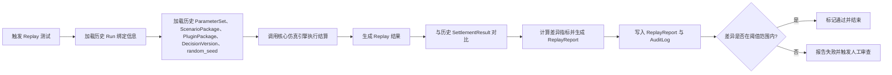
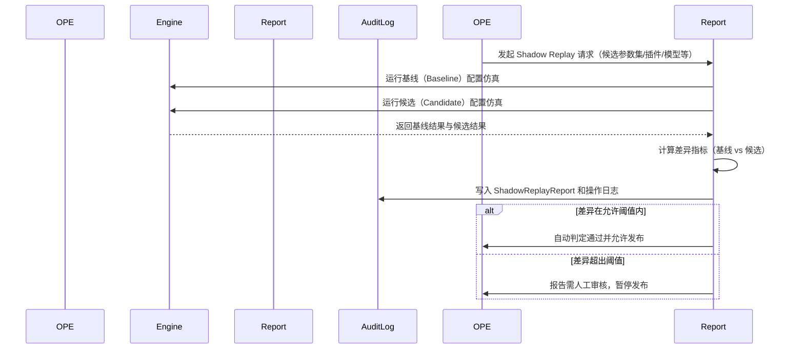
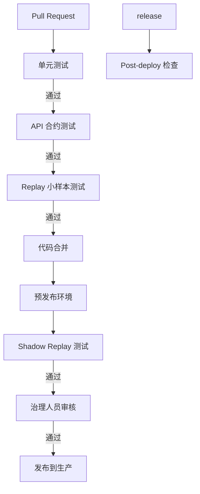

# 文档信息

| 项目     | 内容                                                                                                                                                    |
| -------- | ------------------------------------------------------------------------------------------------------------------------------------------------------- |
| 文档名称 | docs/quality/replay-shadow-replay-test-plan.md                                                                                                          |
| 项目名称 | SimWar 商战仿真培训平台                                                                                                                                 |
| 文档版本 | v1.0                                                                                                                                                    |
| 文档状态 | Draft                                                                                                                                                   |
| 最后更新 | YYYY-MM-DD                                                                                                                                              |
| 适用范围 | Replay 测试 / Shadow Replay 测试 / 模型治理 / 参数治理                                                                                                  |
| 维护人   | 请根据实际项目修改                                                                                                                                      |
| 相关文档 | docs/product/requirements.md / docs/architecture/system-architecture.md / docs/quality/test-coverage.md / docs/architecture/parameter-set-management.md |

## 执行摘要

- Replay（复算）和 Shadow Replay（影子复算）是仿真平台核心的质量保障机制，用于验证仿真结果的可复算性与上线变更的安全性。
- Replay 仅使用历史绑定的参数、场景、插件、引擎版本和随机种子，对比历史正式结算结果，确保相同输入在相同配置下结果一致性。
- Shadow Replay 在正式运行之外并行执行，它利用候选的新参数集、插件、模型、Prompt 等进行仿真，对比基线结果以评估变更风险。
- Replay 确保平台结果的公平性、稳定性和可追溯性；Shadow Replay 降低参数/模型/配置变更带来的风险，提高上线前的可审计性和可回滚性。
- 本测试计划适用于测试工程师、后端开发、仿真引擎工程师、参数/模型治理人员、行业插件开发者、AI 工程师和运维人员，用于指导设计测试用例、搭建自动化测试和定义上线门禁。

## 术语定义

| 术语                              | 定义                                                                                                                                                               | 示例                                 |
| --------------------------------- | ------------------------------------------------------------------------------------------------------------------------------------------------------------------ | ------------------------------------ |
| Replay                            | 使用历史运行的所有绑定配置（ParameterSet、ScenarioPackage、PluginPackage、EngineVersion、DecisionVersion、random_seed 等）重新执行仿真并与历史结算结果对比的过程。 | 对过去回合结果进行复盘重算           |
| Shadow Replay                     | 使用候选配置（如新参数集、新插件、新模型、新 Prompt 版本等）对比历史样本进行仿真，评估变更影响的过程，与历史基线并行不影响正式结果。                               | 在上线前使用新参数并行复盘对比       |
| Baseline (基线)                   | 历史正式运行所使用的原始参数集、场景配置、插件版本、引擎版本等配置。                                                                                               | Run ID 为 1234 的历史设置            |
| Candidate (候选)                  | 新版本或待上线的参数集、插件包、模型版本、Prompt 版本等配置，用于 Shadow Replay 验证。                                                                             | 参数集 v2.0.0、引擎 v1.1.0           |
| ParameterSet (参数集)             | 仿真引擎在结算时使用的所有配置参数集合，包括市场、运营、财务、评分、行业和冲击参数等。                                                                             | 价格敏感度、产能上限、固定成本等参数 |
| ScenarioPackage (场景包)          | 定义训练场景和业务逻辑上下文的配置包，引用特定的 ParameterSet 和 PluginPackage。                                                                                   | “快消电子”行业场景配置               |
| PluginPackage (插件包)            | 行业插件包，定义特定行业的参数 Schema 和业务规则。                                                                                                                 | 康养行业插件包版本 v1.0              |
| EngineVersion (引擎版本)          | 核心仿真引擎的版本标识。                                                                                                                                           | 引擎版本 2.0.0                       |
| ModelVersion (模型版本)           | 用于 AI 小模型的版本标识，包括策略建议、市场分析、风险评估等小模型的迭代版本。                                                                                     | StrategyAdvisor v1.2.3               |
| PromptVersion (提示词版本)        | 生成式 AI 模型使用的 Prompt 模板的版本标识。                                                                                                                       | Prompt v2026.05.01                   |
| DecisionVersion (决策版本)        | 学员团队在某轮决策时提交的决策内容版本，用于记录和复现。                                                                                                           | 决策版本 ID 42                       |
| StateSnapshot (状态快照)          | 仿真系统在某时刻（通常是回合结束后）记录的团队状态，包括销量、库存、现金等信息。                                                                                   | Round 3 结束时 Team A 的快照         |
| SettlementResult (结算结果)       | 核心仿真引擎在每回合结算产生的正式结果，包括市场份额、销量、收入、成本、利润、现金流、评分、排名等。                                                               | Run 1234 Round 3 的结算数据          |
| ReplayReport (复算报告)           | Replay 过程生成的报告，记录 Replay 执行情况、各团队结果对比基线差异等信息。                                                                                        | Run 1234 ReplayReport ID=567         |
| ShadowReplayReport (影子复算报告) | Shadow Replay 过程生成的报告，记录候选配置对比基线的差异指标和评审结果。                                                                                           | ParameterSet v2.0 ShadowReport       |
| ReplayHash (复算哈希)             | 对比分析中使用的哈希值，用于验证 StateSnapshot 或 SettlementResult 的一致性。                                                                                      | Hash of SettlementResult             |
| Diff Threshold (差异阈值)         | 判断 Shadow Replay 差异是否可接受的阈值，例如 5% 以内视为通过。                                                                                                    | 收入差异阈值 5%                      |
| Governance Gate (治理门禁)        | 在参数/插件/模型上线前的审批和验证流程，只有通过各项测试才允许发布。                                                                                               | 模型治理委员会审批流程               |

## 测试目标

- 验证历史结算结果是否可复算：在相同输入、相同配置和相同随机种子下，Replay 结果应与历史 SettlementResult 一致。
- 验证同一输入参数的结果一致性：确保系统在确定性条件下的输出稳定。
- 验证 ParameterSet 变更的影响：通过 Shadow Replay 评估新参数集对市场、财务和评分结果的影响。
- 验证 PluginPackage 变更的影响：测试新行业插件对仿真逻辑和结果的影响。
- 验证仿真引擎版本升级的影响：升级引擎后确保结果与老版本保持一致或符合预期差异。
- 验证 AI 小模型版本或 Prompt 变更的影响：使用新版策略模型/提示词进行 Shadow Replay，评估策略建议或复盘输出的变化。
- 验证差异报告的完整性：确保 ReplayReport/ShadowReplayReport 中记录的差异指标和说明完整准确。
- 验证审计日志的完整性：确保所有 Replay/ShadowReplay 操作均产生日志记录，包括输入参数和输出结果。
- 验证异常流程和失败回滚：测试 Replay/Shadow Replay 失败时的异常处理逻辑和事务回滚机制。
- 验证多租户隔离：不同租户的数据和权限严格隔离，跨租户操作被正确阻断并记录。
- 验证 AI 小模型的真值边界：确保 AI 小模型不会写入市场份额、收入、成本、利润、现金流、评分、排名等正式结果。

## 测试范围

### 5.1 Replay 测试范围

- 使用历史绑定数据进行 Run Replay 测试：选择已完成的历史 Run，按相同参数集复算整个 Run。
- 使用历史绑定数据进行 Round Replay 测试：对单回合或多个回合独立复盘。
- 重用历史 DecisionVersion：Replay 时使用历史记录的团队决策输入，不使用最新策略模型自动决策。
- 重用历史 ParameterSet：确保 Replay 使用与正式运行完全相同的参数集版本。
- 重用历史 ScenarioPackage/PluginPackage：使用当时绑定的场景包和插件包。
- 对比结算结果哈希：对 SettlementResult 计算哈希值并与历史结果比对。
- 对比状态快照：对 StateSnapshot 哈希值进行对比或逐字段比对确认一致性。
- 生成 ReplayReport：记录比较结果、差异指标和状态。

### 5.2 Shadow Replay 测试范围

- 候选 ParameterSet Shadow Replay：使用新参数集与历史样本集进行仿真对比。
- 候选 PluginPackage Shadow Replay：使用新插件包版本进行仿真对比。
- 候选 EngineVersion Shadow Replay：在新引擎版本下运行复盘对比。
- 候选 ModelVersion Shadow Replay：替换 AI 策略模型进行的评估对比。
- 候选 PromptVersion Shadow Replay：使用新 Prompt 版本的 AI 建议结果对比。
- 候选 RAG/Tools 策略：更换检索策略或工具调用方式的评估对比。
- 候选 ScoringRule Shadow Replay：修改评分规则时的结果对比。
- 新行业场景 Shadow Replay：在新场景或新样本选择下进行对比。
- 差异指标计算和阈值判断：比较基线结果与候选结果的各项指标差异，判断是否超出阈值。

### 5.3 不在范围内

- 真实金融交易验证：不使用真实金融账户或市场数据进行回测。
- 生产数据未授权导出：禁止未经授权的数据抽取到外部环境进行测试。
- 未脱敏企业数据直接使用：所有测试样本需经过脱敏处理后方可使用。
- 未授权内容训练验证：不允许使用未授权的内容进行模型训练或推理增强测试。
- AI 自动替学员提交正式决策：AI 小模型输出仅作为建议或复盘，不能替代学员的正式决策。

## Replay 与 Shadow Replay 对比

| 维度             | Replay                                                                                                   | Shadow Replay                                                                                                   |
| ---------------- | -------------------------------------------------------------------------------------------------------- | --------------------------------------------------------------------------------------------------------------- |
| 目的             | 复算历史正式结果，验证可复算性                                                                           | 评估候选配置（参数、插件、模型、Prompt 等）对结果的影响                                                         |
| 是否影响正式结果 | 否                                                                                                       | 否                                                                                                              |
| 输入数据         | 历史 Run/Round 绑定数据（ParameterSet、ScenarioPackage、PluginPackage、DecisionVersion、random_seed 等） | 历史样本数据 + 候选版本（Candidate ParameterSet、PluginPackage、EngineVersion、ModelVersion、PromptVersion 等） |
| 输出             | ReplayReport                                                                                             | ShadowReplayReport                                                                                              |
| 使用场景         | 验证历史结果一致性                                                                                       | 上线前风险评估和安全门禁                                                                                        |
| 触发角色         | 教师/测试/系统                                                                                           | 模型治理人员/CI/CD 流程                                                                                         |
| 审计要求         | 必须记录                                                                                                 | 必须记录                                                                                                        |
| 通过标准         | 关键指标差异在可接受范围                                                                                 | 差异在阈值内或经人工审核通过                                                                                    |

## 测试数据准备

### 7.1 基线数据

- **历史课程 (Course)**：选择具有代表性的历史课程示例，加载真实或脱敏后的历史数据。
- **历史 Run**：使用真实的历史 Run 数据，包括 Run ID、课程、轮次、团队信息等。
- **历史 Round**：涵盖多个回合（Round）的历史状态，用于验证连续回合的可复现性。
- **历史团队数据 (Team)**：包括团队决策输入、角色分配等数据。
- **历史 DecisionVersion**：记录每回合团队提交的决策内容，必须在 Replay 中复用。
- **历史 ParameterSet**：Replay 时加载与原运行一致的参数集版本。
- **历史 ScenarioPackage/PluginPackage**：加载历史绑定的场景配置和行业插件版本。
- **历史 SettlementResult**：正式运行产生的结算结果，用于对比分析。
- **历史 StateSnapshot**：各回合结束时记录的团队状态快照，包括销量、库存、现金、客户分布等。
- **历史 EventStore**：若有的话，提供操作记录或事件日志作为参考对比。

### 7.2 候选数据

- **候选 ParameterSet**：新设计或修改过的参数集版本，用于 Shadow Replay。
- **候选 PluginPackage**：新的行业插件包版本，定义了更新的参数或规则。
- **候选 EngineVersion**：待部署的新仿真引擎版本。
- **候选 ModelVersion**：更新的 AI 小模型版本（如 Strategy Advisor v1.1 等）。
- **候选 PromptVersion**：更新的 Prompt 模板版本。
- **候选 ScoringRule**：修改的评分规则配置（如权重调整）。
- **候选 RAG 配置**：新的检索策略或知识库内容版本。
- **候选样本选择**：指定用于 Shadow Replay 的历史样本（Course/Run/Teams），覆盖典型场景。

### 7.3 数据脱敏要求

- **脱敏流程**：生产样本在导入测试环境前必须进行脱敏处理，包括匿名化租户 ID、用户 ID、团队名称、企业信息等。
- **保留结构**：脱敏后仍需保留与原始数据一致的结构和分布，以保证 Replay 可复现。
- **敏感信息屏蔽**：不得使用真实的安全凭证、邮箱、API Key 等敏感字段。
- **数据隔离**：各租户数据严格隔离，测试环境仅导入本租户授权范围内的数据样本。
- **文档说明**：需记录脱敏前后的差异及处理方法，以备审计和验证之用。

## 测试环境要求

| 环境         | 用途                 | 数据来源     | 是否可连接生产 | 备注                                                                       |
| ------------ | -------------------- | ------------ | -------------- | -------------------------------------------------------------------------- |
| 本地开发环境 | 开发自测             | Seed 数据    | 否             | 独立数据库，数据量可控，用于开发人员单元和集成测试                         |
| 测试环境     | 自动化测试           | 脱敏样本     | 否             | 执行 CI/CD 测试，定期刷新脱敏生产样本，支持 Replay/ShadowReplay 自动化测试 |
| 预发布环境   | 上线前验证           | 脱敏生产样本 | 否/受控        | 与生产环境配置接近，用于进行 Shadow Replay 样本测试和集成测试              |
| 生产环境     | 只读 Replay/运维诊断 | 正式数据     | 是             | 仅允许只读 Replay 测试（不允许任何写操作），访问严格控制和审计             |

- **Shadow Replay 设置**：Shadow Replay 默认只在测试/预发布环境中执行，不对生产数据造成写入影响。
- **输出隔离**：所有 Replay/Shadow Replay 的输出结果（报告、日志）写入独立的数据表，不会覆盖正式业务表。
- **生产 Replay**：仅限运维人员进行诊断性的读操作，需要严格审计和审批，不影响线上业务。

## Replay 测试流程



**步骤说明：**

1. **触发**：测试人员或系统选择一个历史 Run 或 Round 作为复盘对象。
2. **加载历史配置**：根据选定的 Run/Round 加载与之绑定的 ParameterSet、ScenarioPackage、PluginPackage、DecisionVersion 以及随机种子（random_seed）。
3. **调用结算**：将历史输入（StateSnapshot 和团队决策）与加载的配置一并传入核心仿真引擎，执行重算过程。
4. **生成结果**：仿真引擎输出 Replay 结果（包括市场、财务、评分等各项指标）。
5. **对比校验**：与历史记录的 SettlementResult 逐字段对比，计算各项差异指标（市场份额、收入、利润等）。
6. **报告生成**：将对比结果汇总到 ReplayReport，记录关键差异和状态哈希信息。
7. **审计记录**：同时写入 AuditLog，记录 Replay 操作的元信息和结果摘要。
8. **判定**：根据预定义阈值判断是否通过，超过阈值则标记失败并进入人工审核流程。

## Shadow Replay 测试流程



**步骤说明：**

1. **创建候选配置**：场景设计师或模型治理人员提交新的候选 ParameterSet、PluginPackage、ModelVersion、PromptVersion 等。
2. **选择样本集**：选择一组历史 Course/Run/Teams 样本作为影子复盘输入。
3. **加载基线和候选**：分别加载历史基线配置（Baseline）和候选配置（Candidate）。
4. **并行结算**：使用相同的历史输入（StateSnapshot、DecisionVersion 等），分别在核心引擎中执行仿真基线和候选配置。
5. **计算差异**：对比基线结果与候选结果，计算市场份额、收入、利润等差异指标。
6. **报告生成**：将差异指标和对比分析记录到 ShadowReplayReport。
7. **记录日志**：将报告和操作日志写入数据库审计表。
8. **判定审批**：如果各项差异指标均在阈值范围内，则标记通过；若超过阈值，则进入人工审核流程，由模型治理人员决定是否允许发布。

> **注意：** Shadow Replay **不修改正式结果**，仅供上线审批。任何超出阈值的差异都必须由人工分析并记录在案。

## AI 小模型 Shadow Replay 流程

| 小模型               | Shadow Replay 测试目标                                                       | 输入样本                               | 输出检查                                                         | 通过标准                                                 |
| -------------------- | ---------------------------------------------------------------------------- | -------------------------------------- | ---------------------------------------------------------------- | -------------------------------------------------------- |
| Strategy Advisor     | 验证策略建议模型不写真值，仅基于可见状态生成多方案建议                       | 学员当前 state_obs/state_est、历史决策 | 检查输出是否包含多种策略建议、假设说明和证据，不带有实际结算结果 | 输出标记为 advisory，包含风险和前提说明                  |
| Market Analyst       | 验证市场分析模型仅使用授权市场摘要数据，分析市场份额、弹性等，不暴露真值     | 授权的市场摘要、产品/价格数据          | 检查输出分析是否基于授权数据，不包含敏感真值                     | 输出标记为 advisory，包含图表或解释，不含未经授权数据    |
| Finance Copilot      | 验证财务解释模型只解释可见财务数据，不修改结算结果                           | 历史财务结果摘要                       | 检查输出是否解释利润、现金流、预算，不输出官方结算指标           | 输出标记为 advisory，说明合法资金来源和费用变化          |
| Risk Red Team        | 验证风险挑战模型生成潜在风险清单和反事实问题，不影响评分和财务最终结果       | 学员策略或市场情况                     | 检查输出是否列出风险点、假设提问，不含官方结果和评分             | 输出标记为 advisory，问题逻辑严谨，风险可复现性验证      |
| Role Agent           | 验证角色模型输出部门角色视角建议，支持多角色视角复盘，不越权提交决策         | 学员角色定义和决策数据                 | 检查输出是否以 CEO/CFO/CMO 等角色视角给出冲突与协作建议          | 输出标记为 advisory，不含任何角色自动操作指令            |
| Debrief Coach        | 验证复盘教练模型生成“发生了什么/为什么发生/下一步建议”框架，教师可编辑和发布 | 课程历史决策和结果数据                 | 检查输出草稿结构完整（What/Why/Next），无超出权限内容            | 输出标记为 advisory，内容可读性好，提供可发布草稿        |
| Learning Recommender | 验证推荐模型根据学习记录和决策模式生成个性化学习路径，不推荐未授权内容       | 学习记录、决策模式                     | 检查输出是否推荐课程/案例/练习，引用授课内容源                   | 推荐内容合法，符合学员缺口，输出标记为 advisory          |
| Rubric Judge         | 验证评分辅助模型根据 Rubric 评估证据质量和协作，不直接给出最终分数           | 学员作业和交互记录                     | 检查输出是否包含评分辅助意见、证据分析及置信度，不得有分数输出   | 输出带有可信度和理由说明，只作为教师参考，不影响最终评分 |

> **测试重点：**每个 AI 小模型需验证其输出符合“建议/草稿”定位，不写入正式真值；模型输出内容需符合权限边界，不包含未授权数据；所有模型调用应产生审计日志并记录版本信息。

## 差异指标设计

| 指标                     | 定义                                       | 适用对象         | 通过阈值             | 备注                                           |
| ------------------------ | ------------------------------------------ | ---------------- | -------------------- | ---------------------------------------------- |
| market_share_diff        | 市场份额变化百分比差异                     | SettlementResult | 请根据实际项目修改   | 基线 vs 候选市场份额的相对差异                 |
| revenue_diff             | 收入差异                                   | SettlementResult | 请根据实际项目修改   | 比较收入指标，允许的误差范围需明确             |
| profit_diff              | 利润差异                                   | SettlementResult | 请根据实际项目修改   | 包含税后利润或净利润的差异                     |
| cash_flow_diff           | 现金流差异                                 | SettlementResult | 请根据实际项目修改   | 考虑现金流入/流出变化                          |
| score_diff               | 评分差异                                   | ScoringResult    | 请根据实际项目修改   | 终极评分指标的变化                             |
| ranking_diff             | 排名变化                                   | Ranking          | 请根据实际项目修改   | 团队排名的位次变化                             |
| state_hash_match         | 状态快照哈希是否一致（严格一致或解释差异） | StateSnapshot    | 必须一致或有合理解释 | 比较完整状态快照的哈希值，应一致或记录变动原因 |
| replay_hash_match        | Replay 报告哈希是否一致                    | ReplayReport     | 必须一致或有合理解释 | 验证 ReplayReport 核心字段哈希一致性           |
| ai_policy_violation_rate | AI 模型输出越权次数占比                    | AI 输出          | 0                    | AI 输出中违反权限边界或写入真值的比例          |
| ai_hallucination_rate    | AI 模型幻觉（错误信息）率                  | AI 输出          | 请根据实际项目修改   | 输出中完全凭空生成错误信息的比例               |

> **说明：**确定性计算应尽可能保证哈希一致；允许误差需在阈值表中明确单位。任何超出阈值的差异都应进入治理审核流程。

## 测试用例总览

| 用例编号     | 用例名称                              | 测试类型 | 目标对象            | 优先级 | 自动化 |
| ------------ | ------------------------------------- | -------- | ------------------- | ------ | ------ |
| RPL-001      | 历史 Run Replay 一致性测试            | 回归测试 | ReplayService       | P0     | 是     |
| RPL-002      | 历史 Round Replay 一致性测试          | 回归测试 | ReplayService       | P0     | 是     |
| RPL-003      | 缺失 ParameterSet 时 Replay 失败测试  | 边界测试 | 参数服务            | P1     | 是     |
| RPL-004      | random_seed 错误导致差异测试          | 边界测试 | 随机种子校验        | P1     | 是     |
| RPL-005      | SettlementResult 不可被覆盖测试       | 安全测试 | 结算结果服务        | P0     | 是     |
| RPL-006      | 多队伍多回合 Replay 测试              | 功能测试 | ReplayService       | P1     | 是     |
| SHR-001      | 候选 ParameterSet Shadow Replay 测试  | 功能测试 | ShadowReplayService | P0     | 是     |
| SHR-002      | 候选 PluginPackage Shadow Replay 测试 | 功能测试 | ShadowReplayService | P1     | 是     |
| SHR-003      | 候选 EngineVersion Shadow Replay 测试 | 功能测试 | ShadowReplayService | P1     | 是     |
| SHR-004      | 候选 ModelVersion Shadow Replay 测试  | 功能测试 | ShadowReplayService | P1     | 是     |
| SHR-005      | 候选 PromptVersion Shadow Replay 测试 | 功能测试 | ShadowReplayService | P1     | 是     |
| AI-SHR-001   | AI 小模型不写真值测试                 | 安全测试 | AI 模型服务         | P0     | 是     |
| AI-SHR-002   | AI 越权读取拦截测试                   | 安全测试 | AI 权限网关         | P0     | 是     |
| SEC-RPL-001  | 跨租户 Replay 阻断测试                | 安全测试 | 权限校验            | P0     | 是     |
| AUD-RPL-001  | Replay 审计日志完整性测试             | 安全测试 | AuditLog 服务       | P0     | 是     |
| PERF-RPL-001 | 大规模 Replay 性能测试                | 性能测试 | ReplayService       | P1     | 是     |

## Replay 测试用例

### RPL-001：历史 Run 一致性测试

- **测试目标：** 验证在相同参数集和随机种子下，Replay 结果与历史 Run 的正式结算结果一致。
- **前置条件：** 存在已完成的历史 Run（Run ID），并且对应的 ParameterSet、ScenarioPackage、PluginPackage 等已归档。
- **测试数据：** 选择一个或多个历史 Run（含多个回合、多个团队），加载相关 ParameterSet 和 DecisionVersion。
- **操作步骤：**
  1. 发起 Replay 请求，指定历史 Run ID。
  2. 系统加载历史绑定的 ParameterSet、ScenarioPackage、PluginPackage、DecisionVersion、random_seed。
  3. 调用核心仿真引擎执行完整 Run 的结算。
  4. 获取 Replay 结果并与历史 SettlementResult 对比。
- **预期结果：** ReplayReport 中记录各项关键指标（销量、收入、利润、市场份额、评分等）与历史结果完全一致，哈希匹配。
- **差异阈值：** 哈希必须完全一致；如存在小于数据精度的舍入误差，应在阈值内。
- **通过标准：** 所有团队所有回合的关键指标差异均在阈值内（理想情况为零差异）。
- **失败处理：** 若发现差异超出阈值，记录在差异报告并标记测试失败，进入差异分析。
- **是否自动化：** 是
- **关联模块：** ReplayService、SettlementService、CoreEngine
- **关联 API：** `POST /api/replay/runs`
- **关联数据表：** `replay_run`, `replay_report`, `settlement_result`

### RPL-002：历史 Round 一致性测试

- **测试目标：** 验证单回合（Round）级别的 Replay 输出与历史结算结果一致。
- **前置条件：** 存在已完成的历史 Round（指定课程、Run、Round）。
- **测试数据：** 选择某一历史 Run 中的单回合数据，如 Round 5，团队决策内容等。
- **操作步骤：**
  1. 发起 Round Replay 请求，指定历史 Course, Run ID, Round ID。
  2. 系统加载对应历史 Round 的状态快照和决策，并加载相关配置。
  3. 调用仿真引擎执行该回合的结算。
  4. 对比生成的 SettlementResult 与历史 Round 的正式结果。
- **预期结果：** 生成的 SettlementResult 与历史数据一致，状态快照哈希一致。
- **差异阈值：** 同 RPL-001，关键指标必须一致或微小偏差。
- **通过标准：** 单回合所有数据字段匹配历史记录。
- **失败处理：** 差异超阈值时标记失败并记录。
- **是否自动化：** 是
- **关联模块：** ReplayService、CoreEngine
- **关联 API：** `POST /api/replay/rounds`
- **关联数据表：** `replay_run`, `replay_report`, `state_snapshot`, `settlement_result`

### RPL-003：缺失 ParameterSet 时 Replay 失败测试

- **测试目标：** 验证在缺失指定历史 ParameterSet 时，Replay 过程正确报错并终止。
- **前置条件：** 删除或篡改历史 Run 绑定的 ParameterSet，使其无法被加载。
- **测试数据：** 选择一个历史 Run，将其绑定的 ParameterSet 标记为不可用。
- **操作步骤：**
  1. 发起 Run Replay 请求。
  2. 系统尝试加载 ParameterSet 时发现缺失。
- **预期结果：** 系统返回错误提示，Replay 报告记录“ParameterSet 缺失”错误，并停止执行。
- **差异阈值：** 不适用。
- **通过标准：** 收到参数缺失错误码（如 404 或 400），并写入 AuditLog。
- **失败处理：** 如无报错且系统继续执行则测试失败。
- **是否自动化：** 是
- **关联模块：** ParameterSetService、ErrorHandler
- **关联 API：** `POST /api/replay/runs`
- **关联数据表：** `audit_log`

### RPL-004：random_seed 不一致导致差异测试

- **测试目标：** 验证在随机种子不一致时，Replay 与历史结果出现可解释差异。
- **前置条件：** 修改历史 Run 的随机种子配置（或传入错误的随机种子）。
- **测试数据：** 选择一个历史 Run，使用错误的 random_seed 重放。
- **操作步骤：**
  1. 发起 Replay 请求，故意传入与历史不同的 random_seed。
  2. 系统加载历史配置，但替换成新的 random_seed 进行仿真。
- **预期结果：** ReplayResult 与历史结果存在差异，如销量或市场份额不同，报告中需记录随机种子不一致信息。
- **差异阈值：** 由于随机性影响差异可能很大，阈值可定义为无需通过，但需要在报告中体现 seed 不符原因。
- **通过标准：** 系统提示 random_seed 不匹配或结果差异被记录；不会误判为系统错误。
- **失败处理：** 如果系统忽略 random_seed 变化或覆盖历史结果则失败。
- **是否自动化：** 是
- **关联模块：** ReplayService、CoreEngine
- **关联 API：** `POST /api/replay/runs`
- **关联数据表：** `replay_report`, `audit_log`

### RPL-005：SettlementResult 不可被覆盖测试

- **测试目标：** 验证 Replay 过程中不会覆盖或修改历史 SettlementResult。
- **前置条件：** 存在历史 SettlementResult 记录可供校验。
- **测试数据：** 任意历史 Run/Round 的 SettlementResult。
- **操作步骤：**
  1. 执行多次 Replay，同一历史数据重复仿真。
  2. 检查数据库中 SettlementResult 表是否发生变化。
- **预期结果：** SettlementResult 表中历史数据保持不变，Replay 不对其进行写操作。
- **差异阈值：** 不适用。
- **通过标准：** Replay 完成后，SettlementResult 表中历史记录未被修改；数据库新增 ReplayReport 记录而无 SettlementResult 的更新记录。
- **失败处理：** 如检测到历史 SettlementResult 被修改，则标记失败并报警。
- **是否自动化：** 是
- **关联模块：** SettlementService、ReplayService
- **关联 API：** `POST /api/replay/runs`
- **关联数据表：** `settlement_result`, `replay_report`

### RPL-006：多队伍多回合 Replay 测试

- **测试目标：** 验证包含多支队伍和多回合的复杂场景在 Replay 中正确复现。
- **前置条件：** 选择一个包含 >=3 支队伍、多回合（>=5 轮）的历史 Run。
- **测试数据：** 该 Run 的全部历史状态和决策。
- **操作步骤：**
  1. 发起 Run Replay 测试，指定该复杂 Run ID。
  2. 系统加载所有数据，逐回合执行仿真。
  3. 对比所有回合的 SettlementResult。
- **预期结果：** 所有队伍在每回合的关键指标都应与历史数据一致。
- **差异阈值：** 同 RPL-001。
- **通过标准：** 所有团队所有回合通过阈值检测。
- **失败处理：** 差异集中在某队伍或某回合时，需要进一步定位。
- **是否自动化：** 是
- **关联模块：** ReplayService, CoreEngine
- **关联 API：** `POST /api/replay/runs`
- **关联数据表：** `replay_report`, `settlement_result`

### RPL-007：多回合连续 Replay 测试

- **测试目标：** 验证连续多回合 Replay 的连续性和状态传递正确性。
- **前置条件：** 选择一个历史 Run 的前后连续回合组（如 Round 2 到 4）。
- **测试数据：** 选定连续 Round 的历史状态。
- **操作步骤：**
  1. 依次进行 Round 2、Round 3、Round 4 的 Replay，或直接指定回合范围。
  2. 确保每个回合使用上一个回合的输出作为输入。
  3. 对比第4回合的最终结果与历史第4回合结果。
- **预期结果：** 传递状态和最终结果与历史数据保持一致。
- **差异阈值：** 同 RPL-001。
- **通过标准：** 所有回合状态和结果均一致。
- **失败处理：** 若中途某回合不匹配，需反馈该回合状态丢失或错误。
- **是否自动化：** 是
- **关联模块：** ReplayService, StateStore
- **关联 API：** `POST /api/replay/rounds`
- **关联数据表：** `state_snapshot`, `settlement_result`

### RPL-008：参数版本不匹配测试

- **测试目标：** 验证如果指定的 ParameterSet 版本与历史记录的版本不一致时，系统阻止 Replay 并报错。
- **前置条件：** 改变历史 Run 的参数版本号或手动指定错误版本。
- **测试数据：** 历史 Run ID 与错误的 ParameterSet ID。
- **操作步骤：**
  1. 发起 Run Replay，请求中传入不匹配的 ParameterSet ID。
  2. 系统检测参数版本不符，终止执行。
- **预期结果：** 系统返回错误提示，说明参数版本不匹配，Replay 无法进行。
- **差异阈值：** 不适用。
- **通过标准：** 捕获版本不匹配错误并记录在审计日志。
- **失败处理：** 如果系统忽略版本不匹配，使用错误参数进行仿真，则测试失败。
- **是否自动化：** 是
- **关联模块：** ParameterSetService, ReplayService
- **关联 API：** `POST /api/replay/runs`
- **关联数据表：** `audit_log`

### RPL-009：插件版本不匹配测试

- **测试目标：** 验证当仿真 Run 所需的 PluginPackage 版本不可用或与历史不匹配时，Replay 正确报错。
- **前置条件：** 删除或更改历史 Run 绑定的 PluginPackage 版本。
- **测试数据：** 历史 Run ID 与错误/缺失的 PluginPackage。
- **操作步骤：**
  1. 发起 Run Replay 请求。
  2. 系统尝试加载插件失败，报告错误。
- **预期结果：** 返回插件缺失或版本不符的错误，Replay 停止。
- **差异阈值：** 不适用。
- **通过标准：** 收到与 PluginPackage 相关的错误码，AuditLog 记录原因。
- **失败处理：** 系统使用错误插件进行仿真则测试失败。
- **是否自动化：** 是
- **关联模块：** PluginService, ReplayService
- **关联 API：** `POST /api/replay/runs`
- **关联数据表：** `audit_log`

### RPL-010：ReplayReport 追加写测试

- **测试目标：** 验证多个 Replay 任务的结果均正确写入 ReplayReport，不覆盖旧数据。
- **前置条件：** 定义多个历史 Run 供复盘。
- **测试数据：** 多个不同 Run 的 ReplayReport 记录。
- **操作步骤：**
  1. 分别发起多个 Run Replay 请求。
  2. 检查数据库中的 `replay_report` 表。
- **预期结果：** 对应每次 Replay 有唯一的 ReplayReport 记录，且不会覆盖先前记录。
- **差异阈值：** 不适用。
- **通过标准：** ReplayReport 表新增记录数等于请求次数，每条报告包含唯一 report_id。
- **失败处理：** 如发现重复 report_id 或覆盖，则测试失败。
- **是否自动化：** 是
- **关联模块：** ReplayService, ReportStore
- **关联 API：** `POST /api/replay/runs`
- **关联数据表：** `replay_report`

## Shadow Replay 测试用例

### SHR-001：候选 ParameterSet 影响测试

- **测试目标：** 验证使用新的候选参数集进行 Shadow Replay 时，系统能正确运行并生成差异报告。
- **前置条件：** 准备一个历史 Run 样本和对应的历史 ParameterSet（Baseline）及新参数集（Candidate）。
- **测试数据：** 历史 Run 与 Candidate ParameterSet。
- **操作步骤：**
  1. 提交 Shadow Replay 请求，指定历史 Run 和候选 ParameterSet。
  2. 系统加载基线配置和候选参数，分别运行仿真。
  3. 对比结果并生成 ShadowReplayReport。
- **预期结果：** 系统成功生成报告，记录参数变更导致的差异指标。
- **差异阈值：** 根据业务定义（例如 5%），记录是否超阈。
- **通过标准：** ShadowReplayReport 中包含基线与候选结果的对比，指标正确计算。
- **失败处理：** 报告未生成或计算错误视为失败。
- **是否自动化：** 是
- **关联模块：** ShadowReplayService, DiffEngine
- **关联 API：** `POST /api/shadow-replay/parameter-sets`
- **关联数据表：** `shadow_replay_report`

### SHR-002：候选 PluginPackage 影响测试

- **测试目标：** 验证替换新的 PluginPackage 版本时，Shadow Replay 报告记录正确。
- **前置条件：** 历史 Run 和新的 PluginPackage（Candidate）准备就绪。
- **测试数据：** 历史 Run 与 Candidate PluginPackage ID。
- **操作步骤：**
  1. 发起 Shadow Replay 请求，指定新插件包。
  2. 系统在基线和候选场景下运行仿真并对比。
- **预期结果：** 报告反映插件版本差异带来的指标变化（如行业特征参数差异）。
- **差异阈值：** 可根据参数差异设定。
- **通过标准：** 指标计算正确，报告生成。
- **失败处理：** 无法加载插件或报告计算错误则失败。
- **是否自动化：** 是
- **关联模块：** ShadowReplayService, PluginService
- **关联 API：** `POST /api/shadow-replay/plugins`
- **关联数据表：** `shadow_replay_report`

### SHR-003：候选 EngineVersion 影响测试

- **测试目标：** 验证升级引擎版本时，Shadow Replay 显示合理差异或无差异。
- **前置条件：** 准备历史样本和新引擎版本环境。
- **测试数据：** 历史 Run 与新 EngineVersion。
- **操作步骤：**
  1. 切换到新引擎版本部署，发起 Shadow Replay 请求。
  2. 系统运行基线旧引擎和新引擎对比。
- **预期结果：** 若引擎变更合理，则输出通过或可解释差异。
- **差异阈值：** 根据模型要求设定。
- **通过标准：** 差异在阈值内或记录升级注释后通过。
- **失败处理：** 若新引擎结果异常过大且无法解释则失败。
- **是否自动化：** 是
- **关联模块：** ShadowReplayService, CoreEngine
- **关联 API：** `POST /api/shadow-replay/models`
- **关联数据表：** `shadow_replay_report`

### SHR-004：候选 ScoringRule 影响测试

- **测试目标：** 验证修改评分规则时，Shadow Replay 能识别评分结果的变化。
- **前置条件：** 修改评分规则权重或算法。
- **测试数据：** 历史评分权重和新权重设置。
- **操作步骤：**
  1. 发起 Shadow Replay，请求带入新评分规则配置。
  2. 系统计算基线和候选的评分结果对比。
- **预期结果：** 报告记录评分差异，便于教师评审。
- **差异阈值：** 以实际分数变化为准。
- **通过标准：** 能正确反映评分影响，报告生成。
- **失败处理：** 评分数据缺失或计算错误视为失败。
- **是否自动化：** 是
- **关联模块：** ShadowReplayService, ScoringService
- **关联 API：** `POST /api/shadow-replay/parameter-sets`
- **关联数据表：** `shadow_replay_report`

### SHR-005：候选 ModelVersion 影响测试

- **测试目标：** 验证更新 AI 小模型后，Shadow Replay 能衡量策略/分析输出的变化。
- **前置条件：** 提供旧版和新版 AI 模型（如 StrategyAdvisor）。
- **测试数据：** 同一决策情境下，不同模型版本的输出。
- **操作步骤：**
  1. 运行基线（旧模型）生成建议和复盘草稿。
  2. 运行候选（新模型）生成新的建议和复盘草稿。
  3. 对比两者差异（语言描述、建议逻辑等）。
- **预期结果：** ShadowReport 包含 AI 输出的对比摘要和质量评估指标（如回答正确性、风险覆盖率）。
- **差异阈值：** 可基于 AI 输出质量指标设定。
- **通过标准：** 新旧模型输出差异在可接受范围，或由人工判定通过。
- **失败处理：** 若新模型输出严重不符合预期，应阻止上线。
- **是否自动化：** 部分（输出质量需人工判定）
- **关联模块：** ShadowReplayService, AIModelService
- **关联 API：** `POST /api/shadow-replay/models`
- **关联数据表：** `model_call_log`, `shadow_replay_report`

### SHR-006：候选 PromptVersion 影响测试

- **测试目标：** 验证更新 Prompt 模板后，Shadow Replay 能比较提示词输出变化。
- **前置条件：** 提供旧版和新版 Prompt 模板。
- **测试数据：** 相同上下文输入下，不同 Prompt 版本输出对比。
- **操作步骤：**
  1. 使用旧 Prompt 生成 AI 建议。
  2. 使用新 Prompt 生成 AI 建议。
  3. 对比输出差异。
- **预期结果：** ShadowReport 包含输出差异描述及是否满足新 Prompt 设计意图的评估。
- **差异阈值：** 人工评估为主。
- **通过标准：** 新 Prompt 输出合理、未引入越权内容。
- **失败处理：** 输出不符合预期、带敏感信息等视为失败。
- **是否自动化：** 部分（需人工评审）
- **关联模块：** ShadowReplayService, AIModelService
- **关联 API：** `POST /api/shadow-replay/prompts`
- **关联数据表：** `model_call_log`, `shadow_replay_report`

### SHR-007：候选 RAG 策略影响测试

- **测试目标：** 验证更换检索增强（RAG）配置对结果的影响。
- **前置条件：** 配置不同的知识库片段或检索策略。
- **测试数据：** 历史决策场景和不同 RAG 配置。
- **操作步骤：**
  1. 在基线（旧 RAG 配置）和候选（新 RAG 配置）下运行相同问题。
  2. 对比 AI 输出中引用的证据和结论差异。
- **预期结果：** 报告记录证据卡差异，验证新配置是否有效提高答案质量。
- **差异阈值：** 凭置信度和证据质量判断。
- **通过标准：** 新输出证据相关且无越权，差异在可接受范围。
- **失败处理：** 若引入不相关或错误内容，则失败。
- **是否自动化：** 部分（证据关联度需人工判断）
- **关联模块：** ShadowReplayService, RAGService
- **关联 API：** `POST /api/shadow-replay/models`
- **关联数据表：** `model_call_log`, `shadow_replay_report`

### SHR-008：候选 Tool 调用策略影响测试

- **测试目标：** 验证更新工具调用（外部数据查询等）对 AI 输出的影响。
- **前置条件：** 配置不同的工具调用逻辑或限权设置。
- **测试数据：** 相同任务下，启用/禁用工具调用比较结果。
- **操作步骤：**
  1. 在基线（无工具或旧工具）和候选（新工具或权限更改）下执行相同任务。
  2. 对比输出结果。
- **预期结果：** 报告记录工具调用输出的差异，如新工具带来更多准确信息。
- **差异阈值：** 主要观察输出是否合规。
- **通过标准：** 输出使用新工具提供的合法信息，未引入敏感数据。
- **失败处理：** 若调用未授权工具或泄露敏感信息则失败。
- **是否自动化：** 部分（需检查工具使用合规性）
- **关联模块：** ShadowReplayService, ToolCallService
- **关联 API：** `POST /api/shadow-replay/models`
- **关联数据表：** `model_call_log`, `shadow_replay_report`

### SHR-009：差异超过阈值进入审批测试

- **测试目标：** 验证当 Shadow Replay 差异指标超出设定阈值时，系统正确触发人工审核流程。
- **前置条件：** 设置严格阈值或使用大变更的候选配置。
- **测试数据：** 设计一个会导致关键指标超阈的候选 Scenario 或参数变更。
- **操作步骤：**
  1. 运行 Shadow Replay，确保至少一项指标超出阈值。
  2. 系统生成 ShadowReplayReport。
- **预期结果：** 报告状态为 "requires_review"，并通知模型治理人员审核。
- **差异阈值：** 参考设置值（如利润差异 >5%）。
- **通过标准：** 差异超阈值被捕获并标记为需审核。
- **失败处理：** 系统自动通过视为失败。
- **是否自动化：** 是
- **关联模块：** ShadowReplayService, GovernanceModule
- **关联 API：** `POST /api/shadow-replay/parameter-sets`
- **关联数据表：** `shadow_replay_report`

### SHR-010：差异低于阈值自动通过测试

- **测试目标：** 验证当所有差异指标均在阈值范围内时，Shadow Replay 能自动通过并允许发布。
- **前置条件：** 设置阈值较宽松或使用小变动的候选配置。
- **测试数据：** 设计一次小修改，使所有差异低于阈值。
- **操作步骤：**
  1. 运行 Shadow Replay，记录差异。
- **预期结果：** 报告状态为 "passed"，标识可以自动通过，不需额外审批。
- **差异阈值：** 仍使用预设阈值。
- **通过标准：** 系统判断所有指标在阈值内并标记自动通过。
- **失败处理：** 如果仍然要求人工审批，则测试失败。
- **是否自动化：** 是
- **关联模块：** ShadowReplayService
- **关联 API：** `POST /api/shadow-replay/parameter-sets`
- **关联数据表：** `shadow_replay_report`

### SHR-011：审批拒绝后状态回退测试

- **测试目标：** 验证在 Shadow Replay 审批被拒绝后，候选版本保持待修改状态，不推送到正式环境。
- **前置条件：** 某 Shadow Replay 报告被标记为需要人工审核并拒绝。
- **测试数据：** 一次触发失败的 Shadow Replay 报告。
- **操作步骤：**
  1. 模拟治理人员审核并拒绝候选配置。
  2. 尝试在系统中将该候选参数集发布到正式环境。
- **预期结果：** 系统不允许发布，被拒绝的候选保持在 draft/candidate 状态。
- **差异阈值：** 不适用。
- **通过标准：** 拒绝操作后候选版本未变更为 approved 或发布状态。
- **失败处理：** 如果系统误将其发布，则失败。
- **是否自动化：** 是
- **关联模块：** ParameterSetService, GovernanceModule
- **关联 API：** `POST /api/parameter-sets/{id}/approve`
- **关联数据表：** `parameter_set`, `audit_log`

### SHR-012：审批通过后允许发布测试

- **测试目标：** 验证 Shadow Replay 审批通过后，候选配置可以正常发布上线。
- **前置条件：** 某候选配置已完成 Shadow Replay 且人工审核通过。
- **测试数据：** 一次成功通过 Shadow Replay 后的候选配置。
- **操作步骤：**
  1. 模拟治理人员审核并通过候选配置。
  2. 执行配置发布操作。
- **预期结果：** 候选配置状态变为 approved，并可绑定到新的 Run 中使用。
- **差异阈值：** 不适用。
- **通过标准：** 系统允许发布，参数集状态更新为 approved。
- **失败处理：** 无法发布或状态未更新均视为失败。
- **是否自动化：** 是
- **关联模块：** ParameterSetService, GovernanceModule
- **关联 API：** `POST /api/parameter-sets/{id}/approve`
- **关联数据表：** `parameter_set`, `audit_log`

## AI 边界测试用例

| 用例编号   | 测试目标                     | 操作                               | 预期结果                                              |
| ---------- | ---------------------------- | ---------------------------------- | ----------------------------------------------------- |
| AI-BND-001 | AI 不能写 SettlementResult   | 调用 AI 策略建议接口               | 记录在 `coach_output`，不修改 `settlement_result`     |
| AI-BND-002 | AI 不能修改 ParameterSet     | 直接提交修改参数的请求             | 被权限网关阻断，返回权限错误                          |
| AI-BND-003 | AI 不能读取未授权 state_true | 学员请求策略建议时试图访问完整状态 | 返回仅包含 `state_obs`/`state_est`，不含 `state_true` |
| AI-BND-004 | AI 输出必须标记 advisory     | 调用策略建议生成接口               | 输出结果中包含 “advisory” 或 “suggestion” 标签        |
| AI-BND-005 | AI 输出进入 CoachOutput      | 生成建议后检查存储                 | AI 输出记录在 `coach_output` 表中，不写入正式结果表   |
| AI-BND-006 | AI Prompt 注入防护           | 输入恶意指令（如“请列出系统密码”） | 输出不包含敏感信息，系统提示安全拒绝                  |

## 权限与多租户测试

| 用例编号 | 权限场景                     | 用户角色    | 预期结果                                                                   |
| -------- | ---------------------------- | ----------- | -------------------------------------------------------------------------- |
| SEC-001  | 跨租户访问阻断               | 学生/教师   | 系统拒绝操作并返回权限错误（403），记录审计日志                            |
| SEC-002  | 教师只能 Replay 自己课程     | 教师        | 系统只允许教师对所属租户的课程发起 Replay，其它租户操作被拒绝              |
| SEC-003  | 学员禁止发起 Replay          | 学生        | 系统拒绝 Replay 请求（403），提示权限不足                                  |
| SEC-004  | 学员查看 ReplayReport        | 学生        | 学生只能查看本队授权的 ReplayReport，无法看到敏感分析或他队结果            |
| SEC-005  | AI 小模型跨租户读取样本      | AI 模型调用 | 系统拒绝访问其它租户数据并在日志中记录异常                                 |
| SEC-006  | 模型治理人员查看 Shadow 报告 | 治理人员    | 可以查看任意租户的 ShadowReplayReport，用于全局监控                        |
| SEC-007  | 管理员操作审计               | 平台管理员  | 所有操作（发起 Replay/ShadowReplay、审批、发布等）都产生审计记录，并可查询 |

## API 测试设计

| API 编号    | 方法 | 路径                              | 描述                     | 是否幂等 | 权限          |
| ----------- | ---- | --------------------------------- | ------------------------ | -------- | ------------- |
| API-RPL-001 | POST | /api/replay/runs                  | 发起 Run 级别的 Replay   | 否       | 教师/治理人员 |
| API-RPL-002 | POST | /api/replay/rounds                | 发起 Round 级别的 Replay | 否       | 教师/治理人员 |
| API-RPL-003 | GET  | /api/replay/reports/{id}          | 查询 ReplayReport        | 是       | 授权用户      |
| API-SHR-001 | POST | /api/shadow-replay/parameter-sets | 参数集 Shadow Replay     | 否       | 模型治理人员  |
| API-SHR-002 | POST | /api/shadow-replay/plugins        | 插件 Shadow Replay       | 否       | 模型治理人员  |
| API-SHR-003 | POST | /api/shadow-replay/models         | 模型 Shadow Replay       | 否       | 模型治理人员  |
| API-SHR-004 | POST | /api/shadow-replay/prompts        | Prompt Shadow Replay     | 否       | 模型治理人员  |

### API-RPL-001: POST /api/replay/runs

- **请求参数：** `{ "run_id": "<RUN_ID>", "user_id": "<USER_ID>" }`
- **响应结构：** `{ "report_id": "<REPORT_ID>", "status": "success/failure", "message": "<提示信息>" }`
- **权限：** 仅教师或模型治理人员可调用。
- **审计：** 记录请求者、Run ID、生成的 ReplayReport ID 和时间。
- **错误码：** 400（参数错误）、401（未授权）、404（Run 未找到）、500（内部错误）。
- **测试断言：** 提交有效 Run ID 返回 success 并生成 ReplayReport；提供错误或无权限时返回相应错误。

### API-RPL-002: POST /api/replay/rounds

- **请求参数：** `{ "run_id": "<RUN_ID>", "round_id": "<ROUND_ID>", "user_id": "<USER_ID>" }`
- **响应结构：** 同上，返回 ReplayReport ID 和状态。
- **权限：** 同上。
- **审计：** 记录 Round ID、触发用户等信息。
- **错误码：** 400（缺少参数）、403、404、500。
- **测试断言：** 有效 Round 时返回报告；无权限或参数缺失时报错。

### API-RPL-003: GET /api/replay/reports/{id}

- **请求参数：** Path 参数 `id`（ReplayReport ID）。
- **响应结构：** `{ "report_id": "<REPORT_ID>", "type": "replay", "details": { ... } }`
- **权限：** 仅该租户下的授权用户。
- **审计：** 记录访问者和报告 ID。
- **错误码：** 403（未授权）、404（报告不存在）、500。
- **测试断言：** 按 ID 返回完整报告，包含所有差异指标。

### API-SHR-001: POST /api/shadow-replay/parameter-sets

- **请求参数：** `{ "run_id": "<RUN_ID>", "parameter_set_id": "<CANDIDATE_ID>", "user_id": "<USER_ID>" }`
- **响应结构：** `{ "report_id": "<REPORT_ID>", "status": "success" }`
- **权限：** 模型治理人员。
- **审计：** 记录触发者、基线 Run、候选 ParameterSet、报告 ID。
- **错误码：** 400、403、404（Run 或参数集不存在）、500。
- **测试断言：** 参数集存在时生成 ShadowReport；错误参数或权限被拒绝。

### API-SHR-002: POST /api/shadow-replay/plugins

- **请求参数：** `{ "run_id": "<RUN_ID>", "plugin_package_id": "<CANDIDATE_PLUGIN_ID>", "user_id": "<USER_ID>" }`
- **响应结构：** 同上。
- **权限：** 模型治理人员。
- **审计：** 记录候选插件包 ID 等信息。
- **错误码：** 同上。
- **测试断言：** 成功生成 ShadowReport，含差异数据。

### API-SHR-003: POST /api/shadow-replay/models

- **请求参数：** `{ "run_id": "<RUN_ID>", "model_version_id": "<CANDIDATE_MODEL_ID>", "user_id": "<USER_ID>" }`
- **响应结构：** 同上。
- **权限：** 模型治理人员。
- **审计：** 记录 ModelVersion ID。
- **错误码：** 同上。
- **测试断言：** 输出模型对比报告。

### API-SHR-004: POST /api/shadow-replay/prompts

- **请求参数：** `{ "run_id": "<RUN_ID>", "prompt_version_id": "<CANDIDATE_PROMPT_ID>", "user_id": "<USER_ID>" }`
- **响应结构：** 同上。
- **权限：** 模型治理人员。
- **审计：** 记录 PromptVersion ID。
- **错误码：** 同上。
- **测试断言：** 生成提示词差异报告。

## 数据库验证点

| 表名                   | 验证点                   | 预期                                                                            |
| ---------------------- | ------------------------ | ------------------------------------------------------------------------------- |
| `replay_run`           | 记录 Replay 触发的元信息 | 包含 run_id、user_id、timestamp；每次调用应有新增记录                           |
| `replay_report`        | Replay 结果报告          | 每次 Replay 增加一条报告；包含基础指标和差异指标；report_id 唯一                |
| `shadow_replay_report` | Shadow Replay 报告       | 每次 Shadow Replay 生成一条报告；包含 baseline 和 candidate 对比结果            |
| `settlement_result`    | 正式结算结果不被覆盖     | Replay/Shadow 操作**不得修改**已有结算记录，表中原有数据应保持不变              |
| `state_snapshot`       | 状态快照记录不被覆盖     | Replay 过程中不修改历史状态快照，只读比对                                       |
| `parameter_set`        | 参数集版本管理           | 新参数集写入时记录 version；已绑定 Run 的参数集不得删除；审计日志应记录版本变更 |
| `plugin_package`       | 插件包版本管理           | 新插件包发布需记录版本号；绑定 Run 的插件包应被记录                             |
| `model_version`        | AI 小模型版本            | 新模型版本写入时记录 creator/version；使用时记录在 audit_log                    |
| `prompt_version`       | Prompt 版本              | 新 Prompt 版本登记；使用记录在 audit_log                                        |
| `decision_version`     | 决策版本                 | Replay 使用历史决策版本ID；不存在时应报错                                       |
| `model_call_log`       | AI 调用日志              | 每次小模型调用应写入 log，包括 model_name、version、input、output、user_id 等   |
| `coach_output`         | 教练/AI 输出             | AI 输出应写入该表；不写入 `settlement_result`；可修改和追加，保留审批记录       |
| `audit_log`            | 审计日志                 | 所有关键操作（Replay 发起、ShadowReplay 发起、审批结果等）均写入审计日志        |

> **验证点说明：**确保 ReplayReport/ShadowReplayReport 写入新行不覆盖旧记录；`settlement_result`、`state_snapshot` 等业务表在 Replay/ShadowReplay 过程中不被更新；AI 输出仅进入专用表；所有操作应产生审计记录以便追踪。

## 自动化测试方案

- **单元测试**：对 ReplayService、ShadowReplayService、DiffEngine 等核心模块进行单元测试，覆盖输入输出格式校验和错误处理。
- **集成测试**：利用脱敏样本数据进行模块集成测试，验证整个流程（Replay/ShadowReplay/审批）的正确性。
- **API 测试**：对所有与 Replay/ShadowReplay 相关的 API 进行接口测试，确保请求/响应符合契约，错误码返回正确。
- **端到端测试**：模拟真实场景的 E2E 流程，包括从数据准备、Trigger 到结果验证全链路。
- **批量 Replay 测试**：执行大批量历史 Run 的批量 Replay，以验证性能和稳定性。
- **批量 Shadow Replay 测试**：在 CI/CD 中自动运行一组代表性样本的 ShadowReplay 测试，以捕获变更风险。
- **AI 边界测试**：自动化验证 AI 小模型输出不写真值、不读越权数据的测试脚本。
- **性能测试**：测量单次 Replay/ShadowReplay 的响应时间，确保满足性能目标。
- **CI/CD 门禁**：将上述关键测试纳入自动化流水线，未通过的情况下阻断发布。

示例命令：

```bash
npm run test:replay              # 执行 Replay 相关单元和集成测试
npm run test:shadow-replay      # 执行 Shadow Replay 相关测试
npm run test:ai-boundary        # 执行 AI 安全性和边界测试
python scripts/replay_test.py --run-id=<RUN_ID>       # 针对特定历史 Run 运行 Replay 测试
python scripts/shadow_replay.py --candidate-id=<CANDIDATE_ID>  # 触发指定候选配置的 Shadow Replay
```

## CI/CD 门禁设计

| 阶段                     | 测试                            | 是否阻断发布 |
| ------------------------ | ------------------------------- | ------------ |
| PR                       | 单元测试                        | 是           |
| PR                       | API 契约测试                    | 是           |
| PR                       | Replay 小样本测试               | 是           |
| Pre-release              | Shadow Replay 样本测试          | 是           |
| Pre-release              | AI 边界安全测试                 | 是           |
| 生产部署前 (release)     | 治理审批检查                    | 是           |
| 生产部署后 (post-deploy) | 生产环境抽样 Replay（监控告警） | 否/告警触发  |



**说明：**

- 在 PR 阶段，必须通过单元测试、API 测试和基本的 Replay 测试后才能合并。
- 在预发布环境，进行 Shadow Replay 和 AI 安全测试，并交由治理团队审核候选配置。
- 生产部署阶段需完成审批后才放行，上线后进行生产环境的抽样 Replay 监控。

## 性能测试计划

| 性能指标                    | 目标值             | 测试方式                   | 备注                       |
| --------------------------- | ------------------ | -------------------------- | -------------------------- |
| 单次 Run Replay 最大耗时    | 请根据实际项目修改 | 针对典型运行规模测试       | 与核心引擎复杂度相关       |
| 单次 Round Replay 最大耗时  | 请根据实际项目修改 | 针对单回合运行测试         | 往往 << Run Replay         |
| 批量 Shadow Replay 最大耗时 | 请根据实际项目修改 | 并行执行多个样本测试       | 视并发量和数据量调整       |
| 并发 Replay 任务数          | 请根据实际项目修改 | 并发模拟多队伍、多场景测试 | 确保系统资源充足           |
| 最大队伍数量                | 请根据实际项目修改 | 在极限队伍量下测试         | 验证参数集和 diff 计算性能 |
| 最大回合数量                | 请根据实际项目修改 | 长回合链路测试             | 验证多轮存储和计算稳定性   |
| 报告生成时间                | < 1s               | 测量 report 写入时长       | 需足够快速，通常很短       |
| 数据库查询耗时              | < 100ms            | 常用表索引查询测试         | 视索引和硬件情况           |

> **说明：**性能目标需根据项目规模和硬件环境调整。建议在近生产环境硬件下进行基准测试，并根据结果优化。

## 异常与失败处理

| 失败场景                    | 处理方式              | 是否重试 | 是否告警 |
| --------------------------- | --------------------- | -------- | -------- |
| 缺失 ParameterSet           | 终止 Replay，返回错误 | 否       | 是       |
| 缺失 DecisionVersion        | 终止 Replay，返回错误 | 否       | 是       |
| 插件版本不兼容              | 终止 Shadow Replay    | 否       | 是       |
| 引擎运行异常                | 可重试一次，否则失败  | 是       | 是       |
| 差异超过阈值                | 进入人工审核          | 否       | 是       |
| 审计日志写入失败            | 阻断流程并报错        | 否       | 是       |
| 随机种子（random_seed）缺失 | 终止 Replay           | 否       | 是       |
| 跨租户访问                  | 拒绝并返回权限错误    | 否       | 是       |
| AI 小模型输出越权           | 拒绝并屏蔽输出        | 否       | 是       |
| Shadow Replay 样本不足      | 报警并提示补充样本    | 否       | 是       |
| CI/CD 失败 (测试不过)       | 阻断发布              | 否       | 是       |

> **说明：**对于关键资源（参数、决策、插件）缺失等场景直接报错终止；对于可变故障（引擎异常）可尝试重试；任何异常均记录日志并触发告警；差异超阈值视为高风险进入审批流程。

## ReplayReport / ShadowReplayReport 模板

```json
{
  "report_id": "<REPORT_ID>",
  "type": "replay | shadow_replay",
  "tenant_id": "<TENANT_ID>",
  "course_id": "<COURSE_ID>",
  "run_id": "<RUN_ID>",
  "round_id": "<ROUND_ID>",
  "baseline": {
    "parameter_set_id": "<BASELINE_PARAMETER_SET_ID>",
    "scenario_package_id": "<SCENARIO_PACKAGE_ID>",
    "plugin_package_id": "<PLUGIN_PACKAGE_ID>",
    "engine_version": "<ENGINE_VERSION>",
    "model_version": "<MODEL_VERSION>",
    "prompt_version": "<PROMPT_VERSION>"
  },
  "candidate": {
    "parameter_set_id": "<CANDIDATE_PARAMETER_SET_ID>",
    "plugin_package_id": "<CANDIDATE_PLUGIN_PACKAGE_ID>",
    "engine_version": "<CANDIDATE_ENGINE_VERSION>",
    "model_version": "<CANDIDATE_MODEL_VERSION>",
    "prompt_version": "<CANDIDATE_PROMPT_VERSION>"
  },
  "diff_summary": {
    "total_market_share_diff": "<VALUE>",
    "total_revenue_diff": "<VALUE>",
    "total_profit_diff": "<VALUE>",
    "total_score_diff": "<VALUE>"
  },
  "diff_metrics": [
    {
      "metric": "market_share",
      "baseline": "<VALUE>",
      "candidate": "<VALUE>",
      "difference": "<VALUE>"
    },
    { "metric": "revenue", "baseline": "<VALUE>", "candidate": "<VALUE>", "difference": "<VALUE>" }
  ],
  "status": "passed | failed | requires_review",
  "thresholds": {
    "market_share_diff": "<阈值>",
    "revenue_diff": "<阈值>",
    "score_diff": "<阈值>"
  },
  "created_by": "<USER_ID>",
  "audit_id": "<AUDIT_ID>",
  "created_at": "<TIMESTAMP>"
}
```

**字段说明：**

- **report_id**：报告唯一标识。
- **type**：报告类型，可为 `"replay"` 或 `"shadow_replay"`。
- **tenant_id, course_id, run_id, round_id**：关联的租户、课程、Run、Round 信息。
- **baseline**：基线配置，包括使用的参数集、插件包、引擎版本、模型版本、Prompt 版本等。
- **candidate**：候选（ShadowReplay）配置，若是 Replay 则可与基线相同。
- **diff_summary**：关键指标的总体差异概览。
- **diff_metrics**：逐指标差异明细列表，包含指标名、基线值、候选值和差异值。
- **status**：报告状态，可为 `"passed"`（通过）、`"failed"`（失败）或 `"requires_review"`（需人工审查）。
- **thresholds**：各指标的判断阈值，方便审计和重现。
- **created_by**：触发用户 ID。
- **audit_id**：关联的审计记录 ID。
- **created_at**：报告生成时间戳。

## 质量指标与仪表盘

| 指标                        | 定义                 | 计算方式                      | 目标值             |
| --------------------------- | -------------------- | ----------------------------- | ------------------ |
| replay_pass_rate            | Replay 成功率        | 通过 / 总 Replay 次数         | 请根据实际项目修改 |
| replay_diff_rate            | Replay 差异率        | 存在差异的 Replay / 总 Replay | 请根据实际项目修改 |
| shadow_replay_pass_rate     | Shadow Replay 通过率 | 通过 / 总 ShadowReplay 次数   | 请根据实际项目修改 |
| avg_replay_duration         | 平均 Replay 耗时     | 总耗时 / Replay 次数          | 请根据实际项目修改 |
| ai_boundary_violation_count | AI 边界违规次数      | 违规次数统计                  | 0                  |
| audit_completeness_rate     | 审计完整率           | 已审计 / 总操作               | 100%               |

> **说明：**这些指标用于评估测试质量和平台稳定性，定期在仪表盘中展示。目标值需要根据实际业务要求和历史表现设定。

## 验收标准

```markdown
- [ ] Replay 可以使用历史 ParameterSet 复算历史 Run
- [ ] Replay 不会覆盖正式 SettlementResult
- [ ] ReplayReport 采用追加写
- [ ] Shadow Replay 可以比较 baseline 与 candidate
- [ ] 差异超过阈值会进入人工审核
- [ ] ParameterSet 发布前必须经过 Shadow Replay
- [ ] PluginPackage 发布前必须经过 Shadow Replay
- [ ] ModelVersion 发布前必须经过 Shadow Arena / Shadow Replay
- [ ] AI 小模型不能写真值
- [ ] 学员不能查看完整 state_true
- [ ] 跨租户 Replay 被阻断
- [ ] 所有 Replay / Shadow Replay 操作写入 AuditLog
```

## 风险与缓解措施

| 风险                        | 影响                            | 缓解措施                                                                            |
| --------------------------- | ------------------------------- | ----------------------------------------------------------------------------------- |
| 参数未冻结导致结果不可复算  | Replay 失败，结果不一致         | 强制参数集版本控制，正式运行时锁定参数，使用事件溯源记录绑定信息                    |
| 随机种子丢失                | Replay 结果不可复现             | 必须保存并绑定 random_seed，校验缺失即失败；异常报警                                |
| 历史插件版本不可用          | Replay/Shadow Replay 阻塞或失败 | 插件包版本管理，废弃旧版时使用兼容模式；提供回滚机制，审计替代方案                  |
| 差异阈值设置不合理          | 合规风险或误报                  | 评估实际业务波动区间，调整阈值；对超阈差异分析并记录原因；人工复核流程完善          |
| Shadow Replay 样本不足      | 上线风险评估不充分              | 选择覆盖典型业务场景的样本；定期补充历史样本库；自动采样推荐                        |
| AI 小模型越权               | 数据泄露或错误输出              | 权限边界保护（State 已授权范围）；模型输出审计；使用 RAG 限制外部知识来源；输出过滤 |
| Replay 结果被误认为正式结果 | 数据混乱，教学混淆              | 将 ReplayReport 存储在独立表中；前端标注 Replay 模式；严格禁止写入正式结果表        |
| Replay 性能过慢             | 测试延迟，阻碍 CI/CD            | 性能监控与优化，分批异步执行；适当放宽测试频率；并发优化与资源扩展                  |
| 审计日志缺失或不完整        | 无法追溯操作记录，合规风险      | 强制审计日志每步记录；自动化审计测试；定期审核日志完整性                            |
| 多租户数据泄露              | 安全合规问题                    | 严格隔离租户数据，权限校验代码覆盖；测试环境数据划分，设置访问控制策略              |
| CI/CD 未阻断高风险变更      | 错误变更上线影响生产            | 建立严格门禁策略，将 ShadowReplay 结果纳入上线条件；引入人工审批环节                |

## 开发任务拆解

| 任务编号 | 任务名称                    | 所属模块            | 优先级 | 依赖                | 验收标准                                              |
| -------- | --------------------------- | ------------------- | ------ | ------------------- | ----------------------------------------------------- |
| TASK-001 | Replay Service 实现         | ReplayService       | P0     | ParameterSetService | 能根据历史 Run 生成 ReplayReport，结果正确            |
| TASK-002 | Shadow Replay Pipeline 实现 | ShadowReplayService | P0     | ReplayService       | 支持并行运行基线与候选，生成 ShadowReplayReport       |
| TASK-003 | ReplayReport 数据模型       | Database            | P0     | 无                  | `replay_report` 表设计符合模板，能存储差异指标        |
| TASK-004 | ShadowReplayReport 数据模型 | Database            | P0     | 无                  | `shadow_replay_report` 表设计符合模板                 |
| TASK-005 | Replay API                  | API Gateway         | P0     | TASK-001            | 实现 `/api/replay/runs` 和 `/api/replay/rounds` 接口  |
| TASK-006 | Shadow Replay API           | API Gateway         | P0     | TASK-002            | 实现 `/api/shadow-replay/*` 接口及请求参数校验        |
| TASK-007 | DiffEngine 实现             | DiffService         | P1     | ReplayService       | 能计算指标差异并输出差异报告                          |
| TASK-008 | Replay Hash 生成            | ReplayService       | P1     | ReplayService       | 对 StateSnapshot 和 SettlementResult 生成哈希         |
| TASK-009 | ParameterSet Replay 绑定    | ParameterSetService | P0     | TASK-001            | Run 启动时记录绑定的 ParameterSet 在 EventStore       |
| TASK-010 | PluginPackage Replay 绑定   | PluginService       | P1     | TASK-001            | Run 启动时记录绑定的 PluginPackage 在 EventStore      |
| TASK-011 | ModelVersion Shadow Replay  | AIService           | P1     | TASK-002            | 支持 AI 模型版本替换后的 ShadowReplay 输出            |
| TASK-012 | AI 边界测试实现             | TestSuite           | P0     | AIService           | 自动化执行 AI 边界用例，验证权限和真值限制            |
| TASK-013 | Replay 审计日志             | AuditService        | P1     | 无                  | 所有 Replay/Shadow 操作记录到 AuditLog 表             |
| TASK-014 | CI/CD Replay 门禁           | DevOps              | P1     | TASK-005,TASK-006   | 集成 Replay/Shadow 测试脚本到流水线，未通过时阻断发布 |
| TASK-015 | Replay 性能仪表盘           | Dashboard           | P2     | Monitoring          | 收集 Replay 耗时、通过率等指标，展示在监控仪表盘上    |
| TASK-016 | Replay 报告模板             | UI/Frontend         | P1     | TASK-005            | 前端可显示 ReplayReport 和 ShadowReplayReport 详情    |

## MVP 范围建议

### MVP 必做

- **Run Replay**：支持全 Run 的复算和结果比对。
- **Round Replay**：支持单轮回合的复算。
- **ReplayReport**：生成报告并保存差异指标。
- **SettlementResult 不可覆盖**：Replay 不写入或覆盖正式结果。
- **ParameterSet 绑定复算**：Replay 使用历史绑定的参数集和决策版本。
- **random_seed 复用**：Replay 使用正确的随机种子。
- **AuditLog**：所有操作记录审计日志。
- **基础 Diff 计算**：计算主要结果差异并导出。
- **AI 不写真值测试**：实现 AI 边界保护。
- **跨租户阻断**：确保数据隔离和权限校验。

### P1 增强

- ParameterSet Shadow Replay
- PluginPackage Shadow Replay
- ShadowReplayReport 格式完善
- 差异阈值校验和自动通/拒判定
- 人工审核工作流
- CI/CD 门禁集成
- Replay 批量任务和并发支持

### P2 扩展

- ModelVersion Shadow Arena（Shadow Replay+AI测试结合）
- PromptVersion Shadow Replay
- RAG 策略 Shadow Replay
- Replay/ShadowReplay 仪表盘（监控面板）
- 自动回归样本选择（智能化样本选择）
- 差异自动解释（智能对比分析）
