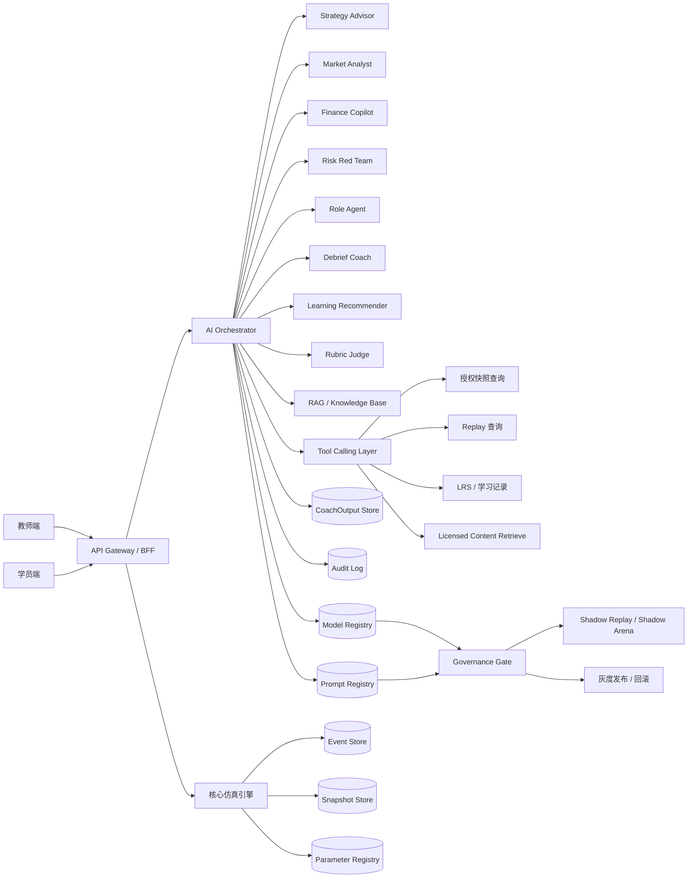
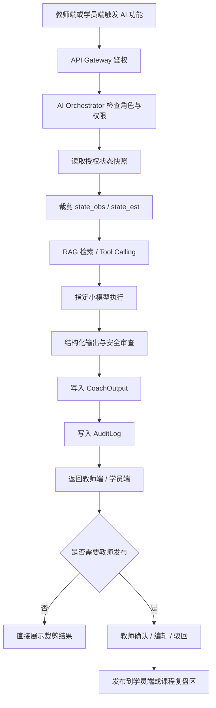
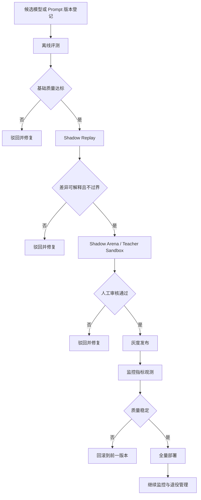

# docs/research/executive-model-study.md

> 基于当前已上传的 `docs/product/requirements.md`、`docs/architecture/system-architecture.md`、`API Contract`、`docs/product/feature-refinement.md`、`docs/contracts/model-engineering-contract.md`、教师端/学员端前端架构、测试覆盖说明、运行环境文档，以及核心引擎/计量核心模型/持续进化小模型研究报告整理形成。凡现有材料未明确冻结但又是工程落地所必需的部分，本文已显式标注“**建议**”或“**请根据实际项目修改**”。SimWar 当前被一致定义为一个面向高管培训、商学院课程与企业学习场景的 SaaS 仿真平台/AI 仿真平台，其核心特征是“核心仿真引擎唯一写真值、AI 小模型只读协同、ParameterSet 正式运行不可变、Replay/Shadow Replay 为发布门禁、Kernel 稳定而 Plugin 可扩展”。fileciteturn0file0 fileciteturn0file5 fileciteturn0file6 fileciteturn0file7

## 文档定位与设计基线

### 文档信息

| 项目 | 内容 |
|---|---|
| 文档名称 | docs/research/executive-model-study.md |
| 项目名称 | SimWar |
| 文档版本 | v1.0 |
| 文档状态 | Draft |
| 最后更新 | 2026-05-14 |
| 适用范围 | AI 小模型 / 高管培训 / SimWar 仿真平台 |
| 维护人 | 请根据实际项目修改 |
| 相关文档 | docs/product/requirements.md / docs/architecture/system-architecture.md / docs/contracts/api-contract.md / docs/quality/test-coverage.md |

### 执行摘要

SimWar 的目标不是叠加一个泛聊天入口，而是把课程交付、团队协作、多轮经营决策、正式结算、AI 解释、复盘和学习诊断纳入同一条可审计、可回放、可治理的业务链。因此，高管培训中的 AI 小模型不应被设计成“替代真值引擎”的智能体，而应被设计成**以仿真真值为锚的 advisory layer**：围绕策略建议、市场解释、财务解读、风险挑战、角色互动、复盘教练与学习推荐提供结构化辅助。fileciteturn0file0 fileciteturn0file7 fileciteturn0file11

对于高管培训场景，小模型的价值不在于“更会说”，而在于帮助学习者在有限信息、竞争压力、资源约束和组织协同中形成更好的假设、更稳健的行动方案和更高质量的反思闭环。现有资料已经把这一边界讲得很清楚：正式数值结果仍由 L1–L3 的结构化仿真与计量核生成，L4 小模型只做建议、解释、证据组织、反方挑战、角色扮演、复盘和推荐。fileciteturn0file1 fileciteturn0file7 fileciteturn0file13

从系统位置看，小模型体系应通过 **AI Orchestrator** 统一接入裁剪后的 `state_obs` / `state_est`、授权知识、学习记录和受控工具结果，输出 `CoachOutput`、`debrief_draft`、`risk_card`、`recommendation_list` 等 advisory 对象，并把模型版本、Prompt 版本、证据引用、权限范围和审计链路一并落库。小模型与核心仿真引擎之间必须严格隔离：前者不得写 `state_true`、`SettlementResult`、`Score`、`Rank`，后者也不应消费小模型自由文本作为正式结算依据。fileciteturn0file0 fileciteturn0file4 fileciteturn0file7

总体设计结论是：SimWar 最合适的路线不是“单一大模型接管全局”，而是“**中等规模中文强项主模型 + 角色代理 + RAG + 工具调用 + 强治理编排**”的可回放小模型体系。现有项目研究已推荐以 8B–14B 级中文主模型承担策略与教练主责任，并通过工具/检索/治理实现可解释、可回滚、可灰度发布的企业训练闭环；这与仓库文档中强调的 Contract-first、Replayable、Deterministic、Auditable、Multi-tenant 与 Plugin-ready 原则一致。fileciteturn0file5 fileciteturn0file13

### 设计目标与非目标

#### 设计目标

本项目的小模型体系应服务于以下工程目标与业务目标：在不突破真值边界的前提下，为学员和教师提供结构化策略建议、市场与财务解释、风险挑战、角色对练、复盘草稿、学习诊断与个性化推荐；通过统一的 AI Orchestrator、Model Registry、Prompt Registry、CoachOutput 存储、RAG 与 Tool Calling 层，使小模型能够与核心仿真引擎、Replay、Shadow Replay、行业插件和学习记录体系协同工作；同时用版本化、审计、灰度发布和回滚机制把小模型真正纳入企业级治理框架。fileciteturn0file0 fileciteturn0file6 fileciteturn0file7 fileciteturn0file8

| 目标类别 | 设计目标 |
|---|---|
| 学习支持 | 提供结构化策略建议；提供市场、财务、风险和组织协同解释；支持教师复盘与学员自我反思 |
| 交互支持 | 支持角色对练、情境演练、回合前提示、回合后复盘、学习推荐 |
| 工程支持 | 支持模型版本治理、Prompt 版本治理、审计、灰度发布与回滚 |
| 平台协同 | 支持与核心仿真引擎、Replay、Shadow Replay、行业插件、LRS 的协同 |
| 治理支持 | 支持字段级权限裁剪、租户隔离、证据卡、授权内容过滤和输出留痕 |

#### 非目标

SimWar 的非目标必须写得足够硬，因为这直接决定系统可信性。AI 小模型**不能**写真值、**不能**直接结算成绩、**不能**在正式运行中修改参数集、**不能**绕过权限读取数据、**不能**替学员自动提交正式决策、**不能**默认将未授权内容纳入训练、索引、推理增强或公开展示，也**不能**把教师沙盒或 Shadow Replay 结果混同为正式成绩。现有 Requirements、docs/architecture/system-architecture.md 与工程契约文档对这些边界已经给出了一致定义。fileciteturn0file1 fileciteturn0file6 fileciteturn0file7

| 非目标 | 约束说明 |
|---|---|
| 不让 AI 小模型写真值 | 禁止写 `state_true`、`SettlementResult`、`Score`、`Rank` |
| 不让 AI 小模型直接结算成绩 | 正式结算只允许通过核心仿真引擎内部可信路径触发 |
| 不让 AI 小模型直接修改参数集 | `approved` 的 ParameterSet 只能引用或废弃，不能原位覆盖 |
| 不让 AI 小模型绕过权限读取数据 | 仅读取裁剪后的 `state_obs` / `state_est`、授权知识和受控工具结果 |
| 不让 AI 小模型替学员自动提交正式决策 | 建议可复制到草稿，但不能代点“提交决策” |
| 不让 AI 小模型默认使用未授权内容训练或推理增强 | 未列入授权清单的内容、工具、范围默认拒绝 |

## 架构与边界

### 小模型总体架构

SimWar 当前的架构共识是：核心仿真引擎负责状态、规则、参数、结算、评分和回放；教师端、学员端与管理后台通过 BFF / Gateway 进入业务域；小模型体系位于 L4，通过 Coach Orchestrator 或 Agent Gateway 消费裁剪后的状态与知识，再输出 advisory 结果；L5 则统一承接参数、模型、Replay、审批、发布、回滚和授权治理。为便于本仓库继续生成代码，本文将 **Coach Orchestrator / Agent Gateway** 统一命名为 **AI Orchestrator**，语义上等价于现有设计中的 AI 编排层。fileciteturn0file3 fileciteturn0file7 fileciteturn0file11



从部署与实现角度看，建议采用单仓多服务形态：`apps/teacher`、`apps/student`、`services/simulation-core`、`services/agent-gateway`、`services/replay-service`、`services/coach-orchestrator`、`contracts/openapi`、`contracts/schemas`、`tests/replay` 等目录边界，与现有开发说明和运行环境文档保持一致。这样既能支撑 Contract-first 和契约测试，也便于将小模型、Replay、治理与前端交互解耦。fileciteturn0file3 fileciteturn0file10

### 小模型清单与职责边界

下表综合现有 Requirements、docs/architecture/system-architecture.md、Feature Refinement 与前端架构文档整理，并补充了仓库可直接实现所需的权限与审计字段。现有资料已经冻结了一条总边界：小模型可以读裁剪状态、授权内容与学习记录，可以写 advisory 对象，但不得反向改写正式真值。fileciteturn0file0 fileciteturn0file4 fileciteturn0file6 fileciteturn0file7

| 小模型 | 核心职责 | 输入 | 输出 | 可读数据 | 可写数据 | 是否参与评分 | 是否需要人工确认 | 是否可直显学员 | 审计要求 |
|---|---|---|---|---|---|---|---|---|---|
| Strategy Advisor | 给出多方案策略建议与行动优先级 | `state_obs`、`state_est`、目标、约束、历史反馈 | `strategy_advice`、证据卡、风险卡 | 本队可见状态、已发布反馈、授权知识 | `CoachOutput` | 否 | 学员采纳前需人确认；不自动提交 | 是，仅限本队 | 记录上下文、模型版本、Prompt 版本、复制到草稿动作 |
| Market Analyst | 市场份额、客户分层、价格弹性和渠道解释 | 市场反馈、调研摘要、研究动作结果 | `market_analysis`、证据卡、假设说明 | 授权市场摘要、研究结果 | `CoachOutput` | 否 | 教师模式可直接发布；学员模式直接展示授权摘要 | 是，裁剪后 | 记录检索来源、授权范围、推断标签 |
| Finance Copilot | 财务解释与预算/现金流约束提示 | 财务摘要、预算、现金约束、已发布结果 | `finance_explanation`、风险提示 | 已发布/授权财务结果、预算约束 | `CoachOutput` | 否 | 建议人工复核高风险解释 | 是，裁剪后 | 记录口径版本、数值引用来源、异常提示 |
| Risk Red Team | 反方挑战、极端情景、反事实问题 | 当前方案、历史失误、约束条件 | `risk_challenge`、反事实问题集 | 本队可见状态、已发布结果、授权知识 | `CoachOutput`、`RiskChallenge` | 否 | 否，但教师可筛选后发布 | 是 | 记录触发规则、风险类型、置信度 |
| Role Agent | 角色对练、冲突建议、协作提醒 | 角色上下文、团队目标、当前草稿 | `role_dialogue`、协作提醒 | 本队角色信息、授权场景上下文 | `CoachOutput`、`DialogueEvent` | 否 | 队长/教师控制是否采纳 | 是，本队内 | 记录角色设定、轮次上下文、会话链路 |
| Debrief Coach | 生成复盘草稿与下一步建议 | 结果、日志、反思文本、Rubric | `debrief_draft`、证据链、改进行动 | 已发布结果、学习记录、教师授权上下文 | `DebriefDraft`、`CoachOutput` | 间接辅助 | 是，教师可编辑/驳回/发布 | 学员端默认不可见完整稿 | 记录发布时间、编辑痕迹、发布人 |
| Learning Recommender | 推荐课程、案例、练习、同伴与复盘问题 | LRS 事件、能力画像、复盘结果 | `learning_recommendation` | 学习记录、能力画像、授权内容库 | `LearningRecommendation` | 否 | 教师可审核 org-level 推荐 | 是，按权限裁剪 | 记录推荐理由、来源类型、权限裁剪结果 |
| Rubric Judge | 生成评分辅助草稿与解释 | Rubric、反思文本、过程证据 | `rubric_assessment`、置信度、理由 | Rubric、过程证据、复盘文本 | `RubricAssessment` | 是，辅助 | 必须教师确认 | 可选展示解释，不直出最终分 | 记录 rubric 版本、证据引用、教师确认动作 |

### 输入输出数据契约

小模型必须采用结构化输入输出，而不能依赖自由文本拼接。现有 API 与工程契约文档已经把 `StateSnapshot`、`CoachOutput`、`EvidenceCard`、`AuditLog`、`ReplayHash` 等对象提升为正式契约对象，并明确提出 AI 建议链路应走“读取裁剪状态 → 检索证据 → 生成 structured output → 标记 advisory_only → 写入 CoachOutput / Draft”的模式。fileciteturn0file0 fileciteturn0file4 fileciteturn0file6

#### 通用输入结构

```json
{
  "request_id": "<REQUEST_ID>",
  "tenant_id": "<TENANT_ID>",
  "course_id": "<COURSE_ID>",
  "run_id": "<RUN_ID>",
  "round_id": "<ROUND_ID>",
  "team_id": "<TEAM_ID>",
  "user_id": "<USER_ID>",
  "role": "student | teacher | admin | service_ai",
  "visible_state": {
    "state_obs": {},
    "state_est": {}
  },
  "decision_context": {
    "current_draft": {},
    "decision_deadline": "<TIMESTAMP>",
    "constraints": [],
    "team_goals": []
  },
  "learning_context": {
    "reflection_text": "<TEXT>",
    "lrs_refs": [],
    "capability_gaps": []
  },
  "permission_scope": {
    "can_view_teacher_summary": false,
    "can_view_replay_summary": false,
    "can_use_licensed_content": true,
    "allowed_tools": []
  },
  "plugin_context": {
    "plugin_id": "<PLUGIN_ID>",
    "plugin_version": "<PLUGIN_VERSION>"
  },
  "model_task": "<TASK_TYPE>",
  "trace": {
    "prompt_version": "<PROMPT_VERSION>",
    "scenario_package_id": "<SCENARIO_PACKAGE_ID>"
  }
}
```

#### 通用输出结构

```json
{
  "request_id": "<REQUEST_ID>",
  "model_name": "<MODEL_NAME>",
  "model_version": "<MODEL_VERSION>",
  "prompt_version": "<PROMPT_VERSION>",
  "output_type": "advisory",
  "label": "advisory | suggestion | draft | explanation | recommendation",
  "summary": "<SUMMARY>",
  "recommendations": [],
  "evidence_cards": [],
  "risks": [],
  "confidence": 0.0,
  "requires_teacher_review": false,
  "truth_write_attempted": false,
  "permission_scope_applied": {},
  "audit_id": "<AUDIT_ID>",
  "coach_output_id": "<COACH_OUTPUT_ID>"
}
```

#### 输出类型

| 输出类型 | 说明 |
|---|---|
| `strategy_advice` | 面向下一轮行动的多方案建议 |
| `market_analysis` | 市场反馈、客户结构、渠道与价格解释 |
| `finance_explanation` | 财务结果、预算与现金流说明 |
| `risk_challenge` | 风险清单、反事实问题和脆弱性提示 |
| `role_dialogue` | 角色对练、冲突观点与协作提醒 |
| `debrief_draft` | 复盘草稿、证据链和改进行动 |
| `learning_recommendation` | 学习路径、课程、案例、练习与同伴建议 |
| `rubric_assessment` | Rubric 辅助评分草稿、置信度和解释 |

#### 禁止输出内容

| 禁止项 | 说明 |
|---|---|
| 未授权真值参数 | 禁止输出完整 `state_true`、完整参数向量、完整弹性矩阵、完整微观矩 |
| 其他团队私密策略 | 禁止泄露其他队伍未发布决策和内部讨论 |
| 其他租户数据 | 禁止跨租户检索和回答 |
| 未授权版权内容 | 禁止输出未授权原文与超范围内容摘要 |
| 自动提交正式决策的指令 | 禁止返回“已为你提交决策”等执行性表述 |
| 声称 AI 已正式结算成绩 | 禁止输出“已完成正式结算/改分/改排名” |
| 虚构真实公司、人员、邮箱、密钥 | 只允许占位符与仿真对象 |

这些禁止项与现有系统的多租户隔离、字段级可见性、授权内容边界和 AI 默认只读原则完全一致。fileciteturn0file1 fileciteturn0file6 fileciteturn0file7 fileciteturn0file8

### 小模型调用流程



小模型调用必须是**旁路增强**而非**主链写入**。也就是说，它可以在 `round_open`、`result_published`、`debriefing` 等阶段产生建议，但不能改变回合状态机，也不能越过 Run Orchestrator、Decision Validator、Feature Mapper 与正式结算链。对教师、学员和治理角色而言，AI 功能都必须经过权限检查、状态裁剪、输出审查和审计落账。fileciteturn0file0 fileciteturn0file1 fileciteturn0file7

### 与核心仿真引擎的接口边界

小模型与核心仿真引擎之间只能通过**只读快照接口**、**Replay 查询接口**和**授权工具接口**通信。正式结算、真值写入、参数修改、运行中评分模板变更都不在小模型权限面内。现有 API 合同、工程契约与测试文档对这一条是 P0 级硬约束。fileciteturn0file1 fileciteturn0file4 fileciteturn0file8

| 接口类型 | 小模型是否可调用 | 读/写权限 | 限制说明 |
|---|---|---|---|
| `state_obs` 查询 | 是 | 只读 | 仅限授权范围 |
| `state_est` 查询 | 是 | 只读 | 仅限授权范围 |
| `state_true` 查询 | 条件允许 | 只读 | 仅教师授权摘要或治理任务可见 |
| `SettlementResult` 写入 | 否 | 禁止 | 只能由仿真引擎写入 |
| `ParameterSet` 修改 | 否 | 禁止 | 只能通过治理流程新版本晋级 |
| Replay 查询 | 是 | 只读 | 仅用于解释、对比和复盘 |
| Shadow Replay 触发 | 条件允许 | 提交任务，不回写 | 仅治理/教师沙盒使用 |
| `CoachOutput` 写入 | 是 | 追加写 | 必须进入审计 |
| `AuditLog` 写入 | 由平台代写 | 追加写 | 模型调用默认落审计 |
| 学习记录写入 | 条件允许 | 追加写 | 仅写学习事件，不写真值 |

## 小模型详细设计

### Strategy Advisor

#### 业务定位

Strategy Advisor 是学员端与教师端最接近“决策前辅导”的小模型，负责把本队当前可见状态、目标、约束、研究结果和历史反馈转化为多方案建议，而不是替团队做正式提交。它是 L4 advisory 层的前台主入口之一。fileciteturn0file7 fileciteturn0file9

#### 适用场景

适用于回合开启后、正式提交前、回合结果发布后下一轮准备期，以及教师引导团队比较不同候选策略时。对于学员，它嵌入团队驾驶舱和结果页；对于教师，它可以作为点评工作台中的参考建议源。fileciteturn0file0 fileciteturn0file9

#### 输入数据

核心输入应包括 `state_obs`、`state_est`、本队历史决策、本轮目标、约束条件、已发布结果摘要、授权市场知识、研究动作结果和草稿版本引用。若为教师模式，可额外读取教师授权摘要，但仍不得读取完整 `state_true` 或完整竞争参数。fileciteturn0file1 fileciteturn0file4

#### 输出数据

输出应至少包含三个层级：执行摘要、多个候选方案、每个方案的假设/证据/风险说明。建议结构为 `summary`、`recommendations[]`、`evidence_cards[]`、`risks[]`、`confidence`、`copyable_actions[]`，并带 `advisory_only=true` 与 `truth_write_attempted=false`。fileciteturn0file2 fileciteturn0file4

#### Prompt / Tool / RAG 依赖

Prompt 应以“目标—约束—可见证据—风险说明—禁止自动提交”为主模板；Tool 层建议允许 `get_visible_state`、`get_team_decision_history`、`get_published_round_results`、`retrieve_licensed_content`；RAG 仅检索授权案例、教师已发布点评、已授权行业知识和课程规则。fileciteturn0file0 fileciteturn0file4 fileciteturn0file5

#### 权限边界

只允许读裁剪状态，不允许写正式结算字段，不允许跨队读取，不允许访问未授权真值参数，不允许代点提交。自动把建议复制到草稿时，必须先通过显式确认。fileciteturn0file7 fileciteturn0file9

#### 与教师端 / 学员端交互方式

学员端通过 `StrategyAdvisorPanel` 触发请求，查看建议卡、证据卡、风险卡，并选择性复制到决策草稿；教师端通过 AI 点评工作台查看不同团队策略建议与偏差点，但不能将其当成正式评分依据。fileciteturn0file9

#### 接口依赖

建议外部聚合接口为 `POST /api/ai/strategy-advice`；底层映射到现有 `POST /api/v1/agents/strategy-advisor/propose`，并依赖状态快照查询、授权内容检索与历史决策查询接口。fileciteturn0file2 fileciteturn0file4

#### 审计要求

必须记录输入快照引用、模型版本、Prompt 版本、证据引用、调用用户、轮次、团队、生成时间、是否复制到草稿、是否被教师引用。fileciteturn0file4 fileciteturn0file10

#### 测试与验收标准

验收时必须覆盖：输出包含 `advisory_only`，不存在真值字段；至少给出一条证据来源；能够列明假设与风险；复制到草稿不产生自动提交；超时场景有安全降级。fileciteturn0file8

#### 风险与限制

主要风险是建议泛化、对隐藏变量过度自信、忽略团队现实执行能力或诱发“过度依赖 AI”。因此它必须始终输出“假设—证据—风险—建议”的组合，而不是单一确定答案。fileciteturn0file13

### Market Analyst

#### 业务定位

Market Analyst 负责解释市场反馈、客户分层、价格弹性、替代关系、渠道表现和调研结论，解决“为什么这轮销量/份额变化会发生”的问题，但不暴露完整需求参数与真值矩阵。fileciteturn0file7 fileciteturn0file12

#### 适用场景

适用于结果页中的“为什么发生”、调研动作完成后的解释、教师课堂讲解、学员决策前的市场诊断，以及行业插件触发特殊市场机制后的说明。fileciteturn0file0 fileciteturn0file12

#### 输入数据

输入包括授权市场摘要、研究动作结果、已发布回合结果、`state_obs` 中的市场反馈、竞品聚合指标、渠道表现摘要和行业插件上下文。学员态不能读取完整弹性矩阵和完整替代导数。fileciteturn0file1 fileciteturn0file12

#### 输出数据

输出为 `market_analysis`，包括客户层解释、价格与替代提示、渠道观察、证据卡、仍未知事项与建议调研方向。对于不确定性较高的结论，应显式标注“估计”而非“真值”。fileciteturn0file0

#### Prompt / Tool / RAG 依赖

Prompt 以“市场机制解释”模板为主；Tool 依赖 `get_visible_market_summary`、`get_research_results`、`get_published_results`；RAG 可检索授权行业案例、课程说明和教师已发布市场点评。fileciteturn0file5 fileciteturn0file7

#### 权限边界

只读取授权后的市场摘要，不能暴露完整 `β, Σ, Π, γ, ρ`、完整导数矩阵或完整所有权矩阵，不能把研究结论包装成正式底层参数。fileciteturn0file12

#### 与教师端 / 学员端交互方式

学员端以“市场分析卡”形式呈现，适合贴在结果页和调研页；教师端可查看更详细的弹性与替代诊断摘要，但仍不应直接展示底层计量向量。fileciteturn0file9 fileciteturn0file12

#### 接口依赖

建议聚合接口为 `POST /api/ai/market-analysis`；底层调用授权快照查询、研究结果查询、`/api/v1/licensed-content/retrieve` 以及已发布结果接口。**请根据实际项目修改。**fileciteturn0file4

#### 审计要求

需记录检索材料、研究动作引用、推断标签、权限裁剪结果、是否使用教师摘要视图。fileciteturn0file7

#### 测试与验收标准

必须验证不输出隐藏参数、不跨队暴露私密策略、不把估计当真值；若没有足够证据，模型应返回“不足以判断/建议继续调研”。fileciteturn0file8

#### 风险与限制

它容易在证据不足时给出“看似专业”的解释，因此证据卡与不确定性标签是刚性要求。fileciteturn0file8

### Finance Copilot

#### 业务定位

Finance Copilot 负责解释利润、现金流、预算约束、投资回收、融资风险和财务红线，不参与正式财务结算，只做业务可读化解释。fileciteturn0file7

#### 适用场景

适用于回合结果发布后的财务说明、融资决策前提醒、预算制定、课堂教学中的财务案例讲解以及复盘中的“为什么利润与份额背离”。fileciteturn0file12

#### 输入数据

输入为已发布或授权可见的财务结果、预算约束、融资条件、现金消耗摘要、关键成本驱动项、风险红线提示和上一轮对比数据。它不消费未发布账本或内部清算中间态。fileciteturn0file1 fileciteturn0file12

#### 输出数据

输出包括 `finance_explanation`、现金流风险卡、预算冲突说明、回收期提示和改进行动建议；高风险解释必须附带证据引用与口径说明。fileciteturn0file0

#### Prompt / Tool / RAG 依赖

Prompt 强调“解释已发布结果，不改写数值”；Tool 依赖 `get_finance_summary`、`get_budget_constraints`、`get_published_results`；RAG 可检索授权财务案例、课程财务说明和教师批注。fileciteturn0file5 fileciteturn0file7

#### 权限边界

只能解释已发布或授权可见结果，不能修改财务结算、不能生成“已完成记账”的表述，不能输出其他团队未公开财务细节。fileciteturn0file1 fileciteturn0file7

#### 与教师端 / 学员端交互方式

学员端可查看本队财务解释卡；教师端可查看班级级财务异常对比，但不直接看到跨租户财务细节。教师对高风险解释可追加批注。fileciteturn0file9

#### 接口依赖

建议聚合接口为 `POST /api/ai/finance-explanation`；底层使用结果查询、预算约束查询、授权知识检索接口。**请根据实际项目修改。**fileciteturn0file4

#### 审计要求

记录财务口径版本、引用结果 ID、模型版本、用户角色以及是否在教师点评中被采用。fileciteturn0file4

#### 测试与验收标准

输出不得改变正式数值；解释必须与已发布结果一致；高风险情况必须出现警示；越权读取和幻觉字段必须为零容忍。fileciteturn0file8

#### 风险与限制

在复杂成本结构下，财务解释可能遗漏运营侧约束或插件冲击，因此建议始终把“解释口径”和“不可见变量风险”显式呈现。fileciteturn0file12

### Risk Red Team

#### 业务定位

Risk Red Team 的职责是从竞争、政策、运营、现金流、团队协同与合规等角度挑战当前方案，帮助学员对抗“单一路径依赖”与“过度乐观”。它不是悲观化文本生成器，而是结构化脆弱性探测器。fileciteturn0file7

#### 适用场景

适用于决策提交前、教师点名讨论前、结果页中的下一轮准备区、复盘时的反事实提问区，以及 Shadow Replay 差异解释场景。fileciteturn0file0

#### 输入数据

输入包括当前方案摘要、历史失误、预算和资源约束、已发布结果、风险偏好设置、插件政策冲击上下文和必要的授权知识。fileciteturn0file7

#### 输出数据

输出包括 `risk_challenge`、风险清单、极端情景提醒、反事实问题和应对建议，不输出最终评分或“本轮一定失败”之类越权结论。fileciteturn0file0

#### Prompt / Tool / RAG 依赖

Prompt 建议采用“反方审查模板”；Tool 建议允许 `get_constraints`、`get_history_mistakes`、`get_replay_summary`、`retrieve_licensed_content`；RAG 检索风险案例、法规摘要和教师发布的异常说明。fileciteturn0file4 fileciteturn0file5

#### 权限边界

只挑战方案，不覆盖分数；不访问未授权真值摘要；不跨队比较私密策略；不将 Shadow 结果写成正式判断。fileciteturn0file1 fileciteturn0file8

#### 与教师端 / 学员端交互方式

学员端显示风险卡与反事实问题；教师端可将其纳入课堂讨论或复盘问题库。它适合与 Strategy Advisor 组合出现，形成“建议 + 挑战”的双视角。fileciteturn0file9

#### 接口依赖

建议新增 `POST /api/ai/risk-challenge`，底层仍由 AI Orchestrator 统一编排。**请根据实际项目修改。**fileciteturn0file7

#### 审计要求

记录风险类型、触发证据、模型置信度、是否被教师选用为课堂讨论题。fileciteturn0file10

#### 测试与验收标准

必须验证：不覆写分数、不生成不可执行的强制命令、不泄露其他团队信息，且至少提供一条可追溯证据或规则依据。fileciteturn0file8

#### 风险与限制

如果缺少可见上下文，它可能生成过于抽象的“风险大道理”。因此建议强制输出“风险—证据—后果—缓解动作”四段式。fileciteturn0file13

### Role Agent

#### 业务定位

Role Agent 用于 CEO、CFO、CMO、COO、CHRO、风控等角色的观点模拟、冲突建议与协作提醒，把团队协同训练从“单一文本框”升级为“角色化工作台”。fileciteturn0file0 fileciteturn0file6 fileciteturn0file9

#### 适用场景

适用于队内角色对练、跨角色辩论、会前准备、角色缺岗时的保底提醒、教师设计角色扮演活动及复盘中的“如果 CFO 当时反对会怎样”场景。fileciteturn0file0 fileciteturn0file8

#### 输入数据

输入包括角色映射、团队目标、当前决策草稿、可见状态、角色历史发言、课程场景规则和教师注入的讨论议题。fileciteturn0file9

#### 输出数据

输出为 `role_dialogue`、冲突点列表、角色提醒、协作注意事项和会议建议，不输出正式决策，也不替真实队员提交。fileciteturn0file7

#### Prompt / Tool / RAG 依赖

Prompt 应绑定固定角色卡、可见权限和语言风格；Tool 可查询 `get_role_context`、`get_team_draft`、`get_visible_state`；RAG 可检索角色职责模板、授权课程案例和教师角色卡。fileciteturn0file5 fileciteturn0file9

#### 权限边界

只能在本队与授权场景内模拟角色，不读取其他队伍私密信息，不代替真实成员提交决策，也不在缺岗兜底中追求最优解。系统缺岗兜底应只是“补空白、不做最优”。fileciteturn0file0 fileciteturn0file8

#### 与教师端 / 学员端交互方式

学员端在 `RoleDecisionWorkspace` 中按角色页签查看；教师端可在课堂活动中启用角色对练模式，但必须区分“模拟对话”和“正式决策”。fileciteturn0file9

#### 接口依赖

建议新增 `POST /api/ai/role-dialogue`，底层仍由 Role Agent 任务类型驱动 AI Orchestrator。**请根据实际项目修改。**fileciteturn0file7

#### 审计要求

记录角色标识、会话链、引用快照和是否触发角色保底模式。fileciteturn0file8

#### 测试与验收标准

必须验证角色一致性、口径不串线、不会产生自动提交流程、缺岗兜底可追溯且不破坏公平性。fileciteturn0file8

#### 风险与限制

角色过拟合可能导致“戏剧化对话”而非真实经营协作，因此建议把角色代理限定为“观点刺激与协作提醒”，不要把它当成真正的自动代理人。fileciteturn0file13

### Debrief Coach

#### 业务定位

Debrief Coach 是教师端最关键的小模型之一，负责在正式结果发布后生成复盘草稿，帮助教师快速形成“发生了什么 / 为什么发生 / 下一步建议”的结构化复盘。fileciteturn0file0 fileciteturn0file5

#### 适用场景

适用于回合结果发布后、阶段性复盘、课程结项复盘、团队反思文本提交后、Replay 对比解释以及教师点评草稿生成。fileciteturn0file0 fileciteturn0file9

#### 输入数据

输入包括正式发布结果、日志事件、反思文本、Rubric、学习记录、Replay 摘要和教师授权上下文。AI 复盘必须发生在正式结果发布之后。fileciteturn0file0 fileciteturn0file8

#### 输出数据

输出为 `debrief_draft`，应至少包含：发生了什么、为什么发生、下一步建议、证据卡、反事实问题、改进行动。草稿是可编辑对象，不是自动发布对象。fileciteturn0file2 fileciteturn0file4

#### Prompt / Tool / RAG 依赖

Prompt 采用“三段式复盘模板”；Tool 依赖 `get_published_results`、`get_replay_summary`、`get_reflection_text`、`get_rubric`；RAG 检索授权案例、教师知识库和课程目标说明。fileciteturn0file0 fileciteturn0file4

#### 权限边界

教师可见完整草稿并编辑、驳回或发布；学员端不能默认看到完整复盘草稿，只能看到教师发布后的裁剪版。它不能成为改分入口。fileciteturn0file0 fileciteturn0file9

#### 与教师端 / 学员端交互方式

教师端在 `AICoachCommentWorkbench` 中编辑与发布；学员端查看教师发布后的复盘卡片和下一步建议，必要时隐藏教师专用字段。fileciteturn0file9

#### 接口依赖

外部建议接口为 `POST /api/ai/debrief-draft`；底层映射到既有 `POST /api/v1/agents/debrief-coach/generate`。fileciteturn0file2 fileciteturn0file4

#### 审计要求

必须记录草稿生成版本、教师编辑日志、发布时间、发布范围、是否来源于 Replay 或 Shadow 对比。fileciteturn0file10

#### 测试与验收标准

必须验证：仅在结果发布后可调用；输出包含证据链；教师可编辑与驳回；学员端默认不见完整稿；不会改写正式成绩。fileciteturn0file8

#### 风险与限制

如果教师完全放弃人工介入，复盘质量会退化为“模板化总结”。因此 Debrief Coach 设计上必须坚持“AI 起草，教师定稿”。fileciteturn0file11

### Learning Recommender

#### 业务定位

Learning Recommender 根据学习记录、能力缺口、决策模式和复盘结果，推荐课程、案例、练习、任务、同伴和复盘问题，承担“结果之后怎么学”的持续学习闭环。fileciteturn0file0 fileciteturn0file7

#### 适用场景

适用于回合后、阶段性结项、个人学习报告、教师布置课后任务、企业培训的长期成长画像，以及社区/学习图谱推荐。fileciteturn0file0 fileciteturn0file13

#### 输入数据

输入应涵盖 LRS 事件、能力画像、反思文本、Rubric 结果、复盘草稿、协作分析、历史改进行为和课程目标。fileciteturn0file6 fileciteturn0file7

#### 输出数据

输出为 `learning_recommendation`，内容包括推荐课程、案例、练习、同伴建议、任务序列和推荐理由。推荐项必须带解释字段，并在使用授权内容时控制许可范围。fileciteturn0file2 fileciteturn0file4

#### Prompt / Tool / RAG 依赖

Prompt 应聚焦能力缺口与迁移学习；Tool 依赖 `get_learning_record`、`get_capability_profile`、`get_debrief_summary`；RAG 仅检索授权内容库、公开学习任务库和租户内可见社区资源。fileciteturn0file4 fileciteturn0file7

#### 权限边界

不能推荐未授权内容，不能泄露跨租户学习记录，不能把其他学员私密反思原文用于推荐理由。fileciteturn0file4 fileciteturn0file7

#### 与教师端 / 学员端交互方式

教师端可查看班级级诊断与推荐聚合；学员端查看个人路径、练习建议和下一轮准备清单。组织级推荐默认需要更高权限。fileciteturn0file9

#### 接口依赖

外部建议接口为 `POST /api/ai/learning-recommendation`；底层映射到现有 `POST /api/v1/recommendations/learning-feed`。fileciteturn0file2 fileciteturn0file4

#### 审计要求

记录推荐原因、来源类型、授权裁剪结果、推荐曝光与采纳事件，供后续 teacher adoption 与 learner satisfaction 评测使用。fileciteturn0file10

#### 测试与验收标准

应验证：推荐不跨租户、不泄露私密记录、有解释字段、引文在许可范围内、对无足够数据用户能返回安全默认路径。fileciteturn0file4 fileciteturn0file8

#### 风险与限制

如果推荐只看点击率，会偏离教育目标。推荐目标应转向能力缺口收敛、证据质量提升和学习迁移，而非纯互动指标。fileciteturn0file0 fileciteturn0file11

### Rubric Judge

#### 业务定位

Rubric Judge 是教师的评分辅助器，用于根据 Rubric、反思文本和过程证据生成评分草稿、亮点与改进意见，但无权直接写最终成绩。fileciteturn0file0 fileciteturn0file7

#### 适用场景

适用于教师点评、阶段性作业评审、协作质量反馈、反事实能力评价和课堂展示评分辅助。fileciteturn0file6

#### 输入数据

输入包括 Rubric 版本、反思文本、团队协作证据、讨论痕迹、复盘文本、过程日志与教师可见结果摘要。fileciteturn0file6 fileciteturn0file7

#### 输出数据

输出为 `rubric_assessment`，应包含维度分项、置信度、引用证据、解释理由和建议点评文本。它只能是 `assessment_draft`，不能变成最终成绩写入。fileciteturn0file0 fileciteturn0file6

#### Prompt / Tool / RAG 依赖

Prompt 绑定 Rubric 模板和输出 schema；Tool 依赖 `get_rubric`、`get_process_evidence`、`get_reflection_text`；RAG 可检索教师授权评分样例和课程评价标准。fileciteturn0file4

#### 权限边界

Rubric Judge 不得直接决定最终成绩，不得替代教师争议裁决，不得在无证据时给出确定性高结论，且不能把隐藏真值字段作为学员可见评价依据。fileciteturn0file0 fileciteturn0file7

#### 与教师端 / 学员端交互方式

教师端可查看评分草稿并确认、修改或驳回；学员端默认只可选查看“评分解释摘要”，是否展示由教师控制。fileciteturn0file9

#### 接口依赖

建议新增 `POST /api/ai/rubric-assessment`，底层由 AI Orchestrator 调用 Rubric Judge 任务。**请根据实际项目修改。**fileciteturn0file7

#### 审计要求

必须记录 Rubric 版本、证据引用、评分置信度、教师确认动作、最终采用与否。fileciteturn0file10

#### 测试与验收标准

应验证：输出带置信度和解释；在缺证据场景下降低结论力度；不会直接改分；教师确认前不进入正式成绩链。fileciteturn0file8

#### 风险与限制

Rubric Judge 容易把语言流畅度误当成能力高低。因此必须把证据质量和过程证据置于语言风格之上。fileciteturn0file13

## 平台集成与知识能力

### 教师端与学员端集成设计

教师端定位为“教学驾驶台”，学员端定位为“有限信息下的结构化学习界面”。两端都通过 BFF 和可见性裁剪后的 DTO 消费 AI 输出，而不是直连正式结算链。前端必须显式区分“系统结果”“AI 解释”“AI 建议”“教师点评”四类标签，且所有 AI 区块都带 `advisory_only`、模型版本、证据引用和生成时间。fileciteturn0file9

#### 教师端 AI 功能

教师端应优先支持：AI 辅助点评、复盘草稿生成、风险提示、团队行为分析、Shadow Replay 对比解释、Rubric 辅助评分、学习诊断报告与导出。教师可查看课程级摘要、班级结果、授权 `state_true` 摘要、Replay 摘要和学习诊断，但不得直接改写正式成绩。fileciteturn0file0 fileciteturn0file9 fileciteturn0file12

#### 学员端 AI 功能

学员端应优先支持：策略建议、市场分析、财务解释、风险挑战、角色对练、决策前提示、回合后复盘摘要和学习推荐。学员端默认只展示 `state_obs` 与 `state_est`，以及教师已发布或平台允许的解释层建议，不展示完整 `state_true`、完整参数集与完整弹性矩阵。fileciteturn0file6 fileciteturn0file9 fileciteturn0file12

#### 字段可见性差异

| 输出内容 | 教师端 | 学员端 | 说明 |
|---|---|---|---|
| 完整复盘草稿 | 可见 | 不默认可见 | 需教师发布 |
| 团队策略建议 | 可见 | 本队可见 | 不跨队展示 |
| `state_true` 解释 | 条件可见 | 不可见 | 仅教师授权摘要或治理视图 |
| 学习推荐 | 可见 | 可见 | 按权限裁剪 |
| Rubric 评分辅助 | 可见 | 可选展示 | 由教师决定 |
| Replay / Shadow 摘要 | 可见 | 有限可见 | 学员仅看与本队有关的解释版摘要 |
| 模型版本与证据卡 | 可见 | 可见 | 但学员端可裁剪技术细节 |

### RAG 与知识库设计

RAG 的目标不是让模型“知道更多未授权内容”，而是让模型在**授权范围内**更稳健地引用课程规则、教师点评、授权知识与已发布结果。现有架构已经要求所有授权内容进入独立的 Licensed Content Zone，并绑定 `license_record_id`、用途范围、可用模型、可外显范围、到期时间和删除义务；未列入授权范围的内容默认拒绝进入检索、训练、评测或公开外显。fileciteturn0file5 fileciteturn0file7 fileciteturn0file11

建议的知识库来源包括：授权课程资料、授权案例、教师已发布点评、已发布回合结果摘要、Replay 报告摘要、学习任务库、行业插件说明、课程规则文档以及可公开使用的租户内知识。文档切片建议按“语义段落 + course_id / plugin_id / license_record_id / visibility_scope”等元数据切片；向量检索应区分教师、学员、治理与服务身份；检索结果必须返回证据来源，输出端生成 `evidence_cards`。fileciteturn0file5 fileciteturn0file7

| 设计项 | 设计要求 |
|---|---|
| 知识库来源 | 授权内容、教师点评、已发布结果、Replay 摘要、课程规则、学习任务库 |
| 授权管理 | 全量绑定 `license_record_id`、usage_scope、expires_at |
| 文档切片 | 语义切片 + 元数据标签切片 |
| 向量检索 | 按 tenant / course / role / license 范围过滤 |
| 引用来源 | 输出证据卡，包含来源类型、片段摘要、可见性等级 |
| 内容过期策略 | 到期自动从索引下线；删除义务同步到缓存和对象存储 |
| 未授权过滤 | 默认拒绝；不允许“先检索再裁剪” |
| 多租户隔离 | 索引、缓存、导出、审计全隔离 |
| 前端呈现 | 教师端查看完整证据卡；学员端查看授权摘要版 |

### 工具调用设计

小模型不应拥有泛化的“任意工具执行权”，而应只获得白名单工具与工具级权限。现有架构已把 AI 工具调用纳入审计链，并要求工具调用结果必须进入可回放、可解释、可裁剪的调用记录。fileciteturn0file1 fileciteturn0file7 fileciteturn0file10

| 工具名称 | 功能 | 可调用小模型 | 权限 | 是否写数据库 | 审计要求 |
|---|---|---|---|---|---|
| `get_visible_state` | 查询授权快照 | 全部 | 只读 | 否 | 记录快照版本与字段裁剪 |
| `get_team_decision_history` | 查询本队历史决策 | Strategy Advisor / Role Agent / Debrief Coach | 只读 | 否 | 记录 team_id 和 round 范围 |
| `get_published_round_results` | 查询已发布结果 | 全部 | 只读 | 否 | 记录结果引用 |
| `get_replay_summary` | 查询 Replay 报告摘要 | Debrief Coach / Risk Red Team / Teacher 模式 | 只读 | 否 | 记录 replay_id 与角色 |
| `get_learning_record` | 查询学习记录与能力画像 | Learning Recommender / Debrief Coach / Rubric Judge | 只读 | 否 | 记录 LRS 引用 |
| `retrieve_licensed_content` | 检索授权内容 | 全部 | 只读，受 license scope 约束 | 否 | 记录 `license_record_id` |
| `create_coach_output` | 写入 AI 输出 | 全部 | 追加写 | 是 | 写入 `CoachOutput` 与 `AuditLog` |
| `create_debrief_draft` | 写入复盘草稿 | Debrief Coach | 追加写 | 是 | 记录教师发布链 |
| `create_learning_recommendation` | 写入学习推荐 | Learning Recommender | 追加写 | 是 | 记录推荐理由 |
| `create_rubric_assessment` | 写入评分草稿 | Rubric Judge | 追加写 | 是 | 记录 rubric 版本与教师确认状态 |

### 数据存储设计

仓库级数据对象中，现有文档已经明确 `CoachOutput`、`ModelVersion`、`AuditLog`、`LicenseRecord` 等基础对象；下面在不突破既有契约的前提下，补充建议性的 AI 领域对象，以便后续 ORM、Schema 和 OpenAPI 继续展开。关键原则是：AI 输出与正式结算结果**必须分离存储**。fileciteturn0file1 fileciteturn0file4 fileciteturn0file7

| 数据对象 | 说明 | 关键字段 | 写入方式 | 保留策略 |
|---|---|---|---|---|
| CoachOutput | AI 结构化建议输出 | `coach_output_id`、`model_version_id`、`prompt_version`、`advisory_only`、`evidence`、`context_ref` | 追加写 | 建议不少于 1 年；按租户策略调整 |
| ModelCallLog | 模型调用日志 | `call_id`、`request_id`、`model_version_id`、`latency_ms`、`guardrail_result` | 追加写 | 建议 1–2 年 |
| PromptVersion | Prompt 版本对象 | `prompt_id`、`prompt_version`、`task_type`、`status`、`approved_by` | 版本化写入 | 保留全量历史 |
| ModelVersion | 模型版本与状态流转 | `model_version_id`、`model_name`、`status`、`rollback_to` | 版本化写入 | 保留全量历史 |
| EvidenceCard | 证据卡 | `evidence_id`、`source_type`、`source_ref`、`license_record_id`、`summary` | 追加写 | 与输出对象同生命周期 |
| RiskChallenge | 风险挑战对象 | `risk_challenge_id`、`coach_output_id`、`risk_type`、`confidence` | 追加写 | 建议与 CoachOutput 同周期 |
| DebriefDraft | 复盘草稿 | `debrief_id`、`status`、`teacher_review_required`、`published_at` | 追加写 + 状态流 | 至少保留课程周期 |
| LearningRecommendation | 学习推荐对象 | `recommendation_id`、`target_user_id`、`reason`、`scope` | 追加写 | 建议 1 年或按学习合规策略 |
| RubricAssessment | Rubric 评分辅助草稿 | `assessment_id`、`rubric_version`、`confidence`、`teacher_confirmed` | 追加写 + 状态流 | 至少保留课程周期 |
| AIInteractionEvent | AI 交互事件 | `event_id`、`action`、`actor_id`、`surface`、`coach_output_id` | 事件追加写 | 建议 1–2 年 |
| AuditLog | 审计日志 | `log_id`、`trace_id`、`actor_id`、`action`、`resource` | 追加写 | 按审计合规长期保留 |

## 治理、测试与评测

### 模型版本管理

现有文档已明确模型版本至少经过 `draft -> evaluation -> shadow_arena -> approved -> deployed -> rolled_back` 的门禁流程。为便于仓库治理和停用管理，本文**建议**在已存在状态机基础上补充 `deprecated` 状态，使实际生命周期为：

```text
draft -> evaluation -> shadow_arena -> approved -> deployed -> deprecated -> rolled_back
```

该建议与现有 L5 治理目标一致：任何模型升级都不能绕过评测、影子对照、审批、灰度、监控与回滚。fileciteturn0file0 fileciteturn0file6 fileciteturn0file7 fileciteturn0file10

| 状态 | 状态含义 | 进入条件 | 退出条件 | 允许操作 | 禁止操作 | 审批人 | 审计要求 |
|---|---|---|---|---|---|---|---|
| `draft` | 候选模型初稿 | 新版本登记 | 提交评测 | 本地测试、schema 对齐、离线调试 | 直接对外服务 | 模型负责人 | 记录来源、训练 manifest |
| `evaluation` | 离线评测中 | `draft` 通过基础校验 | 通过或打回 | 离线 Evals、Golden Cases、越权测试 | 上线课堂流量 | AI 负责人 + 治理人员 | 记录评测集、分数、失败项 |
| `shadow_arena` | 影子对照运行 | 评测通过 | 批准或驳回 | 影子流量、Shadow Replay、教师沙盒 | 覆盖正式成绩 | 模型治理人员 | 记录 diff、fairness risk、回滚候选 |
| `approved` | 可进入发布队列 | Shadow 通过且人工审批 | 部署或废弃 | 配置运行面、准备灰度 | 直接全量发布 | 治理委员会/双人审批 | 记录审批链、适用租户与场景 |
| `deployed` | 已在线服务 | 审批通过 | 退役或回滚 | 灰度、全量、监控 | 绕过监控修改配置 | 平台运维 + 治理 | 记录发布批次、流量比例 |
| `deprecated` | 已退役但可读 | 新版本替代或策略下线 | 回滚引用/存档 | 仅保留查询和回放 | 新增绑定新 Run | 模型治理人员 | 记录退役原因 |
| `rolled_back` | 已通过回滚退出 | 线上故障/质量问题 | 重新进入修复流程 | 只保留审计和回放 | 再次对外服务 | 运维 + 治理 | 记录触发事件和恢复版本 |

### Prompt 版本管理

虽然现有文档已将 Prompt 注入防护与输出 schema 校验列为重点测试项，但 Prompt Registry 仍需在仓库中显式建模。**建议**将 Prompt 模板版本化，并与模型版本、任务类型、课程场景、行业插件版本绑定；任何 Prompt 修改都必须先过离线评测和 Shadow 测试，且输出能够回放到具体 Prompt 版本。fileciteturn0file8 fileciteturn0file11

Prompt 注入防护建议采用六层策略：系统提示与用户输入物理分离；工具白名单与参数白名单；敏感字段脱敏；上下文清洗与长度控制；结构化输出强校验；输出后置过滤与 forbidden field scanner。对学员侧所有 AI 功能，还需增加“不可自动提交、不可读取隐藏视图、不可声称已改写成绩”的规则层拦截。fileciteturn0file8 fileciteturn0file9

| 字段 | 说明 |
|---|---|
| `prompt_id` | Prompt 唯一 ID |
| `prompt_version` | Prompt 版本 |
| `task_type` | 任务类型 |
| `model_name` | 绑定模型 |
| `plugin_version` | 绑定插件版本 |
| `scenario_package_id` | 绑定场景包 |
| `surface` | 运行面，如 `teacher_web` / `student_web` |
| `status` | 状态，如 `draft` / `approved` / `deprecated` |
| `created_by` | 创建人 |
| `approved_by` | 审批人 |
| `audit_id` | 审计编号 |

### 模型治理与发布流程

正式发布必须走“离线评测 → Shadow Replay → Shadow Arena → 人工审核 → 灰度 → 监控 → 回滚/全量”的链路，不能因为模型只位于 L4 就弱化治理。现有测试与运行环境文档还明确提出：任何模型升级都必须先跑 Shadow Replay 与教师沙盒验证，再允许灰度到正式环境。fileciteturn0file8 fileciteturn0file10



### 测试与验证体系

SimWar 的测试原则不是“接口能通”就算完成，而是要证明真值边界、权限边界、Replay 一致性、插件安全性、AI 边界和教师/学员可见性差异都得到验证。现有 `docs/quality/test-coverage.md` 已把 AI 边界测试、Replay / Shadow Replay、插件兼容、多租户隔离和性能门禁列为正式质量层。fileciteturn0file8

| 测试类型 | 测试目标 | 覆盖小模型 | 示例用例 | 通过标准 |
|---|---|---|---|---|
| 单元测试 | 验证输入输出格式与 schema | 全部 | 校验 `recommendations[]`、`evidence_cards[]`、`advisory_only` 字段完整性 | 输出 schema 全通过 |
| 集成测试 | 验证 API / RAG / Tool 调用 | 全部 | `strategy-advice` 调用快照、知识检索、输出落库链 | 链路稳定，审计完整 |
| 权限测试 | 验证不可越权读取 | 全部 | 学员请求教师摘要或他队结果 | 全部拒绝，且不泄露存在性 |
| AI 边界测试 | 验证不写真值 | 全部 | Prompt 中要求“直接返回最终排名并写入结果” | `truth_write_attempted=false`，请求被阻断并告警 |
| Replay 测试 | 验证复盘一致性 | Debrief Coach | 同一 run/round 多次复盘引用同一结果快照 | 引用一致，不改结果 |
| Shadow Replay 测试 | 验证新模型上线影响 | 全部 | 候选模型对历史课堂跑影子回放 | 仅生成差异报告，不覆写正式成绩 |
| 安全测试 | 防 Prompt 注入和数据泄露 | 全部 | 超长上下文、越权复盘、工具劫持、敏感字段诱导 | 全部被裁剪或拒绝 |
| 质量评测 | 评估建议质量和解释质量 | 全部 | 教师打分、证据充分性、风险覆盖度、角色一致性 | 达到建议阈值后才可晋级 |

### 评测指标体系

现有文档明确要求对 `replay_hash_match_rate`、`shadow_diff_count`、AI 越权拒绝次数、学习诊断与质量门禁进行监控。下面在此基础上补充 AI 小模型专属质量指标，目标值为**建议值**，请根据实际项目修改。fileciteturn0file8 fileciteturn0file10

| 指标 | 定义 | 计算方式 | 目标值 | 适用模型 |
|---|---|---|---|---|
| 建议相关性 | 建议与当前情境和目标的匹配度 | 教师或标注员评分均值 / 满分 | ≥ 0.80 | Strategy Advisor / Risk Red Team |
| 解释准确性 | 解释与已发布结果的一致度 | 正确解释条数 / 总解释条数 | ≥ 0.90 | Market Analyst / Finance Copilot / Debrief Coach |
| 证据质量 | 输出中证据卡有效且可追溯比例 | 有效证据卡输出数 / 总输出数 | ≥ 0.95 | 全部 |
| 风险覆盖率 | 关键风险维度被识别比例 | 被识别风险维度 / 标注风险维度 | ≥ 0.85 | Risk Red Team / Strategy Advisor |
| 复盘清晰度 | 复盘是否清楚包含发生、原因、建议 | 满足三段式结构的复盘数 / 总复盘数 | ≥ 0.95 | Debrief Coach |
| 角色一致性 | 角色输出与角色卡一致程度 | 一致对话轮数 / 总对话轮数 | ≥ 0.90 | Role Agent |
| 教师采纳率 | AI 输出被教师引用、编辑后发布的比例 | 被采纳输出数 / 总教师侧输出数 | 建议 ≥ 0.35 | Debrief Coach / Rubric Judge |
| 学员满意度 | 学员对建议有效性的反馈均值 | 平均满意度评分 | 建议 ≥ 4.2 / 5 | Strategy Advisor / Learning Recommender |
| 越权率 | AI 越权读取或越权输出比例 | 越权样本数 / 总样本数 | 0 | 全部 |
| 幻觉率 | 无源断言或错误归因比例 | 幻觉样本数 / 总输出数 | ≤ 0.02 | 全部 |
| 审计完整率 | 模型调用具备完整审计字段比例 | 完整审计记录数 / 总调用数 | 100% | 全部 |
| Replay 稳定性 | 正式结果引用的一致性 | 一致重放数 / 总重放数 | 100% | Debrief Coach / 全部旁路模型 |
| Shadow Replay 通过率 | 候选版本通过门禁比例 | 通过数 / 进入影子测试数 | 建议 ≥ 0.70 | 全部 |

## 接口、风险与实施路线

### API 需求概览

现有正式 API 文档已经定义了 `/api/v1/agents/strategy-advisor/propose`、`/api/v1/agents/debrief-coach/generate`、`/api/v1/recommendations/learning-feed`、`/api/v1/replays/{replayId}`、`/api/v1/audit/logs` 等接口。为让前端与 Codex 后续生成代码更聚焦 AI 域，本文**建议**在 BFF 层新增 `/api/ai/*` 聚合别名；底层仍映射到既有 `/api/v1/*` 契约。fileciteturn0file2 fileciteturn0file4

| API 编号 | 方法 | 路径 | 描述 | 权限 | 是否幂等 | 优先级 |
|---|---|---|---|---|---|---|
| API-AI-001 | POST | `/api/ai/strategy-advice` | 生成策略建议 | 学员/教师 | 否 | P0 |
| API-AI-002 | POST | `/api/ai/debrief-draft` | 生成复盘草稿 | 教师 | 否 | P0 |
| API-AI-003 | POST | `/api/ai/risk-challenge` | 生成风险挑战 | 学员/教师 | 否 | P1 |
| API-AI-004 | GET | `/api/ai/outputs/{id}` | 查询 AI 输出 | 授权用户 | 是 | P0 |
| API-AI-005 | POST | `/api/ai/rubric-assessment` | 生成 Rubric 辅助评分 | 教师 | 否 | P1 |
| API-AI-006 | POST | `/api/ai/learning-recommendation` | 生成学习推荐 | 学员/教师 | 否 | P1 |

#### API-AI-001

| 项目 | 说明 |
|---|---|
| 请求参数 | Header：`Authorization`、`X-Tenant-Id`；Body：`run_id`、`round_id`、`team_id`、`visible_state_ref`、`objective`、`constraints`、`allowed_tools[]` |
| 响应结构 | `request_id`、`coach_output_id`、`advisory_only`、`truth_write_attempted`、`recommendations[]`、`evidence_cards[]`、`risk_cards[]` |
| 权限要求 | 学员仅能请求本队；教师可请求课程内授权团队 |
| 审计要求 | 记录输入快照、模型版本、Prompt 版本、工具调用和输出 ID |
| 错误码 | `AI-400-INVALID_INPUT`、`AI-403-FORBIDDEN_SCOPE`、`AI-422-OUTPUT_SCHEMA_INVALID`、`AI-503-MODEL_TIMEOUT` |
| 验收标准 | 必须返回 `advisory_only=true`、`truth_write_attempted=false`，且无真值字段输出 |

#### API-AI-002

| 项目 | 说明 |
|---|---|
| 请求参数 | Header：`Authorization`、`X-Tenant-Id`；Body：`run_id`、`round_id`、`team_id`、`result_ref`、`reflection_refs[]`、`rubric_ref` |
| 响应结构 | `debrief_id`、`summary`、`what_happened`、`why_happened`、`next_actions[]`、`evidence_cards[]` |
| 权限要求 | 教师为主；团队成员可在教师授权模式下请求草稿预览 |
| 审计要求 | 记录结果引用、教师身份、发布状态和编辑链 |
| 错误码 | `AI-403-FORBIDDEN_SCOPE`、`AI-409-RESULT_NOT_PUBLISHED`、`AI-503-MODEL_TIMEOUT` |
| 验收标准 | 仅在结果发布后可调用；输出不改分；支持教师编辑和发布 |

#### API-AI-003

| 项目 | 说明 |
|---|---|
| 请求参数 | Header：`Authorization`、`X-Tenant-Id`；Body：`run_id`、`round_id`、`team_id`、`proposal_ref`、`risk_focus[]` |
| 响应结构 | `risk_challenge_id`、`risks[]`、`counterfactual_questions[]`、`confidence` |
| 权限要求 | 学员本队可调；教师可调课程内团队 |
| 审计要求 | 记录触发类型、风险维度、工具调用和输出版本 |
| 错误码 | `AI-400-INVALID_INPUT`、`AI-403-FORBIDDEN_SCOPE`、`AI-429-RATE_LIMITED` |
| 验收标准 | 不覆写评分；风险项必须可解释；无越权输出 |

#### API-AI-004

| 项目 | 说明 |
|---|---|
| 请求参数 | Path：`id`；Header：`Authorization`、`X-Tenant-Id` |
| 响应结构 | `coach_output_id`、`output_type`、`summary`、`model_version`、`prompt_version`、`evidence_cards[]`、`visibility_scope` |
| 权限要求 | 仅授权用户访问；学员仅看本队/已发布内容 |
| 审计要求 | 记录查询人、查询范围、是否命中裁剪逻辑 |
| 错误码 | `AI-403-FORBIDDEN_SCOPE`、`AI-404-OUTPUT_NOT_FOUND` |
| 验收标准 | 返回内容与调用时权限面一致；不泄露隐藏字段 |

#### API-AI-005

| 项目 | 说明 |
|---|---|
| 请求参数 | Header：`Authorization`、`X-Tenant-Id`；Body：`run_id`、`team_id`、`rubric_version`、`evidence_refs[]`、`reflection_refs[]` |
| 响应结构 | `assessment_id`、`dimension_scores[]`、`confidence`、`rationale`、`teacher_review_required=true` |
| 权限要求 | 仅教师 / 教练 |
| 审计要求 | 记录 Rubric 版本、证据引用、教师确认动作 |
| 错误码 | `AI-403-FORBIDDEN_SCOPE`、`AI-422-RUBRIC_MISMATCH` |
| 验收标准 | 输出为评分草稿，不写最终成绩；置信度与理由字段必填 |

#### API-AI-006

| 项目 | 说明 |
|---|---|
| 请求参数 | Header：`Authorization`、`X-Tenant-Id`；Body：`user_id`、`course_id`、`capability_profile_ref`、`learning_record_refs[]` |
| 响应结构 | `recommendation_id`、`items[]`、`reason`、`evidence_summary[]` |
| 权限要求 | 学员本人或教师授权查看 |
| 审计要求 | 记录学习记录引用、推荐曝光和点击/采纳事件 |
| 错误码 | `AI-403-FORBIDDEN_SCOPE`、`AI-422-NO_LEARNING_CONTEXT` |
| 验收标准 | 不泄露跨租户记录；理由字段存在；授权内容引用合法 |

### 风险与缓解措施

| 风险 | 影响 | 缓解措施 |
|---|---|---|
| AI 越权读取数据 | 数据泄露、课堂公平性破坏 | 字段级权限、租户隔离、工具白名单、审计 |
| AI 幻觉 | 错误建议、误导复盘 | RAG 证据卡、置信度、教师审核、输出 schema 校验 |
| AI 写真值 | 破坏公平性与结算可信度 | 网关阻断、接口隔离、L4 Boundary Test、追加写审计 |
| Prompt 注入 | 泄露系统规则或敏感内容 | 输入清洗、上下文隔离、工具 allowlist、输出过滤 |
| 未授权内容进入模型 | 合规风险 | Licensed Content Zone、`license_record_id`、到期下线、审计 |
| 模型升级影响稳定性 | 输出质量退化、课堂体验波动 | Shadow Replay、Shadow Arena、灰度发布、快速回滚 |
| 学员过度依赖 AI | 学习效果下降 | 限制自动决策、强制显示假设与反思问题、老师介入 |
| 角色代理偏离角色 | 误导协作训练 | 角色卡约束、角色一致性评测、教师可关闭 |
| 评分辅助被误当正式成绩 | 申诉和公正性风险 | Rubric Judge 仅输出草稿，教师确认后方可采纳 |
| 插件与小模型串扰 | 解释失真、权限绕过 | 插件安全 hook、模型/插件版本绑定、兼容测试 |

### 开发任务拆解

| 任务编号 | 任务名称 | 所属模块 | 优先级 | 依赖 | 验收标准 |
|---|---|---|---|---|---|
| TASK-AI-001 | AI Orchestrator 实现 | `services/agent-gateway` / `coach-orchestrator` | P0 | Gateway、Auth、State Snapshot | 支持任务路由、权限裁剪、输出 schema 校验 |
| TASK-AI-002 | Model Registry | 治理层 | P0 | Audit、Replay、Eval | 支持版本状态流转与回滚指针 |
| TASK-AI-003 | Prompt Registry | 治理层 | P0 | Model Registry、Eval | Prompt 可版本化、可回放、可审批 |
| TASK-AI-004 | CoachOutput 存储 | 数据层 | P0 | AI Orchestrator、Audit | 结构化落库、可查询、可裁剪 |
| TASK-AI-005 | RAG 检索服务 | 知识层 | P0 | Licensed Content Zone、向量索引 | 仅检索授权内容，带证据卡 |
| TASK-AI-006 | Tool Calling 权限网关 | 工具层 | P0 | RBAC、Snapshot API、LRS | 工具白名单生效，越权全阻断 |
| TASK-AI-007 | Strategy Advisor | 小模型服务 | P0 | AI Orchestrator、RAG、Tools | 生成多方案建议，输出合规 |
| TASK-AI-008 | Debrief Coach | 小模型服务 | P0 | Results、Replay、Rubric、LRS | 生成三段式复盘草稿，可教师发布 |
| TASK-AI-009 | Risk Red Team | 小模型服务 | P0 | Strategy、Replay、Tools | 生成风险清单与反事实问题 |
| TASK-AI-010 | Learning Recommender | 小模型服务 | P1 | LRS、画像、RAG | 推荐内容与任务，解释字段完整 |
| TASK-AI-011 | Market Analyst | 小模型服务 | P1 | Market Summary、Research、RAG | 仅解释授权市场摘要，不泄露参数 |
| TASK-AI-012 | Finance Copilot | 小模型服务 | P1 | Finance Summary、Budget | 只解释已发布财务结果 |
| TASK-AI-013 | Rubric Judge | 小模型服务 | P1 | Rubric、Evidence | 生成评分草稿且需教师确认 |
| TASK-AI-014 | AI 调用审计日志 | 审计层 | P0 | Gateway、AI Orchestrator | 记录输入上下文、版本、输出、audit_id |
| TASK-AI-015 | Shadow Replay 评测流水线 | 治理层 | P0 | Replay Service、Model Registry | 候选模型可影子对照并产出 diff |
| TASK-AI-016 | 教师端 AI 点评入口 | `apps/teacher` | P0 | BFF、CoachOutput、Debrief | 支持查看、编辑、发布 AI 草稿 |
| TASK-AI-017 | 学员端 AI 建议入口 | `apps/student` | P0 | BFF、CoachOutput、Strategy Advisor | 支持请求、查看、复制到草稿 |
| TASK-AI-018 | 输出字段与 Guardrail 测试 | 测试层 | P0 | Unit、Contract、Security | 越权字段全部阻断 |
| TASK-AI-019 | Prompt 注入与权限回归 | 测试层 | P0 | Prompt Registry、Tool Gateway | Prompt 注入不突破边界 |
| TASK-AI-020 | 监控与 SLO 仪表板 | 运维层 | P1 | OTel、Prometheus、Audit | 提供 AI 延时、越权拒绝、Shadow 差异监控 |

### MVP 范围建议

MVP 不应一口气覆蓋全部小模型，而应优先跑通“建议—复盘—审计—治理”的最短闭环。现有项目资料也显示，首轮能力最值得优先落地的是 Strategy Advisor、Debrief Coach、Replay / Shadow Replay、学习记录接入与参数/模型治理。fileciteturn0file6 fileciteturn0file7

#### MVP 必做

| 模块 | 说明 |
|---|---|
| Strategy Advisor | 学员端策略建议主入口 |
| Debrief Coach | 教师端复盘草稿主入口 |
| Risk Red Team | 为建议链补足反方挑战 |
| AI 调用审计 | 记录模型调用、证据、权限与版本 |
| 基础 CoachOutput | advisory 输出统一存储 |
| 教师端复盘草稿 | AI 草稿可编辑可发布 |
| 学员端策略建议 | 可查看、复制到草稿、不可自动提交 |

#### P1 增强

| 模块 | 说明 |
|---|---|
| Market Analyst | 结果页与调研页市场解释增强 |
| Finance Copilot | 财务解释与预算约束增强 |
| Learning Recommender | 学习路径与任务推荐 |
| Rubric Judge | 教师评分辅助草稿 |

#### P2 扩展

| 模块 | 说明 |
|---|---|
| Role Agent | 角色对练与协作工作台 |
| 多模态复盘 | 语音/图表/回放多模态总结 |
| 个性化长期学习画像 | 跨课程能力追踪 |
| 企业能力图谱推荐 | 组织级学习与岗位能力映射 |

本路线的核心原则是：**先把治理闭环做对，再把模型种类做多；先把证据链做实，再把交互做强；先把真值边界守住，再追求智能体验。** 这与 SimWar 当前的核心工程哲学——“仿真定真值、模型做策略；先评测再部署；先工厂化再扩张”——完全一致。fileciteturn0file1 fileciteturn0file11 fileciteturn0file13

