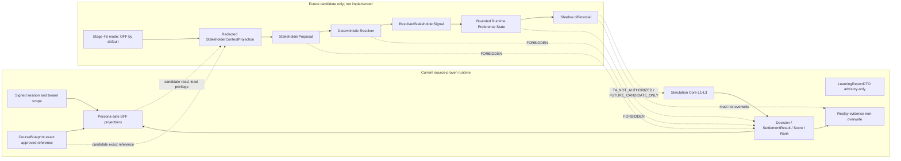

# STK Plane Impact Graph

## Scope

This static impact map was assessed at source anchor
`1a13d81a43f667d80d3da2eaffe8aae8e48b45f8` and revalidated against current
master `050fcd5093b2edf9612ee297e639c48329613ae4`. It does not prove that a
Stakeholder Plane exists or executes. CodeGraph call relationships are source
navigation evidence; Graphify clusters are impact hints. Dynamic wiring
remains `UNKNOWN` until a later executable gate.

## Current and Candidate Planes



## Impact Matrix

| Area                | Current fact                                                   | Future candidate impact                                                 | Confidence                                           |
| ------------------- | -------------------------------------------------------------- | ----------------------------------------------------------------------- | ---------------------------------------------------- |
| Identity and tenant | Repository ports and BFF DTOs carry tenant IDs                 | Context must derive tenant from authenticated scope                     | `SOURCE_PROVEN` / future edge `INFERRED`             |
| Team and role       | Team IDs and role slots exist; Student result is team-scoped   | Optional target cohort may narrow to team/role but never broaden access | `SOURCE_PROVEN` / `INFERRED`                         |
| CourseBlueprint     | Exact tenant/id/version/digest lifecycle exists                | Read-only exact reference; mode binding needs a new version and gate    | `SOURCE_PROVEN` / `DOCUMENTED_ONLY`                  |
| Teacher             | Teacher BFF has bounded operational and Replay summary         | Candidate review/diagnostic surface only                                | `SOURCE_PROVEN` / `INFERRED`                         |
| Student             | Student BFF strips `state_true` and carries forbidden fields   | At most approved redacted narrative; no private memory                  | `SOURCE_PROVEN` / `INFERRED`                         |
| Admin               | Tenant Admin summary is tenant-scoped                          | Status/audit metadata, not unrestricted content                         | `SOURCE_PROVEN` / `INFERRED`                         |
| Learning Evidence   | Current report is advisory and not a formal grade              | Candidate input requires Teacher confirmation in Program D              | `SOURCE_PROVEN` / `DOCUMENTED_ONLY`                  |
| AI Advisory         | Coach/ModelCall contracts are advisory-only                    | Proposal generation may reuse stricter advisory boundary                | `SOURCE_PROVEN` / `DOCUMENTED_ONLY`                  |
| Run                 | Current Run carries exact tenant/course/scenario/parameter IDs | Plane OFF must not change Run input or lifecycle                        | `SOURCE_PROVEN` / candidate parity `DOCUMENTED_ONLY` |
| Replay              | Current evidence declares formal-result non-overwrite          | Official Replay provider calls must remain zero                         | `SOURCE_PROVEN` / provider rule `DOCUMENTED_ONLY`    |
| Settlement          | Simulation Core remains sole writer                            | No direct or indirect write from proposal/resolver/state                | `SOURCE_PROVEN`                                      |
| Shared contracts    | Existing DTO and advisory types are shared                     | Future candidate types may be needed                                    | Current `SOURCE_PROVEN`; need `UNKNOWN`              |

## Candidate Read Path

The narrowest future read path is:

```text
authenticated actor
-> tenant/course/run authorization
-> persona-safe projection
-> explicit field allowlist
-> de-identification and cohort aggregation
-> immutable context digest
-> Stakeholder Plane candidate
```

The source does not currently prove this composition. It is an `INFERRED`
design constraint derived from existing BFF and repository boundaries.

## Protected Write Paths

The following are always outside the Stakeholder Plane:

```text
RoleDecisionSection -> DecisionMergeCommit -> TeamConfirmation -> canonical Decision
locked Decision -> Simulation Core L1-L3 -> SettlementResult -> Score / Rank
locked formal inputs -> Replay evidence -> read-only report
ParameterSet / ScenarioPackage / CourseBlueprint lifecycle authorities
```

No proposal, resolved signal, private memory, model output, or runtime
preference state may enter those writer paths directly.

## Current Closure And Collision Forecast

C2 and C3 are `CLOSED_AND_CURRENT` at the revalidated master, and their
execution locks are released. M0 is adopted as a documentation-only baseline;
M1 remains a separate isolated reference-POC lane and is not an active runtime
dependency. STK-S0 has zero current product-file overlap.

Any future STK-S1 implementation must treat these resources as conflicts
requiring a separately authorized serial join:

- `packages/shared-contracts/**`;
- `services/api/src/server.ts`;
- `services/api/src/course-blueprint-authority.ts`;
- `services/api/src/teacher-course-blueprint-service.ts`;
- `services/api/src/role-workflow.ts`;
- `services/api/src/teacher-student-bff-dto.ts`;
- `apps/teacher/src/App.tsx`;
- `apps/student/src/App.tsx`;
- CourseBlueprint contract fixtures and contract tests;
- Role Workflow contracts and `tests/integration/role-workflow-endpoint.test.ts`;
- canonical Decision and formal confirmation paths;
- Run/Replay/Golden tests.

## Graph Limits

- `CG-009` found reusable scenario/BFF redaction patterns, not STK runtime.
- `GF-007` returned a weak candidate neighborhood and cannot establish semantic
  implementation.
- Static import/reference edges do not prove route registration, provider
  calls, feature-flag behavior, or runtime activation.
- The external Program M extract is `BASELINE_CANDIDATE / DOCUMENTED_ONLY`.
